## 1. `fprintf` 函数

```c:no-line-numbers
#include <stdio.h>
int fprintf(FILE * stream, const char * format, ...);

    功能：根据参数 format 字符串来转换并格式化数据，然后将结果输出到 stream 指定的文件中，指定出现字符串结束符 '\0'  为止。

    参数：
        stream：已经打开的文件
        format：字符串格式，用法和 printf() 一样

    返回值：
        成功：实际写入文件的字符个数
        失败：-1
```

## 2. `printf`/`sprintf`/`fprintf` 对比

**1. 函数原型对比**

```c:no-line-numbers
/* printf */
#include <stdio.h>
int printf(const char *const _Format, ...)

/* sprintf */
#include <stdio.h>
int sprintf(char *str, const char *format, ...)

/* fprintf */
#include <stdio.h>
int fprintf(FILE * stream, const char * format, ...)
```

```:no-line-numbers
1. 三者都是变参函数：即形参列表最后都是 "..."，
2. 三个函数的形参列表中，最后一个变参之前的固参，通常是格式描述串（可能包含格式匹配符）。
```

**2. 输出位置对比**

```c:no-line-numbers
/* printf 输出到屏幕  */
printf("hello"); // 只有一个固参（未包含格式匹配符的格式描述串）
printf("%s", "hello");
printf("ret = %d+%d\n", 10, 5);
printf("%d = %d%c%d\n", 10+5, 10, '+', 5);  

/* sprintf 输出到内存 buf 中 */
char buf[1024];   //缓冲区  
sprintf(buf, "%d = %d%c%d\n", 10+5, 10, '+', 5); 

/* fprintf 输出到磁盘文件中 */
FILE * fp = fopen();
fprintf(fp, "%d = %d%c%d\n", 10+5, 10, '+', 5);    
```

## 3. `fscanf` 函数

```c:no-line-numbers
#include <stdio.h>
int fscanf(FILE * stream, const char * format, ...)
    功能：从 stream 指定的文件读取字符串，并根据参数 format 字符串来转换并格式化数据。
    参数：
        stream：已经打开的文件
        format：字符串格式，用法和 scanf() 一样
    返回值：
        成功：参数数目，成功转换的值的个数
        失败：-1
```

**示例1：**

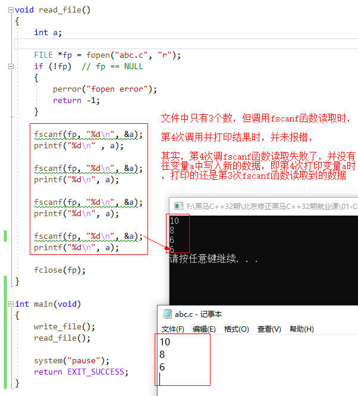

**示例2：**

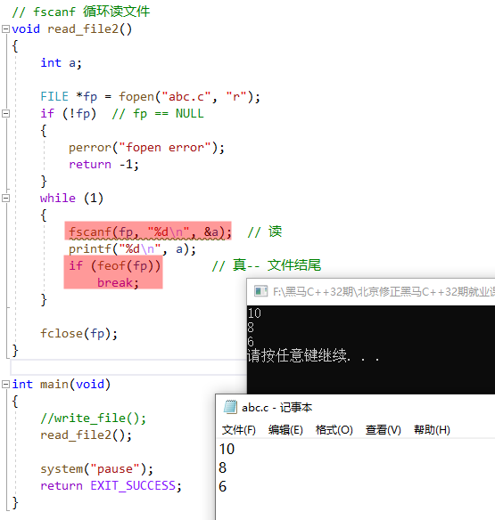

## 4. `scanf`/`sscanf`/`fscanf` 对比

**函数原型对比**

```c:no-line-numbers
/* scanf */
#include <stdio.h>
int scanf(const char *const _Format, ...)

/* sscanf */
#include <stdio.h>
int sscanf(const char *str, const char *format, ...)

/* fscanf */
#include <stdio.h>
int fscanf(FILE * stream, const char * format, ...)
```

## 5. 处理文本文件的函数：`fgetc`/`fputc`、`fgets`/`fputs`、`fprintf`/`fscanf` 

```:no-line-numbers
fgetc/fputc
fgets/fputs
fprintf/fscanf 
```

## 6. 处理二进制文件的函数（也可用来处理文本文件）

### 6.1 以数据块的方式向文件中写入内容：`fwrite`

```c:no-line-numbers
#include <stdio.h>
size_t fwrite(const void *ptr, size_t size, size_t nmemb, FILE *stream)
    功能：以数据块的方式给文件写入内容
    参数：
        ptr：准备写入文件数据的地址
        size： size_t 为 unsigned int 类型，此参数指定写入文件内容的块数据大小
        nmemb：写入文件的块数，写入文件数据总大小为：size * nmemb
        stream：已经打开的文件指针
    返回值：
        成功：实际成功写入文件数据的块数目，此值和 nmemb 相等
        失败：0

通常将参数 size 传 1. 将参数 nmemb 传实际写出字节数。依此可判断，当成功时，若返回值 == nmemb，说明数据写入成功。
```

**示例：**

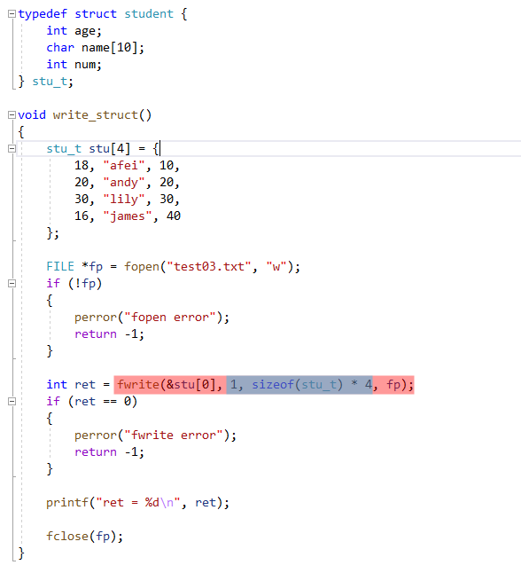

**`fwrite` 写入数据时的注意事项**


### 6.2 以数据块的方式从文件中读取内容：`fread`

```c:no-line-numbers
#include <stdio.h>
size_t fread(void *ptr, size_t size, size_t nmemb, FILE *stream)
    功能：以数据块的方式从文件中读取内容
    参数：
        ptr：存放读取出来数据的内存空间
        size： size_t 为 unsigned int 类型，此参数指定读取文件内容的块数据大小
        nmemb：读取文件的块数，读取文件数据总大小为：size * nmemb
        stream：已经打开的文件指针
    返回值：
        成功：实际成功读取到内容的块数，如果此值比 nmemb 小，但大于 0，说明读到文件的结尾。
        失败：0
        0: 表示读到文件结尾。【feof()】

通常将参数 size 传 1. 将参数 nmemb 传欲读出的字节数。
```

**示例：**

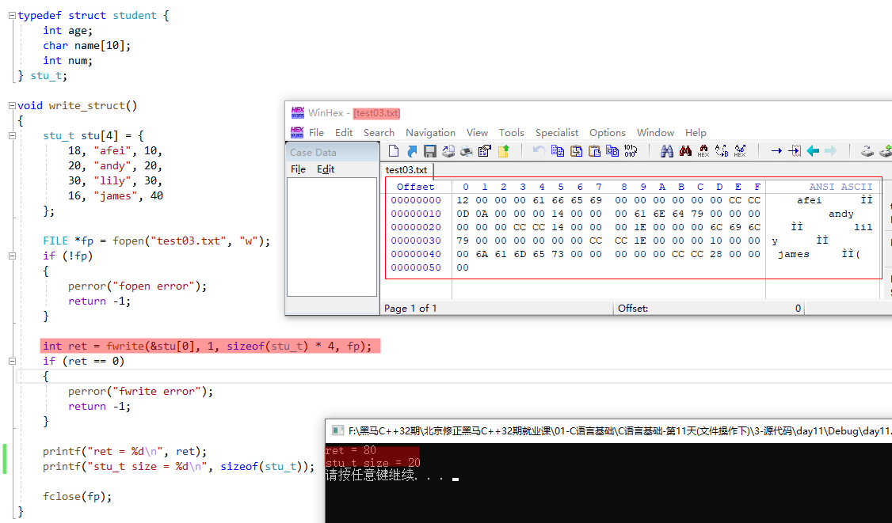

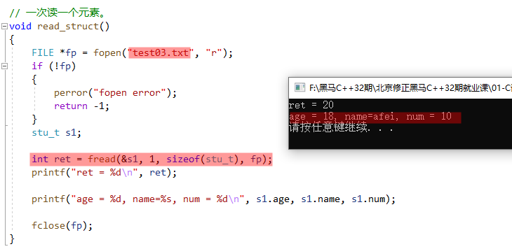

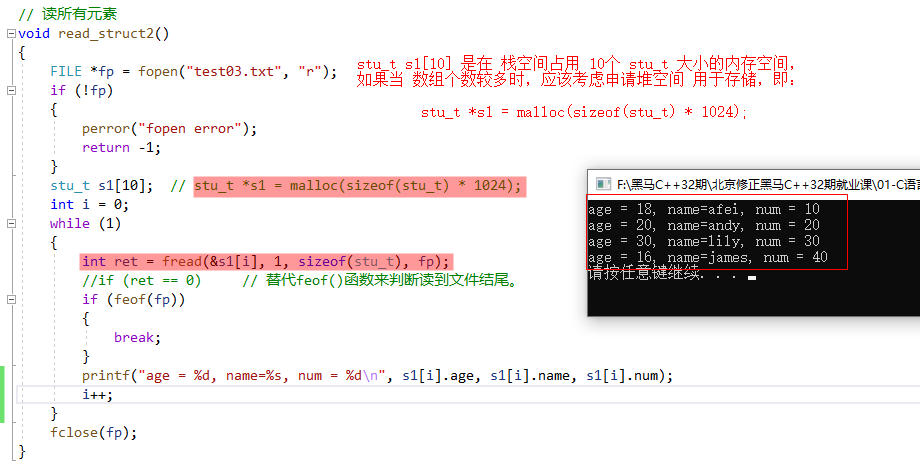

### 6.3 案例：文件拷贝

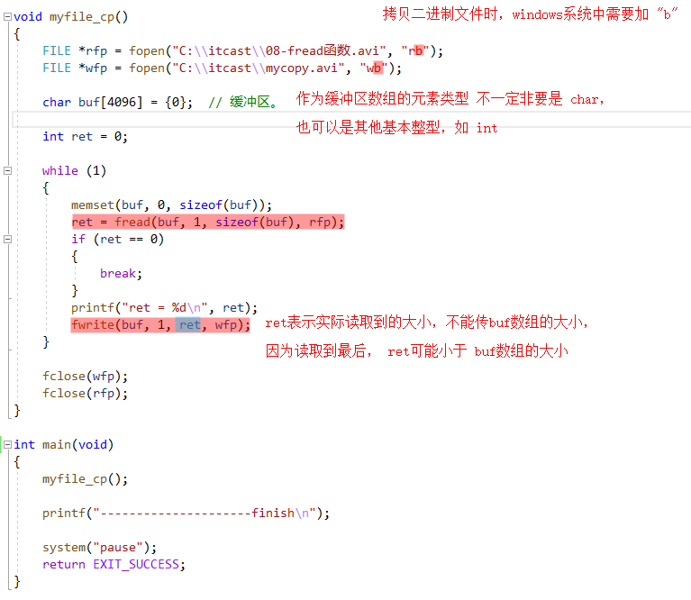

## 7. 文件随机读写

### 7.1 移动文件读写指针：`fseek`

```c:no-line-numbers
#include <stdio.h>
int fseek(FILE *stream, long offset, int whence);
    参1：文件
    参2：
        偏移量（矢量，+ 向后，- 向前）
        根据 whence 来移动的位移数（偏移量），可以是正数，也可以负数，
        如果是正数，则相对于 whence 向右（后）移动。如果向右（后）移动的字节数超过了文件末尾，再次写入时将增大文件尺寸；
        如果是负数，则相对于 whence 向左（前）移动。如果向左（前）移动的字节数超过了文件开头，则返回失败。
    参3：    
        SEEK_SET：文件开头位置
        SEEK_CUR：当前位置
        SEEK_END：文件结尾位置
    返回值： 
        成功： 0 
        失败：-1
```

### 7.2 获取文件读写指针的位置：`ftell`

```c:no-line-numbers
#include <stdio.h>
long ftell(FILE *stream);
    返回：从文件当前读写位置到起始位置（文件开头）的偏移量。

注意：可以借助 ftell(fp) + fseek(fp, 0, SEEK_END); 来获取文件大小。
```

### 7.3 将文件读写指针移动到文件开头（回卷）：`rewind`

```c:no-line-numbers
#include <stdio.h>
void rewind(FILE *stream);

回卷文件读写指针。将读写指针移动到起始位置（文件开头）。
```

### 7.4 示例：`fseek`、`ftell`、`rewind` 的使用 & 获取文件大小

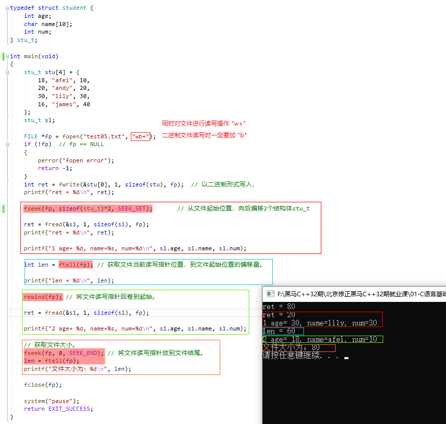

### 7.5 一个文件内只有一个文件读写指针

```:no-line-numbers
在一个文件内只有一个文件读写指针，即文件读和写时所用到的指针是同一个。
```

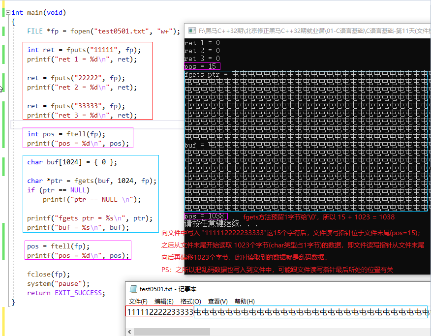

## 8. `Linux` 和 `windows` 文件区别

```:no-line-numbers
1. 对于二进制文件操作，Windows 使用 "b"， Linux 下二进制和文本没区别。

2. windows 下，回车 \r，换行 \n。 \r\n， Linux 回车换行 \n

3. 对文件指针，
    先写后读。windows 和 Linux 效果一致。
    先读后写。Linux 无需修改。windows 下需要在写操作之前添加 fseek(fp, 0, SEEK_CUR); 来获取文件读写指针，使之生效。
```

**示例：`windows` 下先读后写的问题与解决方式**

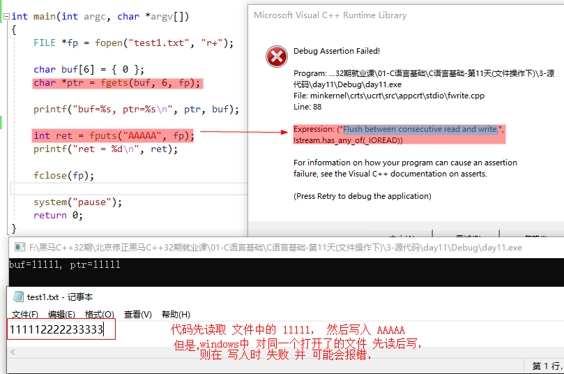

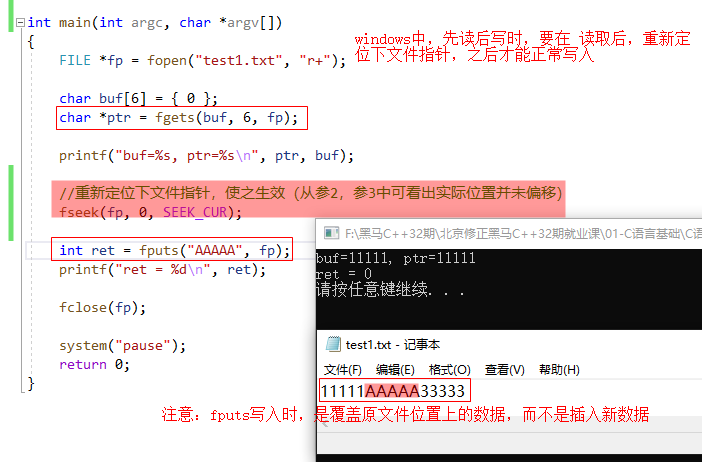

## 9. 获取文件状态属性信息：`int stat(const char *path, struct stat *buf)`

```c:no-line-numbers
#include <sys/types.h>
#include <sys/stat.h>
int stat(const char *path, struct stat *buf);
    功能：获取文件状态信息
    参数：
        path：文件路径名
        buf：保存文件信息的结构体
    返回值：
        成功： 0
        失败：-1
```

**保存文件状态的结构体 `stat`**

```c:no-line-numbers
struct stat {
    dev_t         st_dev;       // 文件的设备编号
    ino_t         st_ino;       // 节点
    mode_t        st_mode;      // 文件的类型和存取的权限
    nlink_t       st_nlink;     // 连到该文件的硬连接数目，刚建立的文件值为1
    uid_t         st_uid;       // 用户ID
    gid_t         st_gid;       // 组ID
    dev_t         st_rdev;      // (设备类型)若此文件为设备文件，则为其设备编号
    off_t         st_size;      // 文件字节数(文件大小)
    unsigned long st_blksize;   // 块大小(文件系统的I/O 缓冲区大小)
    unsigned long st_blocks;    // 块数
    time_t        st_atime;     // 最后一次访问时间
    time_t        st_mtime;     // 最后一次修改时间
    time_t        st_ctime;     // 最后一次改变时间(指属性)
};
```

**示例：**

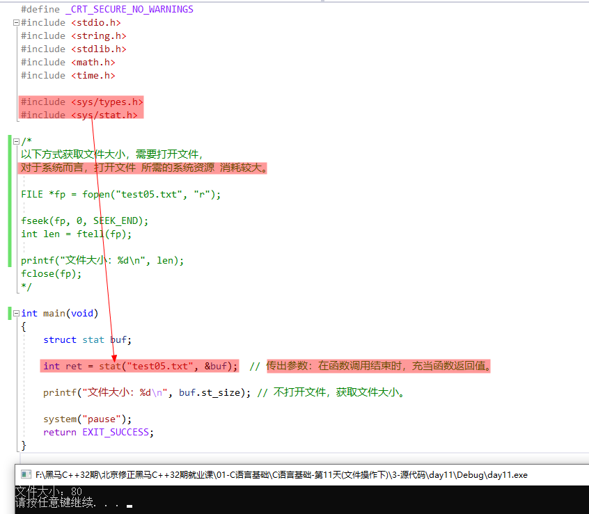

## 10. 删除文件：`remove`

```c:no-line-numbers
#include <stdio.h>
int remove(const char *pathname);
    参数：
        pathname：文件名
    返回值：
        成功： 0
        失败：-1
```

## 11. 重命名文件：`rename`

```c:no-line-numbers
#include <stdio.h>
int rename(const char *oldpath, const char *newpath);
    功能：把 oldpath 的文件名改为 newpath
    参数：
        oldpath：旧文件名
        newpath：新文件名
    返回值：
        成功： 0
        失败：-1
```

## 12. 文件缓冲区（预读入、缓输出）

```:no-line-numbers
ANSI C 标准采用 “缓冲文件系统” 处理数据文件。
所谓缓冲文件系统，是指系统自动地在内存区，为程序中每一个正在使用的文件开辟一个文件缓冲区，
从内存向磁盘输出数据，必须先送到内存中的缓冲区，装满缓冲区后，才一起送到磁盘去。
如果从磁盘向计算机读入数据，则一次从磁盘文件将一批数据输入到内存缓冲区（充满缓冲区），
然后再从缓冲区逐个地将数据送到程序数据区（给程序变量）
```

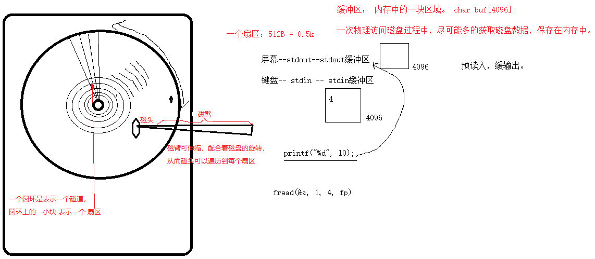

### 12.1 缓冲区刷新（行缓冲、全缓冲、无缓冲、隐式回收）

```:no-line-numbers
标准输出 -- stdout文件（磁盘） -- 标准输出缓冲区（内存） 
    写给屏幕的数据，都是先存缓冲区中，由缓冲区一次性刷新到物理设备（屏幕）

标准输入 -- stdin文件（磁盘） -- 标准输入缓冲区（内存）  
    从键盘读取的数据，直接读到缓冲区中，由缓冲区给程序提供数据。
```

```:no-line-numbers
行缓冲：
    如 printf(); 
    遇到 \n 就会将缓冲区中的数据刷新到物理设备上。

全缓冲：
    如 文件。 
    缓冲区存满，数据刷新到物理设备上。

无缓冲：
    如 perror。 
    缓冲区中只要有数据，就立即刷新到物理设备。

文件关闭时，缓冲区会被自动刷新。  

程序终止后，进行隐式回收：
1. 关闭文件；
2. 刷新缓冲区；
3. 释放 malloc。
```

**示例：**

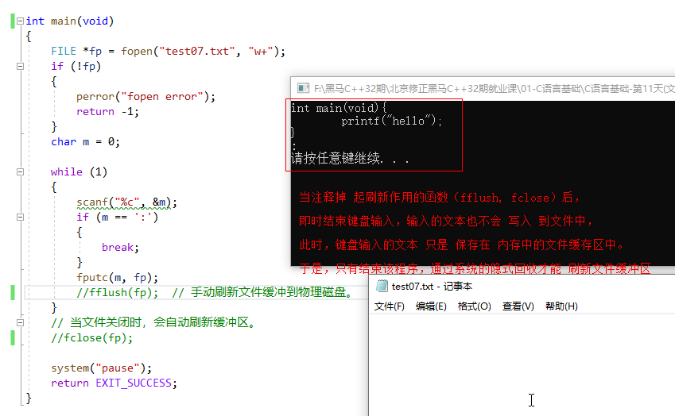

### 12.2 使用缓冲区的优势

```:no-line-numbers
1. 减少了对硬盘的读写次数，提高了硬盘的寿命；
2. 缓冲区位于内存中，读写内存 较 读写硬盘 的效率更高，即提高了读写效率。
```

### 12.3 手动刷新缓冲区（实时刷新）：`int fflush(FILE *stream);`

```c:no-line-numbers
#include <stdio.h>
int fflush(FILE *stream);
    功能：刷新缓冲区，让缓冲区的数据立马写到文件中。
    参数：
        stream：文件指针
    返回值：
        成功： 0
        失败：-1
```

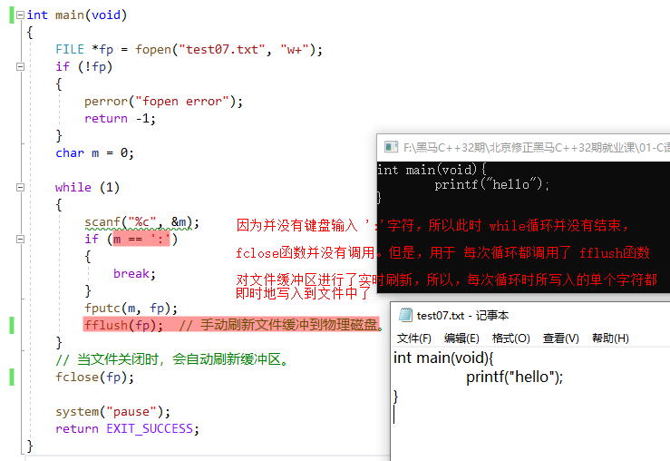