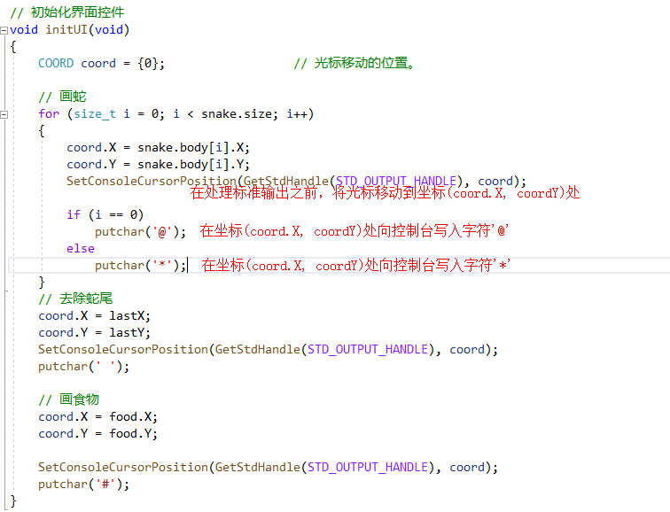
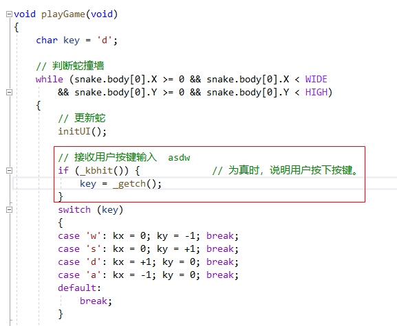
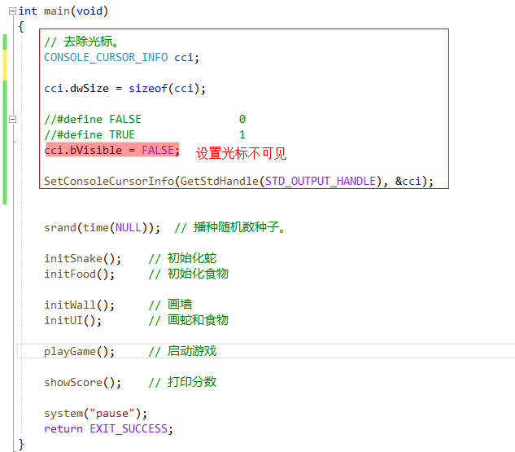

## 1. 修改控制台光标位置：`SetConsoleCursorPosition`

```c:no-line-numbers
#include <conio.h>   // conio --> console io ： 控制台 输入/输出
#include <Windows.h>
BOOL SetConsoleCursorPosition(HANDLE hConsoleOutput, COORD dwCursorPosition)
    作用： 
        在处理 hConsoleOutput 指定的输出类型之前（如处理标准输出 or 标准错误之前），将光标移动到位置 dwCursorPosition 处

    参数：
        HANDLE 类型： 
            指定控制台的处理对象（可以是标准输入 or 标准输出 or 标准错误）
            可通过 GetStdHandle 函数指定 HANDLE
                GetStdHandle(STD_INPUT_HANDLE)  获取标准输入对应的 HANDLE
                GetStdHandle(STD_OUTPUT_HANDLE) 获取标准输出对应的 HANDLE
                GetStdHandle(STD_ERROR_HANDLE)  获取标准错误对应的 HANDLE
        
        COORD类型： 
            COORD 是 Windows API 中定义的一种结构，表示一个字符在控制台屏幕上的坐标
                typedef struct _COORD {
                    SHORT X;
                    SHORT Y;
                }COORD;

    返回值：
        BOOL 类型： typedef int   BOOL;
```



## 2. 不回显地接收用户输入：`getch`

```c:no-line-numbers
#include <conio.h>
int _getch(void)
    功能：
        从控制台无回显地接收一个键盘输入字符
        所谓回显，就是如 getchar 函数那样，在接收到一个键盘输入字符后，还会把接收到的字符打印在控制台上显示出来。
        而 _getch 函数仅接收键盘输入的字符，并不会打印显示到控制台上。

    用法：
        char key = _getch();

    返回值：
        读取的字符 ASCII 码

注意：如果调用 getch() 编译时出错，尝试使用 _getch();
```

## 3. 以非阻塞方式检查当前是否有键盘输入：`kbhit`

```c:no-line-numbers
#include <conio.h>
int _kbhit(void)
    功能：
        非阻塞地判断用户输入。
        如 scanf 或 getchar 函数调用时，会阻塞并等待用户输入；
        而通过 _kbhit 结合 _getch 或 getchar 函数，可实现非阻塞地接收用户输入：
            if(_kbhit()) {
                char ch = _getch();
            }

    返回值：
        有用户输入，返回 “真”，
        否则返回 “假”。

注意：如果调用 kbhit() 编译时出错，尝试使用 _kbhit();
```



## 4. 设置控制台光标属性：`SetConsoleCursorInfo`

```c:no-line-numbers
#include <conio.h>
#include <Windows.h>
BOOL SetConsoleCursorInfo(HANDLE hConsoleOutput, const CONSOLE_CURSOR_INFO *lpConsoleCursorInfo)
    作用：
        在处理 hConsoleOutput 指定的输出类型之前（如处理标准输出 or 标准错误之前），设置光标属性信息

    参数：
        HANDLE 类型：
            指定控制台的处理对象（可以是标准输入 or 标准输出 or 标准错误）
            可通过 GetStdHandle 函数指定 HANDLE
                GetStdHandle(STD_INPUT_HANDLE)  获取标准输入对应的 HANDLE
                GetStdHandle(STD_OUTPUT_HANDLE) 获取标准输出对应的 HANDLE
                GetStdHandle(STD_ERROR_HANDLE)  获取标准错误对应的 HANDLE
        
        CONSOLE_CURSOR_INFO 类型：
            CONSOLE_CURSOR_INFO 描述终端光标信息
                typedef struct _CONSOLE_CURSOR_INFO {
                    DWORD  dwSize; // 光标大小
                    BOOL   bVisible; // 光标是否可见
                } CONSOLE_CURSOR_INFO;

    返回值：
        BOOL 类型： typedef int   BOOL;
```



## 5. 参考源码

[贪吃蛇小游戏](https://github.com/zengkaiqiang562/JavaGuide-Demo/blob/main/docs/zkq/c_and_cpp/_1_c-basic/%E8%B4%AA%E5%90%83%E8%9B%87%E5%B0%8F%E6%B8%B8%E6%88%8F/snake.h)