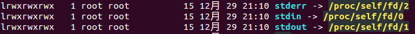
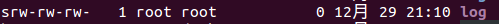
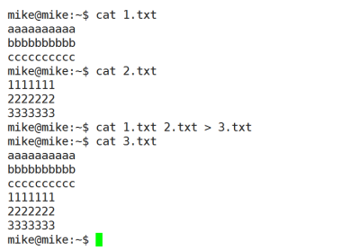

## 1. `Linux` 内核版本

### 1.1 什么是内核

内核（`kernel`）是系统的心脏，是运行程序和管理像磁盘和打印机等硬件设备的核心程序，它提供了一个在裸设备与应用程序间的抽象层。

可以把内核简单地理解为：**除去应用程序之外的操作系统**。

### 1.2 内核源码网址：`http://www.kernel.org`

内核源码网址是 [http://www.kernel.org](http://www.kernel.org)，所有来自全世界的对 `Linux` 源码的修改最终都会汇总到这个网站。然后由 `Linus` 领导的开源社区对其进行甄别和修改最终决定是否进入到 `Linux` 主线内核源码中。

### 1.3 内核版本分类

#### 1.3.1 稳定版（`Ubuntu-XX.04`）& 测试版（`Ubuntu-XX.10`）

`Linux` 内核版本分为稳定版和开发版：

1. 4月份发布的版本是稳定版，如 `Ubuntu-14.04`
   
2. 10月份发布的版本是测试版，如 `Ubuntu-14.10`

#### 1.3.2 长期支持版(`Ubuntu-双数-XX`) & 短期支持版(`Ubuntu-单数-XX`)

从 `Ubuntu-10` 开始，区分双数版本和单数版本：

1. 双数版本，如 `Ubuntu-14` 为长期支持版本，即系统中的软件服务的有效期是3年（2016起为5年）
   
2. 而单数版本，如 `Ubuntu-13` 为短期支持版本，即系统中的软件服务的有效期是1年

#### 1.3.2 推荐使用版本：长期支持的稳定版（`Ubunt-双数.04`）

作为普通用户下载 `Linux` 操作系统时，最好下载4月份版本的双数版本。

## 2. `Linux` 目录结构

### 2.1 根目录：`/`

```:no-line-numbers
根目录，一般根目录下只存放目录，在 Linux 下有且只有一个根目录。
```

### 2.2 放置可执行文件的目录：`/bin`、`/usr/bin`

```:no-line-numbers
可执行二进制文件的目录，
如常用的命令文件 ls、tar、mv、cat 等。
```

### 2.3 放置系统启动相关文件的目录：`/boot`

```:no-line-numbers
放置 linux 系统启动时用到的一些文件，
如:
    Linux 的内核文件：/boot/vmlinuz
    系统引导管理器：/boot/grub
```

### 2.4 放置设备文件的目录：`/dev`

```:no-line-numbers
存放 linux 系统下的设备文件，访问该目录下某个文件，相当于访问某个设备。
常用的是挂载光驱：
    如执行命令 "mount /dev/cdrom /mnt" 
    将 /dev/cdrom 表示的光驱设备挂载到目录 /mnt 上，于是，访问目录 /mnt 即访问光驱内容
```

### 2.5 放置配置文件的目录：`/etc`

```:no-line-numbers
系统配置文件存放的目录，
不建议在此目录下存放可执行文件，
重要的配置文件有:
    /etc/inittab、
    /etc/fstab、
    /etc/init.d、
    /etc/X11、
    /etc/sysconfig、
    /etc/xinetd.d

安装的应用程序的配置文件也是放在该目录下的。
```

### 2.6 放置函数库文件的目录：`/lib`、`/usr/lib`、`/usr/local/lib`

```:no-line-numbers
系统使用的函数库的目录。
程序在执行过程中，需要调用一些额外的参数时，需要函数库的协助。
```

### 2.7 放置系统异常时遗失的片段：`/lost+fount`

```:no-line-numbers
系统异常产生错误时，会将一些遗失的片段放置于此目录下。
```

### 2.8 挂载目录：`/mnt`、`/media`

```:no-line-numbers
光盘默认挂载点，通常光盘挂载于 /mnt/cdrom 下。（也不一定，可以选择任意位置进行挂载）

"/mnt", "/media", "/dev" 三者的区别:

1. /mnt 是被系统管理员使用，手动挂载一些临时媒体设备的目录。

2. /media 是自动挂载的目录。
   比如我们的 U 盘插在 ubuntu 下时会自动挂载。即会在 /media 下生成一个目录，这个目录就是 U 盘所在目录（或者说文件）

3. /dev 不是存放设备的驱动程序，而是作为访问外部设备文件的接口。
   比如，我们的 U 盘插入到 linux 系统后，执行 "fdisk -l" 查看分区，显示文件为 /dev/sda1，
   此时，若我们要将 u 盘挂载到 /mnt/usb1 下，执行 "mount /dev/sda1 /mnt/usb1" 即可。
```

### 2.9 第三方软件的安装目录：`/opt`

```:no-line-numbers
给主机额外安装软件所摆放的目录。如作为 QQ、迅雷 等第三方应用程序的安装目录。
```

### 2.10 放置内存中数据的目录：`/proc`

```:no-line-numbers
此目录的数据都在内存中，如系统核心，外部设备，网络状态。（由于数据都存放于内存中，所以不占用磁盘空间）
进程相关的数据都存放在该目录下。

比较重要的目录有：
/proc/cpuinfo
/proc/interrupts
/proc/dma
/proc/ioports
/proc/net/* 
```

### 2.11 `root` 用户的家目录：`/root`

```:no-line-numbers
系统管理员 root 的家目录（家目录的学名为：宿主目录）
```

### 2.12 放置 `root` 用户使用的可执行文件：`/sbin`、`/usr/sbin`、`/usr/local/sbin`

```:no-line-numbers
放置系统管理员使用的可执行命令，如 fdisk、shutdown、mount 等。
与 /bin 不同的是，这几个目录是给系统管理员 root 使用的命令，一般用户只能 "查看"，而不能设置和使用。
```

### 2.13 放置临时文件的目录：`/tmp`

```:no-line-numbers
给一般用户或正在执行的程序，临时存放文件的目录。
任何人都可以访问；
重要数据不可放置在此目录下。
```

### 2.14 放置服务启动后所访问数据的目录：`/srv`

```:no-line-numbers
服务启动之后需要访问的数据目录。
如 www 服务需要访问的网页数据存放在 /srv/www 内。
```

### 2.15 应用程序存放目录：`/usr`（`unix software resource`）

```:no-line-numbers
unix software resource：Unix软件系统资源目录，即应用程序存放目录。其中：

/usr/bin：存放应用程序，
/usr/share：存放共享数据，
/usr/lib：存放不能直接运行的，却是许多程序运行所必需的一些函数库文件。
/usr/local：存放软件升级包。
/usr/share/doc：系统说明文件存放目录。
/usr/share/man：程序说明文件存放目录
/user/include：存放头文件
    
如：
头文件 stdio.h 源码存放在 /usr/include 目录下；
头文件 stdio.h 所生成的库文件 libc.so 存放在 /usr/lib/x86_64-linux-gnu 目录下。
```

### 2.16 放置系统执行时变化数据的目录：`/var`

```:no-line-numbers
放置系统执行过程中经常变化的文件，如：
/var/log：随时更改的日志文件，
/var/log/message：所有的登录文件存放目录，
/var/spool/mail：邮件存放的目录，
/var/run：程序或服务启动后，其 PID 存放在该目录下。
```

## 3. `Linux` 文件分类

通常，`Unix/Linux` 系统中常用的文件类型有 `7` 种：

```:no-line-numbers
普通文件
目录文件
套接字文件
管道文件
软链接文件
字符设备文件
块设备文件

其中，字符设备文件和块设备文件统称为设备文件。
```

形如 `crw-rw----` 中的第1个字符用于文件分类：

```:no-line-numbers
- 表示普通文件
d 表示目录文件
s 表示套接字文件（多用于进程间的通信）
p 表示管道文件（通过命令 mkfifo 可创建管道文件）
l 表示软链接文件（相当于 windows 中的快捷方式）
c 表示字符设备文件（字符设备的存取以一个字符为单位）
b 表示块设备文件（块设备的存取以字符块为单位）
```

**示例：**



> 如上图，标准输入文件 `stdin`、 标准输出文件 `stdout`、 标准错误文件 `stderr` 都是软链接文件。



> 如上图，文件 `log` 是套接字文件。套接字文件可用于网络通信。

## 4. 查看帮助文档

### 4.1 通过选项 `--help` 查看帮助文档

```:no-line-numbers
执行 "命令名 --help" 可以查看大部分 Linux 命令自带的帮助信息，但是并不是所有命令都自带这个选项。
如我们想查看命令 ls 的用法：ls --help
```

### 4.2 通过命令 `man` 查看帮助文档

```:no-line-numbers
man 是 Linux 提供的一个手册，包含了绝大部分的命令、函数使用说明。

该手册分成很多章节（section），使用 man 时可以指定不同的章节来浏览不同的内容。

man 中各个 section 意义如下：
    1. Standard commands（标准命令）
    2. System calls（系统调用，如 open、write）
    3. Library functions（库函数，如 printf、fopen）
    4. Special devices（设备文件的说明，/dev 下各种设备）
    5. File formats（文件格式，如 passwd）
    6. Games and toys（游戏和娱乐）
    7. Miscellaneous（杂项、惯例与协定等，例如 Linux 档案系统、网络协定、ASCII 码；environ 全局变量）
    8. Administrative Commands（管理员命令，如 ifconfig）

执行命令 "man man" 可以查看 man 手册的使用说明

执行命令 "man ls" 可以查看命令 ls 的使用说明
（相当于执行 "man 1 ls"，其中 1 表示：指定在 man 手册的第1章内查找 ls 命令的使用说明 ）

执行命令 "man 3 printf" 可以查看 man手册第3章 中 库函数 printf 的使用说明
```

## 5. 通配符 `*` 与 `?`


```:no-line-numbers
如上图：
* 通配 多个 字符
? 通配 1个 字符
```

## 6. 输出重定向 `>` 与 `>>`

`Linux` 允许将命令执行结果重定向到一个文件，本应显示在终端上的内容保存到指定文件中，如：

```sh:no-line-numbers
# test.txt 如果不存在，则创建，存在则覆盖其内容
ls > test.txt
```

```:no-line-numbers
输出重定向 ">" 会覆盖原来的内容， 
输出重定向 ">>" 则会追加到文件的尾部。
```

## 7. 查看或者合并文件内容：`cat`



## 8. 拷贝文件：`cp`

```:no-line-numbers
-a
    该选项通常在复制目录时使用，
    它保留链接、文件属性，并递归地复制目录，
    简单而言，保持文件原有属性。
-f
    覆盖已经存在的目标文件而不提示
-i
    交互式复制，在覆盖目标文件之前将给出提示要求用户确认
-r
    若给出的源文件是目录文件，则 cp 将递归复制该目录下的所有子目录和文件，目标文件必须为一个目录名。
-v
    显示拷贝进度
```

## 9. 移动或重命名文件：`mv`

```:no-line-numbers
可以使用 mv 命令来移动文件或目录；也可以重命名文件或目录。
```

## 10. 获取文件类型：`file`

```:no-line-numbers
Linux 系统文件类型不是根据文件扩展名分类的，通过 file 命令可以确认文件具体类型。
```