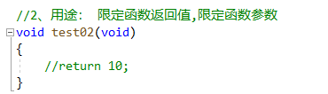

## 1. 理解数据类型（固定大小内存的别名）

```:no-line-numbers
1. 数据类型是为了更好进行内存的管理，让编译器能确定分配多少内存；
2. 类型是对数据的抽象；
3. 类型相同的数据具有相同的表示形式、存储格式以及相关操作；
4. 程序中所有的数据都必定属于某种数据类型；
5. 数据类型可以理解为创建变量的模具：固定大小内存的别名。
```

## 2. `typedef` 的作用

`typedef` 的作用：

```:no-line-numbers
1. 简化 struct 关键字
2. 区分数据类型
3. 提高移植性
```

### 2.1 简化 `struct` 关键字


> 如上图，使用 `typedef` 可以简化 `struct` 关键字。

### 2.2 更方便地区分数据类型


> 如上图，使用 `typedef` 可以更方便地区分数据类型。

### 2.3 提高可移植性


```:no-line-numbers
如上图，若以后想将 int 类型替换为 long 类型，那么只需将 "typedef int  MYINT;" 修改为 "typedef long  MYINT;" 即可，
而不需要挨个去查找 int 类型的变量进行修改，从而提高了可移植性。
```

## 3. `void`（无类型）的使用

### 3.1 不能通过 void（无类型）创建变量


### 3.2 `void` 的使用场景：限定函数的返回值或参数



### 3.3 万能指针：`void *`


## 4. `sizeof` 的使用

### 4.1 `sizeof` 是一个操作符，不是函数


### 4.2 `sizeof` 的返回值类型：`unsigned int`（无符号整型）


### 4.3 `sizeof` 统计数组长度时的注意事项


## 5. 变量（既能读又能写的内存对象）

既能读又能写的内存对象，称为变量。

变量名的本质：一段连续内存空间的别名。

```:no-line-numbers
a. 程序通过变量来申请和命名内存空间 int a = 0；
b. 通过变量名访问内存空间；
c. 不是向变量名读写数据，而是向变量所代表的内存空间中读写数据
```

### 5.1 变量的修改方式：直接修改 & 间接修改（通过指针修改）

**示例1：**


**示例2：**


## 6. 内存分区


### 6.1 运行前的分区（代码区、数据区、未初始化数据区）

```:no-line-numbers
在没有运行程序前，也就是说程序没有加载到内存前，可执行程序内部已经分好 3 段信息，分别为：
1. 代码区（text）
2. 数据区（data）
3. 未初始化数据区（bss）

有些人直接把 data 和 bss 合起来叫做静态区或全局区。

代码区特点：共享、只读。

疑问：常量是存放在 data 段，还是 rodata 段，或者是可以有条件地选择存放在二者之一中？
```

### 6.2 运行后的分区（增加了栈区、堆区）

```:no-line-numbers
程序在加载到内存前，代码区和全局区（data 和 bss）的大小就是固定的，程序运行期间不能改变。
然后，运行可执行程序，操作系统把物理硬盘程序 load（加载）到内存。
除了根据可执行程序的信息分出代码区（text）、数据区（data）和未初始化数据区（bss）之外，还额外增加了栈区、堆区。
```

### 6.3 栈区的注意事项

**调用函数时，不要返回局部变量的地址**，因为栈中的局部变量在函数执行完毕后就被释放了。

```:no-line-numbers
这里说的局部变量的地址，指的是栈空间中的地址。
如果该局部变量是一个指向堆空间地址的指针（malloc），那么只要函数执行完毕后没有 free，
就可以返回该局部变量的值（即指针变量的内容，而不是指针变量的地址）
```

### 6.4 堆区分配内存的注意事项

**示例1：**


**示例2：**


如上代码所示，若主调函数（`test02`）中没有分配内存，被调函数（`allocateSpace02`）需要 **用更高级的指针去操作低级指针**，进行分配内存。

## 7. `static` 和 `extern`

### 7.1 `static` 修饰局部变量（只改变生命周期，不改变作用域）


### 7.2 `extern` 在声明局部变量时的作用

```:no-line-numbers
如下代码所示：
定义全局变量时，默认都隐式地添加了关键字 extern。表示当前文件中定义的全局变量可以被其他文件访问到。
当其他文件中需要访问当前文件中定义的全局变量时，还需要先通过 extern 关键字声明变量，将全局变量的作用域 "扩展" 到当前文件中来。
```


```:no-line-numbers
如下代码所示：
如果使用 extern 关键字声明变量时，在其他文件中未找到同名的全局变量，那么程序报错。
```


### 7.3 `static` 修饰全局变量（不能被其他文件访问到）


## 8. 常量

### 8.1 `const` 修饰的全局变量（保存在常量区，不可以间接修改）


### 8.2 `const` 修改的局部变量（仍然保存在栈中，可以间接修改）


### 8.3 字符串常量

**示例1：**


**示例2：**


**注意：**

```:no-line-numbers
ANSI C（即 C89）标准并没有制定出字符串常量是否可以修改的标准，
根据编译器不同，可能最终结果也是不同的。所以，尽量不要去修改字符串常量！
```