## 1. 宏函数

```:no-line-numbers
如下代码所示， MYADD 称为宏函数。

宏函数的特点：
1. 宏函数需要加小括号修饰，保证运算的完整性；
2. 通常会将频繁、短小的函数写成宏函数；
3. 宏函数会比普通函数在一定程度上效率高，因为省去了普通函数入栈、出栈时间上的开销。

宏函数的优点可总结为：以空间换时间。
```

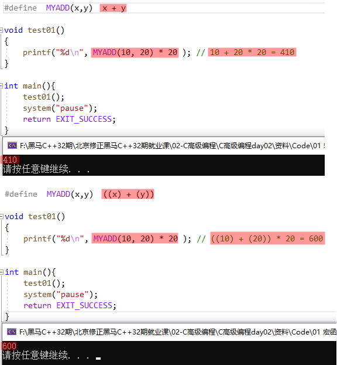

> 以上代码表示：宏函数需要加小括号修饰，以保证运算的完整性。

## 2. 栈（`stack`）

栈（`stack`）是现代计算机程序里最为重要的概念之一，几乎每一个程序都使用了栈，**没有栈就没有函数，没有局部变量**。

在经典的计算机科学中，栈被定义为一个特殊的容器，用户可以将数据压入栈中（入栈，或称为压栈，`push`），也可以将压入栈中的数据弹出（出栈，`pop`）。但是栈容器必须遵循一条规则：先入栈的数据最后出栈（`First In Last Out，FILO`）

**注意：**

```:no-line-numbers
在经典的操作系统中，栈总是向下增长的。即：压栈的操作使得栈顶的地址减小，出栈操作使得栈顶地址增大。
```

## 3. 栈帧

栈中保存了一个函数调用所需要维护的信息，这通常被称为 **栈帧（`Stack Frame`）** 或者 **活动记录（`Activate Record`）**。

### 3.1 栈帧中保存信息（即：函数调用过程所需的信息）

一个函数调用过程所需要的信息一般包括以下几个方面（即栈帧中保存的信息如下）：

```:no-line-numbers
1. 函数的返回地址；
2. 函数的参数；
3. 临时变量；
4. 保存的上下文：包括在函数调用前后需要保持不变的寄存器。
```

## 4. 调用惯例（`Calling Convention`）

### 4.1 什么是调用惯例

**主调函数** 和 **被调函数** 在函数调用时必须要有一致约定，才能正确的调用函数，这个约定我们称为 **调用惯例（`Calling Convention`）**。例如：

```:no-line-numbers
它们双方都一致的认为函数的参数是按照某个固定的方式压入栈中。如果不这样的话，函数将无法正确运行，即：
如果主调函数（函数调用方）在传递参数的时候先压入参数 a，再压入参数 b，而被调函数则认为先压入的是 b，后压入的是 a，
那么被调函数在使用 a，b 值时候，就会颠倒。
```

### 4.2 调用惯例的规定内容

#### 4.2.1 函数参数的传递方式和传递顺序

**函数参数的传递方式**

```:no-line-numbers
函数参数的传递有很多种方式：
1. 最常见的是通过栈传递，即：主调函数（函数调用方）将参数压入栈中，被调函数（函数自己）再从栈中将参数取出。
2. 另外，有些调用惯例还允许使用寄存器传递参数，以提高性能。
```

**函数参数的传递顺序**

```:no-line-numbers
对于有多个参数的函数，调用惯例还需要规定主调函数（函数调用方）将参数压栈的顺序：从左向右 or 从右向左。
```

以上，调用惯例需要规定：

```:no-line-numbers
1. 函数参数是通过栈传递，还是通过寄存器传递；
2. 以及当存在多个参数时，需要规定对参数列表的压栈顺序是从左向右，还是从右向左。
```

#### 4.2.2 栈的维护方式

```:no-line-numbers
在主调函数将参数压入栈中之后，（被调函数的）函数体会被调用，
函数体调用完毕后，需要将被压入栈中的参数全部弹出（出栈），以使得栈在函数调用前后保持一致。
这个弹出的工作（出栈）可以由主调函数（函数调用方）来完成，也可以由被调函数（函数自己）来完成。
```

以上，调用惯例需要规定：

```:no-line-numbers
出栈方是主调函数（函数调用方），还是被调函数（函数自己）。
```

#### 4.2.3 函数名称的修饰

```:no-line-numbers
为了在链接的时候对调用惯例进行区分，调用惯例需要要对函数本身（即被调函数）的名称进行修饰。
不同的调用惯例有不同的名称修饰策略。
```

以上，调用惯例需要规定：

```:no-line-numbers
函数名称的修饰策略。
```

### 4.3 `c/c++` 中的调用惯例：`cdecl`、`stdcall`、`fastcall`、`pascal`

|**调用惯例**|**出栈方**|**参数传递**|**名称修饰策略**|
|:-|:-|:-|:-|
|`cdecl`（默认）|主调函数（函数调用方）|从右至左参数入栈|下划线+函数名|
|`stdcall`|被调函数（函数本身）|从右至左参数入栈|下划线+函数名+`@`+参数字节数|
|`fastcall`|被调函数（函数本身）|前两个参数由寄存器传递，其余参数通过堆栈传递|`@`+函数名+`@`+参数的字节数|
|`pascal`|被调函数（函数本身）|从左至右参数入栈|较为复杂，参见相关文档|

```:no-line-numbers
如上表所示，在 C/C++ 中存在着多个调用惯例，而默认的调用惯例是 cdecl，即：任何一个没有显示指定调用惯例的函数，都默认是 cdecl 惯例。也就是说：
    int func(int a, int b);   等价于  int _cdecl func(int a, int b);

注意：
_cdecl 不是标准的关键字，在不同的编译器里可能有不同的写法，例如：gcc 里就不存在 _cdecl 这样的关键字，而是使用 __attribute__((cdecl))
```

**示例：不同调用惯例的函数名称修饰策略**

```c:no-line-numbers
// 1. cdecl 调用惯例：
int _cdecl _func(int a, int b);

// 2. stdcall 调用惯例：
int _stdcall _func@8(int a, int b);  // 其中 8 表示两个参数变量所占的总字节数是 8 字节（int 占 4 字节）
```

## 5. 变量在函数之间的传递分析

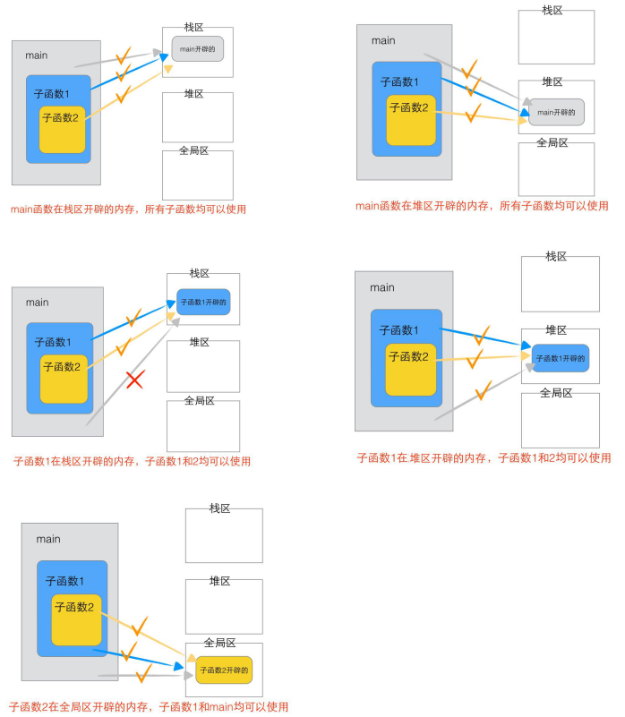

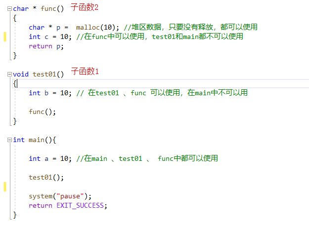

## 6. 栈的生长方向（从高地址向低地址扩展）

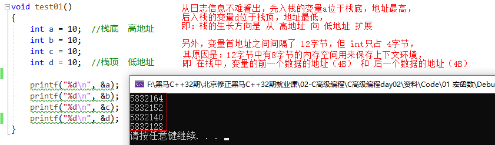

## 7. 数据的内存存放方式：小端对齐方式

```:no-line-numbers
如下代码所示：
对于 “高位字节数据存放在高地址；低位字节数据存放在低地址” 这种数据的内存存放方式，
称为：小端对齐方式（即高位数据对应高地址，低位数据对应低地址）

蓝色框的代码和打印日志表示：堆中的数据也是采用小端对齐方式存储的。

注意：并非所有的操作系统都采用小端对齐方式存储数据，有的操作系统可能会采用大端对齐方式。
```

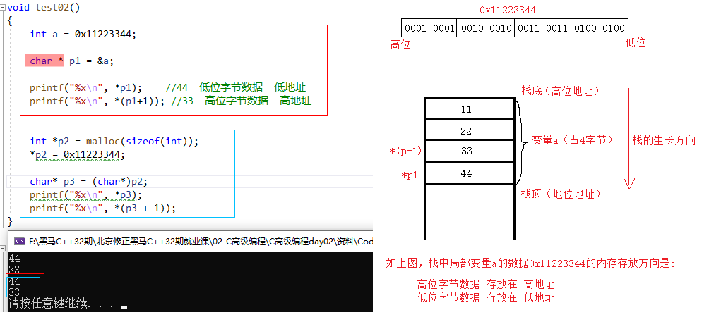

## 8. 空指针 & 野指针

### 8.1 不允许向 `NULL` 和非法地址写入数据

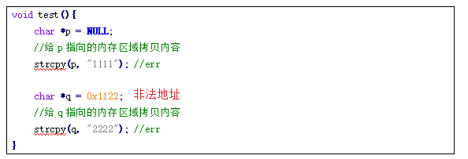

> 如上图，不允许向 `NULL` 和非法地址写入数据。

### 8.2 导致出现野指针的情况

#### 8.2.1 情况1：指针变量未初始化

```:no-line-numbers
任何指针变量刚被创建时不会自动成为 NULL 指针，它的缺省值是随机的，它会乱指一气。
所以，指针变量在创建的同时应当被初始化，要么将指针设置为 NULL，要么让它指向合法的内存。
```

#### 8.2.2 情况2：指针释放后未置空

```:no-line-numbers
有时指针在 free 或 delete 后未赋值 NULL，便会使人以为是合法的。
别看 free 和 delete 的名字（尤其是 delete），它们只是把指针所指的内存给释放掉，但并没有把指针本身干掉。
此时指针指向的就是 “垃圾” 内存。释放后的指针应立即将指针置为 NULL，防止产生 “野指针”。
```

#### 8.2.3 情况3：指针操作超越变量作用域

```:no-line-numbers
不要返回指向栈内存的指针或引用，因为栈内存在函数结束时会被释放。
```

#### 8.2.4 示例1：出现野指针的异常代码

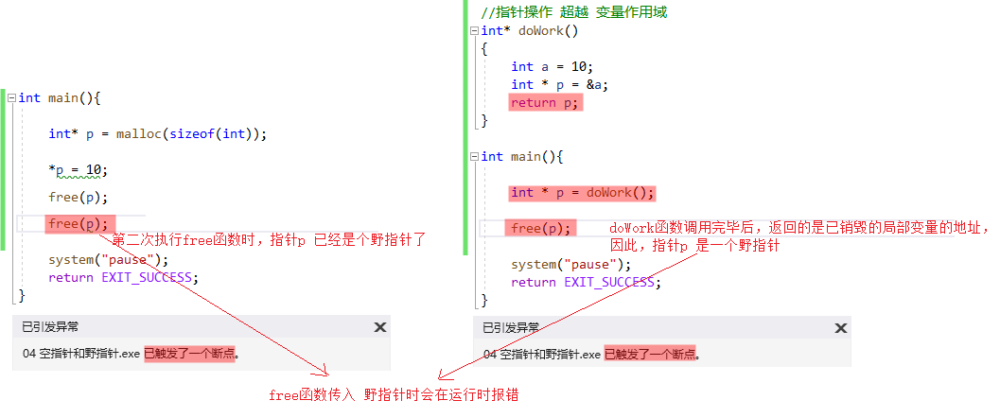

#### 8.2.5 示例2：`free` 函数传入空指针不会报错

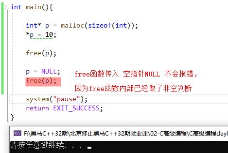

### 8.3 规避野指针的方式

> 操作野指针是非常危险的操作，应该规避野指针的出现。

#### 8.3.1 方式1：初始化指针变量时置为 `NULL`

```:no-line-numbers
指针变量一定要初始化为 NULL，因为任何指针变量刚被创建时不会自动成为 NULL 指针，它的缺省值是随机的。
```

#### 8.3.2 方式2：释放指针变量时置为 `NULL`

```:no-line-numbers
当指针 p 指向的内存空间释放时，没有设置指针 p 的值为 NULL。
delete 和 free 只是把内存空间释放了，但是并没有将指针 p 的值赋为 NULL。
通常判断一个指针是否合法，都是使用 if 语句测试该指针是否为 NULL。
```

## 9. 指针的步长

指针的步长涵盖两个方面的内容：

```:no-line-numbers
1. +1 之后跳跃的字节数；
2. 解引用所解出的字节数。
```

### 9.1 指针 `+1` 之后跳跃的字节数

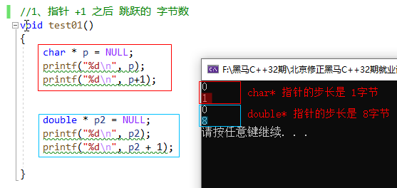

### 9.2 解引用解出的字节数

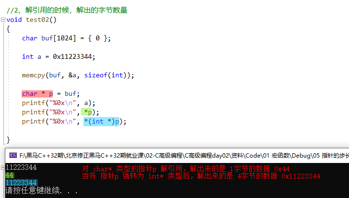

## 10. `offsetof` 宏函数（计算结构体成员相对于结构体首地址的偏移）

```c:no-line-numbers
#include <stddef.h>
#define offsetof(s,m) ((size_t)&(((s*)0)->m))
    功能：
        计算结构体 s 中的成员变量 m 相对于结构体首地址的偏移量（单位：字节）
    参数：
        s：结构体类型名称
        m：预计算偏移量的结构体成员变量
```

**示例：**

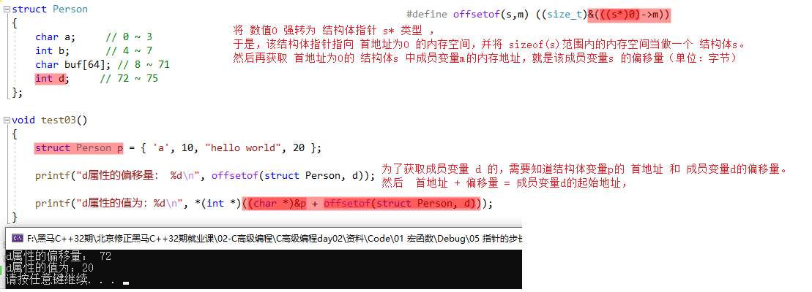

## 11. 指针做函数参数时的输入输出特性

### 11.1 输入特性：主调函数分配内存，被调函数使用

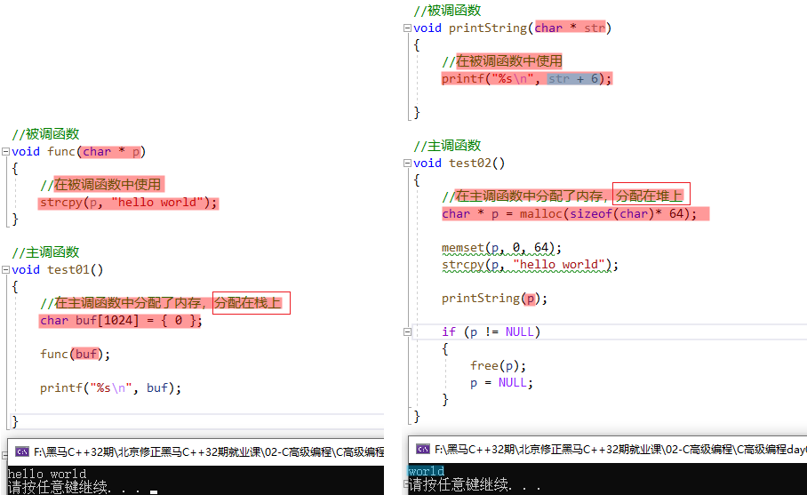

### 11.2 输出特性：在被调函数中分配内存，主调函数使用

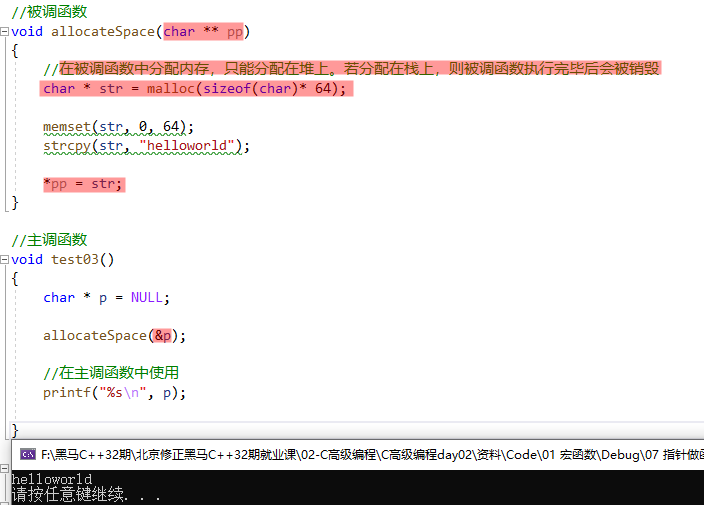

## 12. 字符串强化练习

### 12.1 八进制转义字符和十六进制转义字符的使用

```:no-line-numbers
在 C 中有两种特殊的字符，八进制转义字符和十六进制转义字符：
    八进制字符的一般形式是：'\ddd'，其中，d 表示 0-7 的数字。
    十六进制字符的一般形式是：'\xhh'，其中，h 表示 0-9 或 A-F 内的一个。

八进制字符和十六进制字符表示的是字符的 ASCII 码对应的数值。比如 ：
    '\063' 表示的是字符 '3'，因为 '3' 的 ASCII 码是 51；
    '\x41' 表示的是字符 'A'，因为 'A' 的 ASCII 码是 65。
```

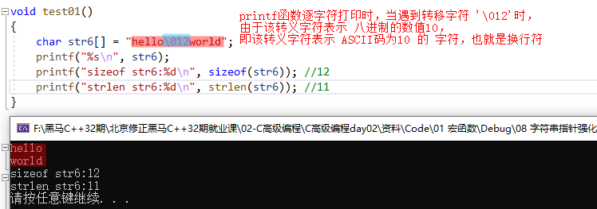

### 12.2 拷贝字符串的三种方式

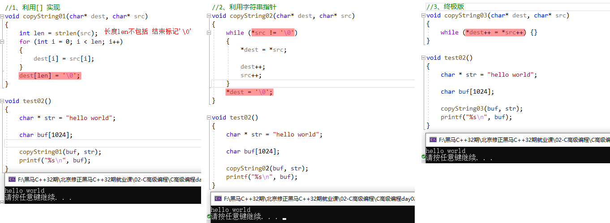