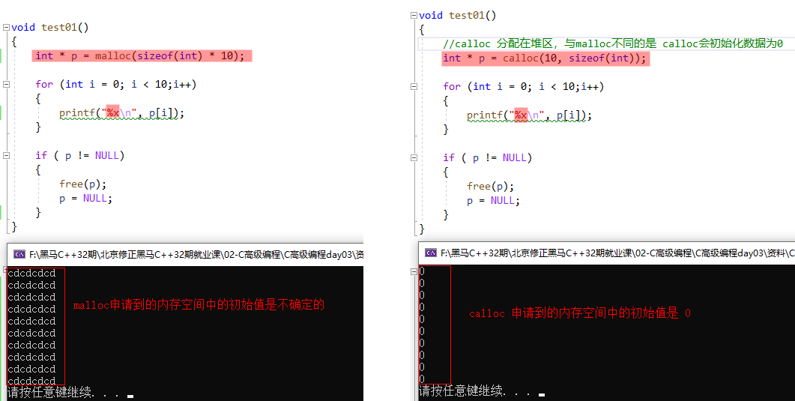

## 1. `calloc` 函数：申请一段初始化为0的内存空间

```c:no-line-numbers
#include <stdlib.h>
void *calloc(size_t nmemb, size_t size);
    功能：
        在内存动态存储区中分配 nmemb 块长度为 size 字节的连续区域。calloc 自动将分配的内存置 0。
    参数：
        nmemb：所需内存单元数量
        size：每个内存单元的大小（单位：字节）
    返回值：
        成功：分配空间的起始地址
        失败：NULL
```

### 1.1 `calloc` 与 `malloc` 函数的区别

`calloc` 和 `malloc` 的主要区别在于：

```c:no-line-numbers
calloc 申请到的内存空间做了初始化，初始值是0；
malloc 申请到的内存空间未做初始化，初始值是不确定的；
```

另外，`calloc` 与 `malloc` 的函数声明对比如下：

```c:no-line-numbers
/* calloc */
#include <stdlib.h>
void *calloc(size_t nmemb, size_t size);

/* malloc */
#include <stdlib.h>
void *malloc (size_t size);
```

从各自的函数声明来看，若 `calloc` 和 `malloc` 分别申请10个 `int` 大小的内存空间，则有如下区别：

```c:no-line-numbers
/* calloc */
calloc(10, sizeof(int));

/* malloc */
malloc(sizeof(int) * 10);
```

**示例：**



## 2. `realloc` 函数：重新分配堆中申请了的内存空间

```c:no-line-numbers
#include <stdlib.h>
void *realloc(void *ptr, size_t size);
    功能：
        对通过 malloc 或 calloc 函数在堆中开辟的内存空间进行重新分配。
    参数：
        ptr：为之前用 malloc 或 calloc 分配的内存地址，如果此参数等于 NULL，那么和 realloc 与 malloc 功能一致
        size：为重新分配内存的大小，单位：字节。
    返回值：
        成功：新分配的堆内存地址
        失败：NULL
```

**注意：**

```:no-line-numbers
当重新分配的内存空间比原来大时：
    1. realloc 不会初始化新空间为 0，即新增的内存空间中的值是不确定的；
    2. 如果 ptr 指向的地址后面有足够的连续空间，那么就会在已有地址基础上增加内存；
    3. 如果 ptr 指向的地址后面没有空间了，那么 realloc 会重新分配新的连续内存，把旧内存的值拷贝到新内存，同时释放旧内存。

当重新分配的内存空间比原来小时：
    1. 会将原内存后面缩减了的部分空间释放掉。
```

## 3. 字符串格式化函数：`sprintf`

## 4. 字符串格式化函数：`sscanf`

## 5. 字符串格式化案例

## 6. 一级指针易错点

### 6.1 易错点1：越界（没有考虑到字符串结束标记字符 `'\0'`）

### 6.2 易错点2：因改变原指针指向而导致 `free` 失败

### 6.3 易错点3：被调函数返回局部变量地址

### 6.4 易错点4：同一块内存释放多次（不可以释放野指针）

## 7. 位运算（`~`、`&`、`|`、`^`）

## 8. 两数交换的三种方式

### 8.1 方式1：采用临时变量

### 8.2 方式2：利用按位异或的特性

### 8.3 方式3：利用加减法的特性