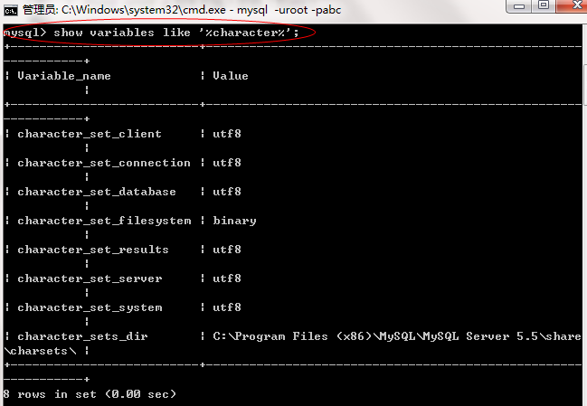
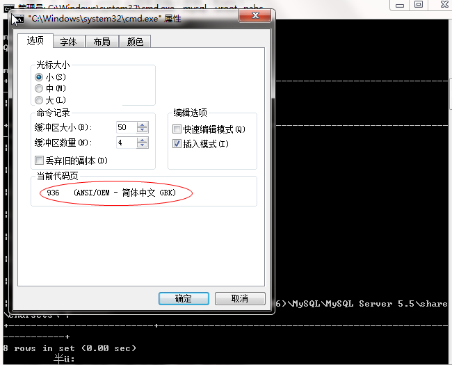
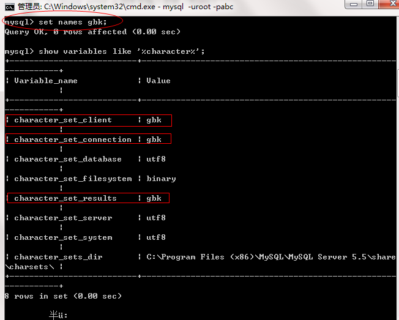
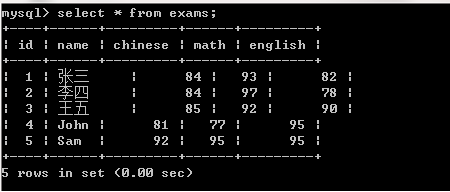

## 1. 命令行进入 `MySQL`

```sql:no-line-numbers
# 回车后输入密码（如 abc）
mysql -uroot -p 
```

## 2. 可视化 `MySQL` 界面

使用 `MySQL-Front-Setup`

## 3. 编码格式 & 相关问题

### 3.1 查看 `MySQL` 的编码情况（`show variables like '%character%';`）

在命令行中执行 `show variables like '%character%';` 可以查看系统上 `MySQL` 数据库的编码情况：



### 3.2 查看 `cmd` 命令行的显示编码格式



### 3.3 编码格式不同导致的问题

#### 3.3.1 中文乱码

如 [`3.1`](#_3-1-查看-mysql-的编码情况-show-variables-like-character) 和 [`3.2`](#_3-2-查看-cmd-命令行的显示编码格式) 中所示，`MySQL` 在安装时设置的是 `utf8` 编码格式，而 `cmd` 命令行显示的是 `GBK` 格式，编码格式不同所以出现了中文乱码：


#### 3.3.2 `insert` 无法插入带中文字符的数据

编码格式不同时，执行 `insert` 语句插入带中文字符的数据时报错，无法插入：


### 3.4 解决方案（`set names gbk;`）

通过 `set names gbk` 设置下 `MySQL` 的编码为 `GBK`，设置后结果如下：

> 此方式只是在当前 `mysql` 环境下起作用，退出 `mysql` 再进入则恢复成 `utf8`



如上图，`client`、`connection` 和 `result` 的编码已经设置为 `gbk` 了。但 `server`、`database`、`system` 的编码还是 `utf-8`。这就是说，**虽然数据是使用 `utf-8` 编码存储的，但是客户端以及返回的结果集是 `gbk` 的**，而此时 `cmd` 窗口的编码正好是 `gbk`，因此该结果集能正确显示了：



