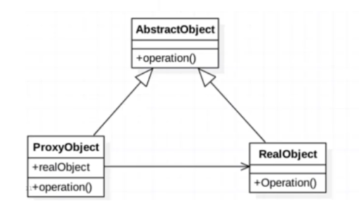

## 定义

为其他对象提供一种代理，用以控制对这个对象的访问。



可分为 **静态代理** 和 **动态代理** 。

## 静态代理

**1. 公有父类**

```java
public abstract class AbstractObject {
    protected abstract void operation();
}
```

**2. 被代理类**

```java
public class RealObject extends AbstractObject {
    @Override
    protected void operation() {
        System.out.println("do operation...");
    }
}
```

**3. 代理类**

```java
public class ProxyObject extends AbstractObject {
    //对目标类的引用
    private RealObject realObject;

    public ProxyObject(RealObject realObject) {
        this.realObject = realObject;
    }

    /**
    * 在代理类的方法中，可以进行功能扩展
    */
    @Override
    protected void operation() {
        System.out.println("do something before real peration...");
        if(realObject == null){
            realObject = new RealObject();
        }
        realObject.operation();
        System.out.println("do something after real operation...");
    }
}
```

**使用示例**

```java
public class ProxyTest {
    public static void main(String[] args) {
        AbstractObject proxy = new ProxyObject(new RealObject());
        proxy.operation();
    }
}
```

## 动态代理

通过动态代理，可以在不修改已有代码的基础上（无入侵），进行扩展（增强方法）。

动态代理中的代理类并不是在java文件中定义的，而是根据Java代码，在程序运行时动态地生成的。

采用动态代理的好处就是可以统一地修改所有的代理方法，而不用像静态代理类那样，根据被代理类中有多少个需要被代理的方法，在静态代理类中就得定义多少个同名的代理方法。

### 动态代理的两种实现方式

1. JDK 动态代理

2. CGLIB 动态代理

#### JDK 动态代理

JDK 动态代理的实现使用了反射机制

JDK 动态代理只能为接口创建代理类
> 静态代理可以为抽象类创建代理类

##### JDK 动态代理的实现方式

**1. 定义公有接口**

```java
public interface IBehavior {
    void shopping();
}
```

**2. 定义被代理类**

```java
public class RealBehavior implements IBehavior {
    @Override
    public void shopping() {
        System.out.println("RealBehavior.shopping: " + "要去买东西...");
    }
}
```

**3. 定义代理类的InvocationHandler**

```java
import java.lang.reflect.InvocationHandler;
import java.lang.reflect.Method;

public class ProxyHandler implements InvocationHandler {
    private Object target; // 被代理类的实例对象

    public ProxyHandler(IBehavior target) {
        this.target = target;
    }

    /**
    * 参数 proxy 表示动态代理类的实例对象
    * 参数 method 表示动态代理类对象 proxy 当前执行的代理方法
    * 参数 args 表示代理方法 method 的实参列表
    */
    public Object invoke(Object proxy, Method method, Object[] args) throws Throwable {
        System.out.println("ProxyHandler.invoke : " + proxy.getClass().getName());

        System.out.println("ProxyHandler.invoke before...");

        // 执行被代理对象 target 的被代理方法
        method.invoke(target, args);

        System.out.println("ProxyHandler.invoke after...");

        return null;
    }
}
```

> 通过动态代理类的对象调用任意的代理方法，都会执行 `InvocationHandler.invoke` 方法，在 `InvocationHandler.invoke` 方法中，根据当前调用的代理方法 `method` 做不同的扩展功能。然后调用被代理对象的被代理方法 `method.invoke(target, args)` 实现最基本的功能。

**使用示例**

```java
public static void main(String[] args) {
    IBehavior realBehavior = new RealBehavior();

    ProxyHandler proxyHandler = new ProxyHandler(realBehavior);

    // 通过 java.lang.reflect.newProxyInstance(...) 方法获得被代理对象对应的代理对象
    // 在 newProxyInstance 方法中，会通过反射创建动态代理类的实例对象proxyBehavior
    IBehavior proxyBehavior = (IBehavoir)java.lang.reflect.Proxy.newProxyInstance(
        realBehavior.getClass().getClassLoader(),
        realBehavior.getClass().getInterfaces(), // 从这里传入接口数组可知，一个动态代理类可以代理多个接口
        proxyHandler);

    // 通过代理对象调用被代理对象相关接口中实现的方法
    // 这个时候就会跳转到这个代理对象所关联的 InvocationHandler 的 invoke() 方法去执行
    proxyBehavior.shopping();

    // 获得动态代理类的Class对象的名称
    System.out.println("proxyBehavior : " + proxyBehavior.getClass().getName());
}
```

**输出结果**

```
ProxyHandler.invoke : com.sun.proxy.$Proxy9
ProxyHandler.invoke before...
RealBehavoir.shopping: 要去买东西...
ProxyHandler.invoke after...
proxyBehavior : com.sun.proxy.$Proxy9
```

#### CGLIB 动态代理

## 参考

[Java 代理模式详解](/java/basis/proxy.md)