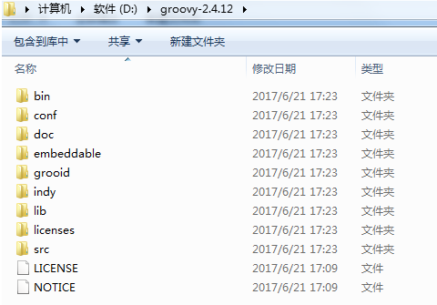
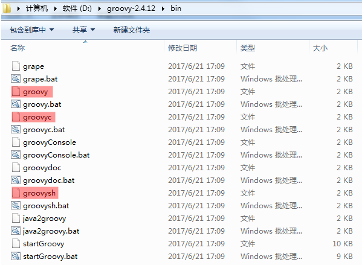
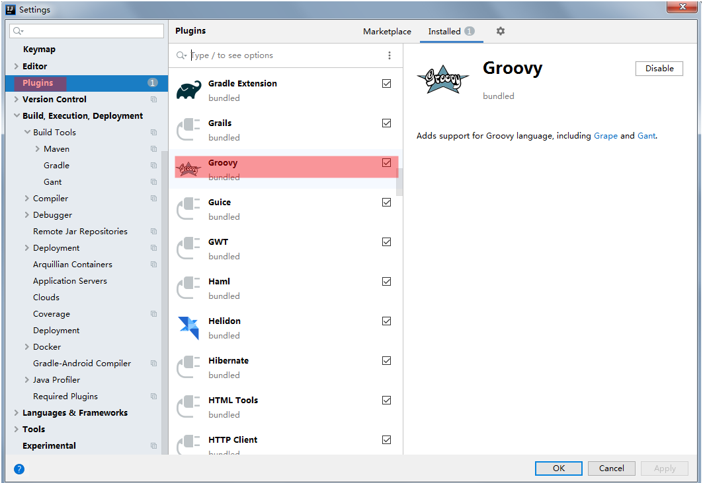
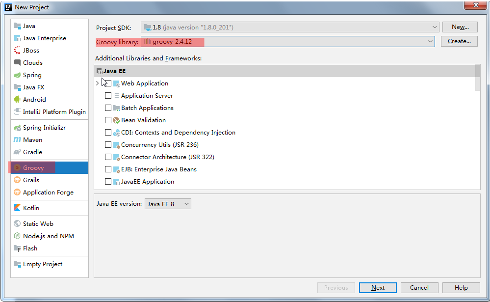
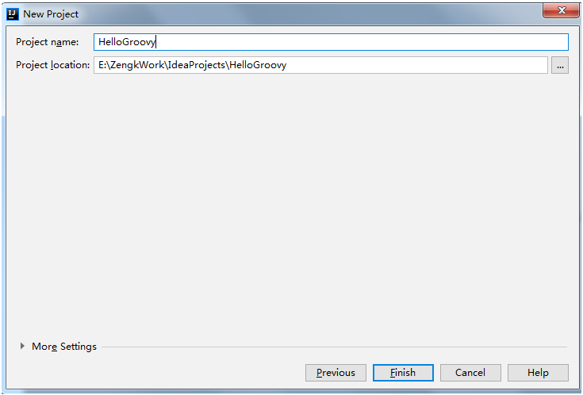
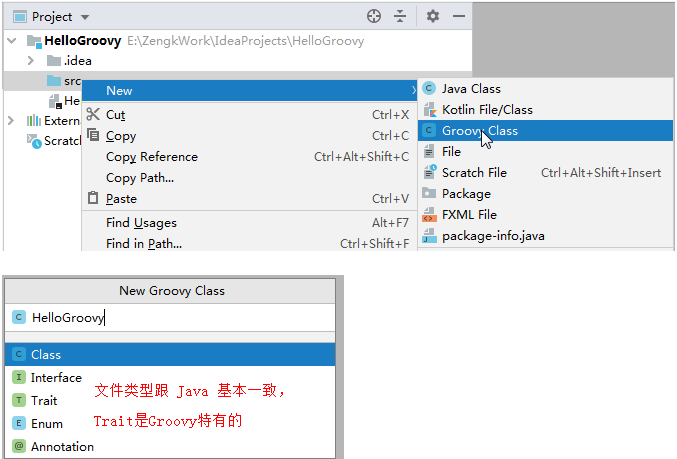
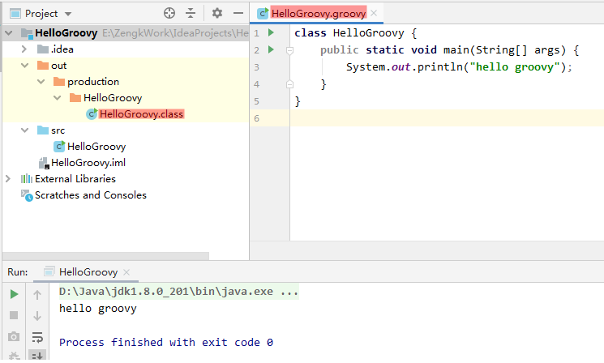
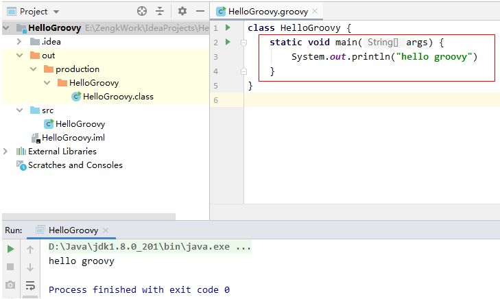
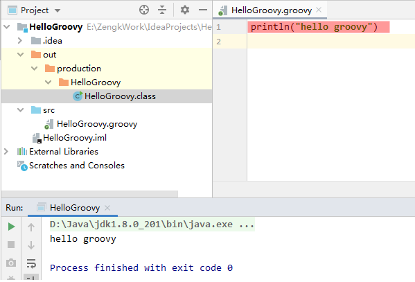
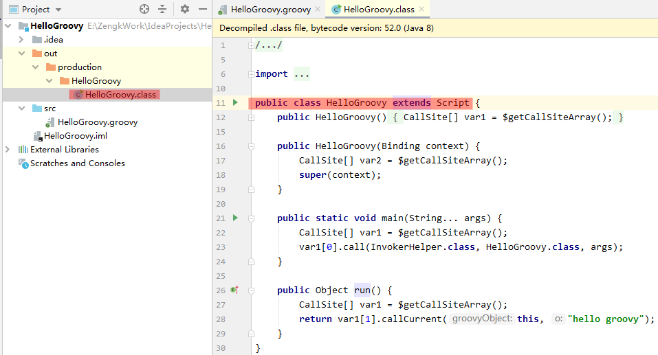

 
`Gradle` 是一款构建工具。`Maven` 和 `Ant` 能做的，`Gradle` 也能做；`Gradle` 能做的，`Maven` 和 `Ant` 却不一定能做。

`Maven` 和 `Ant` 都是使用 `XML` 配置，但是 `Gradle` 使用程序代替传统的 `XML` 配置，使项目构建更灵活。

`Gradle` 本身也是一门程序语言，有丰富的第三方插件库可以使用。

目前的 `Android` 项目和 `Java` 项目基本都是用 `Gradle` 构建的。

## 1. `DSL` 领域特定语言介绍

`DSL` 就是领域特定语言（`Domain Specific Language`），`DSL` 语言是用来解决某一特定领域内问题的语言。

**`DSL` 的核心思想：** 求专不求全，解决特定问题。

**注意：** `DSL` 并不是一个新的语言，而是一个语言种类。

**例如：**

```:no-line-numbers
1. Matlab 建模语言是 DSL 语言中的一种，专门用来做计算的；
2. UML 建模语言也是 DSL 语言中的一种，专门用来建模的；
3. HTML 语言也是 DSL 语言中的一种，专门用来做浏览器网页的；
4. Groovy 语言也是 DSL 语言中的一种，专门用来写脚本，类似于 Python 脚本语言和 Ruby 脚本语言。
```

## 2. `Groovy` 语言介绍

`Groovy` 是一种基于 `JVM` 的敏捷开发语言。同 `Java` 语言一样，可以编译成 `class` 字节码文件交给 `JVM` 运行处理。

`Groovy` 结合了 `Python`、`Ruby`、`Smalltalk` 的许多强大特性，之所以不直接使用 `Python`、`Ruby`、`Smalltalk` 这些语言，是因为 `Groovy` 可以理解为 `Java` 语言的扩展，`Java` 语法基本都适用于 `Groovy`。也就是说，对于 `Java` 开发者，可以快速地掌握 `Groovy`，而不用重头再去学习 `Python`、`Ruby`、`Smalltalk`。

`Groovy` 可以与 `Java` 完美结合，`Groovy` 可以使用 `Java` 所有的库。

## 3. `Groovy` 特性

1. 语法上支持动态类型、闭包等新一代语言特性；

2. 无缝集成所有已经存在的 `Java` 类库；

3. 即支持面向对象编程，也支持面向过程编程。

    > `Groovy` 是 `Java` 的扩展，所以支持面向对象编程（因此可以将 `Groovy` 作为编程语言）；
    >
    > `Groovy` 结合了 `Python`、`Ruby`、`Smalltalk` 这些脚本语言的特性，所以也支持面向过程编程（因此也可以将 `Groovy` 作为脚本语言）；
    >
    > 我们学习 `Groovy` 主要是用来编写构建脚本，所以主要学习如何使用 `Groovy` 进行面向过程编程。

## 4. 开发环境搭建

### 4.1 `Windows`/`Mac`/`Linux` 操作系统中配置 `Groovy` 开发环境

以 `Windows` 为例（其他操作系统基本一致）：

**Step 1. 安装 `JDK` 环境**

**Step 2. 下载 `Groovy SDK` 并配置 `Groovy` 相关的环境变量**

> 官网地址：[http://www.groovy-lang.org](http://www.groovy-lang.org)
> 
> 下载地址：[https://groovy.apache.org/download.html](https://groovy.apache.org/download.html)
> 
> 所有版本下载地址：[https://archive.apache.org/dist/groovy/](https://archive.apache.org/dist/groovy/)

本课程使用的版本为 `Groovy 2.4.12`，所以下载 `apache-groovy-sdk-2.4.12.zip` 解压到合适位置。

解压后的目录结构如下：

```:no-line-numbers
bin 目录下包含一些可执行文件：
1. groovy 相当于 jdk 的 bin 目录下的 java 可执行程序，用来执行编译生成的字节码文件；
2. groovyc 相当于 javac ，用于将 Groov 编写的程序编译成字节码文件；
3. groovysh 则用来解释执行 Groovy 编写的脚本。

doc 目录下的：
1. html\documentation 文件夹中包含 Groovy 的教程文档；
2. html\api 文件夹中包含 Groovy 的 API 文档。
```





配置 `Groovy` 相关的环境变量：

```:no-line-numbers
将 Groovy 安装目录下的 bin 文件夹配置到环境变量中即可。
成功执行 groovy -version 说明配置完成。
```
        

### 4.2 `IntelliJ IDEA` 中配置 `Groovy` 开发环境

`IntelliJ` 中配置 `Groovy`，就是安装 `Groovy` 插件。

> 高版本的 `IntelliJ` 一般都默认安装了 `Groovy` 插件的。



## 5. `IntelliJ IDEA` 中创建 `Groovy` 工程

**Step 1.** 点击 `File` -> `new` -> `Project` 弹出 `New Project` 对话框。选择 `Groovy` 工程，其中 `Groovy library` 路径设置为 `Groovy` 安装目录，然后点击 `Next`。



**Step 2.** 设置 `Groovy` 工程的名称和保存路径，点击 `Finish` 即可。



## 6. `Groovy` 工程中的 `Hello World`

**新建 Groovy 源文件：** 右键 `src` -> `Groovy class`



**注意：** 

1. `Groovy` 是 `Java` 的扩展，所以 `Groovy` 中支持 `Java` 语法。

2. `HelloGroovy.groovy` 编译后生成字节码文件 `HelloGroovy.class`

    

3. `Groovy` 中，可以省略函数的访问权限修饰；省略函数的形参类型；省略代码语句后面的分号 "`;`"

    

**`Groovy` 中 `hello groovy` 的脚本形式：**

> 可以发现：
> 
> 不管是像 `Java` 那样编写 `hello groovy`，还是像脚本那样编写 `hello groovy`， 最终都会生成字节码文件 `HelloGroovy.class` 
> 
> 而字节码文件中的语法形式仍然跟 `Java` 一样！



