## 1. 变量

### 1.1 变量类型：基本类型 & 对象类型

`Groovy` 中的变量类型分为 **基本类型** 和 **对象类型**。

**注意：** `Groovy` 中的基本类型最终会被自动装箱成对象类型，因此，`Groovy` 中的变量类型最终都是一个对象类型。如下图所示：

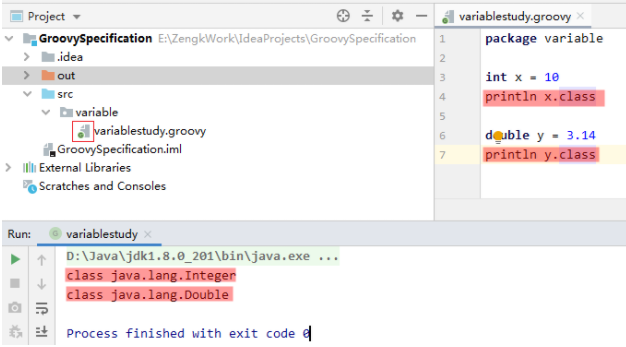

> 如上图，把源文件中的 `class` 类定义删掉，`src` 目录下的源文件图标就会由 "`C`" 变为 "`G`" ，并且显示出源文件的后缀名，
> 
> 此时，相当于把 `variablestudy.groovy` 作为了一个脚本文件。

### 1.2 变量定义：强类型定义 & 弱类型定义（`def`）

`Groovy` 中的变量定义分为 **强类型定义** 和 **弱类型定义**：
    
1. 强类型定义就像 `Java` 那样指定变量的具体类型；
    
2. 弱类型定义就是用 `def` 关键字代替变量的具体类型。

**两种变量定义方式的使用场景：**

1. 当变量只在模块内部自己使用时，采用弱类型定义，方便变量类型的转换；

2. 当变量要传给其他模块时，为了避免调用方由于不知道变量类型而产生疑惑，应该采用强类型定义，明确变量类型。

**弱类型定义的特点：**

1. 弱类型 `def` 定义变量时，根据变量的初始值，编译器自动推断变量的具体类型；

2. 弱类型定义变量时，可以方便的转换变量类型。
   
    > 变量采用弱类型定义时，可以将变量类型理解为基类 `Object`，
    >
    > 因为 `Groovy` 中的变量类型最终都是对象类型，所以 `Object` 类型的变量可以接收任意类型的数据（多态）。

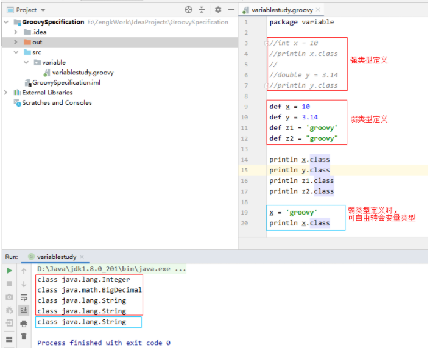

## 2. 字符串

`Groovy` 中既支持 `Java` 中的 `String` 类型的字符串，又另外定义了一个 `Groovy` 特有的 `GString` 类型的字符串。

### 2.1 字符串的三种定义方式：单引号定义、双引号定义、三引号定义

**单引号定义：** 跟 `Java` 中的双引号定义一致，又称为不可变字符串。

**双引号定义：** 字符串中可以包含变量。包含变量的字符串又称为可变字符串。

**三引号定义：** 字符串是什么样就打印出什么样。如：可以直接定义多行字符串，不用像 `Java` 那样用 "`+`" 号拼接。

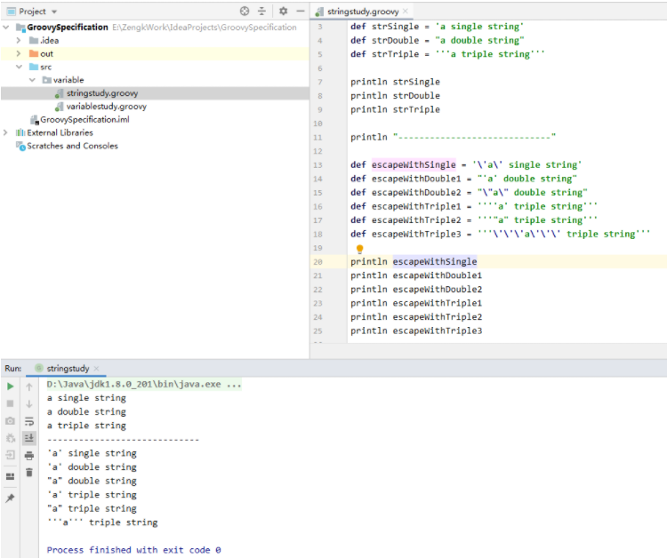

> 如上图所示，三种定义方式中都支持转义字符。

### 2.2 三引号字符串可不通过转义字符实现换行（原样输出）

采用单引号或双引号定义字符串时，如果不采用转义字符 `\n` 则无法实现换行。

而采用三引号定义字符串，则可以原样输出，实现换行：

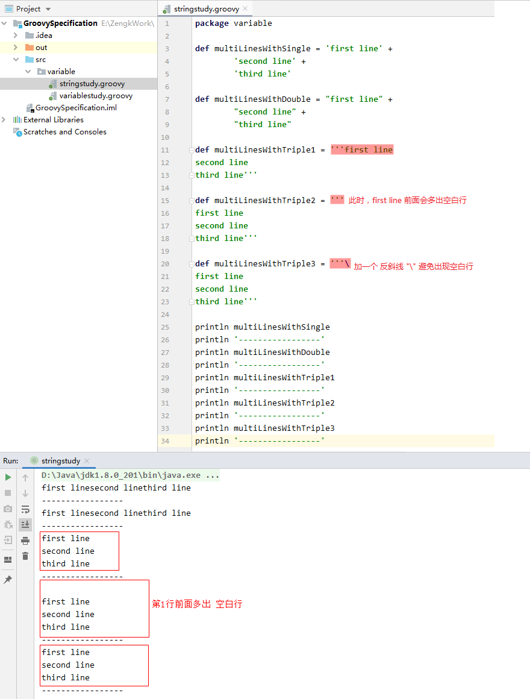

### 2.3 双引号定义可扩展的字符串：`${<变量名>/<表达式>}`

采用双引号定义字符串时，可以通过 `${变量名}` 的形式向字符串中插入变量，实现可扩展的字符串。

**注意：** 

1. 当字符串中使用了 `${变量名}` 插入变量后，编译器将此字符串推断为 `GString` 类型的字符串，而不再是 `String` 类型。

    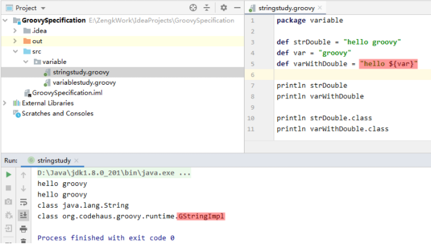

2. 在双引号定义的字符串中，`${}` 中不仅可以是一个变量名，还可以是一个表达式，即 `${表达式}`

    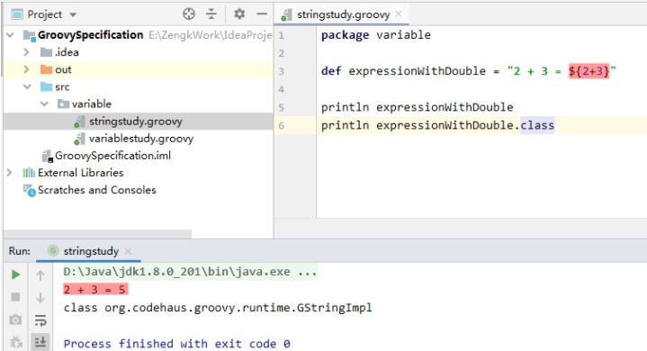

### 2.4 `GString` 和 `String` 的转换

`GString` 类型的字符串可以直接转换为 `String` 类型的字符串，但 `String` 类型的字符串不能直接转换为 `GString` 类型的字符串。

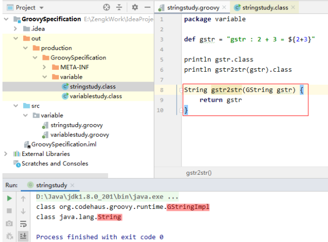

### 2.5 字符串相关的 `API`

在 `Groovy` 中，`String` 类型的变量除了能够使用 `java.lang.String` 类提供的 `API`，还可以使用 `Groovy` 特有的 `DefaultGroovyMethods` 类和 `StringGroovyMethods` 类提供的 API。

其中 `StringGroovyMethods` 继承自 `DefaultGroovyMethods`，重点学习 `StringGroovyMethods` 提供的 `API`。

可以将 `StringGroovyMethods` 中的 `API` 方法分为两大类：

1. 方法参数为普通类型的方法；

2. 方法参数为闭包类型的方法（在闭包中进行讲解）。

> **注意：** `GString` 类型的字符串变量也可以使用 `DefaultGroovyMethods` 和 `StringGroovyMethods` 提供的 `API` 方法。

#### 2.5.1 字符串填充：`center` & `padLeft`

```groovy:no-line-numbers
center(Number numberOfChars, CharSequence padding)
```

```:no-line-numbers
作用：使用子串 padding 填充字符串两侧，得到长度为 numberOfChars 的目标字符串。
注意：长度 numberOfChars <= 字符串的长度时，字符串不变。
```

```groovy:no-line-numbers
padLeft(Number numberOfChars, CharSequence padding)
```

```:no-line-numbers
作用：使用子串 padding 填充字符串左侧，得到长度为 numberOfChars 的目标字符串。
```

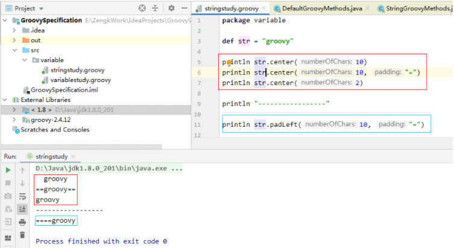

#### 2.5.2 字符串相关的运算符：比较运算符、下标运算符、减法运算符

`Groovy` 为字符串提供的运算符及相对应的 `API` 方法：

1. `Groovy` 中支持使用比较运算符，对字符串进行逐字符的 `ASCII` 码比较；
    
    > 作用同 `java.lang.String` 提供的方法 `compareTo`

2. `Groovy` 中支持使用下标运算符 "`[]`" 获取字符串中指定索引处的字符；
    
    > 作用同 `java.lang.String` 提供的方法 `charAt`

3. `Groovy` 中支持使用下标运算符 "`[beginIndex...endIndex]`" 获取字符串中索引范围内（首尾包含）的子串；
    
    > 作用同 `java.lang.String` 提供的方法 `substring(int beginIndex, int endIndex)`（包含首，不包含尾）

4. `Groovy` 中支持使用减法运算符，将作为被减数的子串从字符串中移除。
    
    > 作用同 `StringGroovyMethods` 提供的方法 `minus`。
    >
    > 注意：
    >
    > 1. 只移除从左到右遇到的第一个匹配的子串
    >
    > 2. 字符串中不包含子串时，返回的字符串不变

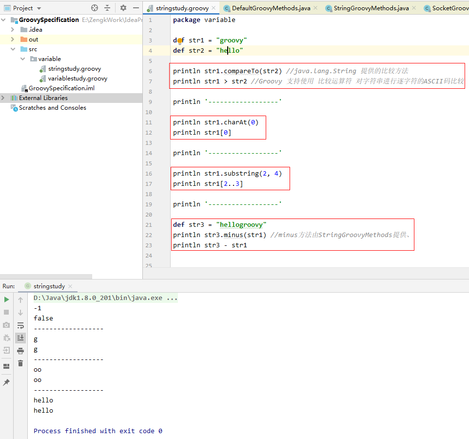

#### 2.5.3 反转字符串：`reverse()`

#### 2.5.4 字符串首字母大写：`capitalizee()`

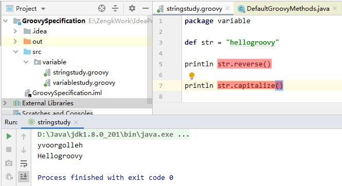

#### 2.5.5 判断字符串是否为数字：`isNumbere()`

#### 2.5.6 字符串转数字类型：`toInteger()`、`toFloat()`、...

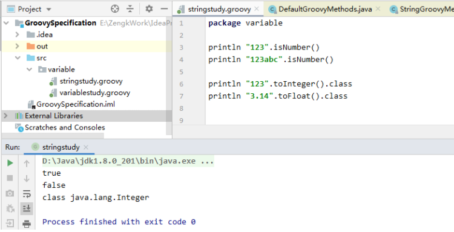

## 3. 逻辑控制语句

`Groovy` 对 `switch` 条件语句做了的扩展；对一些特殊数据结构的 `for` 循环也做了扩展。

而对于顺序语句，`if/else` 条件语句，`while` 循环语句，同 `Java` 中的使用方式一致。

### 3.1 `Groovy` 对 `switch` 语句的扩展

1. `switch` 语句可以接收任意类型的变量。包括 `var.class` 这种 `Class` 类型的字节码对象；

2. 如果 `case` 为列表类型，那么当 `switch` 传入的变量匹配列表中的元素时，就意味着匹配该 `case`。

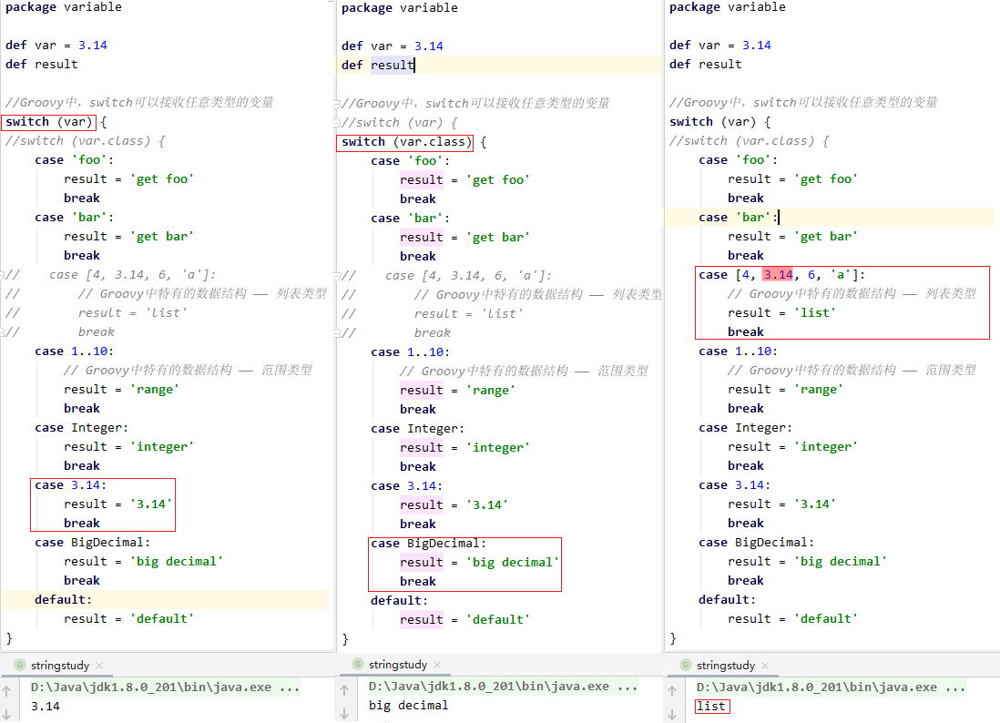

### 3.2 `Groovy` 对 `for` 循环语句的扩展

`Groovy` 对范围类型 `Range`、列表类型 `List`、映射类型 `Map` 的 `for` 循环进行了扩展。

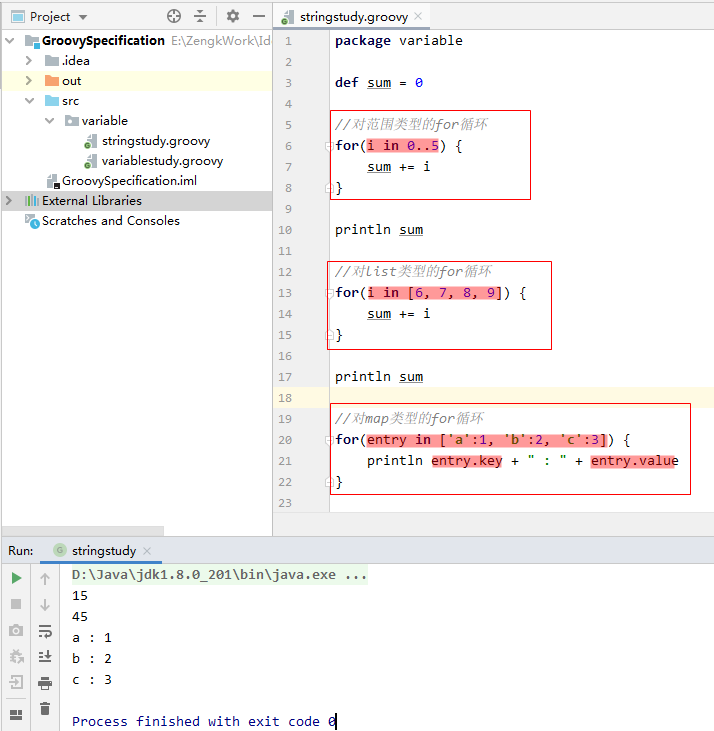