## 1. 闭包基础

### 1.1 什么是闭包？

闭包（`closure`）其实就是一个代码块，作用类似于函数。

### 1.2 闭包的定义与调用

闭包的定义和闭包的调用如下图：
    
> 可以发现 `groovy.lang.Closure` 是闭包基类。

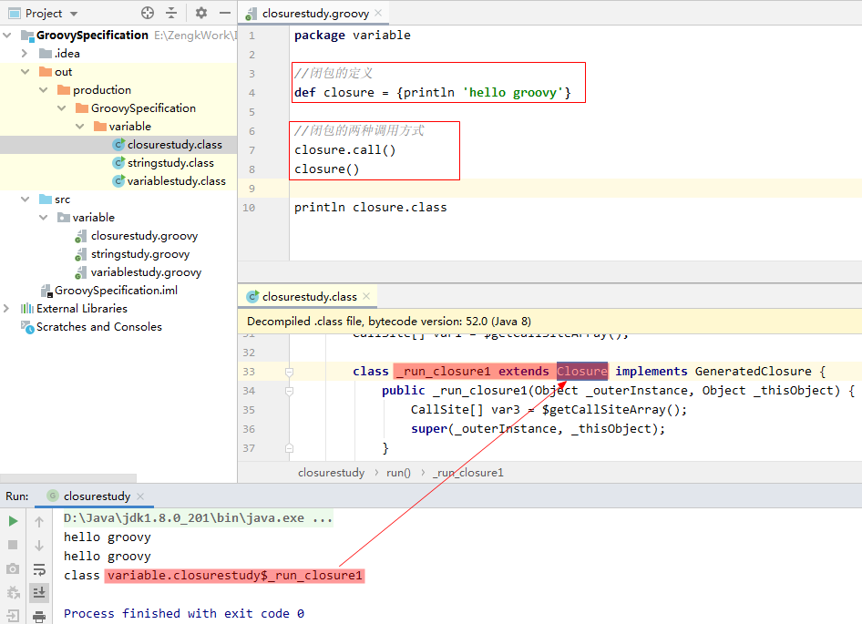

### 1.3 闭包的参数

#### 1.3.1 带普通参数的闭包

带普通参数的闭包的定义方式：

```groovy:no-line-numbers
def closure = { T1 t1, T2 t2, T3 t3, ... -> 执行语句 }
```

带普通参数的闭包的调用方式：

```groovy:no-line-numbers
closure.call(v1, v2, v3, ...)
closure(v1, v2, v3, ...)
```

#### 1.3.2 带隐式参数的闭包

当定义闭包时，如果没有显示定义闭包参数，那么闭包中默认会存在一个名为 `it` 的隐式参数。

> 如果显示定义了参数，那么隐式参数 `it` 就不存在了。

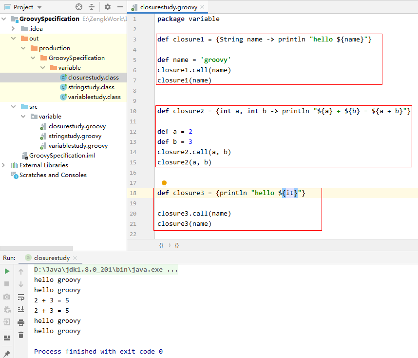

### 1.4 闭包的返回值

如下图代码：

```:no-line-numbers
1. 从 closure2 中可以发现：闭包一定有返回值，就算没有写 return 语句也返回 null；
2. 结合 closure3 和 closure4 可以发现：闭包的返回值就是最后一条执行语句结果值，如果最后一条执行语句没有结果值，就返回 null。
```

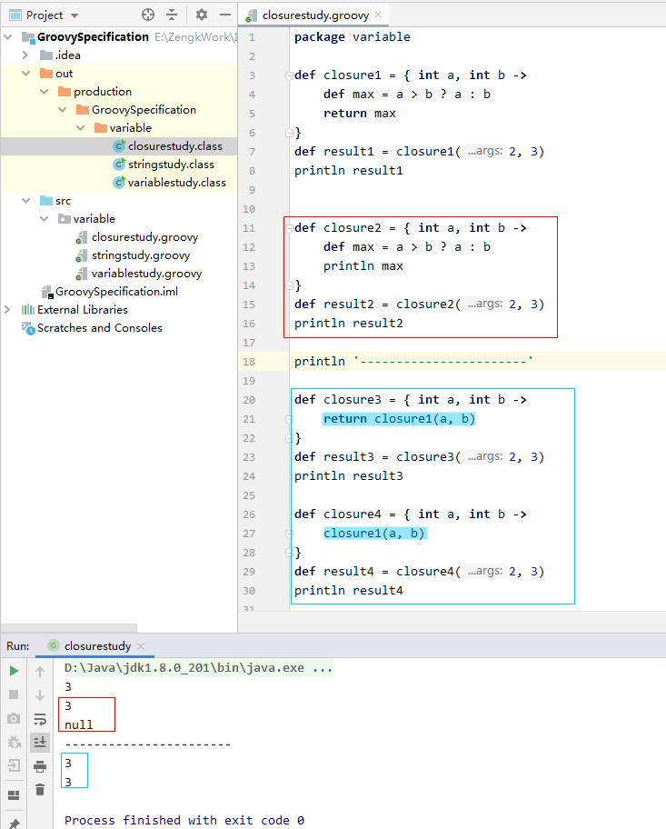

## 2. 闭包的使用

### 2.1 与基本类型结合使用

#### 2.1.1 闭包作为函数参数 & 递增函数：`upto(Number, Closure)`

```groovy:no-line-numbers
Number.upto(Number, Closure)
```

```:no-line-numbers
实现从调用者 Number 到参数 Number 的循环递增，循环因子作为闭包 Closure 的参数。
```

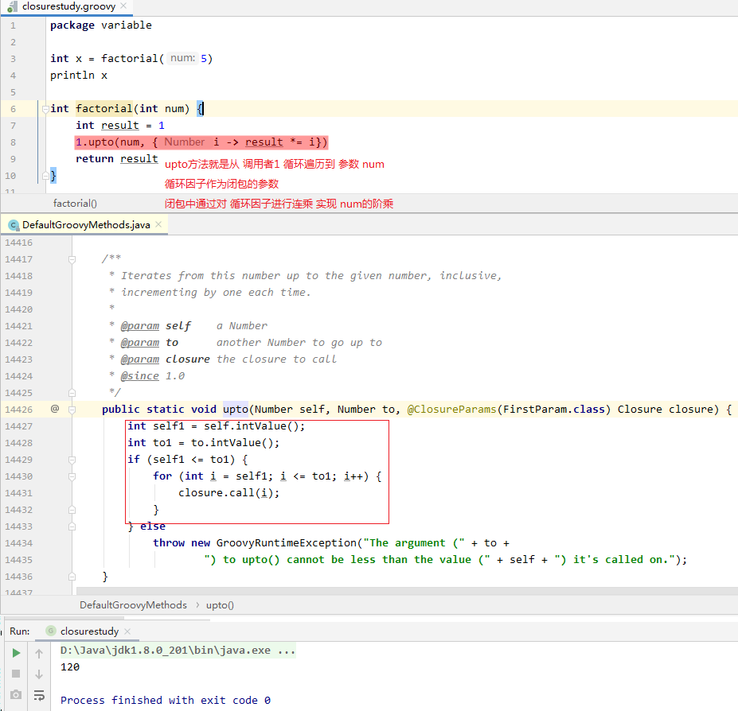

#### 2.1.2 闭包写在 "`()`" 后面 & 递减函数：`downto(Number, Closure)`

当闭包作为其他函数的最后一个参数时，在调用这个函数时，可以把最后的实参闭包写在函数调用运算符 "`()`" 的后面。如下图代码所示：

```groovy:no-line-numbers
Number.downto(Number, Closure)
```

```:no-line-numbers
 实现从调用者 Number 到参数 Number 的循环递减，循环因子作为闭包 Closure 的参数。
```

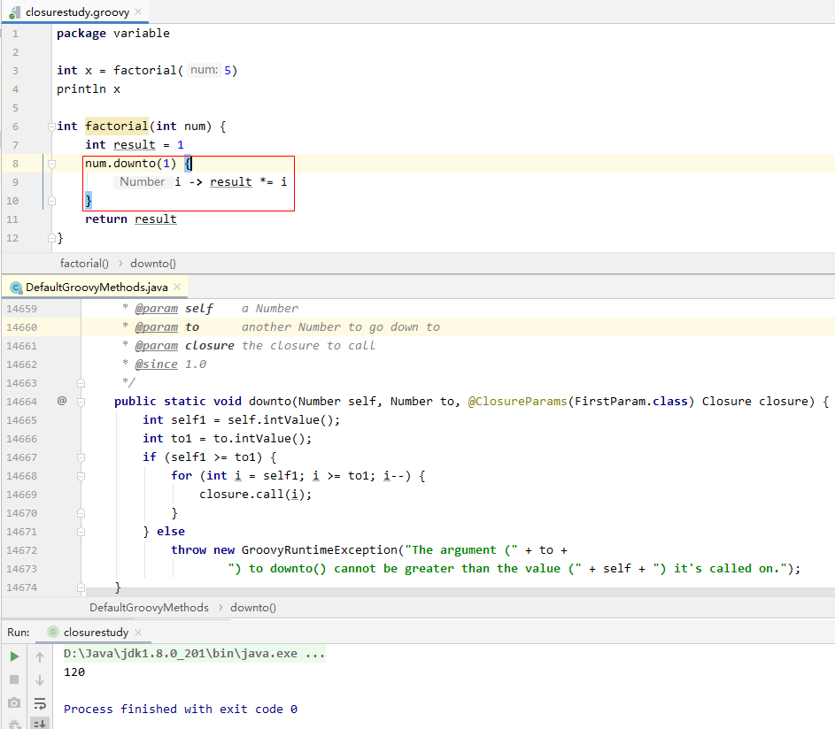

#### 2.1.3 如何确定实参闭包中的参数个数和参数类型

通过查看带参数闭包的函数的源码来确定参数闭包在函数体中执行时所接收的参数个数和参数类型。

#### 2.1.4 实参闭包中可省略参数类型 & 递增函数：`times(Closure)`

```groovy:no-line-numbers
Number.times(Closure)
```

```:no-line-numbers
从 0 到调用者 Number-1 循环递增，循环因子作为闭包参数。
```

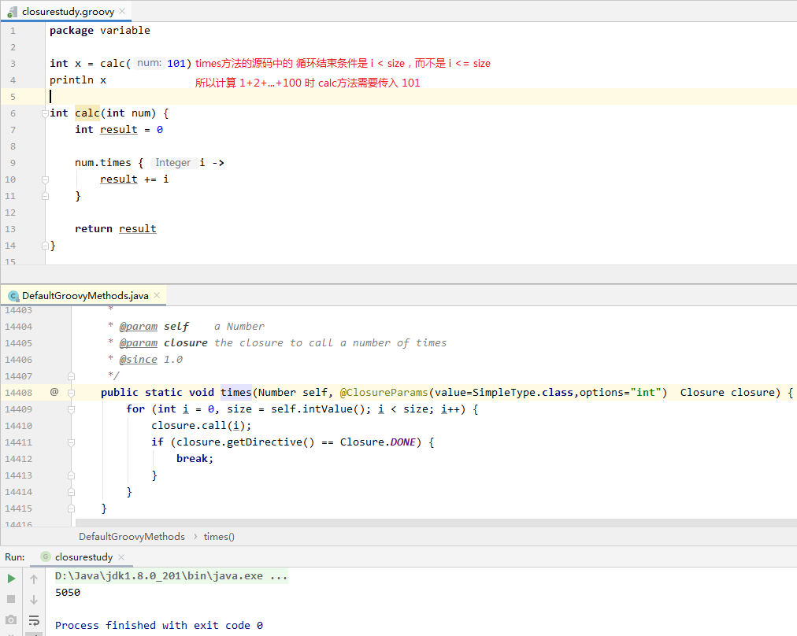

> 注意：在定义实参闭包时，可以省略闭包参数的类型。

### 2.2 与 `String` 结合使用

#### 2.2.1 遍历字符串中的字符：`each(Closure)`

```groovy:no-line-numbers
String str.each(Closure)
```

```:no-line-numbers
作用： 遍历调用字符串 str 的每个字符，将每次遍历到的字符作为闭包参数传给闭包处理。
返回值：返回调用字符串 str 本身。
注意：每次遍历得到的字符实际是作为 java.lang.String 类型处理的。
```

#### 2.2.2 字符串多次拼接：`multiply(Number)`

```groovy:no-line-numbers
String str.multiply(Number)
```

```:no-line-numbers
作用：将 Number 个调用字符串 str 拼接成一个字符串返回，如："hello".multiply(2) 返回 "hellohello"
```

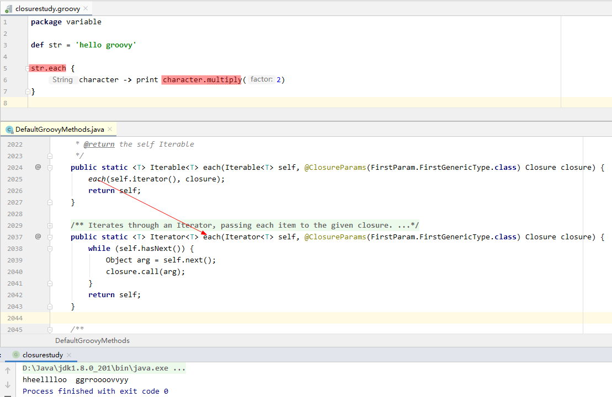

#### 2.2.3 字符串中查找某个字符：`find(Closure)`

```groovy:no-line-numbers
String str.find(Closure)
```

```:no-line-numbers
作用：
    遍历调用字符串 str 的每个字符，将每次遍历到的字符作为闭包参数传给闭包处理。
    闭包必须返回一个布尔值，用于判断当前传入的字符是否是我们要查找的。
    当闭包返回 true，那么当前遍历到的字符就作为 find 方法的返回值。

注意：
    遍历到的字符实际是作为 java.lang.String 类型处理的。
```

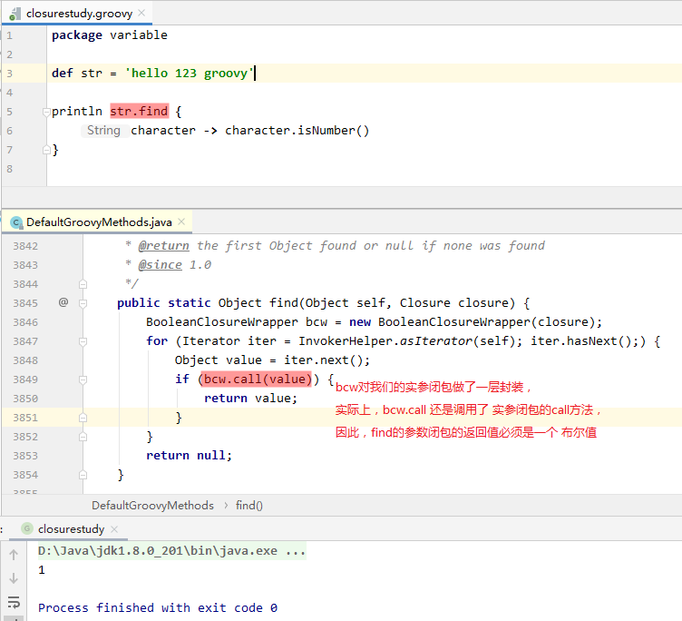

#### 2.2.4 字符串中查找某些字符：`findAll(Closure)`

```groovy:no-line-numbers
java.util.Collection str.findAll(Closure)
```

```:no-line-numbers
作用：
    遍历调用字符串 str 的每个字符，将每次遍历到的字符作为闭包参数传给闭包处理。
    闭包必须返回一个布尔值，用于判断当前传入的字符是否是我们要查找的。
    当闭包返回 true，那么当前遍历到的字符放入到一个创建好的集合中，当全部遍历完毕后，返回这个集合。

注意：
    遍历到的字符实际是作为 java.lang.String 类型处理的。
```

#### 2.2.5 集合元素拼接成字符串：`toListString()`

```groovy:no-line-numbers
String collection.toListString()
```

```:no-line-numbers
作用： 将集合元素拼接成字符串 "[ele1, ele2, ele3, ...]" 的形式返回
```

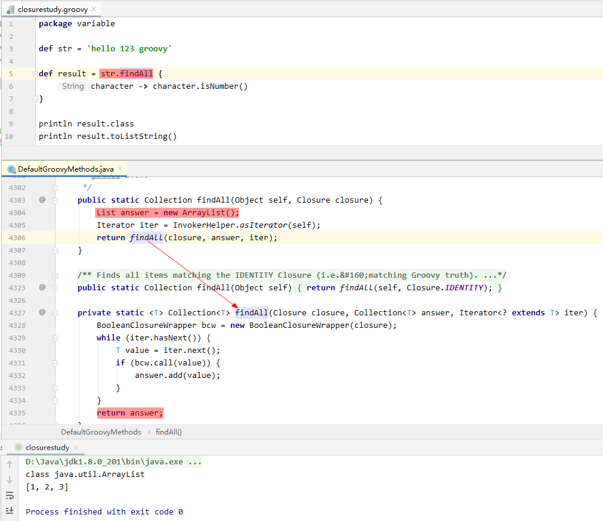

#### 2.2.6 判断字符串中的任一字符是否满足条件：`any(Closure)`

```groovy:no-line-numbers
boolean str.any(Closure)
```

```:no-line-numbers
作用： 
    遍历字符串 str 中的每个字符，将字符作为参数交给闭包处理。
    闭包必须返回布尔值，用于判断参数字符是否满足某种需求。
    只要字符串 str 中有一个字符满足闭包中的业务需求，则方法 any 返回 true；否则返回 false。
```

#### 2.2.7 判断字符串中的所有字符是否满足条件：`every(Closure)`

```groovy:no-line-numbers
boolean str.every(Closure)
```

```:no-line-numbers
作用： 
    遍历字符串 str 中的每个字符，将字符作为参数交给闭包处理。
    闭包必须返回布尔值，用于判断参数字符是否满足某种需求。
    当字符串 str 中所有的字符都满足闭包中的业务需求时，则方法 every 返回 true；否则返回 false。
```

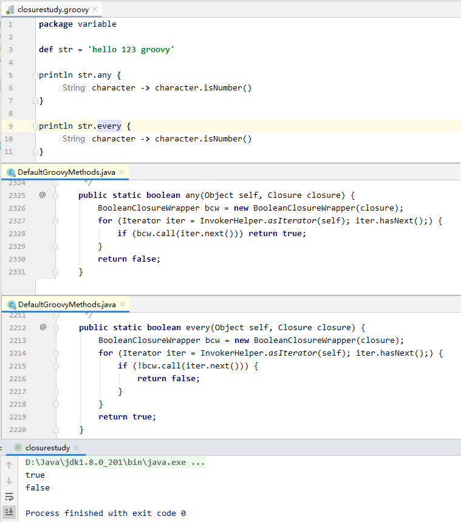

#### 2.2.8 返回根据字符串中字符转换成的集合：`collect(Closure)`

```groovy:no-line-numbers
List str.collect(Closure)
```

```:no-line-numbers
作用：
    遍历 str 中的每个字符，将字符作为参数传给闭包处理。
    闭包处理后，根据业务需求返回某种类型的数据，然后将闭包返回的数据存入一个创建好的集合中，collect 执行完毕后返回该集合。
```

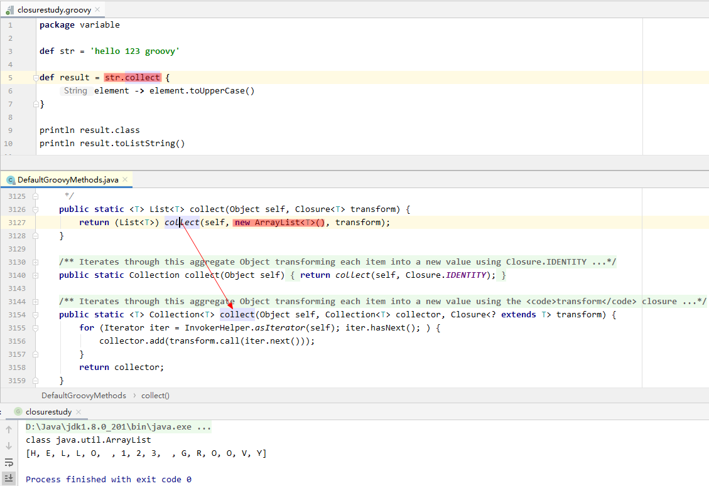

### 2.3 与数据结构结合使用

> 在讲数据结构时讲解。

### 2.4 与文件等结合使用

> 与文件的结合使用在讲文件时讲解。

## 3. 闭包进阶

### 3.1 闭包中的三个重要变量：`this`、`owner`、`delegate`

**`this`**

```:no-line-numbers
代表闭包定义处的类或类对象
（闭包作为静态变量时，this 代表类；闭包作为非静态变量时，this 代表类对象）
```

**`owner`**

```:no-line-numbers
当闭包在类中定义时，代表类或类对象。
当闭包在类中的其他闭包中定义时，代表其他闭包对象（如：当闭包嵌套定义时，内层闭包的 owner 就是外层闭包对象）
```

**`delegate`**

```:no-line-numbers
可以是任意对象，默认情况下同 owner
```

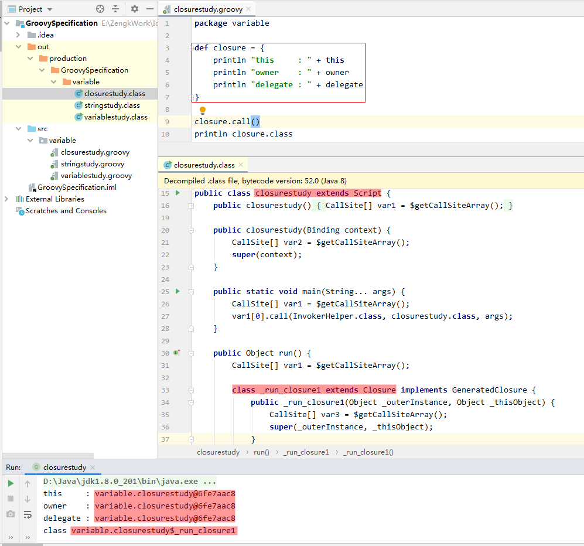

**注意：** 只能修改 `delegate`，不能手动修改 `this` 和 `owner`。

#### 3.1.1 静态闭包中的 `this` 代表类；非静态闭包中的 `this` 代表类对象

闭包作为静态变量时 `this` 代表类；闭包作为非静态变量时 `this` 代表类对象。

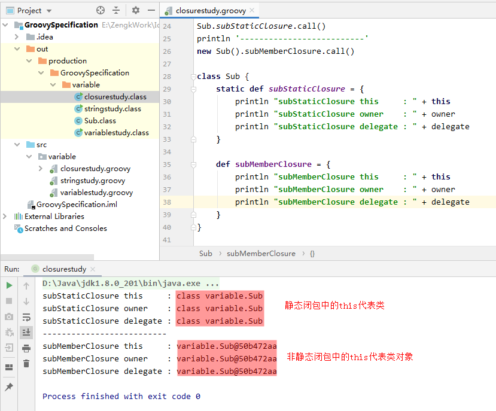


#### 3.1.2 闭包嵌套定义时内层闭包的 `owner` 就是外层闭包对象

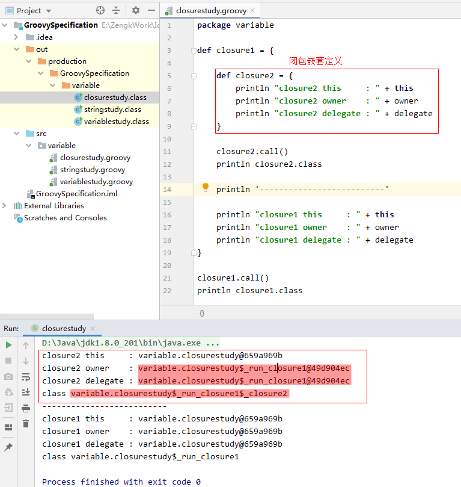

#### 3.1.3 在调用闭包前可以将闭包的 `delegate` 变量设置为其他任意对象

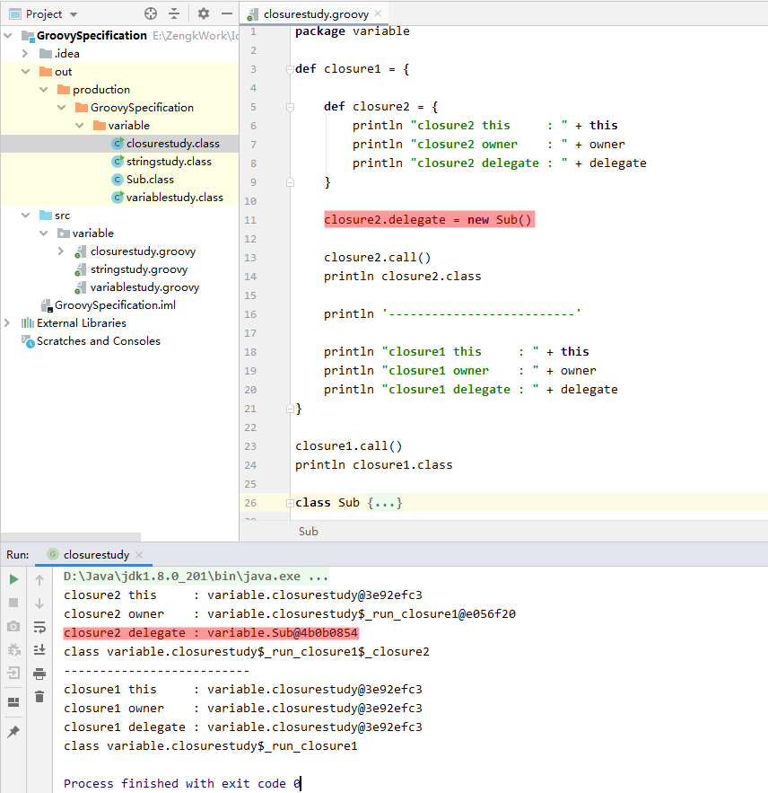

### 3.2 闭包的委托策略

#### 3.2.1 闭包的委托对象

闭包中的 `owner` 和 `delegate` 变量指定的对象就是闭包的委托对象。

闭包中可以直接访问委托对象的成员方法和成员属性。

#### 3.2.2 闭包的委托策略包括两个方面

##### 3.2.2.1 修改闭包的 `delegate` 变量

通过修改闭包的 `delegate` 变量来指定的委托对象。

##### 3.2.2.2 修改闭包的委托策略方式

通过修改闭包的委托策略方式，从而改变由哪个委托对象来提供闭包中访问的成员属性或成员方法。

#### 3.2.3 `Closure` 类中定义的几种委托方式

##### 3.2.3.1 `Closure.OWNER_FIRST`（默认方式）

闭包执行时，闭包中所访问的成员属性或成员方法先从 `owner` 变量指定的委托对象中查找；

查找不到，再从 `delegate` 变量指定的委托对象中查看；

再查找不到则报错，提示找不到所访问的成员属性或成员方法。

##### 3.2.3.2 `Closure.DELEGATE_FIRST`

闭包执行时，闭包中所访问的成员属性或成员方法先从 `delegate` 变量指定的委托对象中查找；

查找不到，再从 `owner` 变量指定的委托对象中查找；

再查找不到则报错，提示找不到所访问的成员属性或成员方法。

##### 3.2.3.3 `Closure.OWNER_ONLY`

闭包执行时，闭包中所访问的成员属性或成员方法仅从 `owner` 变量指定的委托对象中查找；

查找不到则报错，提示找不到所访问的成员属性或成员方法。

##### 3.2.3.4 `Closure.DELEGATE_ONLY`

闭包执行时，闭包中所访问的成员属性或成员方法仅从 `delegate` 变量指定的委托对象中查找；

查找不到则报错，提示找不到所访问的成员属性或成员方法。

##### 3.2.3.5 `Closure.TO_SELF`（了解即可）

闭包执行时，闭包中所访问的成员属性或成员方法不直接从 `owner` 变量和 `delegate` 变量指定的委托对象中查找；

而是从 `MetaClass` 对象中查找。

#### 3.2.4 设置闭包的委托策略方式

通过形如 `closure.resolveStrategy = Closure.DELEGATE_FIRST` 的方式来设置闭包的委托策略方式。

**注意：** 从下一次调用闭包开始生效。

#### 3.2.5 闭包中的局部变量与委托对象的成员变量同名时采用就近原则

**注意：** 当闭包中访问的成员属性和闭包中定义的局部变量同名时，采用就近原则，即此时访问的应该是闭包中的局部变量。

#### 3.2.6 代码示例

##### 3.2.6.1 修改 `delegate` 并设置委托方式为 `DELEGATE_FIRST`

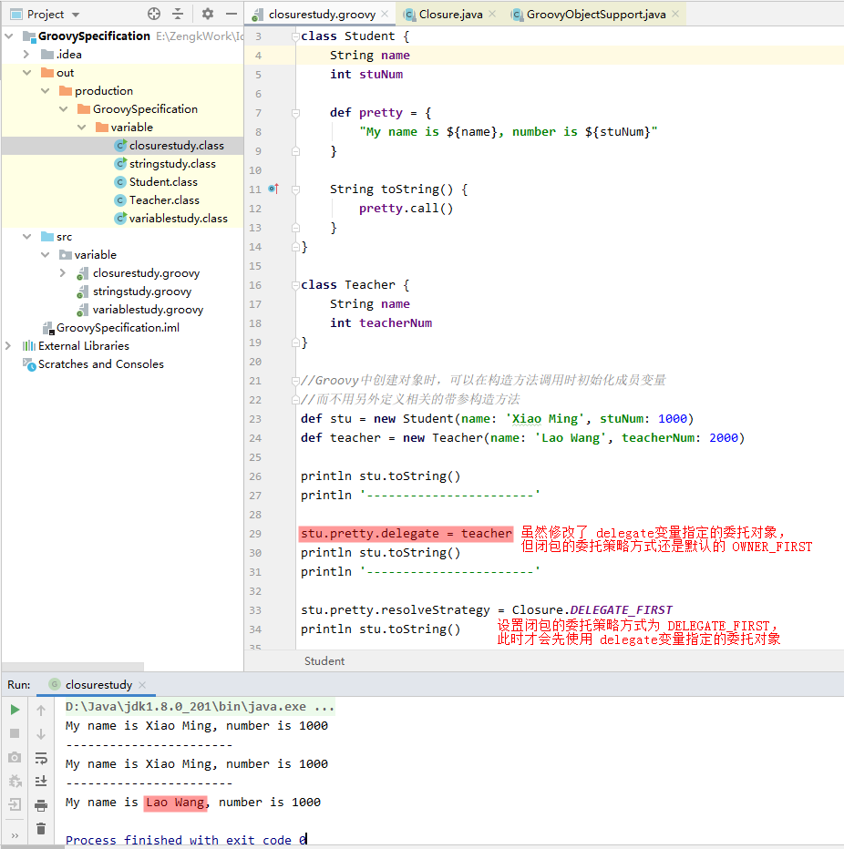

##### 3.2.6.2 修改 `delegate` 并设置委托方式为 `DELEGATE_ONLY`

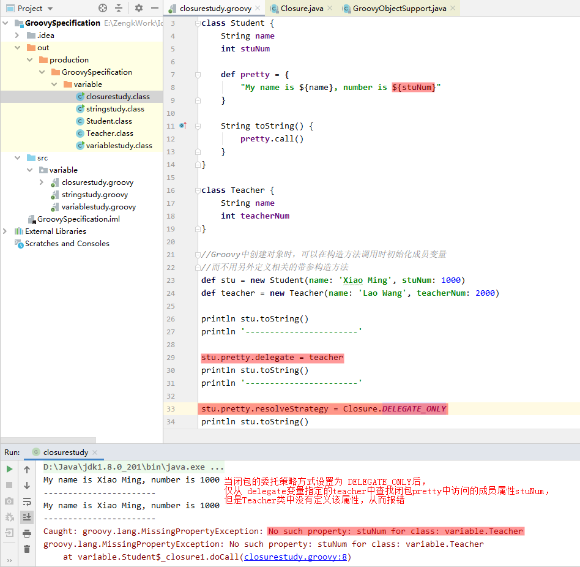