## 1. 列表（`List`）

### 1.1 列表的定义方式

`Groovy` 中有两种定义列表的方式：

1. 采用 `java` 中的方式创建列表对象

2. `Groovy` 特有的方式定义列表

    ```groovy:no-line-numbers
    def list = [] // 定义空列表
    def list = [e1, e2, e3, ...] // 定义带初始元素的列表
    ```

**注意：**

1. `Groovy` 中定义的列表类型就是 `java` 中的 `java.util.ArrayList` 类型；
   
2. `Groovy` 中的列表可以存储不同类型的元素，实际上就是 `ArrayList` 中存储 `Object` 类型的元素；

### 1.2 数组的定义方式

`Groovy` 中定义列表就好像定义数组一样，那么 `Groovy` 中如何定义数组呢？

```groovy:no-line-numbers
/* 方式 1 */
def arr = [e1, e2, e3, ...] as T[]  // 通过 关键字 as 将列表转为数组

/* 方式 2  */
T[] arr = [e1, e2, e3, ...]         // 显示指定变量为数组类型
```

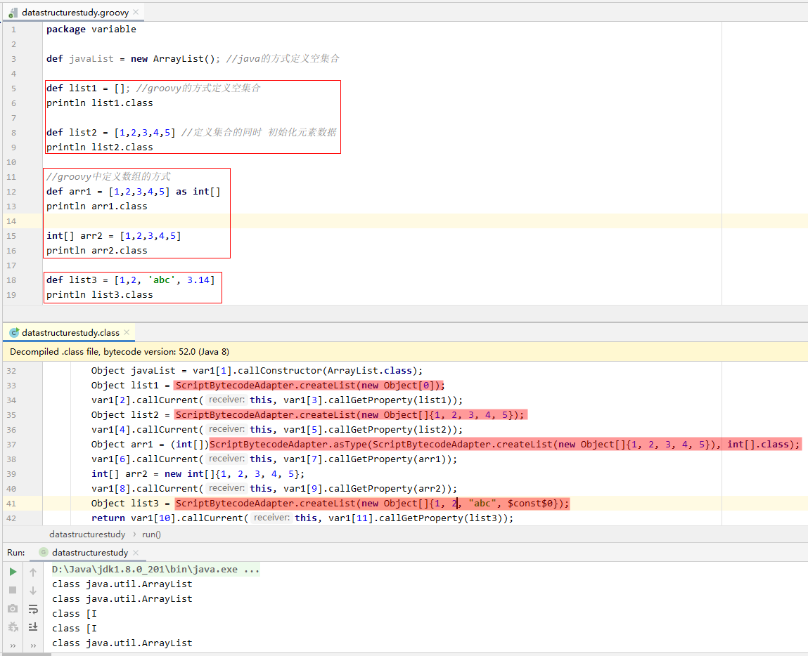

### 1.2 列表相关操作的 `API`

#### 1.2.1 排序：`sort(self, closure)`

##### 1.2.1.1 两种排序方式

**方式一：** 采用 `java` 的方式进行排序；

**方式二：** 采用 `DefaultGroovyMethods` 提供的如下两个方法进行排序：

```groovy:no-line-numbers
static <T> List<T> sort(Iterable<T> self)
```

```:no-line-numbers
作用：对 self 中的元素本身进行自然排序。
参数：参数 self 是调用者本身，不需要手动传参。
```

```groovy:no-line-numbers
static <T> List<T> sort(Iterable<T> self, Closure closure)
```

```:no-line-numbers
作用：按自定义规则排序。
参数：
    self 是调用者本身，不需要手动传参
    closure 用于定义比较规则，闭包参数类型为可变参数，可以传入一个元素，也可以传入两个元素：
        当传入一个元素时：
            按照闭包的返回结果进行自然排序
        当传入两个元素时：
            返回 0 表示 参数1元素 = 参数2元素
            返回-1 表示 参数1元素 < 参数2元素
            返回 1 表示 参数1元素 > 参数2元素
```

##### 1.2.1.2 示例一：`Java` 方式与 `Groovy` 方式

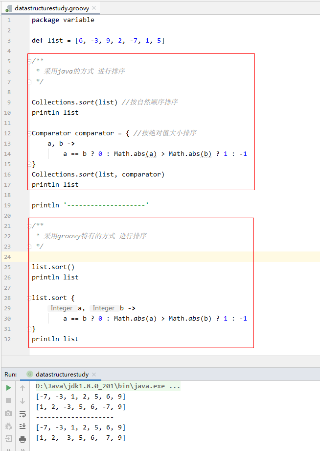

##### 1.2.1.3 示例二：`sort(self, closure)` 中参数 `closure` 传入一个元素

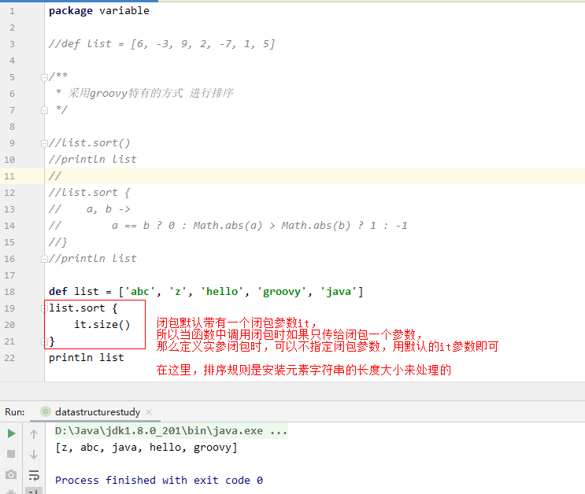

#### 1.2.2 查找

采用 `DefaultGroovyMethods` 提供的方法进行查找。

##### 1.2.2.1 查找满足条件的某个元素：`find(self, closure)`

```groovy:no-line-numbers
static <T> T find(Collection<T> self, Closure closure)
```

```:no-line-numbers
作用：
    按照参数闭包定义的查找规则，从左往右查找满足规则的元素，
    只要找到一个即可结束查找，并返回查找到的元素。
参数：
    self 指调用者本身，不需要传参；
    closure 是一个用来定义查找规则的闭包，将当前遍历到的列表元素作为闭包参数，返回布尔值表示当前元素是否满足查找规则。
返回值：
    返回第一个查找到的元素；没查找到则返回 null。
```

##### 1.2.2.2 查找满足条件的某些元素：`findAll(self, closure)`

```groovy:no-line-numbers
static <T> List<T> findAll(List<T> self, Closure closure)
```

```:no-line-numbers
作用：
    按照参数闭包定义的查找规则，从左往右查找满足规则的元素，
    将所有查找到的元素存入一个创建好的新列表中。
参数：
    self 指调用者本身，不需要传参；
    closure 是一个用来定义查找规则的闭包，将当前遍历到的列表元素作为闭包参数，返回布尔值表示当前元素是否满足查找规则。
返回值：
    返回存储了所有满足查找规则的元素的新列表；如果一个元素没找到，则返回的新列表是一个空列表。
```

##### 1.2.2.3 判断是否存在任一元素满足条件：`any(self, closure)`

```groovy:no-line-numbers
static <T> boolean any(Iterable<T> self, Closure closure)
```

```:no-line-numbers
作用：
    按照参数闭包定义的查找规则，从左往右查找满足规则的元素，
    判断列表中是否至少有一个满足规则的元素。
参数：
    self 指调用者本身，不需要传参；
    closure 是一个用来定义查找规则的闭包，将当前遍历到的列表元素作为闭包参数，返回布尔值表示当前元素是否满足查找规则。
返回值：
    true 列表中存在至少一个满足规则的元素；
    false 列表中不存在满足规则的元素。
```

##### 1.2.2.4 判断是否所有元素满足条件：`every(self, closure)`

```groovy:no-line-numbers
static <T> boolean every(Iterable<T> self, Closure closure)
```

```:no-line-numbers
作用：
    按照参数闭包定义的查找规则，从左往右查找满足规则的元素，
    判断列表中是否所有元素都满足规则。
参数：
    self 指调用者本身，不需要传参；
    closure 是一个用来定义查找规则的闭包，将当前遍历到的列表元素作为闭包参数，返回布尔值表示当前元素是否满足查找规则。
返回值：
    true 列表中所有元素都满足规则；
    false 列表中存在不满足规则的元素。
```

##### 1.2.2.5 示例代码一

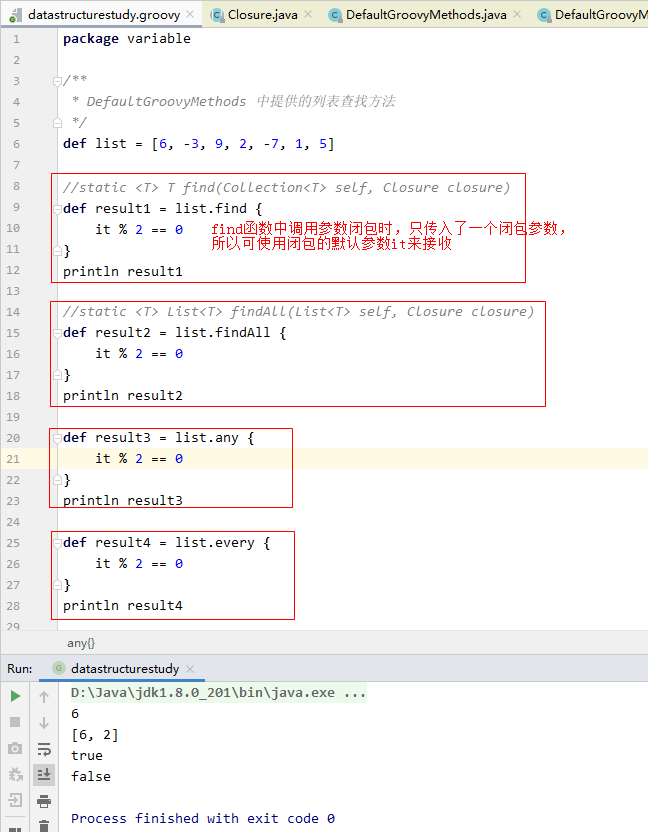

##### 1.2.2.6 取出列表中的最小元素：`min(self, closure)`

```groovy:no-line-numbers
static <T> T min(Iterable<T> self)
```

```:no-line-numbers
作用： 
    对 self 中的元素本身进行相互比较，返回最小元素。
参数：
    self 表示调用者本身，不需要传参。
返回值：
    返回最小元素。
```

```groovy:no-line-numbers
static <T> T min(Iterable<T> self, Closure closure)
```

```:no-line-numbers
作用：
    通过闭包指定比较规则，对闭包的返回结果进行相互比较，
    返回最小的闭包返回结果所对应的 self 中的元素。
参数：
    self 表示调用者本身，不需要传参；
    closure 用于指定比较规则，将当前遍历到的 self 中的元素作为闭包参数，闭包的返回结果作为比较对象。
返回值：
   返回最小的闭包返回结果所对应的 self 中的元素。
```

##### 1.2.2.7 取出列表中的最大元素：`max(self, closure)`

```groovy:no-line-numbers
static <T> T max(Iterable<T> self)
```

```:no-line-numbers
与 min(self) 类似。
```

```groovy:no-line-numbers
static <T> T max(Iterable<T> self, Closure closure)
```

```:no-line-numbers
与 min(self, closure) 类似。
```

##### 1.2.2.8 示例代码二

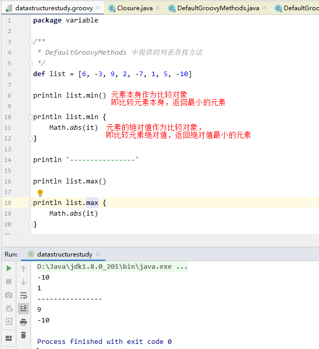

##### 1.2.2.9 统计满足条件的元素个数：`count(self, closure)`

```groovy:no-line-numbers
static <T> Number count(Iterable<T> self, Closure closure)
```

```:no-line-numbers
作用：
    通过闭包指定统计规则，返回满足统计规则的 self 中的元素个数。
参数：
    self 作为调用者，不需要传参；
    closure 用于指定统计规则，将当前遍历到的 self 中的元素作为闭包参数，返回布尔值表示当前元素是否满足统计规则。
返回值：
    返回满足统计规则的 self 中的元素个数。
```

##### 1.2.2.10 示例代码三

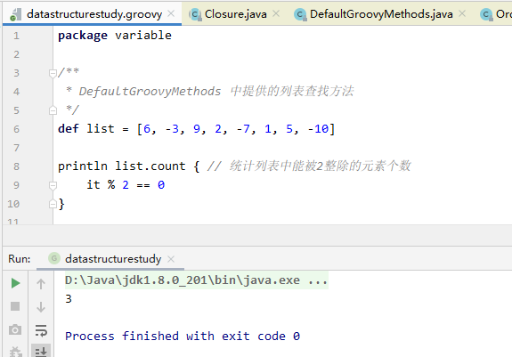

## 2. 映射（`Map`）

### 2.1 `Map` 的定义方式

**方式一：** `Java` 语法的定义形式

```groovy:no-line-numbers
def map = new HashMap()
```
    

**方式二：** `Groovy` 特有的定义形式

```groovy:no-line-numbers
def map = [key1: value1, key2: value2, key3: value3, ...]

// 定义空 map
def map = [:]
```

**注意：**

1. 定义 `Map` 进行元素初始化时，如果 `key` 是一个不可变字符串（单引号字符串），那么可以省略单引号；

2. 定义 `Map` 进行元素初始化时，如果 `key` 是包含字母的标识符，那么会把 `key` 当做一个不可变字符串（单引号字符串）类型的 `key` 值；

3. 采用 `Groovy` 特有的方式定义 `Map` 时，默认使用的是 `java.util.LinkedHashMap`，也可以在定义时使用关键字 `as` 转为其他类型的 `Map`，如：

    ```groovy:no-line-numbers
    def map = [key1: value1, key2: value2, key3: value3, ...] as TreeMap
    ```

    ```:no-line-numbers
    由于 LinkedHashMap 是 HashMap 的子类，所以再执行
        def map = [key1: value1, key2: value2, key3: value3, ...] as HashMap 
    并不会把 LinkedHashMap 转为 HashMap，这是因为多态的特性。（LinkedHashMap 可以透明的当成 HashMap）
    ```

4. `Map` 中的可以存放任意类型的键值对，即每个 `key` 的类型可以是任意的，每个 `value` 的类型也可以是任意；

5. 查看 `Map` 对象的类型时，应该使用 `map.getClass();` 不能使用 `map.class`，这样会把 "`class`" 当做 `map` 中的 `key` 值看待；

6. 可以直接打印 `Map`，即： 

    ```groovy:no-line-numbers
    println map
    // 相当于：
    println map.toMapString()
    ```

#### 2.1.1 示例代码一

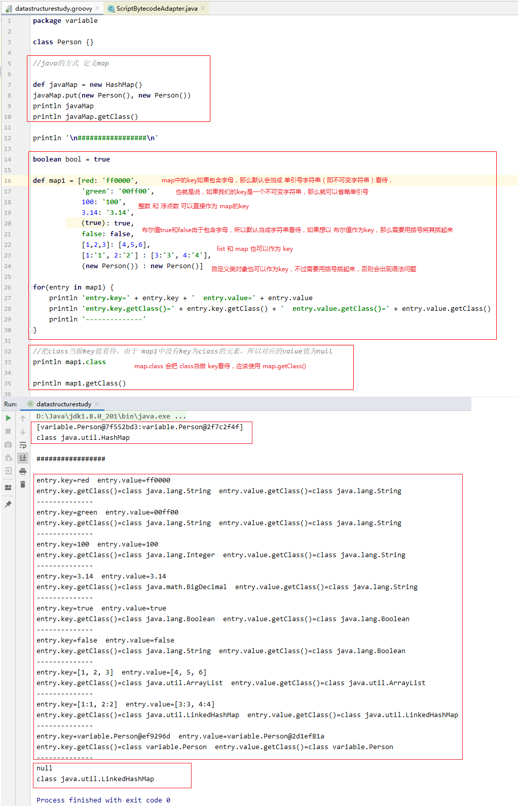

#### 2.1.2 示例代码二

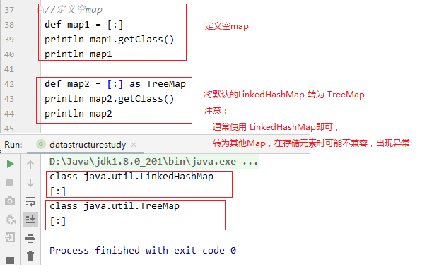

### 2.2 `Map` 中元素的存取

**存的四种方式：**

```groovy:no-line-numbers
// 方式一：定义 Map 时，进行初始化存储： 
def map = [key: value]

// 方式二
map.put(key, value)

// 方式三
map.key = value

// 方式四
map[key] = value
```

**取的三种方式：**

```groovy:no-line-numbers
// 方式一
map.get(key)

// 方式二
map.key

// 方式三
map[key]
```

**注意：**

1. 当 `key` 是不可变字符串（单引号字符串）时，只有 `map.key` 的形式才能省略单引号；

    > 同时也表示，如果 `key` 是包含字母的标识符，那么 `map.key` 的形式中，会把 `key` 看待成一个不可变字符串。

    

2. 采用 `map[key]`、`map.put(key)` 或 `map.get(key)` 的形式时，如果 `key` 是一个不可变字符串（单引号字符串），那么不能省略单引号；

    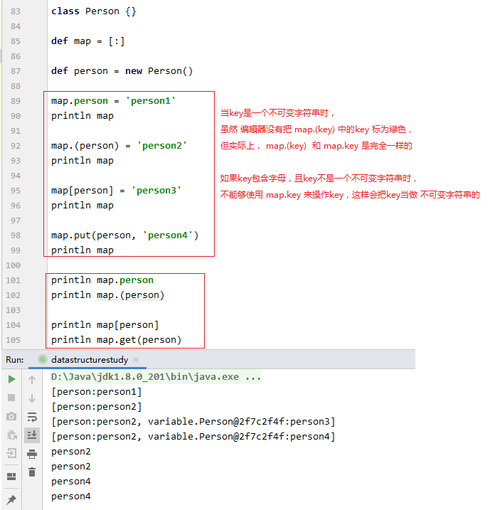

3. 如果 `key` 包含字母，且 `key` 不是一个不可变字符串，如 `key` 是一个非字符串类型的变量名，那么应该使用 `map[key]`、`map.put(key)` 或 `map.get(key)`

    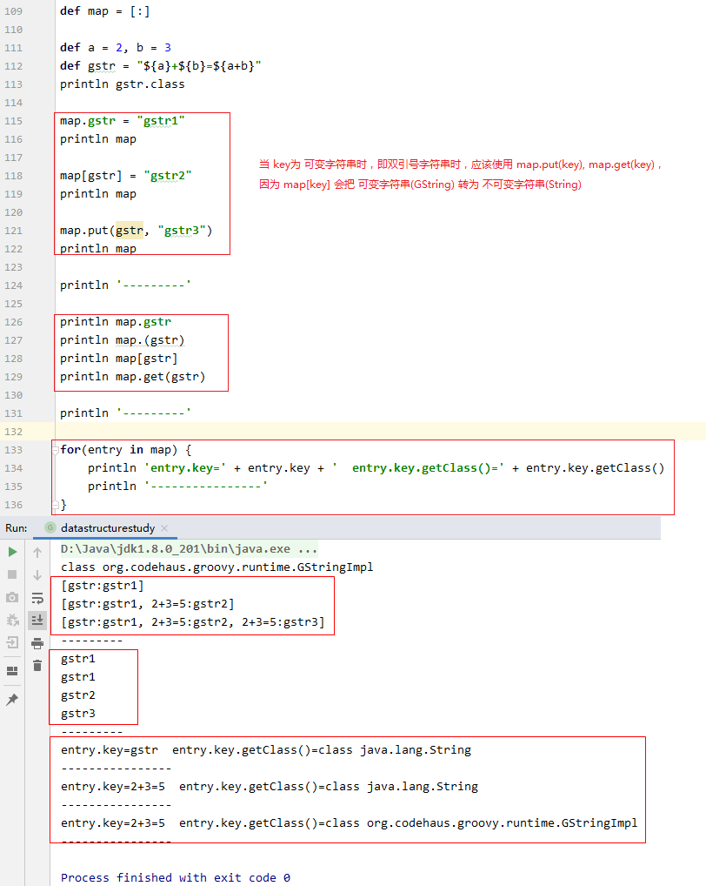

4. 特别地，当 `key` 是一个可变字符串（`GString` 类型）时，由于 `map[key]` 会把 `key` 先转换为不可变字符串（`String` 类型），所以不能采用 `map[key]` 的形式进行存取。应该采用 `map.put(key)` 或 `map.get(key)` 的形式存取。另外，也可以在定义 `map` 时初始化存入一个可变字符串，但是取的时候只能通过 `map.get(key)` 的形式取。

    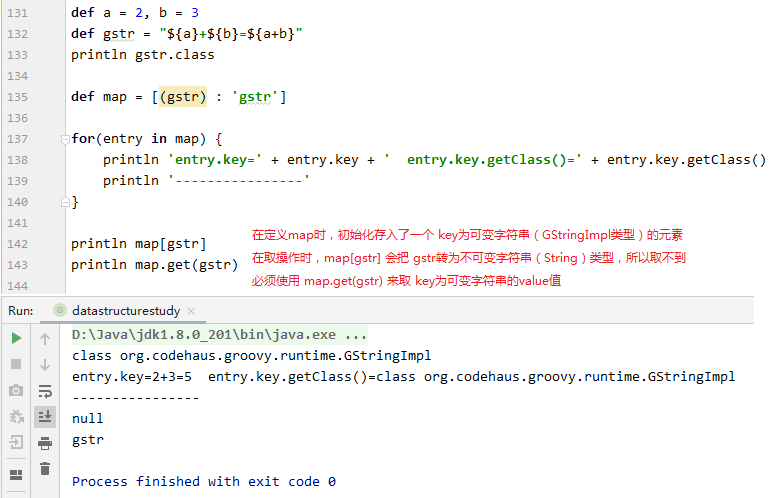


### 2.3 `Map` 的遍历操作

**注意：**

如果 `Map` 对象是 `LinkedHashMap` 类型，那么 `Map` 容器中的键值对元素 `entry` 就是 `LinkedHashMap.Entry` 类型。

并且在 `Groovy` 中，可以通过 `entry.key` 来获取 `key` 值；通过 `entry.value` 来获取 `value` 值（不用像 `Java` 中那样调用 `getter` 方法）。

#### 2.3.1 采用 `each(self, closure)` 方法进行遍历

`DefaultGroovyMethods` 提供的 `each` 方法进行遍历。

```groovy:no-line-numbers
static <K, V> Map<K, V> each(Map<K, V> self, Closure closure)
```

```:no-line-numbers
作用：
    对 self 表示的 Map 容器进行遍历，并将每次遍历到的键值对元素交给参数闭包处理。
参数：
    self：表示调用者本身，即调用 each 方法的 Map 对象。是一个隐式参数，不需要传参；
    closure：可以是带一个参数的闭包，也可以是带两个参数的闭包
        1. 当实参闭包定义为带一个参数的闭包时，这个参数表示键值对 entry，
           key 值可以通过 entry.key 获取；value 值可以通过 entry.value 获取；
        2. 当实参闭包定义为带两个参数的闭包时，参数1为 key 值，参数2为 value 值。
返回值：
    each 方法返回 self 调用者本身。
```

#### 2.3.2 采用 `eachWithIndex(self, closure)` 方法进行遍历

`DefaultGroovyMethods` 提供的 `eachWithIndex` 方法进行遍历。

```groovy:no-line-numbers
static <K, V> Map<K, V> eachWithIndex(Map<K, V> self, Closure closure)
```

```:no-line-numbers
作用：
    对 self 表示的 Map 容器进行遍历，并将每次遍历到的键值对元素交给参数闭包处理。
参数：
    self：表示调用者本身，即调用 eachWithIndex 方法的 Map 对象。是一个隐式参数，不需要传参；
    closure：可以是带两个参数的闭包，也可以是带三个参数的闭包
        1. 当实参闭包定义为带两个参数的闭包时，
            参数1表示键值对 entry。key 值可以通过 entry.key 获取；value 值可以通过 entry.value 获取；
            参数2表示当前键值对在遍历时的索引值 index。
        2. 当实参闭包定义为 带三个参数的闭包时，
            参数1为 key 值；
            参数2为 value 值；
            参数3表示当前键值对在遍历时的索引值 index。
返回值：
    eachWithIndex 方法返回 self 调用者本身。
```

#### 2.3.3 采用 `for-in` 循环进行遍历

```groovy:no-line-numbers
for(entry in map) {
    // key 通过 entry.key 获取
    // value 通过 entry.value 获取
}
```

#### 2.3.4 示例代码

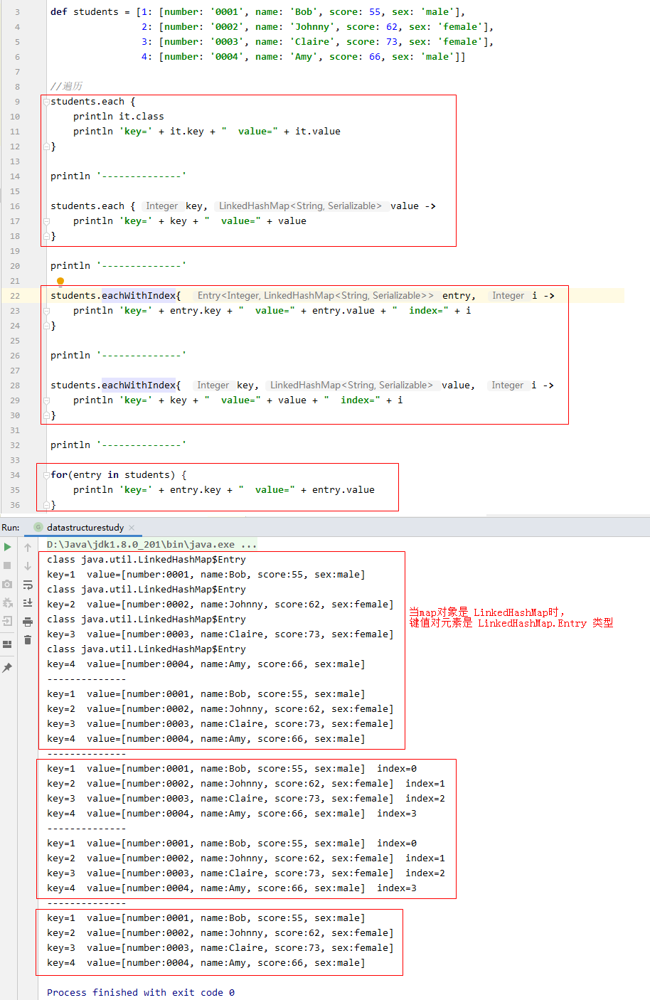


### 2.4 `Map` 的查找操作

#### 2.4.1 查找满足条件的某个键值对元素：`find(self, closure)`

```groovy:no-line-numbers
static <K, V> Map.Entry<K, V> find(Map<K, V> self, Closure<?> closure)
```

```:no-line-numbers
作用：
    对 self 表示的 Map 容器进行遍历，返回符合闭包 closure 所指定条件的第1个键值对元素。
参数：
    self：表示调用该 find 方法的 Map 对象本身。为隐式参数，不需要手动传参；
    closure：指定查找条件，应该返回布尔值，用来通知主调函数 find 传入闭包的键值对元素是否满足条件。
        当定义的实参闭包带一个参数时，参数为 Map.Entry 类型的键值对元素（推荐）；
        当定义的实参闭包带两个参数时，参数1为 key 值，参数2为 value 值。
返回值：
    返回符合闭包 closure 所指定条件的第1个 Map.Entry 类型的键值对元素。
```

#### 2.4.2 查找满足条件的某些键值对元素：`findAll(self, closure)`

```groovy:no-line-numbers
static <K, V> Map<K, V> findAll(Map<K, V> self, Closure closure)
```

```:no-line-numbers
作用：
    对 self 表示的 Map 容器进行遍历，返回符合闭包 closure 所指定条件的所有键值对元素。
参数：
    self：表示调用该 findAll 方法的 Map 对象本身。为隐式参数，不需要手动传参；
    closure：指定查找条件，应该返回布尔值，用来通知主调函数 findAll 传入闭包的键值对元素是否满足条件。
        当定义的实参闭包带一个参数时，参数为 Map.Entry 类型的键值对元素（推荐）；
        当定义的实参闭包带两个参数时，参数1为 key 值，参数2为 value 值。
返回值：
    返回符合闭包 closure 所指定条件的所有键值对元素所组成的新的 Map 容器。
```

#### 2.4.3 统计满足条件的键值对元素个数：`count(self, closure)`

```groovy:no-line-numbers
static <K,V> Number count(Map<K,V> self, Closure<?> closure)
```

```:no-line-numbers
作用：
    对 self 表示的 Map 容器进行遍历，返回符合闭包 closure 所指定条件的所有键值对元素的总个数。
参数：
    self：表示调用该 count 方法的 Map 对象本身。为隐式参数，不需要手动传参；
    closure：指定查找条件，应该返回布尔值，用来通知主调函数 count 传入闭包的键值对元素是否满足条件。
        当定义的实参闭包带一个参数时，参数为 Map.Entry 类型的键值对元素（推荐）；
        当定义的实参闭包带两个参数时，参数1为 key 值，参数2为 value 值。
返回值：
    返回符合闭包 closure 所指定条件的所有键值对元素的总个数。
```

#### 2.4.4 返回根据键值对转换成的集合：`collect(self, transform)`

```groovy:no-line-numbers
static <T,K,V> List<T> collect(Map<K,V> self, Closure<T> transform)
```

```:no-line-numbers
作用：
    对 self 表示的 Map 容器进行遍历，将遍历到的键值对元素交给闭包 transform 处理。
    并将处理后由闭包 transform 返回的结果值存入一个 list 容器中，最后主调函数 collect 返回这个 list 容器。
参数：
    self：表示调用该 collect 方法的 Map 对象本身。为隐式参数，不需要手动传参；
    closure：对传入的键值对元素进行处理，并将处理后的结果值返回给主调函数 collect，闭包返回的结果值可以是任意类型。
        当定义的实参闭包带一个参数时，参数为 Map.Entry 类型的键值对元素（推荐）；
        当定义的实参闭包带两个参数时，参数1为 key 值，参数2为 value 值。
返回值：
    返回由闭包 transform 的结果值所构成的 list 容器。
```

#### 2.4.5 对键值对进行分组：`groupBy(self, closure)`

```groovy:no-line-numbers
static <G, K, V> Map<G, Map<K, V>> groupBy(Map<K, V> self, Closure<G> closure)
```

```:no-line-numbers
作用：
    对 self 表示的 Map 容器进行遍历，将遍历到的键值对元素交给闭包 closure 处理。
    并将处理后由闭包 closure 返回的结果值作为分组条件，然后将同一分组条件下的键值对元素作为一组，存入一个新的 Map 容器。
    最后，以分组条件（即闭包 closure 的结果值）作为 key，以满足该分组条件的同组下的所有键值对元素（即一个新的 Map 容器）作为 value，
    构成另一个新的表示最终的分组结果的 Map 容器，主调函数 groupBy 返回这个表示最终分组结果的 Map 容器。
参数：
    self：表示调用该 groupBy 方法的 Map 对象本身。为隐式参数，不需要手动传参；
    closure：对传入的键值对元素进行处理，并将处理后的结果值返回给主调函数 groupBy，闭包返回的结果值可以是任意类型。
        当定义的实参闭包带一个参数时，参数为 Map.Entry 类型的键值对元素（推荐）；
        当定义的实参闭包带两个参数时，参数1为 key 值，参数2为 value 值。
返回值：
    返回以分组条件（即闭包 closure 的结果值）作为 key，以满足该分组条件的同组下的所有键值对元素（即一个新的 Map 容器）作为 value，
    所构成另一个新的表示最终的分组结果的 Map 容器。
```

#### 2.4.6 示例代码

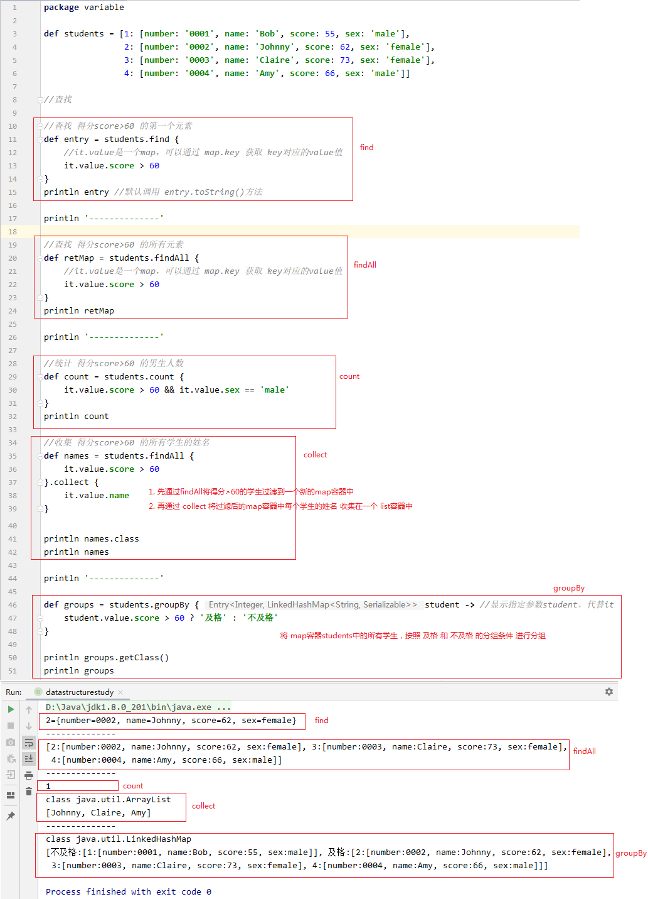

### 2.5 `Map` 的排序操作：`sort(self, closure)`

```groovy:no-line-numbers
static <K, V> Map<K, V> sort(Map<K, V> self, Closure closure)
```

```:no-line-numbers
作用：
    按照闭包 closure 指定的排序规则，对 self 表示的 Map 容器进行排序。
参数：
    self：表示调用该 sort 方法的 Map 对象本身。为隐式参数，不需要手动传参；
    closure：指定排序规则
        当定义的实参闭包带一个参数时，参数为 Map.Entry 类型的键值对元素，此时：
            以对参数元素进行处理后得到的结果值为排序对象，进行自然排序（即按照结果值从小到大对元素进行排序）。
        当定义的实参闭包带两个参数时，参数1和参数2都为 Map.Entry 类型的键值对元素，此时：
            通过闭包的结果值来比较参数1元素和参数2元素的大小：
                结果值为0  -> 参数1元素 = 参数2元素
                结果值为-1 -> 参数1元素 < 参数2元素
                结果值为1  -> 参数1元素 > 参数2元素
返回值：
    返回排序后的另一个新的 Map 容器。
```

#### 2.5.1 `Map` 排序与 `List` 排序的区别

`list.sort` 返回的 `list` 就是调用者 `list`，即 **`list` 容器是对自身进行排序**。

而 `map.sort` 返回的 `map` 是一个新的 `map`，即 **`map` 容器不能对自身进行重新排序**。

#### 2.5.2 示例代码

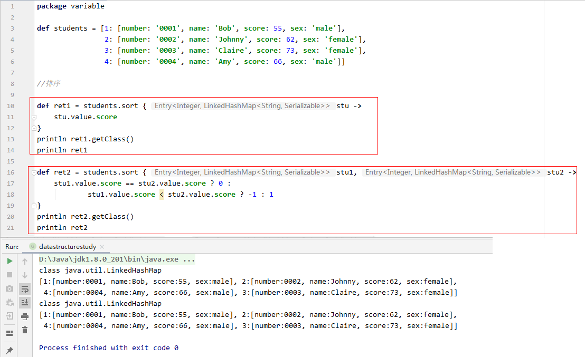

## 3. 范围（`Range`）

### 3.1 `Range` 就是一个轻量级的 `List`

`Range` 其实就是一个轻量级的 `List`。

`Range` 继承自 `List`，所以 `List` 相关的 `API`，`Range` 都能使用。

```groovy:no-line-numbers
interface Range<T extends Comparable> extends List<T>
```

### 3.2 `Range` 的三个实现类：`IntRange`、`ObjectRange`、`EmptyRange`

**`IntRange`**

```groovy:no-line-numbers
class IntRange extends AbstractList<Integer> implements Range<Integer>
```

**`ObjectRange`**

```groovy:no-line-numbers
class ObjectRange extends AbstractList implements Range
```

**`EmptyRange`**

```groovy:no-line-numbers
class EmptyRange extends AbstractList implements Range
```

### 3.3 `Range` 的定义

**注意：**

1. 采用 `from..to` 的形式定义的 `Range` 的范围是 `[from, to]`，即包含 `to`；

2. 采用 `from..<to` 的形式定义的 Range 的范围是 `[from, to)`，即不包含 `to`。

#### 3.3.1 `IntRange` 的定义

```groovy:no-line-numbers
def range = from..to 
```

```:no-line-numbers
range 的元素范围是 [from, to]，其中元素 from 和元素 to 都是 int 整型。
```

#### 3.3.2 `ObjectRange` 的定义

```groovy:no-line-numbers
def range = from..to
```

```:no-line-numbers
range 的元素范围是 [from, to]，其中元素 from 和元素 to 都是除整型之外的其他类型，如：浮点型、字符串或自定义类型。
```

**注意：**

1. 当自定类型作为 `Range` 的元素时：

    ```:no-line-numbers
    1. 自定义类 T 需要继承接口 Comparable<T>，并重写 "int compareTo(T t)" 方法；
    2. 自定义类 T 中还需要定义 "T next()" 方法，该方法会通过反射在 ObjectRange 中调用；
    3. 自定义类 T 中还需要定义 "T previous()" 方法，该方法会通过反射在 ObjectRange 中调用。
    ```

2. 对于 `GString` 和 `String` 类型的字符串：

    ```:no-line-numbers
    1. GString 和 String 都继承了接口 Comparable；
    2. 并且 next 和 previous 方法由 StringGroovyMethods 类提供。
    ```

3. 对于 `int` 整型之外其他数字：

    ```:no-line-numbers
    1. 都会自动装箱成对应的数字类型；
    2. 数字类型都继承了接口 Comparable；
    3. 并且 next 和 previous 方法由 DefaultGroovyMethods 类提供。
    ```

4. `ObjectRange` 重写了 `List` 的 `contains` 方法；
   
5. `ObjectRange` 中的元素只要实现了 `Comparable` 接口即可，不需要重写 `equals` 方法。

#### 3.3.3 `EmptyRange` 的定义

```groovy:no-line-numbers
def range = from..<from
```

```:no-line-numbers
其中元素 from 可以是任意类型。
```

#### 3.3.4 示例代码

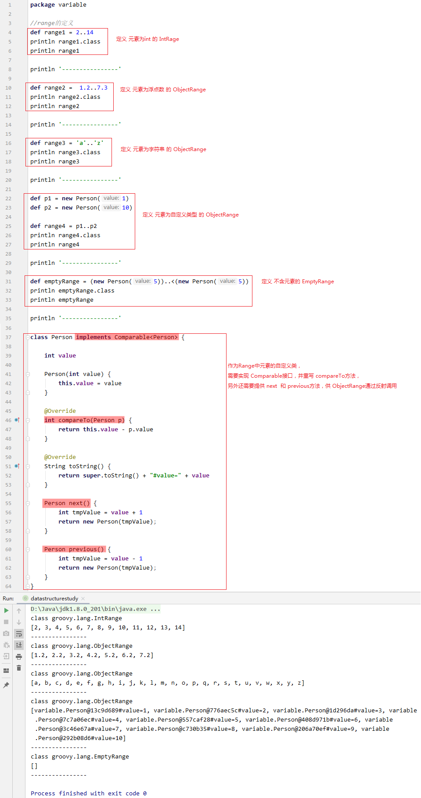

### 3.4 `Range` 中访问元素的操作

**注意：**
    1. Range容器中的元素是通过对 端点值from进行计算得到的，计算的元素值不超过端点值to
        可能存在 Range容器中不包含元素为端点to的情况

    2. ObjectRange中重写了List的contains方法
        Range中的元素只要实现了 Comparable接口即可，不需要重写 equals方法

#### 3.4.1 获取范围 `[from, to]` 的端点值：`range.to`、`range.from`

```groovy:no-line-numbers
def from = range.from
def to = range.to
```

#### 3.4.2 通过下标运算符获取指定索引处的元素：`range[index]`

```groovy:no-line-numbers
def element = range[index]
```

#### 3.4.3 判断 `Range` 中是否包含指定元素：`range.contains(element)`

```groovy:no-line-numbers
range.contains(element) // 返回布尔值
```

#### 3.4.4 注意：可能存在 `Range` 中不包含元素为端点 `to` 的情况

`Range` 容器中的元素是通过对端点值 `from` 进行计算得到的，计算的元素值不超过端点值 `to`。

因此，可能存在 `Range` 容器中不包含元素为端点 `to` 的情况。

#### 3.4.5 示例代码


### 3.5 `Range` 的遍历：`each(self, closure)`

因为 `Range` 继承自 `List`，所以遍历 `List` 的方式同样适用于 `Range`。

```groovy:no-line-numbers
static <T> List<T> each(List<T> self, Closure closure)
```

> 另外，也可以使用 `for-in` 循环遍历 `Range`。

#### 3.5.1 建议：在 `Groovy` 中，能使用闭包的就尽量使用闭包

在 `Groovy` 中，能使用闭包的就尽量使用闭包，所以不推荐使用 `for-in` 循环遍历 `Range`。

#### 3.5.2 示例代码

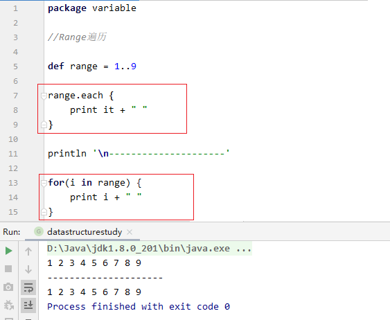

### 3.6 `Range` 在 `switch` 语句中的使用（`Range` 最常用的场景）

在 `Java` 中，为了判断输入值是否在某个范围内，只能通过 `if-else` 语句结合关系运算符和逻辑运算符来进行判断，如：

```java:no-line-numbers
if (number >= 0 && number < 60) { 

} else if(number >=60 && number < 70) { 

} ...
```

但是在 `Groovy` 中，通过 `Range` 我们可以使用 `switch-case` 语句实现上面的代码，如：

```groovy:no-line-numbers
switch(number) {
    case 0..<60: // 范围 [0, 60)
        break
    case 60..<70: // 范围 [60, 70)
        break
    ...
}
```

> 以上就是 `Range` 最常用的场景。

#### 3.6.1 示例代码

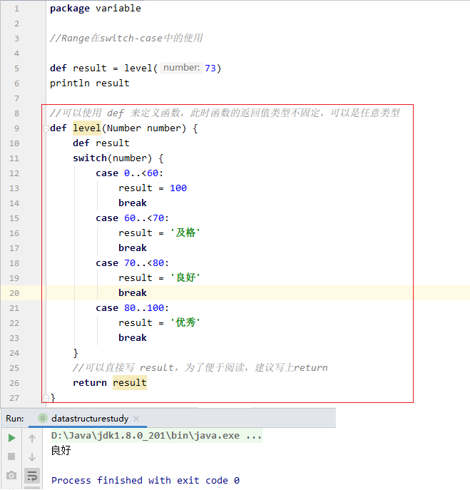

#### 3.6.2 使用 `def` 定义不固定返回值类型的函数

如上代码所示，可以使用 `def` 来定义一个不固定返回值类型的函数：

```:no-line-numbers
def 函数名(形参列表) {
    // 函数体
}
```

```:no-line-numbers
不需要给出函数的具体返回值类型，函数体中最后一条语句的执行结果作为返回值，
所以最后一条语句的执行结果是什么类型，def 定义的函数的返回值就是什么类型，
如果最后一条语句执行后没有结果值，那么 def 定义的函数返回 null。

其实，def 定义的函数的返回值类型就是 Object，从而可以使用多态接收任意类型的返回结果。
```