## 1. 创建 `Groovy` 脚本文件

右键包名 -> `New` -> `Groovy Script`

> 相当于创建一个 `Groovy class` 文件，再把 `class` 类的定义删掉。

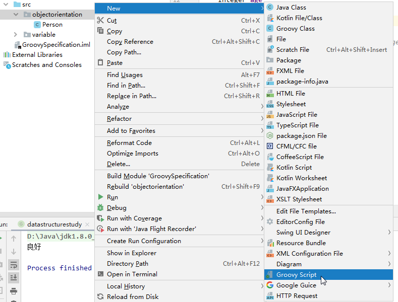

## 2. 类的定义与使用

`Groovy` 中如果省略访问权限修饰符，那么默认是 `public`。

`Groovy` 中的类除了默认继承自 `java.lang.Object`, 还默认都实现了 `groovy.lang.GroovyObject` 接口。

`Groovy` 中语句最后的分号 "`;`" 可以省略（`for` 循环中的分号不能省）。

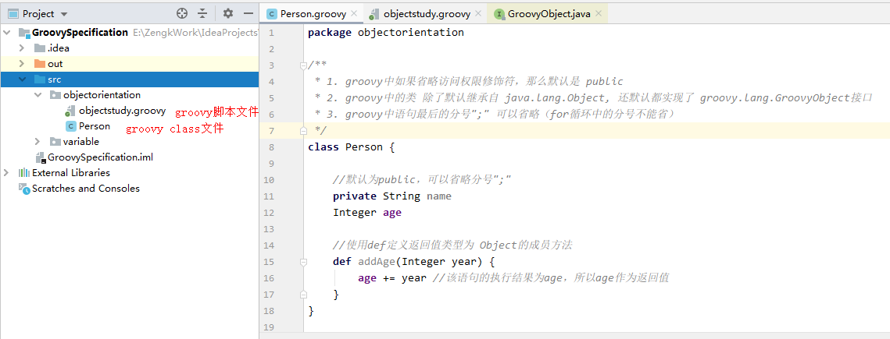

`Groovy` 中创建对象的同时，可以对成员变量进行初始化：

```groovy:no-line-numbers
def 类对象 = new 类名(成员变量名: 成员变量值, 成员变量名: 成员变量值, 成员变量名: 成员变量值, ...)
```

```:no-line-numbers
注意：
1. 这跟定义 Map 时初始化键值对元素是两回事；
2. 可以只初始化部分成员变量。
```

访问类对象的成员变量时，需要注意：

1. `Groovy` 中的 "对象.成员变量" 并不是像 `Java` 那样直接访问成员变量，而是相当于调用了成员变量的 `setter/getter` 方法；

2. 当我们在类中定义了成员变量后，通过类所实现的接口 `GroovyObject`，会为每个成员变量自动生成 `setter/getter` 方法；
    
3. 在 `Groovy` 中的 "对象.成员变量" 就是在调用成员变量的 `setter/getter` 方法，所以，即使成员变量是私有 `private` 的，在 `Groovy` 中也可以使用 "对象.成员变量" 来访问成员变量。

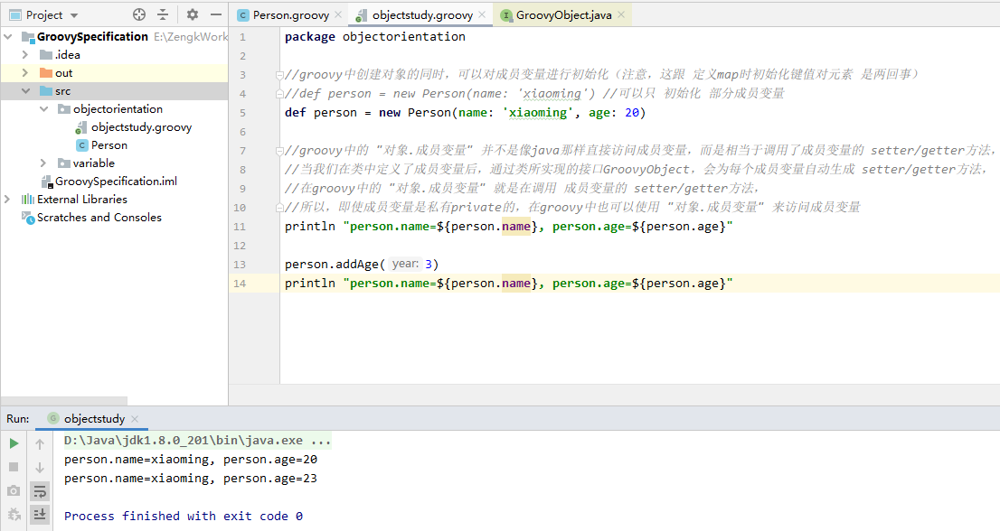

## 3. 接口的定义与使用

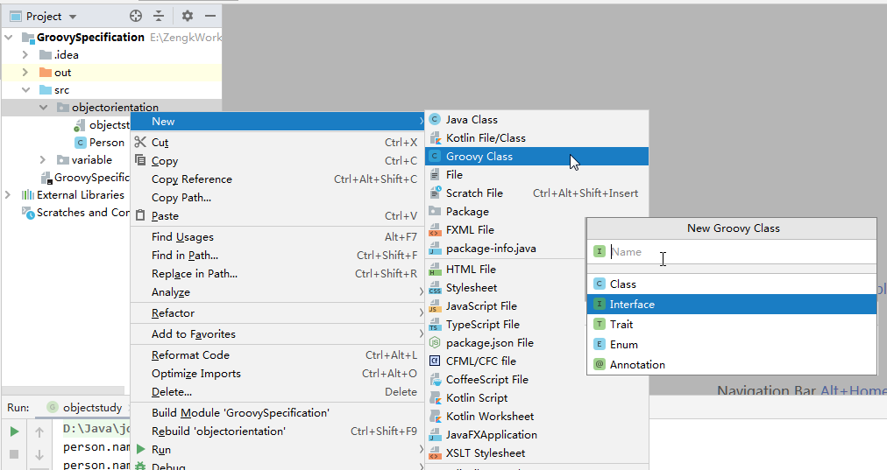

`Groovy` 的接口中不允许定义非 `public` 修饰的方法。

`Groovy` 的接口中也可以使用 `def` 定义不确定返回值类型的方法。

`Groovy` 的接口中定义的方法都是抽象方法，所以不需要加 `abstract` 修饰，也就是说，实现类必须重写接口中的所有方法。

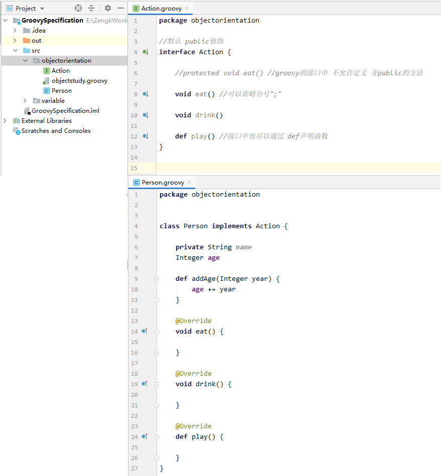

## 4. `Trait` 的定义与使用

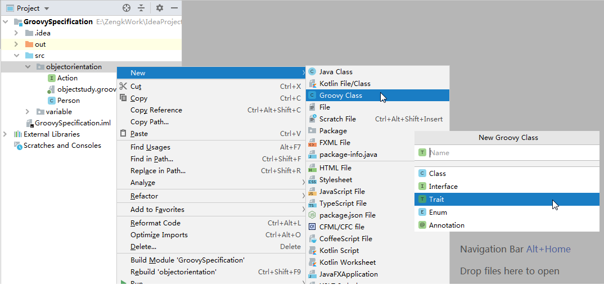

`Groovy` 的 `Trait` 中不允许定义非 `public` 修饰的方法。

`Groovy` 的 `Trait` 中也可以使用 `def` 定义不确定返回值类型的方法。

`Groovy` 的 `Trait` 中即可以定义抽象方法，也可以定义默认方法，但是，定义抽象方法时必须使用关键字 `abstract` 进行修饰。

子类也是通过关键字 `implements` 去实现 `Trait`。

`Groovy` 中的 `Trait` 和接口的唯一区别在于：
    
1. `Trait` 中可以定义默认方法，子类只需要重写 `Trait` 中的抽象方法即可；
   
2. 接口中定义的方法只能是抽象方法，子类必须重写接口中的所有方法。

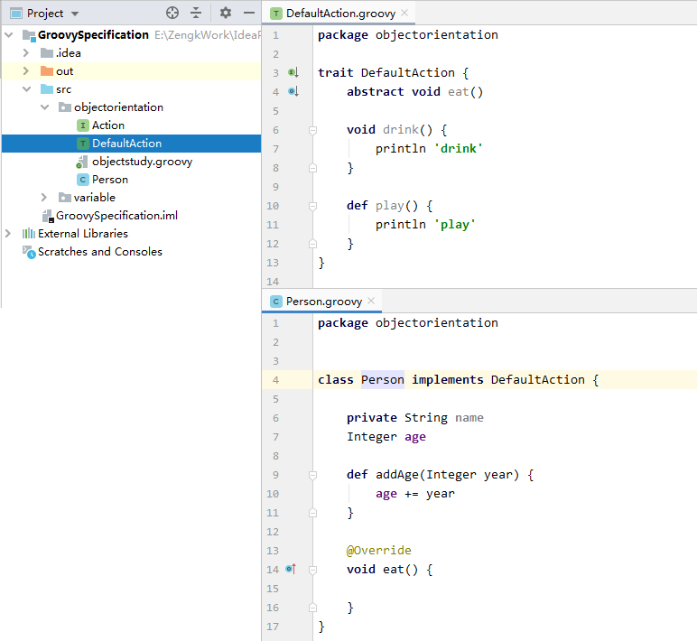

## 5. 元编程

### 5.1 通过元编程可以在运行时为对象添加属性和方法

**背景：**

在 `Java` 中使用反射可以在运行时探索程序的结果，类、方法、参数等。

但是 `Java` 反射仍然局限于所创建的静态结果，无法在运行时修改一个对象的类型，或是让它动态获得行为（方法）。

如果可以基于应用的动态状态或基于应用所接受的输入，动态地（即运行时）添加方法和行为，那么代码会变得更灵活。

在 `Groovy` 中元编程就提供了这一功能 —— 元编程。

**元编程的概念：**

元编程意味着编写能够操作程序的程序，包括操作程序自身。

像 `Groovy` 这样的动态语言通过 **元对象协议**（`MOP：Meta Object Protocol`）提供了这种能力。

在 `Groovy` 中使用 `MOP` 可以动态调用方法，甚至在运行时合成类和方法。

### 5.2 `Groovy` 中成员方法或成员属性的访问流程

`Java` 中的成员方法或成员属性如果在类或父类中找不到，那么在编译时期就会报错。

`Groovy` 中的成员方法或成员属性如果在类或父类中找不到，那么在编译时期是不会报错的。而是在运行时期，根据如下流程图所示，在 `MetaClass` 或其他途径下判断能否访问到相关的方法或属性。如果根据流程图所示，最终都无法访问到方法或属性，才会在运行时期报错。

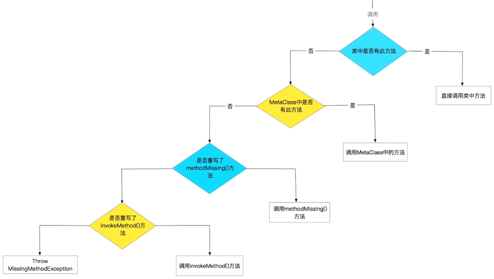

**示例代码一：**

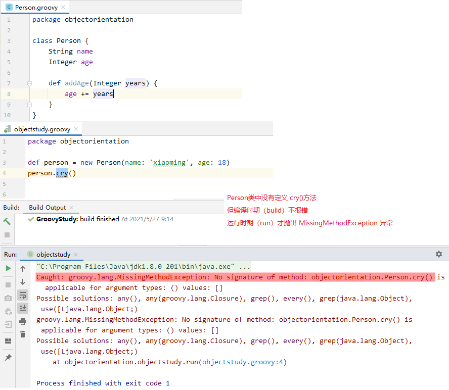

**示例代码二：**

```:no-line-numbers
如果 Person 对象调用了一个没有定义过的方法，但是 Person 类中重写了 "def invokeMethod(String methodName, Object methodArgs)" 方法，
那么会执行该 invokeMethod 方法，其中：
1. 参数 methodName 表示未定义的方法名；
2. 参数 methodArgs 表示调用未定义的方法时传入的参数，可能是一个参数数组；
3. invokeMethod 的返回值就是调用未定义方法时的返回值。
```

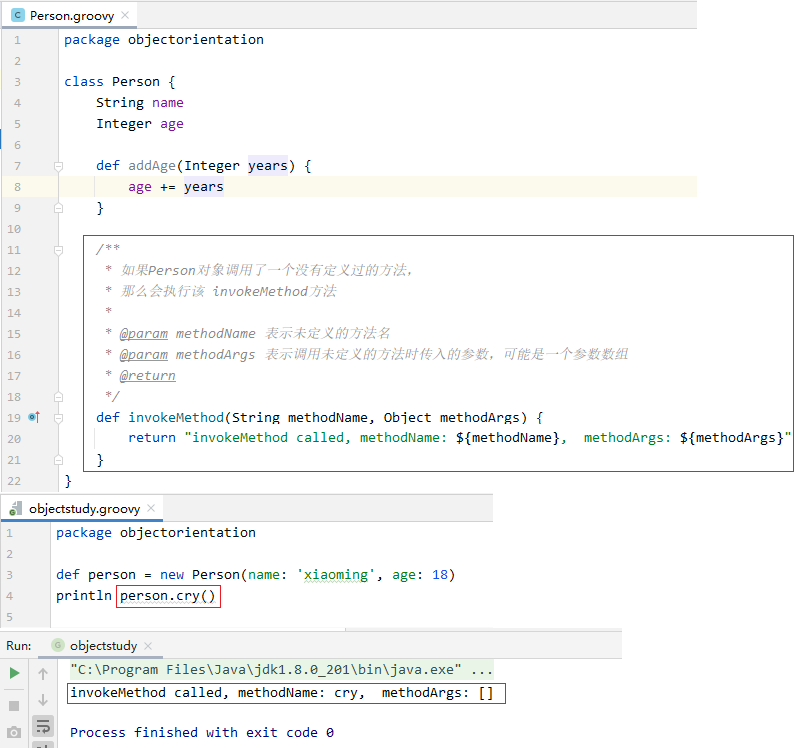

**示例代码三：**

```:no-line-numbers
如果 Person 对象调用了一个没有定义过的方法，但是 Person 类中重写了 "def methodMissing(String methodName, Object methodArgs)" 方法，
那么会执行该 methodMissing 方法，其中：
1. 参数 methodName 表示未定义的方法名；
2. 参数 methodArgs 表示调用未定义的方法时传入的参数，可能是一个参数数组；
3. methodMissing 的返回值就是调用未定义方法时的返回值。
```

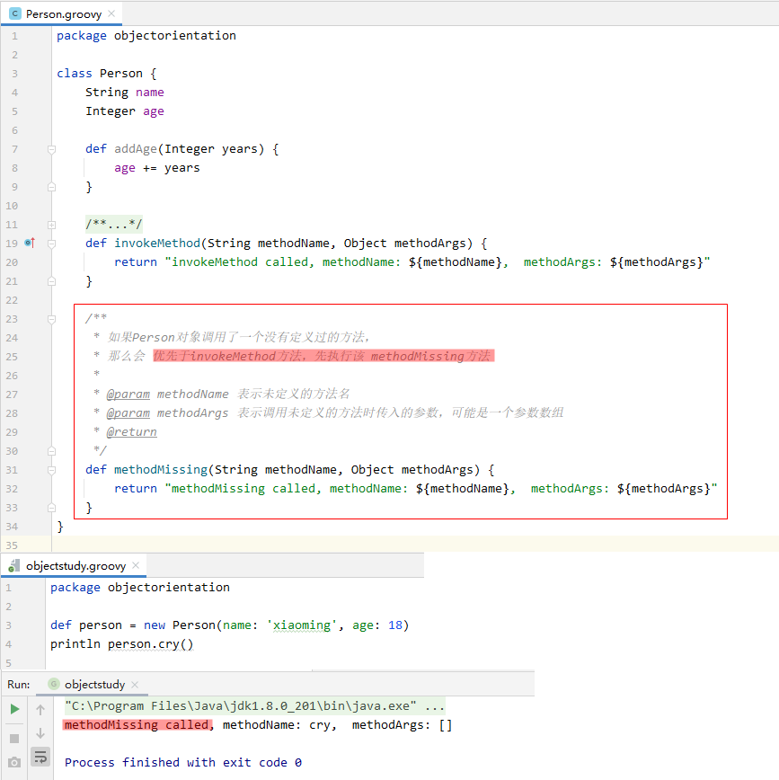

### 5.3 使用 `MetaClass` 动态地添加属性和方法

#### 5.3.1 `Groovy` 中每个类都有对应有一个 `MetaClass`

```:no-line-numbers
对于自定义类，当我们执行 "类名.metaClass" 或者 "对象名.metaClass" 时，会调用 DefaultGroovyMethods 类的 getMetaClass/setMetaClass 方法。

DefaultGroovyMethods 中会为自定义类创建一个 HandleMetaClass 类型的 metaClass 对象，但是 HandleMetaClass 其实只是一个代理。
自定义类真正对应的 MetaClass 其实是 HandleMetaClass 中的 MetaClass 类型的属性 delegate 所指定的 MetaClass 对象。

对于自定义类，HandleMetaClass.delegate 就是一个 MetaClassImpl 类对象。
也就是说，当我们访问 "类名.metaClass" 或者 "对象名.metaClass" 时，其实就是在访问一个 MetaClassImpl 对象。

当然，也可以通过 "类名.metaClass = otherMetaClass" 或者 "对象名.metaClass = otherMetaClass" 为自定义类指定其他的 MetaClass 子类对象。
```

#### 5.3.2 通过 `MetaClass` 创建新的属性

```:no-line-numbers
可以通过 "类名.metaClass.newMemberName = newMemberValue" 或者 "对象名.metaClass.newMemberName = newMemberValue" 
在类对应的 MetaClass 中动态地创建一个新属性，于是，
通过 "类名.newMemberName" 或者 "对象名.newMemberName" 就可以访问到这个新属性。
```

#### 5.3.3 示例代码一

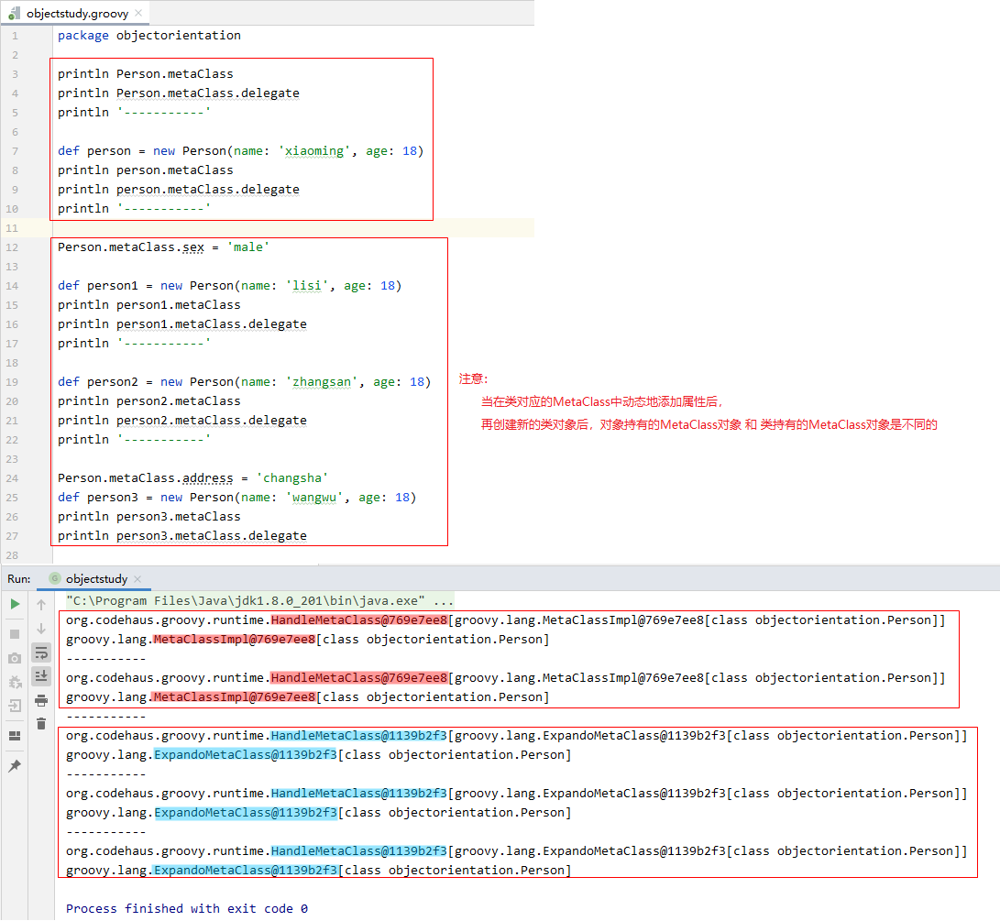

#### 5.3.4 示例代码二

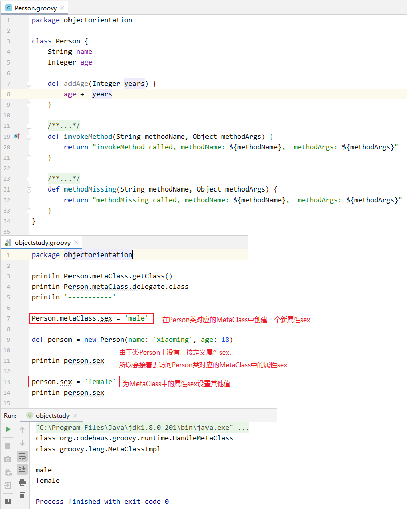


#### 5.3.5 通过 `MetaClass` 创建新的闭包（即新的方法）

```:no-line-numbers
可以通过 "类名.metaClass.newClosureName = {形参列表 -> 函数体}" 或者 "对象名.metaClass.newClosureName = {形参列表 -> 函数体}"
在类对应的 MetaClass 中动态地创建一个新闭包（即新方法），于是，
通过 "类名.newClosureName(实参列表)" 或者 "对象名.newClosureName(实参列表)"  就可以调用这个闭包（即方法）。
```

#### 5.3.6 示例代码三

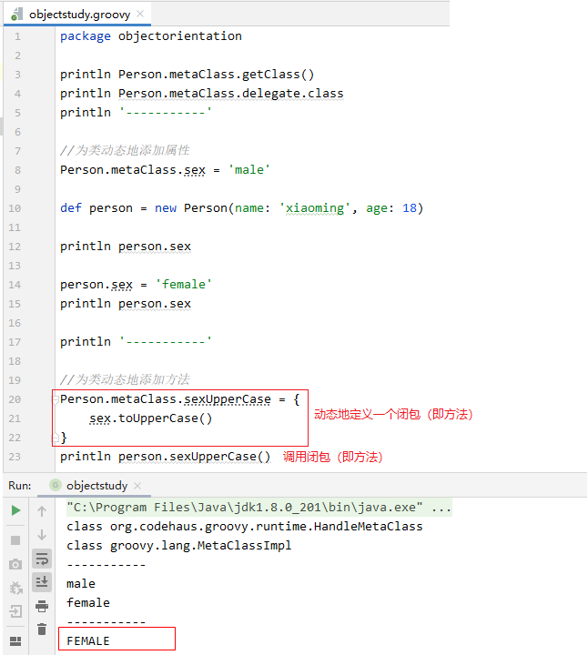

#### 5.3.7 通过 `MetaClass` 创建静态方法

```:no-line-numbers
类名.metaClass.static.newClosureName = {形参列表 -> 函数体}
```

#### 5.3.8 示例代码四

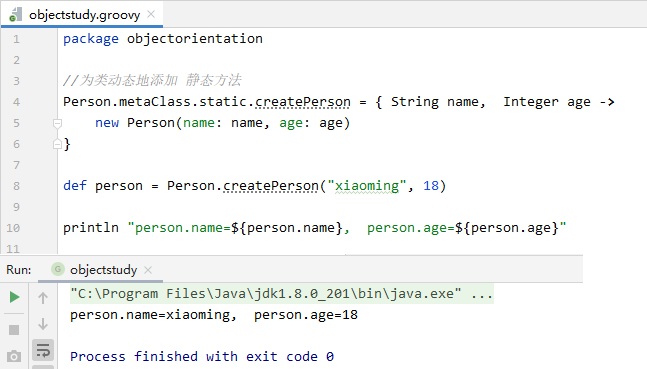

#### 5.3.9 让 `MetaClass` 动态创建的属性和方法全局可见

```:no-line-numbers
在一个 Groovy 文件中通过 MetaClass 为类动态添加的属性和方法，在另一个 Groovy 文件中默认是无法使用的。
如果想在各个 Groovy 文件中都能访问到通过 MetaClass 为类动态添加的属性和方法，
那么需要在添加属性和方法之前调用 "ExpandoMetaClass.enablleGlobally()"。
```

#### 5.3.10 示例代码五

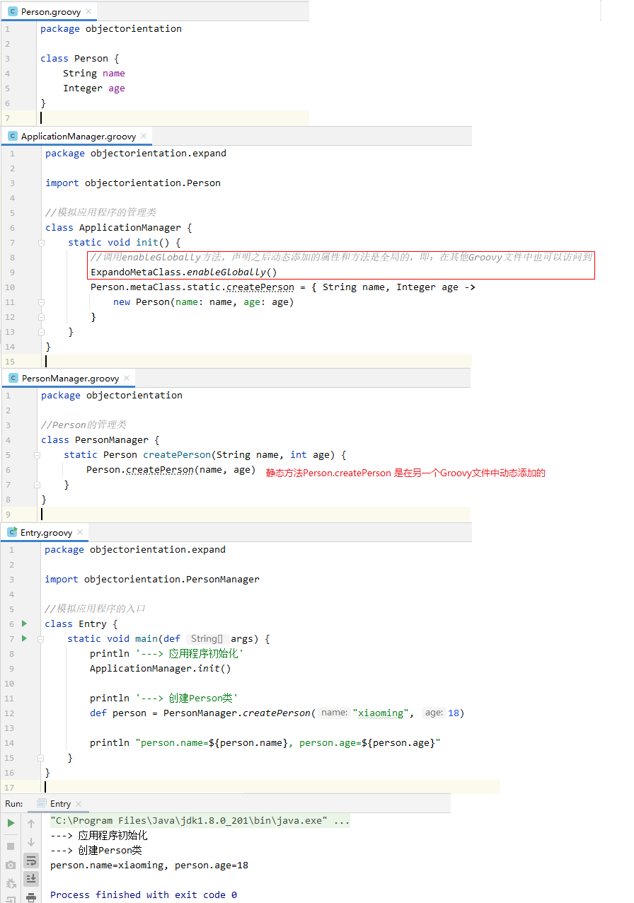