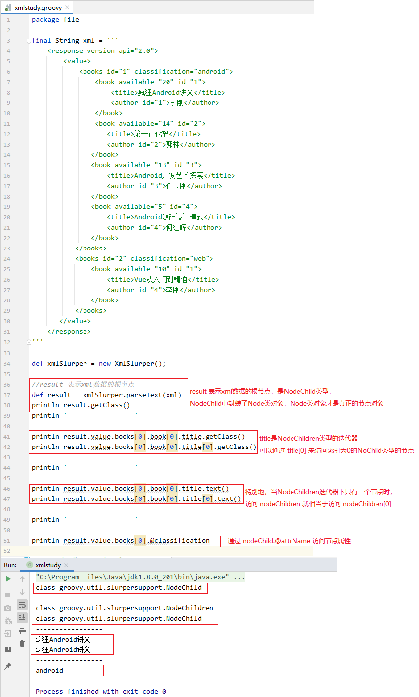
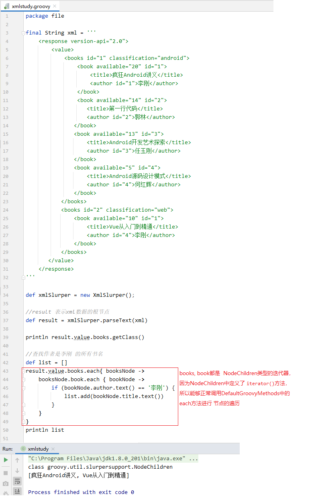
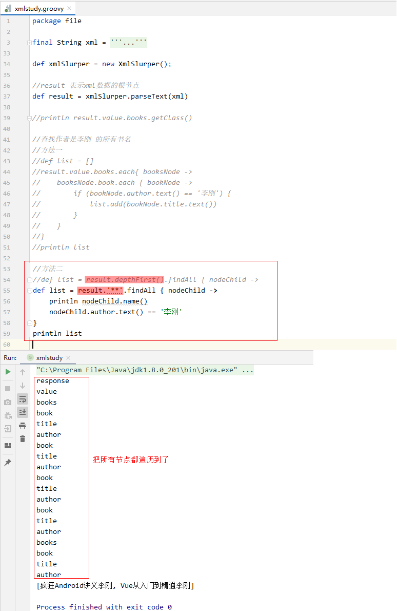
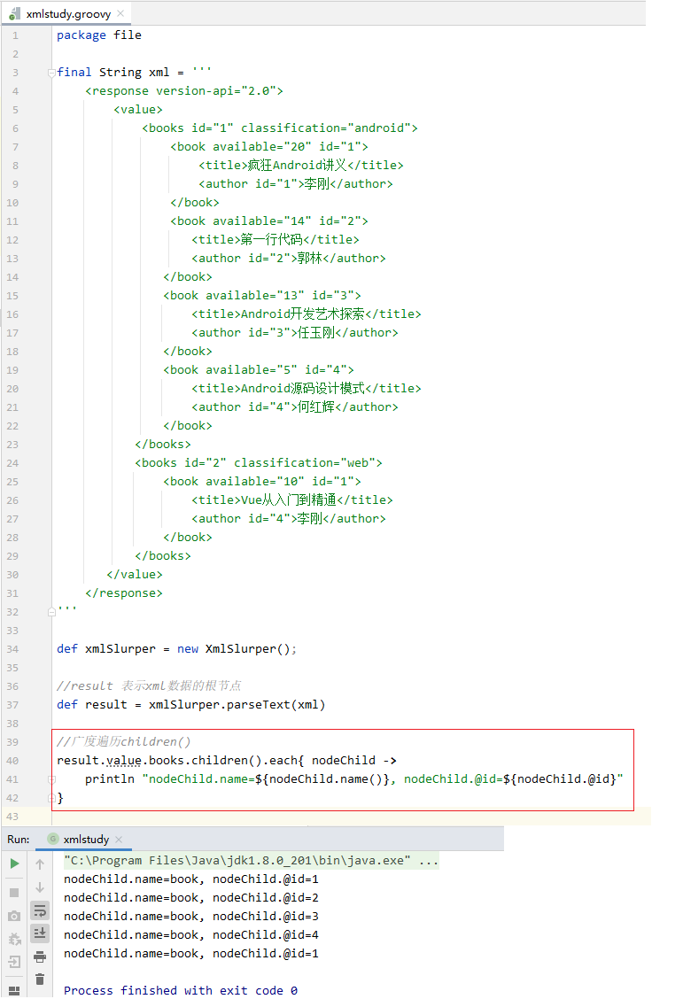
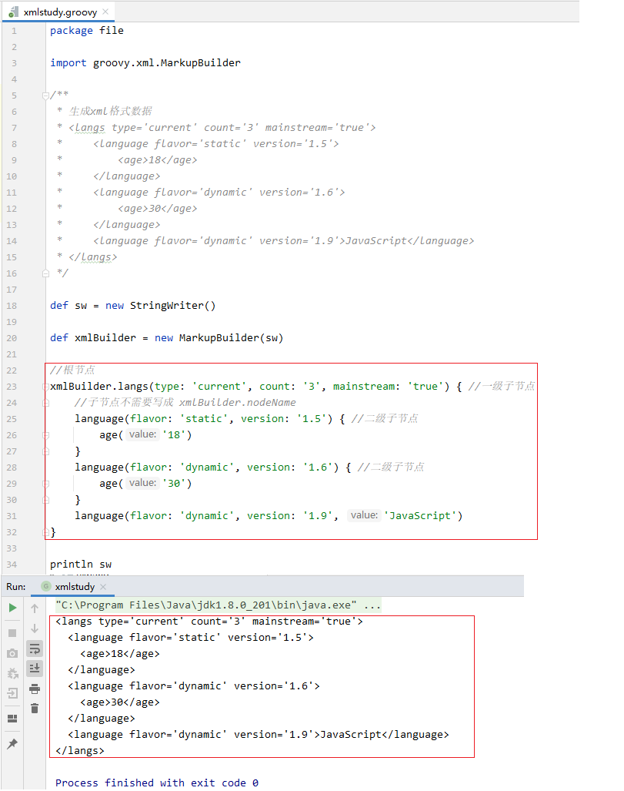
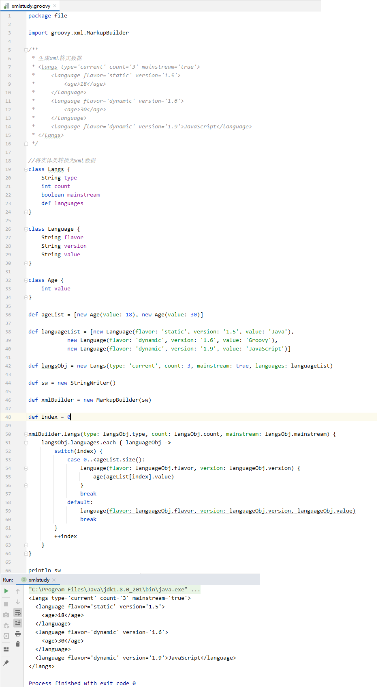
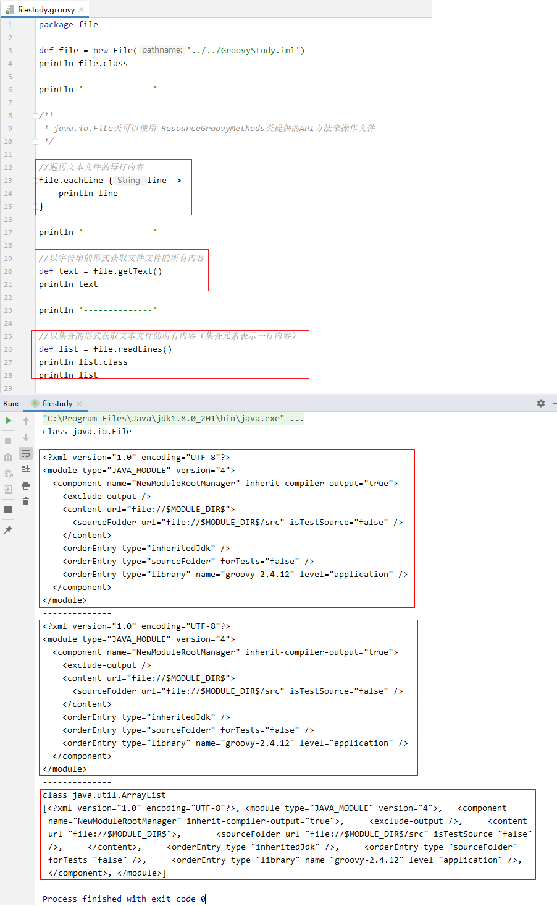
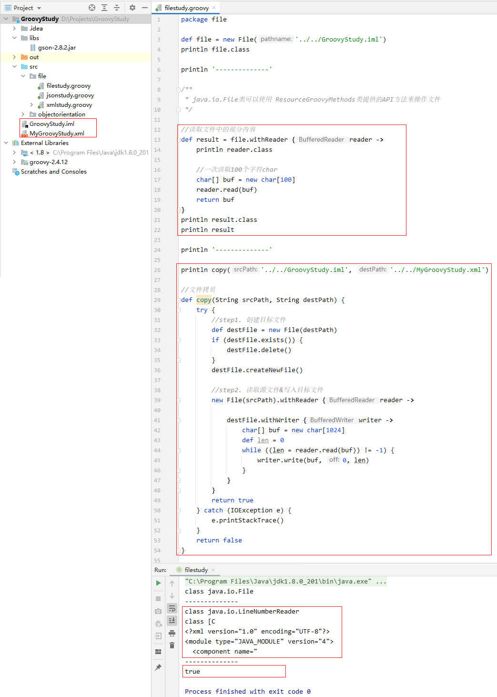
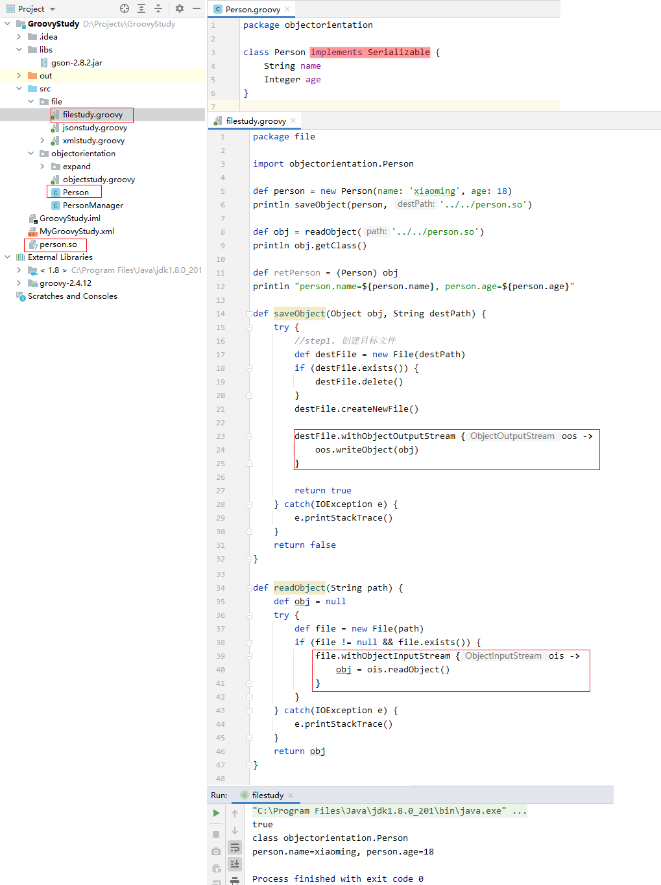

## 1. `json` 操作

### 1.1 实体类转换为 `json` 字符串：`JsonOutput.toJson(obj)`

```:no-line-numbers
通过调用
String jsonStr = JsonOutput.toJson(类对象); 
可以将实体类转为 json 字符串
```


### 1.2 `json` 字符串格式化：`JsonOutput.prettyPrint(json)`

```:no-line-numbers
通过调用 
String formatJsonStr = JsonOutput.prettyPrint(jsonStr);
可以将 json 字符串转为带 json 格式的 json 字符串
```

### 1.3 示例代码


### 1.4 `json` 字符串转为实体类

#### 1.4.1 通过 `JsonSlurper` 类提供的 `parseText`/`parse` 方法进行转换

使用 `JsonSlurper` 类提供的 `parseText` 和 `parse` 方法可以将 `json` 字符串，`json` 文件转换为实体类对象。

#### 1.4.2 `JsonSlurper` 的缺陷：无法将 `json` 字符串转换为自定义类对象

`JsonSlurper` 只能将 `json` 字符串转换为 `Map`，`List`，或基本数据类型的包装类。

无法使用 `JsonSlurper` 将 `json` 字符串直接转换为自定义类对象。

对于表示自定义类对象转换生成的 `json` 字符串，再通过 `JsonSlurper` 时，只能转换为 `Map` 对象。

#### 1.4.3 示例代码


#### 1.4.4 使用 `Gson` 进行转换

可以导入第三方 `jar` 包（如 `gson`），使用第三方开源库将 `json` 字符串转换为实体类对象。

#### 1.4.5 `Groovy` 工程中导入第三方 `jar` 包文件的步骤

**Step 1.** 在根目录下创建 `libs` 文件夹。

**Step 2.** 将 `jar` 文件添加到 `libs` 文件夹中。

**Step 3.** 右键 `libs` 文件夹下的 `jar` 文件，选择 "`Add as Library...`"。

## 2. `xml` 文件操作

### 2.1 解析 `xml` 格式数据：`XmlSlurper`

通过 `XmlSlurper` 类提供的 `parseText` 和 `parse` 方法，可以对 `xml` 格式的字符串和 `xml` 格式的文件进行解析。

`parseText` 和 `parse` 方法返回表示 `xml` 格式数据中根节点的类型为 `NodeChild` 的对象，`NodeChild` 中封装了 `Node` 类型的节点，实际上，`XmlSlurper` 把 `xml` 数据中的每个节点都解析为 `Node` 对象，并封装在 `NodeChild` 对象中。

`XmlSlurper` 中通过 `NodeChildren` 类型的迭代器来访问 `xml` 数据中的子节点。同级的同名节点使用一个与节点同名的 `NodeChildren` 迭代器来访问，通过 "`nodeChildren[index]`" 来访问指定索引处的子节点。特别地，当同级下的同名节点只有一个时，访问 `nodeChildren` 就相当于访问 `nodeChildren[0]`。

于是，从根节点开始，可以通过如下的方式访问到 `xml` 数据中任意位置的节点：

```:no-line-numbers
root.level_1_nodeChildren[index].level_2_nodeChildren[index]. ... .level_n_nodeChildren[index]
```

通过 `nodeChild.text()` 访问双标签节点包裹的内容。

通过 `nodeChild.@attrName` 访问节点的属性。

`NodeChild` 和 `NodeChildren` 都继承自 `GPathResult`。

#### 2.1.1 示例代码一



#### 2.1.2 示例代码二：深度遍历（`depthFirst()`）

案例：获取作者为李刚的所有书的书名。

有两种方式：

1. 从 `books` 节点开始，调用 `DefaultGroovyMethods` 提供 `each` 方法进行遍历。

    

2. 调用 `depthFirst` 方法，从根节点开始依次遍历所有节点（深度遍历）。

    > 调用 `gPathResult.depthFirst()` 时，还可以写成 `gPathResult.'**'`

    

#### 2.1.3 示例代码三：广度遍历（`children()`）

与深度遍历 `depthFirst()` 相对于的还有广度遍历 `children()`，即：

1. 深度遍历表示遍历各级的所有子节点；

2. 广度遍历表示只遍历下一级的各个子节点。

> 调用 `gPathResult.children()` 时，还可以写成 `gPathResult.'*'`



### 2.2 生成 `xml` 格式数据：`MarkerupBuilder`

使用 `MarkerupBuilder` 生成 `xml` 格式字符串的代码流程如下：

```groovy:no-line-numbers
def sw = new StringWriter() // StringWriter extends Writer
def xmlBuilder = new MarkupBuilder(sw) // 创建用于生成 xml 数据的构建器 MarkupBuilder

//使用 xmlBuilder.rootNodeName 定义名为 rootNodeName 的根节点 
xmlBuilder.rootNodeName(attrName1: 'attrValue1', attrName2: 'attrValue2', ...) { // 根节点下的 {} 中定义一级子节点

    leve_1_NodeName1(attrName1: 'attrValue1', attrName2: 'attrValue2', ...) { // 一级节点下的 {} 中定义二级子节点

        leve_2_NodeName1(attrName1: 'attrValue1', attrName2: 'attrValue2', ...) { // 二级节点下的 {} 中定义三级子节点
    
            /**
             * 以此类推，层层定义各级子节点
             */        
    
        }

        leve_2_NodeName2(attrName1: 'attrValue1', attrName2: 'attrValue2', ...) {...}

        // 对于只包含内容的双标签节点，'contentValue' 表示其所包含的内容
        leve_2_NodeName3(attrName1: 'attrValue1', attrName2: 'attrValue2', ..., 'contentValue')
        ...
    }

    leve_1_NodeName2(attrName1: 'attrValue1', attrName2: 'attrValue2', ...) {...}
    leve_1_NodeName3(attrName1: 'attrValue1', attrName2: 'attrValue2', ...) {...}
    ...
}

//xml 数据都写入到了 StringWriter 中
println sw
```

**示例代码：**



### 2.3 将实体类转换为 `xml` 数据

**示例代码：**



## 3. 普通文件操作

### 3.1 `Groovy` 操作普通文件的方式

所有在 `Java` 中对文件的处理类，在 `Groovy` 中都可以使用。

另外，`Groovy` 提供了 `ResourceGroovyMethods` 类，扩展了很多更加快捷和强大的方法。

### 3.2 通过 `ResourceGroovyMethods` 提供的 `API` 操作文件

`java.io.File` 对象可以通过调用 `ResourceGroovyMethods` 提供的相关 `API` 来操作文件。

#### 3.2.1 遍历文本文件的每行内容：`each(self, closure)`

```groovy:no-line-numbers
static <T> T eachLine(File self, Closure<T> closure) throws IOException
```

#### 3.2.2 以字符串的形式获取文本文件的所有内容：`getText(file)`

```groovy:no-line-numbers
static String getText(File file) throws IOException
```

#### 3.2.3 以集合的形式获取文本文件的所有内容：`readLines(file)`

```groovy:no-line-numbers
static List<String> readLines(File file) throws IOException
```

> 注意：集合中的一个元素表示一行内容。

#### 3.2.4 示例代码一



#### 3.2.5 读文件：`withReader(file, closure)`

```groovy:no-line-numbers
static <T> T withReader(File file, Closure<T> closure) throws IOException
```

#### 3.2.6 写文件：`withWriter(file, closure)`

```groovy:no-line-numbers
static <T> T withWriter(File file, Closure<T> closure)
```

#### 3.2.7 示例代码二




### 3.3 对象的持久化存储

**示例代码：**

