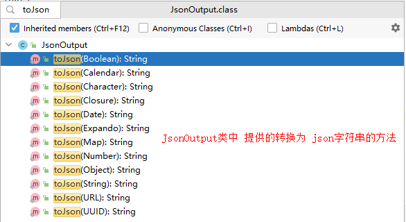
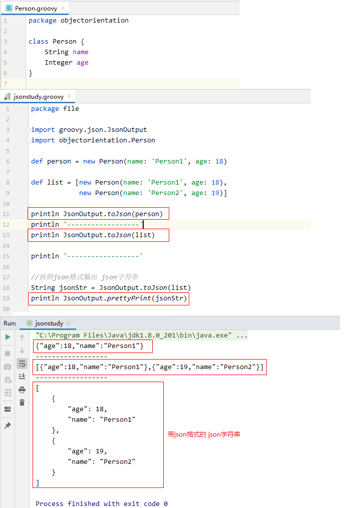
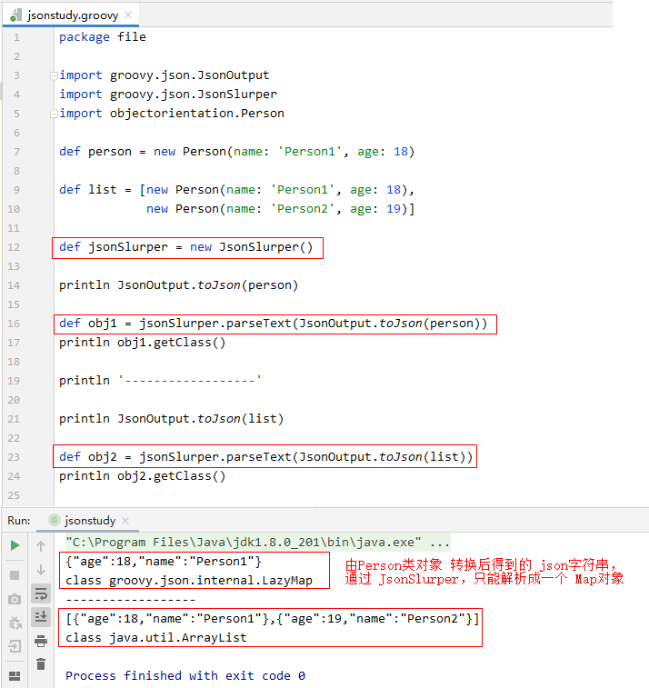

## 1. `json` 操作

### 1.1 实体类转换为 `json` 字符串：`JsonOutput.toJson(obj)`

```:no-line-numbers
通过调用
String jsonStr = JsonOutput.toJson(类对象); 
可以将实体类转为 json 字符串
```



### 1.2 `json` 字符串格式化：`JsonOutput.prettyPrint(json)`

```:no-line-numbers
通过调用 
String formatJsonStr = JsonOutput.prettyPrint(jsonStr);
可以将 json 字符串转为带 json 格式的 json 字符串
```

### 1.3 示例代码



### 1.4 `json` 字符串转为实体类

#### 1.4.1 通过 `JsonSlurper` 类提供的 `parseText`/`parse` 方法进行转换

使用 `JsonSlurper` 类提供的 `parseText` 和 `parse` 方法可以将 `json` 字符串，`json` 文件转换为实体类对象。

#### 1.4.2 `JsonSlurper` 的缺陷：无法将 `json` 字符串转换为自定义类对象

`JsonSlurper` 只能将 `json` 字符串转换为 `Map`，`List`，或基本数据类型的包装类。

无法使用 `JsonSlurper` 将 `json` 字符串直接转换为自定义类对象。

对于表示自定义类对象转换生成的 `json` 字符串，再通过 `JsonSlurper` 时，只能转换为 `Map` 对象。

#### 1.4.3 示例代码



#### 1.4.4 使用 `Gson` 进行转换

可以导入第三方 `jar` 包（如 `gson`），使用第三方开源库将 `json` 字符串转换为实体类对象。

#### 1.4.5 `Groovy` 工程中导入第三方 `jar` 包文件的步骤

**Step 1.** 在根目录下创建 `libs` 文件夹。

**Step 2.** 将 `jar` 文件添加到 `libs` 文件夹中。

**Step 3.** 右键 `libs` 文件夹下的 `jar` 文件，选择 "`Add as Library...`"。

## 2. `xml` 文件操作

### 2.1 解析 `xml` 格式数据：`XmlSlurper`

通过 `XmlSlurper` 类提供的 `parseText` 和 `parse` 方法，可以对 `xml` 格式的字符串和 `xml` 格式的文件进行解析。

`parseText` 和 `parse` 方法返回表示 `xml` 格式数据中根节点的类型为 `NodeChild` 的对象，`NodeChild` 中封装了 `Node` 类型的节点，实际上，`XmlSlurper` 把 `xml` 数据中的每个节点都解析为 `Node` 对象，并封装在 `NodeChild` 对象中。

`XmlSlurper` 中通过 `NodeChildren` 类型的迭代器来访问 `xml` 数据中的子节点。同级的同名节点使用一个与节点同名的 `NodeChildren` 迭代器来访问，通过 "`nodeChildren[index]`" 来访问指定索引处的子节点。特别地，当同级下的同名节点只有一个时，访问 `nodeChildren` 就相当于访问 `nodeChildren[0]`。

### 2.2 生成 `xml` 格式数据

### 2.3 将实体类转换为 `xml` 数据

## 3. 普通文件操作