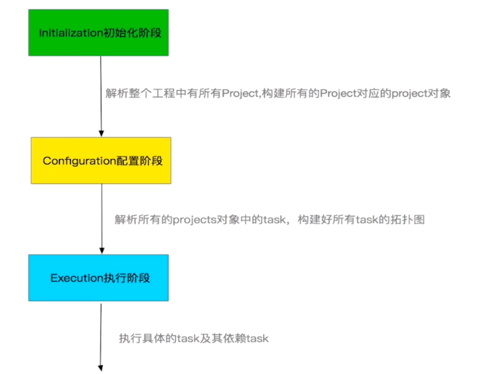
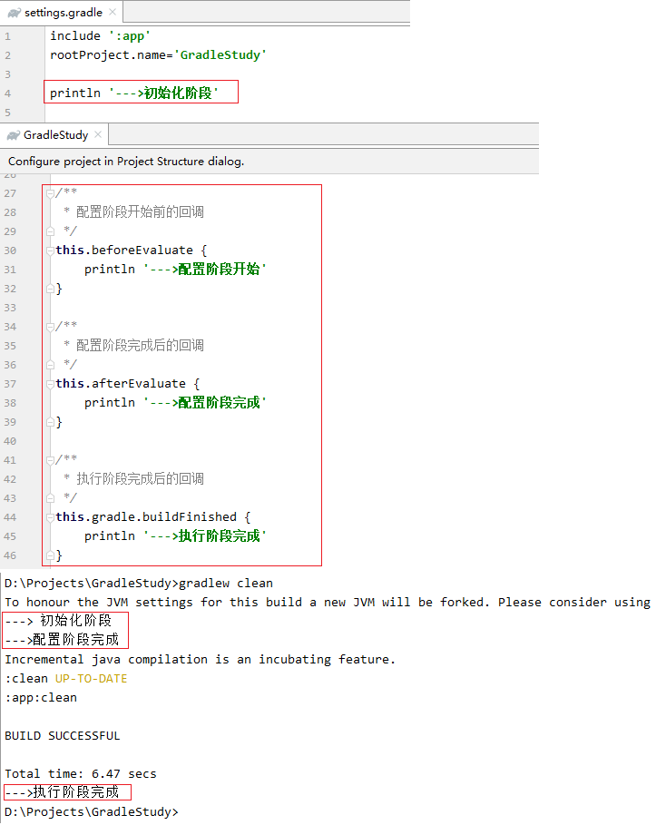

## 1. `Gradle` 概述

`Gradle` 有自己的编程语言和 `API`，所以 `Gradle` 不仅仅是一种像 `Maven`，`Ant` 那样的构建工具，更是一种编程框架。

`Gradle` 最大的特色就是通过编程去实现构建过程中的各种需求。

### 1.1 `Gradle` 的组成

`Gradle` 由以下几部分组成：

1. `Groovy` 核心语法

    > 就像 `Android` 使用 `Java` 作为编程语言一样，`Gradle` 使用 `Groovy` 作为编程语言。

2. `build script block`

    > 这部分是 `Gradle` 特有的，可以在不同的 `build script block` 中处理不同的事情。

3. `Gradle API`

### 1.2 `Gradle` 的优势

`Gradle` 的优势总结为如下 `4` 个方面：

1. 灵活性方面：

    ```:no-line-numbers
    使用 Maven 工具或 Ant 工具进行构建时，工具提供了哪些功能，我们就只能使用哪些功能，无法根据需求自主地进行功能扩展。
    也就是说 Maven 工具和Ant 工具的构建脚本是写死的，我们只能修改 xml 配置文件，不能修改构建脚本。
    但是使用 Gradle，可以根据实际需求对构建脚本进行修改，在功能扩展方面提供了强大的灵活性。
    ```

2. 粒度性方面：

    ```:no-line-numbers
    使用 Maven 工具或 Ant 工具对项目工程进行构建时，构建脚本和项目源码是相互独立的，且构建脚本是封装好了的，
    我们无法知道构建工具内部是如何对项目工程进行构建的。只知道输入什么，输出什么，中间过程是封闭的。
    但是使用 Gradle，不管是项目源码的编译，还是资源文件的编译，都是由一个个的 Task 任务完成的，并且 Task 的源码是开源的，
    我们可以通过修改 Task 的代码，自定义项目工程的构建过程。也就是说，Gradle 是以 Task 为单位进行构建的，并且 Task 是可修改的。
    ```

3. 扩展性方面：

    ```:no-line-numbers
    使用 Gradle 构建时，可以使用 Gradle 插件。
    Gradle 插件就相当于第三方依赖库。
    通过使用已有的 Gradle 插件，可以方便地扩展别人已经写好的功能。
    ```

4. 兼容性方面：

    ```:no-line-numbers
    对于 Maven 和 Ant 中的功能，Gradle 都做了兼容。
    也就是说，Maven 和 Ant 能做到的事情，Gradle 也能做到。
    ```

## 2. `Gradle` 的生命周期（`Gradle` 构建过程的执行流程）

`Gradle` 的生命周期就是指 `Gradle` 构建过程的执行流程。

### 2.1 执行 `Task` 任务时经历的三个阶段

通过 "`gradlew taskName`" 命令执行 `Task` 任务时，会经历三个阶段：初始化阶段、配置阶段、执行阶段。



#### 2.1.1 `Initialization` 初始化阶段

```:no-line-numbers
settings.gradle 文件在初始化阶段执行。
```

#### 2.1.2 `Configuration` 配置阶段

```:no-line-numbers
1. 解析 task；
2. 构建 task 的拓补图（即 task 依赖树）。
```

#### 2.1.3 `Execution` 执行阶段

```:no-line-numbers
执行时，先根据 Task 的依赖关系，执行被依赖 Task；
最后再执行 "gradlew taskName" 命令中的 taskName 指定的 Task。
```

### 2.2 `Gradle` 生命周期的监听回调

`Project` 类中提供了如下方法对 `Gradle` 的生命周期进行监听：

```:no-line-numbers
1. void beforeEvaluate(Closure closure); // 配置阶段开始前的回调
2. void afterEvaluate(Closure closure); // 配置阶段完成后的回调
```

`Gradle` 类中提供了如下方法对 `Gradle` 的生命周期进行监听：

```:no-line-numbers
1. void buildFinished(Closure closure); // 执行阶段完成后的回调
2. void beforeProject(Closure closure);
3. void afterProject(Closure closure);
4. void addBuildListener(BuildListener buildListener);
5. void addListener(Object listener);
6. ProjectEvaluationListener addProjectEvaluationListener(ProjectEvaluationListener listener);
```

#### 2.2.1 示例代码：`gradlew clean` 清理任务的执行过程



### 2.3 执行 "`gradlew tasks`" 查看 `Project` 中的所有 `Task`