## 1. `Project` 概述

### 1.1 每个 `Module` 都是一个 `Project`（子 `Project`）

一个通过 `Gradle` 构建的 `Android` 项目中，除了项目本身是一个 `Project`（根 `Project`）外，

项目中的每个 `Module` 也是一个 `Project`（子 `Project`）。

### 1.2 遍历 `Android` 项目中的所有 `Project`：`gradlew projects`

执行命令 "`gradlew projects`"（其中 `projects` 是一个 `Task` 的名称）可以遍历出 `Android` 项目中的所有 `Project`。

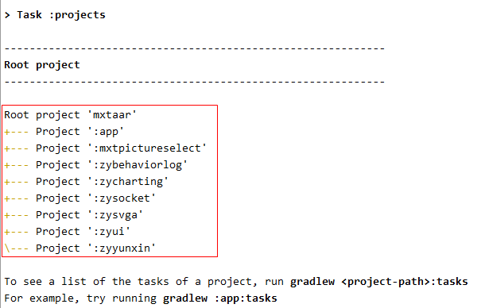

### 1.3 一个 `build.gradle` 文件表示一个 `Project`

每个 `Project` 中都包含有一个 `build.gradle` 文件。

如果删除了 `Project` 文件夹下的 `build.gradle` 文件，那么这个 `Project` 文件夹就是一个普通的文件夹，不会被识别为 `Project`。

也就是说，一个 `build.gradle` 文件表示一个 `Project`。

### 1.4 根 `Project` 的作用：管理子 `Project`

根 `Project` 的作用主要是用来管理子 `Project`。

### 1.5 子 `Project` 的作用：生成构建产物

子 `Project` 的作用就是用来生成构建产物的，如：

1. `app` 模块作为子 `Project` 生成 `apk` 文件；

2. 其他模块作为子 `Project` 生成 `aar` 库文件。

## 2. `Project` 的 `API` 组成

`Project` 的 `API` 可以分为六大部分。

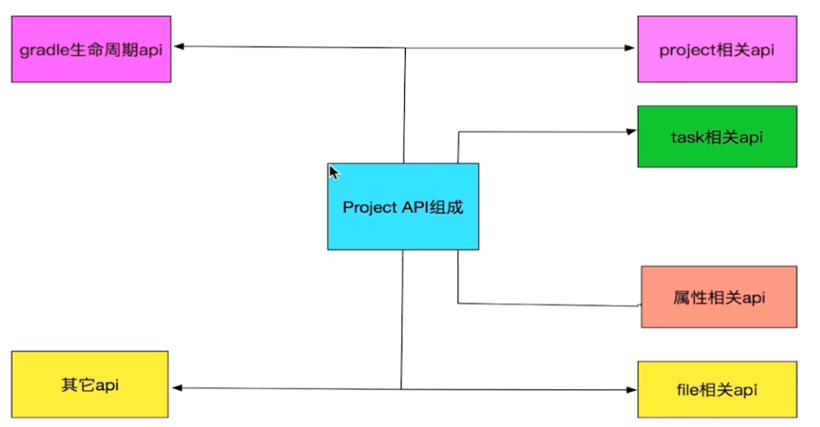

### 2.1 `Gradle` 生命周期 `API`

参考：[Gradle 生命周期的监听回调](/zkq/gradle/_04_lifecycle.html#_2-2-gradle-生命周期的监听回调)

### 2.2 `Project` 相关的 `API`

提供了操作父 `Project`，管理子 `Project` 的功能。

#### 2.2.1 `build.gradle` 文件中编写的代码相当于 `Project` 类中的代码

在学习 `Groovy` 时，我们在 `Groovy` 脚本文件中编写的代码经过编译后会生成字节码文件。

字节码文件中 `Groovy` 脚本文件名做为一个类，继承自 `Script`。也就是说，在 `Groovy` 脚本文件中的代码其实就是在 `Script` 类中编写代码，可以访问到 `Script` 类的 `API`（如 `println` 方法就是 `Script` 类提供的）。

类似的，在 `Gradle` 中，`build.gradle` 文件也会经过编译生成字节码文件，`build.gradle` 文件中的代码其实就是在 `Project` 类中编写的代码。

也就是说，**在 `build.gradle` 文件中可以访问到 `Project` 类的 `API`**。

#### 2.2.2 `build.gradle `文件中编写的代码都是在配置阶段执行

所有在 `build.gradle` 文件中编写的代码，都是在配置阶段执行的。

> 如何使代码在执行阶段执行，在讲解 `Task` 时进行讲解。

#### 2.2.3 `Project` 类提供的 `API`

##### 2.2.3.1 获取所有 `Project`：`getAllprojects()`

```groovy:no-line-numbers
Set<Project> getAllprojects()
```

```:no-line-numbers
遍历项目中的所有 Project（包括根 Project 和各个子 Project）
```

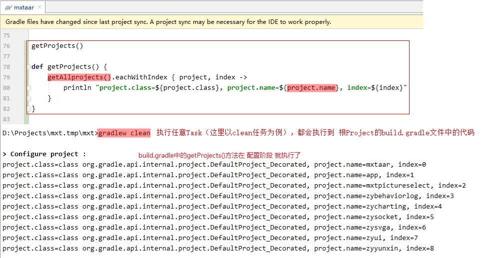

##### 2.2.3.2 获取所有子 `Project`：`getSubprojects()`

```groovy:no-line-numbers
Set<Project> getSubprojects()
```

```:no-line-numbers
遍历调用该方法的 build.gradle 所对应的 Project 下的所有子 Project
```

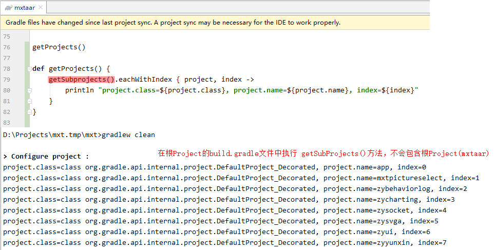

##### 2.2.3.3 获取父 `Project`：`getParent()`

```groovy:no-line-numbers
Project getParent()
```

```:no-line-numbers
返回调用该方法的 build.gradle 所对应的 Project 的父 Project。
如果 build.gradle 所对应的 Project 是根 Project，那么该方法返回 null。
```

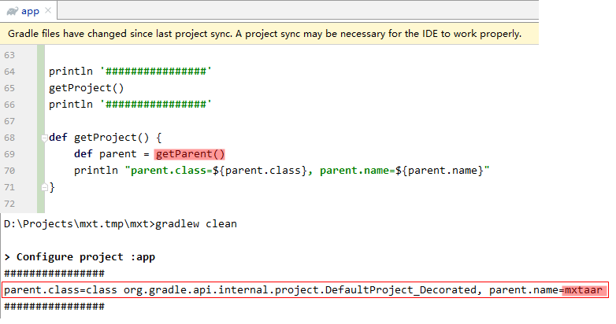

##### 2.2.3.4 获取根 `Project`：`getRootProject()`

```groovy:no-line-numbers
Project getRootProject()
```

```:no-line-numbers
返回项目的根 Project，不管在哪个 build.gradle 中调用，都不会返回 null。
```

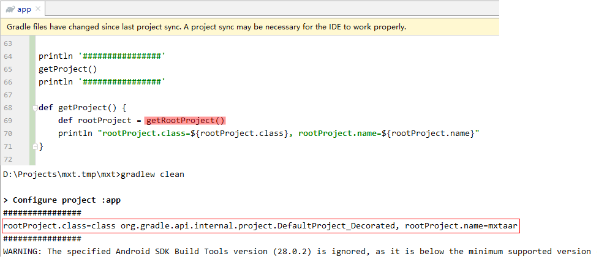

##### 2.2.3.5 获取指定 `Project` 并对其进行配置：`project(path, closure)`

```groovy:no-line-numbers
Project project(String path, Closure configureClosure)
```

```:no-line-numbers
1. 参数 path 用来指定一个 Project，当 path 为相对路径时，表示调用该方法的 build.gradle 所对应的 Project 目录下的相对路径。即：
    如果在根 Project 的 build.gradle 中调用 project('app') {...}
    那么 'app' 表示 "./app/"，而 "./app/" 文件夹表示子 Project(app)。

2. 参数闭包 configureClosure 作用是用来对参数 path 指定的 Project 进行配置，需注意：
    1. 闭包的参数传入 path 指定的 Project 对象；
    2. 闭包的 delegate 属性指定的委托对象 也就是 path 指定的 Project 对象；
    3. 因为该闭包的委托策略 resolveStrategy=2，即 OWNER_ONLY，
       而闭包的 owner 属性指定的 Project 也就是 path 指定的 Project（但不是同一个对象）
       所以，在闭包中访问的属性和方法，就是在访问 path指定的Project 的属性和方法

3. 返回参数 path 指定的 Project。

4. 使用该 project(path.closure) 方法，可以在根 Project 的 build.gradle 中，实现对子 Project 的配置。
    但通常，我们不会以这种方式去处理对子 Project 的所有配置，还是应该以在子 Project 的 build.gradle 中配置为主。

5. Project project(String path) throws UnknownProjectException; // 该重载方法仅用于返回参数 path 指定的 Project
```

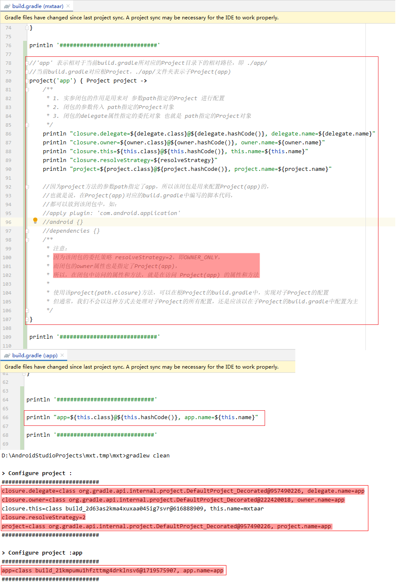

##### 2.2.3.6 遍历所有 `Project` 并进行配置：`allprojects(closure)`

```groovy:no-line-numbers
void allprojects(Closure configureClosure)
```

```:no-line-numbers
1. 作用：遍历当前 build.gradle 对应的 Project 下的所有子 Project（包含当前 build.gradle 对应的 Project）。

2. 参数闭包 configureClosure 接收一个 Project 类型的参数，表示当前遍历到的 Project。

3. project(path, closure) 方法是对参数 path 指定的 Project 进行配置处理
    allprojects(closure) 方法是对当前 Project 和当前 Project 下的所有子 Project 进行配置处理。

4. 因为在 allprojects 方法内部每次遍历调用该实参闭包时，闭包的委托策略都是 resolveStrategy=2，即 Closure.OWNER_ONLY，
    而每次遍历调用该实参闭包时，闭包的 owner 属性指定为当前遍历到的 Project，
    所以每次遍历调用该实参闭包时，在闭包中访问的属性和方法就是在访问当前遍历到的 Project 中的属性和方法。
```

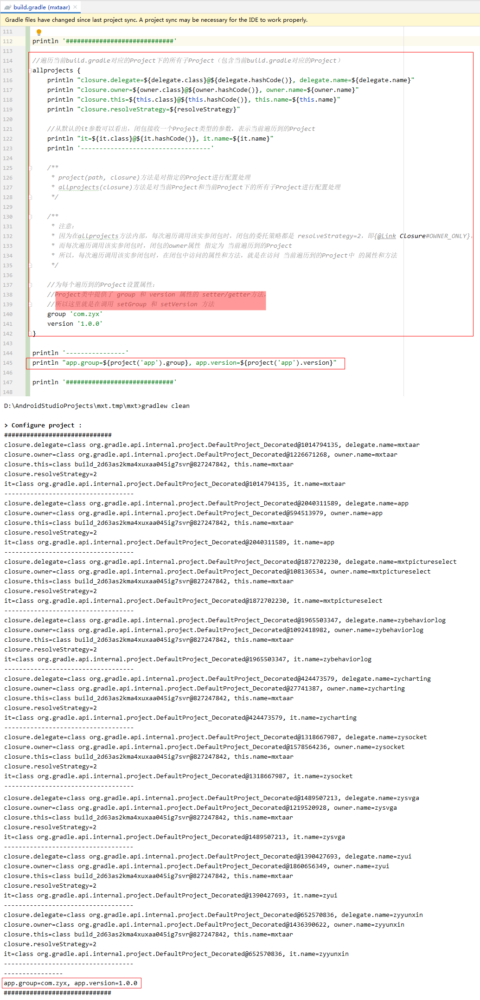

##### 2.2.3.7 遍历所有子 `Project` 并进行配置：`subprojects(closure)`

```groovy:no-line-numbers
void subprojects(Closure configureClosure)
```

```:no-line-numbers
subprojects(closure) 和 allprojects(closure) 的唯一区别在于：
1. allprojects 会遍历到当前 build.gradle 对应的 Project；
2. subprojects 不会遍历到当前 build.gradle 对应的 Project。
```

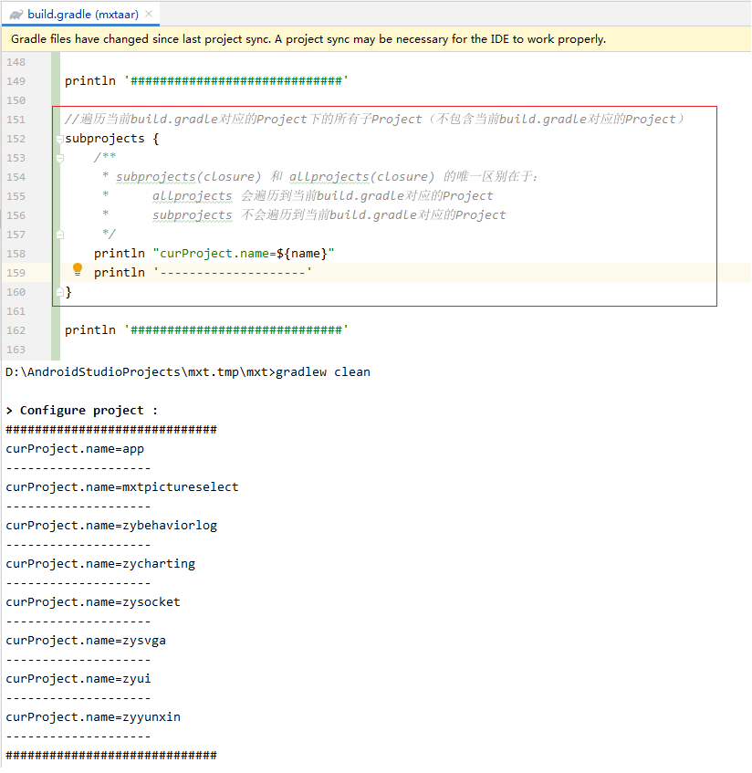

### 2.3 `Task` 相关的 `API`

提供了新增 `Task`，使用 `Project` 中已有 `Task` 的功能。

### 2.4 属性相关的 `API`

除了操作 `Gradle` 本身提供的属性外，还可以为 `Project` 添加新的属性。

#### 2.4.1 `Project` 类默认提供的属性

##### 2.4.1.1 `DEFAULT_BUILD_FILE`

```groovy:no-line-numbers
String DEFAULT_BUILD_FILE = "build.gradle"
```

```:no-line-numbers
该属性指定了 Project 的构建脚本文件名默认为 build.gradle
```

##### 2.4.1.2 `PATH_SEPARATOR`

```groovy:no-line-numbers
String PATH_SEPARATOR = ":"
```

```:no-line-numbers
该属性指定了 Project 路径名和 Task 路径名的层级分隔符为冒号 ":"
相当于普通文件系统中的路径分隔符 "/"
```

##### 2.4.1.3 `DEFAULT_BUILD_DIR_NAME`

```groovy:no-line-numbers
String DEFAULT_BUILD_DIR_NAME = "build"
```

```:no-line-numbers
该属性指定了对 Project 进行构建后输出目录为 build 目录。
即：对根 Project 和各个子 Project 进行构建后，都会在每个 Project 文件夹下生成一个 build 目录。
```

##### 2.4.1.4 `GRADLE_PROPERTIES`

```groovy:no-line-numbers
String GRADLE_PROPERTIES = "gradle.properties"
```

```:no-line-numbers
该属性指定了用于对 Gradle 的属性进行配置的默认文件为 gradle.properties
```

#### 2.4.2 分析 `ext` 扩展属性的内部实现

`build.gradle` 文件对应的 `Project` 对象的类是 `DefaultProject` 子类：

```:no-line-numbers
1. 是通过 org.gradle.testfixtures.internal.ProjectBuilderImpl 类提供的 createProject 和 createChildProject 方法动态创建出来的；
2. 是 org.gradle.api.internal.project.DefaultProject 的子类。

参考：
1. org.gradle.testfixtures.internal.ProjectBuilderImpl
2. org.gradle.api.internal.AsmBackedClassGenerator
   动态创建的 DefaultProject 子类就是在 AsmBackedClassGenerator 的静态内部类 ClassBuilderImpl 中完成的。
```

动态创建 `DefaultProject` 子类时会动态定义 `invokeMethod` 方法：

```:no-line-numbers
1. invokeMethod 方法内部则是调用了 DefaultProject 的 getAsDynamicObject().invokeMethod 方法，即:

    public Object invokeMethod(String name, Object params) { 
        return getAsDynamicObject().invokeMethod(name, (Object[])params); 
    }

    参考：org.gradle.api.internal.AsmBackedClassGenerator.ClassBuilderImpl#addDynamicMethods

2. getAsDynamicObject() 方法返回的是一个 org.gradle.api.internal.ExtensibleDynamicObject 类对象

    ExtensibleDynamicObject 的继承结构图如下：
        DynamicObject
        --AbstractDynamicObject
        ----CompositeDynamicObject
        ------MixInClosurePropertiesAsMethodsDynamicObject
        --------ExtensibleDynamicObject    
```

也就是说，调用 `Project` 类的 `invokeMethod` 方法，其实就是在调用 `ExtensibleDynamicObject` 类的 `invokeMethod` 方法：

```:no-line-numbers
ExtensibleDynamicObject 类提供的 invokeMethod 方法在父类 AbstractDynamicObject 中定义：

    @Override
    public Object invokeMethod(String name, Object... arguments) throws groovy.lang.MissingMethodException {
        DynamicInvokeResult result = tryInvokeMethod(name, arguments);
        if (result.isFound()) {
            return result.getValue();
        }
        throw methodMissingException(name, arguments);
    }
```

也就是说，调用 `ExtensibleDynamicObject` 类的 `invokeMethod` 方法，其实就是在调用 `tryInvokeMethod` 方法，其中：

```:no-line-numbers
1. tryInvokeMethod 方法在 CompositeDynamicObject 和 MixInClosurePropertiesAsMethodsDynamicObject 中都进行了重写；
2. 在 CompositeDynamicObject 类重写的 tryInvokeMethod 方法中，会遍历 DynamicObject[] 数组，
   并调用每个 DynamicObject 类的 tryInvokeMethod 方法：

    @Override
    public DynamicInvokeResult tryInvokeMethod(String name, Object... arguments) {
        for (DynamicObject object : objects) {
            DynamicInvokeResult result = object.tryInvokeMethod(name, arguments);
            if (result.isFound()) {
                return result;
            }
        }
        return DynamicInvokeResult.notFound();
    }
```

也就是说，调用 `ExtensibleDynamicObject` 的 `tryInvokeMethod` 方法，其实就是在调用 `DynamicObject` 的 `tryInvokeMethod` 方法。

```:no-line-numbers
其中，DynamicObject[] 数组 objects 会在 ExtensibleDynamicObject 类的构造方法中通过调用 updateDelegates() 方法进行设置。

在 ExtensibleDynamicObject.updateDelegates() 方法中，
会把 convention.getExtensionsAsDynamicObject() 返回的 DynamicObject 子类对象放到 objects 中。

在 ExtensibleDynamicObject 的构造方法中，成员属性 convention = new DefaultConvention(instantiator)，
也就是说，convention.getExtensionsAsDynamicObject() 返回的 DynamicObject 对象要在 DefaultConvention 类中找。

在 DefaultConvention 类中，有如下代码：

    public class DefaultConvention implements Convention, ExtensionContainerInternal {
        ...
        DefaultConvention.ExtensionsDynamicObject extensionsDynamicObject = new ExtensionsDynamicObject();
        ...
        @Override
        public DynamicObject getExtensionsAsDynamicObject() {
           return extensionsDynamicObject;
        }
        ...
        private class ExtensionsDynamicObject extends AbstractDynamicObject {
            ...
            @Override
            public DynamicInvokeResult tryInvokeMethod(String name, Object... args) {
                if (isConfigureExtensionMethod(name, args)) {
                    return DynamicInvokeResult.found(configureExtension(name, args));
                }
                ...
            }
        }
    } 

也就是说：
1. DefaultConvention.getExtensionsAsDynamicObject() 返回
   DynamicObject 的子类 DefaultConvention.ExtensionsDynamicObject 创建的对象；
2. DefaultConvention.ExtensionsDynamicObject 中重写了 tryInvokeMethod 方法。
```

也就是说，调用 `DynamicObject` 的 `tryInvokeMethod` 方法，其实就是在调用 `DefaultConvention.ExtensionsDynamicObject` 的 `tryInvokeMethod` 方法。

```:no-line-numbers
在 DefaultConvention.ExtensionsDynamicObject.tryInvokeMethod 方法中，isConfigureExtensionMethod(name, args) 用于判断：
1. 名为 name 的方法的参数列表 args 是否只有一个 Closure 类型的闭包参数；
2. 名为 name 的方法是否已经注册到 DefaultConvention 的成员属性 extensionsStorage 中。

在 DefaultConvention 中有如下代码：

    public class DefaultConvention implements Convention, ExtensionContainerInternal {
        ...
        TypeOf<ExtraPropertiesExtension> EXTRA_PROPERTIES_EXTENSION_TYPE = typeOf(ExtraPropertiesExtension.class);
        ExtensionsStorage extensionsStorage = new ExtensionsStorage();
        ExtraPropertiesExtension extraProperties = new DefaultExtraPropertiesExtension();

        public DefaultConvention(Instantiator instantiator) {
            this.instantiator = instantiator;
            //其中，ExtraPropertiesExtension.EXTENSION_NAME = "ext"
            //即：add(EXTRA_PROPERTIES_EXTENSION_TYPE, "ext", extraProperties)
            add(EXTRA_PROPERTIES_EXTENSION_TYPE, ExtraPropertiesExtension.EXTENSION_NAME, extraProperties);
        }

        @Override
        public <T> void add(TypeOf<T> publicType, String name, T extension) {
            extensionsStorage.add(publicType, name, extension);
        }
    }

也就是说，在 DefaultConvention 的构造方法中，就已经把方法 "ext" 注册到 DefaultConvention 的成员属性 extensionsStorage 中了。

注意：
在注册时，为方法 "ext" 绑定了一个 DefaultExtraPropertiesExtension 对象 extraProperties，
这个 extraProperties 对象，就是调用 ext(closure) 方法时，传给闭包 closure 的唯一参数。
```

在 `DefaultConvention.ExtensionsDynamicObject.tryInvokeMethod` 方法中调用的 `configureExtension(name, args)` 方法在 `DefaultConvention` 中的定义如下：

```groovy:no-line-numbers
private Object configureExtension(String name, Object[] args) {
    Closure closure = (Closure) args[0];
    Action<Object> action = ConfigureUtil.configureUsing(closure);
    return extensionsStorage.configureExtension(name, action);
}
```

```:no-line-numbers
其中：
1. ConfigureUtil.configureUsing 方法的作用就是将闭包 closure 封装在 Action 中；
2. ExtensionsStorage.configureExtension(name, action) 方法的作用就是：
    1. 执行 action.execute 方法（最终会调用闭包 closure）；
    2. 将注册方法 "ext" 时绑定的 extraProperties 对象作为 ext(closure) 方法中闭包 closure 的唯一参数；
    3. 创建 ConfigureDelegate 类型的委托对象作为闭包的 owner，并设置闭包的委托策略为 Closure.OWNER_ONLY。

注意：
ConfigureDelegate 委托对象其实也是一个代理，其内部封装了 _owner 和 _delegate 两个属性，
对于在 build.gradle 中调用的 ext(closure) 方法：
1. _owner = DynamicObjectUtil.asDynamicObject(closure.getOwner());
   因为 ext(closure) 在 build.gradle 中调用，所以 closure.getOwner() 返回 Project 对象，
   又因为 DefaultProject 实现了 DynamicObjectAware 接口，
   所以 DynamicObjectUtil.asDynamicObject(closure.getOwner()) 返回的是 DefaultProject.getAsDynamicObject()，
   也就是说，_owner 就是依赖了 DefaultConvention的ExtensibleDynamicObject 对象；

2. _delegate = DynamicObjectUtil.asDynamicObject(extraProperties);
   查看源码可知，_delegate 是一个封装了 extraProperties 的 BeanDynamicObject 对象。

ConfigureDelegate 内部的委托流程就是：
先使用 _delegate 处理闭包 closure 中的属性和方法，_delegate 处理不了的，再使用 _owner 处理。

也就是说，ext(closure) 方法调用时，闭包 closure 中可以直接访问 BeanDynamicObject 和 ExtensibleDynamicObject 中的属性和方法。
```

**综上得出如下结论：**

```:no-line-numbers
在 build.gradle 中编写 ext{...} ，就是调用动态生成的 Project 子类中的 invokeMethod 方法来执行未定义的 ext(closure) 方法，其中：
1. 闭包 closure 接收 DefaultExtraPropertiesExtension 类型的对象作为唯一参数；
2. 闭包 closure 中可以直接访问 BeanDynamicObject 和 ExtensibleDynamicObject 中的属性和方法。
```

**注意：**

```:no-line-numbers
1. 注册到 DefaultConvention.extensionsStorage 中的标识符 "ext" 即是一个方法，也是一个属性：
    1. 当在 build.gradle 中编写 ext{...} 时，最终调用到 DefaultConvention.ExtensionsDynamicObject.tryInvokeMethod 方法，
       此时 ext 是一个方法，闭包作为方法参数。
    2. 当在 build.gradle 中编写 this.ext.extAttrName 时，最终调用到 DefaultConvention.ExtensionsDynamicObject.tryGetProperty，
       此时 ext 是一个属性，指定注册 "ext" 时绑定的 extraProperties 对象。

    也就是说，在 ext{...} 中扩展的属性，可以在 ext{...} 之外通过 this.ext 访问到。
    当然，为 Project 扩展的属性也可以在 build.gradle 中直接访问到。

2. 另外还需要注意，通过 ext{...} 为 Project 扩展的属性是可以被子 Project 继承的。
```

#### 2.4.3 为 `Project` 扩展新的属性

在 `build.gradle` 中可以调用 `ext(closure)` 方法为 `Project` 扩展属性。语法如下：

```groovy:no-line-numbers
ext {
    extAttrName1 = extAttrValue1
    extAttrName2 = extAttrValue2
    ...
    extAttrName3 = extAttrValue3
}
```

在当前 `Project` 中可以通过如下方式访问到扩展属性：

```groovy:no-line-numbers
// 方式 1
this.ext.extAttrName

// 方式 2
this.extAttrName
```

在子 `Project` 中可以通过如下方式访问到父 `Project` 的扩展属性：

```groovy:no-line-numbers
this.extAttrName // this 表示子 Project
```

**注意：**

```:no-line-numbers
1. 根 Project 中扩展的属性会被子 Project 继承，是作为子 Project 的属性，但不会作为子 Project 的扩展属性；

2. 为了避免当 Project 中存在于扩展属性同名的属性时所产生的冲突，建议使用扩展属性时按照定义时的 "路径" 来访问，
   如，在根 Project 中定义的扩展属性，在子 Project 中建议这样访问：rootProject.ext.extAttrName

3. 因为 Project 类提供了 getRootProject, 即提供了 rootProject 的 getter 方法，
   所以执行 this.rootProject 就相当于调用 this.getRootProject() 方法。
```

**示例代码：**

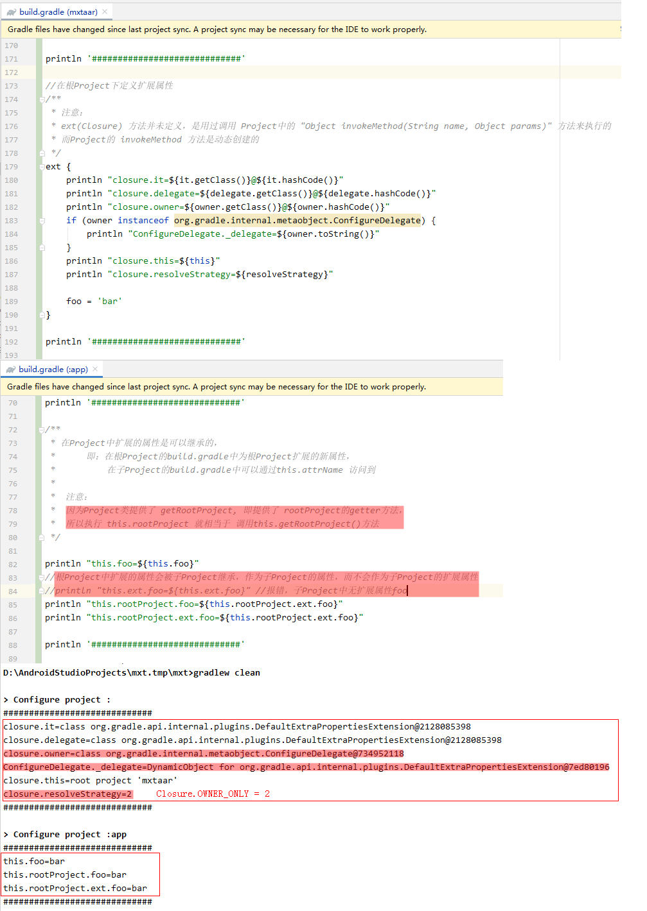

#### 2.4.4 扩展属性的实际案例：引入外部文件 ext.gradle 中的扩展属性

**案例步骤：**

```:no-line-numbers
step1. 在单独的外部文件 ext.gradle 中定义扩展属性；

step2. 在根 Project 的 build.gradle 中，通过 Project.apply(Map<String, ?> options) 方法导入外部文件 ext.gradle；

    注意：
    "from" 类型的导入方式，相当于 C/C++ 中的 #include，
    也就是说，导入 ext.gradle 后，其中的 ext{...} 就相当于在根 Project 的 build.gradle 中定义了。

step3. 在子 Project 中，为了避免同名冲突，建议通过 rootProject.ext.extAttrName 的方式来访问根 Project 中定义的扩展属性。
```

**示例代码：**

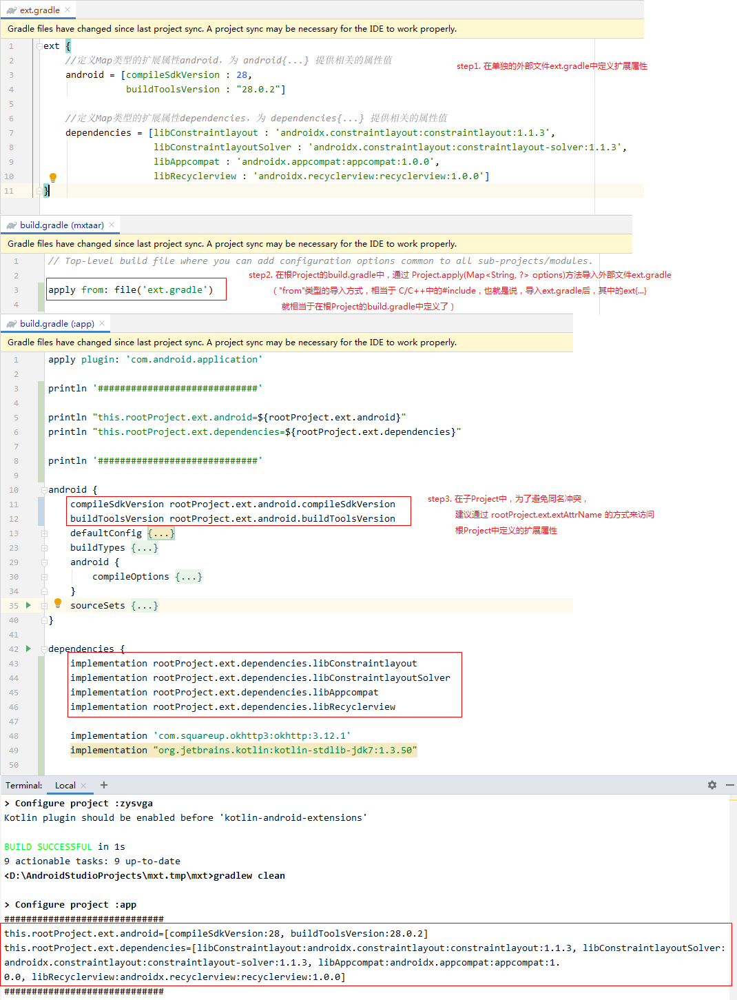

#### 2.4.5 在 `gradle.properties` 文件中定义扩展属性

在根 `Project` 下的 `gradle.properties` 文件只能定义简单的键值对属性。

并且在 `gradle.properties` 中定义的属性名建议不要跟 `build.gradle` 中的属性名同名，否则可能报错。

在 `gradle.properties` 中定义的键值对扩展属性，使用时属性值默认都是 `String` 类型，需要调用 `toXXX()` 转换一下。

**示例代码：**

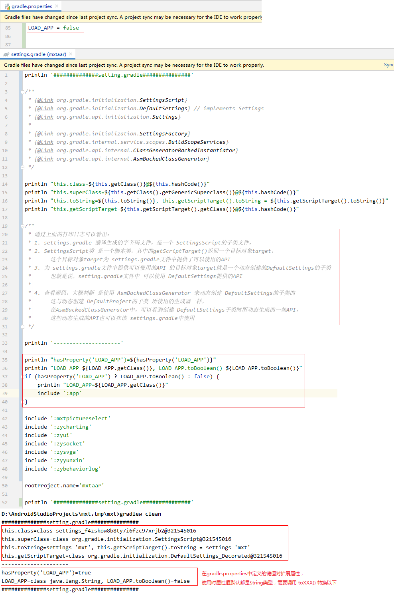

#### 2.4.6 分析 `setting.gradle` 文件的内部实现

如上代码所示：

```:no-line-numbers
1. settings.gradle 编译生成的字节码文件，是一个 SettingsScript 的子类文件；

2. SettingsScript 类是一个脚本类，其中的 getScriptTarget() 返回一个目标对象 target，
   这个目标对象 target 为 settings.gradle 文件中提供了可以使用的 API；

3. 为 settings.gradle 文件中提供可以使用的 API 的目标对象 target 就是一个动态创建的 DefaultSettings 的子类。
   也就是说，setting.gradle 文件中可以使用 DefaultSettings 提供的API；

4. 查看源码，大概判断是使用 AsmBackedClassGenerator 来动态创建 DefaultSettings 的子类的。
   这与动态创建 DefaultProject 的子类所使用的生成器一样。在 AsmBackedClassGenerator 中，
   可以看到创建 DefaultSettings 子类时所动态生成的一些 API，这些动态生成的 API 也可以在该 settings.gradle 中使用。

参考：
org.gradle.initialization.SettingsScript
org.gradle.initialization.DefaultSettings // implements Settings
org.gradle.api.initialization.Settings
org.gradle.initialization.SettingsFactory
org.gradle.internal.service.scopes.BuildScopeServices
org.gradle.api.internal.ClassGeneratorBackedInstantiator
org.gradle.api.internal.AsmBackedClassGenerator
```

### 2.5 文件（`file`）相关的 `API`

主要是用来处理 `Project` 下的一些文件。

#### 2.5.1 `Project` 类提供的获取路径相关的 `API`

##### 2.5.1.1 获取表示根 `Project` 文件夹：`getRootDir()`

```groovy:no-line-numbers
File getRootDir()
```

```:no-line-numbers
返回表示根 Project 文件夹的 File 对象。
```

##### 2.5.1.2 获取表示当前 `Project` 的 `build` 文件夹：`getBuildDir()`

```groovy:no-line-numbers
File getBuildDir()
```

```:no-line-numbers
返回表示当前 build.gradle 所对应的 Project 的 build 文件夹的 File 对象。
```

##### 2.5.1.3 获取表示当前 `Project` 的文件夹：`getProjectDir()`

```groovy:no-line-numbers
File getProjectDir()
```

```:no-line-numbers
返回表示当前 build.gradle 所对应的 Project 文件夹的 File 对象。
```

##### 2.5.1.3 示例代码

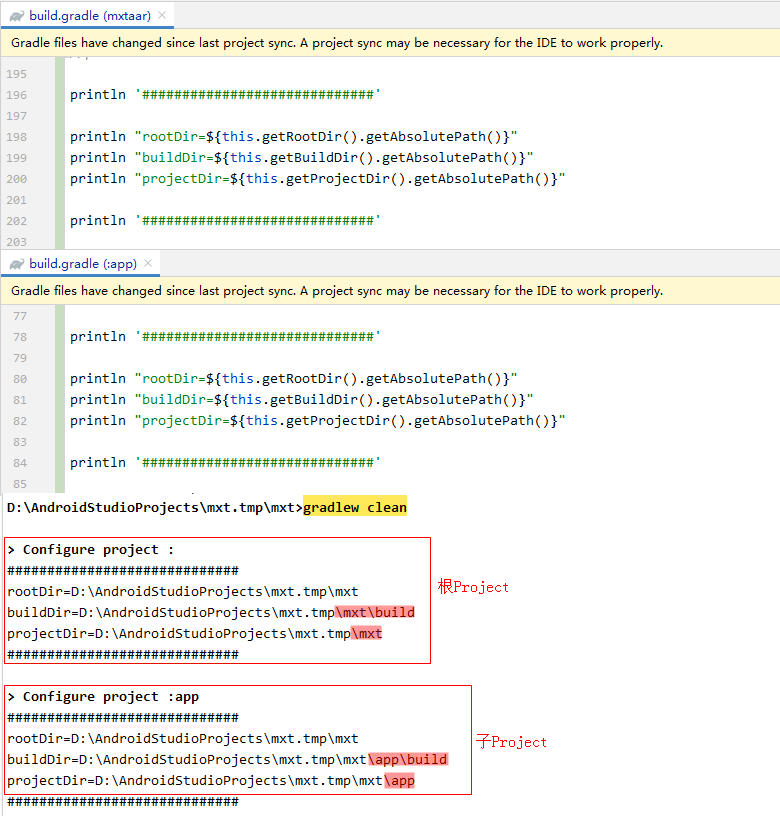

#### 2.5.2 `Project` 类提供的文件操作相关的 `API`

##### 2.5.2.1 获取相对于当前 `Project` 的某个 `path` 路径：`file(path)`

```groovy:no-line-numbers
File file(Object path)
```

```:no-line-numbers
返回相对于当前 Project 的 path 路径所表示的 File 对象。
```

##### 2.5.2.2 获取相对于当前 `Project` 的某些 `path` 路径：`files(paths)`

```groovy:no-line-numbers
ConfigurableFileCollection files(Object... paths)
```

```:no-line-numbers
1. 返回 paths 数组指定的多个 File 对象的集合；
2. ConfigurableFileCollection 继承自 FileCollection；
3. 可以通过 FileCollection.getFiles() 可以返回 File 对象构成的 Set 集合。
```

##### 2.5.2.3 示例代码

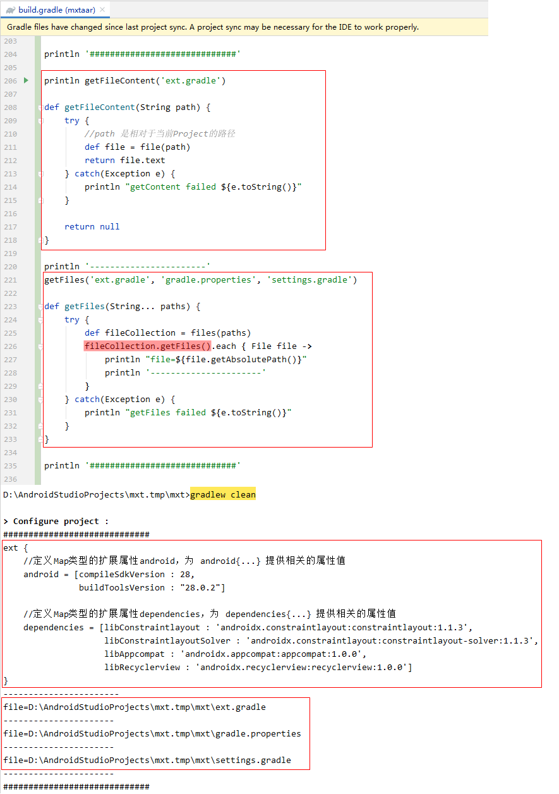

##### 2.5.2.4 文件拷贝：`copy(closure)`

```groovy:no-line-numbers
WorkResult copy(Closure closure)
```

```:no-line-numbers
作用：
1. 在实参闭包 closure 中，通过调用 CopySpec 提供的 API 完成文件的拷贝操作。

注意：
1. 调用 copy(closure) 方法时，实参闭包传入的参数是 CopySpec 的子类对象
2. 实参闭包的委托策略机制是 OWNER_ONLY
3. 实参闭包的 owner 是 ConfigureDelegate 类对象
4. ConfigureDelegate 中的 _delegate 是封装了 CopySpec 的 BeanDynamicObject 对象。
    由此可知，实参闭包中可以访问到 CopySpec 提供的 API
5. 在 copy 方法的实参闭包中，可以调用 CopySpec 提供的如下API进行文件拷贝：
    1. CopySpec from(Object... sourcePaths); 
        指定拷贝的源文件。
        参数可以是源文件的路径字符串，也可以是源文件的 File 对象，
        源文件以路径字符串表示时，可以是绝对路径，也可以是相对于当前 Project 的路径。
    2. CopySpec into(Object destPath); 
        指定拷贝输出的目标文件夹。
        参数可以是目标文件的路径字符串，也可以是目标文件夹的 File 对象，
        目标文件以路径字符串表示时，可以是绝对路径，也可以是相对于当前 Project 的路径。
    3. CopySpec exclude(Closure excludeSpec); 
        排除不想拷贝的文件。
    4. CopySpec rename(Closure closure); 
        对拷贝后的文件进行重命名。
        闭包传入拷贝的文件名，闭包的返回值就是重命名的文件名。
6. 在调用方法时，如果只有一个参数，那么可以省略括号 "()"
```

##### 2.5.2.5 示例代码

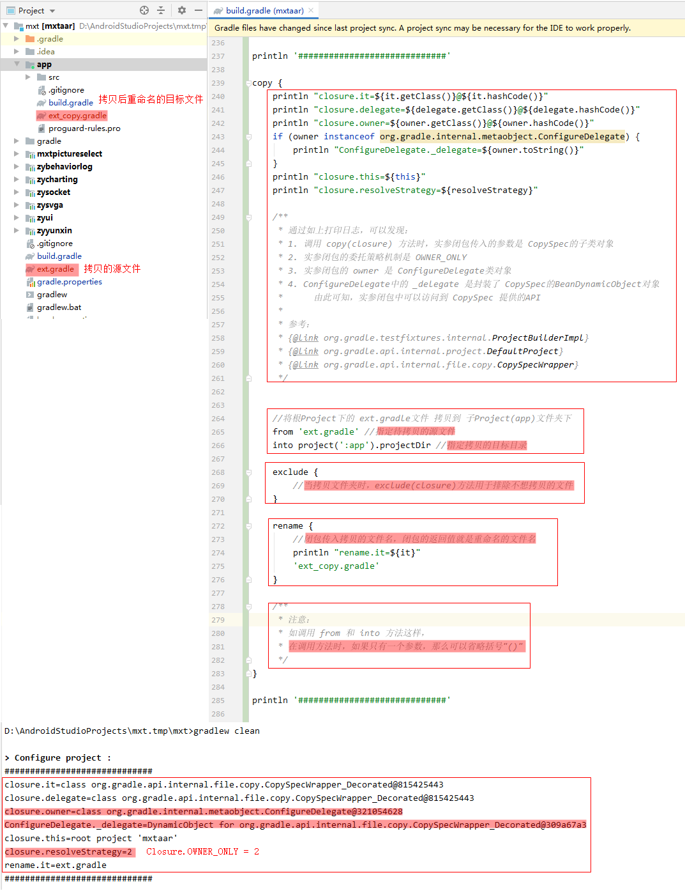

#### 2.5.3 `Project` 类提供的文件树的操作

##### 2.5.3.1 什么是文件树

`Gradle` 中，可以将根 `Project` 文件夹下的所有文件（包括根 `Project` 文件夹）看成是一棵文件树（相当于树结构）。

其中根 `Project` 文件夹作为根节点。并且，根 `Project` 文件夹下的每个文件夹也都可以作为一棵文件树。

`Gradle` 中用 `ConfigurableFileTree` 表示一棵文件树。

##### 2.5.3.2 文件树 `ConfigurableFileTree` 提供的常用 `API`

###### 2.5.3.2.1 设置文件树的根节点：`setDir(dir)`

```groovy:no-line-numbers
ConfigurableFileTree setDir(Object dir)
```

```:no-line-numbers
设置作为文件树的根节点的文件夹路径。可以是相对于当前 Project 的相对路径。
```

###### 2.5.3.2.2 设置文件树中需要排除的文件：`setExcludes(excludes)`

```groovy:no-line-numbers
PatternFilterable setExcludes(Iterable<String> excludes)
```

```:no-line-numbers
设置文件树中需要排除的文件，参数表示排除文件的集合。
```

###### 2.5.3.2.3 设置文件树中需要导入的文件：`setIncludes(includes)`

```groovy:no-line-numbers
PatternFilterable setIncludes(Iterable<String> includes)
```

```:no-line-numbers
设置文件树中需要导入的文件，参数表示导入文件的集合。
```

###### 2.5.3.2.4 遍历文件树：`visit(closure)`

```groovy:no-line-numbers
FileTree visit(Closure visitor)
```

```:no-line-numbers
遍历文件树。
实参闭包传入封装了当前遍历到的文件对象的 FileTreeElement 子类对象，
FileTreeElement 提供了 getFile() 方法来获取当前遍历到的 File 对象。
```

##### 2.5.3.3 构建文件树：`fileTree`

`Project` 类提供如下方法构建一棵文件树：

**方法一**

```groovy:no-line-numbers
ConfigurableFileTree fileTree(Object baseDir, Closure configureClosure)
```

```:no-line-numbers
baseDir: 设置作为文件树的根节点的文件夹路径，可以是相对于当前 Project 的相对路径；
configureClosure: 对文件树进行配置，闭包中可以访问 ConfigurableFileTree 提供的 API。
```

**方法二**

```groovy:no-line-numbers
ConfigurableFileTree fileTree(Map<String, ?> args)
```

```:no-line-numbers
args: 用于配置文件树的键值对属性 Map，其中 ConfigurableFileTree 提供的 setXxx 方法的参数作为属性值，xxx 作为属性名。
```

##### 2.5.3.4 示例代码

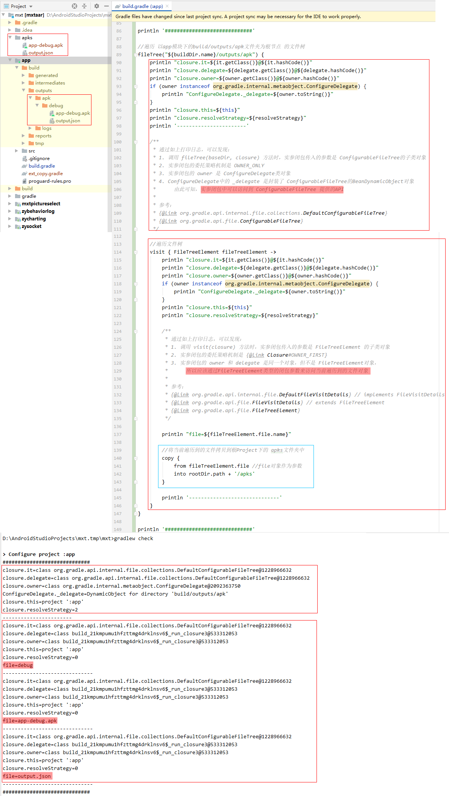

### 2.6 依赖相关的 `API`

项目中的依赖配置主要可分为 3 大类：

1. 配置依赖仓库；

2. 配置 `Gradle` 构建工程时依赖的 `Gradle` 插件；

3. 配置应用程序编译时依赖的第三方库。

#### 2.6.1 配置依赖仓库

仓库就是用来存放 `Gradle` 插件和第三方库的。所以，不仅要为 `Gradle` 插件配置依赖仓库；还要为第三方库配置依赖仓库。

##### 2.6.1.1 配置 `Gradle` 插件的依赖仓库

**Step 1.**

```:no-line-numbers
调用 Project.buildscript(closure)
```

> 注意：一般会在根 `Project` 的 `build.gradle` 中调用该方法。

**Step 2.**

```:no-line-numbers
在 Project.buildscript(closure) 的实参闭包中，调用 ScriptHandler.repositories(closure)
```

**Step 3.**

```:no-line-numbers
在 ScriptHandler.repositories(closure) 的实参闭包中，调用 RepositoryHandler 提供的 API 配置 Gradle 插件的依赖仓库
```

##### 2.6.1.2 配置第三方库的依赖仓库

**Step 1.**

```:no-line-numbers
调用 Project.buildscript(closure)
```

> 注意：一般会在根 `Project` 中调用 `allprojects(closure)`，遍历每个 `Project`，并调用该方法。

**Step 2.**

```:no-line-numbers
在 Project.repositories(closure) 的实参闭包中，调用 RepositoryHandler 提供的 API 配置第三方库的依赖仓库
```

##### 2.6.1.3 `RepositoryHandler` 类提供的配置依赖仓库的 `API`

###### 2.6.1.3.1 配置本地仓库：`flatDir(closure)`

```groovy:no-line-numbers
FlatDirectoryArtifactRepository flatDir(Closure configureClosure)
```

```:no-line-numbers
参数闭包 configureClosure 中可以使用 FlatDirectoryArtifactRepository 提供的 API 
```

**示例代码：**

```groovy:no-line-numbers
flatDir {
    dirs 'libs'  // 将当前 Project 下的 libs 文件夹作为本地仓库
}
```

###### 2.6.1.3.2 配置 `maven` 仓库：`maven(closure)`

```groovy:no-line-numbers
MavenArtifactRepository maven(Closure closure)
```

```:no-line-numbers
参数闭包 closure 中可以使用 MavenArtifactRepository 及其父类提供的 API：

1. 设置 maven 仓库的 url 地址：
    void setUrl(Object url) // MavenArtifactRepository 类提供

2. 为当前配置的 maven 仓库起别名：
    void setName(String name) // ArtifactRepository 类提供

3. 设置私有 maven 仓库的认证信息：
    void credentials(Action<? super PasswordCredentials> action) // AuthenticationSupported 类提供

    调用 credentials(closure) 就相当于调用 credentials(action)
    闭包 closure 中可以使用 PasswordCredentials 提供的 API
    闭包 closure 中主要调用 setUsername 和 setPassword 方法设置私有 maven 仓库的认证信息（即用户名和密码）
```

**示例代码：**

```groovy:no-line-numbers
maven {
    url 'http://mvn.cloud.alipay.com/nexus/content/repositories/releases/'
    name 'alipay' // 为此 maven 仓库起别名，可省略
    credentials { // 如果该 maven 仓库需要登录才能访问，需要配置用户名和密码
        username 'mvn_read_ws'
        password 'mrk8929'
    }
}
```

###### 2.6.1.3.3 配置 `mavenCentral ` 仓库：`mavenCentral()`

```groovy:no-line-numbers
MavenArtifactRepository mavenCentral()
```

相当于：

```groovy:no-line-numbers
maven {
    url 'https://repo.maven.apache.org/maven2/'
    name 'MavenRepo'
}
```

###### 2.6.1.3.4 配置本地maven仓库 ：`mavenLocal()`

```groovy:no-line-numbers
MavenArtifactRepository mavenLocal()
```

###### 2.6.1.3.5 配置 jcenter仓库：`jcenter()`

```groovy:no-line-numbers
MavenArtifactRepository jcenter()
```

##### 2.6.1.4 示例代码

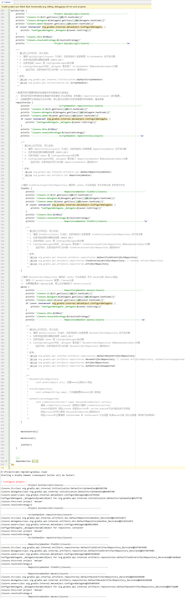

#### 2.6.2 配置依赖的 `Gradle` 插件

`Gradle` 本身可以理解为一个编程框架，在使用 `Gradle` 编写脚本代码时也可以使用一些第三方库，而 `Gradle` 插件可以理解为编写 Gradle 脚本代码时所需要依赖的第三方库。

配置 `Gradle` 插件的步骤：

**Step 1.**

```:no-line-numbers
调用 Project.buildscript(closure)
```

```:no-line-numbers
注意：一般会在根 Project 的 build.gradle 中调用该方法。
```

**Step 2.**

```:no-line-numbers
在 Project.buildscript(closure) 的实参闭包中，调用 ScriptHandler.dependencies(closure)
```

**Step 3.**

```:no-line-numbers
在 ScriptHandler.dependencies(closure) 的实参闭包中，调用 DependencyHandler 提供的 API 配置 Gradle 插件
```

`ScriptHandler.dependencies(closure)` 中的依赖配置举例：

```groovy:no-line-numbers
classpath 'com.android.tools.build:gradle:3.4.2'
```

```:no-line-numbers
其中：
1. classpath 作为 configurationName；'com.android.tools.build:gradle:3.4.2' 作为 dependencyNotation

2. 'com.android.tools.build:gradle:3.4.2' 表示的 Android Gradle 插件中，
    集成了插件 'com.android.application' 和插件 'com.android.library'。
```

#### 2.6.3 配置依赖的第三方库

**Step 1.**

```:no-line-numbers
调用 Project.dependencies(closure)
```

```:no-line-numbers
注意：一般会在每个子 Project 的 build.gradle 中分别调用该方法，为每个子 Project 单独配置依赖的第三方库。
```

**Step 2.**

```:no-line-numbers
在 Project.dependencies(closure) 的实参闭包中，调用 DependencyHandler 提供的 API 配置第三方库
```

**`Project.dependencies(closure)` 中的依赖配置举例如下：**

##### 2.6.3.1 导入依赖仓库中的第三方库

```groovy:no-line-numbers
implementation 'group:name:version'
```

```:no-line-numbers
group=groupId, name=artifactId, version=versionId
```

##### 2.6.3.2 导入 1 个或多个本地 `jar` 文件

```groovy:no-line-numbers
implementation files('jarFilePath1', 'jarFilePath2', ...)
```

```:no-line-numbers
路径是相对于当前 Project 的相对路径，如：
implementation files('libs/name1.jar') // 导入当前 Project 下的 libs 文件夹中的 name1.jar 文件
implementation files('libs/name1.jar', 'libs/name2.jar')
```

##### 2.6.3.3 导入当前 `Project` 下的以 `libs` 为根节点的文件树

```groovy:no-line-numbers
// 导入当前 Project 下的以 libs 为根节点的文件树
implementation fileTree('libs')
```

```groovy:no-line-numbers
//  导入当 前Project 下的以 libs 为根节点的文件树中以 .jar 为后缀名的所有文件
implementation fileTree(dir: 'libs', includes: ['*.jar'])
```

```groovy:no-line-numbers
// 导入当前 Project 下的以 libs 为根节点的文件树中不以 .jar 为后缀名的所有文件
implementation fileTree(dir: 'libs', excludes: ['*.jar'])
```

##### 2.6.3.4 排除 `'group:name:version'` 内部的依赖

```groovy:no-line-numbers
// 排除 'group:name:version' 内部的某个依赖
implementation ('group:name:version') {
    exclude group: 'innerGroup', module: 'innerName'
}
```

```groovy:no-line-numbers
implementation ('group:name:version') {
    // 排除 'group:name:version' 内部的所有依赖
    // 即当前 Project 仅直接依赖 'group:name:version'，不会间接依赖其内部依赖
    transitive = false
}
```

##### 2.6.3.5 依赖本地的子 `Project`

```groovy:no-line-numbers
implementation project(':name') // 依赖本地的子 Project
```

##### 2.6.3.6 导入当前 `Project` 的 `libs` 文件夹下的 `aar` 库文件

```groovy:no-line-numbers
implementation(name: 'fileName', ext: 'aar')
```

```:no-line-numbers
注意：必须在 Project.repositories(closure) 的闭包中指定当前 Project 的 libs 文件夹为依赖仓库

Project.repositories {
    ...
    flatDir {
        dirs 'libs'
    }
    ...
}
```

##### 2.6.3.7 占位编译配置 `provided`

可以使用 `provided` 代替 `compile` 或 `implementation` 导入依赖。此时，`provided` 导入的依赖库只在编译时期起作用，不会将依赖库添加到 `apk` 或 `aar` 或 `jar` 等构建产品中。

使用 `provided` 的使用场景：

1. 对于只在编译时期起作用的依赖库，使用 `provided` 导入，避免添加到 `apk` 中，减小 `apk` 体积。

    > 举例：如果依赖库只是用于在编译时期动态生成类文件，那么可以使用 `provided` 导入这类依赖库。

2. 当 `app` 模块使用的依赖库，在其他本地依赖模块中也使用到时，其他本地依赖模块中可以使用 `provided` 导入依赖库，

    > 即打包时，只把 `app` 模块中的依赖库添加到 `apk` 中即可。

**注意：** 能使用 `provided` 占位编译导入的依赖库，就尽量使用 `provided` 导入，这样可以减小 `apk` 体积。

##### 2.6.3.8 示例代码 

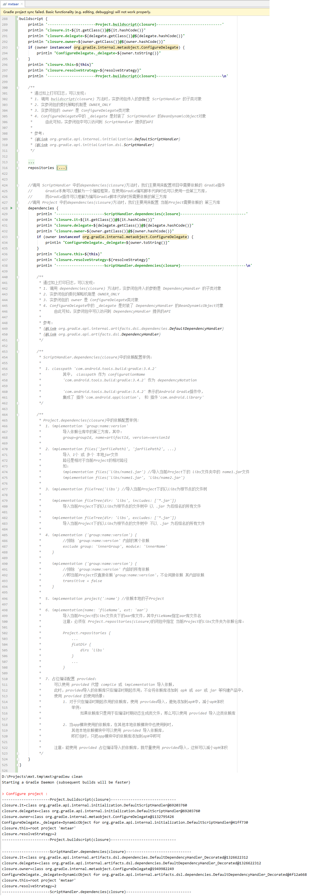

### 2.7 外部命令执行相关的 `API`

`Project` 类提供的执行外部命令的 `API` 如下：

```groovy:no-line-numbers
ExecResult exec(Closure closure)
```

```:no-line-numbers
实参闭包中可以调用 org.gradle.process.ExecSpec 提供的 API 来配置外部命令
```

**示例代码：**

```:no-line-numbers
知识点：

1. 在 Project 中创建一个 Task 任务

    Task task(String taskName, Closure configureClosure)

    Project 类提供了如上的 task 方法，创建一个名为 taskName 的 Task 任务；
    实参闭包中可以调用 org.gradle.api.Task 提供的 API，对 Task 任务进行配置。

2. Task 类提供的用于配置 Task 任务的 API

    Task doLast(Closure action)

    实参闭包中的代码在 Gradle 执行阶段才会执行

3. 对于可变字符串（双引号字符串），其中的 ${变量} 可简写为 $变量

4. 可以在根目录下执行 gradlew taskName 命令来执行一个 Task 任务

5. Windows 和 Linux 下的外部命令是不同的
```

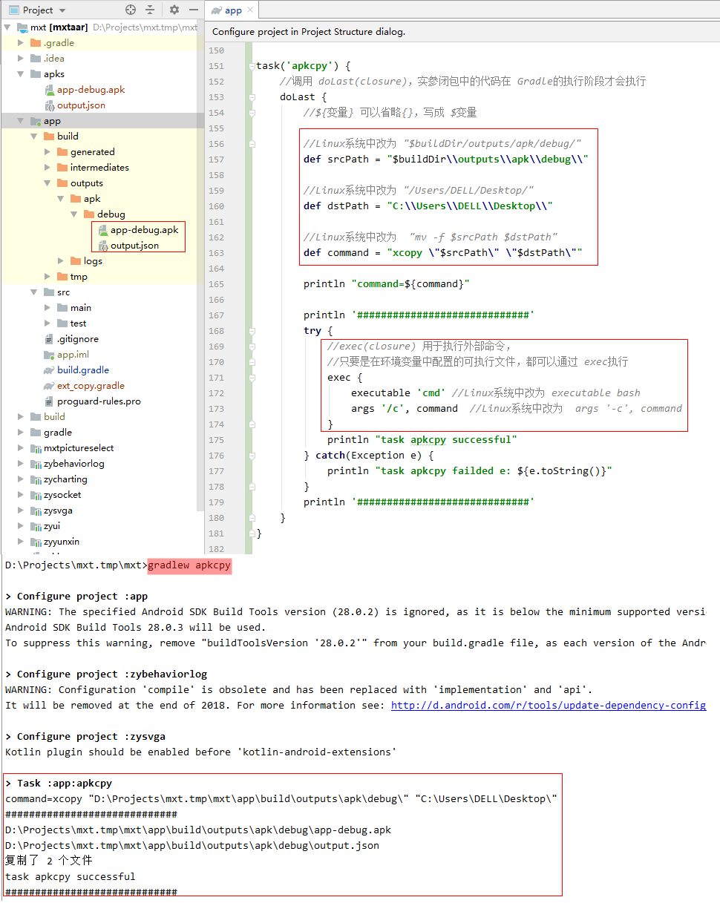

