## 1. `Task` 的创建 & 配置

### 1.1 创建 `Task`

`Project` 类提供如下方法创建一个 `Task`。

**方式一：**

```groovy:no-line-numbers
Task task(String name, Closure configureClosure)
```

**方式二：**

```groovy:no-line-numbers
TaskContainer getTasks()

// TaskContainer 提供了多个重载的 create 方法来创建 task
Task create(String name, Closure configureClosure)
```

**注意：**

```:no-line-numbers
1. Project 依赖 TaskContainer 来管理 Task。可以通过 TaskContainer 来创建和查找 Task；

2. task(name, configureClosure) 和 tasks.create(name, configureClosure) 中的实参闭包用于配置 Task，
    并且，在 Gradle 配置阶段就会执行配置 Task 的实参闭包；

3. 在执行 gradlew taskName 命令执行某个 Task 时，会经历 Gradle 的配置阶段，
    此时，所有在 Project 中创建的 Task，在创建时用于配置 Task 的实参闭包都会执行到；

4. 采用 task 'name' {...} 创建 task 时，其中的单引号可省略，即写成：task name {...}

5. task 创建后，taskName 作为 Project 的属性，可以直接在 build.gradle 中通过 taskName 调用 Task 的 API
```

**示例代码：**

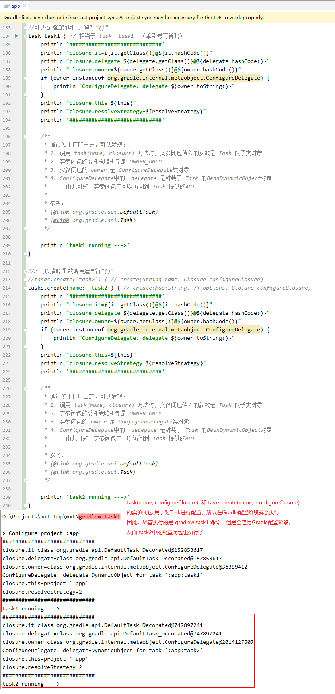

### 1.2 配置 `Task`

#### 1.2.1 `Task` 中可配置的属性

`org.gradle.api.Task` 类中定义了如下几个属性用于配置 `Task`。

##### 1.2.1.1 配置 `Task` 的名字：`name`

```groovy:no-line-numbers
String TASK_NAME = "name"
```

##### 1.2.1.2 配置 `Task` 的描述信息：`description`

```groovy:no-line-numbers
String TASK_DESCRIPTION = "description"
```

##### 1.2.1.3 配置 `Task` 的分组：`group`

```groovy:no-line-numbers
String TASK_GROUP = "group"
```

##### 1.2.1.4 配置 `Task` 的类型：`type`

```groovy:no-line-numbers
String TASK_TYPE = "type"
```

##### 1.2.1.5 配置 `Task` 所依赖的其他 `Task`：`dependsOn`

```groovy:no-line-numbers
String TASK_DEPENDS_ON = "dependsOn"
```

##### 1.2.1.6 配置 `Task` 用于重写 `overwrite` 属性指定的 `Task`：`overwrite`

```groovy:no-line-numbers
String TASK_OVERWRITE = "overwrite"
```

##### 1.2.1.7 配置 `Task` 的动作（即执行逻辑）：`action`

```groovy:no-line-numbers
String TASK_ACTION = "action"
```

#### 1.2.2 配置 `Task` 的 `2` 种方式

**方式一：**

```groovy:no-line-numbers
// 调用 Project 类提供的方法
Task task(Map<String, ?> args, String name, Closure configureClosure)

// 调用示例
task ([attrName1: attrValue1, attrName2: attrValue2, ...], 'taskName') {...}

// 还可以写成
// 其中，taskName 可以省略单引号，上面的书写形式中不可以省略
task taskName(attrName1: attrValue1, attrName2: attrValue2, ...) {...}
```

**方式二：**

```groovy:no-line-numbers
// 调用 Project 类提供的方法：
Task task(String name, Closure configureClosure)

// 调用示例
// 其中，1. taskName 可以省略单引号；2. 在实参闭包中设置 Task 属性
task taskName {
    attrName1 = attrValue1
    attrName2 = attrValue2
    ...
}
```

**注意：**

```:no-line-numbers
如果不设置 Task 的 group 属性，那么 Task 默认放在当前 Project 的 other 组中。
```

**示例代码：**

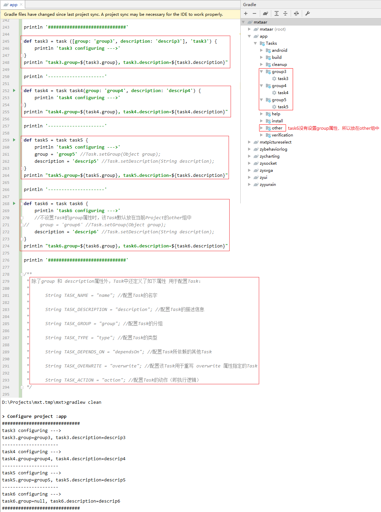

## 2. `Task` 的动作集合 & `doLast` & `doFirst`

### 2.1 注：只有通过 `Task` 才能将业务放在 `Gradle` 执行阶段去处理

### 2.2 `Task` 的动作集合就是 `Task` 在 `Gradle` 执行阶段才执行的代码

### 2.3 一个动作（`Action`）就是一段代码，动作集合就是代码段集合

### 2.4 向动作集合的头部插入一个动作：`doFirst(closure)`

```:no-line-numbers
doFirst(closure) 用于将实参闭包表示的动作插入到动作集合的头部。

注意：多次调用 doFirst(closure)，最后一次调用的 doFirst 配置的动作最先执行。
```

### 2.5 向动作集合的尾部插入一个动作：`doLast(closure)`

```:no-line-numbers
doLast(closure) 用于将实参闭包表示的动作插入到动作集合的尾部。

注意：多次调用 doLast(closure), 最后一次调用的 doLast 配置的动作最后执行。
```

### 2.6 示例代码

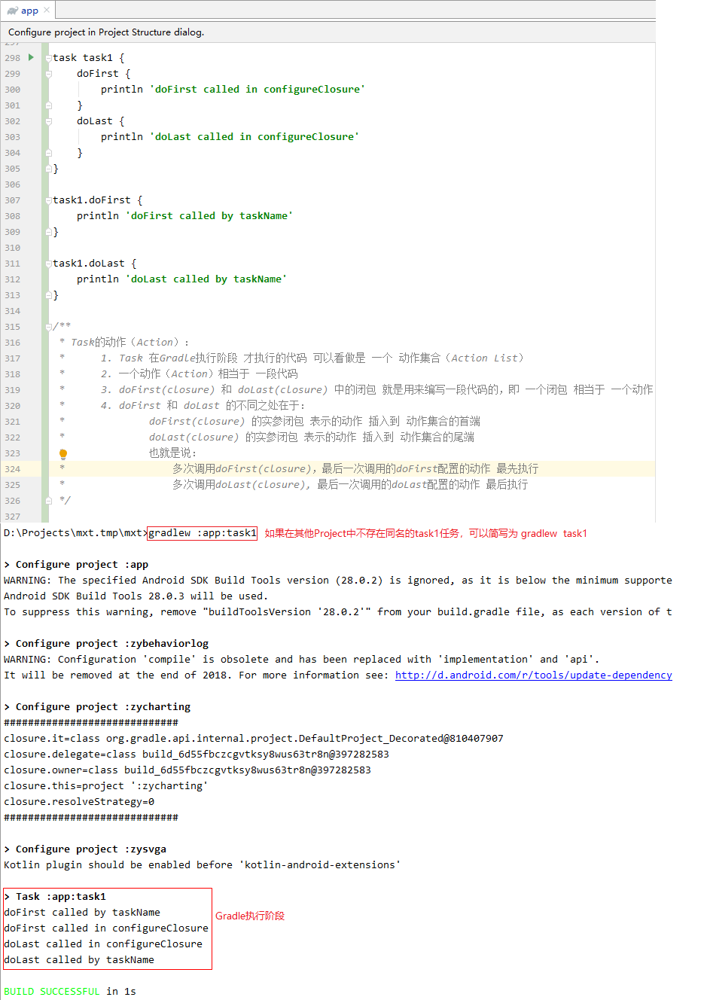

### 2.7 案例：统计 `build` 时长

#### 2.7.1 如何查找所有存在的 `task`

```:no-line-numbers
调用 tasks.getByName(taskName) 可以查找指定的 task。另外，也可以通过 tasks 遍历所有存在的 task。

注意：
为了保证 tasks.getByName(taskName) 能够查找到所有存在的 task，应该在 Gradle 配置阶段完后，即所有 task 都配置完成后，
再调用 tasks.getByName(taskName) 方法。也就是说，应该在 Project.afterEvaluate(closure) 的实参闭包中调用该方法。
```

#### 2.7.2 案例代码

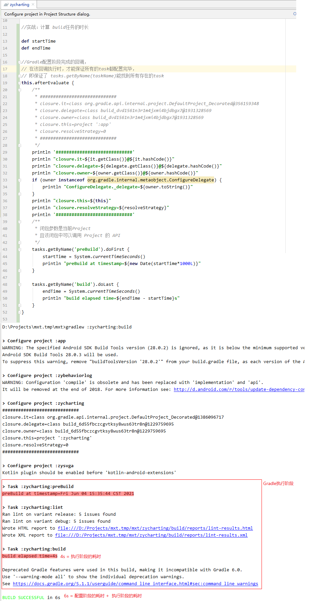

## 3. `Task` 的执行顺序

### 3.1 通过 `Task` 的 `dependsOn` 属性指定依赖 `Task`

**方式一：**

```groovy:no-line-numbers
// 调用 Project 提供的如下方法，在参数 args 中指定依赖 Task
task(Map<String, ?> args, String name, Closure configureClosure)
```

```:no-line-numbers
参数 args 是一个 map，map 的 key 表示 Task 的属性，value 表示属性值。
注意：该方法可以通过 "task name(args) {}" 的形式调用，其中 {} 表示配置闭包 configureClosure。
```

```groovy:no-line-numbers
// 1. 指定一个依赖 Task
// 只为参数 args 配置了一个键值对元素（key=dependsOn）
task taskMainName(dependsOn: taskOtherName) {...} 
```

```groovy:no-line-numbers
// 2. 指定多个依赖 Task
// 只为参数 args 配置了一个键值对元素（key=dependsOn）
task taskMainName(dependsOn: [taskOtherName1, taskOtherName2, ...]) {...} 
```

**方式二：**

```groovy:no-line-numbers
// 调用 Project 提供的如下方法，在配置闭包 configureClosure 中指定依赖 Task
task(String name, Closure configureClosure)
```

```groovy:no-line-numbers
/* 配置闭包中可以通过如下方式配置依赖：*/

// 1. 调用 Task 的 setDependsOn(Iterable<?> dependsOnTasks) 方法，示例如下：

task taskMainName {
    // 指定一个依赖 Task
    dependsOn = [taskOtherName1] 
}

task taskMainName {
    // 指定多个依赖 Task
    dependsOn = [taskOtherName1, taskOtherName2, ...]  
}  

// 2. 调用 Task 的 dependsOn(Object... paths) 方法，示例如下：
task taskMainName {
    // 指定一个依赖Task
    dependsOn  taskOtherName1 
}

task taskMainName {
    // 指定多个依赖 Task
    dependsOn  taskOtherName1, taskOtherName2, ...  
}
```

#### 3.1.1 注：先执行依赖 `Task` 的动作集合，再执行 `Task` 本身的动作集合

#### 3.1.2 示例代码一：多个依赖 `Task` 之间的执行顺序默认是不确定的

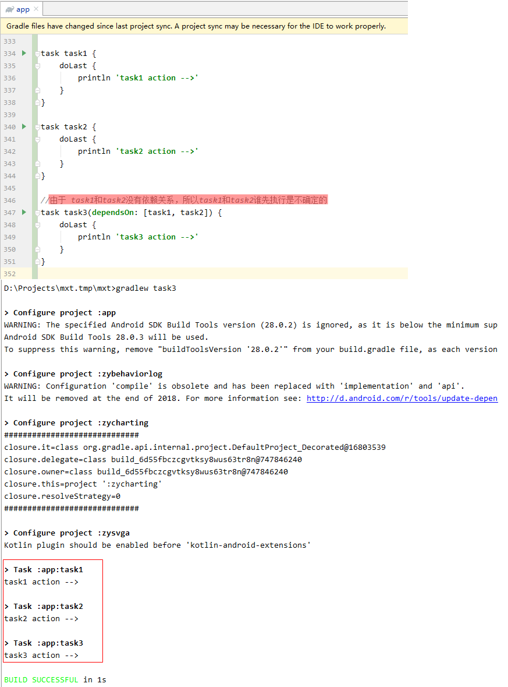

#### 3.1.3 示例代码二：多个依赖 `Task` 之间使用 `dependsOn` 指定执行顺序

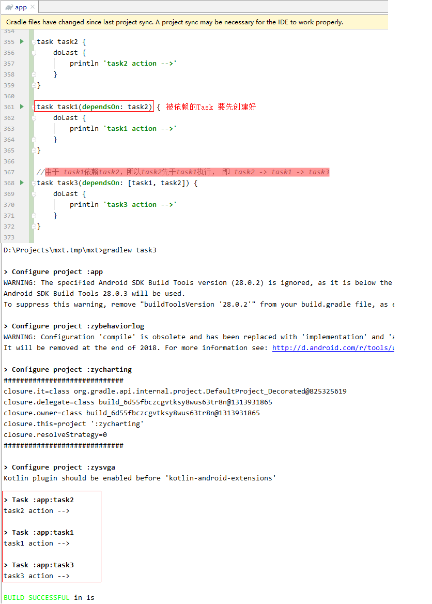

#### 3.1.4 示例代码三：结合 `tasks` 动态指定满足条件的依赖 `Task`

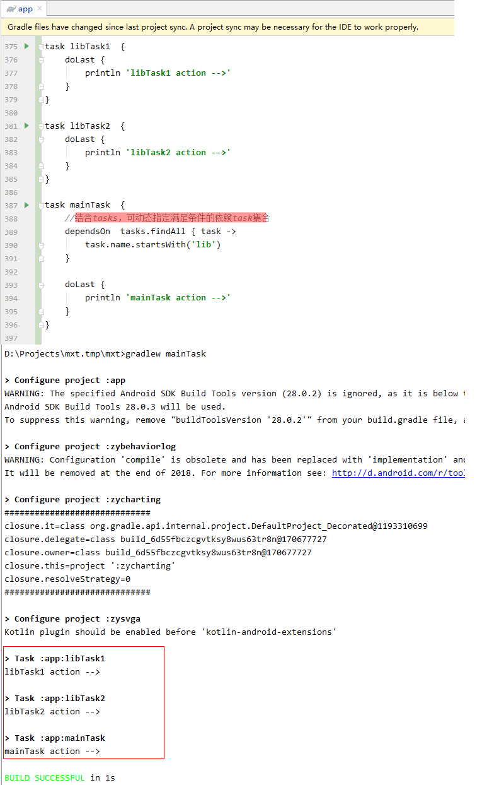

### 3.2 通过 `Task` 类的 `mustRunAfter` 方法指定执行顺序

`Task` 类提供了 `mustRunAfter` 方法指定 `Task` 的执行顺序。

```groovy:no-line-numbers
// 示例 mustRunAfter task1, task2, ...
Task mustRunAfter(Object... paths);

// 示例 mustRunAfter = [task1, task2, ...]
void setMustRunAfter(Iterable<?> mustRunAfter); 

TaskDependency getMustRunAfter();
```

**注意：**

```:no-line-numbers
1. 通过 mustRunAfter 仅仅只是指定多个 task 一起执行时的先后顺序，并不会指定多个 task 的依赖关系。
    也就是说，当执行 gradlew task3, task2, task1 命令，执行多个 task 时，
    会按照 mustRunAfter 指定的先后顺序执行 task，
    但是，当执行 gradlew task3 命令时，仅仅只会执行 task3，因为 task3 没有依赖 task。

2. 通过 dependsOn 为 task3 指定依赖 task1 和 task2，
    此时，执行 gradlew task3 命令，会先执行依赖 task1 和 task2，最后执行 task3。
    但是，task1 和 task2 的执行顺序是不确定的，
    此时，可以通过 mustRunAfter 来指定 task1 和 task2 的执行顺序。
```

#### 3.2.1 示例代码一

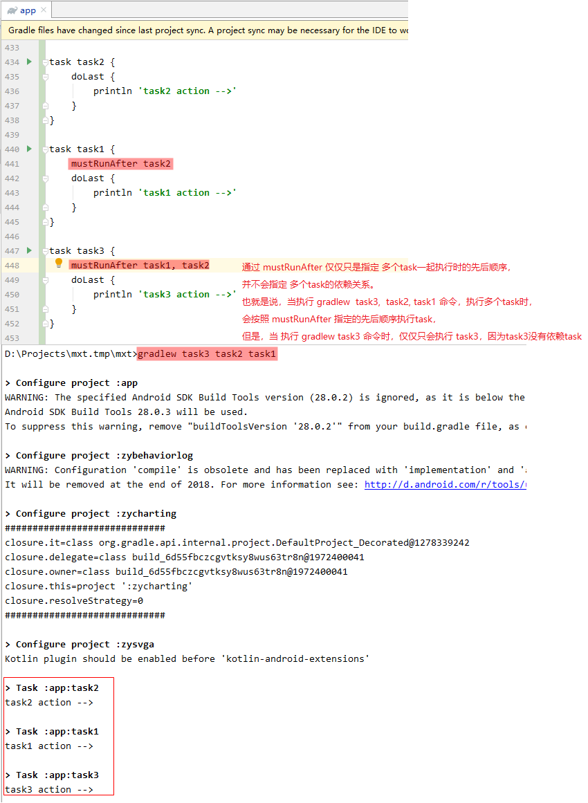

#### 3.2.2 示例代码二

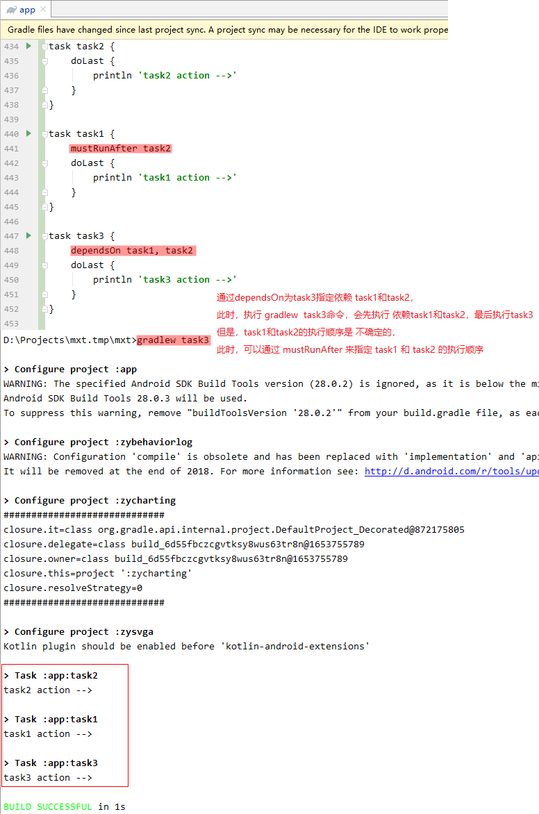

### 3.3 将自定义 `Task` 挂接到构建过程中

**挂接步骤：**

```:no-line-numbers
step1：先执行一次 build 任务，通过打印确定构建过程中涉及到的内部 Task；

step2：通过 dependsOn 和 mustRunAfter 将自定义 Task 插入到内部 Task 执行序列中。
```

**注意：**

```:no-line-numbers
1. 为了看到 build 时的所有执行的 task，需要从 AS 的 Gradle 面板中点击对应 Project 的 build 任务执行；

2. 如果要将自定义 Task(customTask) 挂接到内部 Task(innerTask) 之前执行，
    那么可以通过建立依赖关系 "innerTask.dependsOn customTask" 实现；

3. 如果要将自定义 Task(customTask) 挂接到内部 Task(innerTask) 之后执行，那么有如下两种方式：

    1. 将 customTask 作为 innerTask 的下一个内部 Task(nextInnerTask) 的依赖，然后将 customTask 的执行顺序放在 innerTask 之后，即：

        nextInnerTask.dependsOn  customTask
        customTask.mustRunAfter innerTask

    2. 取出 customTask 的动作集合（actions），将一个个的动作依次分别添加到 innerTask 的 doLast 中，即：

        customTask.actions.each { action ->
            innerTask.doLast action  // 这里调用了 Task.doLast(action) 方法
        }
```

#### 3.3.1 示例代码

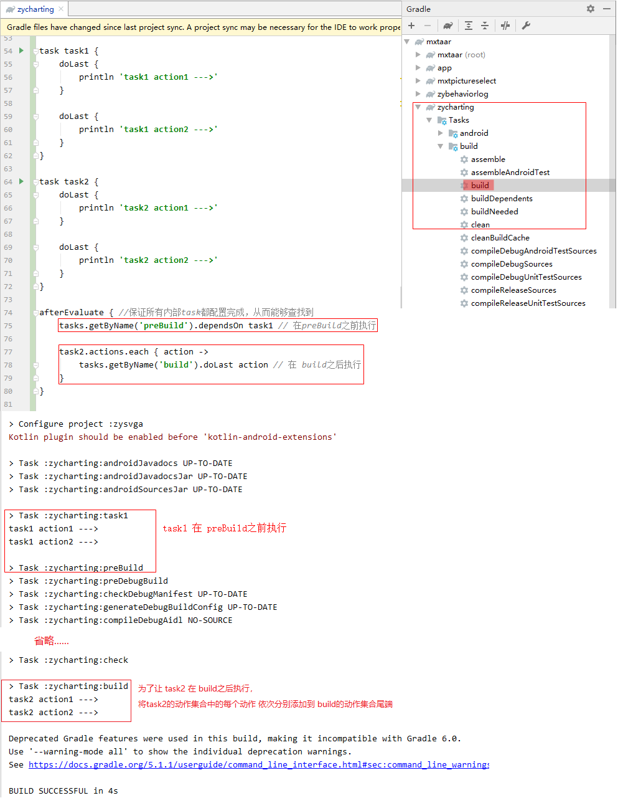

## 4. `Task` 的输入输出

### 4.1 `Task` 类中表示输入和输出的属性：`inputs` & `outputs`

`Task` 类中存在 `inputs` 和 `outputs` 这两个属性分别表示输入和输出。

```groovy:no-line-numbers
// 即 inputs 属性为只读
TaskInputs getInputs();

// 即 outputs 属性为只读
TaskOutputs getOutputs();
```

### 4.2 `TaskInputs` 提供的 `API`

#### 4.2.1 向 `TaskInputs` 中存取键值对属性

```groovy:no-line-numbers
/* 只是存在内存中 */

property(String name, @Nullable Object value);

properties(Map<String, ?> properties);

Map<String, Object> getProperties();
```

#### 4.2.2 设置/获取输入文件

```groovy:no-line-numbers
file(Object path) // 设置单个输入文件

files(Object... paths) // 设置多个输入文件

dir(Object dirPath) // 将整个文件夹作为输入源

FileCollection getFiles() // 获取输入源
```

`FileCollection` 表示文件集合，提供了如下 `API` 访问指定的文件：

```groovy:no-line-numbers
File getSingleFile() // 若文件集合中只有一个文件，返回这个文件，其他情况会抛出异常
Set<File> getFiles() // 返回所有的文件集合
```

### 4.3 `TaskOutpus` 提供的 `API`

#### 4.3.1 设置/获取输出文件

```groovy:no-line-numbers
file(Object path) // 设置单个输出文件
files(Object... paths) // 设置多个输出文件

dir(Object path) // 设置单个输出文件夹
dirs(Object... paths) // 设置多个输出文件夹

FileCollection getFiles() // 获取输出源
```

## 5. `Task` 的类型

在 [Gradle 5.1.1 版本的官方文档](https://docs.gradle.org/5.1.1/dsl/index.html) 中的 `Task Types` 栏目中介绍了各种 `Task` 类型，如：

```:no-line-numbers
Copy
Delete
Jar
JavaCompile
Javadoc
Test
Upload
```

### 5.1 注：可以通过 `Task` 的 `type` 属性设置 `Task` 的类型

```:no-line-numbers
每种 Task 类型名都对应一个同名的类，在创建某类型的 Task 时，配置闭包中可以调用对应类提供的 API。
注意：如果没有通过 Task 的 type 属性指定 Task 类型，那么就是默认类型，对应类 DefaultTask。
```

### 5.2 获取同一类型的 `Task` 集合

**Step 1.**

```:no-line-numbers
调用 Project.getTasks() 方法获取管理 task 的容器类 TaskContainer。
```

**Step 2.**

```:no-line-numbers
调用 TaskContainer 提供的 withType 方法访问同一类型的 Task。
```

```groovy:no-line-numbers
<S extends Task> DomainObjectCollection<S> withType(Class<S> type)
<S extends Task> DomainObjectCollection<S> withType(Class<S> type, Closure configureClosure)
```

```:no-line-numbers
参数 type 传入 Task 类型对应的类的字节码对象，如传入 Javadoc.class 时，返回的是 Javadoc 类型的 Task 集合。
参数 configureClosure 作为配置闭包，对返回的同一类型的所有 Task 进行统一配置。
```

### 5.3 示例代码

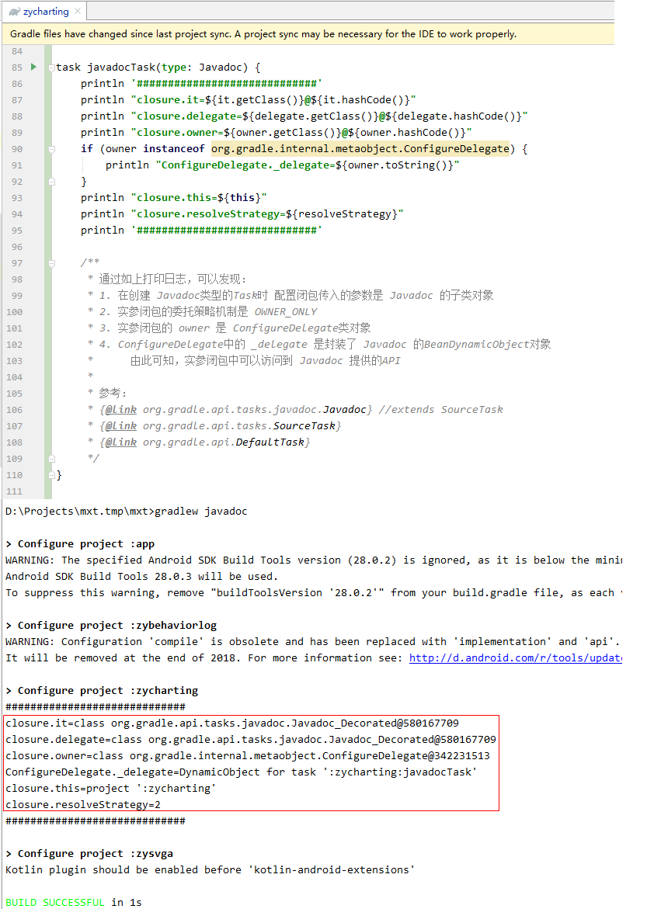