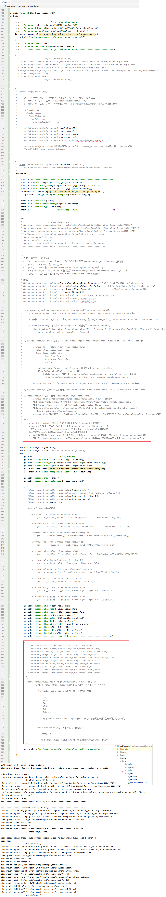

## 1. `Settings` 类和 `settings.gradle` 文件

在 [分析 setting.gradle 文件的内部实现](/zkq/gradle/_05_project.html#_2-4-6-分析-setting-gradle-文件的内部实现) 中有提到：

```:no-line-numbers
1. settings.gradle 编译生成的字节码文件，是一个 SettingsScript 的子类文件；

2. SettingsScript 类是一个脚本类，其中的 getScriptTarget() 返回一个目标对象 target，
   这个目标对象 target 为 settings.gradle 文件中提供了可以使用的 API；

3. 为 settings.gradle 文件中提供可以使用的 API 的目标对象 target 就是一个动态创建的 DefaultSettings 的子类。
   也就是说，setting.gradle 文件中可以使用 DefaultSettings 提供的API；

4. 查看源码，大概判断是使用 AsmBackedClassGenerator 来动态创建 DefaultSettings 的子类的。
   这与动态创建 DefaultProject 的子类所使用的生成器一样。在 AsmBackedClassGenerator 中，
   可以看到创建 DefaultSettings 子类时所动态生成的一些 API，这些动态生成的 API 也可以在该 settings.gradle 中使用。

参考：
org.gradle.initialization.SettingsScript
org.gradle.initialization.DefaultSettings // implements Settings
org.gradle.api.initialization.Settings
org.gradle.initialization.SettingsFactory
org.gradle.internal.service.scopes.BuildScopeServices
org.gradle.api.internal.ClassGeneratorBackedInstantiator
org.gradle.api.internal.AsmBackedClassGenerator
```

综上，就像 `build.gradle` 文件中可以调用 `Project` 的 `API` 来初始化一个 `Project` 类对象一样。

`settings.gradle` 文件中则可以调用 `Settings` 的 `API` 用来初始化一个 `Settings` 类对象。

### 1.1 `settings.gradle` 文件的主要作用：导入子 `Project`

`settings.gradle` 文件的主要作用就是通过 `Settings` 类提供的 `include` 方法导入子 `Project`。

### 1.2 `Gradle` 初始化阶段的主要工作：解析出 `Project` 树结构

`Gradle` 初始化阶段的主要工作就是对 `settings.gradle` 文件进行处理，解析出整个 `Project` 项目的 `Project` 树结构。

### 1.3 `Settings` 类的相关 `API`

#### 1.3.1 导入一个或多个子 `Project`

```groovy:no-line-numbers
void include(String... projectPaths)
```

```:no-line-numbers
作用：导入一个或多个子 Project

注意：projectPath 并不是表示子 Project 所在的文件路径，而是表示在将要构建的整个 Project 树结构中该子 Project 所在的结构位置，如：

    include ':projectName1'  
        1. 表示导入了一个名为 projectName1 的一级子 Project，即该子 Project 是根 Project 下的直接子 Project
        2. 默认情况下，在根 Project 的文件夹下，应该有一个名为 projectName1 的文件夹作为该子 Project 的文件夹

    include ':projectName1:projectName2'
        1. 表示导入了一个名为 projectName2 的二级子 Project，即该子 Project 是一级子 Project(projectName1) 下的子 Project
        2. 默认情况下，在根 Project 的文件夹下的 projectName1 文件夹下，应该有一个名为 projectName2 的文件夹
```

#### 1.3.2 导入项目之外的文件夹作为子 `Project`

导入根 `Project` 目录之外的文件夹作为子 `Project` 的步骤如下：

```:no-line-numbers
Step1. 先执行 include ':subProject'  表示导入了一个名为 subProject 的一级子 Project

Step2. 再执行 project(':subProject').projectDir = file('subProjectDir')
    该代码表示将 subProjectDir（根 Project 目录之外的文件夹路径）作为 subProject 的工程目录。
```

## 2. `SourceSet` 类

### 2.1 使用示例

```groovy:no-line-numbers
android { // android 表示一个 Android 工程，配置闭包中对 Android 工程进行配置
    sourceSets { // 从 "Sets" 可以看出，是set的集合（即集合的集合），sourceSets 表示资源集合，配置闭包中对资源进行配置
        main { // main 表示一个 set 集合，这里就是 AndroidSourceSet，配置闭包中对 Android 资源进行配置
            //可以调用 AndroidSourceSet 的 API
        }
    }
}
```

### 2.2 `sourceSets(configureClosure)` 的作用

```:no-line-numbers
sourceSets(configureClosure) 的作用就是用来配置 sourceSets 对象的
sourceSets 对象是一个容器，容器中的元素是 AndroidSourceSet，即 Android 资源集合，
也就是说 sourceSets(configureClosure) 就是用来配置各种 Android 资源集合的，
具体有哪些 Android 资源集合，由 Android-Gradle 插件来初始化，
从上面的源码可以看出，sourceSets 容器中保存了一个名为 main 的 Android 资源集合（即 main 是一个 AndroidSourceSet 对象）
可以通过 main(configureClosure) 配置名为 main 的 Android 资源集合，配置闭包中可以调用 AndroidSourceSet 的 API
```

### 2.3 `Android` 资源集合 "`main`" 的配置详解

`main(configureClosure)` 可以访问 `DefaultAndroidSourceSet` 的 `API`。

配置 `Android` 资源集合，主要就是通过配置 `DefaultAndroidSourceSet` 中的相关属性，来指定相关文件的访问路径。

`DefaultAndroidSourceSet` 中的部分属性如下：

1. 表示资源目录的 `AndroidSourceDirectorySet` 类型的属性

    ```:no-line-numbers
    res
    assets
    java
    aidl
    jni
    jniLibs
    ```

    ```groovy:no-line-numbers
    /* 调用 AndroidSourceDirectorySet 的如下 API 可以为这些属性分别指定资源目录的实际路径 */
    AndroidSourceDirectorySet srcDir(Object srcDir);
    AndroidSourceDirectorySet srcDirs(Object... srcDirs);
    AndroidSourceDirectorySet setSrcDirs(Iterable<?> srcDirs);

    Set<File> getSrcDirs();
    String getName();
    ```

2. 表示资源文件的 `AndroidSourceFile` 类型的属性

    ```:no-line-numbers
    manifest
    ```

    ```groovy:no-line-numbers
    /* 调用 AndroidSourceFile 的如下 API 可以为该属性指定资源文件的实际路径 */
    AndroidSourceFile srcFile(Object srcPath);

    File getSrcFile();
    String getName();
    ```

### 2.4 示例代码

