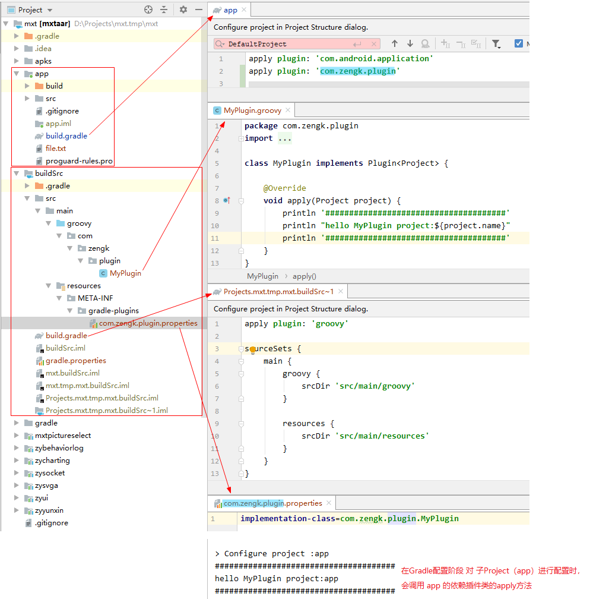
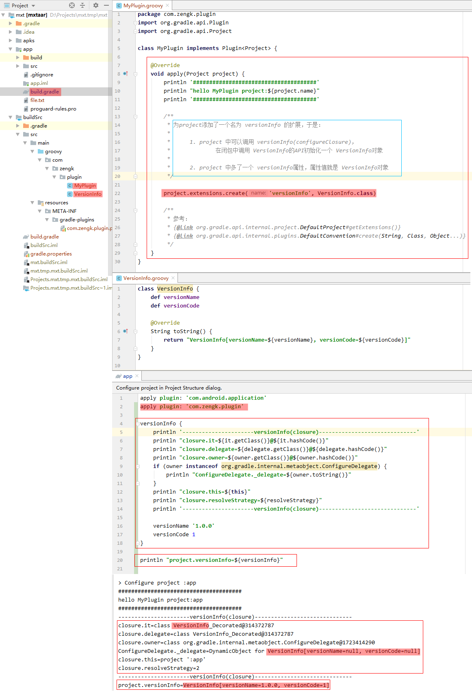
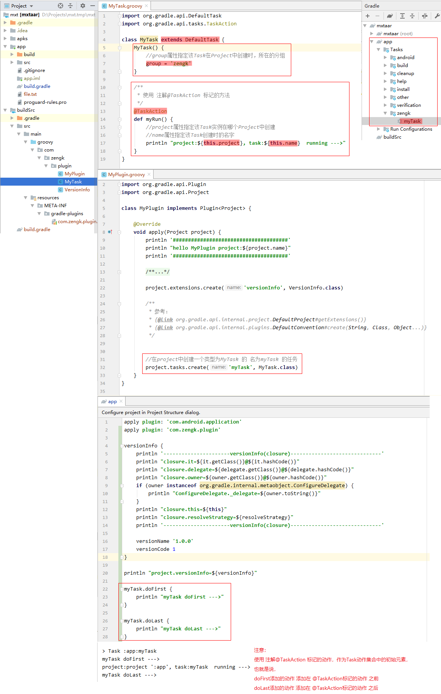
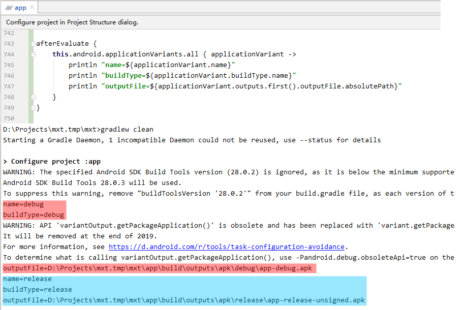

## 1. 自定义 `Plugin` 插件

### 1.1 手动创建一个本地的 `buildSrc` 插件模块

**`buildSrc` 插件模块的文件结构如下：**

```:no-line-numbers
buildSrc
—— src/
———— main/
—————— groovy/
—————— resources/
———————— META-INF/
—————————— gradle-plugins/
———————————— {packageId}.properties // 如 com.zengk.plugin.properties
—— build.gradle
—— gradle.properties
```

**注意：本地的插件模块必须命名为 `buildSrc`，否则无法在根 `Project` 下的其他子 `Project` 中引入该插件模块。**

**插件模块的主要创建步骤如下：**

1. `build.gradle` 文件内容模版如下：

    ```groovy:no-line-numbers
    apply plugin: 'groovy' 

    sourceSets {
        main {
            groovy {
                srcDir 'src/main/groovy'  // 存放 groovy 源码文件的路径
            }

            resources {
                srcDir 'src/main/resources'  // 存放插件用到的资源文件的路径
            }
        }
    }
    ```

2. 在 `src/main/groovy/` 目录下创建包路径 `com.zengk.plugin`

3. 在包路径下创建普通文件 `MyPlugin.groovy`

    > 因为 `AS` 不支持直接创建 `groovy` 文件，所以创建后缀为 `.groovy` 的普通文件也是一样的。

    ```groovy:no-line-numbers
    /* MyPlugin.groovy */
    package com.zengk.plugin

    import org.gradle.api.Plugin
    import org.gradle.api.Project

    class MyPlugin implementsPlugin<Project> { // MyPlugin 表示一个自定义插件
        
        /**
          * 将插件引入到 Project 时会调用该 apply 方法
          * 参数 project 表示引入了该插件的 Project
         */
        @override
        void apply(Project project) {
            println "hello MyPlugin in project:${project.name}" // 自定义插件 MyPlugin 仅用来打印这条日志
        }
    }
    ```

    > 注意：`Gradle` 同步后该 `MyPlugin.groovy` 会与自动生成的 `buildSrc/build/` 下的 `MyPlugin.class` 产生同名冲突，但不影响使用。

4. 在 `src/main/resources/META-INF/gradle-plugins/` 目录下创建 `com.zengk.plugin.properties` 文件，文件内容如下：

    ```:no-line-numbers
    implementation-class=com.zengk.plugin.MyPlugin
    ```

    ```:no-line-numbers
    com.zengk.plugin.properties 文件的作用就是用来声明自定义插件的，
    其中 "com.zengk.plugin" 是自定义插件类的包路径，
    当我们要在其他子 Project 中引入该插件时，"com.zengk.plugin" 就作为引入插件时的标识 id
    ```

5. 在其他子 `Project` 的 `build.gradle` 文件中通过 `apply plugin 'com.zengk.plugin'` 即可引入该本地插件

**本地的 `buildSrc` 插件的使用示例：**



### 1.2 通过 `Plugin` 插件为 `Project` 添加扩展

**步骤如下：**

1. 自定义扩展类；

2. 在插件类的 `apply` 方法中，调用 `project.extension.create` 方法为 `project` 添加扩展。

    > 哪个 `project` 中引入了该插件，就是在为哪个 `project` 添加扩展。

**如何在 `Project` 中访问已添加的扩展：**

如插件类的 `apply` 方法中添加的扩展如下：

```groovy:no-line-numbers
project.extensions.create('versionInfo', VersionInfo.class)
```

```:no-line-numbers
如上代码为 project 添加了一个名为 versionInfo 的扩展，于是：
1. project 中可以调用 versionInfo(configureClosure)，在闭包中调用 VersionInfo 的 API 初始化一个 VersionInfo 对象
2. project 中多了一个 versionInfo 属性，属性值就是 VersionInfo 对象
```

**示例代码：**



### 1.3 通过 `Plugin` 插件为 `Project` 添加 `Task` 任务

**步骤如下：**

1. 自定义 `Task` 任务类（继承自 `DefaultTask`）；

2. 在自定义 `Task` 中定义方法，并使用注解 `@TaskAction` 将该方法标记为在 `Gradle` 执行阶段才执行的 `Task` 动作；

3. 在自定义插件类的 `apply` 方法中，调用 `project.tasks.create(taskName, taskClass)` 创建 `Task` 任务。

**示例代码：**



## 2. `Android` 插件

> 参考：[Gradle Android插件用户指南翻译](https://avatarqing.github.io/Gradle-Plugin-User-Guide-Chinese-Verision/index.html)
>
> 参考：[Android 项目中 Gradle 配置的官方文档](https://developer.android.com/studio/build )

### 2.1 `Android` 插件为 `Gradle` 添加的扩展

对于 `android(configureClosure)` 其中，`android` 是 `project` 的扩展，于是：

1. `android` 作为 `project` 的扩展属性时，表示一个 `BaseExtension` 子类对象；

2. `android` 作为 `project` 的扩展方法时，带一个闭包参数，闭包中对 `BaseExtension` 子类对象进行初始化配置。

`android(configureClosure)` 的配置闭包中可以使用 `BaseExtension` 提供的 `API` 来配置一个 `Android` 项目。

也就是说，`Android` 插件为 `Gradle` 添加的扩展中所使用的 `API` 基本上可以在 `BaseExtension` 类中找到出处：

```groovy:no-line-numbers
android {
    /* 更多的请参考 BaseExtension 中的 API，基本上参数为 Action 的方法，都对应一个配置闭包 */

    compileSdkVersion  'version'  // void compileSdkVersion(String version)

    buildToolsVersion 'version'  // void buildToolsVersion(String version)

    defaultConfig {...}  // void defaultConfig(Action<DefaultConfig> action), 该闭包中可以使用 DefaultConfig 的API

    signingConfigs {...} // void signingConfigs(Action<? super NamedDomainObjectContainer<SigningConfig>> action)

    buildTypes {...}  // void buildTypes(Action<? super NamedDomainObjectContainer<BuildType>> action)

    lintOptions {...}  // void lintOptions(Action<LintOptions> action)

    dexOptions {...}  // void dexOptions(Action<DexOptions> action)

    compileOptions {...}  // void compileOptions(Action<CompileOptions> action)

    sourceSets {...}  // void sourceSets(Action<NamedDomainObjectContainer<AndroidSourceSet>> action)

    productFlavors {...}  // void productFlavors(Action<? super NamedDomainObjectContainer<ProductFlavor>> action)

    packagingOptions {...}  // void packagingOptions(Action<PackagingOptions> action)
}
```

**`BaseExtension` 的继承关系如下：**

```:no-line-numbers
AndroidConfig
—— BaseExtension
———— TestedExtension
—————— AppExtension
———————— BaseAppModuleExtension

参考：
{@link com.android.build.gradle.AndroidConfig}
{@link com.android.build.gradle.BaseExtension}
{@link com.android.build.gradle.TestedExtension}
{@link com.android.build.gradle.AppExtension}
{@link com.android.build.gradle.internal.dsl.BaseAppModuleExtension}
```

### 2.2 `Android` 插件为 `Gradle` 添加的 `Task` 任务

```:no-line-numbers
在 BaseVariant 类中定义的返回值类型为 TaskProvider<T> 的方法所返回的对象就是一个封装了 Task 对象的 TaskProvider，
调用 TaskProvider.get 方法就可以获取到 Task 对象，
泛型 T 表示该 Task 对象的类型。
```

### 2.3 变体（`Variant`）

变体（`Variant`）就是子 `Project` 构建生成的产物。

`android(configureClosure)` 的作用就是用来对变体（`Variant`）进行配置。

> 配置不同，得到的变体（`Variant`）也不同。
> 
> 闭包中的配置项也都会保存在变体对象中。

变体的基类是 `BaseVariant`，有如下 `2` 种变体类型：

1. `ApplicationVariant`

2. `LibraryVariant`

变体类型不同时，`android(configureClosure)` 的作用不同：

1. 当子 `Project` 是一个 `Android` 应用程序时（`apply plugin: 'com.android.application'`）

    ```:no-line-numbers
    1. android(configureClosure) 配置初始化一个 AppExtension 对象
    2. 子 Project 构建生成的变体 Variant 是 ApplicationVariant
    3. 在当前 Project 中，可以通过如下方式访问所有变体：
        this.afterEvaluate {
            this.android.applicationVariants.all { applicationVariant ->
                //可能的变体种类有：debug，release
            }
        }
    ```

2. 当子 `Project` 是一个 `Android` 库时（`apply plugin: 'com.android.library'`）

    ```:no-line-numbers
    1. android(configureClosure) 配置初始化一个 LibraryExtension 对象
    2. 子 Project 构建生成的变体 Variant 是 LibraryVariant
    3. 在当前 Project 中，可以通过如下方式访问所有变体：
        this.afterEvaluate {
            this.android.libraryVariants.all { libraryVariant->
                //可能的变体种类有：debug，release
            }
        }
    ```

**参考：**

```:no-line-numbers
{@link com.android.build.gradle.AppExtension#getApplicationVariants}
{@link com.android.build.gradle.api.ApplicationVariant}
{@link com.android.build.gradle.LibraryExtension#getLibraryVariants}
{@link com.android.build.gradle.api.LibraryVariant}
{@link com.android.build.gradle.api.BaseVariant}

ApplicationVariant 继承关系图：
—— ApkVariant
———— BaseVariant
———— InstallableVariant
———— AndroidArtifactVariant
—————— VersionedVariant
—— TestedVariant

LibraryVariant 继承关系图：
—— BaseVariant
—— TestedVariant
```

#### 2.3.1 示例代码：遍历所有变体



如上代码所示：

```groovy:no-line-numbers
this.afterEvaluate {
    this.android.applicationVariants.all {applicationVariant ->
        /**
         * applicationVariant 是 BaseVariant 的子类对象，所以这里可以调用 BaseVariant 的 API：
         *      1. 调用返回 TaskProvider<T> 类型的方法，可以拿到 Task 对象（泛型 T 就是 Task 对象的具体类型）
         *         从而可以调用 Task 的 doFirst(closure) 和 doLast(closure) 往该 Task 的动作集合中添加我们自己的业务代码
         *
         *      2. 调用其他的一些配置属性，则可以改变生成该变体时的一些配置参数值
         */
    }
}
```

## 3. `Java` 插件

> 参考：[The Java Plugin](https://docs.gradle.org/5.1.1/userguide/java_plugin.html)

`Java` 中没有变体的概念，所以 `Java` 插件中创建的 `Task` 都是唯一的，不会像 `Android` 那样，变体不同则对应有不同名称的 `Task`。

如下图，给出了 `Java` 插件中的 `Task` 的依赖关系图：

> `Android` 插件的 `Task` 也可以参考该图，不过 `Android` 插件中的 `Task` 随着变体不同而对应有不同的 `Task` 名称。
> 
> 并且 `Android` 插件的 `Task` 的依赖关系图比 `Java` 插件的更复杂。

