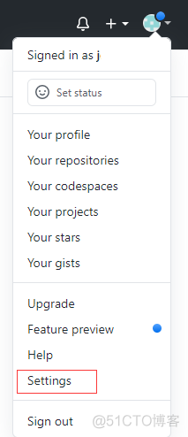
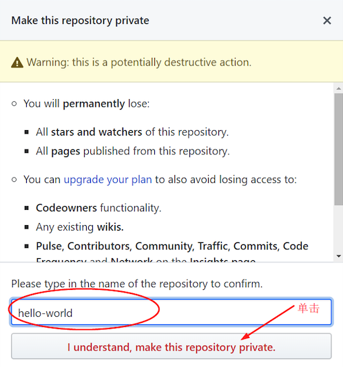
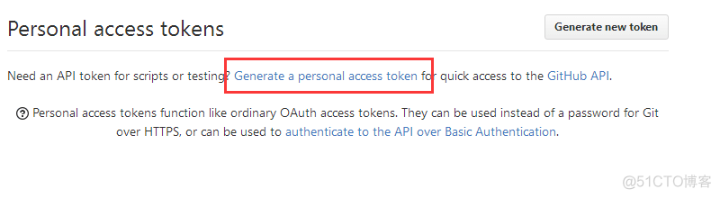
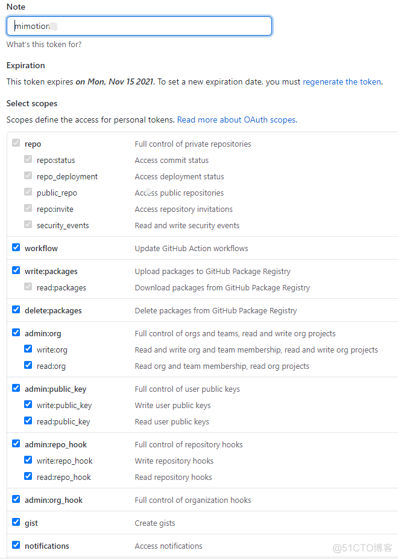

## 1. `GitHub` 私有仓库 & 公有仓库

2019 年 1 月 7 日，`GitHub CEO Nat Friedman` 于官方博客公开发文，称 "`New year, new GitHub`"，宣布从此将免费无限地为普通用户提供私有仓库服务。

因此，我们可以将之前创建的公开仓库更改为私有的，步骤如下：

1. 打开要设置的仓库，点击 `Settings`

    

2. 直接拖到最底下，可以看到 "`Make private`" 单击之后输入该仓库名称

    
    

以上操作针对的是自己创建的仓库，对于 `Fork` 别人的仓库，步骤如下：

1. 首先需要自己新建一个私有仓库，并且不能重名

    

2. 创建完成之后，最下方有个 `Import code` 点击

    

3. 然后输入要转换权限的仓库地址，最后点击 `Begin import` 等待导入完成即可（此时可以删除掉原来 `public` 权限的那个仓库）

    

## 2. `Git` 报错 "`Error: Key already in use`"

在创建了远程仓库后，想通过 `SSH` 链接 `clone` 仓库时，需要先添加 `SSH key` 时，但如果本机生成的 `SSH key` 在其他远程仓库中使用时，则会出现如下问题：

查阅官方文档，有这么一句话：

```:no-line-numbers
Error: Key already in use
This error occurs when you try to add a key that's already been added to another account or repository
```

这个错误原因是：该 `key` 被其他用户使用或被其他仓库使用。

也就是说，当创建了多个远程仓库时，本地与不同的远程仓库进行连接时使用的 `key` 是不一样的。

这个解释在官方文档中也找到了原话：

```:no-line-numbers
Once a key has been attached to one repository as a deploy key, it cannot be used on another repository. 
```

因此，可以先将 `SSH key` 从之前的远程仓库中移除，然后再添加到现在这个新创建的远程仓库中。

当然了，如果你想配置多个不同仓库的 `SSH key`，比如你想配置一个 `github` 上的，一个 `gitlab` 上的。你只需要再次用 `ssh-agent` 生成一个 `key`。

> 参考：[管理 git 生成的多个 ssh key](https://www.jianshu.com/p/f7f4142a1556)

## 3. 部分文字可点击 & 部分文字添加下划线 & 部分文字改变颜色

```java:no-line-numbers
/**
 * 用来格式化 TextView 的文本样式
 */
public class TextFormatBuilder {

    private SpannableStringBuilder spannableStringBuilder;
    private String text;

    public TextFormatBuilder(@NonNull String text) {
        spannableStringBuilder = new SpannableStringBuilder(text);
        this.text = text;
    }

    public TextFormatBuilder formatTextColor(@ColorInt int color, int start, int end) { // 部分文字改变颜色
        spannableStringBuilder.setSpan(new ForegroundColorSpan(color), start, end, Spannable.SPAN_EXCLUSIVE_INCLUSIVE);
        return this;
    }

    public TextFormatBuilder formatTextUnderline(int start, int end) { // 部分文字添加下划线
        spannableStringBuilder.setSpan(new UnderlineSpan(), start, end, Spannable.SPAN_EXCLUSIVE_INCLUSIVE);
        return this;
    }

    public TextFormatBuilder formatTextClickable(View.OnClickListener listener, int start, int end) { // 部分文字可点击
        spannableStringBuilder.setSpan(new Clickable(listener), start, end, Spannable.SPAN_EXCLUSIVE_INCLUSIVE);
        return this;
    }

    public SpannableStringBuilder complete() {
        return spannableStringBuilder;
    }

    /**
     * TextView 中部分文字可点击
     */
    private static class Clickable extends ClickableSpan {
        private final View.OnClickListener mListener;

        public Clickable(View.OnClickListener l) {
            mListener = l;
        }

        /**
         * 点击事件
         */
        @Override
        public void onClick(View v) {
            mListener.onClick(v);
            if (v instanceof TextView) {
                ((TextView)v).setHighlightColor(Color.TRANSPARENT);
            }
        }

        /**
         * 可以给TextView设置字体颜色,背景颜色等
         */
        @Override
        public void updateDrawState(TextPaint ds) {
        }
    }
}
```

```java:no-line-numbers
private static final String sClickableText = "Terms and conditions."; // 部分 可点击 & 颜色改变 & 加下划线 的文字

protected void initView(View view) {
    String strSummary = getString(R.string.str_pravicy_policy_summary); // 所有文字
    TextFormatBuilder builder = new TextFormatBuilder(strSummary);
    int start = strSummary.length() - sClickableText.length(); // 计算部分文字在所有文字中的起始索引
    int end = strSummary.length(); // 结束索引
    SpannableStringBuilder ssb = builder.formatTextColor(Color.parseColor("#5FEA89"), start, end) // 部分文字改变颜色
            .formatTextUnderline(start, end) // 部分文字加下划线
            .formatTextClickable(v -> { // 部分文字可点击
                ... // 点击时触发的代码
            }, start, end).complete();
    binding.tvPpSummary.setText(ssb); // 为 TextView 设置 Spannable 文本
    binding.tvPpSummary.setMovementMethod(LinkMovementMethod.getInstance()); // 必需加上这行，否则部分文字点击无效！
}
```

## 4. 代码实现 `ping` `IP` 地址

> 参考：[AndroidPing](https://github.com/dburckh/AndroidPing)

## 5. `item` 可折叠的 `RecyclerView`

> 参考：[BaseRecyclerViewAdapterHelper-Expandable-Item](https://github.com/CymChad/BaseRecyclerViewAdapterHelper/wiki/Expandable-Item)
>
> 参考：[expandable-recycler-view](https://github.com/thoughtbot/expandable-recycler-view)

## 6. 星级评分控件

> 参考：[AndRatingBar](https://github.com/wdsqjq/AndRatingBar)

## 7. `Android` 工具类集合开源项目

> 参考：[AndroidUtilCode](https://github.com/Blankj/AndroidUtilCode)

## 8. `Android 10` 报错 `AtomicFileUtils: readFileLines file not exist`

如果当前版本是 `Android 10` 的话，`Android` 应用程序获得读写存储卡权限的情况下，需要在 `AndroidManifest.xml` 的 `application` 标签下声明

```xml:no-line-numbers
android:requestLegacyExternalStorage="true"
```

## 9. 判断 `Activity` 是否销毁的代码优化

```java:no-line-numbers
if (activity == null) {
    return true;
}

boolean isDestroyed = false;

if (Build.VERSION.SDK_INT >= Build.VERSION_CODES.JELLY_BEAN_MR1) {
    isDestroyed = activity.isDestroyed();
}

return isDestroyed || activity.isFinishing();
```
