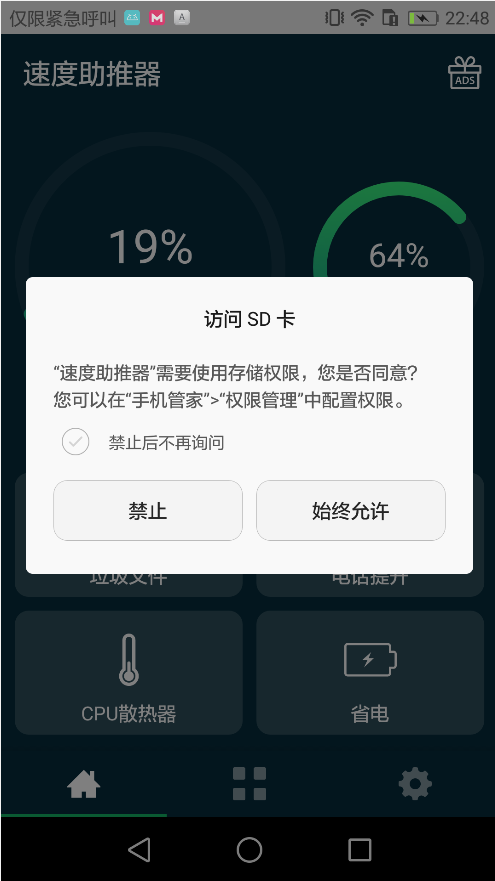
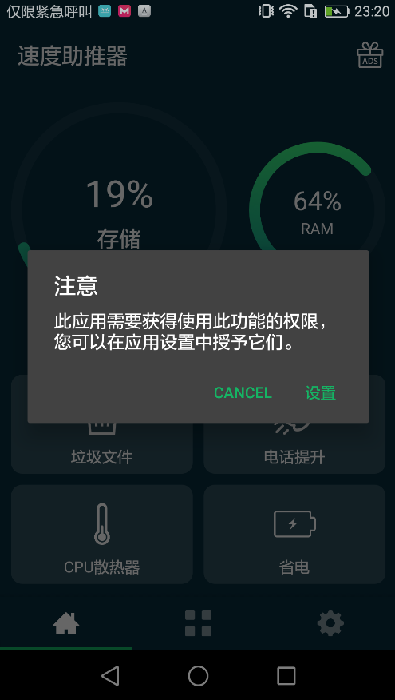
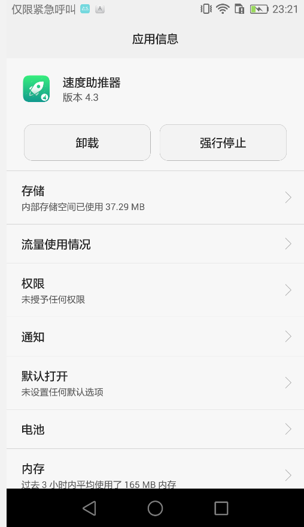
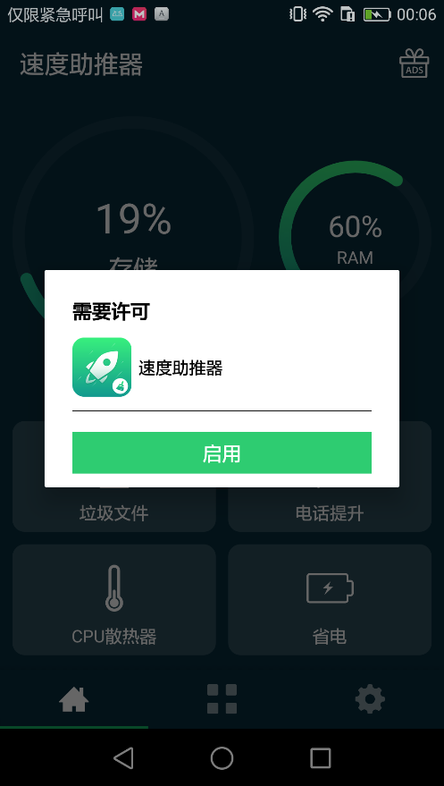
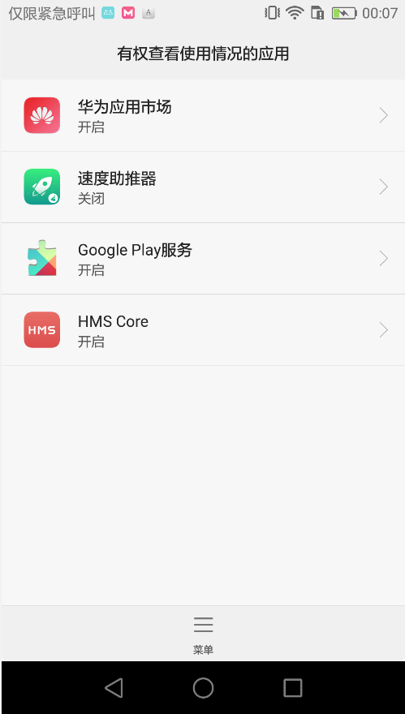
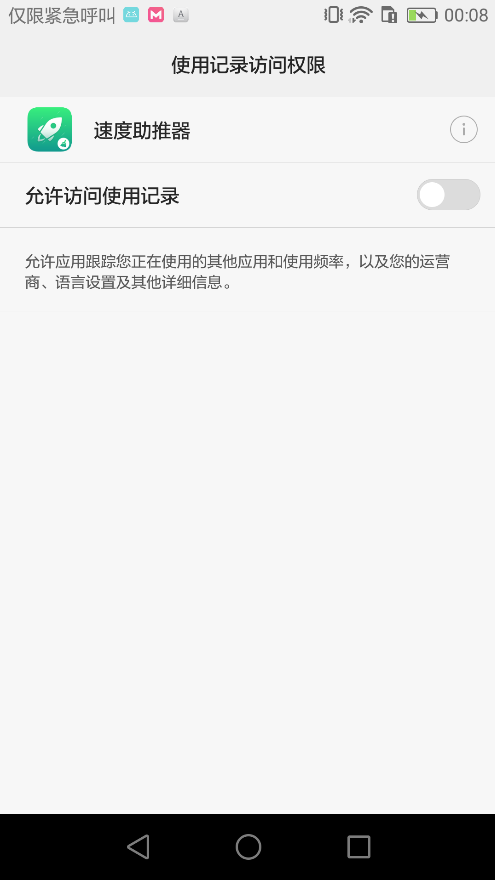
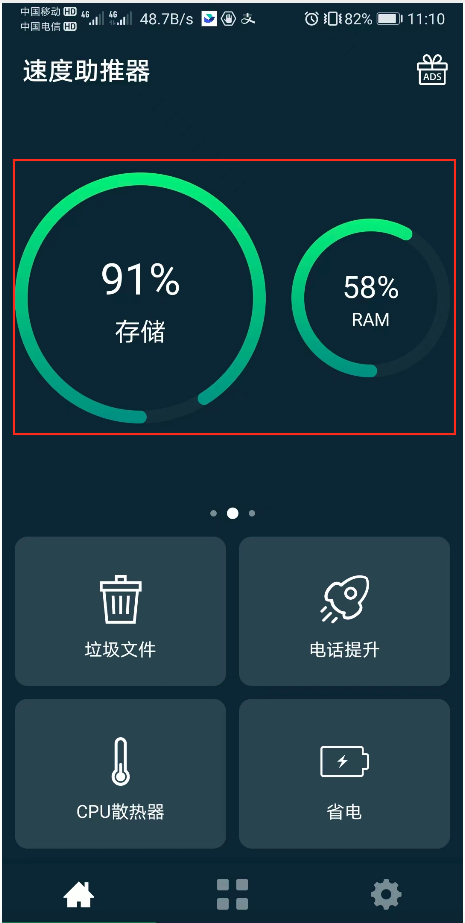
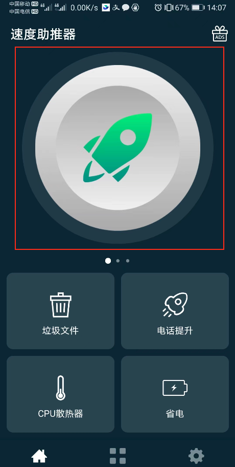
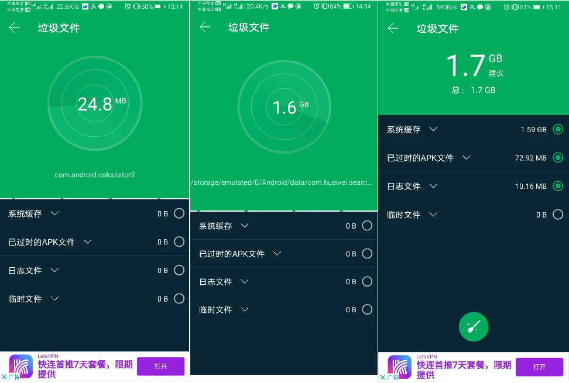

## 1. 架构

```:no-line-numbers
MainActivity

-- MainFragment（ViewPager）

---- HomeFragment
------ ViewPager
-------- BoostTabFragment
-------- StorageAndRamTabFragment
-------- AdsTabFragment
------ CleanJunkFragment // 垃圾文件
------ PhoneBoostFragment // 电话提升（手机加速的意思）
------ CpuCoolerFragment // CPU 散热器
------ BatterySaverFragment // 省电

---- ToolsFragment

---- SettingFragment
```

## 2. 申请的权限

> 参考：[Manifest.permission](https://developer.android.google.cn/reference/android/Manifest.permission?hl=en)

```xml:no-line-numbers
<!-- Protection level: normal -->
<uses-permission android:name="android.permission.ACCESS_NETWORK_STATE"/>

<!-- Protection level: normal -->
<uses-permission android:name="android.permission.INTERNET"/>

<!-- Protection level: dangerous -->
<!-- Any app that declares the WRITE_EXTERNAL_STORAGE permission is implicitly granted this permission. -->
<!-- Also starting in API level 19, this permission is not required to read/write files  -->
<!-- in your application-specific directories returned by Context.getExternalFilesDir(String) and Context.getExternalCacheDir(). -->
<uses-permission android:name="android.permission.READ_EXTERNAL_STORAGE"/>

<!-- Protection level: normal -->
<!-- Allows an app to use fingerprint hardware. -->
<!-- This constant was deprecated in API level 28. -->
<!-- Applications should request USE_BIOMETRIC instead -->
<uses-permission android:name="android.permission.USE_FINGERPRINT"/>

<!-- Protection level: normal -->
<!-- Allows access to the vibrator. -->
<uses-permission android:name="android.permission.VIBRATE"/>

<!-- Protection level: dangerous -->
<!-- Starting in API level 19, this permission is not required to read/write files -->
<!-- in your application-specific directories returned by Context.getExternalFilesDir(String) and Context.getExternalCacheDir(). -->
<uses-permission android:name="android.permission.WRITE_EXTERNAL_STORAGE"/>

<!-- Protection level: signature|privileged -->
<!-- Allows an application to clear the caches of all installed applications on the device. -->
<uses-permission android:name="android.permission.CLEAR_APP_CACHE"/> 

<!-- Protection level: normal -->
<!-- Allows an application to find out the space used by any package. -->
<uses-permission android:name="android.permission.GET_PACKAGE_SIZE"/>

<!-- Protection level: normal -->
<!-- Allows an application to call ActivityManager.killBackgroundProcesses(String). -->
<uses-permission android:name="android.permission.KILL_BACKGROUND_PROCESSES"/>

<!-- Protection level: signature|privileged|development|appop|retailDemo -->
<!-- Allows an application to collect component usage statistics -->
<!-- Declaring the permission implies intention to use the API and the user of the device can grant permission through the Settings application. -->
<uses-permission android:name="android.permission.PACKAGE_USAGE_STATS"/>

<!-- Protection level: normal -->
<!-- Allows an application to receive the Intent.ACTION_BOOT_COMPLETED that is broadcast after the system finishes booting.  -->
<!-- If you don't request this permission, you will not receive the broadcast at that time.  -->
<uses-permission android:name="android.permission.RECEIVE_BOOT_COMPLETED"/>

<!-- Allows mounting and unmounting file systems for removable storage. -->
<!-- Not for use by third-party applications. -->
<uses-permission android:name="android.permission.MOUNT_UNMOUNT_FILESYSTEMS"/>

<!-- This constant was deprecated in API level 21. -->
<!-- No longer enforced. -->
<uses-permission android:name="android.permission.GET_TASKS"/>

<!-- Protection level: signature|setup|appop|installer|pre23|development -->
<!-- Allows an app to create windows using the type WindowManager.LayoutParams.TYPE_APPLICATION_OVERLAY, shown on top of all other apps.  -->
<!-- Very few apps should use this permission; these windows are intended for system-level interaction with the user. -->
<!-- If the app targets API level 23 or higher, the app user must explicitly grant this permission to the app through a permission management screen.  -->
<!-- The app requests the user's approval by sending an intent with action Settings.ACTION_MANAGE_OVERLAY_PERMISSION.  -->
<!-- The app can check whether it has this authorization by calling Settings.canDrawOverlays(). -->
<uses-permission android:name="android.permission.SYSTEM_ALERT_WINDOW"/>

<!-- 未找到该权限 -->
<uses-permission android:name="android.permission.SYSTEM_OVERLAY_WINDOW"/>

<!-- Don't use this permission in your app. -->
<!-- This permission is no longer supported. -->
<uses-permission android:name="com.android.launcher.permission.UNINSTALL_SHORTCUT"/>

<!-- Protection level: normal -->
<!-- Allows an application to install a shortcut in Launcher. -->
<uses-permission android:name="com.android.launcher.permission.INSTALL_SHORTCUT"/>

<!-- Protection level: normal -->
<!-- Allows a regular application to use Service.startForeground. -->
<uses-permission android:name="android.permission.FOREGROUND_SERVICE"/>

<!-- Protection level: normal -->
<!-- Allows an application to request deleting packages.  -->
<!-- Apps targeting APIs Build.VERSION_CODES.P or greater must hold this permission -->
<!-- in order to use Intent.ACTION_UNINSTALL_PACKAGE or PackageInstaller.uninstall(VersionedPackage, IntentSender). -->
<uses-permission android:name="android.permission.REQUEST_DELETE_PACKAGES"/>

<!-- Protection level: normal -->
<!-- Allows using PowerManager WakeLocks to keep processor from sleeping or screen from dimming. -->
<uses-permission android:name="android.permission.WAKE_LOCK"/>
```

## 3. 使用到的开源项目

```:no-line-numbers
1. https://github.com/deano2390/MaterialShowcaseView  // 引导

2. https://github.com/Karumi/Dexter  // 权限请求

3. https://github.com/h6ah4i/android-advancedrecyclerview  // item 可折叠的 RecyclerView
```

## 4. `HomeFragment`

四个选项的点击事件：

```java:no-line-numbers
/* HomeFragment_ViewBinding.java */
private View f4314c;
private View f4315d;
private View f4316e;
private View f;
public HomeFragment_ViewBinding(HomeFragment homeFragment, View view) {
    this.f4313b = homeFragment;
    homeFragment.mViewPager = (ViewPager) g.c(view, R.id.view_pager, "field 'mViewPager'", ViewPager.class);
    homeFragment.mPageIndicator = (CircleIndicator) g.c(view, R.id.page_indicator, "field 'mPageIndicator'", CircleIndicator.class);
    View a2 = g.a(view, (int) R.id.feature_junk_files, "method 'doJunkFiles'");
    this.f4314c = a2;
    a2.setOnClickListener(new a(homeFragment));
    View a3 = g.a(view, (int) R.id.feature_phone_boost, "method 'doPhoneBoost'");
    this.f4315d = a3;
    a3.setOnClickListener(new b(homeFragment));
    View a4 = g.a(view, (int) R.id.feature_battery_saver, "method 'doBatterySaver'");
    this.f4316e = a4;
    a4.setOnClickListener(new c(homeFragment));
    View a5 = g.a(view, (int) R.id.feature_cpu_cooler, "method 'doCpuCooler'");
    this.f = a5;
    a5.setOnClickListener(new d(homeFragment));
}
```

```java:no-line-numbers
/* HomeFragment_ViewBinding.java */
class a extends butterknife.c.c {
    final /* synthetic */ HomeFragment f;

    a(HomeFragment homeFragment) {
        this.f = homeFragment;
    }

    public void a(View view) {
        this.f.doJunkFiles();
    }
}

class b extends butterknife.c.c {
    final /* synthetic */ HomeFragment f;

    b(HomeFragment homeFragment) {
        this.f = homeFragment;
    }

    public void a(View view) {
        this.f.doPhoneBoost();
    }
}

class c extends butterknife.c.c {
    final /* synthetic */ HomeFragment f;

    c(HomeFragment homeFragment) {
        this.f = homeFragment;
    }

    public void a(View view) {
        this.f.doBatterySaver();
    }
}

class d extends butterknife.c.c {
    final /* synthetic */ HomeFragment f;
    
    d(HomeFragment homeFragment) {
        this.f = homeFragment;
    }

    public void a(View view) {
        this.f.doCpuCooler();
    }
}
```

### 4.1 点击垃圾文件

```java:no-line-numbers
/* HomeFragment.java */
@OnClick({2131296516})
public void doJunkFiles() { // 点击 垃圾文件
    String str = "android.permission.READ_EXTERNAL_STORAGE";
    String str2 = "android.permission.WRITE_EXTERNAL_STORAGE";
    if (a((Context) requireActivity(), str, str2)) { // 当申请到了读写权限时才执行 if 语句中的代码
        if (s()) {
            b(new CleanJunkFragment());
        } else {
            u();
        }
        return;
    }

    // 申请读写权限
    Dexter.withContext(requireActivity()).withPermissions(str, str2).withListener(new b()).check();
}
```

```java:no-line-numbers
/* HomeFragment.java */
private boolean a(@h0 Context context, @h0 @q0(min = 1) String... strArr) { // 遍历数组中的权限是否已申请到了
    if (VERSION.SDK_INT < 23) {
        return true;
    }
    for (String a2 : strArr) {
        if (androidx.core.content.c.a(context, a2) != 0) {
            return false;
        }
    }
    return true;
}

/* androidx.core.content.c.java */
public static int a(@h0 Context context, @h0 String str) { // 判断权限 str 是否已申请到
    if (str != null) {
        return context.checkPermission(str, Process.myPid(), Process.myUid());
    }
    throw new IllegalArgumentException("permission is null");
}
```

```java:no-line-numbers
/* HomeFragment.java */
class b extends BaseMultiplePermissionsListener {
    b() {
    }

    public void onPermissionRationaleShouldBeShown(List<PermissionRequest> list, PermissionToken permissionToken) {
        super.onPermissionRationaleShouldBeShown(list, permissionToken);
        permissionToken.continuePermissionRequest();
    }

    public void onPermissionsChecked(MultiplePermissionsReport multiplePermissionsReport) { // 权限弹框中点击 "禁止" 或 "始终允许" 后返回
        super.onPermissionsChecked(multiplePermissionsReport);
        if (!multiplePermissionsReport.areAllPermissionsGranted()) { // 点击禁止时走 if 语句
            n0.a((Activity) HomeFragment.this.requireActivity(), 11, (OnClickListener) l0.f4375d); // 弹框提示用户去设置中开启权限
        } else if (HomeFragment.this.s()) { // 点击始终允许后，再判断 s()
            HomeFragment.this.requireActivity().o().b().b(R.id.main_layout, new CleanJunkFragment()).a("CleanJunkFragment").g(); // 显示 CleanJunkFragment
        } else {
            HomeFragment.this.u();
        }
    }
}

/* BaseMultiplePermissionsListener.java */
import com.karumi.dexter.MultiplePermissionsReport;
import com.karumi.dexter.PermissionToken;
import com.karumi.dexter.listener.PermissionRequest;
public class BaseMultiplePermissionsListener implements MultiplePermissionsListener {
    public void onPermissionRationaleShouldBeShown(List<PermissionRequest> list, PermissionToken permissionToken) {
        permissionToken.continuePermissionRequest();
    }

    public void onPermissionsChecked(MultiplePermissionsReport multiplePermissionsReport) {
    }
}
```

```java:no-line-numbers
/* com.bsoft.core.n0.java */
public static void a(Activity activity, int i, DialogInterface.OnClickListener onClickListener) {
    a(activity, -1, i, onClickListener);
}

public static void a(Activity activity, int i, int i2, DialogInterface.OnClickListener onClickListener) {
    a aVar; // Dialog 弹框
    if (i == -1) {
        aVar = new a(activity);
    } else {
        aVar = new a(activity, i);
    }
    aVar.d(n.title_need_permissions); // 注意
    aVar.c(n.msg_need_permission); // 此应用需要获得使用此功能的权限，您可以在应用设置中授予它们。
    aVar.d(n.goto_settings, new g(activity, i2)); // 设置
    aVar.b(17039360, onClickListener);
    aVar.a(false);
    aVar.c();
}

/* com.bsoft.core.g.java */
public final class g implements OnClickListener {

    public g(Activity activity, int i) {
        this.f4649d = activity;
        this.f4650e = i;
    }

    public final void onClick(DialogInterface dialogInterface, int i) {
        n0.a(this.f4649d, this.f4650e);
    }
}

/* com.bsoft.core.n0.java */
public static void a(Activity activity, int i) {
    Intent intent = new Intent("android.settings.APPLICATION_DETAILS_SETTINGS"); // 跳转到开启权限的页面
    intent.setData(Uri.fromParts("package", activity.getPackageName(), null));
    activity.startActivityForResult(intent, i);
}
```

```java:no-line-numbers
/* HomeFragment.java */
public boolean s() {
    if (VERSION.SDK_INT < 21) { // API 21 是 Android 5.0
        return true;
    }
    boolean z = false;
    try {
        PackageManager packageManager = requireActivity().getPackageManager();
        if (packageManager != null) {
            ApplicationInfo applicationInfo = packageManager.getApplicationInfo(requireActivity().getPackageName(), 0);
            // "appops" => Context.APP_OPS_SERVICE
            // "android:get_usage_stats" => AppOpsManager.OPSTR_GET_USAGE_STATS
            // 调用 AppOpsManager 的 checkOpNoThrow 方法检查 app 是否可以访问  UsageStatsManager
            // 访问  UsageStatsManager 需要在 AndroidManifest.xml 中添加 "android.permission.PACKAGE_USAGE_STATS" 权限（该权限不需要动态申请）
            if (((AppOpsManager) requireActivity().getSystemService("appops")).checkOpNoThrow("android:get_usage_stats", applicationInfo.uid, applicationInfo.packageName) == 0) {
                z = true;
            }
        }
    } catch (NameNotFoundException unused) {
    }
    return z;
}
```

```java:no-line-numbers
/* com.bsoft.cleanmaster.fragment.n1.java */
public void b(Fragment fragment) { // 将 fragment 添加到 View 容器（R.id.main_layout）中
    requireActivity().o().b().b(R.id.main_layout, fragment).a(fragment.getClass().getSimpleName()).f();
}
```

```java:no-line-numbers
/* HomeFragment.java */
public void u() { // 如果还没有允许用户访问 UsageStatsManager（即 s() 方法返回 false），则走这里，弹窗提示用户去开启访问权限
    androidx.appcompat.app.c.a aVar = new androidx.appcompat.app.c.a(this.f4384d, R.style.AlertDialogTheme);
    StringBuilder sb = new StringBuilder();
    sb.append(getString(R.string.for_android_5));
    sb.append(getString(R.string.request_permit_usage));
    // sb.toString() =>  适用于Android 5.0或以上，您必须允许使用速度助推器的使用权限，以便您可以使用此功能。

    // R.string.permit 允许
    aVar.a((CharSequence) sb.toString()).a(false).c((CharSequence) getString(R.string.permit), (OnClickListener) new m0(this)).b(17039360, (OnClickListener) k0.f4372d).c();
}
```

```java:no-line-numbers
/* com.bsoft.cleanmaster.fragment.m0.java */
public final class m0 implements OnClickListener {

    private final HomeFragment f4378d;

    public m0(HomeFragment homeFragment) {
        this.f4378d = homeFragment;
    }

    public final void onClick(DialogInterface dialogInterface, int i) {
        this.f4378d.a(dialogInterface, i);
    }
}

/* HomeFragment.java */
public void a(DialogInterface dialogInterface, int i) {
    j o = requireActivity().o();
    com.bsoft.cleanmaster.c.a aVar = new com.bsoft.cleanmaster.c.a();
    aVar.a(false);
    aVar.a(o, com.bsoft.cleanmaster.c.a.class.getSimpleName());
    dialogInterface.dismiss();
}


/* com.bsoft.cleanmaster.c.a.java */
public class a extends b implements OnClickListener { // a 应该是一个 DialogFragment，是 "需要许可" 的弹框
    private static final int A = 303;

    private void a(View view) {
    }

    private void b(View view) {
        view.findViewById(R.id.btn_enable).setOnClickListener(this);
    }

    private void c(View view) {
        a(view);
        b(view);
    }

    private void u() {
        if (VERSION.SDK_INT >= 23 && Settings.canDrawOverlays(getContext())) {
            getContext().startService(new Intent(getContext(), GuideUsageAccess.class));
        }
    }

    private void v() {
        n();
    }

    public void onActivityResult(int i, int i2, Intent intent) {
        super.onActivityResult(i, i2, intent);
        if (i == A) {
            v();
        }
    }

    public void onClick(View view) {
        if (view.getId() == R.id.btn_enable) {
            startActivityForResult(new Intent("android.settings.USAGE_ACCESS_SETTINGS"), A); // 点击启用后跳转的界面
            u();
        }
    }

    public View onCreateView(@h0 LayoutInflater layoutInflater, ViewGroup viewGroup, Bundle bundle) {
        return layoutInflater.inflate(R.layout.fragment_dialog_permission_usage, viewGroup, false);
    }

    public void onViewCreated(@h0 View view, @i0 Bundle bundle) {
        super.onViewCreated(view, bundle);
        p().requestWindowFeature(1);
        c(view);
    }
}
```

#### 4.1.1 申请读写权限时的弹框

1. 请求时的弹框

    

2. 点击禁止时的弹框

    

3. 点击设置时跳转到开启权限的页面

    

#### 4.1.2 申请访问 `UsageStatsManager` 的弹框（执行 `HomeFragment` 中的 `u()` 方法）

1. 需要许可的弹框

    

2. 点击启用按钮后的界面

    

3. 点击速度助推器项后的界面

    

### 4.2 点击电话提升（手机加速）

```java:no-line-numbers
/* HomeFragment.java */
@OnClick({2131296517})
public void doPhoneBoost() { // 点击 电话提升（手机加速）
    if (s()) {
        b(new PhoneBoostFragment());
    } else {
        u();
    }
}
```

### 4.3 点击 `CPU` 散热器 

```java:no-line-numbers
/* HomeFragment.java */
@OnClick({2131296515})
public void doCpuCooler() {
    if (s()) {
        a((Fragment) new CpuCoolerFragment());
    } else {
        u();
    }
}
```

```java:no-line-numbers
/* com.bsoft.cleanmaster.fragment.n1.java */
public void a(Fragment fragment) { // 将 fragment 添加到 View 容器（R.id.main_layout）中
    requireActivity().o().b().a(R.id.main_layout, fragment).a(fragment.getClass().getSimpleName()).f();
}
```

### 4.4 点击省电

```java:no-line-numbers
/* HomeFragment.java */
@OnClick({2131296514})
public void doBatterySaver() {
    if (s()) {
        a((Fragment) new BatterySaverFragment());
    } else {
        u();
    }
}
```

## 5. `StorageAndRamTabFragment`

```java:no-line-numbers
/* StorageAndRamTabFragment.java */
public void r() {
    long d2 = com.bsoft.cleanmaster.util.g.d(getContext()); // 总内存
    long c2 = com.bsoft.cleanmaster.util.g.c(getContext()); // 可用内存

    // m.f4931e = "optimize_phone_boost"
    if (com.bsoft.cleanmaster.util.l.b(getContext(), com.bsoft.cleanmaster.util.m.f4931e)) { // 判断上次进行手机加速的时间到现在是否在 3min 之内
        c2 += com.bsoft.cleanmaster.util.l.c(getContext()); // 如果上次在 3min 内进行了手机加速，则可用内存加上上次手机加速时释放的内存大小
    }
    double d3 = d2 - c2; // 已使用内存 = 总内存 - 可用内存
    Double.isNaN(d3);
    double d4 = d2;
    Double.isNaN(d4);
    int round = (int) Math.round((d3 * 100.0d) / d4); // 可用内存占总内存的百分比
    if (round < 25) {
        round = (int) ((Math.random() * 25.0d) + 25.0d); // 作假！当可用内存小于 25% 时，取[25%, 50%]范围内的值作为可用内存的百分比
    }
    ValueAnimator ofInt = ValueAnimator.ofInt(0, round); // 以可用内存百分比 为圆形进度条设置动画
    ofInt.setDuration(1000L);
    ofInt.addUpdateListener(new ValueAnimator.AnimatorUpdateListener() { // from class: com.bsoft.cleanmaster.fragment.g1
        @Override // android.animation.ValueAnimator.AnimatorUpdateListener
        public final void onAnimationUpdate(ValueAnimator valueAnimator) {
            StorageAndRamTabFragment.this.a(valueAnimator); // 设置 RAM 的圆形进度条
        }
    });
    ofInt.start();
    long e2 = com.bsoft.cleanmaster.util.g.e() + com.bsoft.cleanmaster.util.g.d(); // 内部存储 + 外部存储 的总容量
    double c3 = e2 - (com.bsoft.cleanmaster.util.g.c() + com.bsoft.cleanmaster.util.g.b()); // 已使用容量 = 总容量 - （内部存储 + 外部存储 的可用容量）
    Double.isNaN(c3);
    double d5 = e2;
    Double.isNaN(d5);
    ValueAnimator ofInt2 = ValueAnimator.ofInt(0, (int) Math.round((c3 * 100.0d) / d5)); // 已使用容量占总容量的百分比
    ofInt2.setDuration(1000L);
    ofInt2.addUpdateListener(new ValueAnimator.AnimatorUpdateListener() { // from class: com.bsoft.cleanmaster.fragment.h1
        @Override // android.animation.ValueAnimator.AnimatorUpdateListener
        public final void onAnimationUpdate(ValueAnimator valueAnimator) {
            StorageAndRamTabFragment.this.b(valueAnimator); // 设置 存储 的圆形进度条
        }
    });
    ofInt2.start();
}

public /* synthetic */ void a(ValueAnimator valueAnimator) {
    this.ramProgress.setProgress(((Integer) valueAnimator.getAnimatedValue()).intValue());
    TextView textView = this.textRamPer;
    textView.setText(valueAnimator.getAnimatedValue() + "%");
}

public /* synthetic */ void b(ValueAnimator valueAnimator) {
    this.storageProgress.setProgress(((Integer) valueAnimator.getAnimatedValue()).intValue());
    TextView textView = this.textStoragePer;
    textView.setText(valueAnimator.getAnimatedValue() + "%");
}
```

### 5.1 `RAM` 内存百分比

```java:no-line-numbers
/* com.bsoft.cleanmaster.util.g.java */
public static long d(Context context) {
    ActivityManager.MemoryInfo memoryInfo = new ActivityManager.MemoryInfo();
    ((ActivityManager) context.getSystemService("activity")).getMemoryInfo(memoryInfo);
    return memoryInfo.totalMem; // 总内存
}

public static long c(Context context) {
    ActivityManager.MemoryInfo memoryInfo = new ActivityManager.MemoryInfo();
    ((ActivityManager) context.getSystemService("activity")).getMemoryInfo(memoryInfo);
    return memoryInfo.availMem; // 可用内存
}
```

```java:no-line-numbers
/* com.bsoft.cleanmaster.util.l.java */
public static boolean b(Context context, String str) {
    // 判断当前时间与 SP 中存储的 key 为 str 的时间是否小于 180000ms（即 3 min）
    // str 为 optimize_phone_boost 时表示上次手机加速的时间？
    return System.currentTimeMillis() - d(context).getLong(str, 0L) < m.s;
}

public static long c(Context context) { 
    return d(context).getLong(h.f4920e, 0L); // 获取 SP 中保存的上次进行 optimized_memory_size（内存优化） 时释放的内存大小
}
```

### 5.2 存储百分比

```java:no-line-numbers
/* com.bsoft.cleanmaster.util.g.java */
import android.os.StatFs;

public static long e() { // 内部 /data 中的总容量
    StatFs statFs = new StatFs(Environment.getDataDirectory().getPath());
    return statFs.getBlockCount() * statFs.getBlockSize();
}

public static long d() { // 外部 /sdcard 中的总容量
    if (a()) {
        StatFs statFs = new StatFs(Environment.getExternalStorageDirectory().getPath());
        return statFs.getBlockCount() * statFs.getBlockSize();
    }
    return 0L;
}

public static long c() { // 内部 /data 中的可用容量
    StatFs statFs = new StatFs(Environment.getDataDirectory().getPath());
    return statFs.getAvailableBlocks() * statFs.getBlockSize();
}

public static long b() { // 外部 /sdcard 中的可用容量
    if (a()) {
        StatFs statFs = new StatFs(Environment.getExternalStorageDirectory().getPath());
        return statFs.getAvailableBlocks() * statFs.getBlockSize();
    }
    return 0L;
}

private static boolean a() {
    return Environment.getExternalStorageState().equals("mounted"); // 外部 /sdcard 是否已挂载
}
```


### `UI` 



## 6. `BoostTabFragment`

```java:no-line-numbers
/* BoostTabFragment.java */
@OnClick({R.id.btn_boost})
public void doBoost() {
    if (r()) {
        // 当具有 访问 UsageStatsManager 的权限时，播放火箭向右上方飞出的动画，在动画播放完成后，显示 PhoneBoostFragment，也就是点击 电话提升 时显示的界面
        Animation loadAnimation = AnimationUtils.loadAnimation(getContext(), R.anim.rocket_translate2);
        loadAnimation.setAnimationListener(new a());
        this.imageRocket.startAnimation(loadAnimation);
        return;
    }
    s();
}

// 相当于 HomeFragment.java 中的 s() 方法，判断是否具有访问 UsageStatsManager 的权限
public boolean r() {
    if (Build.VERSION.SDK_INT >= 21) { // 当前版本 >= Android 5.0
        try {
            PackageManager packageManager = getActivity().getPackageManager();
            if (packageManager == null) {
                return false;
            }
            ApplicationInfo applicationInfo = packageManager.getApplicationInfo(getActivity().getPackageName(), 0);
            return ((AppOpsManager) getActivity().getSystemService("appops")).checkOpNoThrow("android:get_usage_stats", applicationInfo.uid, applicationInfo.packageName) == 0;
        } catch (PackageManager.NameNotFoundException unused) {
            return false;
        }
    }
    return true;
}

// 如果还没有允许用户访问 UsageStatsManager（即 r() 方法返回 false），则走这里，弹窗提示用户去开启访问权限
// 相当于 HomeFragment.java 中的 u() 方法
private void s() {
    c.a aVar = new c.a(this.f4719d, R.style.AlertDialogTheme);
    aVar.mo146a(getString(R.string.for_android_5) + getString(R.string.request_permit_usage)).mo148a(false).mo161c(getString(R.string.permit), new DialogInterface.OnClickListener() { // from class: com.bsoft.cleanmaster.fragment.j
        @Override // android.content.DialogInterface.OnClickListener
        public final void onClick(DialogInterface dialogInterface, int i) {
            BoostTabFragment.this.a(dialogInterface, i);
        }
    }).mo153b(17039360, k.f4706d).c();
}

class a implements Animation.AnimationListener {

    @Override
    public void onAnimationEnd(Animation animation) { // 动画结束后显示 PhoneBoostFragment
        BoostTabFragment.this.getActivity().o().b().b(R.id.main_layout, new PhoneBoostFragment()).a((String) null).f();
    }
}
```

### `UI`



## 7. `CleanJunkFragment`

> 点击 `HomeFragment` 中的垃圾文件进入此界面

```java:no-line-numbers
/* CleanJunkFragment.java */
@Override // com.bsoft.cleanmaster.fragment.n1
protected void a(View view) {
    if (Build.VERSION.SDK_INT >= 21) {
        requireActivity().getWindow().setStatusBarColor(androidx.core.content.c.a(this.f4719d, (int) R.color.colorAccent));
    }
    this.mToolbar.setNavigationIcon(R.drawable.ic_back);
    this.mToolbar.setNavigationOnClickListener(new View.OnClickListener() { // from class: com.bsoft.cleanmaster.fragment.z
        @Override // android.view.View.OnClickListener
        public final void onClick(View view2) {
            CleanJunkFragment.this.b(view2);
        }
    });
    this.f4625e = AnimationUtils.loadAnimation(this.f4719d, R.anim.junk_scan); // 雷达扫描动画（在 CleanJunkService 的回调方法中开始动画）
    t();
    if (com.bsoft.cleanmaster.util.l.b(this.f4719d, com.bsoft.cleanmaster.util.m.f4930d)) {
        new Handler().postDelayed(new Runnable() { // from class: com.bsoft.cleanmaster.fragment.a0
            @Override // java.lang.Runnable
            public final void run() {
                CleanJunkFragment.this.r(); // 返回键回到 HomeFragment，解绑 CleanJunkService
            }
        }, 2000L);
        return;
    }
    this.g = new ArrayList();
    this.g.add(new com.bsoft.cleanmaster.i.e(1, getString(R.string.system_cache), false)); // 系统缓存
    this.g.add(new com.bsoft.cleanmaster.i.e(2, getString(R.string.apk_clean), false)); // 已过时的APK文件
    this.g.add(new com.bsoft.cleanmaster.i.e(4, getString(R.string.log_clean), false)); // 日志文件
    this.g.add(new com.bsoft.cleanmaster.i.e(3, getString(R.string.tmp_clean), false)); // 临时文件

    // RecyclerViewExpandableItemManager 来自开源项目 android-advancedrecyclerview，item可折叠的RecyclerView
    RecyclerViewExpandableItemManager recyclerViewExpandableItemManager = new RecyclerViewExpandableItemManager(null);
    this.h = new JunkAdapter(this.f4719d, recyclerViewExpandableItemManager, this.g);
    this.h.a(new b()); // 设置 JunkAdapter 的回调监听
    this.mRecyclerView.setLayoutManager(new LinearLayoutManager(this.f4719d));
    this.mRecyclerView.setAdapter(recyclerViewExpandableItemManager.a(this.h));
    ((androidx.recyclerview.widget.a0) this.mRecyclerView.getItemAnimator()).a(false);
    recyclerViewExpandableItemManager.a(this.mRecyclerView);
    Context context = this.f4719d;

    // 绑定 CleanJunkService 服务，this.j 为 ServiceConnection 对象
    context.bindService(new Intent(context, CleanJunkService.class), this.j, 1);
}
```

```java:no-line-numbers
/* CleanJunkFragment.java */
class b implements JunkAdapter.a { // JunkAdapter 的回调监听
    b() {
    }
    @Override // com.bsoft.cleanmaster.adapter.JunkAdapter.a
    public void a() {
        boolean z;
        Iterator it = CleanJunkFragment.this.g.iterator();
        while (true) {
            if (!it.hasNext()) {
                z = false;
                break;
            } else if (((com.bsoft.cleanmaster.i.e) it.next()).f4813e) {
                z = true;
                break;
            }
        }
        if (z) {
            CleanJunkFragment.this.btnClean.setVisibility(0);
        } else {
            CleanJunkFragment.this.btnClean.setVisibility(4);
        }
    }

    @Override // com.bsoft.cleanmaster.adapter.JunkAdapter.a
    @SuppressLint({"DefaultLocale"})
    public void a(long j, boolean z) { // 参数 j 表示扫描到（或已清理）的垃圾文件大小
        if (z) {
            CleanJunkFragment.this.k += j; // 扫描到的
        } else {
            CleanJunkFragment.this.k -= j; // 已清理的
        }

        // 对象 b2 中封装了扫描动的垃圾文件所占的内存大小，以及单位
        com.bsoft.cleanmaster.i.i b2 = com.bsoft.cleanmaster.util.n.b(CleanJunkFragment.this.k);
        // 设置扫描时，雷达扫描动画中的已扫描到（或已清理 ）的垃圾文件的实时大小
        CleanJunkFragment.this.textJunkSize.setText(String.format("%.1f", Float.valueOf(b2.f4822a)));
        CleanJunkFragment.this.textUnitSize.setText(b2.f4823b);
    }
}
```

```java:no-line-numbers
/* com.bsoft.cleanmaster.util.n.java */
public static com.bsoft.cleanmaster.i.i b(long j) {
    com.bsoft.cleanmaster.i.i iVar = new com.bsoft.cleanmaster.i.i();
    if (j >= 1073741824) {
        iVar.f4823b = "GB";
        iVar.f4822a = ((float) j) / ((float) 1073741824);
    } else if (j >= 1048576) {
        iVar.f4823b = "MB";
        iVar.f4822a = ((float) j) / ((float) 1048576);
    } else if (j >= 1024) {
        iVar.f4823b = "KB";
        iVar.f4822a = ((float) j) / ((float) 1024);
    } else {
        iVar.f4823b = "B";
        iVar.f4822a = (float) j;
    }
    return iVar;
}
```

```java:no-line-numbers
/* CleanJunkFragment.java */
private ServiceConnection j = new a();

class a implements ServiceConnection {
    a() {
    }

    @Override // android.content.ServiceConnection
    public void onServiceConnected(ComponentName componentName, IBinder iBinder) {
        CleanJunkFragment.this.f = ((CleanJunkService.c) iBinder).a(); // this.f 就是 CleanJunkService 对象
        CleanJunkFragment.this.f.a(CleanJunkFragment.this);
        CleanJunkFragment.this.f.b();
        CleanJunkFragment.this.i = true;
    }

    @Override // android.content.ServiceConnection
    public void onServiceDisconnected(ComponentName componentName) {
        CleanJunkFragment.this.f.a((CleanJunkService.d) null);
        CleanJunkFragment.this.f = null;
        CleanJunkFragment.this.i = false;
    }
}
```

```java:no-line-numbers
/* CleanJunkService.java */
public class c extends Binder {
    public c() {
    }

    public CleanJunkService a() {
        return CleanJunkService.this;
    }
}

public void a(d dVar) {
    this.f = dVar;
}

public interface d { // CleanJunkFragment 实现了 CleanJunkService 中的回调接口类 d
    void a(Context context);
    void a(Context context, long j);
    void a(Context context, String str, int i, String str2);
    void a(Context context, List<com.bsoft.cleanmaster.i.e> list);
    void b(Context context);
}
```

```java:no-line-numbers
/* CleanJunkService.java */
public void b() { // 在 CleanJunkFragment 中回调 onServiceConnected 方法时，会调用该方法
    new e().execute(new Void[0]); // 开始执行 AsyncTask 中的任务
}
```

```java:no-line-numbers
/* CleanJunkService.java */
// com.bsoft.cleanmaster.i.e 是扫描结果数据的实体类
private class e extends AsyncTask<Void, String, List<com.bsoft.cleanmaster.i.e>> {
    private List<com.bsoft.cleanmaster.i.e> f4848a;

    private int f4849b;

    private com.bsoft.cleanmaster.i.e f4850c;
    private com.bsoft.cleanmaster.i.e f4851d;
    private com.bsoft.cleanmaster.i.e f4852e;

    public class a extends IPackageStatsObserver.Stub {
        final /* synthetic */ List f4853d;
        final /* synthetic */ CountDownLatch f4854e;

        a(List list, CountDownLatch countDownLatch) {
            this.f4853d = list;
            this.f4854e = countDownLatch;
        }

        @Override // android.content.pm.IPackageStatsObserver
        public void onGetStatsCompleted(PackageStats packageStats, boolean z) {

            synchronized (this.f4853d) {
                String str = packageStats.packageName;
                if (!packageStats.packageName.equals(CleanJunkService.this.getPackageName()) && z && packageStats.cacheSize > 0) {
                    try {
                        this.f4853d.add(new com.bsoft.cleanmaster.i.f(e.a(e.this), str, CleanJunkService.this.getPackageManager().getApplicationLabel(CleanJunkService.this.getPackageManager().getApplicationInfo(str, 128)).toString(), CleanJunkService.this.getPackageManager().getApplicationIcon(str), packageStats.cacheSize));
                        CleanJunkService.this.h += packageStats.cacheSize;
                        CleanJunkService.this.g += packageStats.cacheSize;
                    } catch (PackageManager.NameNotFoundException e2) {
                        e2.printStackTrace();
                    }
                }
                e.this.publishProgress(str, String.valueOf(1), n.a(CleanJunkService.this.h)); // 版本 < 8.0 时在这里实时显示每个扫描到的 app 的缓存大小
            }

            synchronized (this.f4854e) {
                this.f4854e.countDown(); // 通过 CountDownLatch 进行计数，当每个扫描到的 app 都回调后，唤醒 CountDownLatch.await() 所在线程
            }
        }
    }

    private e() {
        this.f4848a = new ArrayList();
        this.f4849b = 0;
    }

    static /* synthetic */ int a(e eVar) {
        int i = eVar.f4849b;
        eVar.f4849b = i + 1;
        return i;
    }

    @Override // android.os.AsyncTask
    protected void onPreExecute() {
        this.f4850c = new com.bsoft.cleanmaster.i.e(2, CleanJunkService.this.getString(R.string.apk_clean)); // 已过时的APK文件
        this.f4851d = new com.bsoft.cleanmaster.i.e(4, CleanJunkService.this.getString(R.string.log_clean)); // 日志文件
        this.f4852e = new com.bsoft.cleanmaster.i.e(3, CleanJunkService.this.getString(R.string.tmp_clean)); // 临时文件
        if (CleanJunkService.this.f != null) {
            CleanJunkService.this.f.a(CleanJunkService.this); // 回调方法，传给 CleanJunkFragment
        }
    }

    @Override // android.os.AsyncTask
    public List<com.bsoft.cleanmaster.i.e> doInBackground(Void... voidArr) {
        CleanJunkService.this.g = 0L;
        CleanJunkService.this.h = 0L;
        Intent intent = new Intent("android.intent.action.MAIN", (Uri) null);
        intent.addCategory("android.intent.category.LAUNCHER");
        List<ResolveInfo> queryIntentActivities = CleanJunkService.this.getPackageManager().queryIntentActivities(intent, 0);
        CountDownLatch countDownLatch = new CountDownLatch(queryIntentActivities.size());
        ArrayList arrayList = new ArrayList();
        if (Build.VERSION.SDK_INT >= 26) { // 版本 >= Android 8.0
            for (ResolveInfo resolveInfo : queryIntentActivities) {
                String str = resolveInfo.activityInfo.packageName;
                if (!str.equals(CleanJunkService.this.getPackageName())) { // 过滤当前 app
                    try {
                        // 访问 StorageStatsManager 需要 "android.permission.PACKAGE_USAGE_STATS" 权限（不需要动态申请）
                        // "storagestats" => Context.STORAGE_STATS_SERVICE
                        StorageStats queryStatsForPackage = ((StorageStatsManager) CleanJunkService.this.getSystemService("storagestats")).queryStatsForPackage(StorageManager.UUID_DEFAULT, str, Process.myUserHandle());
                        int i = this.f4849b;
                        this.f4849b = i + 1;
                        // com.bsoft.cleanmaster.i.f 是系统缓存下的 app item 项的实体类
                        // 该实体类中封装了 (索引，包名，app名称，app图标，app的缓存大小)
                        arrayList.add(new com.bsoft.cleanmaster.i.f(i, str, CleanJunkService.this.getPackageManager().getApplicationLabel(CleanJunkService.this.getPackageManager().getApplicationInfo(str, 128)).toString(), CleanJunkService.this.getPackageManager().getApplicationIcon(str), queryStatsForPackage.getCacheBytes()));
                        CleanJunkService.this.h += queryStatsForPackage.getCacheBytes(); // 累计所有 app 的缓存大小，保存在 CleanJunkService.this.h 变量中
                        CleanJunkService.this.g += queryStatsForPackage.getCacheBytes(); // 累计所有 app 的缓存大小，保存在 CleanJunkService.this.g 变量中
                    } catch (PackageManager.NameNotFoundException e2) {
                        e2.printStackTrace();
                    } catch (IOException e3) {
                        e3.printStackTrace();
                    }

                    // 累计扫描到的缓存作为更新的进度，调用静态方法 n.a(CleanJunkService.this.h) 格式化显示 累计的缓存大小
                    publishProgress(str, String.valueOf(1), n.a(CleanJunkService.this.h));
                }
            }
        } else { // 版本 < Android 8.0 的扫描方式
            try {
                Iterator<ResolveInfo> it = queryIntentActivities.iterator();
                while (it.hasNext()) {
                    // CleanJunkService.this.f4841d 在 CleanJunkService 的 onCreate 方法中赋值，反射调用 PackageManager 的 getPackageSizeInfo 方法
                    // CleanJunkService.this.f4841d = getPackageManager().getClass().getMethod("getPackageSizeInfo", String.class, IPackageStatsObserver.class);
                    // new 出来的 a 继承自 IPackageStatsObserver.Stub
                    // 调用 getPackageSizeInfo 方法，通过 IPackageStatsObserver 的回调方法 onGetStatsCompleted 返回当前遍历的 app 的缓存大小
                    CleanJunkService.this.f4841d.invoke(CleanJunkService.this.getPackageManager(), it.next().activityInfo.packageName, new a(arrayList, countDownLatch));
                }
                countDownLatch.await(); // 等待 IPackageStatsObserver 中的 onGetStatsCompleted 方法对每个扫描到的 app 都回调之后再唤醒
            } catch (IllegalAccessException | InterruptedException | InvocationTargetException e4) {
                e4.printStackTrace();
            }
        }
        Collections.sort(arrayList); // arrayList 中存储 com.bsoft.cleanmaster.i.f 实体类对象，按照 app 的缓存大小，从大到小排序

        // this.f4848a 是返回给 CleanJunkFragment 的结果集，集合中保存 com.bsoft.cleanmaster.i.e 实体类
        // 封装 系统缓存 arrayList 到com.bsoft.cleanmaster.i.e 实体中，并将该封装了系统缓存的实体类对象添加到结果集
        this.f4848a.add(new com.bsoft.cleanmaster.i.e(1, CleanJunkService.this.getString(R.string.system_cache), CleanJunkService.this.a(), arrayList));

        // 从外部存储中扫描 已过时的APK文件、日志文件、临时文件
        File externalStorageDirectory = Environment.getExternalStorageDirectory();
        if (externalStorageDirectory != null) {
            a(externalStorageDirectory, 0);
        }
        this.f4848a.add(this.f4850c); // 将扫描到的已过时的APK文件 封装在 this.f4850c 对象中，并将该对象添加到结果集
        this.f4848a.add(this.f4851d); // 将扫描到的日志文件 封装在 this.f4851d 对象中，并将该对象添加到结果集
        this.f4848a.add(this.f4852e); // 将扫描到的临时文件 封装在 this.f4852e 对象中，并将该对象添加到结果集
        return this.f4848a;
    }

    @Override // android.os.AsyncTask
    public void onProgressUpdate(String... strArr) {
        if (CleanJunkService.this.f != null) {
            // 回调给 CleanJunkFragment，回调方法：a(上下文, 当前扫描到的包名, 固定值1, 扫描到的app的缓存大小)
            CleanJunkService.this.f.a(CleanJunkService.this, strArr[0], Integer.parseInt(strArr[1]), strArr[2]);
        }
    }

    @Override // android.os.AsyncTask
    public void onPostExecute(List<com.bsoft.cleanmaster.i.e> list) {
        if (CleanJunkService.this.f != null) {
            for (com.bsoft.cleanmaster.i.e eVar : list) {
                if (eVar.f4811c == 0) {
                    eVar.f4813e = false;
                }
            }
            CleanJunkService.this.f.a(CleanJunkService.this, list); // 将所有的扫描后的结果集返回给 CleanJunkFragment
        }
    }
    
    private void a(File file, int i) {
        File[] listFiles;
        if (file == null || !file.exists() || (listFiles = file.listFiles()) == null) {
            return;
        }
        for (File file2 : listFiles) {
            if (file2.isFile()) {
                String name = file2.getName();
                com.bsoft.cleanmaster.i.f fVar = null;
                if (name.endsWith(".apk")) { // 已过时的APK文件
                    int i2 = this.f4849b;
                    this.f4849b = i2 + 1;
                    fVar = new com.bsoft.cleanmaster.i.f(i2, 1, name, file2.getAbsolutePath(), file2.length()); // 封装当前遍历到的已过时的apk文件的信息
                    this.f4850c.f4812d.add(fVar); // 将当前遍历到的apk文件信息添加到结果集元素中的一个集合中
                    this.f4850c.f4811c += fVar.f; // 累计所有遍历到的apk文件的总大小
                    publishProgress(file2.getAbsolutePath(), String.valueOf(2), n.a(this.f4850c.f4811c)); // 实时更新 UI，显示当前的扫描信息
                } else if (name.endsWith(".log")) { // 日志文件
                    int i3 = this.f4849b;
                    this.f4849b = i3 + 1;
                    fVar = new com.bsoft.cleanmaster.i.f(i3, 3, name, file2.getAbsolutePath(), file2.length()); // 封装当前遍历到的日志文件的信息
                    this.f4851d.f4812d.add(fVar);
                    this.f4851d.f4811c += fVar.f; // 累计所有遍历到的日志文件的总大小
                    publishProgress(file2.getAbsolutePath(), String.valueOf(4), n.a(this.f4851d.f4811c + this.f4852e.f4811c)); // 实时更新 UI，显示当前的扫描信息
                } else if (name.endsWith(".tmp") || name.endsWith(".temp")) { // 临时文件
                    int i4 = this.f4849b;
                    this.f4849b = i4 + 1;
                    fVar = new com.bsoft.cleanmaster.i.f(i4, 2, name, file2.getAbsolutePath(), file2.length()); // 封装当前遍历到的临时文件的信息
                    this.f4852e.f4812d.add(fVar);
                    this.f4852e.f4811c += fVar.f; // 累计所有遍历到的apk文件的总大小
                    publishProgress(file2.getAbsolutePath(), String.valueOf(4), n.a(this.f4851d.f4811c + this.f4852e.f4811c)); // 实时更新 UI，显示当前的扫描信息
                }
                if (fVar != null) {
                    CleanJunkService.this.g += fVar.f; // 累计总的垃圾文件的大小（包括扫描到的所有app的缓存大小）
                }
            } else {
                a(file2, i + 1); // 递归遍历外部存储
            }
        }
    }
}
```

```java:no-line-numbers
/* CleanJunkFragment.java */
@Override // com.bsoft.cleanmaster.service.CleanJunkService.d
public void a(Context context) { // 在 CleanJunkService 中的 AsyncTask 的 onPreExecute() 方法中回调（AsyncTask 在 Service 绑定成功就开始执行了）
    this.imageScanning.startAnimation(this.f4625e); // 开始雷达扫描动画
}

@Override // com.bsoft.cleanmaster.service.CleanJunkService.d
@SuppressLint({"DefaultLocale"})
public void a(Context context, String str, int i, String str2) { // CleanJunkService 中 AsyncTask 每扫描到一个 app 调用一次
    this.textStatus.setText(str); // str 是当前扫描到的 app 包名
    CleanJunkService cleanJunkService = this.f;
    // cleanJunkService.a() 返回累计的缓存大小
    com.bsoft.cleanmaster.i.i b2 = com.bsoft.cleanmaster.util.n.b(cleanJunkService != null ? cleanJunkService.a() : 0L);
    this.textJunkSize.setText(String.format("%.1f", Float.valueOf(b2.f4822a))); // 实时更新已扫描到的累计的缓存大小
    this.textUnitSize.setText(b2.f4823b);
}

@Override // com.bsoft.cleanmaster.service.CleanJunkService.d
public void a(Context context, List<com.bsoft.cleanmaster.i.e> list) {
    a(list);
}

@Override // com.bsoft.cleanmaster.service.CleanJunkService.d
public void a(Context context, final long j) {
    Handler handler = new Handler();
    com.bsoft.cleanmaster.util.l.e(context, com.bsoft.cleanmaster.util.m.f4930d);
    handler.postDelayed(new Runnable() { // from class: com.bsoft.cleanmaster.fragment.y
        @Override // java.lang.Runnable
        public final void run() {
            CleanJunkFragment.this.a(j);
        }
    }, 1000L);
}

@Override // com.bsoft.cleanmaster.service.CleanJunkService.d
public void b(Context context) {
}
```

### 点击清理按钮

```java:no-line-numbers
/* CleanJunkFragment.java */
@OnClick({R.id.btn_clear})
public void doClearJunk() {
    if (Build.VERSION.SDK_INT >= 21) {
        requireActivity().getWindow().setStatusBarColor(androidx.core.content.c.a(this.f4719d, (int) R.color.colorPrimaryDark));
    }
    this.mToolbar.setBackgroundColor(androidx.core.content.c.a(this.f4719d, (int) R.color.colorPrimary));
    this.mConstraintLayout.findViewById(R.id.text_suggested).setVisibility(8);
    this.mConstraintLayout.findViewById(R.id.view).setVisibility(8);
    this.mRecyclerView.setVisibility(8);
    this.btnClean.setVisibility(8);
    CleanJunkService cleanJunkService = this.f;
    if (cleanJunkService != null && cleanJunkService.a() > 0) {
        androidx.constraintlayout.widget.d dVar = new androidx.constraintlayout.widget.d();
        dVar.a(this.f4719d, R.layout.fragment_junk_cleaning);
        AutoTransition autoTransition = new AutoTransition();
        autoTransition.mo100a((Transition.h) new d()); // 类 d 实现了过渡动画的监听器 TransitionListener
        androidx.transition.w.a(this.mConstraintLayout, autoTransition);
        dVar.b(this.mConstraintLayout);
        this.textStatus.setText(R.string.msg_cleaning);
        this.textStatus.setTextColor(androidx.core.content.c.a(this.f4719d, (int) R.color.white80));
        this.textJunkSize.setTextSize(0, getResources().getDimension(R.dimen.font_size_huge));
        this.textUnitSize.setTextSize(0, getResources().getDimension(R.dimen.font_size_large));
        this.textStatus.setTextSize(0, getResources().getDimension(R.dimen.font_size_standard));
        this.imageCleaning.startAnimation(AnimationUtils.loadAnimation(this.f4719d, R.anim.junk_clean));
        this.imageCleaning.setVisibility(0);
        return;
    }
    s();
}
```

```java:no-line-numbers
/* CleanJunkFragment.java */
class d implements Transition.h {
    d() {
    }

    @Override // androidx.transition.Transition.h
    public void a(@androidx.annotation.h0 Transition transition) {
    }

    @Override // androidx.transition.Transition.h
    public void b(@androidx.annotation.h0 Transition transition) {
    }

    @Override // androidx.transition.Transition.h
    public void c(@androidx.annotation.h0 Transition transition) {
        // CleanJunkFragment.this.f 是 CleanJunkService
        // CleanJunkFragment.this.g 是 CleanJunkService 返回给 CleanJunkFragment 的垃圾结果集（包括系统缓存，已过时的apk文件，日志文件，临时文件）
        CleanJunkFragment.this.f.a(CleanJunkFragment.this.g);
    }

    @Override // androidx.transition.Transition.h
    public void d(@androidx.annotation.h0 Transition transition) {
    }

    @Override // androidx.transition.Transition.h
    public void e(@androidx.annotation.h0 Transition transition) {
    }
}
```

```java:no-line-numbers
/* CleanJunkService.java */
public void a(List<com.bsoft.cleanmaster.i.e> list) { // 点击清理，开启 CleanJunkService 中的 AsyncTask 子类 b 
    new b(list).execute(new Void[0]);
}
```

```java:no-line-numbers
/* CleanJunkService.java */
private class b extends AsyncTask<Void, Void, Long> {

    private List<com.bsoft.cleanmaster.i.e> f4843a;

    public class a extends IPackageDataObserver.Stub {
        final /* synthetic */ CountDownLatch f4845d;

        a(CountDownLatch countDownLatch) {
            this.f4845d = countDownLatch;
        }

        @Override // android.content.pm.IPackageDataObserver
        public void onRemoveCompleted(String str, boolean z) {
            this.f4845d.countDown();
        }
    }

    b(List<com.bsoft.cleanmaster.i.e> list) {
        this.f4843a = list; // 扫描到的垃圾结果集（包括系统缓存，已过时的apk文件，日志文件，临时文件）
    }

    @Override // android.os.AsyncTask
    public Long doInBackground(Void... voidArr) {
        File[] listFiles;
        long j = CleanJunkService.this.h;
        CountDownLatch countDownLatch = new CountDownLatch(1);
        StatFs statFs = new StatFs(Environment.getDataDirectory().getAbsolutePath());

        try {
            if (Build.VERSION.SDK_INT < 23) { // 版本 < Android 6.0
                // this.f4842e 在 CleanJunkService 的 onCreate 方法中赋值
                // this.f4842e = getPackageManager().getClass().getMethod("freeStorageAndNotify", Long.TYPE, IPackageDataObserver.class);
                // Android 6.0 以下才可以反射调用 freeStorageAndNotify 清理 内部 /data 缓存下的 app 缓存文件
                CleanJunkService.this.f4842e.invoke(CleanJunkService.this.getPackageManager(), Long.valueOf(statFs.getBlockCount() * statFs.getBlockSize()), new a(countDownLatch));
            } else {
                countDownLatch.countDown();
            }

            // 清理外部存储中的 Android/data/<包名>/cache 路径下的 app 缓存
            File file = new File(Environment.getExternalStorageDirectory().getAbsolutePath() + "/Android/data");
            String str = file.getAbsolutePath() + "/%s/cache";
            if (file.isDirectory() && (listFiles = file.listFiles()) != null) {
                int length = listFiles.length;
                for (int i = 0; i < length; i++) {
                    a(new File(String.format(str, listFiles[i].getName())), true);
                }
            }
            countDownLatch.await();
        } catch (IllegalAccessException | InterruptedException | InvocationTargetException e2) {
            e2.printStackTrace();
        }

        for (int i2 = 1; i2 < this.f4843a.size(); i2++) {
            for (com.bsoft.cleanmaster.i.f fVar : this.f4843a.get(i2).f4812d) {
                int i3 = fVar.i;
                if (i3 == 1 || i3 == 2 || i3 == 3) {
                    File file2 = new File(fVar.h); // 当 fVar 中封装的是系统缓存时，fVar.h 没有赋值，因此这里清除的是 过时的apk文件，日志文件，临时文件。
                    if (fVar.o && file2.exists() && file2.delete()) {
                        j += fVar.f; // j 中之前只是累计了系统缓存的大小，这里将清除的 过时的apk文件，日志文件，临时文件 都累计进来了。
                    }
                }
            }
        }
        return Long.valueOf(j);
    }

    @Override // android.os.AsyncTask
    protected void onPreExecute() {
        if (CleanJunkService.this.f != null) {
            CleanJunkService.this.f.b(CleanJunkService.this);
        }
    }

    private boolean a(File file, boolean z) { // 递归遍历 file 文件夹下的文件并删除
        File[] listFiles;
        if (file == null || !file.exists()) {
            return true;
        }
        if (z && !file.isDirectory()) {
            return true;
        }
        if (file.isDirectory() && (listFiles = file.listFiles()) != null) {
            for (File file2 : listFiles) {
                if (!a(file2, false)) {
                    return false;
                }
            }
        }
        return file.delete();
    }

    @Override // android.os.AsyncTask
    /* renamed from: a */
    public void onPostExecute(Long l) {
        CleanJunkService.this.g = 0L;
        CleanJunkService.this.h = 0L;
        if (CleanJunkService.this.f != null) {
            CleanJunkService.this.f.a(CleanJunkService.this, l.longValue()); // 回调给 CleanJunkService， l 中保存了所有清理了的垃圾文件大小（包括app缓存大小）
        }
    }
}
```

```java:no-line-numbers
/* CleanJunkFragment.java */
@Override // com.bsoft.cleanmaster.service.CleanJunkService.d
public void a(Context context, final long j) { // CleanJunkService 中清理 AsyncTask 结束后的回调，参数 j 是已清理的垃圾文件总大小（包括app缓存大小）
    Handler handler = new Handler();
    com.bsoft.cleanmaster.util.l.e(context, com.bsoft.cleanmaster.util.m.f4930d); // 将清理完成的当前系统时间缓存在 SP 中（key 为 "optimize_junk_files"）
    handler.postDelayed(new Runnable() { // from class: com.bsoft.cleanmaster.fragment.y
        {
            CleanJunkFragment.this = this;
        }
        @Override // java.lang.Runnable
        public final void run() {
            CleanJunkFragment.this.a(j);
        }
    }, 1000L);
}

public /* synthetic */ void a(long j) {
    this.k = j; // this.k 是已清理的垃圾文件总大小（包括app缓存大小）
    s(); // 更新 UI
}
```

### `UI`



## 参考

[Android-读取已安装应用列表](https://www.jianshu.com/p/45e295e12bde)

[Android 读取已安装应用列表需要申请权限吗？](https://www.jianshu.com/p/dee8bc1fb847)

[Android 如何完整的获取到用户已安装应用列表](https://blog.csdn.net/q384415054/article/details/72972405)
