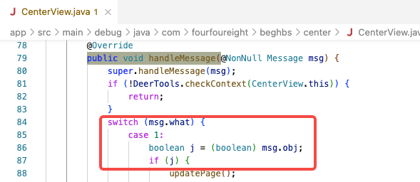
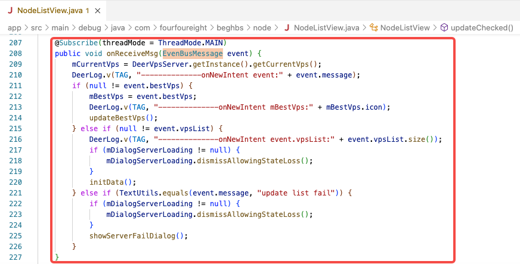
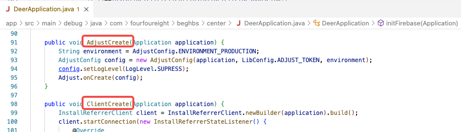
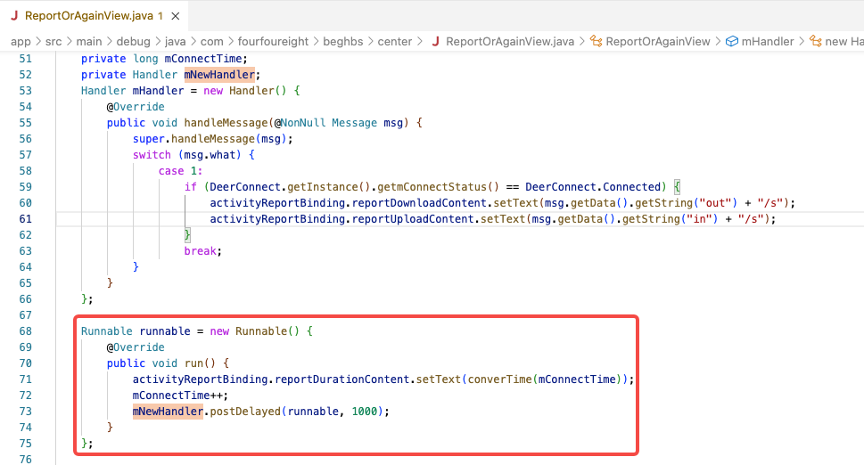

## 1. 代码结构和组织 
代码结构清晰，组织合理。界面与数据的处理基本分离。单个类的分工明确，未发现代码臃肿的情况。

## 2. 可读性和可维护性 
代码的可读性较高，关键代码注释清晰，程序结构的命名比较规范的，但还存在硬编码的情况。

## 3. 错误处理和异常处理 
代码中对于错误和异常的处理较为完善。对于可能出现的错误情况进行了合理的判断和处理，并且在必要的地方抛出了适当的异常。
但在多线程环境下，异步更新 `UI` 时，应该多考虑下界面的生命周期，以提高代码的健壮性和容错性。 

## 4. 性能和效率 
代码在性能和效率方面表现良好。但一些细节还可以做得更好，比如 `if-else` 条件语句中相同类型的赋值语句，可以共用同一个局部变量。
可以共用的类型不要多次 `new`，如 `Handler` 可以作为成员变量，不要局部 `new Handler`

## 5. 安全性 
代码在安全性方面没有明显的问题。测试环境中没有出现任何的正式环境配置。

## 6. 评审建议

**1. 尽量避免出现硬编码，变量名应起得有意义**

**2. 异步更新 `UI` 时，应该先判断 `Activity` 的生命周期是否已销毁**

> 采用 `EventBus`、`Handler` 等方式异步更新 `UI` 时，应该先判断 `Activity` 的生命周期是否已销毁。在销毁后，不应该再进行 `UI` 的更新。

**3. 非构造方法的方法名不建议以大写字母开头，建议采用下划线或小写字母开头**

**4. `Activity` 中的 `Handler` 用于延迟/定时任务时，应该保证在 `Activity` 销毁时也会被销毁掉，否则会出现内存泄露**

总体而言，评审人员对该代码的质量较为满意。代码结构清晰，组织合理，可读性和可维护性较高，错误处理和异常处理较为完善，性能和效率表现良好，安全性方面也没有明显的问题。评审人员建议在某些地方进行一些改进和优化，以进一步提高代码的质量和性能。 