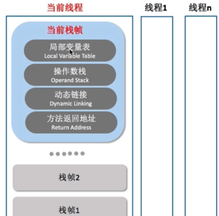
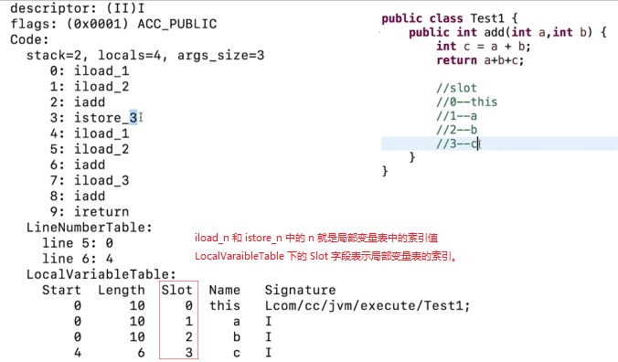
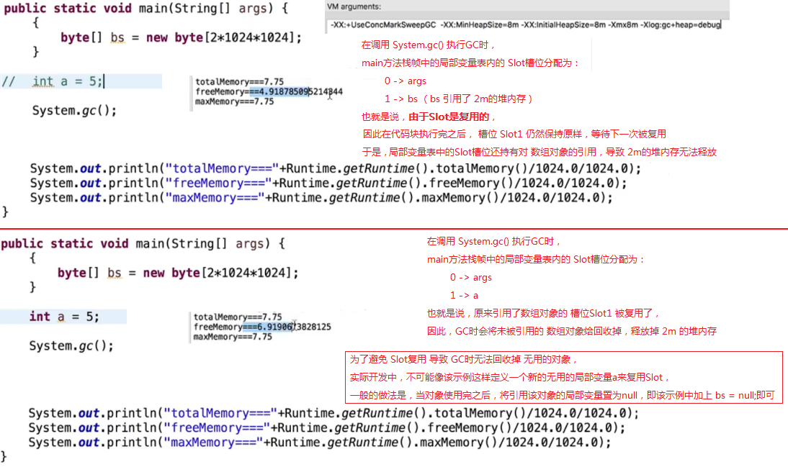
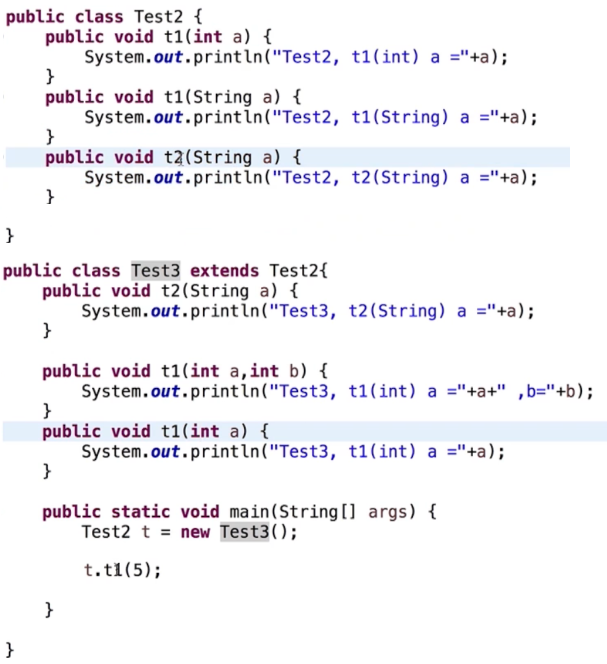

## 1. 字节码执行引擎概述

`JVM` 字节码执行引擎的功能基本就是：
1. 输入字节码文件；
2. 然后对字节码进行解析并处理；
3. 最后输出执行的结果。

`JVM` 字节码执行引擎的实现方式可以是：
1. 通过解释器直接解释执行字节码；
2. 或者通过即时编译器产生本地代码，也就是编译执行。
3. 也可能是以上两者皆有。

## 2. 栈帧

> 参考 《认识 `JVM` 规范》 中的 [栈帧](/zkq/java/jvm/jvm-spec.html#_8-10-3-7-栈帧)

栈帧的说明：

1. 栈帧是用于支持 `JVM` 进行方法调用和方法执行的数据结构；

2. 栈帧随着方法调用而创建，随着方法结束而销毁；

3. 栈帧里面存储了方法的局部变量表、操作数栈、动态链接、方法返回地址等信息。

栈帧的概念结构如下图所示：

## 3. 局部变量表

> 参考 《认识 `JVM` 规范》 中的 [局部变量表](/zkq/java/jvm/jvm-spec.html#_8-10-3-8-局部变量表-local-variable-又称本地变量表)

局部变量表的说明：

1. 用来存放方法参数和方法内部定义的局部变量的存储空间；

2. 以变量槽 `slot` 为单位，一个 slot 存放 `32` 位以内的数据类型（如 `byte`、`char`、`short`、`int`、`float`、引用类型）；

3. 对于 `64` 位的数据占 `2 slot`（如 `long`、`double`）；

4. 对于实例方法，索引 0 中的 `slot` 存放的是 `this`，然后从索引 `1` 到 `n`，依次分配给参数列表以及局部变量；

5. 局部变量所占的 `slot` 是根据在方法体中局部变量的定义顺序以及作用域来分配的；

6. **`slot` 是可复用的**，以节省栈帧的空间。（这种设计可能会影响到系统的垃圾收集行为）

### 3.1 局部变量表中的槽位 `slot` 是可复用的

> 参考 《认识 `JVM` 规范》 中的 [ `Code` 属性在 `class` 文件中的解析举例（`Slot` 可复用）](/zkq/java/jvm/jvm-spec.html#_8-10-3-9-code-属性在-class-文件中的解析举例-slot-可复用)

## 4. 操作数栈

操作数栈的说明：

1. 用来存放方法运行期间，各个指令操作的数据。

    > 操作数栈和局部变量表通过一些指针进行数据的存取，如：
    >
    > 1. `iload_1` 表示将局部变量表中的索引 `1` 处的 `int` 型数据取出，加载到操作数栈中。
    >
    > 2. `istore_2` 表示将操作数栈栈顶的 `int` 型数据弹出，存储到局部变量表中索引 `2` 处。

2. 操作数栈中元素的数据类型必须和字节码指令的顺序严格匹配。

    > 也就是说，对于 `iload_1` 指令，从局部变量表中取出的数据必须得是 `int` 型，才能加载到操作数栈中。

3. 虚拟机在实现栈中的时候可能会做一些优化，如：让两个栈帧出现部分重叠区域，以存放公用的数据。

## 5. 动态连接

每个栈帧会持有一个指向运行时常量池中该栈帧所属方法的引用，以支持方法调用过程的动态连接。

动态连接的两种方式：

1. 静态解析：类加载的时候，符号引用转化为直接引用；

2. 动态连接：运行期间，符号引用转化为直接引用。

## 6. 方法返回地址

方法返回地址：方法执行后返回的地址。

> 如方法 `A` 在方法 `B` 中的位置 `P` 被调用，那么方法 `A` 的返回地址就是指向方法 `B` 中的位置 `P`。

## 7. 方法调用

方法调用就是确定具体调用哪一个方法，并不涉及方法内部的执行过程。

> 也就是说方法调用的过程只是查找调用哪个方法的过程，而不包括方法体代码的执行过程。

方法调用的说明：

1. 部分方法是直接在类连接的解析阶段就确定了直接引用关系；

2. 但是对于实例方法，也称虚方法，因为重载和多态，需要运行期间动态分派。

    > 实例方法也称虚方法，所以调用实例方法的指令是 `invokevirtual`。

### 7.1 分派

### 7.1.1 静态分派 & 动态分派

分派可分为静态分派和动态分派：

1. 静态分派：所有依赖静态类型来定位方法执行版本的分派方式，比如：重载方法。
   
    > 所谓的 “定位方法执行版本” 就是说定位具体调用哪一个方法。

2. 动态分派：根据运行期的实际类型来定义方法执行版本，比如：覆盖方法（重写方法）。

### 7.1.2 单分派 & 多分派

另外，按照分派思考的维度，还可以分为单分派和多分派：

1. 单分派：主需要单独考虑静态分派，或单独考虑动态分派。即在方法调用时只存在一种分派方法。

2. 多分派：在方法调用时静态分派和动态分派都存在，如下代码所示：

    

    > `main` 函数中执行 `t.t1(5);`，调用 `t1` 方法时：
    >
    > 1. 首先需要考虑动态分派，确定变量 `t` 所引用对象的实际类型是 `Test2` 还是 `Test3`；
    >
    > 2. 然后再考虑静态分派，根据传入的实参类型确定调用的是哪一个重载方法。

## 8. 如何执行方法中的字节码指令

`JVM` 通过基于栈的字节码解释执行引擎来执行指令。`JVM` 的指令集也是基于栈的。

## 9. 栈帧、操作数栈、局部变量表之间的交互关系

方法调用开始时创建栈帧，栈帧中保存了操作数栈和局部变量表。

方法调用执行的过程主要就是操作数栈和局部变量表之间的数据交互过程。

> 也就是说，操作数栈中的操作数是保存在局部变量表中的。
