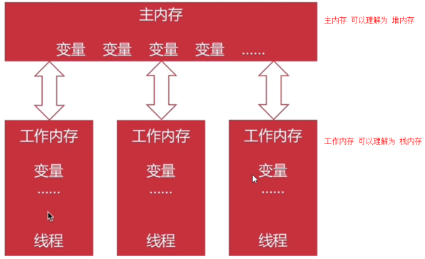
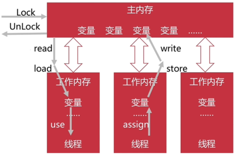
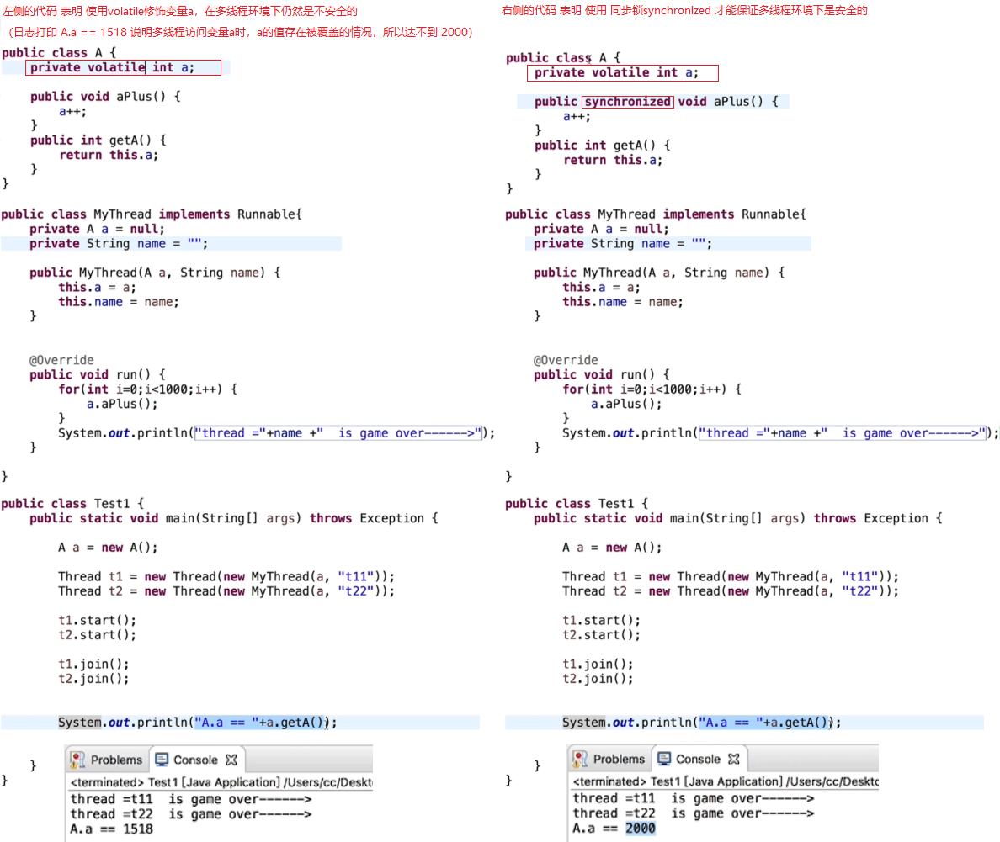
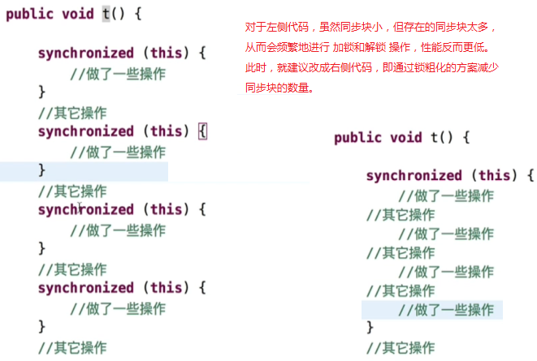

## 1. `Java` 内存模型（`JMM`）

`JCP` 定义了一种 `Java` 内存模型，以前是在 `JVM` 规范中的，后来独立出来成为 `JSR-133`（`Java` 内存模型和线程规范修订）。

> `JCP` 表示 `Java` 社区组织。
> 
> `JSR` 表示 `Java` 规范请求。

`Java` 内存模型（`JMM`）就是：在特点的操作协议下，对特定的内存或高速缓存进行读写访问的过程抽象。

> 也就是说，`Java` 内存模型规定了：怎么样跟内存进行交互（或者说怎么样读写内存）。

`Java` 内存模型的说明：

1. `Java` 内存模型主要关注 `JVM` 中，把变量值存储到内存，和从内存中取出变量值，这样的底层细节。

    > 也就是说，对象在堆内存中的存取过程，是 `Java` 内存模型来规定的。

2. 所有共享的变量都存储在主内存中，每个线程都有自己的工作内存。

    
   
3. **线程的工作内存中保存该线程所使用到的主内存中的变量的副本拷贝**。

    > 也就是说，当一个线程要操作主内存中的变量时，先把这个变量拷贝到线程自己的工作内存中，线程只能操作拷贝到工作内存中的变量副本。

4. 线程对变量的所有操作（读、写）都应该在工作内存中完成。

5. 不同线程不能相互访问工作内存，交互数据要通过主内存。

## 2. 内存间的交互操作

`Java` 内存模型规定了一些操作来实现内存间的交互，`JVM` 会保证 **这些操作都是原子的**。

> 实现内存间交互的这些操作就是用来处理一个变量如何从主内存拷贝到工作内存，又如何从工作内存同步到主内存，这样的工作细节。
>
> `JVM` 会保证这些操作是原子操作。在每项操作的执行过程中，不会受到其他操作的干扰，也不会再插入其他操作。

如上图所示，内存间的交互操作有：

1. `lock`：锁定。把变量标识为线程独占。该操作作用于主内存中的变量。

2. `unlock`：解锁。把锁定的变量释放。解锁后的变量才能被别的线程使用。该操作作用于主内存中的变量。

3. `read`：读取。把主内存中的变量值，读取到工作内存中。
   
    > `read` 操作只能将变量值读取到工作内存中，此时，并没有保存到工作内存的变量中。
    >
    > `load` 操作才是将 `read` 操作读到工作内存中的变量值保存进工作内存的变量中。

4. `load`：载入。把 `read` 读取到的变量值放入工作内存的变量副本中。

5. `use`：使用。把工作内存中一个变量的值传递给执行引擎。

    > 这里的执行引擎可以理解为字节码执行引擎。
    >
    > `use` 操作后，就可以在执行字节码指令时使用该变量值了。

6. `assign`：赋值。把从执行引擎中接收到的值赋给工作内存里面的变量。

    > 通过 `assign` 操作，把在执行字节码指令时被修改的变量值保存到工作内存的变量中。

7. `store`：存储。把工作内存中一个变量的值传递到主内存中。

    > 此时还没有保存到主内存的变量中。

8. `write`：写入。把 `store` 进来的数据存放入主内存的变量中。

### 2.1 内存间交互操作的规则

内存间交互操作的规则如下：

1. `read` / `load`（以及 `store` / `write`）必须组合使用，不能单独出现。`read` / `load`（以及 `store` / `write`）必须按顺序执行，但不保证是连续执行的，即 `read` 和 `load`（`store` 和 `load`） 之间是可插入其他指令的。

2. 不允许一个线程丢弃它的最近的 `assign` 操作，即变量在工作内存中改变了之后，必须把变化后的值同步回主内存。

    > 也就是说，变量在字节码执行引擎中被修改后，必须把修改后的变量值同步到主内存中。
    > 
    > 如果没有同步到主内存，那么其它线程的工作内存访问主内存时，得到的还是未被修改前的值。
    > 
    > 从而因数据不同步可能使得后续其它线程中执行的指令出错。

3. 不允许一个线程无原因地（没有发生过任何 `assign` 操作）把数据从线程的工作内存同步回主内存中。

    > 即，如果拷贝到工作内存中的变量值没有被修改过，那么是没必要将未修改的变量值同步回主内存的。

4. 一个新的变量只能从主内存中 “诞生”，不允许在工作内存中直接使用一个未被初始化的变量。也就是对一个变量，在执行 `use` 操作前，必须先执行了 `load` 操作；在执行 `store` 操作前，必须先执行 `assign` 操作。

    > 这里说的变量特指会被多个线程共享的变量。
    > 
    > 对于线程中的局部变量，因为不会被其他线程访问到，所以局部变量是可以在线程的工作内存中 “诞生” 的。

5. 在同一时刻，一个变量只允许一条线程对其执行 `lock` 操作，但 `lock` 操作可以被同一条线程重复执行多次。多次执行 `lock` 后，只有执行相同次数的 `unlock` 操作，变量才会被解锁。

6. 对一个变量执行 `lock` 操作，将会清空此变量在工作内存中的值。此时，在执行引擎使用这个变量前，需要重新执行 `load` 或 `assign` 操作初始化变量的值。

    > `lock` 操作作用于主内存变量，当对主内存变量进行 `lock` 操作时，可以理解为：需要重新使用该主内存中的变量了。
    > 
    > 此时，之前在工作内存中对应的变量副本中保存的值就应该被清除掉。
    > 
    > 然后通过 `load` 操作重新初始化工作内存中的变量副本。
    > 
    > 或者，如果之前执行引擎使用过该变量，那么执行引擎中的变量值肯定是最新的。于是，也可以执行 `assign` 操作来初始化工作内存中的变量副本。

7. 如果一个变量没有被 `lock` 操作锁定，则不允许对该变量执行 `unlock` 操作，也不能 `unlock` 一个被其它线程锁定的变量。

8. 对一个变量执行 `unlock` 操作前，必须先把此变量同步回主内存，即先执行 `store` 和 `write` 操作。

## 3. 多线程中的可见性

可见性：就是一个线程修改了变量，其它线程可以知道。

> “其它线程可以知道” 就是指：其它线程可以访问到被这个线程修改了的变量的值。

### 3.1 保证可见性的常见方法

保证可见性的常见方法有：

1. `volatile`；
2. `synchronized`；
3. `final`。（`final` 修饰的变量一旦初始化完成，其它线程就可见了）

## 4. `volatile`

`volatile` 是 `JVM` 提供的最轻量级的同步机制，用 `volatile` 修饰的变量，对所有的线程可见。即：**对 `volatile` 变量所做的写操作能立即反映到其它线程中**。

`volatile` 的说明：

1. `volatile` 修饰的变量，在多线程环境下仍然是不安全的。

    

2. `volatile` 修饰的变量，是 **禁止指令重排优化的**。

`volatile` 的适用场景：

1. 运算结果不依赖变量的当前值；
2. 或者能确保只有一个线程修改变量的值。

## 5. 指令重排

指令重排：是 `JVM` 为了优化，在条件允许的情况下，对指令进行一定的重新排列，使得避开获取下一条指令所需数据而造成的等待，进而直接运行当前能够立即执行的后续指令。

> 如一个线程中有 `1`，`2`，`3` 三条将要依次执行的指令。
> 
> 当指令 `2` 需要花时间去获取数据时，那么 `JVM` 就会在能够保证程序正常运行的情况下，将指向执行顺序改为 `1`，`3`，`2`。
> 
> 从而避免由于指令 `2` 所需数据的等待耗时所造成的后续指令 `3` 延迟执行。
> 
> 这种情况就称为指令重排。

指令重排是线程内的串行语义。不考虑多线程间的语义。

> 可以理解为：指令重排只能对一个线程内的串行指令进行重排。

不是所有的指令都能重排的，比如：

1. 写后读：`a=1; b=a;`

    > 写一个变量之后，再读这个变量。

2. 写后写：`a=1; a=2;`

    > 写一个变量之后，再写这个变量。

3. 读后写：`a=b; b=1;`

    > 读一个变量之后，再写这个变量。

以上三种情况中的语句是不能重排的。但是 `a=1; b=2;` 这种情况下的语句是可以重排的。

### 5.1 指令重排的基本规则

> 参考 《`Java` 内存模型（`JMM`）》 中的 [`Happens-Before` 规则](/zkq/java/jmm.html#_5-4-happens-before-规则-保证可见性的规则)

指令重排的基本规则有：

1. 程序顺序原则：一个线程内，保证语义的串行性。

2. `volatile` 规则：`volatile` 变量的写，先发生于读。

3. 锁规则：解锁（`unlock`）必然发生在随后的加锁（`lock`）前。

4. 传递性：`A` 先于 `B`，`B` 先于 `C`，那么 `A` 必然先于 `C`。

5. 线程的 `start` 方法先于线程中的每一个动作。

6. 线程的所有操作先于线程的终结（`Thread.join()`）。

    > 即线程结束前要保证线程中的操作都执行完成。

7. 线程的中断（`interrupt()`）先于被中断线程的代码。

8. 对象的构造函数执行结束先于 `finalize()` 方法。

### 5.2 多线程中的有序性

线程内观察，操作都是有序的。

线程外观察，操作都是无序的。（因为存在指令重排，或主内存同步延迟）

## 6. `Java` 线程安全的处理方法

`Java` 线程安全的处理方法有：

1. 不可变是线程安全的。

    > 即 `final` 修饰的（不可变）变量是线程安全的。

2. 互斥同步（阻塞同步）。包括：`synchronized` 和 `ReetrantLock`。

    > 目前这两个方法性能已经差不多了。建议优先选用 `synchronized`。
    > 
    > `ReentrantLock` 增加了如下特性：
    >
    > 1. 等待可中断：当持有锁的线程长时间不释放锁时，正在等待的线程可以选择放弃等待。
    >
    > 2. 公平锁：多个线程等待同一个锁时，须严格按照申请锁的时间顺序来获得锁。（调用 `ReentrantLock` 的无参构造函数默认设置为不公平锁）
    >
    > 3. 锁绑定多个条件：一个 `ReentrantLock` 对象可以绑定多个 `Condition` 对象，而 `synchronized` 是针对一个条件的。（如果 `synchronized` 要针对多个条件，那么就得有多个锁）

3. 非阻塞同步：是一种基于冲突检查的 **乐观锁定策略**。

    > 通常是先操作，如果没有冲突，那么操作成功。如果有冲突，那么再采用其它方式进行补偿处理。
    > 
    > （**乐观锁** 就是假设没有冲突，正常进行操作，操作过程中出现冲突再补救）

4. 无同步方案：其实就是在多线程中，方法并不涉及共享数据，此时自然就无需同步了。

    > 无同步方案就是要做到避免多线程共享同一份数据。
    >
    > 实际开发中，应尽量采用无同步方案。

## 7. 锁优化

锁优化：就是指 `JVM` 对多线程的加锁操作所采用的优化方案。

下面介绍的一些锁优化方案都是 `JVM` 内部实现了的，我们只需要知道这些锁优化的原理、优缺点即可。至于 `JVM` 是如何实现的不需要关心。

### 7.1 自旋锁 & 自适应自旋

自旋：如果线程可以很快地获得锁，那么可以不在 `OS` 层挂起线程。而是让线程做几个忙循环。这就是自旋。

> 一般地，多个线程在竞争同一个锁时，未获得锁的其它线程都是在操作系统层面上被挂起等待的。
> 
> 对此，如果 `JVM` 判断未获得锁的其它线程如果可以很快地获得锁，那么就不会让这种线程在操作系统层面上挂起。而是在代码层面上，让这种线程自己做几个循环来消耗等待时间。这样的优化操作就叫做自旋。
> 
> 自旋操作所消耗的资源比在 `OS` 层面上的挂起和唤醒线程要更轻量级。

自适应自旋：自旋的时间不再固定，而是由前一次在同一个锁上的自旋时间，和锁的拥有者状态来决定。

自旋的优缺点：

1. 如果锁被占用时间很短，自旋成功，那么能节省线程挂起、切换的时间，从而提升系统性能；
2. 如果锁被占用时间很长，自旋失败，那么会白白耗费处理器资源，降低系统性能。

> 也就是说，自旋和自适应自旋并不能保证线程在自旋操作之后，就能够成功地获得锁。
> 
> 如果自旋后的线程未获得锁（即自旋失败），那么该线程仍然还是会在 `OS` 层面上被挂起等待。
> 
> 此时，也就意味着白白地浪费了自旋操作所造成的资源消耗。

### 7.2 锁消除

在编译代码的时候，如果方法中存在同步代码，但是又没有检测到方法中的同步代码会与其它线程竞争共享数据。那么就不会给方法中的同步代码加锁了。这种锁优化方案就称为 **锁消除**。

通过设置参数 `-XX:+EliminateLocks` 开启锁消除。

开启锁消除时，同时也要设置参数 `-XX:+DoEscapdeAnalysis` 来开启 **逃逸分析**。

#### 7.2.1 方法逃逸 & 线程逃逸

所谓逃逸分析，就是：

1. 如果一个方法中定义的一个对象，可能被外部方法引用，那么称为 **方法逃逸**。

    > 如果方法的同步代码中使用到的局部变量或成员变量，它们引用的对象在其它方法中也被引用到了，并且这样的其它方法会在不同的线程中被调用。那么是不能对该方法的同步代码进行锁消除的。

2. 如果对象可能被其它外部线程访问，称为 **线程逃逸**。

    > 比如将对象赋值给类变量，或者赋值给可以在其它线程中访问的实例变量。

### 7.3 锁粗化

锁粗化：通常要求同步块要小，但一系列地连续操作可能会导致使用同一个锁对象反复的加锁和解锁，这样就会造成不必要的性能损耗。这种情况建议把锁同步的范围扩大到整个操作序列。

> 同步块中的代码在执行时，系统是单线程的，因此，如果同步块中的代码越多，那么系统单线程执行的时间越长，性能越低。
> 
> 因此，通常要求同步块要小。

### 7.4 轻量级锁

轻量级是相对于传统锁机制而言的。本意是没有多线程竞争的情况下，减少传统锁机制使用 `OS` 实现互斥所产生的性能损耗。

轻量级锁的实现原理很简单，类似于乐观锁的方式。

如果轻量级锁失败，表示存在竞争，此时升级为重量级锁，但会导致性能下降。

### 7.5 偏向锁

偏向锁是在无竞争的情况下，直接把整个同步消除了，连乐观锁都不用，从而提高性能。

所谓的偏向，就是偏心，即锁会偏向于当前已经占有锁的线程。

说明：

1. 只要没有竞争，获得偏向锁的线程在将来进入同步块时，也不需要做同步。

2. 当有其它线程请求相同的锁时，偏向模式结束。

3. 如果程序中大多数锁总是被多个线程访问的时候 ，也就是竞争比较激烈，偏向锁反而会降低性能。

4. 使用 `-XX:-UseBiasedLocking` 来禁用偏向锁。（默认开启）

### 7.6 `JVM` 进行锁优化的步骤

`JVM` 进行锁优化的步骤如下：

1. 先尝试偏向锁；

2. 然后尝试轻量级锁；

3. 再然后尝试自旋锁；

4. 最后尝试普通锁，使用 `OS` 互斥量在操作系统层挂起。

## 8. 同步代码的基本规则

同步代码的基本规则如下：

1. 尽量减少锁持有的时间；

2. 尽量减少锁的粒度。

    > 即尽量减小同步代码的代码量。
    >
    > 同步代码的代码量减少了，同步代码的执行时间也就减少了，锁持有的时间同样也就减少了。