## 1. `JVM` 简化架构概览

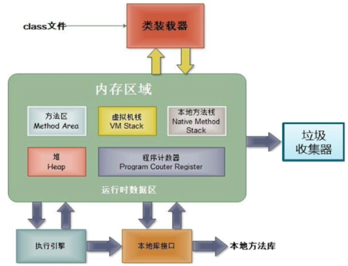

### 1.1 运行时数据区（即内存区域，又称 `JVM` 内存结构）

如上面的 `JVM` 简化架构图所示，内存区域分为如下五个部分（这五个部分统称为运行时数据区）：

1. `PC` 寄存器（又称程序计数器）；
   
2. `Java` 栈（又称 `Java` 虚拟机栈，或虚拟机栈）；
   
3. `Java` 堆；
   
4. 方法区；

    > 注意：运行时常量池是划分在方法区中的。
   
5. 本地方法栈（`Native` 栈）

#### 1.1.1 `PC` 寄存器（又称程序计数器）

`PC`（`Program Counter`）寄存器说明：

1. `PC` 寄存器是线程私有的，即每个线程拥有一个 `PC` 寄存器，用来存储指向下一条指令的地址。

    > `PC` 寄存器中指令的存储顺序就是线程中代码的执行顺序。

2. 在创建线程的时候，创建相应的 `PC` 寄存器。

3. 执行本地方法（即 `native` 修饰的 `jni` 方法）时，`PC` 寄存器的值为 `undefined`。

4. `PC` 寄存器是一块较小的内存空间，是唯一一个在 `JVM` 规范中没有规定 `OutOfMemoryError` 的内存区域。

#### 1.1.2 `Java` 栈（又称 `Java` 虚拟机栈，或虚拟机栈）

`Java` 栈的说明：

1. `Java` 栈是由一系列的帧（`Frame`）组成的。因此，`Java` 栈也称为帧栈。

    > `Java` 栈和 `PC` 寄存器一样，都是线程私有的。

    > 由帧组成的栈叫做帧栈；
    > 
    > 存放在帧栈中的帧叫做栈帧。

2. 帧（即 [栈帧](/zkq/java/jvm/jvm-spec.html#_8-10-3-7-栈帧)）可以用来保存一个方法的局部变量、操作数栈（`Java` 没有寄存器，所有参数传递使用操作数栈）、常量池指针、动态链接、方法返回值等。

3. 每一次方法调用时都会创建一个帧，并压栈。退出方法时，修改栈顶指针就可以把栈帧中的内容销毁。

    > 帧是方法调用相关的。方法调用开始时创建帧，方法调用结束后销毁帧。

4. [局部变量表](/zkq/java/jvm/jvm-spec.html#_8-10-3-8-局部变量表-local-variable-又称本地变量表) 存放了编译期可知的各种基本数据类型和引用类型，每个 `slot`（槽位） 存放 `32` 位的数据，`long`、`double` 占两个 `slot`。

    > 局部变量表中的槽位（`slot`）是可以复用的。
    > 
    > 参考 [`Code` 属性在 `class` 文件中的解析举例](/zkq/java/jvm/jvm-spec.html#_8-10-3-9-code-属性在-class-文件中的解析举例-slot-可复用)。
    >
    > 参考 《字节码执行引擎》 中的 [局部变量表](/zkq/java/jvm/class-exe-engine.html#_3-局部变量表)

`Java` 栈的优缺点：

1. 优点：存取速度比堆快，仅次于寄存器。

2. 缺点：存在栈中的数据大小、生存期是在编译期决定的，缺乏灵活性。

#### 1.1.3 `Java` 堆

`Java` 堆说明：

1. 用来存放应用系统创建的对象和数组。所有线程共享 `Java` 堆。

2. `GC` 主要就是管理堆空间。对分代 `GC` 来说，堆也是分代的。

    > 分代只是一种思想，内存中并没有分代的说法。

`Java` 堆的优缺点：

1. 优点：运行期动态分配内存大小；自动进行垃圾回收。

2. 缺点：效率相对较慢。

#### 1.1.4 方法区

方法区的说明：

1. 方法区是线程共享的，通常用来保存加载的类的结构信息（即 `class` 文件中的二进制字节流数据，包括：类名、继承关系、字段、方法、附加属性等信息数据）。

    > 参考 [类加载要完成的功能](/zkq/java/jvm/classloader.html#_2-1-类加载要完成的功能)。
    >
    > 参考 [`Class` 文件的格式](/zkq/java/jvm/jvm-spec.html#_8-class-文件的格式)。

2. 方法区通常和元空间（`Meta Space`）关联在一起。但具体的跟 `JVM` 实现和 `JDK` 版本有关。

    > `JDK 8` 之前，方法区和永久区关联在一起；
    >
    > `JDK 8` 之后，废除了永久区，将方法区和元空间关联在一起。

3. `JVM` 规范把方法区描述为堆的一个逻辑部分，但方法区有一个别名（即 `Non-heap` 非堆），应该是为了与 `Java` 堆相互区分开来。

#### 1.1.5 运行时常量池

运行时常量池是 `class` 文件中每个类或接口的 [常量池表](/zkq/java/jvm/jvm-spec.html#_8-5-常量池)，在运行期间的表示形式，通常包括：`JDK` 版本、类名、父类或父接口名、字段、方法等信息。

**运行时常量池分配在方法区中。**

> 因此，说方法区中保存了类的结构信息是正确的。

通常在加载类和接口到 `JVM` 后，就创建了相应的运行时常量池。

#### 1.1.6 本地方法栈（`Native` 栈）

在 `JVM` 中用来支持 `native` 方法执行的栈就是本地方法栈。

### 1.2 `Java` 栈、`Java` 堆、方法区三者间的交互关系

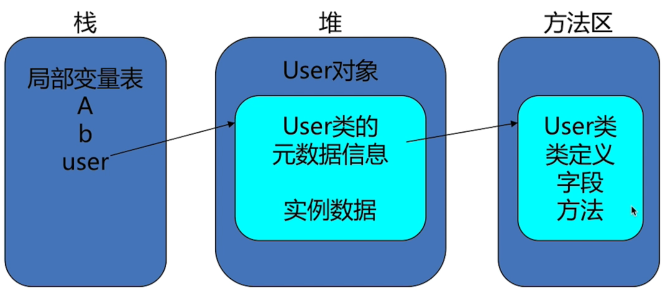

如上图所示：

1. 对于 `Java` 栈中的局部变量表中的类类型的局部变量，会指向 `Java` 堆中的类对象；

2. 对于 `Java` 堆中的类对象，它不仅包括实例数据，还包括指向该类元数据信息的指针；

3. 对于类的元数据信息，就是方法区中保存的类的结构信息等，即 `Java` 堆中的类对象还会持有对方法区中数据的引用。

## 2. `Java` 堆

### 2.1 堆内存概述

`Java` 堆用来存放应用系统创建的对象和数组，所有线程共享 `Java` 堆。

在运行时期为 `Java` 堆动态分配内存大小，并自动进行垃圾回收。

`Java` 垃圾回收（`GC`）主要就是回收堆内存。

> 对分代 `GC` 来说，堆也是分代的。

堆内存在逻辑上是连续的，在物理上可以是不连续的。

### 2.2 堆内存的结构


如上图所示：整个堆大小 = 新生代 + 老年代

#### 2.2.1 新生代（`Young Generation`）

新生代 = `Eden` + 存活区

新生代用来存放新分配的对象。

新生代中经过垃圾回收后，没有回收掉的对象被复制到老年代。

##### 2.2.1.1 `Eden`（伊甸园）区

##### 2.2.1.2 存活区（`From Space` 和 `To Space`）

存活区（`Survivor Space`）又分为 `From Space` 和 `To Space`。

但使用时，只能使用其中一个。

> 之所以分为两个，是为了在复制时用到。

#### 2.2.2 老年代（`Old Generation`，又称年老代）

老年代中只有一个 `Tenured Space`（年老区）。

老年大存储的对象比新生代存储的对象的年龄大得多。

老年代存储一些大对象。

> 对一些占用空间较大的对象，可能不会先进入新生代，而是直接存放在老年代。

#### 2.2.3 永久代（又称持久代，已废弃）& 元空间

从前的持久代（即用来存放 `Class`、`Method` 等元信息的区域）从 `JDK 8` 开始去掉了。被元空间（`MetaSpace`）所取代。

> 元空间并不在虚拟机里面，而是直接使用本地内存。

### 2.3 对象的内存布局（对象头、实例数据、对齐填充）

以 `HotSpot` 虚拟机为例，对象在内存中的存储布局，分为：

1. 对象头

    ```:no-line-numbers
    对象头包含两个部分：
    1. Mark Word：存储对象自身的运行数据，如：HashCode、GC 分代年龄、锁状态标志等。
    2. 类型指针：对象指向它的类的元数据（即类的结构信息）的指针（指向方法区）。
    ```

2. 实例数据

    ```:no-line-numbers
    真正存放对象实例数据的地方。
    ```

3. 对齐填充

    ```:no-line-numbers
    这部分不一定存在。也没有特别的含义，仅仅是占位符。
    因为 HotSpot 虚拟机要求对象起始地址都是 8 字节的整数倍，如果不是，就要对齐填充。
    ```

### 2.4 对象的访问方式（使用句柄、使用指针）

在 `JVM` 规范中，只规定了 `reference` 类型（引用类型）是一个指向对象的引用，但没有规定这个引用具体如何去定位，并访问堆中对象的具体位置。

因此，对象的访问方式取决于 `JVM` 的实现。目前主流的访问方式有：

1. 使用句柄：

    ```:no-line-numbers
    Java 堆中会划分出一块内存来做为句柄池，reference 中保存句柄的地址。
    即引用指向句柄池中的句柄。
    句柄中存储对象的实例数据，以及类的元数据的地址。
    ```

    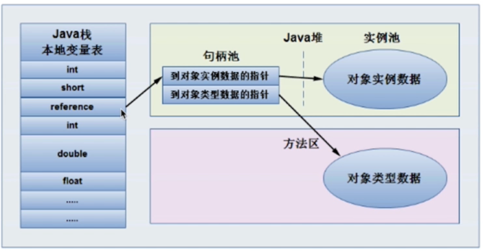

    > 使用句柄的优缺点：
    >
    > 1. 优点：当对象发生改变时，只需要修改句柄中到对象数据的指针即可。不需要修改 `reference` 的指向。'
    >
    > 2. 缺点：使用句柄其实就是采用间接引用的方式访问对象，于是，`reference` 需要 `2` 次寻址才能访问到对象。即访问速度较慢。
   
1. 使用指针（`HotSpot` 虚拟机采用这种方式来访问对象）：
   
    ```:no-line-numbers
    Java 堆中会存放访问类的元数据的地址，
    reference 存储的就直接是对象的地址。
    ```

    

    > 使用指针的优缺点：
    >
    > 1. 优点：`reference` 直接指向对象，只需 `1` 次寻址。即访问速度较快。
    >
    > 2. 缺点：对象发生改变时，需要修改 `reference` 的指向。

## 3. `Java` 内存分配相关的参数设置

### 3.1 `Trace` 跟踪参数

#### 3.1.1 `-Xlog:gc`（打印 `GC` 日志的简要信息）

#### 3.1.2 `-Xlog:gc*`（打印 `GC` 日志的详细信息）

#### 3.1.3 `-Xlog:gc:<filename>`（输出 `GC` 日志信息到指定文件）

```:no-line-numbers
如 -Xlog:gc:garbage-collection.log，其中 garbage-collection.log 是保存 GC 日志的文件。

文件名前面还可以加路径，路径目录必须事先创建好。
```

#### 3.1.4 `-Xlog:gc+heap=debug`（打印 `GC` 日志信息和堆信息）

#### 3.1.5 `GC` 日志信息的格式

不同垃圾收集器的 `GC` 日志格式可能不同。`GC` 日志信息中主要包含以下内容：

1. `GC` 发生的时间，也就是 `JVM` 从启动以来经过的秒数。

2. 日志级别信息，和日志类型标记。

3. `GC` 识别号。

4. `GC` 类型，和 `GC` 的原因说明。

5. 容量：`GC` 前容量 `-> GC` 后容量（该区域总容量）。

6. `GC` 持续时间，单位：秒。

    ```:no-line-numbers
    有的收集器会有更详细的描述，比如：
    1. user：表示应用程序消耗的时间；
    2. sys：表示系统内核消耗的时间；
    3. real：表示操作从开始到结束的时间。
    ```

举例如下：

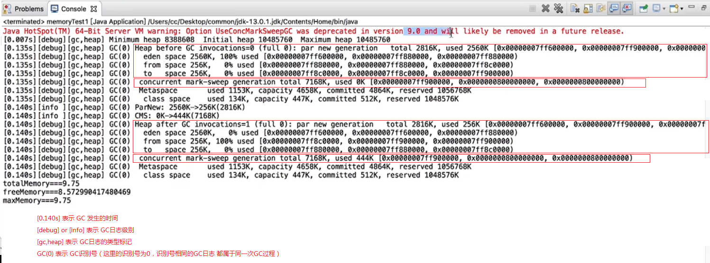

### 3.2 `Java` 堆的参数

#### 3.2.1 `-Xms<size>`（初始堆大小）

```:no-line-numbers
设置堆的最小空间大小为 size，同时也将堆的初始空间大小设置为 size。

size 必须是 1024 的倍数，且 size 必须大于 1MB。如：
    -Xms6291456
    -Xms6144k
    -Xms6m
    以上三种方式只是 size 的单位不同，结果都是将 size 设置为 6m。

默认为物理内存的 1/64。

如果不想将堆的最小空间大小和初始空间大小设置成一样，可以使用：
1. -XX:MinHeadpSize 单独设置最小空间大小；
2. -XX:InitialHeapSize 单独设置初始空间大小。
```

#### 3.2.2 `-Xmx<size>`（最大堆大小）

```:no-line-numbers
默认为物理内存的 `1/4`。

-Xmx 等价于 -XX:MaxHeapSize

建议将 -Xms 和 -Xmx 设置成一样大小，即：初始堆大小 = 最大堆大小。这样，每次 GC 后就不需要再去调整堆大小了。
```

使用示例如下：

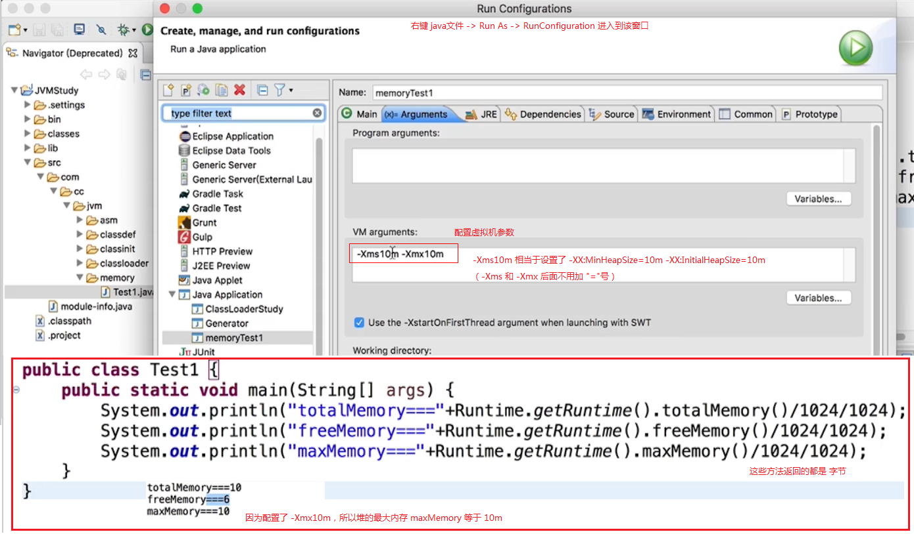

#### 3.2.3 `-Xmn<size>`（新生代大小）

```:no-line-numbers
默认为整个堆的 3/8。

因为新创建的对象一般都是存放在新生代中的，所以：
1. 如果新生代的内存太小，能够存放的对象就少，就会导致频繁的 GC；
2. 如果新生代的内存太大，就会存放过多的对象，从而导致一次 GC 的耗时较长。

-Xmn 同时设置了新生代的初始空间大小和最大空间大小。也可以使用 -XX:NewSize 和 -XX:MaxNewSize 分别单独设置。
```

#### 3.2.4 `-XX:NewRatio`（老年代与新生代的比例）

```:no-line-numbers
-XX:NewRatio 是设置新生代和老年代的占比关系。而 -Xmn 是设置新生代的固定内存大小。

也就是说，对于 -XX:NewRatio， 新生代的内存大小取多少，是虚拟机根据比例来算的。

默认值为 -XX:NewRatio=2，表示 老年代 : 新生代 = 2 : 1，即
    老年代占堆内存的 2/3
    新生代占堆内存的 1/3

注意：如果 -Xms = -Xmx，且设置了 -Xmn，那么不用再设置 -XX:NewRatio。
```

#### 3.2.5 `-XX:SurvivorRatio`（`Eden` 区和 `Survivor` 区的比例）

```:no-line-numbers
当 -XX:SurvivorRatio = 8 时，则 eden : from : to = 8 : 1 : 1，即：
    eden 区占新生代内存的 8/10；
    from space 占新生代内存的 1/10；
    to space 占新生代内存的 1/10。
```

#### 3.2.6 `-XX:+HeapDumpOnOutOfMemoryError`（导出 `OOM` 时的堆信息）

```:no-line-numbers
导出 OOM 时的堆信息就是导出一个堆存储文件（hprof）文件。

如果不通过参数 -XX:+HeapDumpPath 指定导出的 hprof 文件的路径，
则默认在程序运行时所在的当前目录下生成 hrof 文件。
```

#### 3.2.7 `-XX:+HeapDumpPath`（`OOM` 时堆信息的导出文件路径）

```:no-line-numbers
如果不指定导出路径，默认为 `Java` 程序运行时所在的当前目录。
```

#### 3.2.8 `-XX:OnOutOfMemoryError`（在 `OOM` 时，执行一个脚本）

#### 3.2.9 示例：`GC` 前后对象在堆内存中的分布变化

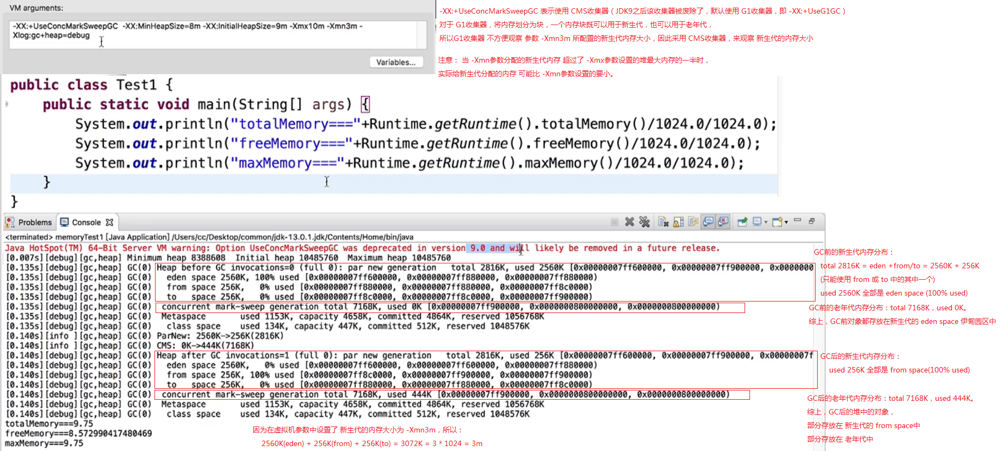

#### 3.2.10 示例：分配的新生代内存不能超过最大堆内存的一半

当 `-Xmn` 设置的新生代内存超过了 `-Xmx` 设置的最大堆内存的一半时，实际给新生代分配的内存可能比 `-Xmn` 设置的小。


#### 3.2.11 示例：导出堆存储文件并使用 `MAT` 进行内存分析


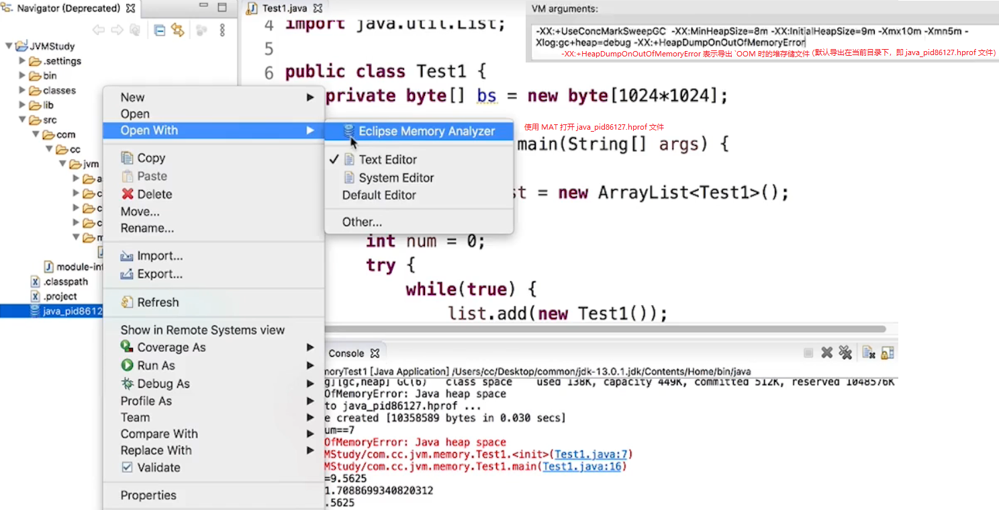

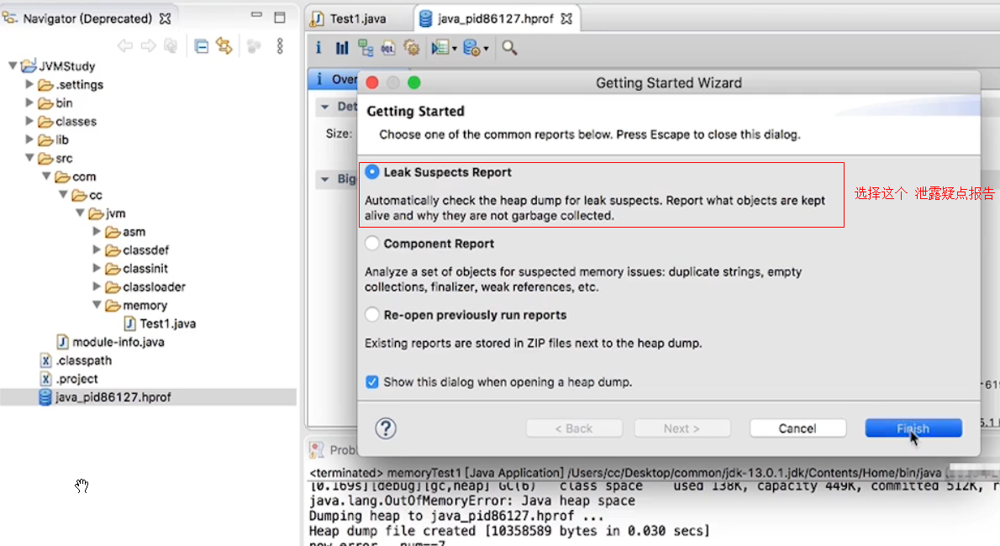


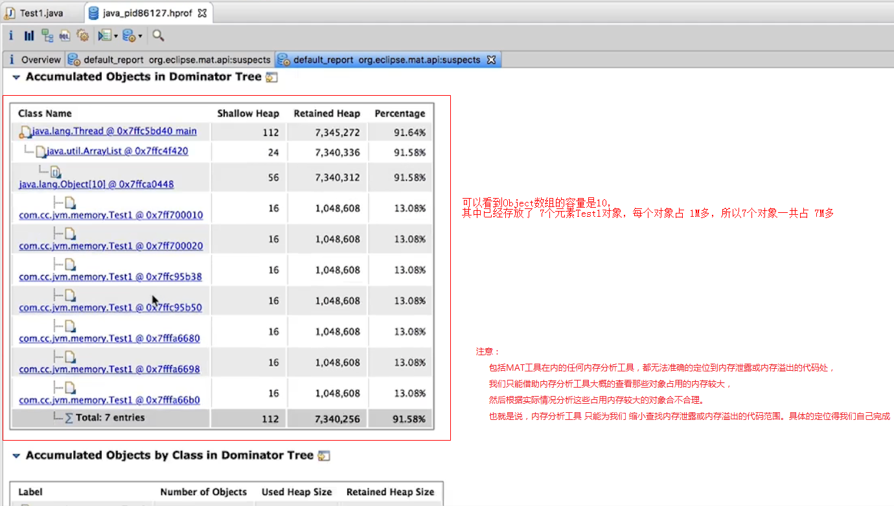

#### 3.2.12 示例：输出 `GC` 日志到指定文件


#### 3.2.13 示例：`-XX:NewRatio` 设置老年代与新生代的比例


#### 3.2.14 示例：`-XX:SurvivorRatio` 设置 `Eden` 区和 `Survivor` 区的比例

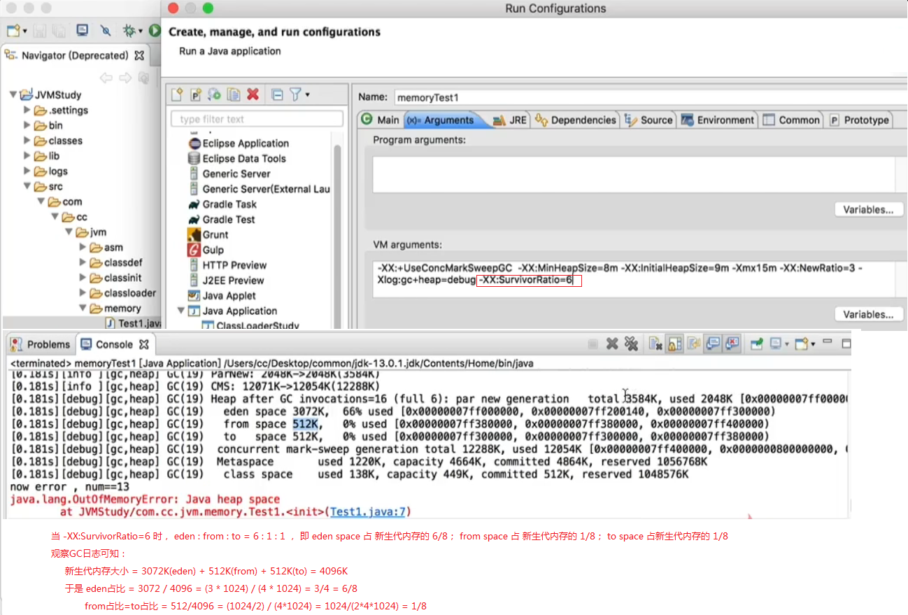

#### 3.2.15 示例：分析内存溢出（`OOM`）时 `GC` 日志信息


### 3.3 `Java` 栈的参数

#### 3.3.1 `-Xss`（栈的大小）

```:no-line-numbers
通常只有几百 K，决定了函数调用的深度。

栈是由帧组成的，函数调用开始时创建帧，函数调用结束后销毁帧。
当函数嵌套调用时，就会同时有多个帧存在，嵌套层级越深，帧越多，
因此说 -Xss 所设置的栈大小，决定了一个栈中能同时存放下多少个帧，即确定了函数调用的嵌套深度。
```

#### 3.3.2 示例：通过递归函数模拟 `StackOverflowError`（栈溢出异常）

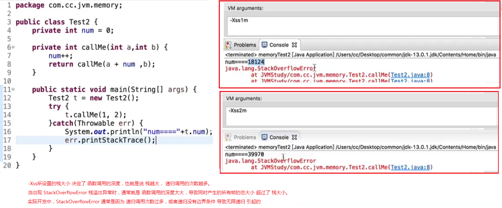

### 3.4 元空间的参数

#### 3.4.1 `-XX:MetaspaceSize`（初始空间大小）

#### 3.4.2 `-XX:MaxMetaspaceSize`（最大空间大小）

```:no-line-numbers
默认是没有限制的
```

#### 3.4.3 `-XX:MaxMetaspaceFreeRatio`（`GC` 后的最大剩余百分比）

```:no-line-numbers
在 GC 之后，最小的 Metaspace 剩余空间容量的百分比。
```

#### 3.4.4 `-XX:MinMetaspaceFreeRatio`（`GC` 后的最小剩余百分比）

```:no-line-numbers
在 GC 之后，最大的 Metaspace 剩余空间容量的百分比。
```
