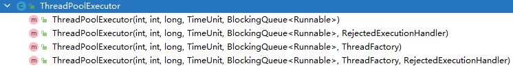

## 1. 线程池的优点

线程池的优点可以概况为以下三点：

1. 重用线程池中的线程，避免因线程的创建和销毁，所带来的性能开销。

2. 能有效控制线程池的最大并发数，避免大量的线程之间因互相抢占系统资源而导致的阻塞现象。

3. 能够对线程进行简单的管理，并提供定时执行，以及指定间隔循环执行等功能。

## 2. `ThreadPoolExecutor`（线程池的真正实现）

`Android` 中的线程池的概念来源于 `Java` 中的 `Executor`。

`Executor` 是一个接口，真正的线程池的实现是 `ThreadPoolExecutor`。

`ThreadPoolExecutor` 提供了一系列的参数来配置线程池。通过不同的参数可以创建不同的线程池。

> `Android` 中的线程池都是直接或间接地通过配置 `ThreadPoolExecutor` 来实现的。



如上图所示，`ThreadPoolExecutor` 提供了四个构造方法，但最终都是通过调用如下构造方法实现的：

```java:no-line-numbers
public ThreadPoolExecutor(int corePoolSize, int maximumPoolSize,
                          long keepAliveTime, TimeUnit unit,
                          BlockingQueue<Runnable> workQueue,
                          ThreadFactory threadFactory,
                          RejectedExecutionHandler handler) 
```

### 2.1 `ThreadPoolExecutor` 构造方法的参数

#### 2.1.1 `corePoolSize`

线程池的核心线程数。

默认情况下，核心线程会在线程池中一直存活（即使核心线程处于空闲状态）。

> 但是，如果将 `ThreadPoolExecutor` 的 `allowCoreThreadTimeout` 属性设置为 `true`，那么空闲的核心线程在等待新任务到来时会有超时策略。
> 
> 这个超时时长由参数 `keepAliveTime` 指定。即：等待时间超过 `keepAliveTime` 时，空闲的核心线程就会被终止。

#### 2.1.2 `maximumPoolSize`

线程池所能容纳的最大线程数。

> `maximunPoolSize` - `corePoolSize` = 最大的非核心线程数

当 **活动线程数** 达到 `maximumPoolSize` 后，后续的新任务将会被阻塞。

#### 2.1.3 `keepAliveTime`

非核心线程空闲时的超时时长。即：空闲的时间超过 `keepAliveTime` 时，非核心线程就会被回收。

当 `ThreadPoolExecutor` 的 `allowCoreThreadTimeout` 属性设置为 `true` 时，`keepAliveTime` 同样作用于核心线程。

#### 2.1.4 `unit`

用于指定 `keepAliveTime` 参数的时间单位。可以是如下几个枚举值：

1. `TimeUnit.MILLISECONDS`：毫秒
2. `TimeUnit.SECONDS`：秒
3. `TimeUnit.MINUTES`：分
4. ......

#### 2.1.5 `workQueue`

线程池中的任务队列。

通过线程池的 `execute` 方法提供的 `Runnable` 对象会存放在任务队列中。

#### 2.1.6 `threadFactory`

线程工厂，为线程池提供 **创建新线程** 的功能。

`ThreadFactory` 是一个接口，它只提供一个方法：`Thread newThread(Runnable r)`。

> 默认值为 `Executors.defaultThreadFactory()`，即 `Executors.DefaultThreadFactory` 实例对象。

#### 2.1.7 `rejectedExecutionHandler`

当线程池无法执行新任务时，这可能是由于任务队列已满，或者是无法成功执行任务。这个时候 `ThreadPoolExecutor` 会调用 `RejectedExecutionHandler` 的 `rejectedExecution` 方法。

`ThreadPoolExecutor` 为 `RejectedExecutionHandler` 提供了几个可选的实现类：

1. `AbortPolicy`：默认值。重写 `rejectedExecution` 方法，抛出 `RejectExecutionException` 异常。
   
2. `CallerRunsPolicy`
   
3. `DiscardPolicy`
   
4. `DiscardOldestPolicy`

#### 2.1.8 示例：`AsyncTask` 中的 `ThreadPoolExecutor` 参数配置

```java:no-line-numbers
// CPU 核心数
private static final int CPU_COUNT = Runtime.getRuntime().availableProcessors();
// 核心线程数 = CPU 核心数 + 1
private static final int CORE_POOL_SIZE = CPU_COUNT + 1;
// 最大线程数 = CPU 核心数 x 2 + 1
private static final int MAXIMUM_POOL_SIZE = CPU_COUNT * 2 + 1;

private static final int KEEP_ALIVE = 1;

// 任务队列的容量为 128
private static final BlockingQueue<Runnable> sPoolWorkQueue = new LinkedBlockingQueue<Runnable>(128);

private static final ThreadFactory sThreadFactory = new ThreadFactory() {
    private final AtomicInteger mCount = new AtomicInteger(1);
    public Thread newThread(Runnable r) {
        return new Thread(r, "AsyncTask #" + mCount.getAndIncrement());
    }
};

// 核心线程无超时机制
public static final Executor THREAD_POOL_EXECUTOR 
        = new ThreadPoolExecutor(CORE_POOL_SIZE, MAXIMUM_POOL_SIZE,
                                 KEEP_ALIVE, TimeUnit.SECONDS, // 非核心线程的空闲超时时长为 1s。
                                 sPoolWorkQueue, 
                                 sThreadFactory);
```

### 2.2 `ThreadPoolExecutor` 执行任务时的规则

`ThreadPoolExecutor` 执行任务时大致遵循如下规则：

1. 如果线程池中的线程数量未达到核心线程的数量，那么会直接启动一个核心线程来执行任务。

2. 如果线程池中的线程数量已经达到或者超过核心线程的数量，那么任务会被插入到任务队列中排队等待执行。

3. 如果在步骤 `2` 中无法将任务插入到任务队列中，这往往是由于任务队列已满。此时，如果线程数量未达到线程池的最大线程数，那么会立即启动一个非核心线程来执行任务。

4. 如果步骤 `3` 中线程数量已经达到了线程池的最大线程数，那么就拒绝执行任务。此时，`ThreadPoolExecutor` 会调用 `RejectedExecutionHandler` 的 `rejectedExecution` 方法来通知调用者。

## 3. 线程池的分类

从线程池的功能特性上来说，`Android` 的线程池主要分为 `4` 类：
1. `FixedThreadPool`
2. `CachedThreadPool`
3. `ScheduledThreadPool`
4. `SingleThreadExecutor`

这四类线程池可以通过工具类 `Executors` 所提供的工厂方法来获取。

### 3.1 `FixedThreadPool`

```java:no-line-numbers
public static ExecutorService newFixedThreadPool(int nThreads) {
    return new ThreadPoolExecutor(nThreads, nThreads,
                                  0L, TimeUnit.MILLISECONDS,
                                  new LinkedBlockingQueue<Runnable>());
}
```

说明：

1. 线程池中只存在固定数量的核心线程。
2. 核心线程没有设置超时机制，所以空闲的核心线程会一直存在，除非线程池被关闭了。
3. 不存在非核心线程，所以没必要设置空闲超时时长 `keepAliveTime`。（即 `keepAliveTime` 置为 `0` 即可）
4. 任务队列没有容量限制，所以当线程池中执行的核心线程数已满时，总是会将提交的任务放入任务队列中。

由于 `FixedThreadPool` 只有核心线程，且空闲的核心线程不会被回收，所以 `FixedThreadPool` 能够更加快速地响应外界的请求。

### 3.2 `CachedThreadPool`

```java:no-line-numbers
public static ExecutorService newCachedThreadPool() {
    return new ThreadPoolExecutor(0, Integer.MAX_VALUE,
                                  60L, TimeUnit.SECONDS,
                                  new SynchronousQueue<Runnable>());
}
```

说明：

1. 不存在核心线程，且没有限制最大线程数，这意味着线程池中的非核心线程数没有限制。
2. 非核心线程的空闲超时时长为 `60s`。
3. 任务队列采用 `SynchronousQueue`，`SynchronousQueue` 的特点是无法存储元素。这意味着新提交的任务总是会被立即执行，而不会放入到任务队列中排队等待。

`CacheThreadPool` 比较适合执行大量的耗时较少的任务。

当整个线程池都处于空闲状态时，线程池中的线程（只存在非核心线程）都会因空闲超时而被停止，此时，`CacheThreadPool` 中实际上是没有任何线程的，即 `CacheThreadPool` 几乎不占用任何系统资源。

### 3.3 `ScheduledThreadPool`

```java:no-line-numbers
/* Executors.java */
public static ScheduledExecutorService newScheduledThreadPool(int corePoolSize) {
    return new ScheduledThreadPoolExecutor(corePoolSize);
}

/* ScheduledThreadPoolExecutor.java */
public ScheduledThreadPoolExecutor(int corePoolSize) {
    // supre 就是 ThreadPoolExecutor
    super(corePoolSize, Integer.MAX_VALUE,
          DEFAULT_KEEPALIVE_MILLIS, MILLISECONDS,
          new DelayedWorkQueue());
}

private static final long DEFAULT_KEEPALIVE_MILLIS = 10L;
```

说明：

1. 限制了核心线程数为传入的参数 `corePoolSize`。
2. 最大线程数没有限制，也就意味着没有限制非核心线程数。
3. 非核心线程的空闲超时时长为 `10ms`，`10ms` 很短，也就意味着空闲的非核心线程会立即被回收。

`ScheduledThreadPool` 主要用于执行定时任务，以及具体固定周期的重复任务。

### 3.4 `SingleThreadExecutor`

```java:no-line-numbers
public static ExecutorService newSingleThreadExecutor() {
    return new FinalizableDelegatedExecutorService(new ThreadPoolExecutor(1, 1,
                                0L, TimeUnit.MILLISECONDS,
                                new LinkedBlockingQueue<Runnable>()));
}
```

说明：

1. 线程池中只有一个核心线程，没有非核心线程。
2. 任务队列的容量无限制。

`SingleThreadExecutor` 可以确保所有的任务都在同一个线程中按提交的顺序执行。使得这些任务之间不需要处理线程同步的问题。


