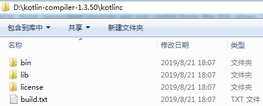
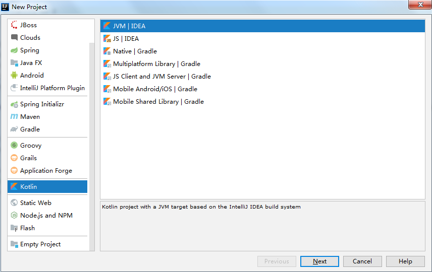
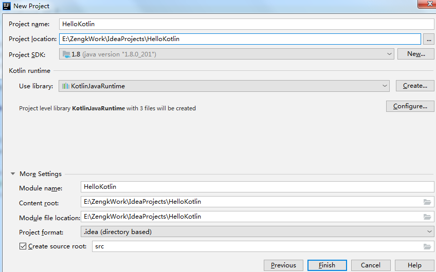
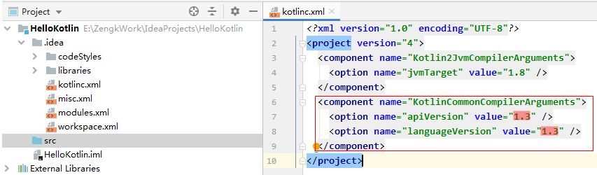
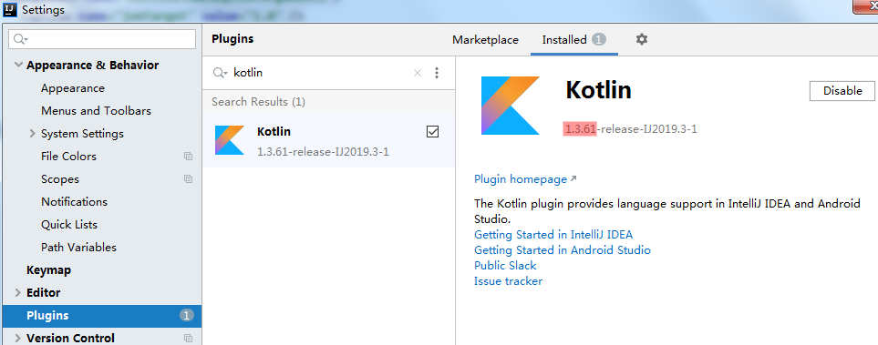
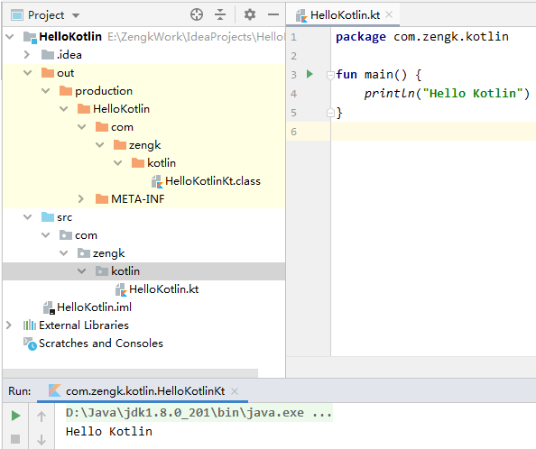
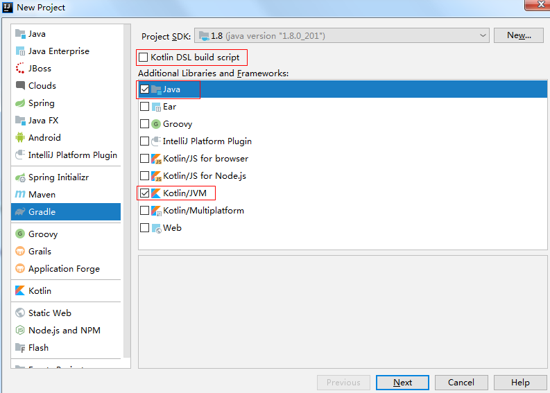
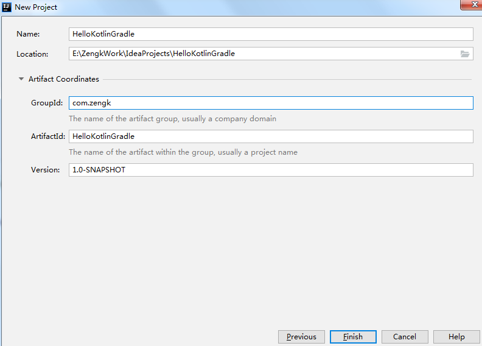
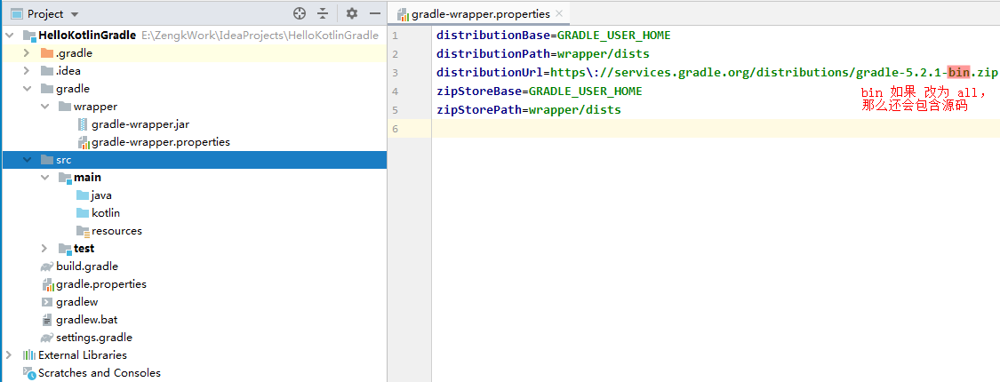
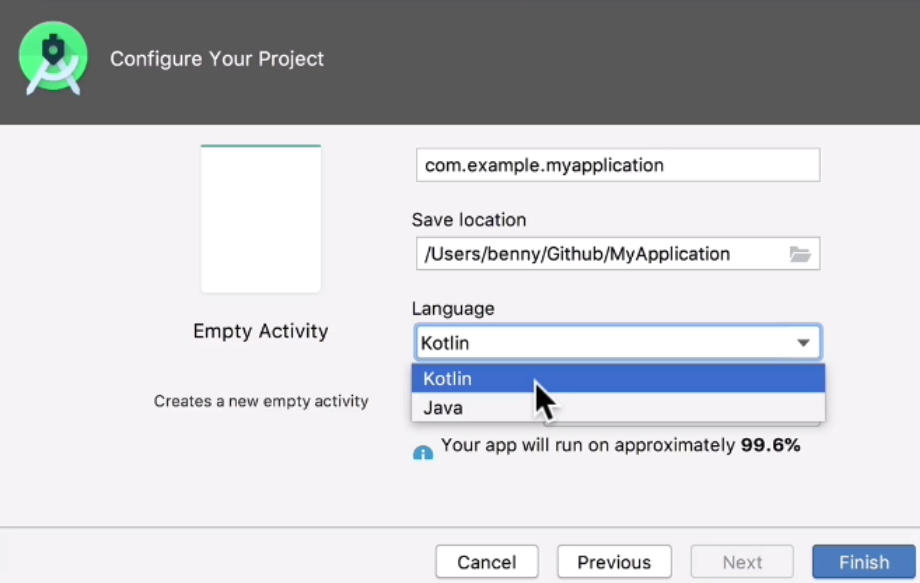

## 1. `Kotlin` 官网

`https://kotlinlang.org/`

## 2. `Kotlin` 命令行工具下载

1. 下载网址： `https://github.com/JetBrains/kotlin/releases/tag/v1.3.50`  
   
    > 切换其他版本，改下版本号即可

2. 下载 `kotlin-compiler-1.3.50.zip` 文件即可

3. 解压 `kotlin-compiler-1.3.50.zip`，得到一个 `kotlinc` 文件夹，其中：

    ```:no-line-numbers
    ./bin/ 目录下存放一些可执行文件，如 kotlin、kotlinc （相当于 java、javac）

    ./lib/ 目录下存放一些依赖的 jar 包文件
    ```

    

## 3. `IntelliJ IDEA` 中创建 `Kotlin` 工程

`IntelliJ IDEA` 中集成了 `Kotlin` 环境，直接创建 `kotlin` 工程即可。

创建 `Kotlin` 工程步骤如下：

1. `File` -> `New` -> `Project`

2. 左侧面板选择 `Kotlin` -> 右侧面板选择 `JVM|IDEA` -> 点击 `Next` 

    

3. 输入 `Project name` -> 选择 `Project location` -> 点击 `Finish` （其他默认配置即可）

    

创建 `Kotlin` 工程后，可以看到：

1. 根目录下的 `src` 文件夹用来存放源码文件

2. 根目录下的 `.idea/kotlinc.xml` 配置文件中指明了该 `Kotlin` 工程所使用的 `kotlin` 版本为 `1.3`

    

在 `Settings` 窗口中的 `Plugin` 面板内搜索 `"kotlin"` ， 可以发现当前的 `IntelliJ IDEA` 版本中集成的 `kotlin` 版本是 `1.3.61`。



### 3.1 编写 `Hello Kotlin`

1. 右键 `src` 文件夹 -> `New` -> `Package` -> 输入包名 （同创建 `Java` 包名一样）

2. 右键包名目录 -> `New` ->` Kotlin File/Class` -> 选择 `File` 类型 并输入文件名 `"HelloKotlin"` -> 在包名目录下创建出一个` HelloKotlin.kt` 文件

3. `HelloKotlin.kt` 文件中编写如下代码：

    ```kotlin:no-line-numbers
    fun main() {
        println("Hello Kotlin")
    }
    ```

4. `build` 工程，然后在运行 `HelloKotlin.kt` 文件即可输出 "`Hello Kotlin`" （`build` 和 `run` 同 `Java` 一样）



### 3.2 `IntelliJ IDEA` 中创建基于 `Kotlin` 的 `Gradle` 工程

在 `Android` 和 `Java` 项目中我们一般都会使用 `Gradle` 来构建项目，所以实际项目一般创建的都是基于 `Kotlin` 的 `Gradle` 工程

> 注意：`Gradle` 基于 `Groovy` 语言，但是在学了 `Kotlin` 语言后，我们还应该知道：**`Gradle` 也可以基于 `Kotlin` 语言**。

创建步骤：

1. `File` -> `New` -> `Project`

2. 左侧面板选择 `Gradle` -> 右侧面板勾选 `Java` 以及 `Kotlin/JVM` -> 点击 `Next`

    > 注意：如果勾选了 "`Kotlin DSL build script`", 则表示 `Gradle` 构建脚本使用 `kotlin` 语言，而不是使用 `Groovy` 语言。（不需要勾选）

    

3. 输入 `Name`（`Gradle` 工程名） -> 选择 `Location` -> 输入 `GroupId` -> 点击 `Finish`

    

#### 3.2.1 `gradle.<version>-bin.zip` 和 `gradle.<version>-all.zip` 的区别



## 4. `AndroidStudio` 中的 `Kotlin` 开发环境

### 4.1 `AndroidStudio` 和 `IntelliJ IDEA` 的版本关系

`AndroidStudio` 是基于 `IntelliJ IDEA` 的。如下图，给出了 `AS` 版本和 `IntelliJ IDEA` 版本的对应关系：


### 4.2 通过 `Gradle` 配置 `Kotlin` 的依赖支持

`AndroidStudio 3.0` 以上版本内置了 `Koltin`。创建 `Android` 工程时语言可以直接选择 `Koltin`：



另外，如果创建 `Android` 工程时，选择的语言是 `Java`，那么可以通过 `Gradle` 配置 使我们的工程支持 `Kotlin`：

1. `Gradle` 添加 `Koltin` 编译插件

    ```groovy:no-line-numbers
    // 在根 Project 的 build.gradle 中配置如下：
    buildscript {
        repositories {
            google()
            jenter()
        }

        dependencies {
            classpath 'org.jetbrains.koltin:koltin-gradle-plugin:1.3.50'
        }
    }
    ```

2. `Gradle` 添加 `Koltin` 标准库依赖

    ```groovy:no-line-numbers
    // 在使用 Koltin 的子 Project 的 build.gradle 中配置如下：

    apply plugin: 'koltin-android'

    dependencies {
        implementation 'org.jetbrains.koltin:koltin-stdlib:1.3.50'
    }
    ```

### 4.3 将 `Java` 文件转换成 `Kotlin` 文件

`AndroidStudio` 中可以将一个 `Java` 文件转成一个 `Kotlin` 文件：

```:no-line-numbers
选中要转换的 `.java` 文件 -> `Code` -> `Convert Java File to Koltin File`
```

    

        