## 1. 基本类型

### 1.1 `Kotlin` 和 `Java` 的基本类型对比

||`Kotlin`|`Java`|
|:-|:-|:-|
|字节|`Byte`|`byte`/`Byte`|
|整型|`Int` & `Long`|`int`/`Integer` & `long`/`Long`|
|浮点型|`Float` & `Double`|`float`/`Float` & `double`/`Double`|
|字符|`Char`|`char`/`Chararcter`|
|字符串|`String`|`String`|

### 1.2 定义变量

#### 1.2.1 `val` 只读变量 & `var` 可读写变量的定义

定义 `val` 变量：

```kotlin:no-line-numbers
val foo: Type = initValue
```

定义 `var` 变量：

```kotlin:no-line-numbers
var foo: Type = initValue
```

其中：

```:no-line-numbers
关键字 val 表示变量 foo 为只读变量（相当于 Java 中被 final 修饰的变量）
关键字 var 表示变量 foo 为可读写变量
Type 表示变量类型
initValue 表示定义变量时的初始化赋值
```

举例：

```kotlin:no-line-numbers
// 相当于 Java 的 final String str = "Hello Kotlin";
val str: String = "Hello Kotlin"  

// 相当于 Java 的  int a = 10;
var a: Int = 10  
```

#### 1.2.2 使用类型推导的方式定义变量（推荐）

```kotlin:no-line-numbers
val foo = initValue
var foo = initValue
```

如上代码所示，在编译时期，`Kotlin` 可以根据初始化赋值自动推导变量的类型，所以定义变量时可以省略变量名后的 "`: Type`"。

举例：

```kotlin:no-line-numbers
// 省略了 ": String"，但是会根据初始值 "Hello Kotlin" 自动推导为 String 类型
var str = "Hello Kotlin"  

// 省略了 ": Int" ，但是会根据初始值 5 自动推导为 Int 类型
var a = 10  
```

> 注意：在 `IntelliJ IEAD` 中，使用快捷键 `Ctrl + Q` 可以看到采用类型推导定义的变量的实际类型。


#### 1.2.3 `Kotlin` 定义 `Long` 类型的变量：

Java 中定义 long 类型变量：

```java:no-line-numbers
long a1 = 12345678910l;
long a2 = 12345678910L;
```

> 如上所示，`Java` 中可以在数值后面使用字母 `L` 将该数值标记为 `long` 类型（**字母不区分大小写**）

Kotlin 中定义 Long 类型变量：

```kotlin:no-line-numbers
val a = 12345678910L
```

> 如上所示，`Kotlin` 中也可以在数值后面使用字母 `L` 将该数值标记为 `long` 类型（**但是只能使用大写的字母 `L`**）

#### 1.2.3 `Kotlin` 定义浮点型的变量：

```kotlin:no-line-numbers
val a = 1.0   // 变量a的类型会自动推导为 Double 类型
val b = 1.0f  // 变量b的类型会自动推导为 Float 类型
```

### 1.3 数值类型转换

#### 1.3.1 `Kotlin` 中不支持 `Int` 类型到 `Long` 类型的隐式转换

`Java` 代码：

```java:no-line-numbers
int i = 10;
long l = i; // 隐式转换，编译通过
```

`Kotlin` 代码：

```kotlin:no-line-numbers
val i: Int = 10
val l: Long = i.toLong() // 不支持隐式转换，只能调用 toXxx 方法显示转换为指定类型
```

#### 1.3.2 `Kotlin` 中不支持 `Float` 类型到 `Double` 类型的隐式转换

```kotlin:no-line-numbers
val a: Double = 1.0f  // 编译报错，应该改为 val c: Double = 1.0f.toDouble()
```

### 1.4 `Kotlin` 特有的无符号类型

和 `Java` 不同的是，`Kotlin` 中存在无符号类型（这应该是为了 `Kotlin-native` 考虑的）

||有符号类型|无符号类型|
|:-|:-|:-|
|字节|`Byte`|`UByte`|
|短整型|`Short`|`UShort`|
|整型|`Int`|`UInt`|
|长整型|`Long`|`ULong`|
|字符串|`String`|`String`|

### 1.5 `Kotlin` 中的字符串

#### 1.5.1 字符串模板（`${xxx}`）

双引号字符串中可以使用 `${变量}` 和 `${表达式}` ， `Kotlin` 中称之为 **字符串模板**。

```kotlin:no-line-numbers
val hello = "Hello Kotlin"
val log = "---> ${hello}"
println(log) // ---> Hello Kotlin
```

```kotlin:no-line-numbers
val a = 2
val b = 3
val ret = "a + b = ${a + b}"
println(ret) // a + b = 5
```

#### 1.5.2 字符串比较（`==` & `===`）

1. 运算符 "`==`" 比较 **字符串内容** 是否相同
   
2. 运算符 "`===`" 比较 **字符串对象** 是否是同一个（内存地址比较）

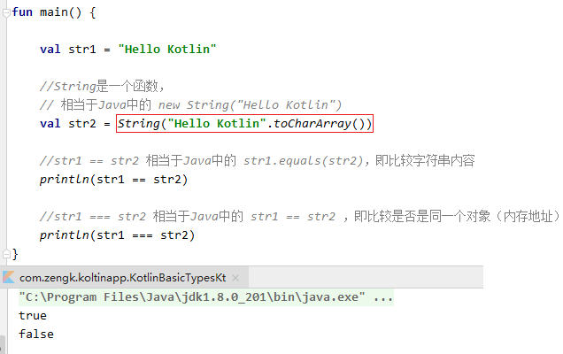

#### 1.5.3 行字符串（`Raw String`）

`Kotlin` 中可以使用 `"""..."""` 包裹多行字符串

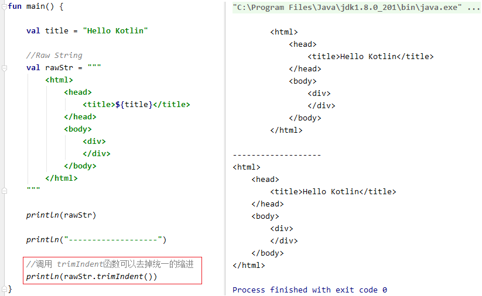

> 注意：调用 `trimIndent()` 函数 可以去掉定义多行字符串时的统一缩进

## 2. 数组

1. 基本类型数组：`Java` 中的基本类型数组 `t[]` 对应 `Kotlin` 中的 `TArray`


2. 类类型数组：`Java` 中的类类型数组 `T[]` 对应 `Kotlin` 中的 `Array<T>`

### 2.1 `Kotlin` 和 `Java` 的数组对比

||`Kotlin`|`Java`|
|:-|:-|:-|
|整型|`IntArray`|`int[]`|
|整型装箱|`Array<Int>`|`Integer[]`|
|字符|`CharArray`|`char[]`|
|字符装箱|`Array<Char>`|`Character[]`|
|字符串|`Array<String>`|`String[]`|

### 2.2 创建基本类型数组（`XxxArray`）

#### 2.2.1 全局函数创建：`xxxArrayOf(e1, e2, ...)`

调用全局函数创建：`xxxArrayOf(e1, e2, ...)`

> 其中 `xxx` 是基本类型，如 `Char` 对应 `char`， `Int` 对应 `int`，`Float` 对应 `float`。

> 返回基本类型数组 `XxxArray`

#### 2.2.2 构造方法创建：`XxxArray(size){...}`

1. 调用构造方法 `XxxArray(size)` 创建指定元素个数的数组，元素值为默认值。

2. 调用构造方法 `XxxArray(size){初始化代码}` 创建指定元素个数的，并对元素进行初始化。

    > 初始化代码中可以使用默认参数 `it`，表示元素索引 `Index`。

#### 2.2.3 示例


### 2.3 创建类类型数组（`Array<Xxx>`）

#### 2.3.1 全局函数创建：`arrayOf(e1, e2, ...)` & `arrayOfNulls<Xxx>(size)`

1. `arrayOf(ele1, ele2, ...)`，其中 `Xxx` 是类类型，返回类类型数组 `Array<Xxx>`

2. `arrayOfNulls<Xxx>(size)`，创建指定元素个数的数组，对象元素值为默认值 `null`

#### 2.3.2 构造方法创建：`Array<Xxx>(size){...}`

调用构造方法 `Array<Xxx>(size){初始化代码}` 创建指定元素个数的，并对元素进行初始化。

> 初始化代码中可以使用默认参数 `it`，表示元素索引 `Index`

#### 2.3.3 示例

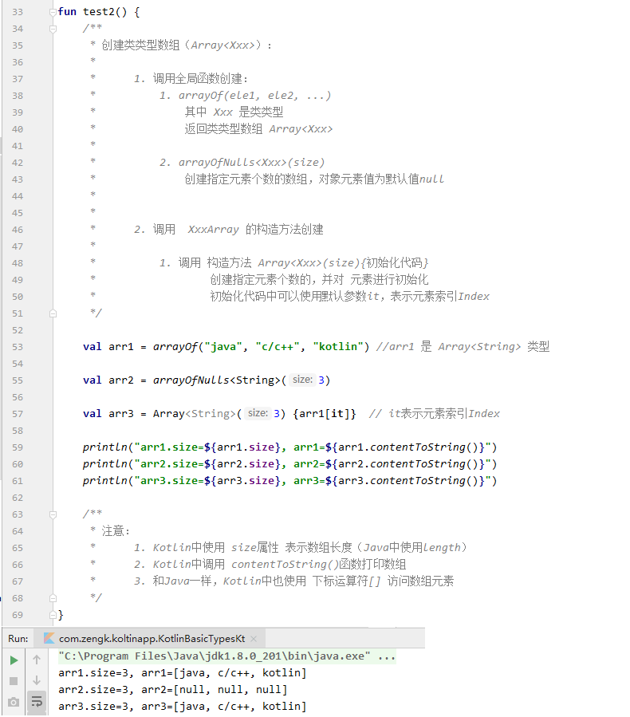

> 注意：
> 
> 1. `Kotlin` 中使用 `size` 属性表示数组长度（`Java` 中使用 `length`）
> 
> 2. `Kotlin` 中调用 `contentToString()` 函数打印数组
> 
> 3. 和 `Java` 一样，`Kotlin` 中也使用下标运算符 `[]` 访问数组元素

### 2.4 遍历数组（`for-in` 循环 & `forEach` 函数）

`Java` 中可以使用 `foreach` 循环遍历数组

```java:no-line-numbers
for(T ele : arr) {}
```

`Kotlin` 中：

1. 可以使用 `for-in` 循环遍历数组

    ```kotlin:no-line-numbers
    for(ele in arr) {}  // 不需要显示指定元素类型
    ```

2. 还可以使用 `forEach` 函数遍历数组

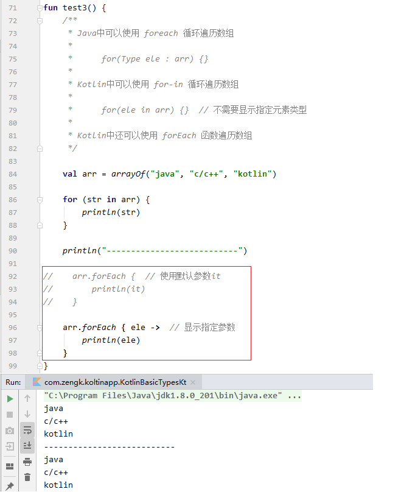

### 2.5 判断元素是否存在（`in` & `!in`）

判断元素是否存在:

1. `if(ele in arr)`：元素 `ele` 存在则返回 `true`

2. `if(ele !in arr)`：元素 `ele` 不存在则返回 `true`

> 其实就是在调用 `contains` 函数判断元素是否存在。


## 3. 区间

### 3.1 创建闭区间（`beginEle..endEle`）

```kotlin:no-line-numbers
val range = beginEle..endEle  // [beginEle, endEle]
```

> 注意：调用 `joinToString()` 函数可以打印区间

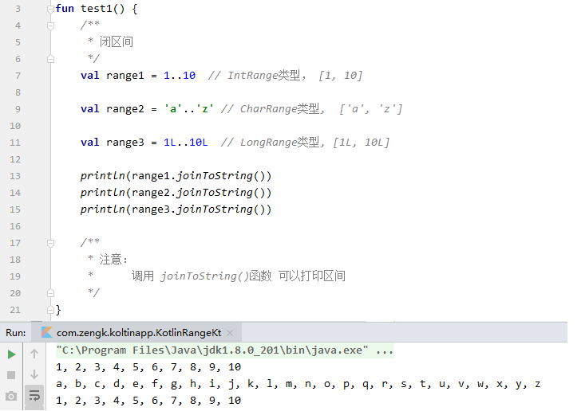

### 3.2 创建前闭后开区间（`beginEle until endEle`）

```kotlin:no-line-numbers
val range = beginEle until endEle  // [beginEle, endEle)
```

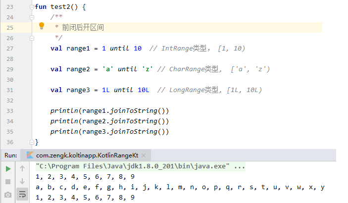

### 3.3 创建倒序闭区间（`endEle downTo beginEle`）

```kotlin:no-line-numbers
val range = endEle downTo beginEle
```

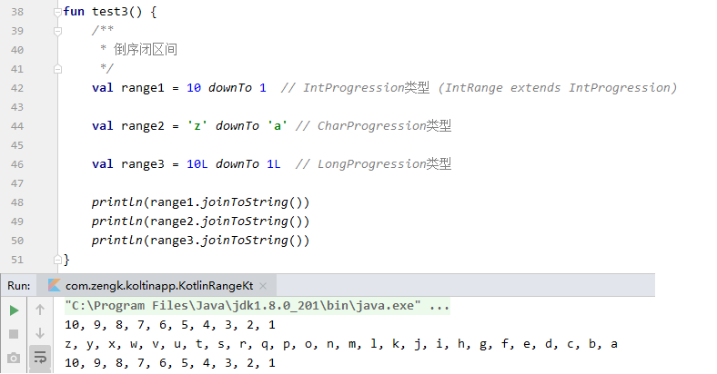

### 3.4 指定区间步长（`step`）

```kotlin:no-line-numbers
val range = beginEle..endEle step value  // 步长为value
```


### 3.5 遍历区间（`for-in` 循环 & `forEach` 函数）

语法：

```kotlin:no-line-numbers
val range = beginEle..endEle

// 1. for-in 循环遍历
for(ele in range) {} 

// 2. forEach 函数遍历
range.forEach {
    // 默认参数 it 表示当前遍历到的元素
}
```


### 3.6 判断元素是否存在（`in` & `!in`）

语法：

```kotlin:no-line-numbers
if(ele in range) {} // 元素 ele 存在，则为 true

if(ele !in range) {} // 元素 ele 不存在，则为 true
```

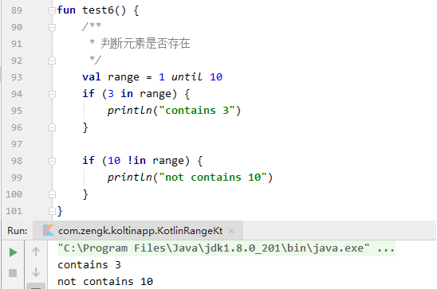

### 3.7 通过区间实现按索引遍历数组（`arr.indices` & `0 until arr.size`）

语法：

```kotlin:no-line-numbers
for(i in arr.indices) {}  // arr.indices 返回 IntRange 类型的区间， arr.indices 相当于 0 until arr.size
```


### 3.8 离散区间 & 连续区间

1. 若 `beginEle` 和 `endEle` 是整型，则称为 **离散区间**。

2. 若 `beginEle` 和 `endEle` 是浮点型，则称为 **连续区间**。

> 注意：
> 
> 1. 不能指定连续区间的步长 `step`。
> 
> 2. 不能遍历连续区间。

## 4. 集合框架

### 4.1 `Kotlin` 集合框架的特点

1. `Kotlin` 增加了 **不可变** 集合框架的接口；

2. `Kotlin` 只是复用了 `Java API` 的集合类型，没有另外定义新的集合类型；

3. `Kotlin` 提供了大量的易于使用的函数，例如 `forEach`/`map`/`flatMap`；

4. `Kotlin为` 集合框架提供了运算符级别的支持，简化了集合框架的使用。

### 4.2 `Kotlin` 和 `Java` 的集合框架接口对比

<table>
  <tr align="left">
    <th></th>
    <th>Kotlin</th>
    <th>Java</th>
  </tr>
  <tr>
    <td>不可变 List</td>
    <td>List&lt;T&gt;</td>
    <td rowspan="2">List&lt;T&gt;</td>
  </tr>
  <tr>
    <td>可变 List</td>
    <td>MutableList&lt;T&gt;</td>
  </tr>
  <tr>
    <td>不可变 Map</td>
    <td>Map&lt;K,  V&gt;</td>
    <td rowspan="2">Map&lt;K,  V&gt;</td>
  </tr>
  <tr>
    <td>可变 Map</td>
    <td>MutableMap&lt;K, V&gt;</td>
  </tr>
  <tr>
    <td>不可变 Set</td>
    <td>Set&lt;T&gt;</td>
    <td rowspan="2">Set&lt;T&gt;</td>
  </tr>
  <tr>
    <td>可变 Set</td>
    <td>MutableSet&lt;T&gt;</td>
  </tr>
</table>

#### 4.2.1 可变集合 & 不可变集合

`Kotlin` 中的 **可变** 和 **不可变** 集合，编译时都会转化为 `Java` 中对应的集合。

`Kotlin` 中的不可变集合就是集合创建后，不能再修改集合。

#### 4.2.2 `Kotlin` 中的部分集合类型只是 `Java` 集合类型的别名

在 `Koltin` 中的部分集合类型，其实只是 `Java` 集合类型的一个别名而已，如下图：

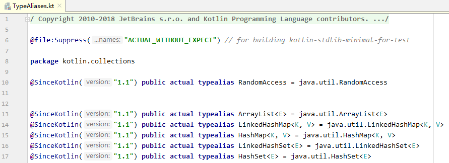

> 在 `Koltin` 中，通过 `typealias` 关键字为 `Java` 集合类型起了个类名相同的别名，只是包名不同而已。
> 
> `Koltin` 这样做的目的是：为了让开发者使用 `Koltin` 中定义的类型，而不要在 `Koltin` 中使用 `Java API`，
> 
> 从而可以在除 `JVM` 平台之外的其他平台上运行 `Kotlin` 代码。

### 4.3 `List` 集合

#### 4.3.1 创建 `List` 集合

##### 4.3.1.1 创建不可变的 `List` 集合（`listOf`）

```kotlin:no-line-numbers
val list = listOf(ele1, ele2, ele3, ...)  // 不可变List集合没有提供 add 和 remove方法
```

##### 4.3.1.2 创建可变的 `List` 集合（`mutableListOf`）

```kotlin:no-line-numbers
val list = mutableListOf(ele1, ele2, ele3, ...)  // 可变的MutableList集合提供了 add 和 remove方法
```

##### 4.3.1.3 通过构造方法创建 `ArrayList` 集合

```kotlin:no-line-numbers
val list = ArrayList<T>()  // 相当于Java中的 List<T> list = new ArrayList<>();
```

> 注意：这里的 `ArrayList` 是 `kotlin.collections.ArrayList`，而不是 `Java` 中的 `ArrayList`。

##### 4.3.1.4 示例

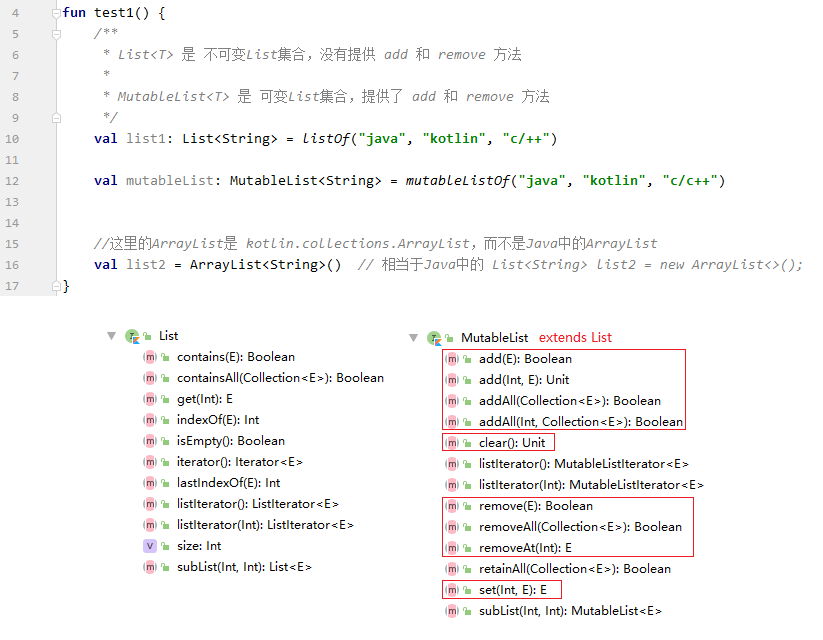

#### 4.3.2 `List` 集合元素的增删（`add`/`+=`，`remove`/`-=`）

1. `List` 集合中添加元素：

    ```kotlin:no-line-numbers
    list.add(ele)
    或
    list += ele
    ```

1. `List` 集合中删除元素：

    ```kotlin:no-line-numbers
    list.remove(ele)
    或
    list -= ele
    ```

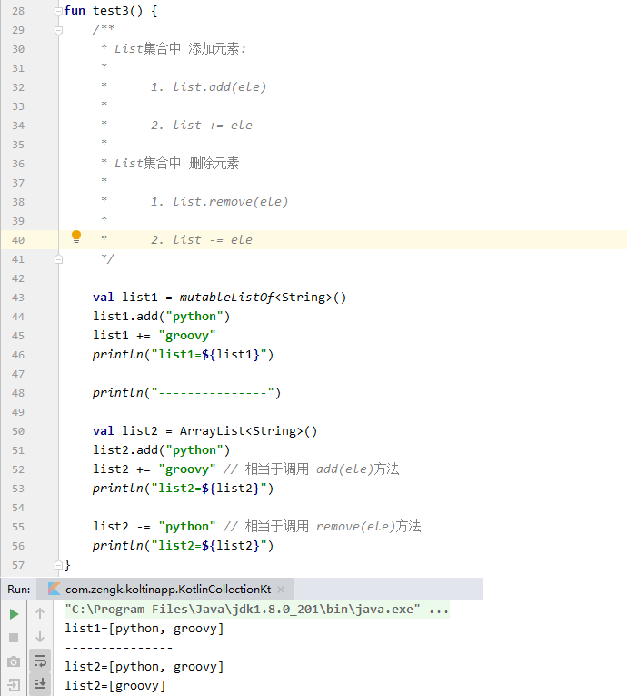

#### 4.3.3 访问 `List` 集合元素（`get`/`set`/`[]`）

1. 获取指定索引位置的元素：

    ```kotlin:no-line-numbers
    val ele = list.get(index)
    或
    val ele = list[index]
    ```

2. 修改指定索引位置的元素：

    ```kotlin:no-line-numbers
    list.set(index, eleValue)
    或
    list[index] = eleValue
    ```

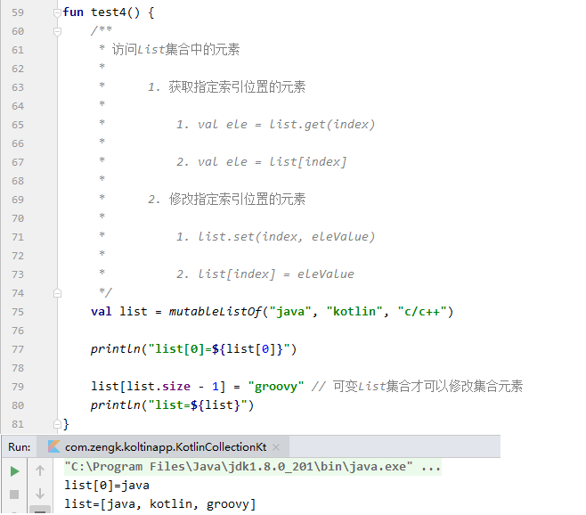

### 4.4 `Map` 集合

#### 4.4.1 创建 `Map` 集合


##### 4.4.1.1 创建不可变的 Map 集合（`mapOf`）

```kotlin:no-line-numbers
val map = mapOf(K1 to V1, K2 to V2, K3 to V3, ...)  // K to V  表示创建一个键值对
```

##### 4.4.1.2 创建可变的 Map 集合（mutableMapOf`）

```kotlin:no-line-numbers
val map= mutableMapOf(K1 to V1, K2 to V2, K3 to V3, ...)
```

##### 4.4.1.3 通过构造方法创建 `HashMap` 集合

```kotlin:no-line-numbers
val map = HashMap<K, V>() // 相当于Java中的 Map<K, V> map = new HashMap<>()
```

> 这里的 `HashMap` 是 `kotlin.collections.HashMap`，而不是 `Java` 中的 `HashMap`

##### 4.4.1.4 示例（`Kotlin` 中的类型 `Any` 相当于 `Java` 中的类型 `Object`）

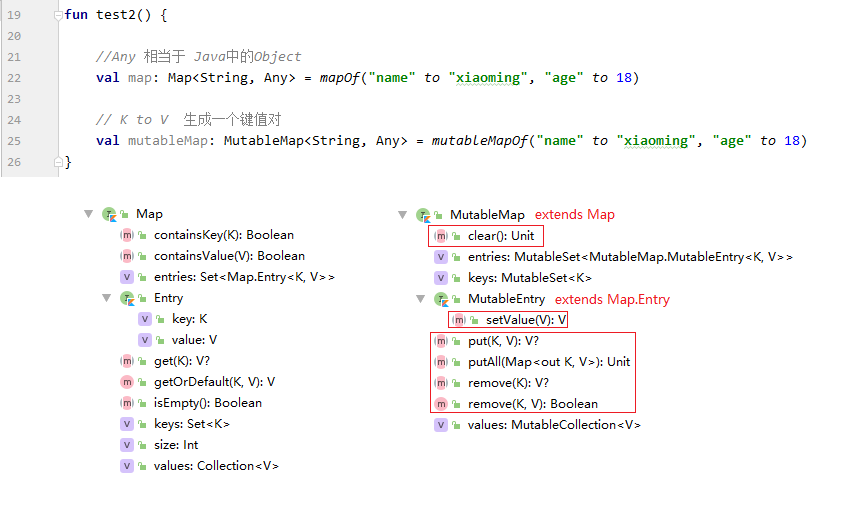

#### 4.4.2 操作 `Map` 集合

##### 4.4.2.1 添加键值对（`put`/`[]`）

```kotlin:no-line-numbers
map.put(key, value)
或
map[key] = value
```

##### 4.4.2.2 删除键值对（`remove`）

```kotlin:no-line-numbers
map.remove(key)
```

##### 4.4.2.3 访问键值对（`get`/`[]`）

```kotlin:no-line-numbers
val value = map.get(key)
或
val value = map[key]
```

##### 4.4.2.4 示例

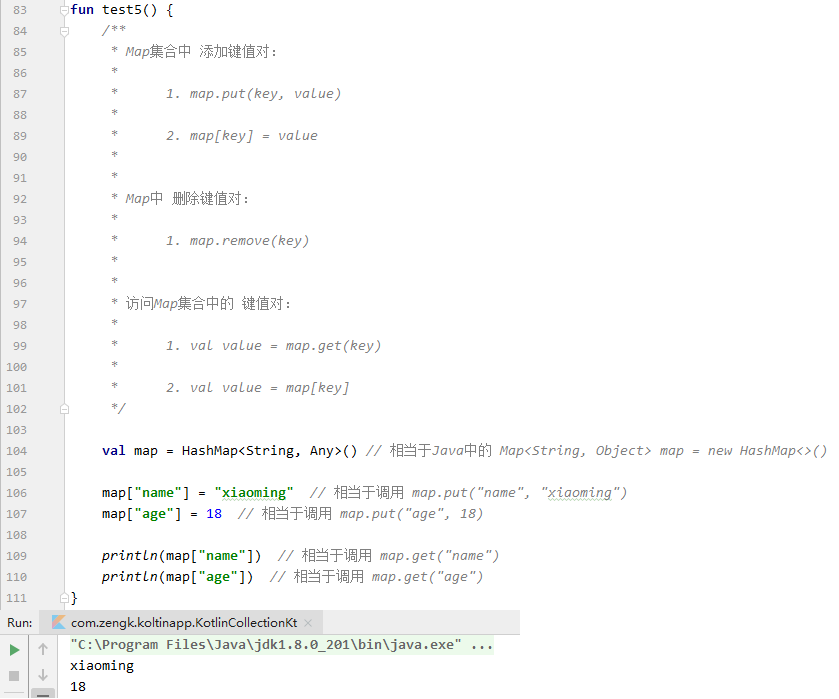

### 4.5 二元对组 `Pair`

#### 4.5.1 `Pair` 的创建方式：`key to value`/`Pair(key, value)`

```kotlin:no-line-numbers
val pair = key to value
或
val pair = Pair(key, value)
```

#### 4.5.2 `Pair` 的访问方式：`pair.first|second`/`val (key, value) = pair`

```kotlin:no-line-numbers
val key = pair.first  
val value = pair.second
```

或：

```kotlin:no-line-numbers
val (key, value) = pair 

注意：之所以支持这种操作方式，是因为 Pair 类中定义了运算符重载函数 component1 和 component2
```

#### 4.5.3 运算符重载函数 `component1` & `component2`

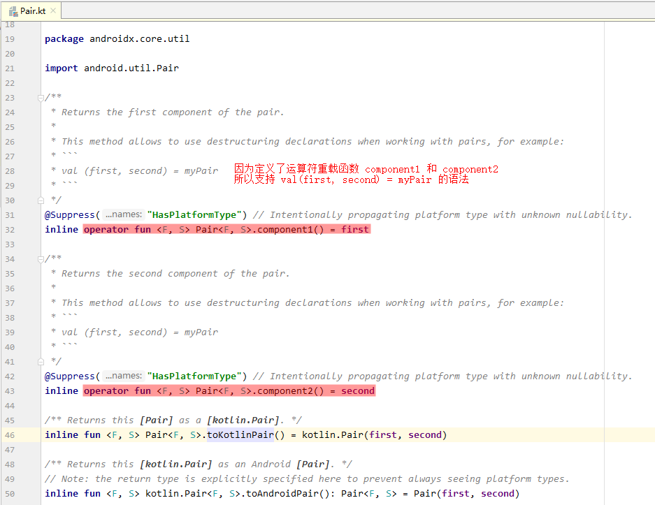

#### 4.5.4 示例

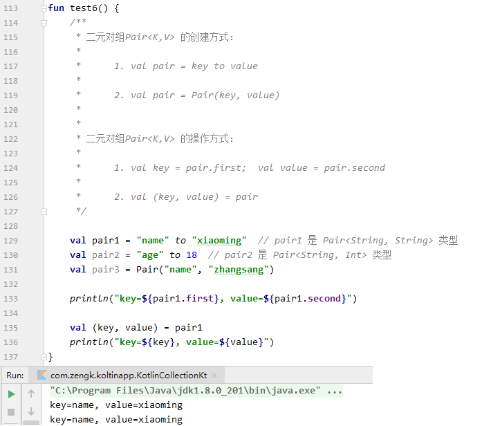

### 4.6 三元对组 `Triple`

#### 4.6.1 `Triple` 的创建方式：`Triple(a, b, c)`

```kotlin:no-line-numbers
val triple = Triple(a, b, c)
```

#### 4.6.2 `Triple` 的访问方式：`triple.first|second|third`/val (a, b, c) = triple

```kotlin:no-line-numbers
val a = triple.first
val b = triple.second
val c = triple.third
```

或

```kotlin:no-line-numbers
val (a, b, c) = triple

注意：之所以支持这种操作方式，是因为 Triple 类中定义了运算符重载函数 component1、component2、component3
```

#### 4.6.3 运算符重载函数 `component1` & `component2` & `component3`

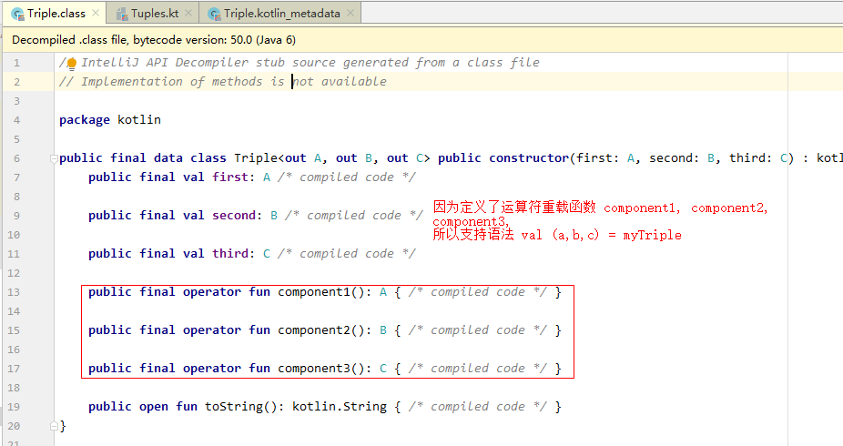

#### 4.6.4 示例

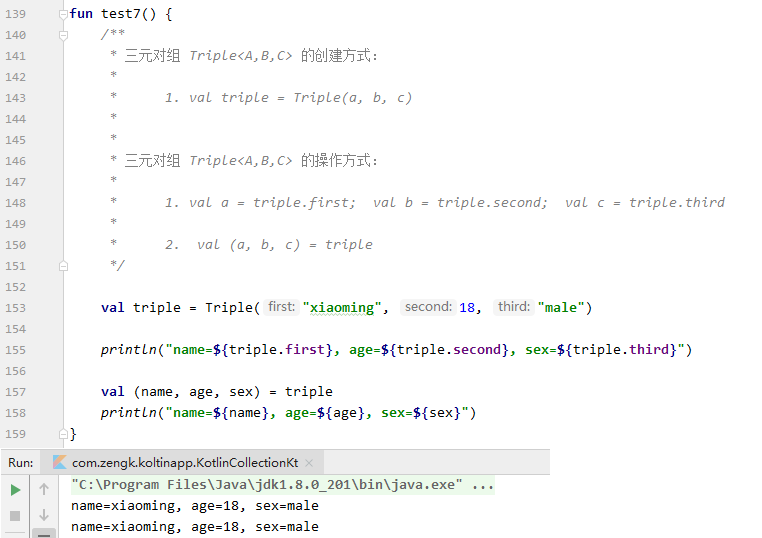

## 5. 函数（函数也是一种类型）

`Kotlin` 中，**函数也是一种类型**。

### 5.1 函数的定义

函数的定义语法：

```kotlin:no-line-numbers
fun funName(param1: Type1, param2: Type2, ...): ReturnType {
    //函数体
}

其中，若返回值类型为 Unit（相当于 Java 中的 void），则可以省略，即：

fun funName(...): Unit {}  <==>  fun funName(...) {}
```

### 5.2 函数类型

#### 5.2.1 全局函数的函数类型：(T1, T2, ...) -> ReturnType

```kotlin:no-line-numbers
函数定义：fun funName(p1: T1, p2: T2, ...): ReturnType {}
对应函数类型：(T1, T2, ...) -> ReturnType

特别地：

无参函数：fun funName(): ReturnType {}  
对应函数类型： () -> ReturnType

无返回值函数：fun funName(p1: T1, p2: T2, ...) {} 
对应函数类型为：(T1, T2, ...) -> Unit

无参无返回值函数：fun funName() {}  
对应函数类型为：() -> Unit
```

#### 5.2.2 成员方法的函数类型：(Foo, T1, T2,...) -> ReturnType

方法可以看成是一个特殊的函数，**方法的函数类型需要指定其所属的类**。

```kotlin:no-line-numbers
方法定义：
    class Foo {
        fun methodName(p1: T1, p2: T2, ...): ReturnType {}
    }

对应函数类型：
    Foo.(T1, T2, ...) -> ReturnType  // 其中，Foo 称为方法的 Receiver

注意：
Java 中的非静态成员方法中有个隐式的 this，这个 this 就是方法的调用者，Java 内部是通过函数参数传到方法中的。
在 Kotlin 中，方法的 Receiver 对象就是 this，因为 this 是通过函数参数传入的，所以：
    Foo.(T1, T2,...) -> ReturnType  还可以写成  (Foo, T1, T2,...) -> ReturnType
```

#### 5.2.3 函数类型的几种写法

```kotlin:no-line-numbers
Foo.(T1, T2, ...) -> ReturnType 
等价于
(Foo, T1, T2, ...) -> ReturnType 
等价于
FuntionN<Foo, T1, T2, ... , ReturnType>  // 其中 N 表示 <...> 中除去 ReturnType 之外的其他参数的总个数
```

如上是以成员方法的函数类型举例，但同样适用于全局函数的函数类型，即：

```kotlin:no-line-numbers
(T1, T2, ...) -> ReturnType
等价于
FuntionN<T1, T2, ... , ReturnType>
```

### 5.3 函数引用 & 运算符 "`::`"

在 `c/c++` 中，函数名就是一个指针常量，表示函数的入口地址，可以把函数名作为地址值赋给函数指针。

但是在 `Kotlin` 中，不能直接将函数名作为地址值直接赋给函数类型的变量，而是应该将 **函数引用** 赋给函数类型的变量。

`Kotlin` 中，通过运算符 "`::`" 来获取函数引用。

#### 5.3.1 全局函数的函数引用（`::funName`）

```kotlin:no-line-numbers
若有函数定义：
    fun funName(p1: T1, p2: T2, ...): ReturnType {}
则函数引用为：
    ::funName
```

#### 5.3.2 成员方法的函数引用（`Foo::methodName`/`foo::methodName`）

获取成员方法的函数引用有两种方式：

1. 通过类名来获取函数引用；

    ```kotlin:no-line-numbers
    若有方法定义：
        class Foo  {
            fun methodName(p1: T1, p2: T2, ...): ReturnType {}
        }
    则函数引用为:
        Foo::methodName
    ```

2. 通过对象来获取函数引用。

    ```kotlin:no-line-numbers
    若有：
        val foo = Foo()
    则函数引用为:
        foo::methodName
    ```

#### 5.3.3 将函数引用赋给函数类型的变量

##### 5.3.3.1 将全局函数的函数引用赋给函数类型的变量

```kotlin:no-line-numbers
定义函数 funName
    fun funName(p1: T1, p2: T2, ...): ReturnType {}

将函数引用 ::funName 赋给 (T1,T2,...) -> ReturnType 类型的变量 fun1
    val fun1: (T1,T2,...) -> ReturnType = ::funName

因为根据函数引用 ::funName 可以推导出变量 fun1 的函数类型，所以可省略定义变量 fun1 时的类型声明
    val fun1 = ::funName
```

##### 5.3.3.2 将成员方法的函数引用赋给函数类型的变量

```kotlin:no-line-numbers
定义方法 methodName
    class Foo {
        fun methodName(p1: T1, p2: T2, ...): ReturnType {}
    }

将函数引用 Foo::methodName 赋给 (Foo,T1,T2,...) -> ReturnType 类型的变量 fun2
    val fun2: (Foo,T1,T2,...) -> ReturnType = Foo::methodName

因为根据函数引用 Foo::methodNamee 可以推导出变量 fun2 的函数类型，所以可省略定义变量 fun2 时的类型声明
    val fun2 = Foo::methodName
```

##### 5.3.3.3 类名获取的函数引用和对象获取的函数引用对应的函数类型不同

```kotlin:no-line-numbers
通过类名获取的函数引用时，因为函数引用 Foo::methodName 对应的函数类型是 (Foo, T1, T2,...) -> ReturnType
所以通过变量 fun2 调用方法 methodName 时，参数 1 必须传入一个 Foo 对象作为方法的 Receiver（也就是方法内部的 this）

通过对象获取的函数引用时，因为对于：
    val foo = Foo()
    val fun3 = foo::methodName  
此时，变量 fun3 的函数类型是 (T1, T2, ...) -> ReturnType
从函数类型的形参列表中可以看出，通过变量 fun3 调用方法 methodName 时，不需要传入 Foo 类型的参数了。
```

### 5.4 通过函数类型的变量调用函数：`()`/`invoke`

```kotlin:no-line-numbers
对于函数类型的变量 funRef：
    val funRef: (T1, T2, T3, ...) -> ReturnType = ::funName

通过该变量调用函数有2种方式：
    1. funRef(t1, t2, t3, ...)
    2. funRef.invoke(t1, t2, t3, ...)
```

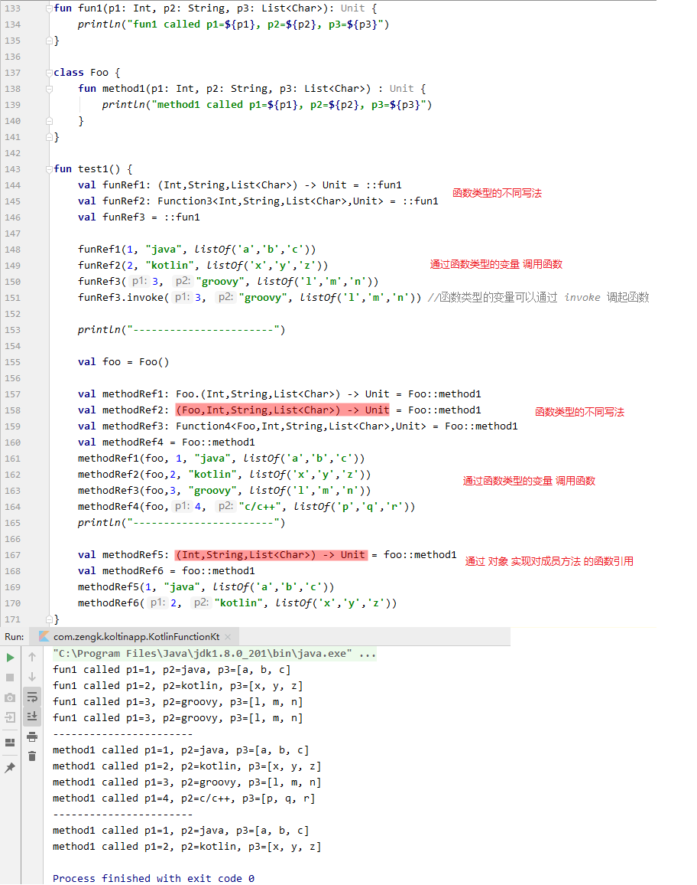

### 5.5 带可变参数的函数定义

#### 5.5.1 两种定义方式：`args: Array<String>`/`vararg args: String`

```kotlin:no-line-numbers
定义方式 1：
    fun funName(args: Array<String>) {}  // 相当于 Java 中的 (String[] args)

定义方式 2：
    fun funName(vararg args: String) {}  //  相当于 Java 中的 (String... args)
```

> 其中关键字 `vararg` 用来声明形参 `args` 是一个可变参数。

#### 5.5.2 `main` 函数的两种写法（无参数/可变参数）

1. 无参的 `main` 函数：

    ```kotlin:no-line-numbers
    fun main() {}
    ```

2. 带可变参数的 `main` 函数：

    ```kotlin:no-line-numbers
    fun main(vararg args: String) {}
    ```

### 5.6 结合对组类型定义多返回值的函数

#### 5.6.1 返回值为二元对组的函数定义

```kotlin:no-line-numbers
fun funName(p1: T1, p2: T2, ...): Pair<RT1, RT2> {
    ...
    return Pair(rt1, rt2)
}

// 调用
val (a, b) = funName(p1, p2, ...)
```

#### 5.6.2 返回值为三元对组的函数定义

```kotlin:no-line-numbers
fun funName(p1: T1, p2: T2, ...): Triple<RT1, RT2, RT3> {
    ...
    return Triple(rt1, rt2, rt3)
}

// 调用
val (a, b, c) = funName(p1, p2, ...)
```

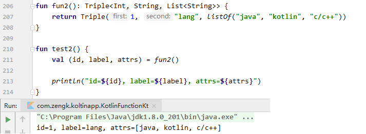

### 5.7 带默认参数值的函数定义

```kotlin:no-line-numbers
fun funName(p1: T1, p2: T2, ..., pm: Tm = defaultValue1, pn: Tn = defaultValue2, ...): ReturnType {}
```

注意：具体默认参数值的形参建议 **声明在形参列表的最后面**，否则调用函数时编译器推断不出实参所对应的形参是哪个。

当然，在调用时可以通过 **显示指定形参名** 来避免这种问题，如：

```kotlin:no-line-numbers
fun funName(p1: T1 = defvalue1, p2: T2, p3: T3 = defValue3): ReturnType {}

// 调用
funName(value2) // 编译报错，无法确定实参 value2 对应哪个形参
funName(p2 = value2) // 编译成功，通过显示指定形参名 p2，将实参 value2 赋给形参 p2        
```

### 5.8 案例：四则运算计算器

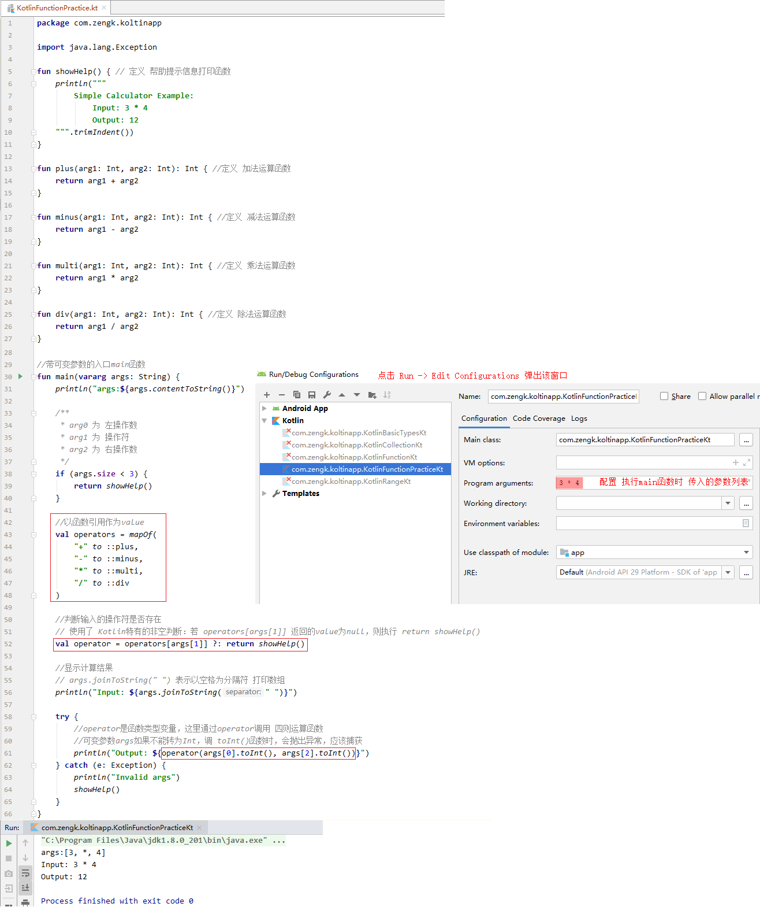