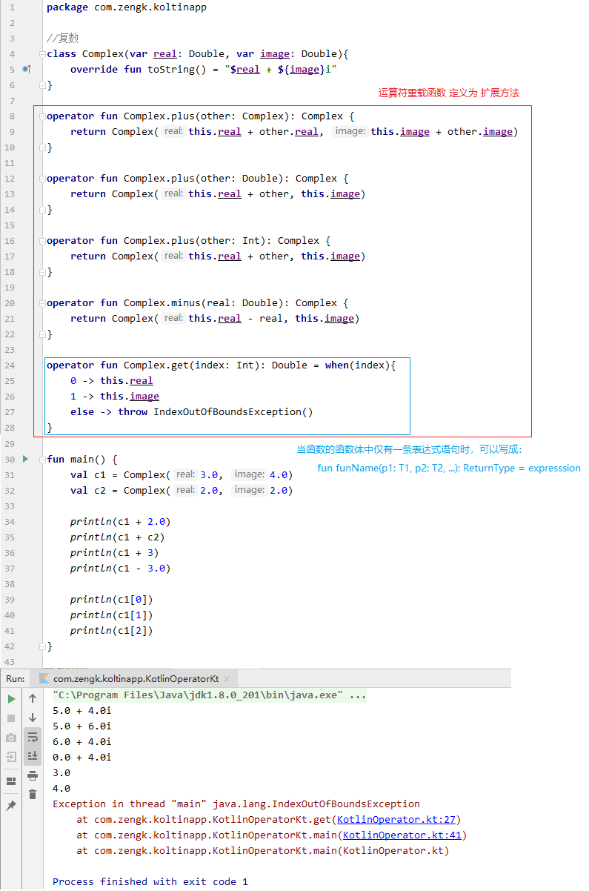

## 1. 常量 & 变量

### 1.1 可读写变量（`var`）

```kotlin:no-line-numbers
var x = initValue // x 称为可读写变量
```

注意：当 `var` 声明的变量做成员属性时，默认提供 `setter`/`getter` 方法。

### 1.2 只读变量（`val`）

```kotlin:no-line-numbers
val x = initValue // x 称为只读变量
```

注意：
1. 当 `val` 声明的变量做成员属性时，默认只提供 `getter` 方法。
2. 当 `val` 声明的变量做全局变量或局部变量时，相当于 `Java` 中被 `final` 修饰的常量。

### 1.3 常量（`const val`）

```kotlin:no-line-numbers
const val x = initValue // x  称为常量
```

注意：
1. `const` 修饰的常量只能定义在全局范围内。
2. `const` 只能修饰基本类型的变量。
3. `const` 修饰的变量的初始值只能是字面量。

### 1.4 常量引用

常量引用即：使用 `val` 声明的类类型的变量。

```kotlin:no-line-numbers
val p = Person("xiaoming") 
```

其中： 
1. `Person` 对象创建在堆区，变量 `p` 被 `val` 修饰，是一个常用引用。
2. 由于 `p` 是常用引用，所以不能修改 `p` 的指向，但可以修改 `p` 对象中的成员。

## 2. `if-else` 表达式

`Java` 中 `if-else` 只是一个语句，对应一个三目运算符 "`?:`" 构成的条件表达式 `express ? statement1 : statement2`

`Kotlin` 中 `if-else` 即是一个语句，又可以作为一个表达式使用。

> 所以 `Kotlin` 中没有三目运算符 "`?:`" 构成的条件表达式 `express? statement1: statement2`

```kotlin:no-line-numbers
// if-else 语句
if(express) {
    statement1
} else {
    statement2
}

// if-else 表达式
val x = if (express) statement1 else statement2 // if-else 表达式可以返回结果值
```

## 3. `when` 表达式

`Kotlin` 中的 `when` 表达式跟 `while` 循环语句没有任何关系。

### 3.1 `Kotlin` 中的 `when` 表达式相当于 `Java` 中的 `switch` 语句

`Java` 中：

```java:no-line-numbers
swtich(a)  {
    case 0:
        c = 5
        break;
    case 1:
        c = 100
        break;
    default:
        c = 20;
}
```

`Kotlin` 中：

```kotlin:no-line-numbers
when(a) {
    0 -> c = 5
    1 -> c = 100
    else -> c = 20
}
```

其中：

```:no-line-numbers
1. value -> 相当于 Java 中的 case value:
2. else -> 相当于 Java 中的 default:
3. 省略了 break 语句
```

由于 `when(condition){...}` 是一个表达式，而表达式总会有结果值，所以还可以写成：

```kotlin:no-line-numbers
// "->" 后面的就是when表达式的结果值
c = when(a) {
    0 -> 5
    1 -> 100
    else -> 20
}
```

### 3.2 `when` 表达式的条件可以放到代码块的分支中

```kotlin:no-line-numbers
when {
    // 条件表达式 x is String 保证了 x 是不可空类型 String，所以 Kotlin 会把变量 x 智能转换为不可空类型 String
    x is String -> c = x.length 
    x == 1 -> c = 100
    else -> c = 20
}
```

同样地，由于 `when` 是一个表达式，会返回结果值，所以还可以写成：

```kotlin:no-line-numbers
c = when {
    x is String -> x.length
    x == 1 -> 100
    else -> 20
}
```

### 3.3 `when` 表达式的条件可以是一条赋值语句

```kotlin:no-line-numbers
c = when(val input = readLine()) { //变量 input 作为条件变量
    null -> 0  // input 为空时，when 表达式返回0
    else -> input.length // input 不为空时，when 表达式返回 input.length
}
```

## 4. `try-catch` 表达式

`Kotlin` 中的 `try-catch` 既可以作为语句，也可以作为表达式：

1. 作为 `try-catch` 语句时，用法基本同 `Java` 一样：

    ```kotlin:no-line-numbers
    try {
        c = a/b
    } catch (e: Exception) { // Kotlin中的参数声明一般是 "参数名: 参数类型"， Java中则是 "参数类型 参数名"
        e.printStackTrace()
        c = 0
    }
    ```

2. 作为 `try-catch` 表达式时，最后一条执行语句的结果作为返回结果值：

    ```kotlin:no-line-numbers
    c = try {
        a/b
    } catch (e: Exception) {
        e.printStackTrace()
        0
    }
    ```

## 5. 运算符重载

`Kotlin` 官方文档：`https://kotlinlang.org/docs/operator-overloading.html`

> 可重载的运算符仅限 `Kotlin` 官方文档中指定的运算符。

### 5.1 运算符重载函数定义

1. 运算符重载函数定义时需要加关键字 `operator`

2. 运算符重载函数可以是：全局函数、或成员方法、或扩展方法

3. 子类重写父类的运算符重载函数时，可以省略关键字 `operator`

### 5.2 运算符和运算符重载函数的对应关系

1. `==` 对应 `equals`

    ```kotlin:no-line-numbers
    "str1" == "str2"  <==>  "str1".equals("str2")
    ```

2. `+` 对应 `plus`

    ```kotlin:no-line-numbers
    a + b  <==>  a.plus(b)
    ```

3. `in` 对应 `contains`

    ```kotlin:no-line-numbers
    element in list  <==>  list.contains(element)
    ```

4. `[]` 对应 `get`

    ```kotlin:no-line-numbers
    val value = map[key]  <==>  val value = map.get(key)
    ```

5. `[]` 对应 `set`

    ```kotlin:no-line-numbers
    map[key] = value  <==>  map.set(key, value)
    ```

6. `>` 对应 `compareTo`

    ```kotlin:no-line-numbers
    a > b  <==>  a.compareTo(b) > 0  // <, >=, <= 与之类似
    ```

7. `()` 对应 `invoke`

    ```kotlin:no-line-numbers
    // func 为匿名函数
    val func = fun(p1: T1, p2: T2, ...): ReturnType {...}
    func(p1, p2, ...)  <==>  func.invoke(p1, p2, ...)
    ```

### 5.3 示例



## 6. 函数体只有一条表达式时的简写形式

当函数的函数体中仅有一条表达式语句时，可以简写成：

```kotlin:no-line-numbers
fun funName(p1: T1, p2: T2, ...): ReturnType = expresssion
```

## 7. 中缀表达式

中缀表达式对应一个被关键字 `infix` 修饰的函数。

> 关键字 `infix` 修饰的函数只能是成员方法或扩展方法。

示例 `1`：

```kotlin:no-line-numbers
/* 函数定义 */ 

// 函数体只有一个表达式 "Pair(this, that)", 所以可以写成简化形式
public infix fun <A, B> A.to(that: B): Pair<A, B> = Pair(this, that)  

/* 函数调用 */ 

// 其中，简化形式 2 to 3 称为中缀表达式
2 to 3  <==>  2.to(3)  
```

示例 `2`：

```kotlin:no-line-numbers
/* 函数定义 */ 
infix fun String.minus(len: Int): String = this.substring(len until length)

/* 函数调用 */ 

// 其中简化形式 "HelloKoltin" minus 5 称为中缀表达式
val str = "HelloKotlin" minus 5  <==>  val str = "HelloKotlin".minus(5)  
```

## 8. 匿名函数

对于普通函数：

```kotlin:no-line-numbers
// 其中 funName 称为函数名
fun funName(p1: T1, p2: T2, ...): ReturnType {...}  
```

对应的匿名函数为：

```kotlin:no-line-numbers
// 其中 funRef 是函数类型为 (T1, T2, ...) -> ReturnType 的变量，接收一个匿名函数的函数引用
val funRef = fun()(p1: T1, p2: T2, ...): ReturnType {...}  
```

## 9. `Lambda` 表达式

### 9.1 `Java` 中的 `Lambda` 表达式

#### 9.1.1 什么是函数式接口

只有一个抽象方法的接口称为函数式接口，如 `Runnable` 接口（只有一个抽象方法 `run`）。

#### 9.1.2 `Java` 中的 `Lambda` 表达式与函数式接口的关系

1. `Java` 中的 `Lambda` 表达式就是用来代替用于创建函数式接口对象的匿名内部类
2. `Java` 中的 `Lambda` 表达式其实就是函数式接口的抽象方法的匿名函数实现
3. `Java` 中的 `Lambda` 表达式的结果值就是一个函数式接口的实例对象

总的来说：`Java` 中的 `Lambda` 表达式其实就是一个匿名函数，这个匿名函数就是函数式接口的抽象方法。也就是说，`Java` 中的 `Lambda` 表达式就是在重写函数式接口的抽象方法。但是整个 `Lambda` 表达式的结果值，并不是函数式接口的抽象方法返回值，而是一个函数式接口的实例对象。

#### 9.1.3 `Java` 中的 `Lambda` 表达式的使用场景

1. 将 `Lambda` 表达式赋给函数式接口类型的变量；

2. 将 `Lambda` 表达式作为函数式接口类型参数的实参；

3. 将 `Lambda` 表达式强制转换为函数式接口类型。

#### 9.1.4 `Java` 中的 `Lambda` 表达式的语法

```kotlin:no-line-numbers
(T1 p1, T2 p2, ...) -> {...}  // 不需要显示指定返回值类型
```

特别地：

1. 考虑到 `Lambda` 表达式的使用场景，总能确定 `Lambda` 表达式对应的函数式接口，所以可以省略 `Lambda` 表达式的形参列表中的参数类型，即：

    ```kotlin:no-line-numbers
    (T1 p1, T2 p2, ...) -> {...}   <==>  (p1, p2, ...) -> {...}
    ```

2. 当形参列表只有一个参数时，可以省略括号 "`()`"，即：

    ```kotlin:no-line-numbers
    p1 -> {...}
    ```

3. 当形参列表没有参数时，不可以省略括号 "`()`"，即：

    ```kotlin:no-line-numbers
    () -> {...}
    ```
    
4. 当 `Lambda` 表达式中的函数体只有一条语句时，可以省略花括号 "`{}`"，即：

    ```kotlin:no-line-numbers
    (T1 p1, T2 p2, ...) -> statement
    ```

### 9.2 `Kotlin` 中的 `Lambda` 表达式

#### 9.2.1 语法

```kotlin:no-line-numbers
{p1: T1, p2: T2, ... -> 
    statement1
    statement2
    ...
    statementN
}
```

注意：

1. 以上 `Lambda` 表达式对应一个函数类型为 `(T1, T2, ...) -> ReturnType` 的匿名函数。其中 `ReturnType` 由最后一条执行语句 `statementN` 的结果值确定。若 `statementN` 没有结果值，则 `ReturnType` 为 `Unit`。

2. `Kotlin` 的 `Lambda` 表达式的结果值是一个函数引用，所以可以将 `Lambda` 表达式赋给函数类型为 `(T1, T2, ...) -> ReturnType` 的变量。

3. 当显示指定了变量的函数类型时，`Lambda` 表达式的形参列表中的参数类型可以省略，如：

    ```kotlin:no-line-numbers
    val funRef: (T1, T2, ...) -> ReturnType = {p1, p2, ... ->
        statement1
        statement2
        ...
        statementN // 最后一条语句的结果值必须是ReturnType
    }
    ```

4. 当形参列表为空时，可以省略 "`p1: T1, p2: T2, ... ->`"，如：

    ```kotlin:no-line-numbers
    val funRef: () -> ReturnType = {
        statement1
        statement2
        ...
        statementN
    }
    ```

5. 当形参列表只有一个参数时，可以使用默认参数 `it`：

    ```kotlin:no-line-numbers
    val funRef: (T1) -> ReturnType = {
        // 虽然没有声明形参列表，但存在一个 T1 类型的默认参数 it
    }
    ```

6. 当存在一个函数，且函数形参列表的最后一个形参是函数类型，若调用该函数时，使用 `Lambda` 表达式作为最后一个函数类型形参的实参，则 `Lambda` 表达式可以写在函数调用运算符 "`()`" 的后面。

    > 特别地，当函数的形参列表只是一个函数类型的参数时，还可以省略函数调用运算符 "`()`"

#### 9.2.2 `Kotlin` 中的 `Lambda` 表达式 & `Java` 中的 `Lambda` 表达式的区别

`Java` 中的 `Lambda` 表达式的结果值是一个函数式接口的实例对象。

`Kotlin` 中的 `Lambda` 表达式的结果值是一个匿名函数的函数引用。

`Java` 的 `Lambda` 表达式：

```java:no-line-numbers
Runnable runable = () -> {
    // Java 的 Lambda表达式就是在重写 Runnable 接口的 run 方法
    ...
}
```

`Kotlin` 的 `Lambda` 表达式：

```kotlin:no-line-numbers
val funRef = {
    // Kotlin 的 Lambda 表达式就是一个匿名函数
    ...
}
```