## 1. 类的构造器 & `init` 代码块

### 1.1 主构造器 & 副构造器在使用时的注意事项 & 注解 `@JvmOverloads`

1. 推荐在类定义时为类提供一个主构造器；
   
2. 在为类提供了主构造器的情况下，当再定义其他的副构造器时，要求副构造器必须调用到主构造器，否则报语法错误；
   
3. 在继承时，如果父类中定义了主构造器或者副构造器，那么子类在继承父类时要在子类的构造器后面指明所调用的父类构器；
   
4. 可以在定义构造器时为形参提供默认参数值；
   
5. 如果要在 `Java` 中调用 `Kotlin` 类的带默认参数值的构造器，需要使用注解 `@JvmOverloads` 修饰 `Kotlin` 类的带默认参数值构造器。此时就相当于 `Java` 把带默认参数值的构造器分解成多个重载的构造器。

### 1.2 `init` 代码块

1. `init{...}` 代码块相当于 `Java` 类中的非静态代码块 `{...}`。
   
2. 二者都会在实例化对象的过程中执行，区别是 `init{...}` 代码块中可以访问到主构造器的形参。
   
3. 先执行 `init{...}` 代码块，再执行副构造器的函数体。
   
4. `Kotlin` 类的成员属性必须进行初始化。可以在定义时就初始化；也可以放到 `init{...}` 代码块中初始化。
   
5. `init{...}` 代码块和 `Java` 类中的非静态代码块 `{...}` 一样，都可以定义多个。

### 1.3 示例 1：`init` 代码块 & 主/副构造器的使用

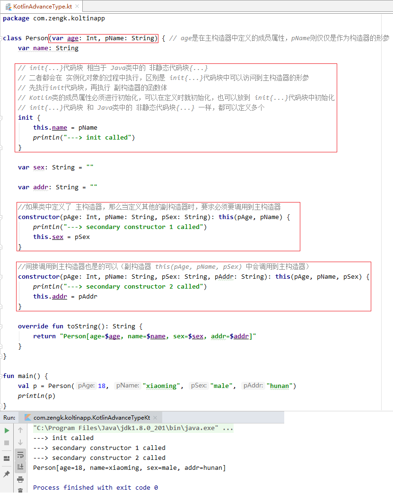

### 1.4 示例 2：在声明继承关系的同时指定所调用的父类构造器

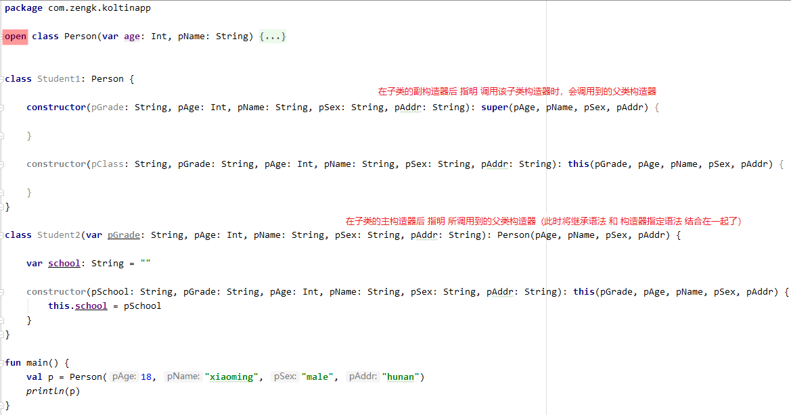

### 1.5 示例 3：带默认参数的构造器  & 注解 `@JvmOverloads` 的使用场景

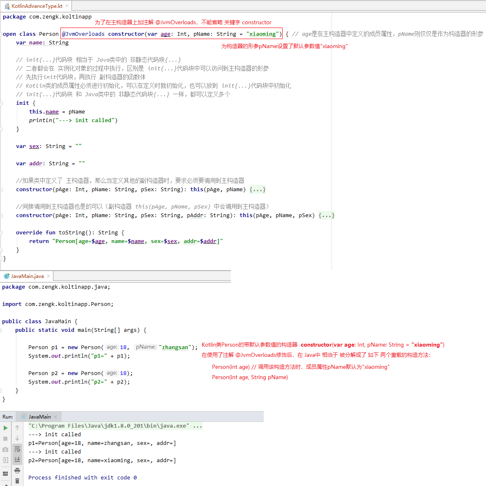

## 2. 使用与类同名的工厂函数创建类对象

在 `Kotlin` 中可以定义一个全局的与某个类同名的函数作为 **工厂函数** 来实例化这个类。**从外观上看，就好像是重载了类的构造器一样**。

这样做的好处是：对于无法被继承的类，可以通过定义一个这样的同名的全局函数来实例化这个类，从而能够加上一些我们自己的业务代码。

示例：

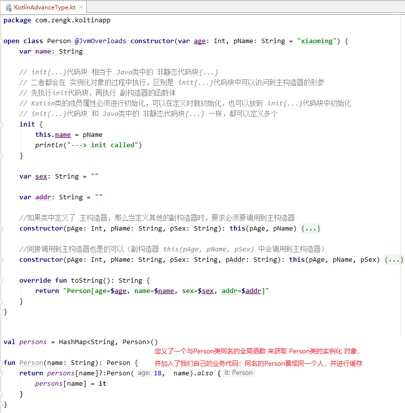

## 3. 访问权限修饰符

### 3.1 `Java` 与 `Kotlin` 的访问权限修饰符对比

||`Java`|`Kotlin`|
|:-|:-|:-|
|`public`|公开|公开，是 `Kotlin` 中的默认权限|
|`internal`|无|模块内可见|
|`default`|包内可见，是 `Java` 中的默认权限|无|
|`protected`|包内及子类可见|子类可见|
|`private`|仅类内可见|文件内及类内可见|

### 3.2 `Kotlin` 中的访问权限修饰符的作用对象

||顶级声明|类|成员|
|:-|:-|:-|:-|
|`public`|√|√|√|
|`internal`|√|√|√|
|`protected`|×|×|√|
|`private`|√|√|√|

### 3.3 `Kotlin` 中模块的概念

`IntelliJ IDEA` 工程中的一个 `Module` 可以看成是一个 `Kotlin` 模块。

也就是说：一个 `jar` 包；一个 `aar` 库，都可以看成是一个 `Kotlin` 模块。

### 3.4 `Kotlin` 中修饰符 `internal` & `Java` 中修饰符 `default`

#### 3.4.1 `Java` 中修饰符 `default` 的使用场景 & 缺陷

在封装 `SDK` 或对外提供公共组件时，对于 `SDK` 或公共组件中的核心类，若我们不想让使用者访问到，通常会使用 `default` 修饰，即包内可见。

但是，如果使用者一定要访问这些核心类的话，也可以创建一个与核心类同包名的包路径，将预访问这些核心类的外部类定义在同包名的包路径下即可。

也就是说，`Java` 中的 `default` 权限修饰符是存在缺陷的：

1. 我们在封装 `SDK` 或封装公共组件时，无法通过 `default` 修饰符将核心类给彻底的对外隐藏起来。

2. 并且，对于 `default` 修饰的多个核心类，如果它们之间要相互访问，那么也必须放到同一个包路径下，即包名要相同。这就意味着即使这些核心类可分为不同的功能模块、不同的抽象层次，我们也无法按照功能或抽象层次不同将它们分别放到不同的包路径下。从而导致了同一个包路径下聚集了大量的功能不同、抽象层次不同的类文件，使工程结构变得臃肿、不明确、难以维护。

#### 3.4.2 `Kotlin` 中使用修饰符 `internal` 解决 `Java` 中修饰符 `default` 的缺陷

在 `Kotlin` 中使用 `internal` 修饰符可以解决 `Java` 中的 `default` 修饰符的缺陷：

1. 被 `internal` 修饰的核心类或成员只是在模块内可见。这意味着我们在一个模块中封装的 `SDK` 或公共组件，在提供给其他模块使用时，在其他模块中是无法访问到 `SDK` 或公共组件中被 `internal` 修饰的核心类或成员的。

2. 并且，在模块中被 `internal` 修饰符的核心类并没有限制都要放在同一个包路径中才能相互访问（只要它们在同一个模块中就可以相互访问）。所以，对于可分为不同功能模块、不同抽象层次的各个核心类，可以放在同一个模块下的不同包路径中。保证了工程结构清晰明确。

#### 3.4.3 修饰符 `internal` 在 `Java` 中无效 & 注解 `@JvmName` 的作用

`Kotlin` 中的 `internal` 修饰符对 `Java` 是无效的。也就是说，在其他模块的 `Java` 代码中是可以访问到 `SDK` 或公共组件模块中被 `internal` 修饰的核心类或成员的。

需要指出的是：在其他模块的 `Java` 中访问 `Kotlin` 中被 `internal` 修饰的成员方法时，默认会为该成员方法的方法名添加额外的后缀 "`$moduleName_buildType`"。

如果不想使用这种添加了后缀的默认方法名，我们可以使用注解 `@JvmName` 声明在 `Java` 中调用时的方法名称。

特别地：如果我们不想让其他模块中的 `Java` 代码能够访问到被 `internal` 修饰的 `Kotlin` 中的成员方法，那么可以使用注解 `@JvmName` 为这个成员方法声明一个 **不合法的方法名称**（如声明一个非字母或下划线开头的方法名称），于是 `Java` 中在调用这个不合法的方法名时就会报语法错误。

示例：

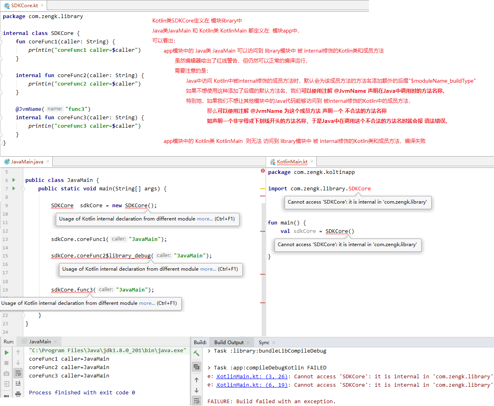

### 3.5 为构造器添加访问权限修饰符

当为 `Kotlin` 类的主构造器添加访问权限修饰符时，不能省略主构造器中的关键字 `constructor`。

当为 `Kotlin` 类的副构造器添加访问权限修饰时，直接在构造器定义的最前面加修饰符即可。

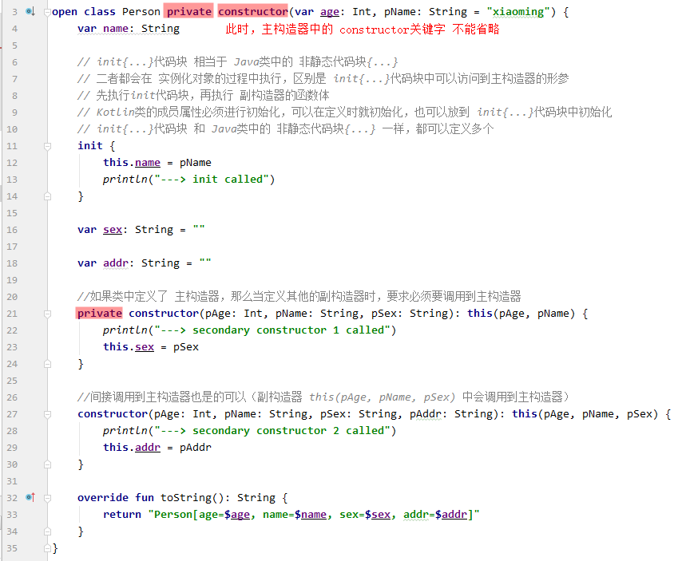

### 3.6 为 `Kotlin` 类的属性添加访问权限修饰符

可以在主构造器中定义成员属性时直接为该属性声明访问权限修饰符。

对于属性的 `setter`/`getter` 方法：
1. `getter` 方法的访问权限修饰符必须同属性的访问权限修饰符一致；
2. `setter` 方法的访问权限修饰符的权限不得超过属性的访问权限修饰符。

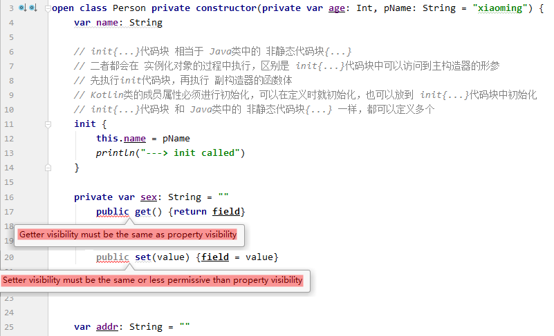

### 3.7 什么是顶级声明 & 为顶级声明添加访问权限修饰符

顶级声明是指：文件中定义的全局变量、全局函数、类。
    
顶级声明不能被 `protected` 修饰。

顶级声明被 `private` 修饰时，表示仅当前文件内可见。

## 4. 属性的延迟初始化

### 4.1 Kotlin 中属性必须赋初值 & 特殊情况下的延迟初始化

一般情况下，`Kotlin` 要求类属性必须赋以初始化值，具体分为两种情形：
1. 在定义属性时赋以初始化值；
2. 在 `init` 代码块中赋以初始化值。

但是在一些特殊情况下，是无法为类属性赋以初始化值的，如：`Activity` 类中的视图属性只有在 `onCreate` 方法调用 `setContentView` 方法加载了布局文件后才能进行初始化。此时，就需要对类属性进行 **延迟初始化**。

### 4.1 类属性延迟初始化的三种方式

#### 4.1.1 定义为可空类型并赋初值 `null`（类似 `Java`）

将属性定义为可空类型，并赋以初始值为 `null`（类似于 `Java`）：

```kotlin:no-line-numbers
private var tvName: TextView? = null

override fun onCreate(...) {
    ...
    tvName = findViewById(R.id.tv_name)
    tvName?.text = "Hello World"
}
```

注意：由于该方式创建的属性为可空类型，所以调用该属性对象的成员时都需要写成 "`?.`"

#### 4.1.2 使用关键字 `lateinit`

在定义属性时添加关键字 `lateinit`，指明该属性可以延迟初始化：

```kotlin:no-line-numbers
private lateinit var tvName: TextView
    
override fun onCreate(...) {
    ...
    tvName = findViewById(R.id.tv_name)
    tvName.text = "Hello World"
}
```

注意：

1. 关键字 `lateinit` 其实就是告诉编译器 **忽略对属性的初始化检查**；

2. 被 `lateinit` 修饰的属性如果后面没有进行初始化就使用的话，会报 `UninitializedPropertyAccessException` 异常；

3. 如果我们无法明确属性的初始化时机（即：在使用属性时无法确定该属性是否已经初始化了），那么不建议使用 `lateinit`，这会降低我们代码程序的稳定性。

4. 如果一定要使用关键字 `lateinit` 对不确定初始化时机的属性进行延迟初始化，那么在使用该属性时建议使用 `Lateinit.kt` 中定义的全局变量 `KProperty0<*>.isInitialized` 来判断该属性是否初始化了，如：

    ```kotlin:no-line-numbers
    class Activity {
        lateinit var tvName: TextView
        fun onCreate()  {
            if (::tvName.isInitialized) { // tvName.isInitialized 是全局属性，所以需要加 "::"
                println(tvName.text)
            }
        }
    }
    ```

5. 关键字 `lateinit` 不能修饰 `Int` 等基本类型的属性。

#### 4.1.3 使用 `Lazy<T>` 代理（推荐）

在定义属性时，使用 `Lazy<T>` 类型的代理（`Delegate`）对属性进行延迟初始化：

```kotlin:no-line-numbers
private val tvName = lazy {
    findViewById<TextView>(R.id.tv_name)
}

override fun onCreate(...) {
    ...
    tvName.text = "Hello World" // 在第一次访问 tvName 之前，会执行 lazy 函数中传入的 Lambda 表达式
}
```

示例：

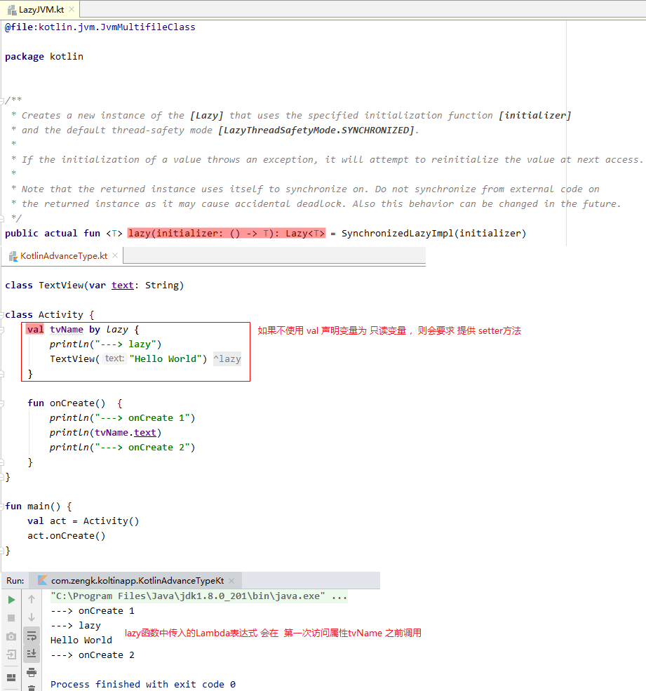

## 5. 代理

### 5.1 什么是代理？

“我” 代替 “你” 处理 “它”，于是可将 “我” 称为 “你的代理”。即：
1. “我” 作为 代理者；
2. “你” 作为 被代理者；
3. “它” 作为 代理业务。

### 5.2 代理的分类：接口代理 & 属性代理

代理的分类：

1. 接口代理：

    ```:no-line-numbers
    若对象 x 代替类 A 实现接口 B 的方法，则：
    1. 对象 x 作为代理者；
    2. 类 A 作为被代理者；
    3. “实现接口 B 的方法” 作为代理业务。
    ```

2. 属性代理：

    ```:no-line-numbers
    若对象 x 代替属性 a 实现 setter/getter 方法，则：
    1. 对象 x 作为代理者；
    2. 属性 a 作为被代理者；
    3. “实现 setter/getter 方法” 作为代理业务。
    ```

### 5.3 接口代理

如下代码所示，类 `ApiDelegate` 代理类 `ApiImpl` 实现接口 `Api` 中的方法。

需注意：

1. 代理类 `ApiDelegate` 和被代理类 `ApiImpl` 都要实现相同的接口 `Api`。
   
2. 被代理类 `ApiImpl` 需要依赖代理类 `ApiDelegate` 的实例对象。此时，可以将代理类 `ApiDelegate` 的实例对象作为被代理类 `ApiImpl` 的构造器实参传给被代理类 `ApiImpl`。

3. 被代理类 `ApiImpl` 可以在继承接口 `Api` 时，通过 "`by + 代理类 ApiDelegate 实例对象`" 的语法，使得被代理类 `ApiImpl` 中的接口方法默认都由代理类 `ApiDelegate` 完全实现。

    > 当然，也可以在被代理类 `ApiImpl` 中重写被代理的接口方法，加上自己的业务逻辑。

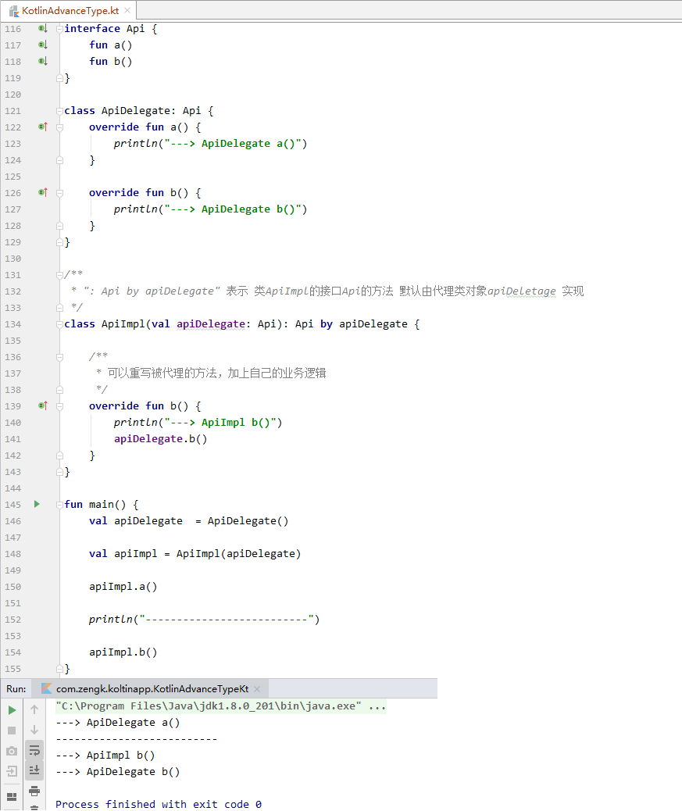

### 5.4 属性代理

#### 5.4.1 `lazy`（只能代理 `val` 只读属性）

##### 5.4.1.1 `lazy` 的源码分析

`lazy` 是一个全局函数，返回一个代理接口 `Lazy<T>` 的实现类 `SynchronizedLazyImpl` 的实例对象。

```kotlin:no-line-numbers
/* LazyJVM.kt */
package kotlin

public actual fun <T> lazy(initializer: () -> T): Lazy<T> = SynchronizedLazyImpl(initializer)
```

代理接口 `Lazy<T>` 的实现类 `SynchronizedLazyImpl` 中重写了接口中的只读属性 `value` 的 `getter` 方法。在重写的 `value` 属性的 `getter` 方法中，`value` 的属性值就是全局函数 `lazy` 中作为实参的 `Lambda` 表达式的返回值。

```kotlin:no-line-numbers
/* LazyJVM.kt */
package kotlin

private class SynchronizedLazyImpl<out T>(initializer: () -> T, lock: Any? = null) : Lazy<T>, Serializable {
    private var initializer: (() -> T)? = initializer

    @Volatile private var _value: Any? = UNINITIALIZED_VALUE

    private val lock = lock ?: this

    override val value: T
        get() {
            val _v1 = _value
            if (_v1 !== UNINITIALIZED_VALUE) {
                @Suppress("UNCHECKED_CAST")
                return _v1 as T
            }

            return synchronized(lock) {
                val _v2 = _value
                if (_v2 !== UNINITIALIZED_VALUE) {
                    @Suppress("UNCHECKED_CAST") (_v2 as T)
                } else {
                    val typedValue = initializer!!() // 将 Lambda 表达式的返回值作为 getter 方法的返回值
                    _value = typedValue
                    initializer = null
                    typedValue
                }
            }
        }

    override fun isInitialized(): Boolean = _value !== UNINITIALIZED_VALUE
    ...
}
```

代理接口 `Lazy<T>` 的扩展方法 `getValue` 是一个运算符重载函数，对应运算符 "`by`"：

```kotlin:no-line-numbers
/*
    参数 property 表示 被代理的属性
    参数 thisRef 表示被代理的属性所属的实例对象。
*/
public inline operator fun <T> Lazy<T>.getValue(thisRef: Any?, property: KProperty<*>): T = value
```

运算符 "`by`" 的作用效果就是在调用对象 `thisRef` 中的属性 `property` 的 `setter`/`getter方法` 时，就相当于是在调用运算符重载函数 `setValue`/`getValue` 方法。

##### 5.4.1.2 `lazy` 的使用语法 & 示例

属性代理 `lazy` 的使用语法为：

```kotlin:no-line-numbers
val property by lazy {...}
```

即：通过运算符 "`by`"，使得在访问只读属性 `property`（即调用 `getter` 方法）时，就相当于在调用函数 `lazy{...}` 返回的 `Lazy<T>` 接口的实例对象的扩展方法 `getValue`。

> 而 `getValue` 方法中返回 `Lazy<T>` 接口的实例对象中的只读属性 `value`（即调用只读属性 `value` 的 `getter` 方法）。
> 
> 于是，访问只读属性 `property`（即调用 `property` 的 `getter` 方法）就相当于是在访问 `Lazy<T>` 接口的实例对象中的只读属性 `value`（即调用只读属性 `value` 的 `getter` 方法）。

注意：

1. 所谓的属性代理 `lazy`，其实就是代理接口 `Lazy<T>` 的实例对象代理了属性 `property` 实现了 `getter` 方法；

2. 在使用属性代理 `lazy` 时，由于代理接口 `Lazy<T>` 只是代理了 `getter` 方法，所以属性 `property` 应该声明为 **只读属性 `val`**；

3. 属性 `property` 的类型就是代理接口 `Lazy<T>` 的泛型 `T`，也就是全局函数 `lazy` 的实参 `Lambda` 表达式的返回值类型；

4. 从代理接口 `Lazy<T>` 的实现类 `SynchronizedLazyImpl` 重写的 `getter` 方法中可知，全局函数 `lazy` 的实参 `Lambda` 表达式只会在第一次执行 `getter` 方法时调用一次。

示例：

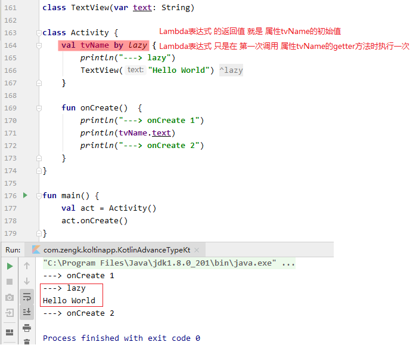

#### 5.4.2 `observable`

##### 5.4.2.1 `observable` 的源码分析

`observable` 是单例类 `Delegates` 的成员方法，返回一个代理接口 `ReadWriteProperty<Any?, T>` 的实现类 `ObservableProperty<T>` 的实例对象：

```kotlin:no-line-numbers
/* Delegates.kt */
package kotlin.properties

public object Delegates {
    ...

    /*
        参数 initialValue 表示属性的初始值
        参数 onChange 可以传入一个 Lambda 表达式，在 afterChange 方法中执行，用于处理 setValue 之后的业务逻辑
        返回值类型为 ReadWriteProperty<Any?, T> 接口类型
    */
    public inline fun <T> observable(
                initialValue: T, // 
                crossinline onChange: (property: KProperty<*>, oldValue: T, newValue: T) -> Unit):
                ReadWriteProperty<Any?, T> = // 函数的简写形式
        object : ObservableProperty<T>(initialValue) { // 返回一个继承自 ObservableProperty 的匿名内部类对象
            override fun afterChange(property: KProperty<*>, oldValue: T, newValue: T) = 
                onChange(property, oldValue, newValue)
        }

    ...
}
```

代理接口 `ReadWriteProperty<Any?, T>` 的实现类 `ObservableProperty<T>` 重写了接口中的运算符重载函数 `setValue`/`getValue`（都对应运算符 "`by`"）：

```kotlin:no-line-numbers
/* Interfaces.kt */
package kotlin.properties

public interface ReadWriteProperty<in R, T> {
    
    public operator fun getValue(thisRef: R, property: KProperty<*>): T

    public operator fun setValue(thisRef: R, property: KProperty<*>, value: T)
}
```

```kotlin:no-line-numbers
/* ObservableProperty */
package kotlin.properties

public abstract class ObservableProperty<T>(initialValue: T) : ReadWriteProperty<Any?, T> {
    private var value = initialValue

    protected open fun beforeChange(property: KProperty<*>, oldValue: T, newValue: T): Boolean = true

    protected open fun afterChange(property: KProperty<*>, oldValue: T, newValue: T): Unit {}

    public override fun getValue(thisRef: Any?, property: KProperty<*>): T {
        return value
    }

    public override fun setValue(thisRef: Any?, property: KProperty<*>, value: T) {
        val oldValue = this.value
        if (!beforeChange(property, oldValue, value)) {
            return
        }
        this.value = value
        afterChange(property, oldValue, value)
    }
}
```

运算符 "`by`" 的作用效果就是在调用对象 `thisRef` 中的属性 `property` 的 `setter`/`getter` 方法时，就相当于是在调用运算符重载函数 `setValue`/`getValue` 方法。

在重写的 `setValue` 方法中，会在赋值（`this.value = value`）前后依次回调 `beforeChange` 和 `afterChange` 方法，其中：

1. 回调函数 `beforeChange` 用于根据返回值判断是否进行赋值。默认返回 `true`，表示允许赋值。
   
2. 回调函数 `afterChange` 用于赋值完成后的业务处理。

> 代理接口 `ReadWriteProperty<Any?, T>` 的实现类 `ObservableProperty<T>` 被设计为抽象类的目的就是：建议调用者重写 `beforeChange`/`afterChange` 方法，从而能够在赋值前后添加自己的业务代码。

##### 5.4.2.2 `observable` 的使用语法 & 示例

属性代理 `observable` 的使用语法为：

```kotlin:no-line-numbers
// Lambda 表达式中的参数 property 就是被代理的属性 property
var property by Delegates.observable(initValue) { property, oldValue, newValue -> 
        /*
            在给属性 property 赋值时（调用 setter 方法），
            会调用到 observable 方法返回的 ObservableProperty<T> 实例的 afterChange 方法，
            在 afterChange 方法中就会执行 Lambda 表达式的函数体。
        */
    } 
```

即：通过运算符 "`by`"，使得在访问属性 `property`（即调用 `setter`/`getter` 方法）时，就相当于在调用函数 `Delegates.observable(initValue, onChange)` 返回的代理接口实现类 `ObservableProperty<T>` 实例的 `setValue`/`getValue` 方法。

注意：

1. 所谓的属性代理 `observable`，其实就是代理接口 `ReadWriteProperty<Any?, T>` 的实例对象代理了属性 `property` 实现了 `setter`/`getter` 方法；

2. 在使用属性代理 `observable` 时，由于代理接口 `ReadWriteProperty<Any?, T>` 代理了 `setter`/`getter` 方法，所以属性 `property` 可以声明为 **可读可写属性 `var`**；

3. 属性 `property` 的类型就是函数 `Delegates.observable(initValue, change)` 中作为属性初始值的参数 `initValue` 的类型；

4. 从代理接口 `ReadWriteProperty<Any?, T>` 的实现类 `ObservableProperty<T>` 重写的 `setValue` 方法中可知：作为函数 `Delegates.observable(initValue, change)` 中参数 `change` 的 `Lambda` 表达式会在每次 `setValue` 赋值完后调用。

示例：

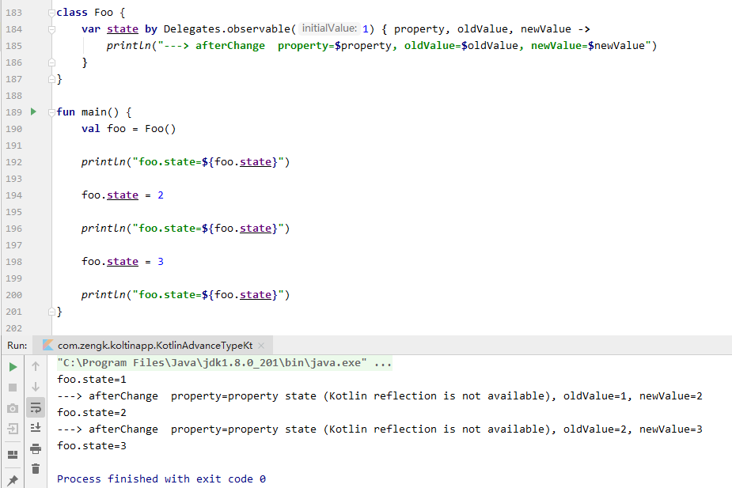

#### 5.4.3 `vetoable`

##### 5.4.3.1 `vetoable` 的源码分析

`vetoable` 是单例类 `Delegates` 的成员方法。返回一个代理接口 `ReadWriteProperty<Any?, T>` 的实现类 `ObservableProperty<T>` 的实例对象。

```kotlin:no-line-numbers
/* Delegates.kt */
package kotlin.properties

public object Delegates {
    ...

    public inline fun <T> vetoable(
                initialValue: T, 
                crossinline onChange: (property: KProperty<*>, oldValue: T, newValue: T) -> Boolean):
                ReadWriteProperty<Any?, T> = // 函数的简写形式
        object : ObservableProperty<T>(initialValue) { // 返回一个继承自 ObservableProperty 的匿名内部类对象
            override fun beforeChange(property: KProperty<*>, oldValue: T, newValue: T): Boolean = 
                onChange(property, oldValue, newValue)
        }

    ...
}
```

从函数 `vetoable` 的源码中可知，属性代理 `vetoable` 和属性代理 `observable` 的唯一区别就在于：

1. 作为函数 `observable(initialValue, onChange)` 中参数 `onChange` 的 `Lambda` 表达式相当于实现了 `afterChange` 方法；
   
2. 作为函数 `vetoable(initialValue, onChange)` 中参数 `onChange` 的 `Lambda` 表达式相当于实现了 `beforeChange` 方法。

#### 5.4.4 `notNull`

##### 5.4.4.1 `notNull` 的源码分析

`notNull` 是单例类 `Delegates` 的成员方法，从相关源码中可以看出：

1. 使用属性代理 `notNull` 时，不需要传入初始值；

2. 在调用属性 `property` 的 `getter` 方法之前，必须先调用 `setter` 方法赋以非空值，否则会报 `IllegalStateException` 异常。

```kotlin:no-line-numbers
/* Delegates.kt */
package kotlin.properties

public object Delegates {
    ...

    public fun <T : Any> notNull(): ReadWriteProperty<Any?, T> = NotNullVar()

    ...
}

private class NotNullVar<T : Any>() : ReadWriteProperty<Any?, T> {
    private var value: T? = null

    public override fun getValue(thisRef: Any?, property: KProperty<*>): T {
        return value ?: throw IllegalStateException("Property ${property.name} should be initialized before get.")
    }

    public override fun setValue(thisRef: Any?, property: KProperty<*>, value: T) {
        this.value = value
    }
}
```

##### 5.4.4.2 `notNull` 的使用示例

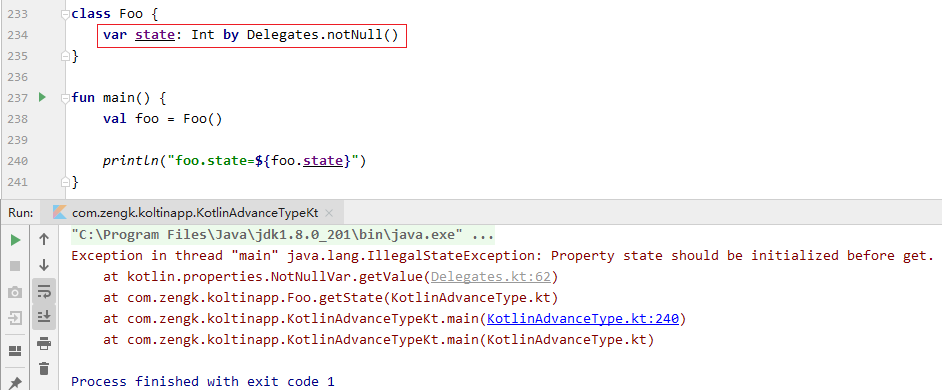

#### 5.4.5 案例：使用属性代理读写 `Properties`

##### 5.4.5.1 相关知识点

###### 5.4.5.1.1 属性代理中运算符 "`by`" 的使用语法

```kotlin:no-line-numbers
var/val property by delegateObj
```

注意：
1. 在定义属性时使用；
2. `by` 的左操作数为被代理的属性；
3. `by` 的右操作数为提供了运算符重载函数 `setValue`/`getValue` 的代理对象。

###### 5.4.5.1.2 运算符重载函数 `setValue`/`getValue` 的函数原型

运算符重载函数 `setValue`/`getValue` 的函数原型为：

```kotlin:no-line-numbers
/*
    其中：
        1. 参数 thisRef 表示被代理的属性所在的对象
        2. 参数 property 表示被代理的属性
        3. 参数 value 表示赋给被代理属性 property 的值
*/
operator fun setValue(thisRef: Any?, property: KProperty<*>, value: T)

operator fun getValue(thisRef: Any?, property: KProperty<*>): T
```

###### 5.4.5.1.3 属性代理中运算符 "`by`" & 运算符重载函数 `setValue`/`getValue`

只要是提供了运算符重载函数 `setValue`/`getValue` 的类都可以通过运算符 "`by`" 作为代理类，实现对属性 `property` 的 `setter`/`getter` 方法的代理。

##### 5.4.5.2 代码实现

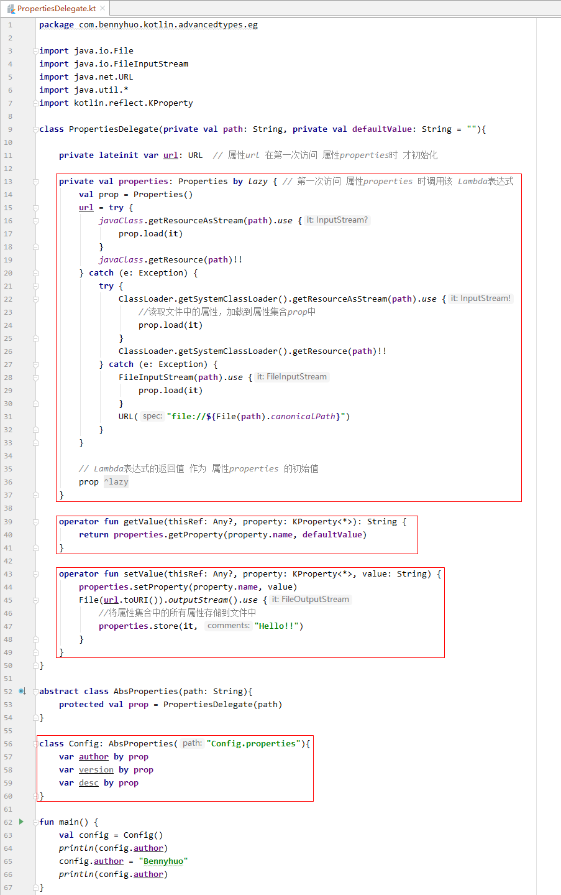

## 6. 单例类

### 6.1 使用关键字 `object` 定义单例类

定义语法：

```kotlin:no-line-numbers
//使用 关键字object 定义一个单例类
object KotlinSingleton {
    ...
}
```

注意：`KotlinSingleton` **既是单例类的类名，又是单例类的对象名**。因此可以直接通过 `KotlinSingleton` 作为对象访问其中的成员。

### 6.2 `Java` 代码中访问 `Kotlin` 单例类：`KolinSingleton.INSTANCE`

`Java` 代码中通过 `KolinSingleton.INSTANCE` 访问 `Kotlin` 中通过关键字 `object` 定义的单例类 `KolinSingleton` 的对象。

从 `Java` 中的访问方式可以看出，`Kotlin` 中的单例类 `KotlinSingleton` 编译成字节码文件后，相当于多了一个名为 `INSTANCE` 的静态成员变量，即：

```java:no-line-numbers
public static final KolinSingleton INSTANCE = new KolinSingleton();
```

示例：

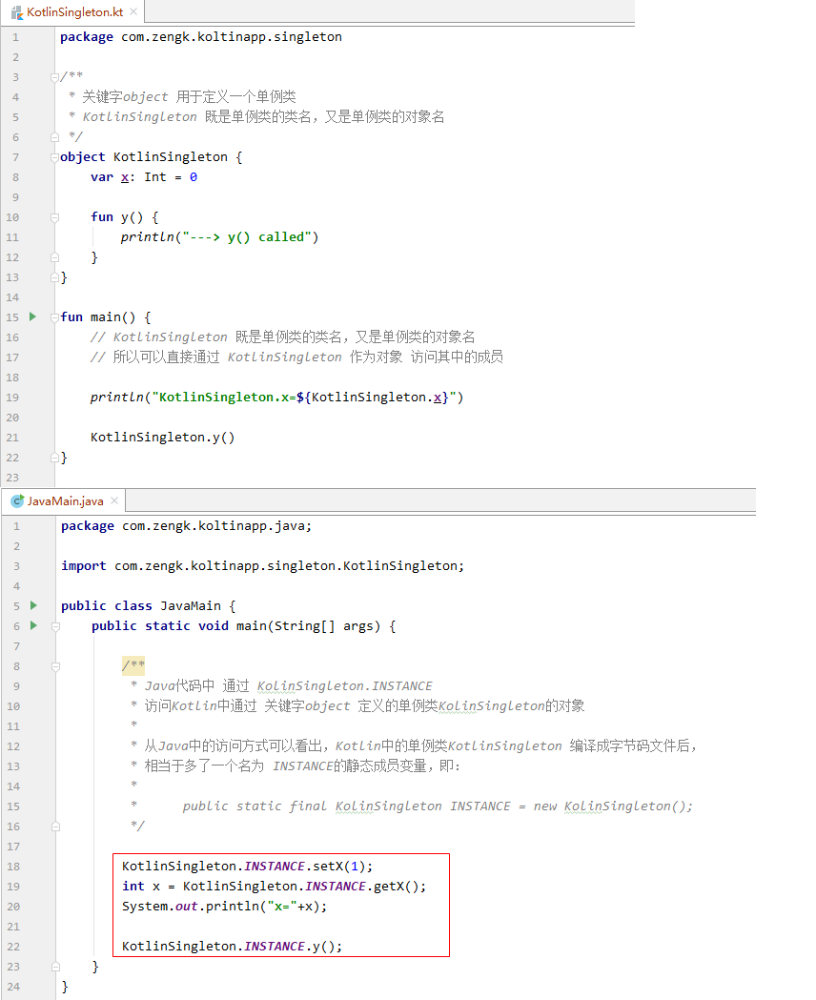

### 6.3 注意事项

#### 6.3.1 `Kotlin` 单例类相当于 `Java` 中的饿汉式单例类

使用关键字 `object` 定义的单例类，相当于 `Java` 中的饿汉式单例类

#### 6.3.2 `Kotlin` 单例类不允许自定义主副构造器，但可以定义 `init` 代码块

使用关键字 `object` 定义的单例类中，不允许另外添加主构造器或副构造器。但是可以使用 `init{...}` 代码块。

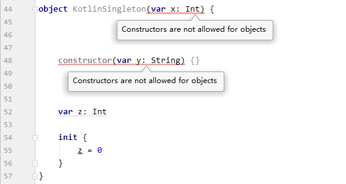

#### 6.3.3 `Kotlin` 单例类可以继承父类、实现接口

使用关键字 `object` 定义的单例类，可以像普通类那样继承父类，实现接口。

## 7. 伴生对象

### 7.1 伴生对象的定义 & 使用

在关键字 class 定义的普通类中，可以使用 companion object {...} 声明一个与该普通类 “相伴” 的伴生对象，即：

```kotlin:no-line-numbers
class Foo {
    // 定义普通类的成员属性和成员方法
    var x: Int = 1
    fun func() { println("normal func") }

    /* 声明一个 Foo 类的伴生对象，伴生对象名为 Foo.Companion */
    companion object { // 
        // 定义伴生对象的成员属性和成员方法
        var x: Int = 2
        fun func() { println("companion func") }
    }
}
```

访问 `Foo` 类的伴生对象中的 `func()` 方法：

```kotlin:no-line-numbers
fun main() {
    val a = Foo.x // a = 2
    Foo.func() // 打印 companion func
}
```

### 7.2 `Kotlin` 中访问伴生对象 & `Java` 中访问伴生对象

`Kotlin` 中可以通过 "`普通类类名.伴生对象成员`" 的方式访问伴生对象中的成员，等价于 "`普通类类名.Companion.伴生对象成员`"。

`Java` 中只能通过 "`普通类类名.Companion.伴生对象成员`" 的方式访问。

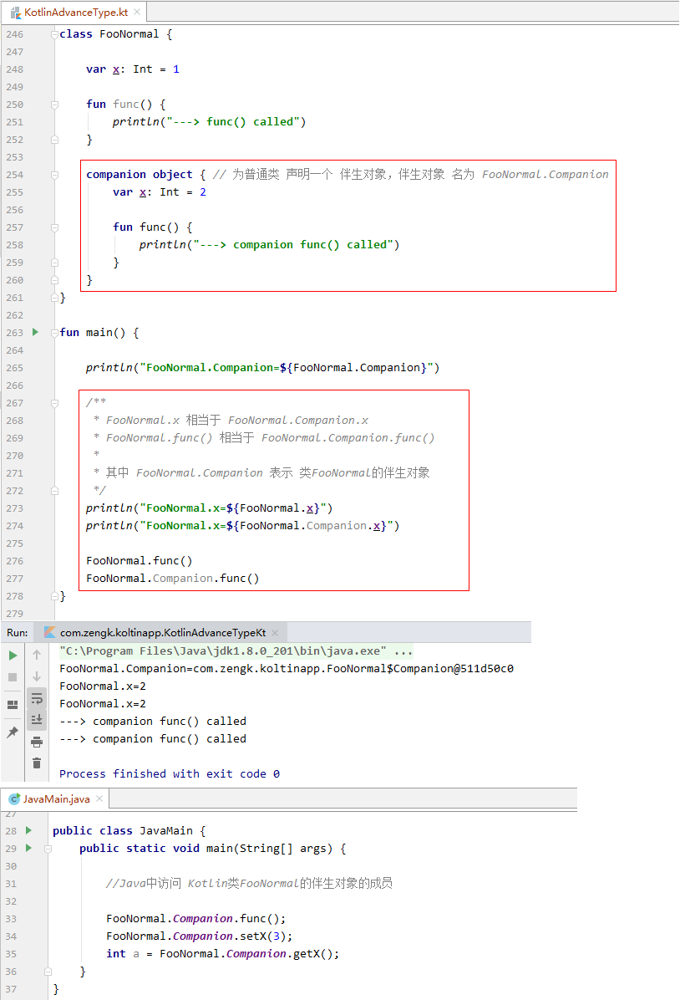

### 7.3 单例类中不存在伴生对象

关键字 `object` 定义的单例类是不存在伴生对象的。

## 8. 注解 `@JvmStatic`

### 8.1 `Kotlin` 中不存在 `static` 修饰的静态成员 & 注解 `@JvmStatic` 的作用

`static` 修饰的静态成员是 `Java` 特有的。

`Kotlin` 作为一门跨平台语言（`JavaScript`，`Java`，`C/C++`），是不存在 `static` 修饰的静态成员的。

为了兼容 `Java` 平台，在 `Kotlin` 中使用注解 `@JvmStatic` 来标记一个 `Kotlin` 的类成员，使其在 `JVM` 平台中会额外生成对应的静态成员。

### 8.2 `@JvmStatic` 的使用场景

#### 8.2.1 使用场景 1：修饰单例类的成员，额外生成相应的静态成员

修饰关键字 `object` 定义的单例类中的成员属性或成员方法，使其在 `JVM` 平台中额外生成对应的静态成员属性或静态成员方法。

#### 8.2.2 使用场景 2：修饰伴生对象的成员，额外生成相应的静态成员

修饰关键字 `class` 定义的普通类的伴生对象中的成员属性或成员方法，使其在 `JVM` 平台中额外生成对应的静态成员属性或静态成员方法。

### 8.3 注解 `@JvmStatic` 只在 `Java` 代码中起作用

注解 `@JvmStatic` 只是在 `Java` 代码中起作用，使得：

1. 对于普通类 `FooNormal` 的伴生对象中被注解 `@JvmStatic` 修饰的成员，在 `Java` 中可以直接通过类名 `FooNormal` 访问，即被注解 `@JvmStatic` 修饰的伴生对象中的成员在 `Java` 中相当于普通类的静态成员；

    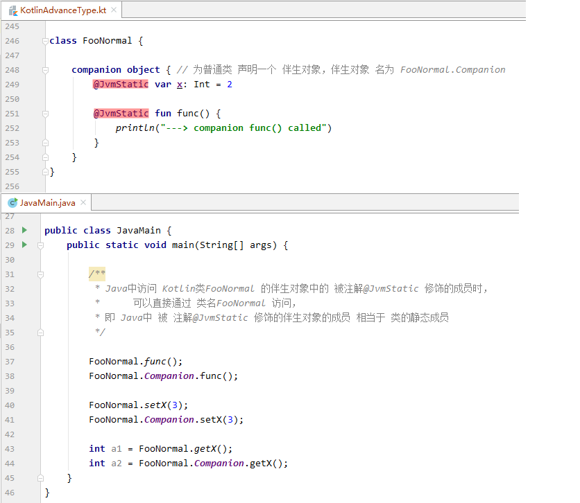

2. 对于单例类 `KotlinSingleton` 中被注解 `@JvmStatic` 修饰的成员，在 `Java` 中可以直接通过类名 `KotlinSingleton` 访问，即被注解 `@JvmStatic` 修饰的单例类中的成员，在 `Java` 中相当于单例类的静态成员。

    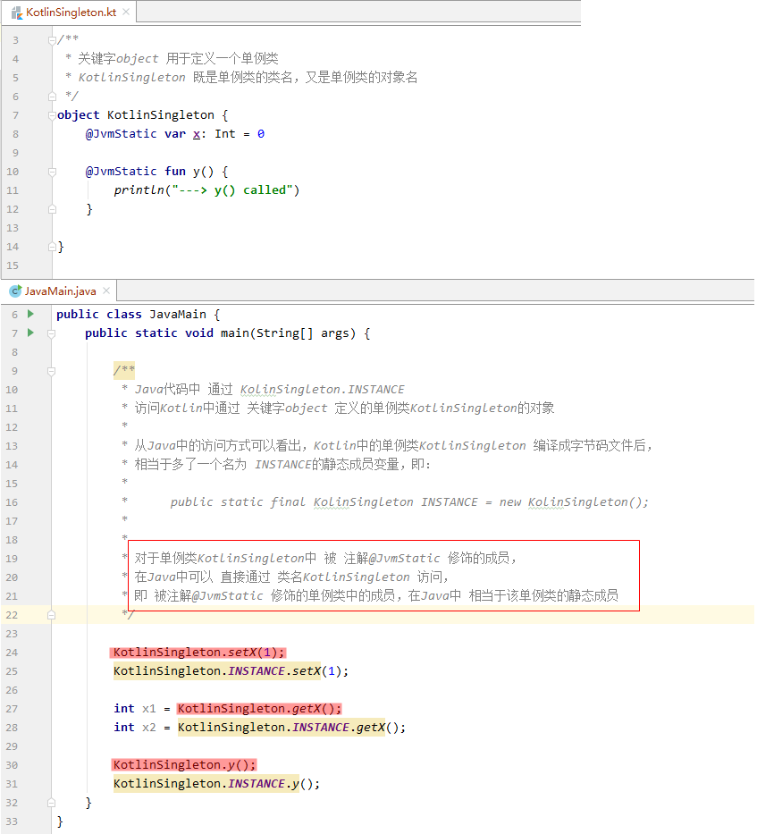

## 9. 注解 `@JvmField`

### 9.1 `@JvmField` 的作用：使属性在 `Java` 中公有化并移除 `setter`/`getter`

`Kotlin` 类中的属性 `property` 在 `Java` 中访问时，相当于:

```:no-line-numbers
一个 Kotlin 类的属性 property 对应一个 Java 类的私有成员变量 property + setter/getter 方法
```

当使用注解 `@JvmField` 修饰 `Kotlin` 属性 `property` 时，相当于:

```:no-line-numbers
一个被 @JvmField 修饰的 Kotlin 类的属性 property 对应一个 Java 类的公有成员变量 property
```

即注解 `@JvmField` 的作用就是：

1. 使属性在 `Java` 中公有化；

2. 在 `Java` 中移除对应的 `setter`/`getter` 方法。

### 9.2 `@JvmField` 的使用场景

#### 9.2.1 使用场景 1：修饰单例类的属性，在 `Java` 中作为公有化的静态属性

注解 `@JvmField` 修饰单例类的成员属性时，在 `Java` 中该属性作为静态成员变量。

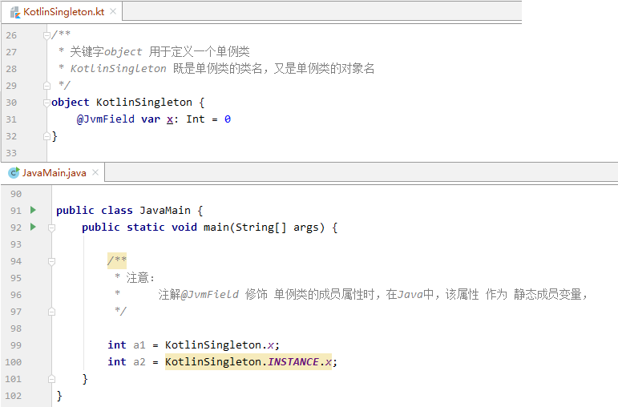

#### 9.2.2 使用场景 2：修饰伴生对象的属性，在 `Java` 中作为公有化的静态属性

注解 `@JvmField` 修饰伴生对象的成员属性时，在 `Java` 中该属性作为静态成员变量。**且只能通过类或类对象访问，不能通过伴生对象访问**。

#### 9.2.3 使用场景 3：修饰普通类的属性，在 `Java` 中作为公有化的非静态属性

注解 `@JvmField` 修饰普通类的成员属性时，在 `Java` 中该属性作为 **非静态成员变量**。

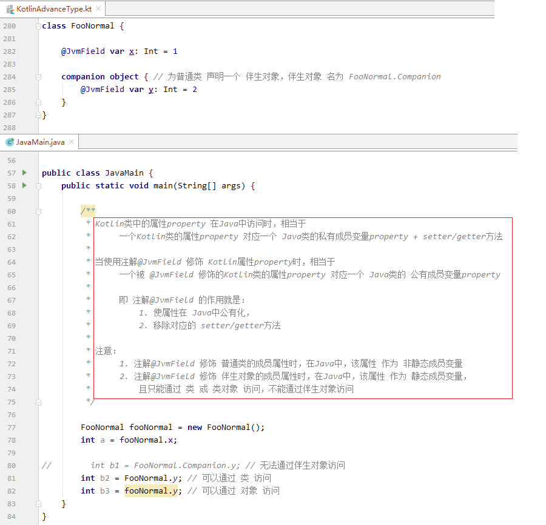

## 10. 内部类

### 10.1 `Kotlin` 中默认定义静态内部类 & 关键字 `inner` 声明非静态内部类

`Kotlin` 中定义的内部类默认是静态内部类。

若要定义非静态内部类，需要使用关键性 `inner` 进行声明。

和 `Java` 一样：

1. `Kotlin` 中的非静态内部类也持有外部类的引用；

2. `Kotlin` 中的静态内部类实例需要通过外部类的类名来创建；

3. `Kotlin` 中的非静态内部类实例需要通过外部类的实例来创建。

### 10.2 单例类中不能定义非静态内部类

关键字 `object` 定义的单例类中不存在非静态的情况，不能定义非静态内部类。

### 10.3 示例

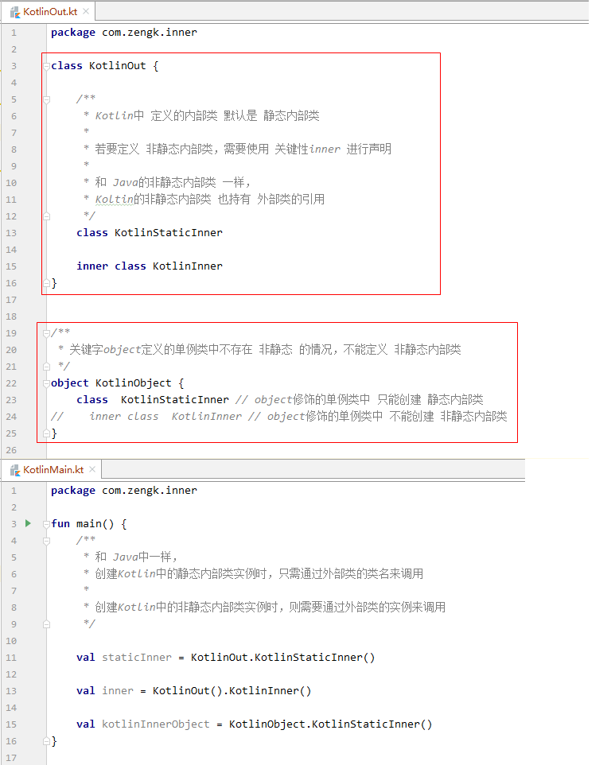

### 10.4 匿名内部类可以实现多个接口

`Kotlin` 中在定义匿名内部类时，可以实现多个接口（`Java` 中是不支持的）。

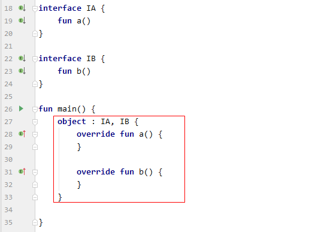

### 10.5 本地类 & 本地函数

`Java` 和 `Kotlin` 都支持定义本地类（即在函数中定义类）。

`Kotlin` 中还支持定义本地函数（即在函数中定义函数，即函数嵌套定义）。但 `Java` 不支持。

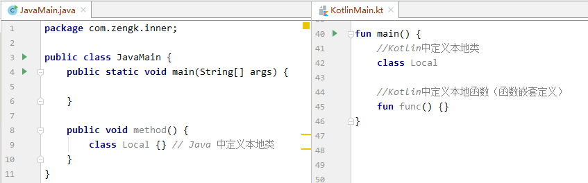

## 11. 数据类（`data class`）

### 11.1 数据类的使用说明 & 示例

说明：

1. 使用关键字 "`data class`" 声明一个数据类；

2. **数据类必须定义主构造器，且至少有一个属性定义在主构造器中**；

3. 在主构造器中定义的属性作为数据类的组件（`Component`）。一个属性就是一个数据类组件；

4. 数据类会根据组件（`Component`）生成 `toString`/`hashCode`/`equals`/`copy` 这四个方法；

5. **数据类不能作为父类（不可继承）**，所以不能用关键字 `open` 修饰数据类；

6. 可以像二元对组 `Pair` 或三元对组 `Triple` 那样，通过解构的方式获取数据类中作为组件的属性：

    ```kotlin:no-line-numbers
    val (component1, component2, ...) = dataObj
    ```

    ```:no-line-numbers
    其中：
    1. dataObj 表示数据类对象；
    2. 变量列表 component1, component2, ... 对应数据类中定义在主构造器中的属性列表。
    ```

注意：
1. 一般情况下，定义一个数据类只需要提供主构造器，并在主构造器中定义作为组件的属性即可（即不需要 `{...}`）；
2. 在数据类中的主构造器中定义的作为组件的属性的类型建议是基本类型、`String`、或其他数据类类型；
3. 作为组件的属性建议声明为 `val`；
4. 作为组件的属性不可以为其自定义 `setter`/`getter` 方法。

示例：

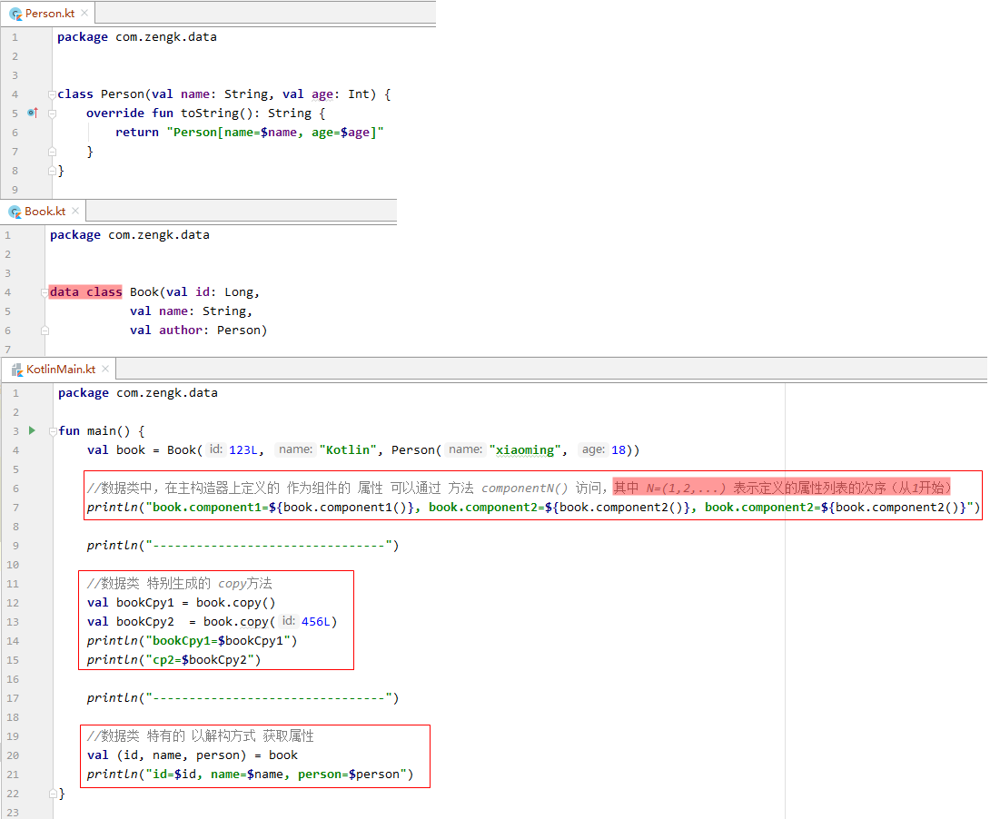

### 11.2 查看 `Kotlin` 代码对象的 `Java` 代码

在 `IntelliJ IDEA` 中，对于编辑器中当前显示的 `Kotlin` 文件/类，可以通过如下步骤显示出该 `Kotlin` 代码对应的由 `JVM` 编译生成的字节码：

```:no-line-numbers
Tools -> Kotlin -> Show Kotlin Bytecode 
```

再点击字节码代码上方的 "`Decompile`" 按钮，可以将该字节码反编译生成对应的 `Java` 代码。

示例：

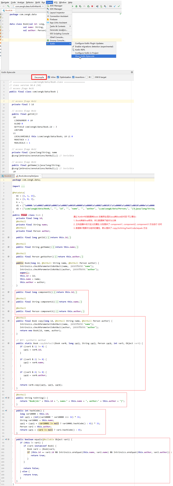

### 11.3 `NoArg` 插件（为数据类提供无参构造）

插件 `NoArg` 为数据类提供无参构造。

### 11.4 `AllOpen` 插件（使数据类可继承）

插件 `AllOpen` 移除数据类的 `final` 特性，使数据类可继承。

## 12. 枚举类（`enum class`）

### 12.1 使用 `enum class` 定义枚举类

```kotlin:no-line-numbers
enum class KotlinState1 {
    IDLE,
    ACTIVE
}
```

### 12.2 为枚举类自定义构造器

可以为枚举类自定义构造器：

```kotlin:no-line-numbers
enum class KotlinState2(val id: Int) {
    IDLE(0),
    ACTIVE(1)
}
```

### 12.3 为枚举类实现接口

可以为枚举类实现接口：

```kotlin:no-line-numbers
interface IState {
    fun work()
}

enum class KotlinState3(val id: Int): IState {
    /*
        可以分别为每个枚举对象重写方法。
    */
    IDLE(0) {
        override fun work() {
            println("---> idle work")
        }
    },

    ACTIVE(1);

    /*
        也可以为没有重写方法的枚举对象提供一个公共的重写方法。
    */
    override fun work() {
        println("---> common work")
    }
}
```

### 12.4 为枚举类定义扩展方法

可以为枚举类定义扩展方法：

```kotlin:no-line-numbers
fun KotlinState3.next(): KotlinState3 {
    return KotlinState3.values().let {
        it[(this.ordinal + 1) % it.size] // 返回下一个枚举对象
    }
}
```

### 12.5 枚举类不能继承类，只能实现接口

枚举类的父类默认都是 `Enum`，所以枚举类不能再继承其他父类，只能实现接口。

### 12.6 示例

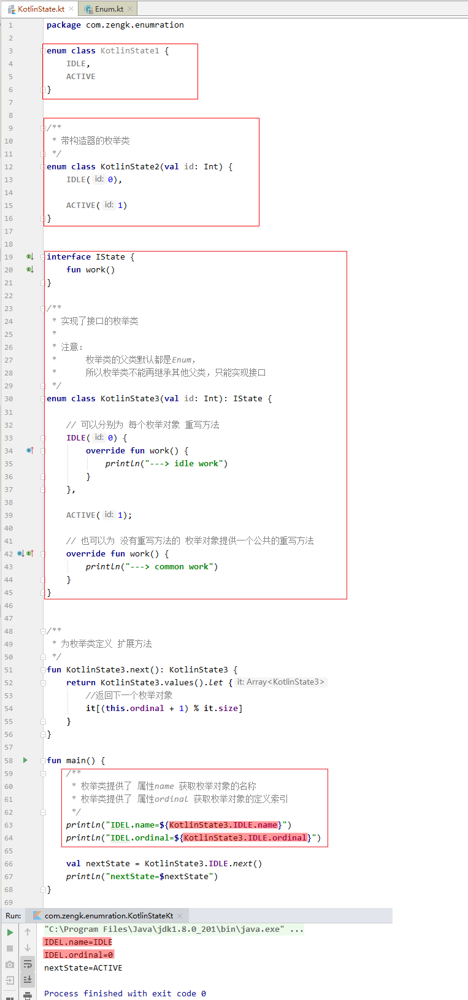

### 12.6 枚举类的使用

#### 12.6.1 在 `when` 条件语句中使用枚举

可以在 `when` 条件语句中使用枚举：

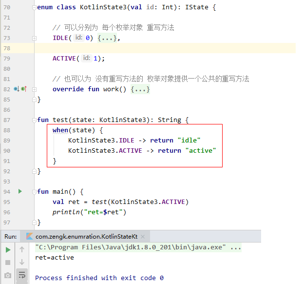

#### 12.6.2 同类型的枚举值之间可以比较 

#### 12.6.3 同类型的枚举值可以构造区间

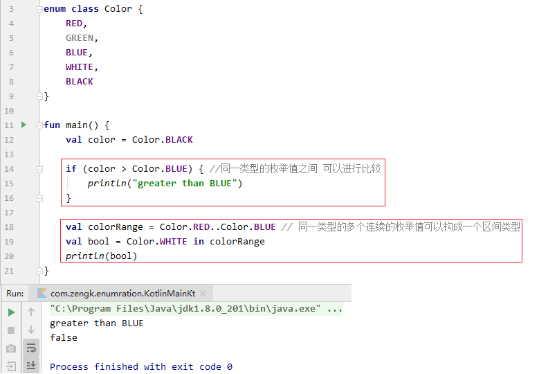

## 13. 密封类（`sealed class`）

使用关键字 `sealed class` 定义一个密封类。

### 13.1 密封类是抽象类 & 密封类的构造器是私有的

通过反编译生成的 `Java` 代码可知：

1. 密封类是一个抽象类；

2. 密封类的构造器默认是私有的且只能是私有的。所以 **密封类的子类只能与密封类定义在同一个 `Kotlin` 文件中**。

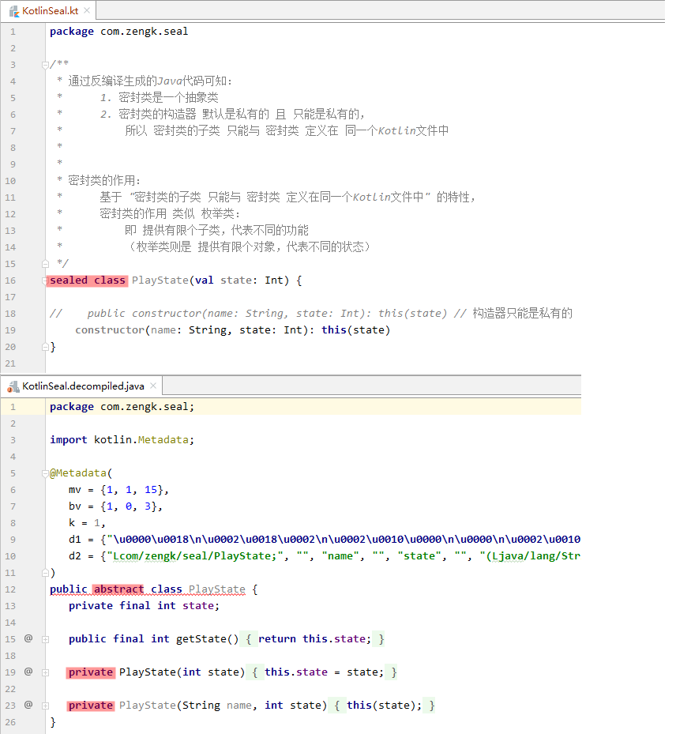

### 13.1 密封类的使用：密封类 + 多态 + 智能转换

可以结合 "密封类 + 多态 + 智能转换" 来使用密封类：

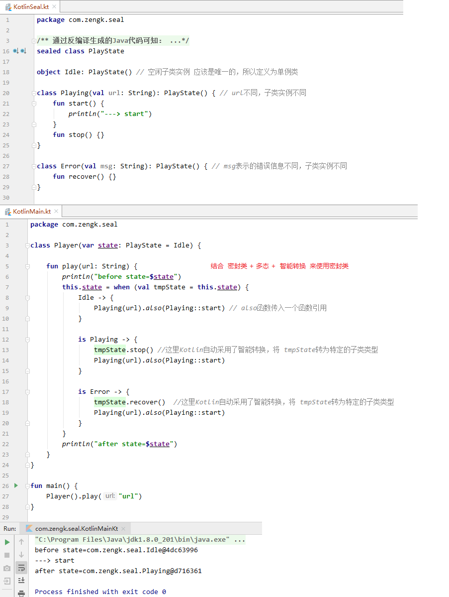

## 14. 内联类（`inline class`）

说明：

1. 使用关键字 `inline class` 定义一个内联类；

2. 内联类必须定义一个主构造器，且主构造器中必须定义且只能定义一个 `val` 修饰的只读属性；

3. 内联类的作用就相当于一个包装类，对定义在主构造器中的属性的类型进行包装；

4. 内联类中不允许定义带 "`backing field`" 的属性（即属性的 `setter`/`getter` 方法中不能使用 "`field`"）；

5. 内联类可以实现接口，但不能作为父类，也不能继承其他类；

6. 内联类在 `Kotlin` 的 `1.3` 版本中处于公测阶段，不建议使用。

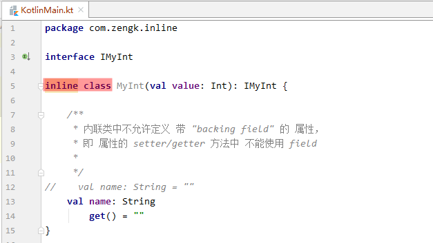