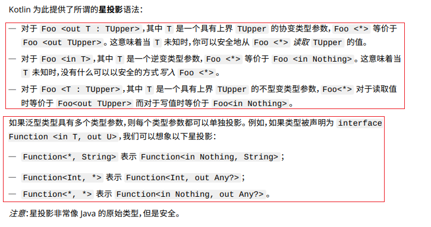

## 1. 泛型的声明

### 1.1 在函数定义中声明泛型

```kotlin:no-line-numbers
fun <T> func(p1: T, p2: T) {...}
```

> 其中：`<T>` 表示声明了一个泛型 `T`。
> 
> 于是在函数 `func` 的定义中（如：形参列表上、函数体中、返回值类型上）才可以使用泛型 `T` 表示一个不确定的类型。
        
函数调用时，泛型支持自动类型推导（即可以根据传入的实参类型推导泛型的具体类型）：

```kotlin:no-line-numbers
func(1, 2) // 此时泛型 T 表示 Int 型。
func<Int>(1, 'a') // 此时无法根据实参进行类型推导，应该在函数调用时手动指定泛型的具体类型。
```

### 1.2 在类定义中声明泛型

```kotlin:no-line-numbers
class Foo<T>
```

> 其中：`<T>` 表示声明了一个泛型 `T`。
> 
> 于是在类中（如：成员方法定义、属性定义、内部类定义、构造器定义上）才可以使用泛型 `T` 表示一个不确定的类型。

## 2. 泛型约束 & `where` 语句

泛型约束就是在泛型声明时为泛型指定继承关系和依赖关系：

```kotlin:no-line-numbers
fun <T:Comparable<T>> func(p1: T, p2: T) {...}
```

> 其中：泛型声明 `<T:Comparable<T>>` 表示泛型 `T` 需要实现 `Comparable` 接口，且 `Comparable` 接口中的泛型又依赖该泛型 `T`。

也可以使用 `where` 语句来指定泛型约束（使用 `where` 语句可以方便地为一个泛型添加多个约束，或为多个泛型添加约束）：

```kotlin:no-line-numbers
/*
    指定泛型 T 既要实现 Comparable 接口，又是一个函数类型。
*/
fun <T> func(p1: T, p2: T) where T:Comparable<T>, T:()->Unit {...}

/*
    声明了两个泛型：T 和 R，且：
    1. 指定泛型 T 既要实现 Comparable 接口，又是一个函数类型； 
    2. 指定泛型 R 是 Number 类型或其子类型。
*/    
fun <T, R> func(p1: T, p2: T): R where T:Comparable<T>, T:()->R, R: Number {...}
```

## 3. 泛型的型变

### 3.1 类和类型的区别

在 `Java` 中：

1. 对于非泛型类 `Foo`，类名 `Foo` 即可作为类型名 `Foo` 使用；
   
2. 对于泛型类 `Foo<T>`， 类名 `Foo<T>` 不可作为类型名使用。类名 `Foo<T>` 对应多个类型名，如：`Foo<String>`、`Foo<Person>`、...

在 `Kotlin` 中：

1. 对于非泛型类 `Foo`，类名 `Foo` 对应不可空类型 `Foo`，而可空类型为 `Foo?`
   
2. 对于泛型类 `Foo<T>`， 同 `Java` 一样，不可作为类型名使用，而是对应多个类型。

### 3.2 什么是泛型的型变

对于泛型类 `Foo<T>`，即使当泛型参数 `T` 取具有继承关系的具体类型时，如：`Person` 和 `Son`（其中 `Son extends Person`）。对应的泛型类型 `Foo<Person>` 和 `Foo<Son>` 也不具备继承关系。

所谓泛型的型变就是：当泛型参数 `T` 取具有继承关系的具体类型时，使得对应的泛型类型也具备某种继承关系。

> 泛型的型变可以分为声明处型变和使用处型变。

### 3.3 型变的分类

#### 3.3.1 声明处型变

声明处型变又可分为三种：协变、逆变、不变。

##### 3.3.1.1 协变（`out`）

使用关键字 `out` 标记，如 `Foo<out T>`。

###### 3.3.1.1.1 泛型类型与泛型参数具有相同的继承关系

对继承关系的影响：当泛型参数 `T` 取具有继承关系的具体类型时，对应的泛型类型也具有相同的继承关系。即： 

```kotlin:no-line-numbers
若 T 取 Son 或 Person（其中 Son extends Person）
则 Foo<Son> extends Foo<Person>
```

###### 3.3.1.1.2 泛型不可作为方法形参使用 & `@UnsafeVariance` 解除限制

限制：对于使用了协变的泛型类 `Foo<out T>`，要求泛型类的成员方法（包括属性的 `setter`/`getter` 方法）的形参类型不可以使用泛型 `T`，也不可以使用依赖了泛型 `T` 的其他泛型类型（如 `List<T>`）。

> 可以在使用泛型 `T` 时，在泛型 `T` 前面直接添加注解 `@UnsafeVariance` 解除这一限制。

##### 3.3.1.2 逆变（`in`）

使用关键字 `in` 标记，如 `Foo<in T>`。

###### 3.3.1.2.1 泛型类型与泛型参数具有相反的继承关系

对继承关系的影响：当泛型参数 `T` 取具有继承关系的具体类型时，对应的泛型类型则具有相反的继承关系。即： 

```kotlin:no-line-numbers
若 T 取 Son 或 Person（其中 Son extends Person）
则 Foo<Son> super Foo<Person>
```

###### 3.3.1.2.2 泛型不可作为方法返回值使用 & `@UnsafeVariance` 解除限制

限制：对于使用了逆变的泛型类 `Foo<in T>`，要求泛型类的成员方法（包括属性的 `setter`/`getter` 方法）的返回值类型不可以使用泛型 `T`，也不可以使用依赖了泛型 `T` 的其他泛型类型（如 `List<T>`）。

> 可以在使用泛型 `T` 时，在泛型 `T` 前面直接添加注解 `@UnsafeVariance` 解除这一限制。

##### 3.3.1.3 不变（默认）

默认就是不变，即 `Foo<T>`。

###### 3.3.1.3.1 泛型类型与泛型参数不存在继承关系

对继承关系的影响：即使泛型参数 `T` 取具有继承关系的具体类型，对应的泛型类型也不会具有任何的继承关系。

###### 3.3.1.3.2 泛型既可作为方法返回值又可作为方法形参

#### 3.3.2 使用处型变（又称类型投影）

使用处型变又称为类型投影。所谓类型投影就是 **类型受到限制** ，如：

```kotlin:no-line-numbers
/*
    其中 Array<out Person> 就是类型投影（向下投影），
    即限制 Array 的泛型实参类型只能是 Person 及其子类类型
*/
fun copy(from: Array<out Person>, to: Array<Person>) { ... }
```

```kotlin:no-line-numbers
/*
    其中 Array<in String> 就是类型投影（向上投影），
    即限制 Array 的泛型实参类型只能是 String 及其父类类型
*/
fun fill(dest: Array<in String>, value: String) { ... }
```

## 4. 星投影（`Foo<*>`）：不确定泛型实参，但仍想安全地使用泛型

星投影就是使用星号 "`*`" 代替泛型参数的具体实参。

表示虽然不知道泛型类型使用的泛型实参是什么，但仍然希望以安全的方式使用这个泛型类型。



## 5. 类型擦除：编译后的字节码文件中不存在泛型

`Java` 和 `Kotlin` 的泛型都是 **伪泛型**。即：泛型声明在编译后就会被擦除。

也就是说，编译后的字节码文件中是不存在泛型的。

> `c++`、`c#` 中的泛型则是真泛型，不存在类型擦除的说法。

## 6. 内联特化（`reified`）：避免因类型擦除导致泛型在某些场景下无法使用

为了避免因为类型擦除导致的泛型在某些场景下无法使用的问题，在内联函数中，可以在声明泛型时使用关键字 `reified` 对泛型进行内联特化，如：

```kotlin:no-line-numbers
inline fun <reified T> parseJson(json: String): T {
    return fromJson(json, T::class.java) // T::class.java 如果不进行内联特化则无法使用
}
```

## 7. 参考

`http://www.kotlincn.net/docs/kotlin-docs.pdf`

`https://www.jianshu.com/p/1715f0483768`