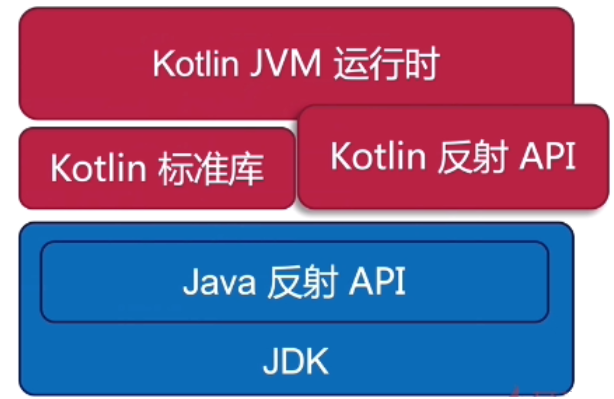
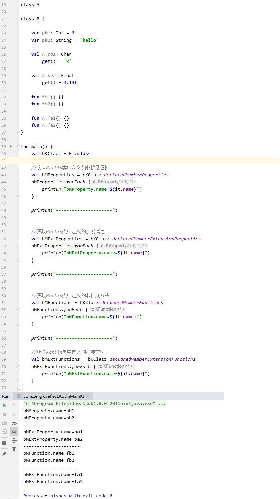
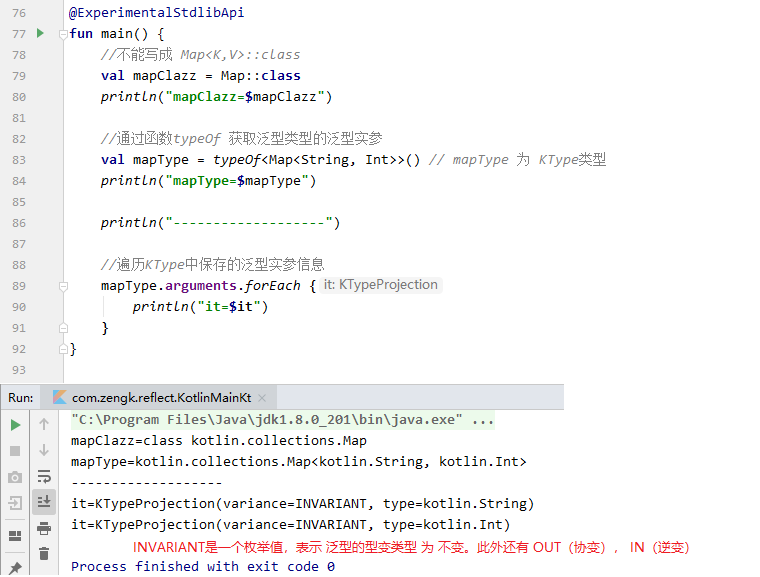
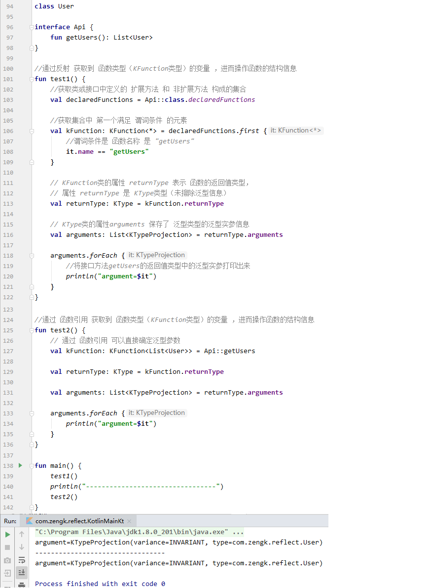
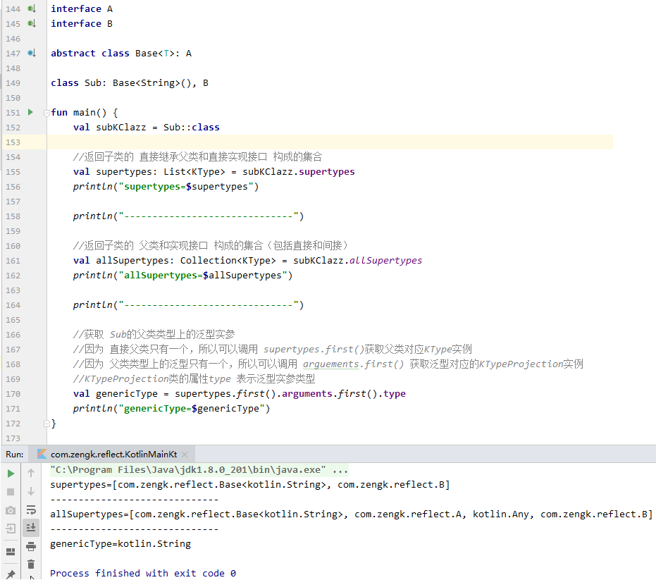
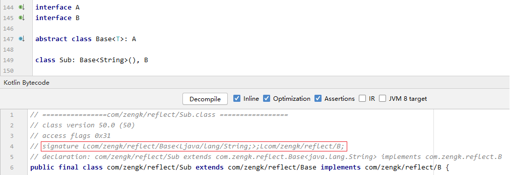
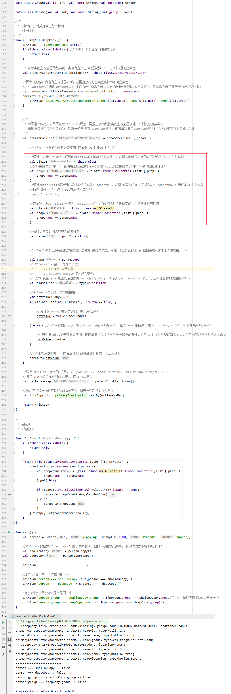
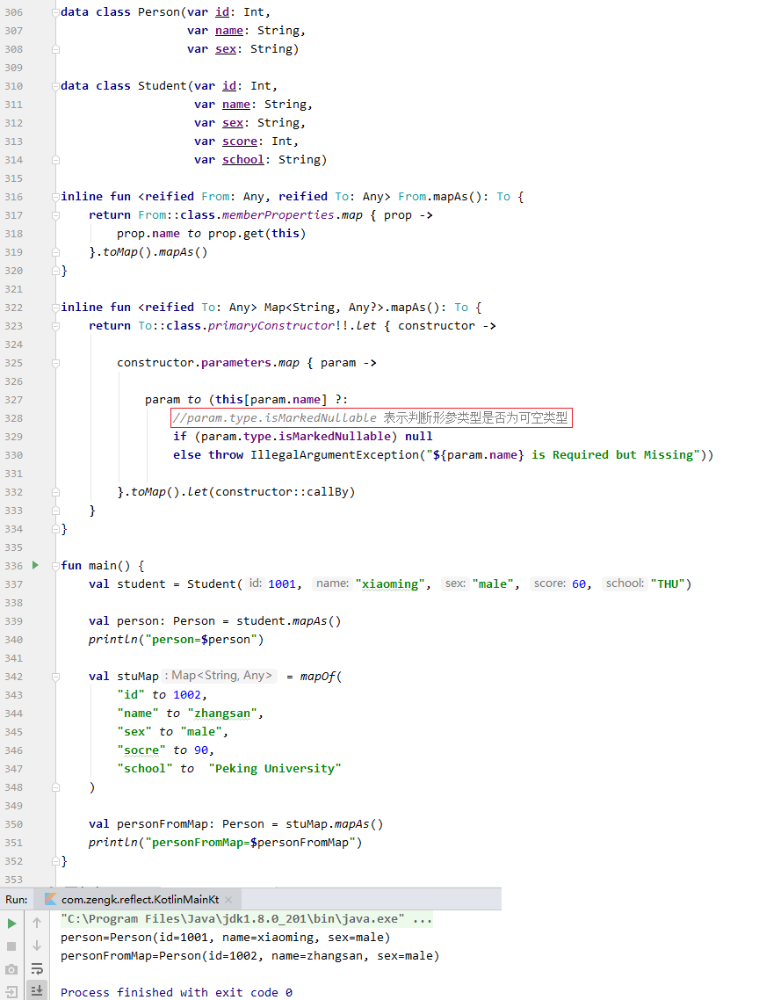
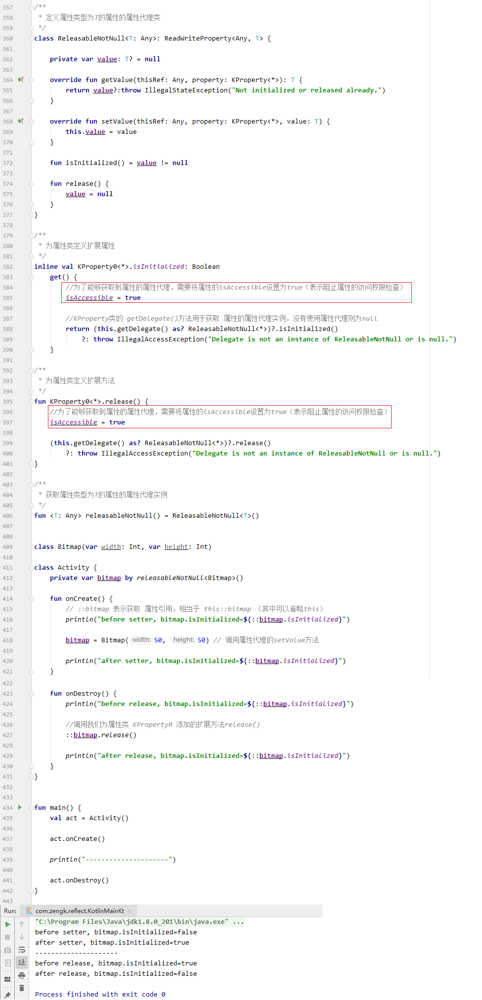

## 1. 什么是反射

反射是允许在运行时期访问 **程序结构** 的一类特性（程序结构包括：类、接口、方法、属性等）。

## 2. 反射的依赖库

`Kotlin` 中不仅自己实现了一套 `Kotlin` 反射的 `API`，还可以使用 `Java` 反射的 `API`。

`Kotlin` 反射的 `API` 是一个独立的库，使用之前需要进行依赖配置：

```groovy:no-line-numbers
dependencies {
    implementation "org.jetbrains.kotlin:kotlin-reflect" // Kotlin反射 API 的依赖库
}
```



## 3. `@MetaData` 注解

将 `Kotlin` 代码反编译成 `Java` 代码后，`Java` 代码中每个类都会被注解 `@MetaData` 修饰。注解 `@MetaData` 中保存了 `Kotlin` 反射相关的信息。

## 4. 反射的使用场景

1. 获取类型的所有属性、方法、内部类等信息（即通过反射来访问程序本身，所以又可以称为自省）。

2. 通过方法的名称字符串及签名字符串来调用方法；通过属性的名称字符串来访问属性。

3. 通过签名信息获取泛型实参的具体类型。

4. 访问运行时注解及其信息完成注入或者配置操作。

## 5. 反射中与程序结构相关的类

### 5.1 `KType`

描述未擦除的类型或泛型参数等，例如 `Map<String, Int>`。

可通过 `typeOf` 或者类型 `KClass`、`KProperty`、`KFunction` 获取对应的父类、属性、函数参数等。

### 5.2 `KClass`

描述对象的实际类型，不包含泛型参数，例如 `Map`。

可通过对象、类型名直接获得 `KClass` 实例。

### 5.3 `KProperty`

描述属性。

可通过属性引用、属性所在类的 `KClass` 实例获取。

### 5.4 `KFunction`

描述函数。

可通过函数引用、函数所在类的 `KClass` 实例获取。

### 5.5 `Kotlin` 与 `Java` 中程序结构相关类的对比

|`Kotlin`|`Java`|
|:-|:-|
|`KType`|`Type`|
|`KClass`|`Class`|
|`KProperty`|`Field`|
|`KFunction`|`Method`|

## 6. `Java` 反射与 `Kotlin` 反射的优缺点

`Java` 反射：

1. 优点：无需引入额外依赖，首次使用速度相对较快。

2. 缺点：无法访问 `Kotlin` 语法特性，需对 `Kotlin` 生成的字节码足够了解（只有了解其字节码才能知道 `Java` 反射中如何处理 `Kotlin` 代码）。

`Kotlin` 反射：

1. 优点：支持访问 `Kotlin` 几乎所有特性，`API` 设计更友好。

2. 缺点：需要额外引入 `Kotlin` 反射依赖库（`2.5M`，编译后 `400K`），首次调用较慢（需要解析注解 `@MetaData` 中保存的反射信息）。

## 7. 反射的使用举例

### 7.1 通过 "`类名::class`" 获取 `KClass` & 通过 `KClass` 获取程序结构信息

通过 `类名::class` 可以获取到 `Kotlin` 类的 `KClass` 实例。

`KClass` 类中提供了大量 `API` 来访问类的程序结构信息（如属性，方法，内部类，等等）。



### 7.2 通过 `typeOf` 获取 `KType` & 通过 `KType` 获取泛型信息

通过 `Kotlin` 反射依赖库提供的全局函 `typeOf` 获取泛型类型的相关信息。



### 7.3 获取类方法的返回值类型上的泛型实参



### 7.4 获取父类类型上的泛型实参



### 7.5 通过反射获取泛型实参的原理

`Kotlin` 中的泛型是 **伪泛型**，即经过编译后的类型上就不会带泛型了。

但是为什么通过 `KType` 实例还能够拿到类型的泛型信息呢？

这是因为 `Kotlin` 代码经过编译后会为擦除掉的泛型生成一个签名信息（如下图的 `Kotlin` 字节码中的 `signature` 所示）：



通过 `KType` 实例获取到的泛型信息就是通过解析 `signature` 签名得到的。

### 7.6 保留泛型签名信息的混淆配置

在打包混淆时，泛型的签名信息会被混淆。

因此，为了保证通过 `KType` 实例能够获取到泛型信息，应该在混淆配置文件中保留 `signature` 签名信息不被混淆：

```:no-line-numbers
//Proguard配置
-keepattributes Signature
```

## 8. 案例

### 8.1 数据类的深拷贝

#### 8.1.1 相关知识点

##### 8.1.1.1 反射获取类的主构造器

##### 8.1.1.2 反射获取函数的形参列表

##### 8.1.1.3 反射调用函数

##### 8.1.1.4 反射获取对象中属性的属性值

#### 8.1.2 代码实现



### 8.2 `Model` 映射

需求：实现具有相同属性列表的不同数据类之间的转换。

#### 8.2.1 相关知识点

##### 8.2.1.1 判断类型是否为可空类型

#### 8.2.2 代码实现



### 8.3 通过属性代理实现对不可空类型属性的资源释放

#### 8.3.1 相关知识点

##### 8.3.1.1 获取属性代理（`KProperty.getDelegate()`）

调用 `KProperty` 类的 `getDelegate()` 方法获取属性代理实例。

##### 8.3.1.2 阻止属性的访问权限检查（`isAccessible = true`）

调用 `getDelegate` 方法之前，需要设置 `isAccessible = true`，表示阻止属性的访问权限检查。

#### 8.3.2 代码实现

