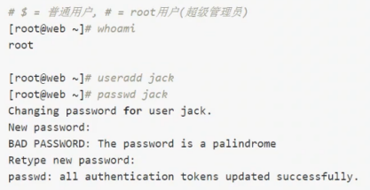

## 1. `Bash Shell` 基本概念

**什么是 `Bash Shell`（壳）：**

```:no-line-numbers
Bash Shell 是一个命令解释器，主要负责用户程序与内核进行交互操作的一种接口。
将用户输入的命令翻译给内核，由内核驱动硬件，最终将处理后的结果输出至 Bash Shell 屏幕终端。
```

**`Bash Shell` 能干什么：**

```:no-line-numbers
使用 Shell 实现对 Linux 系统的大部分管理，如：
1. 文件管理
2. 权限管理
3. 用户管理
4. 磁盘管理
5. 网络管理
6. 软件管理
...
```

**使用 `Shell` 的两种方式：**

1. 输入命令：效率低，适合少量的工作。

2. `Shell Script`（`Shell` 脚本）：效率高，适合重复性的工作。

## 2. `Bash Shell` 提示符



```:no-line-numbers
以上添加用户的命令前的 Bash Shell 提示符如下：
[root@web ~]#
其中：
1. root: 表示当前登录系统的用户名称（root 表示用户为超级管理员）
2. web: 主机名称（在安装系统时可设定，默认为 localhost）
3. ~: 当前用户的家目录。每个用户都有自己的家目录
4. #: 表示当前登录用户为超级管理员。一般不修改该提示符。
   $: 表示当前登录用户为普通用户。一般不修改该提示符。
```

## 3. `Bash Shell` 基础语法

```shell:no-line-numbers
# 命令    选项    参数
command [-options] [arguments]
```

**示例：**


```:no-line-numbers
命令：整条 Shell 命令的主体。
选项：用于调节命令的具体功能，其中：
    1. 以 "-" 引导短格式选项（单个字符），例如 "-a"；
    2. 以 "--" 引导长格式选项（多个字符），例如 "--all"；
    3. 多个短格式选项可以写在一起，只用一个 "-" 引导，例如 "-la"
参数：命令操作的对象，如文件、目录等。

注意：命令必须写在开头，选项和参数的位置可以发生变化。
```


## 4. `Bash Shell` 特性

### 4.1 命令补全 & 路径补全：`tab`

```:no-line-numbers
tab 键可以实现命令补全，路径补全，在实现生产中，tab 补全往往是我们使用最多的，因为可以减少执行命令以及路径出错率。
```

### 4.2 快捷键

#### 4.2.1 光标移动到行首：`Ctrl + A`

#### 4.2.2 光标移动到行尾：`Ctrl + E`

#### 4.2.3 清屏（对应命令 `clear`）：`Ctrl + L`

#### 4.2.4 结束当前任务：`Ctrl + C`

#### 4.2.5 删除光标以后的所有内容：`Ctrl + K`

#### 4.2.6 删除光标以前的所有内容：`Ctrl + U`

#### 4.2.7 按单词删除光标以前的内容：`Ctrl + W`

#### 4.2.8 退出当前的 `Bash` 会话：`Ctrl + D`

```:no-line-numbers
并不影响服务器运行的后台程序
```

#### 4.2.9 按单词进行跳跃：`Ctrl + 左右`

```:no-line-numbers
Mac OS 的快捷键为 ALT + 左右
```

### 4.3 命令的历史记录：`history`

```shell:no-line-numbers
# 查看命令历史记录 history
history

# 保存命令历史记录
history -w

# 清空命令历史记录（不会清空文件）
history -c

# 删除命令历史记录中的第 N 条记录
history -d
```

```shell:no-line-numbers
# 使用 !! 可执行上一条执行过的命令
!!

# 输入 !6 执行 history 命令历史记录中的第 6 条记录
!6

# 使用 !cat 调用 history 命令历史记录中最近一次执行过的 cat 命令
!cat
```

```:no-line-numbers
~/.bash_history 文件就是历史记录文件
```

### 4.4 命令别名：`alias`

**设置别名：**

```shell:no-line-numbers
alias net='cat /etc/sysconfig/network-scripts/ifcfg-ens32'
```

**取消别名：**

```shell:no-line-numbers
unalias net
```

**查看已设置的所有别名：**

```shell:no-line-numbers
alias
```

**永久保存别名：**

```:no-line-numbers
在 A 窗口设置的别名，在 B 窗口是无法使用的。除非将别名保存为永久别名。

别名需要写入到 ~/.bashrc 文件中才能永久保存。
```

```shell:no-line-numbers
echo "alias net='cat /etc/sysconfig/network-scripts/ifcfg-ens32'" >> .bashrc
```

```:no-line-numbers
echo 命令的特点是 “所见即所得”，即该命令会输出该命令后跟随的内容。
">>" 追加操作符的作用是往文件中追加内容。
通过 echo 命令和追加操作符 ">>" 即可将别名保存到 ">>" 后的文件 .bashrc 中。
```