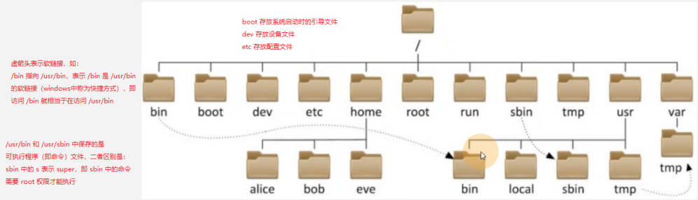

## 1. `linux` 目录结构



### 1.1 命令目录：`/bin --> /usr/bin`、`/sbin --> /usr/sbin`

```:no-line-numbers
/bin --> /usr/bin
存放命令，一般来说，普通用户和 root 用户都可以运行。

/sbin --> /usr/sbin
存在特殊命令，一般来说，root 用户才可以运行。当然，普通用户可以申请操作的权限。
```

### 1.2 用户家目录：`/home`、`/root`

```:no-line-numbers
/home
是普通用户的家目录

/root
是超级管理员的家目录
```

### 1.3 配置文件目录：`/etc`

```:no-line-numbers
/etc
用于存储配置文件的命令，如：
1. 修改 IP 地址：/etc/sysconfig/network-scripts/ifcfg-xxx
2. 修改主机名称：/etc/hostname

修改完配置文件后如何生效？
1. 有的配置在修改后立即生效，即运行命令程序时即可生效。
2. 有的配置在修改后需要重启系统才能生效。
```

### 1.4 启动目录：`/boot`

```:no-line-numbers
/boot
存储系统启动时加载的文件，比如：内核文件、Grub 菜单、救援内核系统等
注意：如果删除启动目录中的文件，可能会造成无法启动系统的问题。
```

### 1.5 设备目录：`/dev`

```:no-line-numbers
/dev
设备目录中主要存放：键盘、光盘、磁盘、终端、/dev/null、/dev/random 等设备文件。
```

#### 1.5.1 黑洞：`/dev/null`

```:no-line-numbers
黑洞文件，存储在这个设备文件中的数据都会丢失。
```

#### 1.5.2 产生随机数：`dev/random`

```:no-line-numbers
产生随机数。
```

### 1.6 临时目录：`/tmp`

```:no-line-numbers
/tmp
谁都可以存储数据在该临时目录中。但是自己的数据只能自己移除，别人只能看却无法移除。
```

### 1.7 可变目录：`/var`

```:no-line-numbers
/var
可变是指会随着系统的运行（运行会产生一些数据、记录）而不断地发生变化。

/var/log
存储日志的目录，如：启动日志、系统操作日志、系统登录日志等。
```

### 1.8 运行时目录：`/proc`

```:no-line-numbers
/proc
记录设备（如 CPU、内存、磁盘）运行状态。
```

### 1.9 系统目录：`/usr`

```:no-line-numbers
/usr
和 windows 中的 C:\program files 目录类似。

/usr/lib, /usr/lib64
存放的是库文件

/usr/local
存放自行安装软件的路径（安装后的位置）。注：现在不用这种方式了

/usr/src
存放安装包（安装前的软件存储路径）。注：现在不用这种方式了
```

## 2. 文件路径

```:no-line-numbers
绝对路径：一定是从 / 开始的。即从 / 开始的路径都是绝对路径。
相对路径：相对于当前所在目录的路径。
```

```:no-line-numbers
.
表示当前目录

..
表示上一级目录
```

## 3. 文件管理命令

### 3.1 创建命令：`mkdir`、`touch`

**创建目录命令：`mkdir`**

```:no-line-numbers
-p: 递归创建目录
-v: 显示过程
```

```shell:no-line-numbers
# 在根目录下创建 linux-76 目录
mkdir /linux-76

# 递归创建多个不存在的目录，并显示创建的过程
mkdir -pv /linux-76/11/22/33/44/55
```

**创建目文件命令：`touch`**

```shell:no-line-numbers
# 在 linux-76 目录中创建 student.txt 文件
touch /linux-76/student.txt
```

### 3.2 删除命令：`rm`

```:no-line-numbers
-r: 删除目录以及目录下的文件，并且采用递归方式
-f: force 强制删除，不提示
-i: 提示是否删除。（系统已为我们添加好别名，所以每次删除时都会提示）
```

```shell:no-line-numbers
# 删除 /student.txt 文件
rm -f /student.txt

# 删除 /linux-76 目录。该目录下有很多子目录，希望递归删除
rm -rf /linux-76/
```

### 3.3 复制命令：`cp`

```:no-line-numbers
-p: 保持源文件的属性在拷贝的过程中不发生变化
-r: 递归
-i: 提示
-v: 显示拷贝的过程

语法：
cp 源文件 目标位置
cp 源文件1 源文件2 ... 源文件n 目标位置
```

```shell:no-line-numbers
# 拷贝 /etc/hosts 文件到 /tmp 目录中
cp /etc/hosts /tmp/
```

```:no-line-numbers
注意：目标位置是一个目录时，
建议写成 /tmp/，此时，如果目录不存在，会报错提示。
如果写成 /tmp，那么当目录不存在时，会将源文件拷贝至 / 下，并改名为 tmp 文件。
```

```shell:no-line-numbers
# 拷贝 /etc 目录到 /tmp 目录中，并改目录名为 etc_back
cp -r /etc /tmp/etc_back
```

```:no-line-numbers
注意：如果源目录中包含子目录，需要使用 -r 选项进行递归拷贝。
```

```shell:no-line-numbers
# 拷贝多个文件：/etc/hostname /etc/fstab /var/ /home/ /tmp/ /root/ --> /backup/
\cp -r /etc/hostname /etc/fstab /var/ /home/ /tmp/ /root/ /backup/
```

```:no-line-numbers
cp 命令是系统为 "cp -i" 命令起的别名，所以执行 cp -r 相当于执行 cp -i -r，于是若存在覆盖的情况，会提示用户。
如果不想用系统别名，可以写成 \cp -r，即去掉了选项 -i，此时，即使存在文件覆盖，也不会提示。

多文件拷贝需注意：
1. /backup/ 目录必须存在
2. cp 命令中的最后一个目录一定是目标位置
```

### 3.4 移动命令：`mv`

```shell:no-line-numbers
# 在用户家目录创建 test 目录，然后移动到 /tmp 目录
cd
mkdir test
mv test/ /tmp/

# mv 还可以用来改名字，如将当前目录下的 test 目录重命名为 abc 文件夹
mv test/ abc

# 移动多个目录到 /tmp 目录
mkdir {a..z}
mkdir {1..100}_pdf
mv 源 源 源 ... 源 目标
```

```:no-line-numbers
touch {1..100}.pdf 命令表示创建 1.pdf 至 100.pdf 的多个文件
```