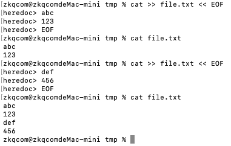
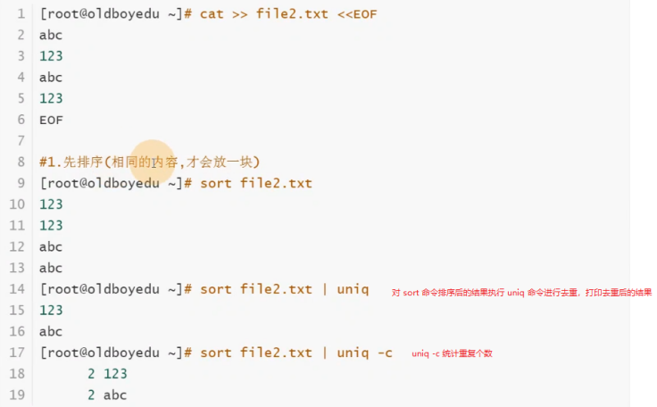
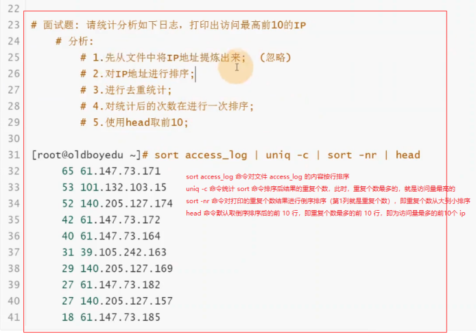
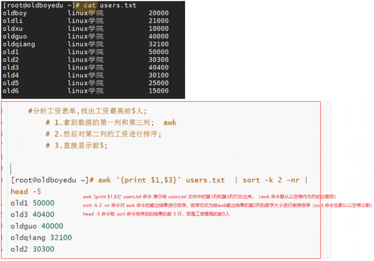
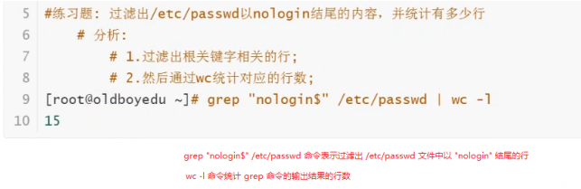
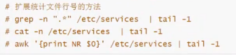

## 1. 文件管理命令

### 1.1 创建命令：`mkdir`、`touch`

**创建目录命令：`mkdir`**

```:no-line-numbers
-p: 递归创建目录
-v: 显示过程
```

```shell:no-line-numbers
# 在根目录下创建 linux-76 目录
mkdir /linux-76

# 递归创建多个不存在的目录，并显示创建的过程
mkdir -pv /linux-76/11/22/33/44/55
```

**创建目文件命令：`touch`**

```:no-line-numbers
touch 可用于创建空文件，或者改变已创建文件的时间戳属性
```

```shell:no-line-numbers
# 创建一个文件
touch /tmp/file.txt

# 创建多个文件
touch /tmp/file1.txt /tmp/file2.txt

# 通过 {} 生成序列，并创建多个文件
touch /tmp/file{1..10}.txt

# {} 中可以是数字序列，也可以是字母序列
touch /tmp/file{a..z}.txt
```

### 1.2 删除命令：`rm`

```:no-line-numbers
-r: 删除目录以及目录下的文件，并且采用递归方式
-f: force 强制删除，不提示
-i: 提示是否删除。（系统已为我们添加好别名，所以每次删除时都会提示）
```

```shell:no-line-numbers
# 删除 /student.txt 文件
rm -f /student.txt

# 删除 /linux-76 目录。该目录下有很多子目录，希望递归删除
rm -rf /linux-76/
```

### 1.3 复制命令：`cp`

```:no-line-numbers
-p: 保持源文件的属性在拷贝的过程中不发生变化
-d: 保持软连接在拷贝的过程中不发生变化
-r: 递归
-i: 提示
-v: 显示拷贝的过程
-a: 相当于 -pdr

语法：
cp 源文件 目标位置
cp 源文件1 源文件2 ... 源文件n 目标位置
```

```shell:no-line-numbers
# 拷贝 /etc/hosts 文件到 /tmp 目录中
cp /etc/hosts /tmp/
```

```:no-line-numbers
注意：目标位置是一个目录时，
建议写成 /tmp/，此时，如果目录不存在，会报错提示。
如果写成 /tmp，那么当目录不存在时，会将源文件拷贝至 / 下，并改名为 tmp 文件。
```

```shell:no-line-numbers
# 拷贝 /etc 目录到 /tmp 目录中，并改目录名为 etc_back
cp -r /etc /tmp/etc_back
```

```:no-line-numbers
注意：如果源目录中包含子目录，需要使用 -r 选项进行递归拷贝。
```

```shell:no-line-numbers
# 拷贝多个文件：/etc/hostname /etc/fstab /var/ /home/ /tmp/ /root/ --> /backup/
\cp -r /etc/hostname /etc/fstab /var/ /home/ /tmp/ /root/ /backup/
```

```:no-line-numbers
cp 命令是系统为 "cp -i" 命令起的别名，所以执行 cp -r 相当于执行 cp -i -r，于是若存在覆盖的情况，会提示用户。
如果不想用系统别名，可以写成 \cp -r，即去掉了选项 -i，此时，即使存在文件覆盖，也不会提示。

多文件拷贝需注意：
1. /backup/ 目录必须存在
2. cp 命令中的最后一个目录一定是目标位置
```

### 1.4 移动命令：`mv`

```shell:no-line-numbers
# 在用户家目录创建 test 目录，然后移动到 /tmp 目录
cd
mkdir test
mv test/ /tmp/

# mv 还可以用来改名字，如：
# 1. 将当前目录下的 test 目录重命名为 abc 文件夹
mv test/ abc
# 2. 将将当前目录下的 file1.txt 文件重命名为 file2.txt 文件
mv file1.txt file2.txt

# 移动多个目录到 /tmp 目录
mkdir {a..z}
mkdir {1..100}_pdf
mv 源 源 源 ... 源 目标
```

```:no-line-numbers
touch {1..100}.pdf 命令表示创建 1.pdf 至 100.pdf 的多个文件
```

## 2. 查看文件类命令：

### 2.1 `cat`

```:no-line-numbers
cat 命令用于查看文件内容。

选项如下：
-n: 显示文件的行数。
-A: 显示文件中的特殊字符。（如果从 windows 拷贝配置文件到 linux，很容易出现多了一些特殊字符的情况，造成服务启动失败）
```


#### 2.1.1 向文件中追加内容：`cat >> file.txt << EOF`



```:no-line-numbers
注意：
1. 如果 file.txt 文件不存在会自动创建；
2. 该命令用于向文件中追加内容，不会覆盖已存在的内容；
3. 输入 EOF 表示结束输入。
```

### 2.2 `less`、`more`

```:no-line-numbers
less、more 命令用于查看内容比较多的文件。
less、more 都是采用分页的方式查看文件内容，区别是 more 会显示百分比

快捷键：
f 下翻页
b 上翻页
q 退出
g 文件第 1 行
G 文件最后 1 行

注：空格也可以下翻页。
```

### 2.3 `head`、`tail`、`tailf`

**查看文件首部内容：`head`**

```:no-line-numbers
默认打印文件前 10 行内容。
也可以通过选项 -<N> 指定打印文件前 <N> 行内容。

注：如果 -<N> 不起作用，可以尝试用 -n<N>。如打印前 5 行: -5 或 -n5
```

```shell:no-line-numbers
# 默认打印文件前 10 行内容
head /etc/passwd

# 指定打印文件前 5 行内容
head -5 /etc/passwd
```

**查看文件尾部内容：`tail`、`tailf`**

```shell:no-line-numbers
默认打印文件最后 10 行内容。
也可以通过选项 -<N> 指定打印文件最后 <N> 行内容。

注：如果 -<N> 不起作用，可以尝试用 -n<N>。如打印最后 5 行: -5 或 -n5
```

```shell:no-line-numbers
# 默认打印文件最后 10 行内容
tail /etc/passwd

# 指定打印文件最后 20 行内容
tail -20 /etc/passwd

# 打印文件最后 20 行内容，并通过管道 | 传递给 head 命令处理，打印出最后 20 行内容中的前 10 行内容
tail -20 /etc/passwd | head

# 实时追踪文件尾部的内容变化
tail -f /etc/passwd
```

```:no-line-numbers
tail -f 相当于 tailf 命令。
```

## 3. 查找可执行文件（命令）所在位置的命令：`which`、`whereis`

```:no-line-numbers
which 和 whereis 命令都可以用来查看命令（可执行文件）的所在位置。
```


## 4. 下载类命令

### 4.1 从网络下载：`wget`、`curl`

**`wget`**

```shell:no-line-numbers
# 默认最小化系统没有 wget 命令，需要安装
yum install wget -y

# 下载资源到当前目录下
wget http://nginx.org/download/nginx-1.19.7.tar.gz

# 下载资源到指定路径下，同时对下载的文件进行重命名
wget -O /tmp/test.repo http://mirrors.aliyun.com/repo/Centos-7.repo
```

**`curl`**

```shell:no-line-numbers
# 下载资源到指定路径下，同时对下载的文件进行重命名
curl -o /tmp/curl.repo http://mirrors.aliyun.com/repo/Centos-7.repo
```

```:no-line-numbers
注意：
1. wget 指定路径的选项是 -O（大写 O）；curl 指定路径的选项是 -o（小写 o）
2. curl 还可以用来获取网页的源码信息
```

### 4.2 本地 Windows 与远程 Linux 互传：`sz`、`rz`

**`sz`**

```:no-line-numbers
sz 命令用于从 linux 服务器下载资源到 windows 系统本地。

注意：
1. 下载的资源只可以是文件，不可以是文件夹；
2. 不支持超过 4G 的文件；
3. 不支持断点续传；
4. 如果必须下载文件夹，可以先压缩。
```

**`rz`**

```:no-line-numbers
rz 命令用于将 windows 的内容上传到 linux 服务器。

注意：
1. 一般直接将文件拖拽到 linux 服务器中；
2. 上传的资源只可以是文件，不可以是文件夹。
```

## 5. 字符文件内容处理类命令

### 5.1 排序 & 去重：`sort` & `uniq`

**`sort`**

```:no-line-numbers
sort 命令用于对文件内容按行排序。

-t: 指定每行内容的分割符。（默认以空格作为分割符）
-r: 反转顺序
-n: 按数字大小排序。（默认按字符顺序排列，即：先比较两行的第 1 个字符，再比较第 2 个字符，以此类比...）
-k: 指定分割后的列
```

```shell:no-line-numbers
# -k3.1,3.1 表示按第 3 列的第 1 个字符到第 3 列的第 1 个字符排序（即仅仅只按第 3 列的第 1 个字符排序）
# -k4.1,4.3 表示按第 4 列的第 1 个字符到第 4 列的第 3 个字符排序（即按第 4 列的前 3 个字符排序）
sort -t "." -k3.1,3.1 -k4.1,4.3 -n ip.txt
```

**`uniq`**

```:no-line-numbers
uniq 命令用于对相同且连续的多行内容进行去重。（注：不连续的相同行无法去重）
因此，在使用 uniq 去重之前，需要通过 sort 命令进行排序，使重复的行连续排列。

uniq -c 可以统计重复个数
```

#### 5.1.1 示例代码一



#### 5.1.2 示例代码二：打印出访问最高的前 `10` 个 `IP`



#### 5.1.3 示例代码三：找出工资最高的前 `5` 人（`awk` 和 `sort` 结合使用）



### 5.2 统计文件的行数：`wc`

```:no-line-numbers
wc 命令用来统计文件的行数。当然也可以用来统计控制台输出的行数。

wc [OPTION]... [FILE]...

-l: 显示文件行数
-c: 显示文件字节
-w: 显示文件单词
```

```shell:no-line-numbers
# 统计 /etc/services 文件的函数
wc -l /etc/services
```

#### 5.2.1 示例代码：统计 `/etc/passwd` 文件中以 `nologin` 结尾的行数



#### 5.2.2 统计文件行号的几种方法



### 5.3 过滤行 & 过滤列：`grep` & `awk`

```:no-line-numbers
过滤列时要想到 awk 命令；
过滤行时要想到 grep 命令。
```

**`grep`**

```shell:no-line-numbers
# 在 /etc/passwd 文件中过滤出包含 root 的行
grep "root" /etc/passwd

# 在 /etc/passwd 文件中过滤出以 root 开头的行
# 这里需要用到正则表达式符号 ^
grep "^root" /etc/passwd

# 在 /etc/passwd 文件中过滤出以 bash 结尾的行
# 这里需要用到正则表达式符号 $
grep "bash$" /etc/passwd

# 在 /etc/passwd 文件中过滤出包含 ftp 的行，且忽略大小写的匹配。
grep -i "ftp" /etc/passwd

# 在 /etc/passwd 文件中过滤出排除了包含 ftp 之外的其他行
grep -v "ftp" /etc/passwd

# 在 /etc/passwd 文件中过滤出包含 ftp，或者以 sync 结尾的行，且忽略大小写的匹配。
# grep 使用正则表达式中的或符号 "|" 时，需要加选项 -E，否则无法识别。
# 也可以使用 egrep 命令代码 grep -E
grep -Ei "sync$|ftp" /etc/passwd

# 在 /var/log/secure 文件中过滤出包含 Failed 的行，并打印它的下面 2 行。
grep -n -A 2 "Failed" /var/log/secure

# 在 /var/log/secure 文件中过滤出包含 Failed 的行，并打印它的上面 2 行。
grep -n -B 2 "Failed" /var/log/secure

# 在 /var/log/secure 文件中过滤出包含 Failed 的行，并打印它的上下 2 行。
grep -n -C 2 "Failed" /var/log/secure
```

**`awk`**

```:no-line-numbers
awk 命令中只能使用单引号。

-F 
指定分割符，如 awk -F ':' 指定分割符为 :

awk '{print $<N>}' 
打印第 <N> 列，如 awk '{print $1}' 打印第 1 列

awk '{print $NF}'
打印最后一列

awk 'NR==<N>'
打印第 <N> 行，如 awk 'NR==1' 打印第 1 行
```

#### 5.3.1 使用 `ifconfig` 命令需要安装 `net-tools` 软件

```shell:no-line-numbers
yum install net-tools -y
```

```shell:no-line-numbers
# 执行 ifconfig 命令查看 en1 的信息
zkqcom@zkqcomdeMac-mini _1_basic % ifconfig en1
en1: flags=8863<UP,BROADCAST,SMART,RUNNING,SIMPLEX,MULTICAST> mtu 1500
    options=6463<RXCSUM,TXCSUM,TSO4,TSO6,CHANNEL_IO,PARTIAL_CSUM,ZEROINVERT_CSUM>
    ether 00:8a:76:e7:a9:44 
    inet6 fe80::88a:fe05:6f03:e3c0%en1 prefixlen 64 secured scopeid 0xc 
    inet 192.168.101.10 netmask 0xffffff00 broadcast 192.168.101.255
    nd6 options=201<PERFORMNUD,DAD>
    media: autoselect
    status: active
```

#### 5.3.2 将系统 `IP` 地址打印出来（`grep` 命令取行，`awk` 命令取列）

```shell:no-line-numbers
zkqcom@zkqcomdeMac-mini _1_basic % ifconfig en1 | grep "inet " | awk '{print $2}'
192.168.101.10
```

#### 5.3.3 将系统 `IP` 地址打印出来（`awk` 命令取行 & 取列）

```shell:no-line-numbers
# awk 'NR==5' 命令表示取第 5 行（索引从 1 开始）。NR 可以理解为 number of row
zkqcom@zkqcomdeMac-mini _1_basic % ifconfig en1 | awk 'NR==5' | awk '{print $2}'
192.168.101.10

# awk 'NR==5' | awk '{print $2}' 可以合并写成 awk 'NR==5 {print $2}'
zkqcom@zkqcomdeMac-mini _1_basic % ifconfig en1 | awk 'NR==5 {print $2}'
192.168.101.10
```

#### 5.3.4 打印 `/etc/passwd` 文件中的用户名与 `UID`（`awk` 的分割符设置）

```:no-line-numbers
/etc/passwd 文件中用户名与用户的 UID 分别在以 ':' 为分割符的第 1 列和第 3 列。
此时，需要使用 -F 选项设置 awk 命令的分割符。
```

```shell:no-line-numbers
# awk 命令默认以空格作为分割符。也可以使用选项 -F 自定义分割符，如 -F ':' 表示定义分割符为 :
awk -F ':' '{print $1,$3}' /etc/passwd 
```

## 6. 其他常用命令

### 6.1 显示目录下的内容及相关属性信息：`ls`

```:no-line-numbers
-l: 详细信息
-a: 所有文件（包含隐藏文件）
-d: 显示目录本身的信息，而不是目录内容
-h: 一般与 -l 一起使用，表示以人类可读的形式显示文件大小
-r: 逆序排序
-t: 按照文件修改时间排序
```

### 6.2 切换目录：`cd`

```:no-line-numbers
cd 即 change directory

切换到家目录: cd 或 cd ~
切换到上一级目录: cd ..
切换到上一次所在目录: cd -
```

### 6.3 显示当前所在的位置：`pwd`

```:no-line-numbers
pwd 即 print working directory
```

### 6.4 以树形结构显示目录下的内容：`tree`

### 6.5 将 `DOS` 格式文件转换为 UNIX 格式：`dos2unix`

```:no-line-numbers
即：将 windows 系统中拷贝过来的带 DOS 格式的文件转换为 Linux 系统中的 UNIX 格式的文件。
```

### 6.6 自动化 `RPM` 包管理工具：`yum`

```:no-line-numbers
yum 即 Yellow Dog （黄狗）

示例：同时安装 3 个软件。其中 -y 表示安装时默认选择 yes
yum install -y tree wget vim
```

