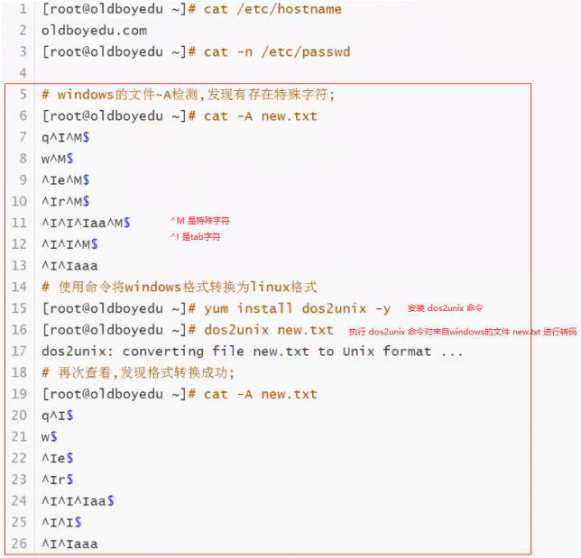
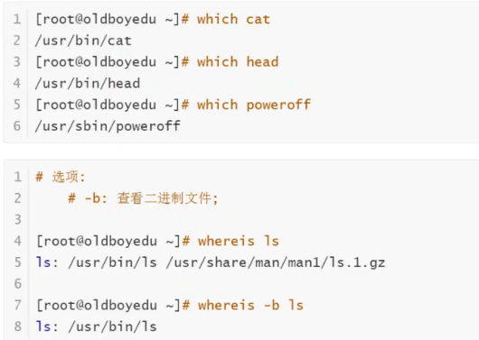

## 1. 查看文件类命令：

### 1.1 `cat`

```:no-line-numbers
cat 命令用于查看文件内容。

选项如下：
-n: 显示文件的行数。
-A: 显示文件中的特殊字符。（如果从 windows 拷贝配置文件到 linux，很容易出现多了一些特殊字符的情况，造成服务启动失败）
```



### 1.2 `less`、`more`

```:no-line-numbers
less、more 命令用于查看内容比较多的文件。
less、more 都是采用分页的方式查看文件内容，区别是 more 会显示百分比

快捷键：
ctrl + f 下翻页
ctrl + b 上翻页
q        退出

注：空格也可以下翻页。
```

### 1.3 `head`、`tail`、`tailf`

**查看文件首部内容：`head`**

```:no-line-numbers
默认打印文件前 10 行内容。
也可以通过选项 -<N> 指定打印文件前 <N> 行内容。
```

```shell:no-line-numbers
# 默认打印文件前 10 行内容
head /etc/passwd

# 指定打印文件前 5 行内容
head -5 /etc/passwd
```

**查看文件尾部内容：`tail`、`tailf`**

```shell:no-line-numbers
默认打印文件最后 10 行内容。
也可以通过选项 -<N> 指定打印文件最后 <N> 行内容。
```

```shell:no-line-numbers
# 默认打印文件最后 10 行内容
tail /etc/passwd

# 指定打印文件最后 20 行内容
tail -20 /etc/passwd

# 打印文件最后 20 行内容，并通过管道 | 传递给 head 命令处理，打印出最后 20 行内容中的前 10 行内容
tail -20 /etc/passwd | head

# 实时追踪文件尾部的内容变化
tail -f /etc/passwd
```

```:no-line-numbers
tail -f 相当于 tailf 命令。
```

## 2. 查找可执行文件（命令）所在位置的命令：`which`、`whereis`

```:no-line-numbers
which 和 whereis 命令都可以用来查看命令（可执行文件）的所在位置。
```



## 3. 下载类命令

### 3.1 从网络下载：`wget`、`curl`

### 3.2 本地 Windows 与远程 Linux 互传：`sz`、`rz`

## 4. 字符文件内容处理类命令

### 4.1 排序：`sort`

### 4.2 去重：`uniq`

### 4.3 统计文件的行数：`wc`

### 4.4 过滤行 & 过滤列：`grep` & `awk`