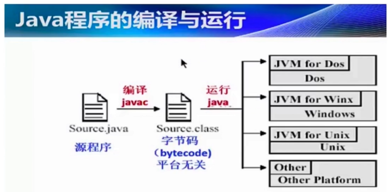

## 1. 从 `Java` 代码到 `CPU` 指令



如上图：
1. 最开始，我们编写的 `Java` 代码是 `*.java` 文件；
2. 在编译（`javac` 命令）后，从刚才的 `*.java` 文件生成一个新的 `Java` 字节码文件（`*.class`）；
3. `JVM` 会执行刚才生成的字节码文件（`*.class`），并把字节码文件转换成机器指令；
4. 机器指令可以直接在 `CPU` 上运行，也就是最终的程序执行。

## 2. `JVM` 内存结构 & `Java` 内存模型 & `Java` 对象模型

这是三个截然不同的概念，其中：
1. `JVM` 内存结构，和 `Java` 虚拟机的运行时区域有关。
2. `Java` 内存模型，和 `Java` 的并发编程有关。
3. `Java` 对象模型，和 `Java` 对象在虚拟机中的表现形式有关。

### 2.1 `JVM` 内存结构


如上图，`JVM` 内存结构包括：
1. 堆（`heap`）
2. 虚拟机栈（`VM stack`），即图中的 `Java` 栈
3. 方法区（`method`）
4. 本地方法栈
5. 程序计数器

### 2.2 `Java` 对象模型

`Java` 对象模型就是 `Java` 对象自身的存储模型。

`JVM` 会给一个类创建一个 `instanceKlass`，保存在方法区，用来在 `JVM` 层表示该 `Java` 类。

当我们在 `Java` 代码中使用 `new` 创建一个对象时，`JVM` 会创建一个 `instanceOopDesc` 对象，这个对象中包含了对象头以及实例数据。


> 参考 《内存分配》 中的 [对象的内存布局](/zkq/project-experiences/project-list/others/jvm/memory-allocate.html#_2-3-对象的内存布局-对象头、实例数据、对齐填充)
> 
> 参考 《内存分配》 中的 [对象的访问方式](/zkq/project-experiences/project-list/others/jvm/memory-allocate.html#_2-4-对象的访问方式-使用句柄、使用指针)

## 3. `Java` 内存模型（`JMM`）

`JMM` 即 `Java Memory Model`

### 3.1 为什么需要 `JMM`

`C` 语言不存在内存模型的概念，因此：
1. `C` 语言依赖处理器，不同处理器结果不一样
2. `C` 语言无法保证并发安全

`Java` 程序设计中，需要一个标准，让多线程运行的结果可预期。

### 3.2 `JMM` 是一种规范

`JMM` 是一组规范，需要各个 `JVM` 的实现来遵循 `JMM` 规范，以便于开发者可以利用这些规范，更方便地开发多线程程序。

如果没有这样的一个 `JMM` 内存模型来规范，那么很可能经过了不同 `JVM` 的不同规则的重排序之后，导致不同的虚拟机上运行的结果不一样，那是很大的问题。

### 3.3 `JMM` 是工具类和关键字的原理

`volatile`、`synchronized`、`Lock` 等的原理都是 `JMM`。

如果没有 `JMM`，那就需要我们自己指定什么时候用内存栅栏等，那是相当麻烦的。幸好有了 `JMM`，让我们只需要用同步工具和关键字就可以开发并发程序。

### 3.4 `JMM` 的三个重要内容（重排序、可见性、原子性）

`JMM` 的三个重要内容是：
1. 重排序
2. 可见性
3. 原子性

## 4. 重排序

### 4.1 什么是重排序


如上代码中，演示了重排序的现象，分析如下：

```:no-line-numbers
不考虑重排序，x 和 y 的执行结果只有三种情况：
1. 线程 one 中的 a=1; x=b 先执行完毕，再执行线程 two 中的 b=1; y=a
    此时，由于线程 one 中给 x 赋值的时候线程 two 中还未给 b 赋值，所以 x=0, y=1
2. 线程 two 中的 b=1; y=a 先执行完毕，再执行线程 one 中的 a=1; x=b
    此时，由于线程 two 中给 y 赋值的时候线程 one 中还未给 a 赋值，所以 x=1, y=0
3. 线程 one 中的 a=1 先执行，再执行线程 two 中的 b=1，接着再执行线程 one 中的 x=b，最后再执行线程 two 中的 y=a，此时，x=1, y=1

也就是说，不考虑重排序的情况，是不会出现 x=0, y=0 的情况的。
但是，执行程序，可以发现，经过若干次的 for 循环后，会出现 x=0, y=0 的情况，
这是因为线程 one 或/和 线程 two 发生了重排序。考虑如下 2 个线程都发送重排序的情况：
1. 线程 one 中的 a=1; x=b 重排序后的执行顺序变成了 x=b; a=1
2. 线程 two 中的 b=1; y=a 重排序后的执行顺序变成了 y=a; b=1
于是，当线程 one 中的 x=b 先执行，再执行线程 two 中的 y=a 时，就会出现 x=0, y=0 的情况。
（当然，线程 one 或线程 two 中的仅仅某一个线程发生重排序，也可能会出现 x=0, y=0 的情况）
```

分析完上面的代码后，我们可以对重排序进行如下定义：

```:no-line-numbers
什么是重排序？
    在线程 1 内部的两行代码的实际执行顺序和代码在 Java 文件中的顺序不一样，代码指令并不是严格按照代码语句顺序执行的，
    它们的顺序被改变了，这就是重排序。
    如上代码中，被颠倒的可能是 y=a 和 b=1 这两行语句。
```

### 4.2 重排序的好处（提高处理速度）


如上图所示，对比重排序前后的指令优化，重排序明显提高了处理速度。

### 4.3 重排序的 `3` 种情况

如下三种情况下，都可以发生重排序：
1. 编译器优化：包括 `JVM`，`JIT` 编译器等
2. `CPU` 指令重排：就算编译器不发生重排，`CPU` 也可能对指令进行重排
3. 内存的 “重排序”：线程 `A` 的修改线程 `B` 却看不到，从而引出 **可见性问题**

## 5. 可见性

### 5.1 什么是可见性问题


如上代码所示，分析如下三种情况：


```:no-line-numbers
1. 当读线程 readThread 先全部执行完毕时，就会打印 b=2; a=1
2. 当写线程 writeThread 先全部执行完毕后，再执行读线程 readThread，就会打印 b=3; a=3
3. 当写线程 writeThread 先执行到 a=3，然后切换到读线程 readThread 执行，此时，读线程 readThread 就会打印 b=2; a=3
```

**特别地，当出现可见性问题时，就会出现 `b=3; a=1` 的情况：**


```:no-line-numbers
什么是可见性问题？
    如上输出结果，就是写线程 writeThread 中虽然已经执行了 a=3; b=a，
    但是，读线程 readThread 中却无法发现变量 a, b 中的值被修改了，或者只发现其中某个变量的值被修改了。

为什么会发生可见性问题？
    之所以出现可见性问题，是由于主内存和工作内存（也称本地内存）的存在引起的。
    主内存是多线程共享的，工作内存是线程私有的。
    多线程访问的共享变量可以认为是保存在主内存中的，
    但是线程中操作的共享变量，却不是主内存中的共享变量，而是主内存的共享变量的副本拷贝。
    即线程会把共享变量拷贝到自己的工作内存中，操作结束后，再把修改了的共享变量返回给主内存。
    于是，就会出现这样一个问题：
    当写线程 writeThread 修改了工作内存中的变量 a 和 b，且把变量 b 返回给了主内存（还没有将变量 a 返回给主内存），
    此时，切换到读线程 readThread，于是，读线程 readThread 从主内存中访问到的变量 b=3，但变量 a 仍然是 1
```

#### 用 `volatile` 解决可见性问题

```java
public class FieldVisibility {
    // int x = 0; // 未使用 volatile 时
    volatile int x = 0;

    public void writeThread() { // 假设在写线程中执行
        x = 1;
    }

    public void readThread() { // 假设在读线程中执行
        int r2 = x;
    }
}
```

**未使用 `volatile` 时**


**使用 `volatile` 时**


### 5.2 为什么会有可见性问题


出现可见性问题的根本原因就是 **`CPU` 有多级缓存，导致读的数据过期**，具体为：
1. 高速缓存的容量比主内存小，但是速度仅次于寄存器，所以在 `CPU` 和主内存之间就多了 `Cache` 层。
2. 线程间的对于共享变量的可见性问题不是直接由多核引起的，而是**由多缓存引起的**。
3. 如果所有的核心都只用一个缓存，那么也就不存在内存可见性问题了。
4. 每个核心都会将自己需要的数据读到独占缓存中，数据修改后也是写入到缓存中，然后等待刷入到主内存中。所以会导致有些核心读取的值是一个过期的值。

### 5.3 `JMM` 的抽象：主内存&本地内存

#### 5.3.1 什么是主内存和本地内存


如上如的底层细节中：

```:no-line-numbers
core1，core2，core3，core4 看成是一个个的线程（即将核心理解为线程）
registers，L1 cache，L2 cache 看成是工作内存
L3 cache，RAM 看成是主内存
```

`Java` 作为高级语言，屏蔽了这些底层细节，用 `JMM` 定义了一套读写内存数据的规范。虽然我们不再需要关系一级缓存和二级缓存的问题，但是，`JMM` 抽象了主内存和本地内存的概念。

这里说的本地内存并不是真的是一块给每个线程分配的内存，而是 `JMM` 的一个抽象，是对于寄存器、一级缓存、二级缓存等的抽象。


#### 5.3.2 主内存和本地内存的关系（导致可见性问题）

`JMM` 有以下规定：
1. 所有的变量都存储在主内存中，同时每个线程也有自己独立的工作内存，工作内存中的变量内容是主内存中的拷贝；
2. 线程不能直接读写主内存中的变量，而是只能操作自己工作内存中的变量 ，然后再同步到主内存中；
3. 主内存是多个线程共享的，但线程间不共享工作内存，如果线程间需要通信，必须借助主内存中转来完成。

于是，由于所有的共享变量存在于主内存中，每个线程有自己的本地内存，且线程读写共享数据也是通过本地内存交互的，所以就导致了可见性问题。

### 5.4 `Happens-Before` 规则（保证可见性的规则）

`Happens-Before` 规则就是保证可见性的规则。

> 即：如果 `A happens before B`（可记为 `hb(A, B)`），那么 `A` 对主内存中变量的修改，对 `B` 都可见。

`Happens-Before` 规则包括：
1. 单线程规则
2. 锁操作（`synchronized` 和 `Lock`）
3. `volatile` 变量
4. 线程启动
5. 线程 `join`
6. 传递性
7. 中断
8. 构造方法
9. 工具类的 `Happens-Before` 规则

#### 5.4.1 单线程规则

```:no-line-numbers
单线程规则指明：在同一个线程中，前面语句的执行结果对后面的语句都可见。
即使发生重排序，单线程规则也不会改变。
```


#### 5.4.2 锁操作（`synchronized` 和 `Lock`）


如上图：

```:no-line-numbers
假设线程 A 先获取到锁 M，而线程 B 在等待锁 M。
那么当线程 A 解锁后，线程 B 获取到锁 M 且继续执行时，
线程 B 加锁后的操作中所访问主内存的变量 x 的值，肯定是线程 A 修改后的值。
即，此时线程 A 修改后的变量 x 的值对获取到锁后的线程 B 来说总是可见的。
```

#### 5.4.3 `volatile` 变量

```:no-line-numbers
只要线程 A 中已经修改了主内存中的被 volatile 修饰的变量，
那么线程 B 中从主内存中拿到的这个被 volatile 修饰的变量的值就一定是被线程 A 修改后的值，不会出现可见性问题。
也就是说，一个线程中对 volatile 变量所做过的修改，在其他线程访问该 volatile 变量时，总是可见的，
不会由于主内存和工作内存之间的同步不及时而导致可见性问题。
```


#### 5.4.4 线程启动

```:no-line-numbers
在线程 A 中启动线程 B 时，在线程 A 中调用线程 B 的 start() 方法之前的所有修改，在线程 B 运行时都是可见的。
```


#### 5.4.5 线程 `join`

```:no-line-numbers
在 Thread A 中执行 threadB.join(); 会保证 Thread B 先执行完毕后，再继续执行 Thread A,
之后，在 Thread A 中执行 statement 1; 时，Thread B 中对主内存中变量的修改，在 Thread A 中都是可见的。
```


#### 5.4.6 传递性

如果 `hb(A, B)` 而且 `hb(B, C)`，那么可以推出 `hb(A, C)`。

```:no-line-numbers
hb 表示 happens before，
hb(A, B) 表示 A happens before B，即 A 对主内存中变量的修改，对 B 都是可见的。

传递性就是指：
    如果 A 对主内存中变量的修改对 B 都可见，且 B 对主内存中变量的修改对 C 都可见，
    那么 A 对主内存中变量的修改对 C 都可见。
    即：如果 hb(A, B) 且 hb(B, C)，那么 hb(A, C)。
```

#### 5.4.7 中断

```:no-line-numbers
一个线程被其他线程 interrupt 时，那么检测中断（isInterrupted）或者抛出 InterruptedException 一定能看到。
```

#### 5.4.8 构造方法

```:no-line-numbers
对象构造方法的最后一行指令 happens-before 于 finalize() 方法的第一行指令。
```

#### 5.4.9 工具类的 `Happens-Before` 规则

包括：
1. 线程安全的容器 `get` 一定能看到在此之前的 `put` 等存入动作
2. `CountDownLatch`
3. `Semaphore`
4. `Future`
5. 线程池
6. `CyclicBarrier`

#### 5.4.10 `happens-before` 演示案例


以上代码中，会出现如下几种情况：

```:no-line-numbers
1. a=3, b=2
2. a=1, b=2
3. a=3, b=3

特别地，当没有给 b 加 volatile 时，还有可能出现第 4 种情况：
4. a=1, b=3

这是因为 a 虽然被修改来了，但是其他线程不可见 ，而 b 恰好其他线程可见，从而造成 a=1, b=3。
```

以上案例中使用了 `happens-before` 规则中的 `volatile` 变量规则避免了由于可见性问题而导致的 `a=1, b=3` 的结果:

```:no-line-numbers
volatile 变量规则：
    如果 A 是对 volatile 变量的写操作，B 是对同一个变量的读操作，那么 hb(A, B)。
```

##### `volatile` 实现轻量级同步（近朱者赤）

如上演示案例中，给 `b` 加了 `volatile`，不仅 `b` 被影响了，也可以实现轻量级同步，即：

```:no-line-numbers
b 之前的写入（即 b=a 之前的 a=3）对读取 b 后的代码（即 print b 后的 print a）都可见，
所以在 writeThread 里对 a 的赋值，一定会对 readThread 里的读取可见，所以这里的 a 即使不加 volatile，
只要 b 读到的是 3，就可以由 happens-before 规则保证读取到的都是 3，而不可能读取到 1。
```

> 可以理解成 `happens-before` 规则中的传递性规则。

### 5.5 `volatile` 关键字

#### 5.5.1 `volatile` 是什么

`volatile` 是一种同步机制，比 `synchronized` 或者 `Lock` 相关类更轻量，因为使用 `volatile` 并不会发生上下文切换等开销很大的行为。

如果一个变量被修饰成 `volatile`，那么 `JVM` 就知道了这个变量可能会被并发修改。

`volatile` 的开销小也就意味着了相应的能力也小，虽然说 `volatile` 是用来同步的，保证线程安全的，但是 `volatile` 做不到 `synchronized` 那样的**原子保护**，`volatile` 仅在很有限的场景下才能发挥作用。

#### 5.5.2 `volatile` 的适用场合

`volatile` 关键字就是让写线程中对被 `volatile` 修饰的变量所做的修改实时地刷新到主内存中，让读线程访问被 `volatile` 修饰的变量时，直接从主内存中读取。

`volatile` 关键字可以**保证原子操作的线程安全**（即让原子操作的结果对其他线程可见）。但是无法保证非原子操作的线程安全（即无法避免组成非原子操作的各个原子操作之间的线程切换引起的线程安全问题）。

```:no-line-numbers
如 a++ 是非原子操作，可分解为 tmp=a+1 和 a=tmp 两个原子操作。如果在这两个原子操作之间出现了线程切换，那么就会出现线程安全问题。
因此，当用 volatile 修饰变量 a 时，只能保证 a=tmp 赋值后实时地刷新到主内存，
但无法避免 tmp=a+1 和 a=tmp 这两个原子操作之间可能出现的线程切换所引起的线程安全问题。

再如 flag=true 是原子操作，如果 flag 被 volatile 修饰，那么可以保证 flag=true 这条原子操作语句是线程安全的。

又如 flag=!flag 不是原子操作，假设 flag=false，则 flag=!flag 可分解为 tmp=!flag 和 flag=tmp，
因此，即使 flag 被 volatile 修饰，也有可能因在 tmp=!flag 和 flag=tmp 之间出现线程切换引起线程安全问题。
```

综上：
1. `volatile` **不适用于多线程下的非原子操作**（如 `a++`，`flag=!flag`）。
2. `volatile` **可适用于多线程下的原子操作**（如 `flag=true`）。

另外，`volatile` 还可以作为刷新之前变量的触发器：


如上代码所示：

```:no-line-numbers
由 happens-before 的单线程规则可知，hb(123, 4)
由 happens-before 的 volatile 变量的规则可知，hb(4, 5)
于是，由 happens-before 的传递性规则可推出，hb(123, 5)

因此，如果在 Thread B 中读取变量 initialized 为 true 时，
就说明了在 Thread A 中的前三条语句中的初始化代码都执行完毕，初始化结果对 Thread B 可见了。
所以，这里就可以将被 volatile 修饰的 initialized 变量看成一个触发器，
即当 Thread B 中发现 initialized 的值为 true 时，表示 Thread A 中的初始化结果可见，
此时就可以结束 while 循环，触发 Thread B 中的 "// use configOptions" 之后的代码继续执行。
```

#### 5.5.3 `volatile` 的作用（避免可见性问题、禁止重排序）

`volatile` 有两点作用：

1. 避免可见性问题
   
    > 读取一个 `volatile` 变量之前，需要先使相应的本地缓存失效 ，这样就必须到主内存读取最新值，写一个 `volatile` 属性会立即刷入到主内存。

2. 禁止指令重排序

    > [解决单例双重锁乱序问题](/zkq/project-experiences/project-list/personal-advantage/design-pattern/Singleton-Pattern.html#双重检查【推荐用】)

#### 5.5.4 `volatile` 和 `synchronized` 的关系

`synchronized` 关键字不但能够保证可见性，还能够将一系列的非原子操作包裹成一个原子操作。

> 即保证在这一系列的非原子操作之间不发生线程切换，从而避免线程切换引起的线程安全问题。

而 `volatile` 关键字只能够保证可见性。

> 即只能够避免因线程私有的工作内存和多线程共有的主内存之间的不及时同步，而导致其他线程访问主内存中的变量值不是被线程修改后的变量值，所引起的线程安全问题。

简而言之：
1. `synchronized` 关键字既可以保证可见性，又可以保证原子性；
2. `volatile` 关键字只能够保证可见性。

如下情况中，`volatile` 可以看做是轻量版的 `synchronized`：

```:no-line-numbers
如果一个共享变量自始至终只被各个线程赋值，而没有其他的操作，
那么就可以用 volatile 来代替 synchronized 或者代替原子变量。
因为赋值自身是具有原子性的，而 volatile 又保证了可见性，所以就足以保证线程安全。
```

#### 5.5.5 用  `volatile` 修正重排序问题


相比于[未修正的代码](/zkq/project-experiences/project-list/others/java-jmm.html#_4-1-什么是重排序)，这里将变量 `a,b,x,y` 都用 `volatile` 修饰了。

#### 5.5.6 `volatile` 补充

1. `volatile` 属性的读写操作都是**无锁的**，它不能代替 `synchronized`，因为它没有提供原子性和互斥性。因为无锁，不需要在获取锁和释放锁上花费时间，所以说它是低成本的。

2. `volatile` 可以使得 `long` 和 `double` 的赋值是原子的（后面会详细介绍）。

### 5.6 能保证可见性的措施

除了 `volatile` 可以让变量保证可见性外，`synchronized`、`Lock`、并发集合、`Thread.join()` 和 `Thread.start()` 等都可以保证变量的可见性。

> 具体看 `happens-before` 规则的规定。

### 5.7 对 `synchronized` 可见性的正确理解

1. `synchronized` 不仅保证了原子性，还保证了可见性。
   
2. `synchronized` 不仅让被保护的代码安全，还近朱者赤，如下代码所示：

    

## 6. 原子性

### 6.1 什么是原子性

不管是一条语句的操作，还是多条语句的操作，只要操作满足 “要么全部执行成功，要么全部不执行，不会出现只执行一半的情况” 的条件，那么就说这样的操作具体原子性。

> 即：具备原子性的操作是一个不可分割的 “整体”。

> 现实中，如 “ATM里取钱” 这样的操作是具备原子性的；
>
> 代码中，用 `synchronized` 包裹的同步代码块组成的操作是具备原子性的

> 注意：`i++` 操作不具备原子性，该操作可分解为 tmp=a+1 和 a=tmp 两个操作。

### 6.2 `Java` 中的原子操作有哪些

原子操作可以理解为具备原子性的只包含一条语句的操作。

> 如果想要包含多条语句的操作具备原子性，可以使用 `synchronized` 关键字。

`Java` 中的原子操作有：

1. 除 `long` 和 `double` 之外的基本类型（`int`、`byte`、`boolean`、`short`、`char`、`float`）的赋值操作；
   
    > 不能是复合赋值操作，且右操作数是变量或常量，不能是表达式或函数。

2. 所有引用 `reference` 的赋值操作，不管是 `32` 位的机器还是 `64` 位的机器。

    > 不能是复合赋值操作，且右操作数是变量或常量，不能是表达式或函数。

3. `java.concurrent.Atomic.*` 包中所有类的原子操作。

### 6.3 `long` 和 `double` 的原子性

官方文档提出：

```:no-line-numbers
对于占 8 字节（64 位）的 long 类型变量和 double 类型变量的赋值操作，
在 32 位操作系统中不具备原子性，在 64 位的操作系统中则具备原子性。

因为 long 或 double 占 64 位，所以在 32 位操作系统中向 long 或 double 类型的变量写入数据时，会分两次写入（每次写 32 位数据）。
为了保证 long 或 double 类型变量的赋值操作具备原子性，应该使用 volatile 修饰 long 或 double 类型的变量。
```

> 对于商用的 `Java` 虚拟机，`JVM` 内部已经保证了 `long` 或 `double` 类型变量的赋值操作具备原子性。因此，实际开发中，不再需要为了保证 `long` 或 `double` 类型变量的赋值操作具备原子性，而使用 `volatile` 关键字修饰它们。


### 6.4 原子操作 + 原子操作 != 原子操作

简单地把原子操作组合在一起，并不能保证整体依然具有原子性。

> 比如去 `ATM` 机两次取钱是两次独立的原子操作，但是期间有可能银行卡被借给女朋友，也就是被其他线程打断并被修改。

另外，全同步的 `HashMap` 也不完全安全。

> 即使 `HashMap` 的写操作具备原子性（如用 `synchronized` 修饰 `put` 方法），读操作也具备原子性（如用 `synchronized` 修饰 `get` 方法）。但是，由读操作和写操作组成的操作却不具备原子性，即在读操作和写操作之间可能会出现线程切换的情况，从而引起线程安全问题。

## 7. `JMM` 的应用（双重检查实现单例）

[参考](/zkq/project-experiences/project-list/personal-advantage/design-pattern/Singleton-Pattern.html#双重检查【推荐用】)