## 1. 实现多线程的 `2` 种方式

`Oracle` 官网的文档中给出了 `2` 种实现多线程的方式：
1. 实现 `Runnable` 接口；
2. 继承 `Thread` 类。

以上两种方式都会调用 `Thread.run()` 方法，区别是：
1. 实现 `Runnable` 接口，只是执行 `Thread.run()` 方法中的 `target.run()` 方法。
    > `target` 就是 `Runnable` 对象
2. 继承 `Thread` 类，就是重写 `Thread.run()` 方法，将 `Thread.run()` 方法中的内容都覆盖掉。

```java
/* Thread.java */
@Override
public void run() {
    if (target != null) {
        target.run();
    }
}
```

推荐采用实现 `Runnable` 接口的方式，理由：
1. 实现 `Runnable` 接口，使得线程的创建以及运行机制，与线程任务代码解耦。更符合面向对象的思想；
2. 实现 `Runnable` 接口，不需要每次执行线程任务时，都 `new` 一个新的线程。可以通过重用线程池中已有的线程来执行线程任务，提高资源利用率；
3. 实现 `Runnable` 接口的类还可以继承其他类，而继承 `Thread` 则无法再继承其他类了。因此，实现 `Runnable` 接口的方式，扩展性更好。

### 1.1 典型错误观点分析

#### 错误观点1. 线程池创建线程是一种新建线程的方式

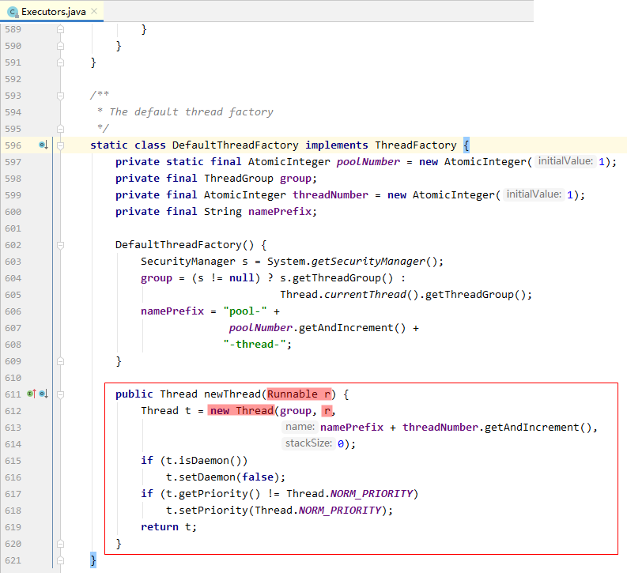

如上图，线程池是通过 `ThreadFactory` 接口的 `newThread(Runnable)` 方法来获取线程的。而每个 `ThreadFactory` 接口的实现类重写 `newThread(Runnable)` 方法时，都是通过传入一个 `Runnable` 接口的实现类对象来创建线程的。
> 也就是说，线程池创建线程的本质还是通过 **实现 `Runnable` 接口** 完成的。

#### 错误观点2. 通过 `Callable` 和 `FutureTask` 创建线程是一种新建线程的方式

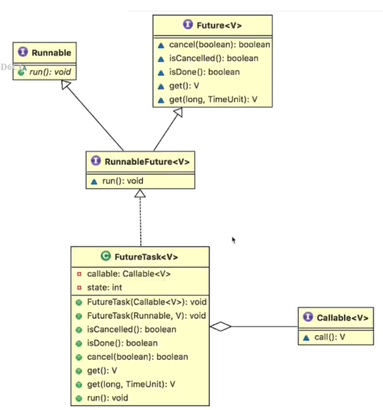

本质还是 **实现 `Runnable` 接口**。

其中还有一种错误观点：无返回值是实现 `Runnable` 接口，有返回值是实现 `Callable`，所以 `Callable` 是一种新建线程的方式。
> `Callable` 本质还是 **实现 `Runnable` 接口**。

#### 错误观点3. 定时器，匿名内部类，`Lambda` 表达式是一种新建线程的方式

定时器本质上是实现 `Runnable` 接口。

匿名内部类和 `Lambda` 表达式只是语法形式上的改变，实际上也还是实现 `Runnable` 接口。

## 2. 启动线程的正确方式

### 2.1 错误方式：直接调用 run() 方法

直接调用 `Thread.run()` 方法，或者直接调用 `Runnable.run()` 方法都不会启动新线程。只是在调用 `run` 方法的当前线程中执行 `run` 方法。

### 2.2 正确方式：调用 `Thread.start()` 方法

调用 `Thread.start()` 方法启动新线程，并不是说调用 `start` 方法之后，新线程就立即启动了。

`start` 方法只是申请让 `JVM` 去启动一个新线程，而这个新线程什么时候被启动是不确定的。
> 有可能后调用 `start` 方法申请启动的另一个新线程先启动也不一定。

**注意：** `start` 方法的执行仍然还是在调用 `start` 方法的当前线程中，并不是在 `start` 方法所申请的新线程中。

从调用 `start` 方法向 `JVM` 申请启动一个新线程，到这个新线程真正运行起来之间，还需要为新线程做一些准备工作，使得新线程拥有除使用 `CPU` 之外的其他资源。
> 准备工作完成后，新线程就处于就绪状态，等待线程调度器分配 `CPU` 资源来启动运行。

### 2.3 `start` 方法源码分析（`start` 方法的主要作用）

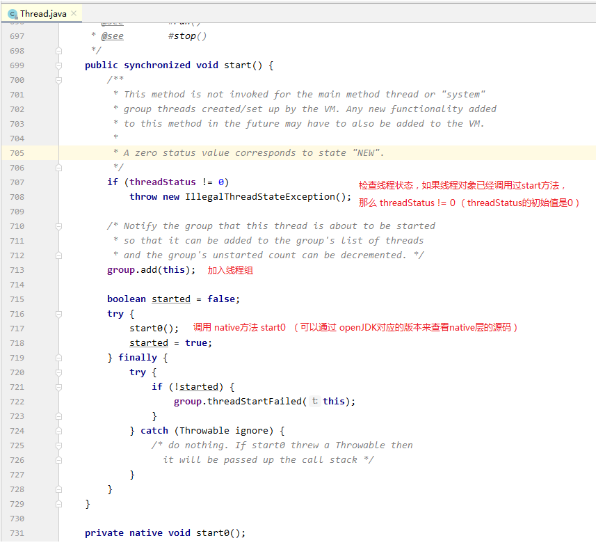

`start` 方法的主要作用是：
1. 检查线程状态
    > 通过 `threadStatus` 状态变量可知，`start` 方法只能调用一次，否则会抛出异常。
2. 加入线程组
3. 调用本地方法 `start0()` 向 `JVM` 申请启动一个新线程。

## 3. 停止线程的正确方式：`interrupt`

### 3.1 线程停止的两种情况

1. `run` 方法中的代码全部指向完毕；
2. `run` 方法中代码执行时出现异常。

### 3.2 正确地停止线程
停止线程的正确方式为：使用 `interrupt` 来通知，而不是强制。
> 调用线程对象的 `interrupt()` 方法，只是向这个线程发出一个中断信号：
> 
>   1. 当线程正常运行时，线程对象的 `isInterrupted()` 方法返回 `true`；
>   2. 当线程阻塞时，会通过阻塞方法（如 `sleep`，`wait`）抛出 `InterruptedException` 异常。
> 
> 也就是说，调用 `interrupt()` 方法，并不会强制地将线程停止，而是使线程收到中断信号（`isInterrupted()` 方法返回 `true`，或发生 `InterruptedException` 异常都可以理解为收到中断信号）。
>
> 于是，在 `run` 方法中编写线程代码时，可以根据中断信号来判断要不要结束 `run` 方法，停止线程。

### 3.3 使用 `interrupt` 停止线程的三种场景

#### 3.3.1 停止正常运行的线程

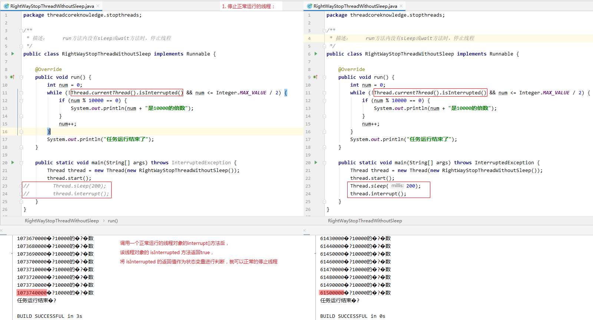

#### 3.3.2 停止正处于阻塞状态下的线程


#### 3.3.3 停止每次循环时都会短暂阻塞的线程

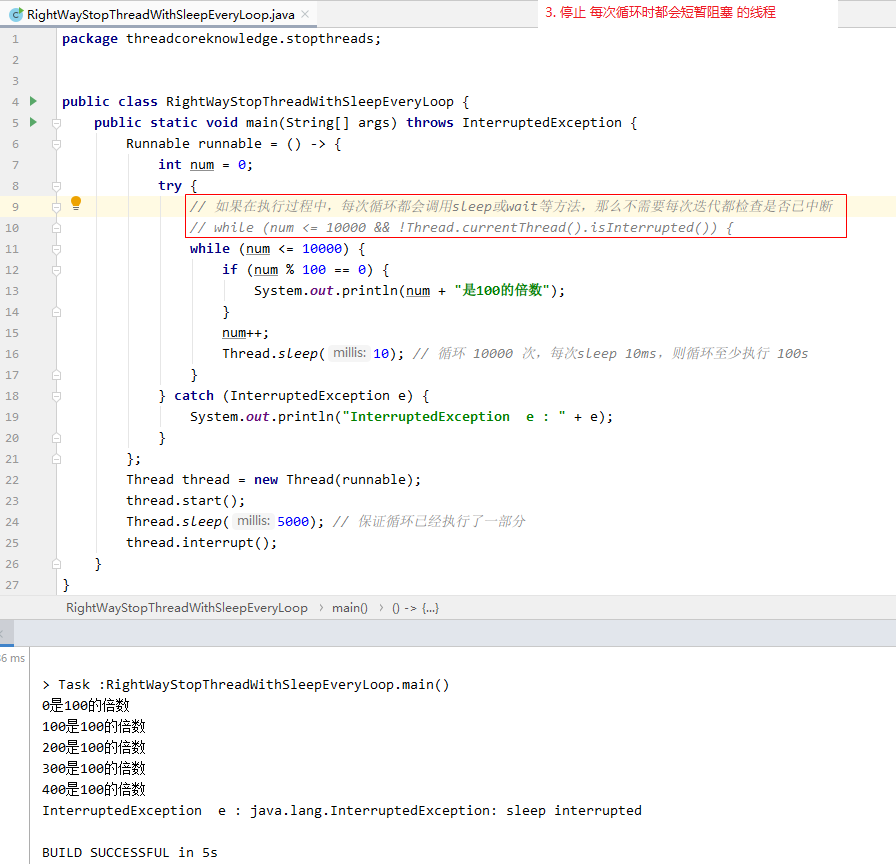

### 3.4 无法停止线程的情况（及解决方式）


### 3.5 停止线程的最佳实践

#### 3.5.1 优先选择：传递中断

传递中断就是说 `run` 方法中的被调函数中发生阻塞的时候，中断了线程，此时，在被调用函数中的阻塞方法（如 `sleep`，`wait`）抛出了 `InterruptedException` 异常时，不能直接在被调函数中对 `InterruptedException` 异常进行 `try/catch`，而是应该将该异常向上抛给 `run` 方法处理。
> 即：不要在`run` 方法中的被调函数内处理中断，而是将中断传递给 `run` 方法处理。

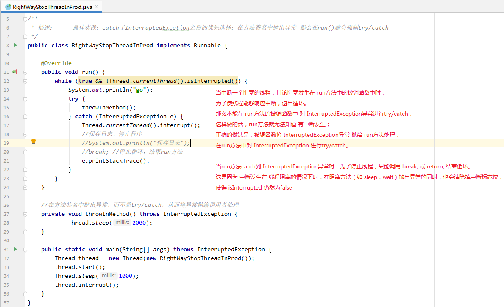

#### 3.5.2 不想或无法传递时：恢复中断

恢复中断就是说`run` 方法中的被调函数中发生阻塞的时候，中断了线程，此时，在被调用函数中的阻塞方法（如 `sleep`，`wait`）抛出了 `InterruptedException` 异常时，如果被调函数不想将异常向上抛给 `run` 方法，或者是其他无法将异常抛出给 `run` 方法的情况，那么被调函数中可以对异常进行 `try/catch`，然后再调用当前线程的 `interrupt()` 方法，再发出一次中断，使得中断标记位为 `1`，于是，在 `run` 方法中就可以判断 `isInterrupted()` 是否返回 `true` 来结束循环，从而停止线程。
> 即：如果 `run` 方法中的被调函数内无法将中断传递给 `run` 方法，那么就在被调函数中重新发起一个中断。

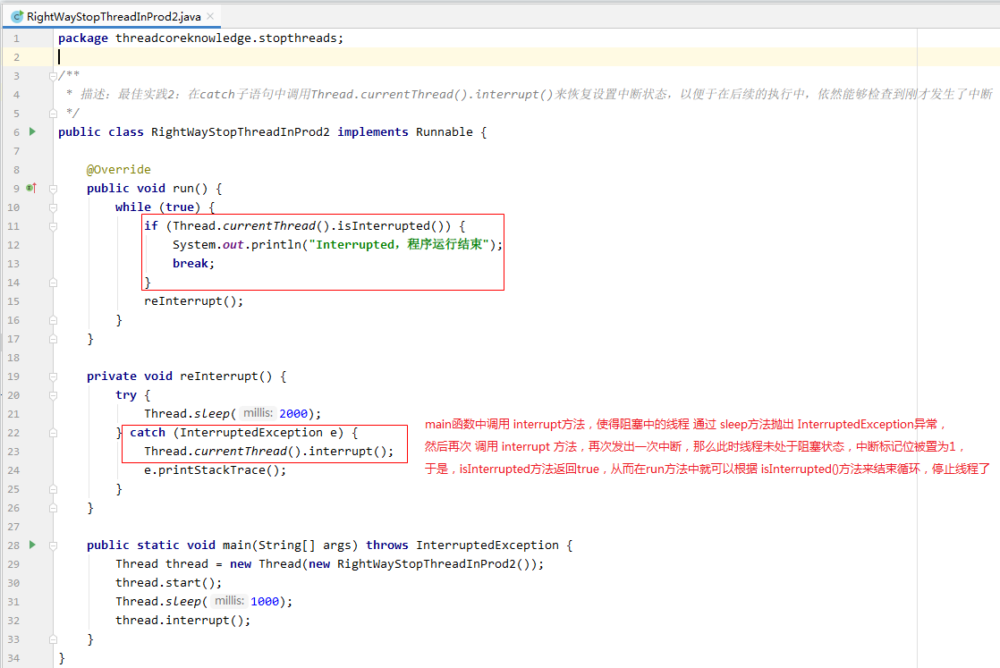

#### 3.5.3 不应屏蔽中断

也就是说，当有中断发生时，`run` 方法中必须要能通过 `isInterrupted()` 方法或者接收到 `InterruptedException` 异常来响应这个中断，做出相关动作（如结束循环，停止线程）。

### 3.6 响应中断的方法总结

以下这些方法都会在线程调用 `interrupt()` 方法发出中断时，抛出 `InterruptedException` 异常。


### 3.7 停止线程的错误方式

#### 3.7.1 `stop` 方法停止线程（弃用）

调用线程的 `stop()` 方法会强制地停止线程。
> 也就是说，不管线程是否处于阻塞状态；不管线程执行到哪条指令，都会强制地结束线程指令的执行，停止线程。

这样做是不安全的，因为我们无法通过代码来感知线程的停止动作。也就是说，**无法保证线程中被处理数据的完整性**。
> 即可能数据处理到一半，线程就因为 `stop()` 方法的调用被强制停止了，从而产生脏数据。而由于这种脏数据所引用的问题是很难排查的，并且 **调用 `stop` 方法强制停止线程时，会释放掉线程持有的锁**，于是，当被强制停止的线程正在同步代码中处理共享数据时，就会使得还没处理完的共享数据对其他线程可见了，从而使得这份 “脏乱” 的共享数据对多个线程产生影响。

#### 3.7.2 `suspend` + `resume` 方法停止线程（弃用）

`suspend()` 方法和 `resume()` 方法是搭配使用的：
1. 调用 `suspend()` 方法使得线程被挂起（但线程并没有终止）；
2. 调用 `resume()` 方法，可以唤醒被 `suspend()` 方法挂起的线程。

**注意：**
**被挂起的线程是不会释放掉它所持有的锁的**，这就很可能会导致死锁的产生。
> 当在线程 `A` 中调用线程 `B` 的 `suspend()` 方法将线程 `B` 挂起时，线程 `B` 持有锁 `lock`，于是线程 `B` 在挂起时也会一直持有锁 `lock`。
>
> 之后，当在线程 `A` 或其他线程中调用线程 `B` 的 `resume()` 方法唤醒线程 `B` 之前，线程 `A` 或其他线程需要先请求锁 `lock` 时，由于锁 `lock` 一直被线程 `B` 持有，而线程 `B` 被挂起了无法将锁释放掉，从而导致了死锁的产生。

#### 3.7.3 用 `volatile` 设置 `boolean` 标记位

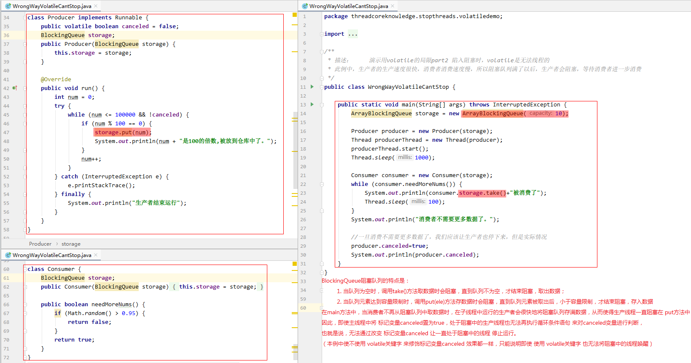

##### `BlockingQueue` 阻塞队列的特点
  
1. 当队列为空时，调用 `take()` 方法取数据时会阻塞，直到队列不为空才结束阻塞，取出数据；
2. 当队列元素达到容量限制时，调用 `put(element)` 方法存数据时会阻塞，直到队列元素被取出后，小于容量限制，才结束阻塞，存入数据。

### 3.8 分析 `native` 方法

分析 `native` 方法的步骤：
1. 进 `github` （也可以进 `openJDK` 网站）
2. 点 “搜索文件”，搜索对应的 `c` 代码类 `Thread.c`
3. 找到 `native` 方法对应的方法名
4. 去 `src/hotspot/share/prims/jvm.cpp` 里看 `cpp` 代码

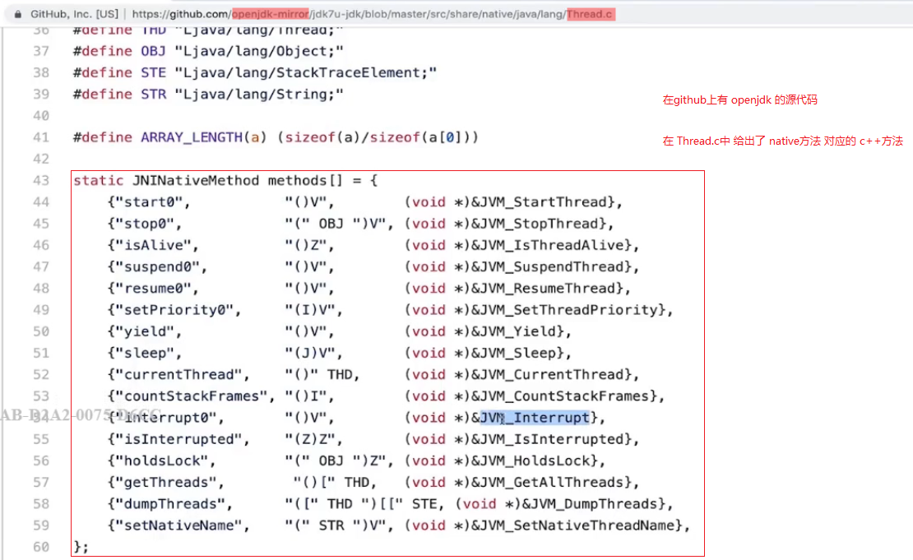

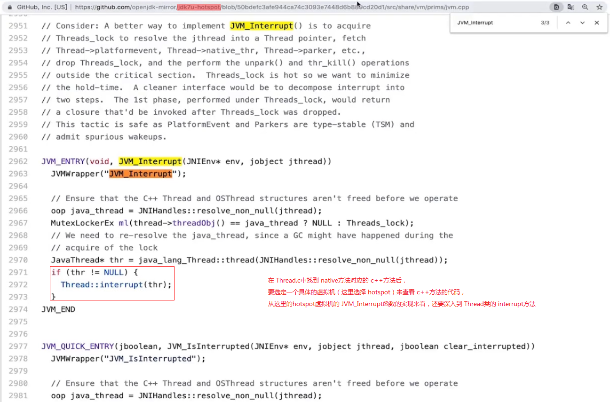

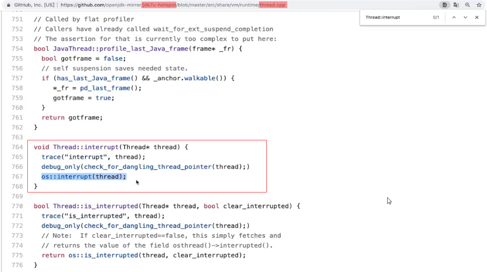

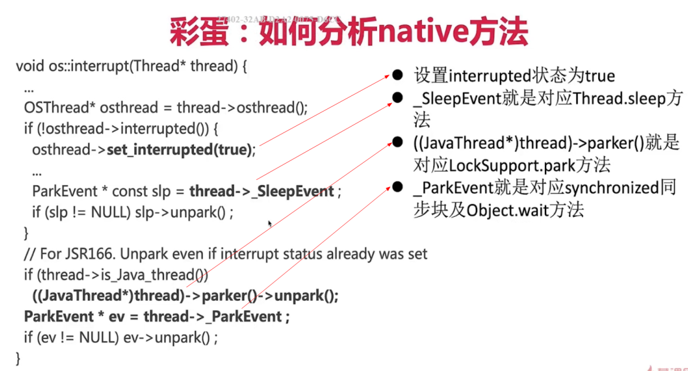

### 3.9 判断是否已中断的方法对比（`isInterrupted` 和 `interrupted()`）

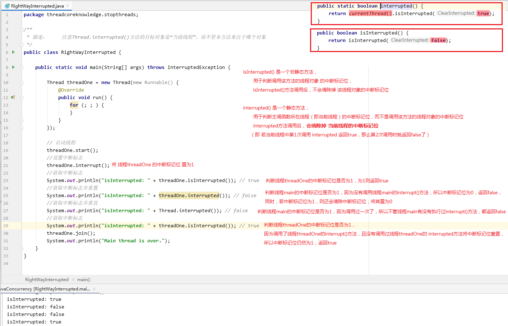

#### 3.9.1 `Thread.isInterrupted()`

`isInterrupted()` 是一个非静态方法，用于判断调用该方法的线程对象的中断标记位。
> `isInterrupted()` 方法调用后，**不会清除掉该线程对象的中断标记位**。

#### 3.9.2 `Thread.interrupted()`

`interrupted()` 是一个静态方法，用于判断主调函数所在线程（即当前线程）的中断标记位，而不是调用该方法的线程对象的中断标记位。
> `interrupted()` 方法调用后，**会清除掉当前线程的中断标记位**。即：若当前线程中第 `1` 次调用 `interrupted()` 方法返回 `true`，那么第 `2` 次调用时就返回 `false` 了。

### 3.10 如何处理不可中断的阻塞

出现不可中断的阻塞的场景：
1. 在 `Socket` 中进行 `IO` 操作时是无法响应 `interrupt()` 方法发出的中断信号的（如 `ServerSocket` 的 `accept` 方法并没有抛出 `InterruptedException` 异常）。
2. 在调用 `ReentrantLock` 的 `lock()` 方法时，如果锁被其他线程持有，那么 `lock()` 方法会阻塞（`lock()` 方法没有抛出 `InterruptedException` 异常，所以线程在调用 `lock` 方法出现阻塞时，是无法响应中断信号的）。

> 除了以上 `2` 点，还可能出现其他无法响应中断信号的阻塞。

当出现无法响应中断信号的阻塞时，应该具体情况具体分析，如：
1. 在进行 `IO` 操作时，考虑使用那些可以响应中断的方法（即会抛出 `InterruptedException` 异常的方法）。
2. 在使用 `ReentrantLock` 时，用 `lockInterruptibly()` 方法代替 `lock()` 方法（`lockInterruptibly()` 方法会抛出 `InterruptedException` 异常）。

## 4. 线程的 `6` 个状态

在 `Thread.State` 枚举类中定义了 `6` 种线程状态：
1. `New`
2. `Runnable`
3. `Blocked`
4. `Waiting`
5. `Timed Waiting`
6. `Terminated`

### 4.1 `New`

`new` 了一个 `Thread`，但还没有调用 `start()` 方法。

### 4.2 `Runnable`

在调用线程的 `start()` 方法后，线程就处于 `Runnable` 状态了。

注意，`Runnable` 状态包括几种场景：
1. 在调用 `start()` 方法后，线程还在做一些准备工作，此时，调度器还没有将 `CPU` 资源分配给线程，让线程运行起来；
2. 调度器将 `CPU` 资源分配给线程了，线程正在运行中；
3. 调度器将 `CPU` 资源分配给其他线程了，线程不在运行中，而是在等待 `CPU` 资源的分配。

> 也就是说，`Runnable` 状态包括 `ready`、`running`、以及等待 `CPU` 资源分配，这三种情况。

### 4.3 `Blocked`

当线程执行到 `synchronized` 同步代码块，或 `synchronized` 修饰的同步方法时，未能获取锁，那么线程就会进入 `Blocked` 状态，只有当其它线程释放掉锁，且该线程获取到锁后，才会由 `Blocked` 状态转为 `Runnable` 状态，继续执行同步代码。

处于 `Blocked` 状态的线程，表示正等待其它线程释放掉锁，且该线程将锁获取到。

### 4.4 `Waiting`

处于 `Waiting` 状态的线程，表示正等待其它线程将该线程唤醒。

### 4.5 `Timed Waiting`

处于 `Timed Waiting` 状态的线程，表示正等待其它线程将该线程唤醒，或者等待时间到。

### 4.6 `Terminated`

可以理解为当前线程的 `run` 方法执行完毕后，线程就处于 `Terminated` 状态了。

### 4.7 状态间的转化示意图

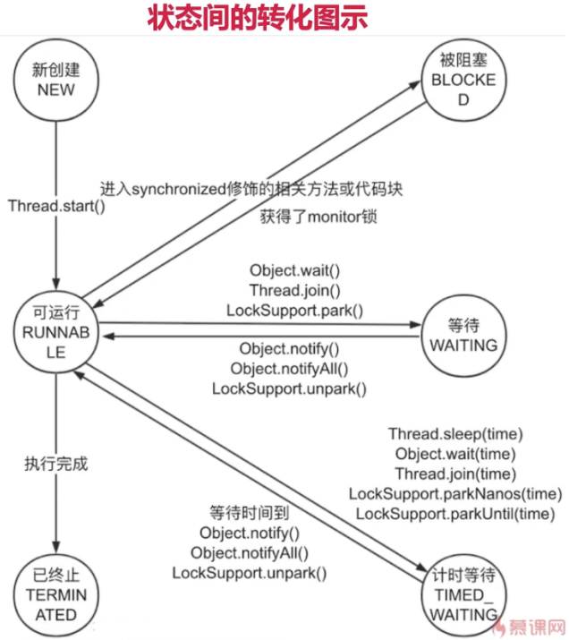

> 从线程的状态转化图中可以看出，有些状态之间是可以相互转化的，有些状态之间是不可以相互转化的（即不可逆的）。
>
> 如：一个 `Terminated` 终止状态下的线程是无法再运行起来的。

### 4.8 获取线程状态（`Thread.getState()`）

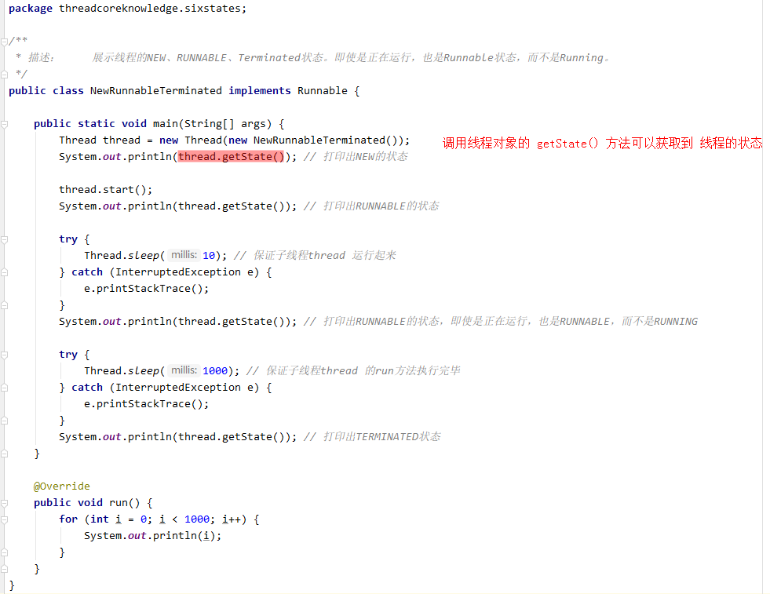

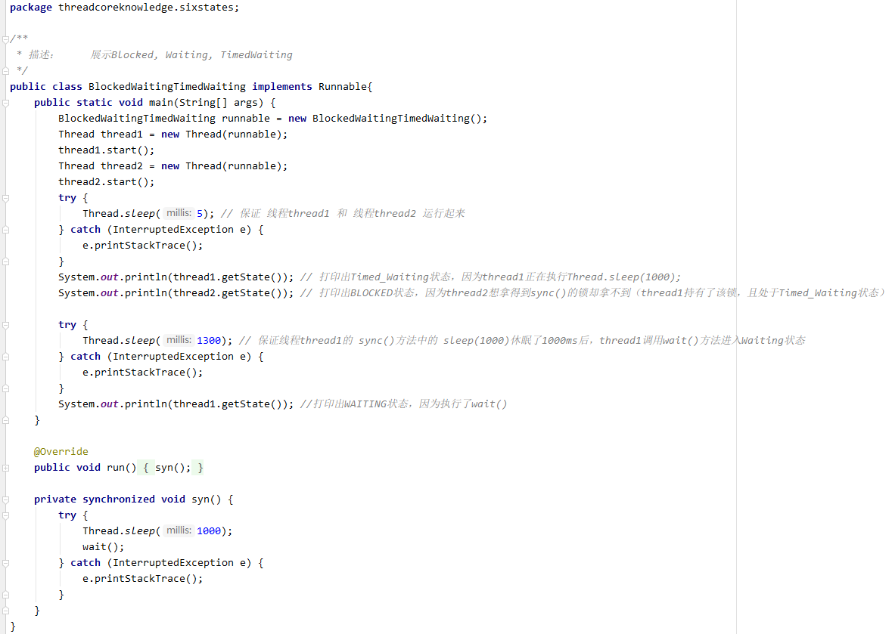

### 4.9 什么是阻塞状态？

一般习惯而言，把 `Blocked`（被阻塞）、`Waiting`（等待）、`Timed Waiting`（计时等待）都称为阻塞状态。
> 注意：不仅仅是 `Blocked`。

## 5. `Thread` 和 `Object` 类中与线程相关的重要方法

### 5.1 方法概览

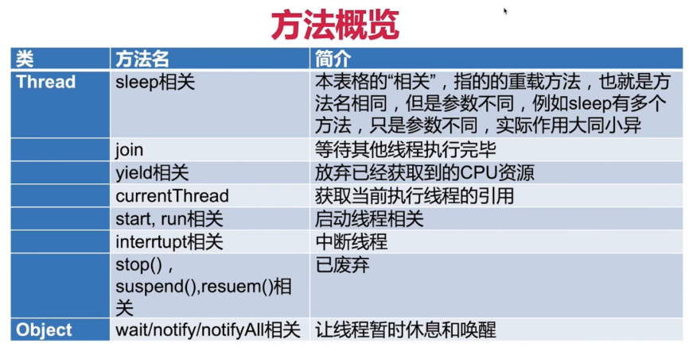

### 5.2 `wait`、`notify`、`notifyAll` 方法详解

#### 5.2.1 作用&用法（阻塞阶段、唤醒阶段、遇到中断）

**一、`wait` 方法**

调用 `Object` 对象的 `wait` 方法，会使线程进入阻塞阶段。

> 注意：在调用 `Object` 对象的 `wait` 方法时，线程必须持有该 `Object` 对象的锁，即：
> 1. `obj.wait` 方法只能在 `synchronized(obj) {...}` 同步代码块中调用；
> 2. `this.wait` 方法可以在 `synchronized` 修饰的非静态成员方法中调用，也可以在 `synchronized(this) {...}` 同步代码块中调用；
> 3. `T.class.wait` 方法可以在 `T` 类中 `synchronized` 修饰的静态成员方法中调用，也可以在 `synchronized(T.class) {...}` 同步代码块中调用。

**二、`notify` 和 `notifyAll` 方法**

调用 `Object` 对象的 `notify` 或 `notifyAll` 方法，会使线程进入唤醒阶段。

> 注意：同调用 `wait` 方法时一样，在调用 `Object` 对象的 `notify` 或 `notifyAll` 方法时，线程必须持有该 `Object` 对象的锁。

**三、多个线程使用同一个对象作为同步锁的场景分析**

考虑以下场景：

```:no-line-numbers
当线程 A 持有锁 obj 时，调用了 obj.wait 方法，于是释放锁 obj，进入等待状态（等着能够再次持有锁 obj，继续运行）；
当线程 B 持有锁 obj 时，又调用了 obj.wait 方法，于是线程 B 也释放锁 obj，进入等待状态（等着能够再次持有锁 obj，继续运行）；
......
当线程 Z 持有锁 obj 时，前面已经有很多线程通过调用 obj.wait 方法进入了等待状态。

此时，在线程 Z 持有锁 obj 的条件下：
    1. 若调用 obj.notify 方法，则会唤醒因调用过 obj.wait 方法而进入等待状态中的某一个线程 X （具体唤醒哪个线程是不确定的），
    需要注意的是，这个被唤醒的线程 X 此时还并没有持有锁 obj，
    也就是说，调用 obj.wait 方法仅仅只是唤醒线程，锁 obj 仍然被线程 Z 持有着。
    只有当线程 Z 在调用了 obj.notify 方法后，又调用 obj.wait 方法，或者将同步代码块执行完毕后才会释放掉锁 obj。
    而在线程 Z 释放掉锁 obj 后，被唤醒的线程 X 也并不一定能获取到锁 obj，
    这取决于操作系统的线程调度器是将锁 obj 分发给线程 X，还是分发给同样需要锁 obj 的处于 Runnable 状态的其他线程。
    2. 若调用 obj.notifyAll 方法，则会唤醒因调用过 obj.wait 方法而进入等待状态中的所有线程。
    同调用 obj.notifyAll 方法一样，这些被唤醒的所有线程都还没有持有锁 obj。
```

**四、遇到中断**

当线程 `thread` 调用了 `Object` 对象的 `wait` 方法，进入等待状态中时，如果在其他线程 `other_thread` 中调用了 `thread.interrupt()` 方法，向线程 `thread` 发出了中断信号，那么处于等待状态中的线程 `thread` 就会被唤醒，并通过 `wait` 方法抛出 `InterruptedException` 异常（同时清除中断标志位）。

> **思考：** 当线程 `thread` 因遇到中断被唤醒后，在抛出 `InterruptedException` 异常时，是否持有了 `Object` 对象的锁？
>
> 如果持有了，那么在中断发生时，持有该锁的其他线程是否就被迫地将锁释放掉了？如果释放掉了，那么在这个其他线程中未处理完的共享数据不就影响到别的线程了吗？

#### 5.2.2 `wait` 中的线程被唤醒的 `4` 种情况

直到以下 `4` 种情况之一发生时，`wait` 中的线程才会被唤醒：
1. 另一个线程调用了这个对象的 `notify()` 方法，且刚好被唤醒的是本线程；
2. 另一个 线程调用这个对象的 `notifyAll()` 方法；
3. 过了 `wait(timeout)` 规定的超时时间（如果传入 `0` 就是永久等待）；
4. 线程自身调用了 `interrupt()` 方法。

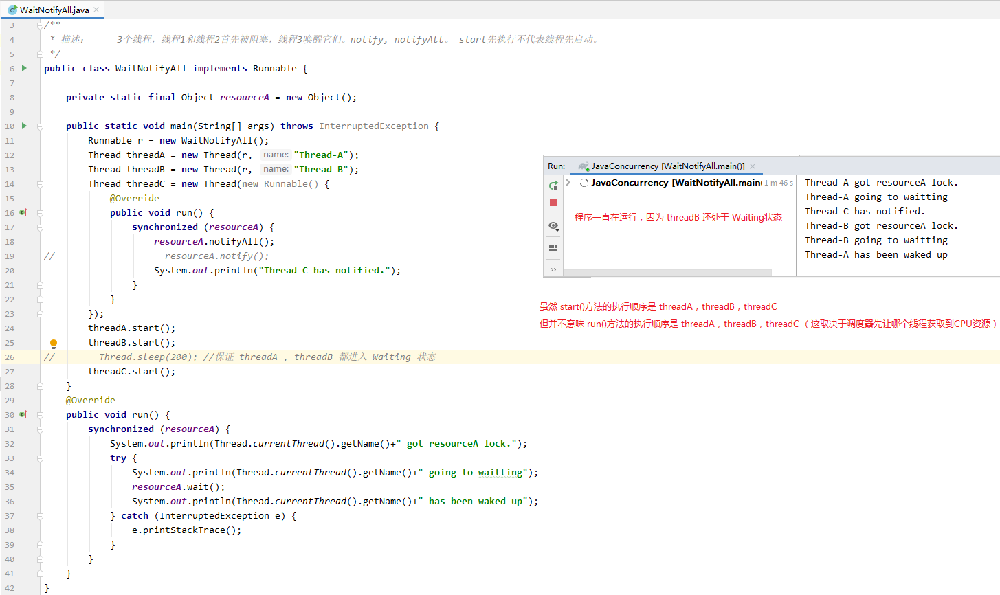

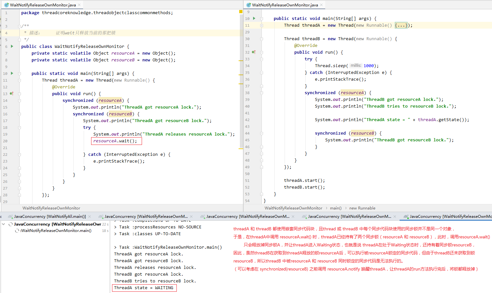

#### 5.2.3 特点&性质

1. 调用先必须先拥有 `monitor`
    > 调用 `obj.wait`、`obj.notify`、`obj.notifyAll` 方法时，线程必须持有锁 `obj`。

2. 只能唤醒其中一个
    > `obj.notify` 只能唤醒多个因调用 `obj.wait` 方法而处于 `Waiting` 状态的线程中的某一个（具体哪一个不确定）。

3. 属于 `Object` 类
    > `wait`、`notify`、`notifyAll` 这三个方法都是 `Object` 类提供的实例方法。

4. 类似功能的 `Condition`
    > 与 `ReentrantLock` 搭配使用 `Condition` 类，提供了 `await/signal/signalAll` 实现与 `wait/notify/notifyAll` 类似的功能。

5. 同时持有多个锁的情况
    > 一个线程同时持有多个锁时，如果对释放锁的时机把握不恰当，很容易产生死锁。

#### 5.2.4 手写生产者消费者设计模式

什么是生产者和消费者模式？

```:no-line-numbers
生产者就是向共享内存中写入数据
消费者就是从共享内存中读取数据

使用生产者消费者模式，将生产过程和消费过程进行了解耦，
能够更好地对生产操作和消费操作进行协同控制。
```

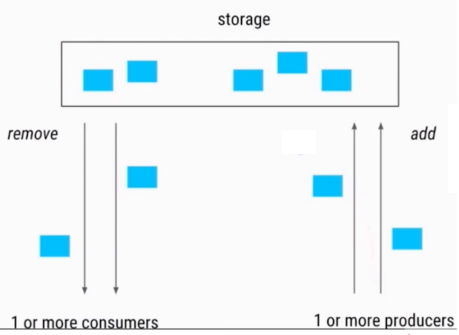
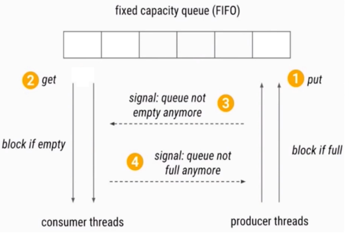


#### 5.2.5 两个线程交替打印 `0~100` 的奇偶数

输出示例：

```:no-line-numbers
偶线程：0
奇线程：1
偶线程：2
......
```

**1. 用 `synchronized` 关键字实现**


**2. 用 `wait` 和 `notify` 方法实现**

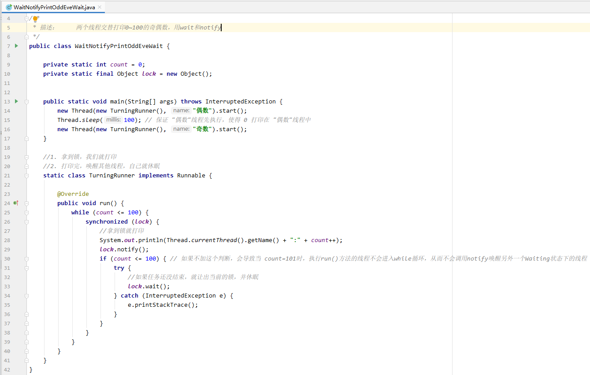

#### 5.2.6 常见面试问题

##### 5.2.6.1 为什么 `wait` 需要在同步代码块中使用，而 `sleep` 不需要？

```:no-line-numbers
wait 和 notify/notifyAll 是配合使用的，
当某个线程中调用了 wait 后，通常是需要其他线程调用 notify/notifyAll 来唤醒的,
也就是说，需要保证在 wait 调用之后，其他线程中的 notify/notifyAll 才会调用，
如果不在同步代码块内使用，那么是无法保证在两个不同的线程中执行的 wait 和 notify/notifyAll 它们之间的先后执行顺序，
也就无法保证调用 wait 的那个线程能够被唤醒。

而线程中调用 sleep 方法，是使线程进入 Timed Waiting 状态，
处于 Timed Waiting 状态的线程会在指定时间之后自动被唤醒，不需要其他线程来唤醒它。
因此不涉及多线程同步，也就不需要在同步代码块中调用了。
```

##### 5.2.6.2 为什么 `wait/notify/notifyAll` 定义在 `Object` 中，而 `sleep` 定义在 `Thread` 中？

```:no-line-numbers
wait/notify/notifyAll 这三个方法必须在持有锁的线程中，由充当该锁的对象来调用，
考虑当线程同时持有多个锁的情况，那么就可能需要通过多个充当锁的不同类型的对象来调用 wait/notify/notifyAll，
也就是说，为了保证能够使用各种类型的对象来充当锁，那么就必须保证各种类型的对象都能调用 wait/notify/notifyAll，
而 Object 类作为顶级父类就能保证这一点，因此就将 wait/notify/notifyAll 定义在 Object 类中。

而不管是哪个对象调用 sleep 方法，都只是让线程进入 Timed Waiting 状态，时间一到线程自动唤醒。
即任意对象调用 sleep 方法的效果都是一样的，因此，也就没必要让每个对象都能调用到 sleep 方法了。
所以将与线程相关的 sleep 方法定义在线程类 Thread 中是很合理的。
```

##### 5.2.6.3 调用 `Thread.wait` 会怎么样？

```:no-line-numbers
thread 对象确实可以作为锁来使用，因此可以调用 thread.wait 方法。
但是，在 JVM 的源码实现中，在执行完线程代码后（即执行完 Thread.run 方法后），会调用线程的 notify。
也就是说，如果使用 thread 对象作为锁，那么在该 thread 对象表示的线程执行完后，
会自动地唤醒那些因调用该 thread 对象的 wait 方法而进入等待状态的线程。
因此，不建议使用 thread 对象作为锁使用。
```

##### 5.2.6.4 如何选择用 `notify` 还是 `notifyAll`？

```:no-line-numbers
当因调用锁 obj 的 wait 方法而进入等待状态的线程只有一个，
或者只需要唤醒多个因调用锁 obj 的 wait 方法而进入等待状态的线程中的某一个时，
选择调用 obj.notify 方法来唤醒。

当因调用锁 obj 的 wait 方法而进入等待状态的线程不止一个时，
若需要将这些线程全部唤醒，则选择调用 obj.notifyAll 方法。
```

##### 5.2.6.5 `notifyAll` 之后所有线程都会再次抢夺锁，如果某线程抢夺失败怎么办？

```:no-line-numbers
调用锁 obj 的 notifyAll 方法后，所有因调用该锁 obj 的 wait 方法而进入等待状态的线程都会被唤醒，进入 Runnable 状态，
这些处于 Runnable 状态的线程，在执行 obj.notifyAll 方法的那个线程将锁 obj 释放掉之后，会相互竞争锁 obj，
结果只会有一个线程获取到锁 obj。
而那些没有获取到锁的线程，同样还是处于 Runnable 状态，等待着获取锁的那个线程将锁 obj 释放掉后，再次竞争。
```

##### 5.2.6.6 用 `suspend()` 和 `resume()` 来阻塞线程可以吗？为什么？


```:no-line-numbers
suspend 和 resume 是搭配使用的，通过 suspend 将线程挂起，通过 resume 将因调用 suspend 而被挂起的线程唤醒。
因此，suspend 和 resume 可以用来阻塞线程。
但是，因调用 suspend 而挂起的线程虽然处于阻塞状态了，但是被挂起的线程并不会将其持有的锁给释放掉。
从而，当在其他线程中调用被挂起线程的 resume 方法来唤醒被挂起线程之前，
如果其他线程需要先获取到被挂起线程所持有的锁，那么就会导致死锁的产生。
由于这个原因，使用 suspend/resume 来阻塞线程是不安全的，已经被弃用了。
```

### 5.3 `sleep` 方法详解

调用线程对象的 `sleep` 方法，就是让线程在经过预期的一段时间之后再执行，而在预期的这段时间内，让线程处于 `Timed Waiting` 状态。

> 需要注意的是，调用 `sleep` 方法虽然会释放掉线程占用的 `CPU` 资源，但是**不会释放掉线程持有的锁**（包括 `synchronized` 同步锁和实现了 `Lock` 接口的其他锁，如 `ReentrantLock` 可重入锁）。
>
> 也就是说，在线程持有锁的情况下，调用该线程的 `sleep` 方法，那么线程是带着锁进入 `Timed Waiting` 状态的（这样很不安全，容易产生死锁）。

#### 5.3.1 `sleep(time)` 和 `wait(time)` 的区别

与 `sleep(time)` 不同的是，调用锁对象 `obj` 的 `wait(time)` 方法，会先让线程释放掉锁对象 `obj`，再进入 `Timed Waiting` 状态。

#### 5.3.2 `sleep` 方法响应中断

线程在调用 `sleep` 方法进入 `Timed Waiting` 状态时，如果被中断了，那么 `sleep` 方法会抛出 `InterruptedException` 异常，同时清除中断标志位。

#### 5.3.3 更优雅的 `sleep` 方式（`TimeUnit.XXX.sleep(time)`）

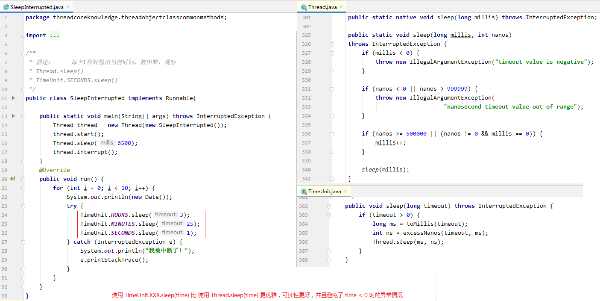

#### 5.3.4 `sleep` 与 `wait/notify` 的异同

相同点：
1. 阻塞
2. 响应中断

不同点：
1. `wait/notify` 要在同步代码中调用，`sleep` 没有此限制；
2. `wait` 和 `sleep` 都会释放线程占用的 `CPU` 资源。但是，`wait` 还会释放锁，而 `sleep` 则不会释放锁；
3. 调用 `sleep` 必须指定休眠时间，而调用 `wait` 可以不指定时间（也可以指定时间）；
4. `wait/notify` 属于 `Object` 类，`sleep` 属于 `Thread` 类。

### 5.4 `join` 方法

#### 5.4.1 从源码中分析 `join` 方法的作用

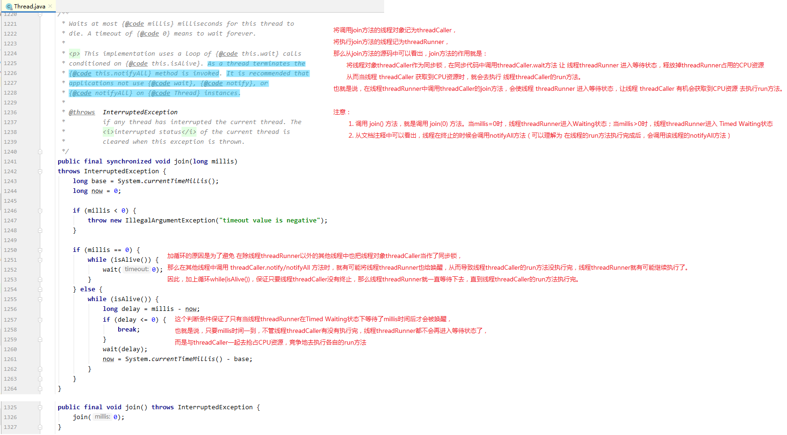

#### 5.4.2 `join` 方法的普通用法

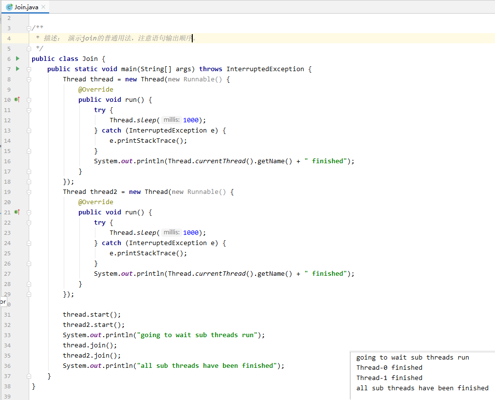

#### 5.4.3 `join` 方法遇到中断


#### 5.4.4 使用 `CountDownLatch` 或 `CyclicBarrier` 类实现 `join` 的功能

`CountDownLatch` 或 `CyclicBarrier` 这两个类都可以实现与 `join` 类似的功能。
> 在实际开发中，我们应该考虑使用像 `CountDownLatch` 或 `CyclicBarrier` 这样的封装好了的功能实现，避免使用 `join` 这种较为底层的实现。

#### 5.4.5 在 `join` 期间，线程处于哪种线程状态？

从源码中可以看出，在 `join` 期间：
1. 执行 `join` 方法的线程 `threadRunner` 可能处于 `Waiting` 状态，也可能处于 `Timed Waiting` 状态。
2. 调用 `join` 方法的线程 `threadCaller` 处于 `Runnable` 状态。

### 5.5 `yield` 方法

#### 5.5.1 作用

当线程占用了 `CPU` 资源时，调用该线程的 `yield` 方法，会让该线程释放掉其所占用的 `CPU` 资源。

> 需要指出的是：该线程仅仅只是释放掉 `CPU` 资源，并不会释放掉持有的锁，也不会进入到阻塞状态。
>
> 也就是说，该线程在调用 `yield` 方法后，仍然处于 `Runnable` 状态，只是没有占用 `CPU` 资源了。

> 注意：由于该线程仍然处于 `Runnable` 状态，所以当调度器（`scheduler`）再次分配 `CPU` 资源时，还可能继续分配给该线程。
>
> 也就是说，不能保证在调用了线程的 `yield` 方法后，其他线程的 `run` 方法就能执行起来。

#### 5.5.2 `yield` 和 `sleep` 的区别

1. 调用线程的 `yield` 方法后，线程仍然处于 `Runnable` 状态，所以线程会随时可能再次被调度。
2. 调用线程的 `sleep` 方法后，线程处于 `Timed Waiting` 状态，所以在线程处于 `Timed Waiting` 状态的过程中，不会再被调度了。

### 5.6 获取当前执行线程的引用：`Thread.currentThread()` 方法

### 5.7 `start` 和 `run` 方法

[start/run](#_2-启动线程的正确方式)

### 5.8 `stop`、`suspend`、`resume` 方法

[stop](#_3-7-1-stop-方法停止线程-弃用)

[suspend/resume](#_3-7-2-suspend-resume-方法停止线程-弃用)

## 6. 线程的各个属性

### 6.1 线程各属性纵览


### 6.2 线程 `Id`

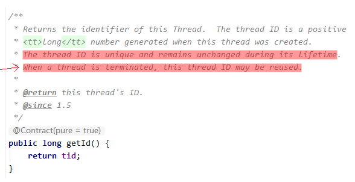

线程 `id` 是唯一的，在线程的生命周期中不会改变。

> 注意：在一个线程终止后，后面新创建的线程是可以复用已终止线程的线程 `id` 的。
>
> 也就是说，在未终止的所有线程中，线程 `id` 是唯一的。在所有创建出来的线程中（包括终止的），线程 `id` 可能不是唯一的。

线程 `id` 是从 `1` 开始递增的。

在我们自己创建线程之前，`JVM` 已经创建了多个线程，因此，我们自己所创建线程的线程 `id > 1`。

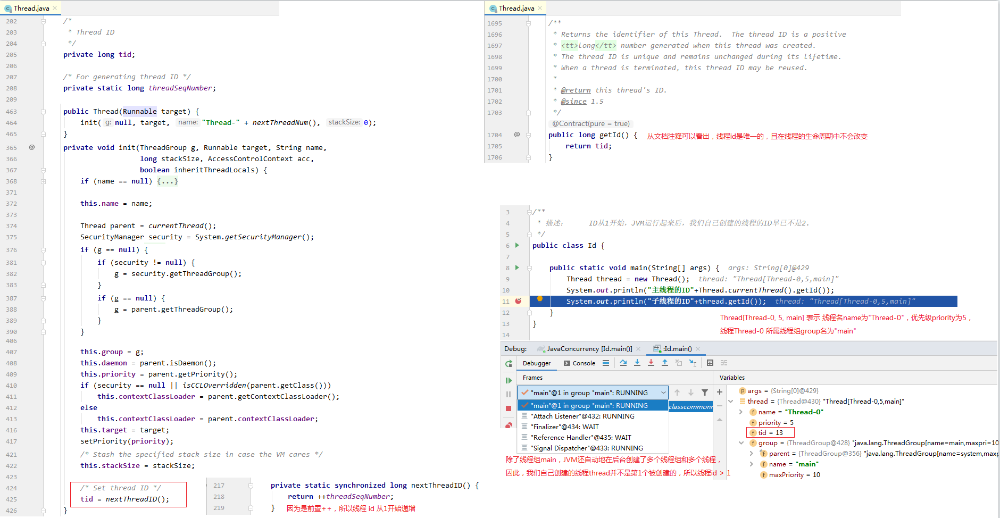

### 6.3 线程名

如果我们在创建线程时，没有通过构造函数指定线程名，那么 `Thread` 类内部会指定一个默认的线程名 `Thread-<num>`。

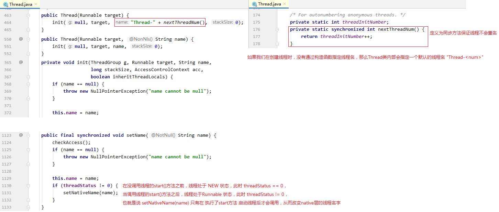

### 6.4 守护线程

#### 6.4.1 用户线程&守护线程

线程可以分为两大类：用户线程和守护线程。

守护线程的作用就是给用户线程提供服务的。

当一个进程中没有用户线程时，即使还存在守护线程，那么这个进程也会结束运行。
> 也就是说，守护线程的运行不会影响 `JVM` 虚拟机进程的关闭。当进程关闭时，其中运行的守护线程也会终止。

在不手动修改的情况下：
1. 在用户线程中创建的线程默认就是用户线程；
2. 在守护线程中创建的线程默认就是守护线程。

通常地，所有的守护线程都是由 `JVM` 自行启动的。在运行一个 `Java` 程序时，`JVM` 只会启动一个用户线程（即执行 `main` 函数的那个线程，也就是线程 `main`），而其他被启动的都是守护线程。

只要用户线程启动后未终止，那么 `JVM` 虚拟机进程就不会结束。当用户线程终止后，若进程中只存在守护线程了，那么 `JVM` 虚拟机会无视守护线程，照样结束进程。

#### 6.4.2 设置守护线程（`seteDaemon(true)`）

调用 `Thread.setDaemon(true)` 可以将线程设置为守护线程。

> 注意：**必须在调用 `start()` 方法前**，调用 `setDaemon(true) 将线程设置为守护线程`。

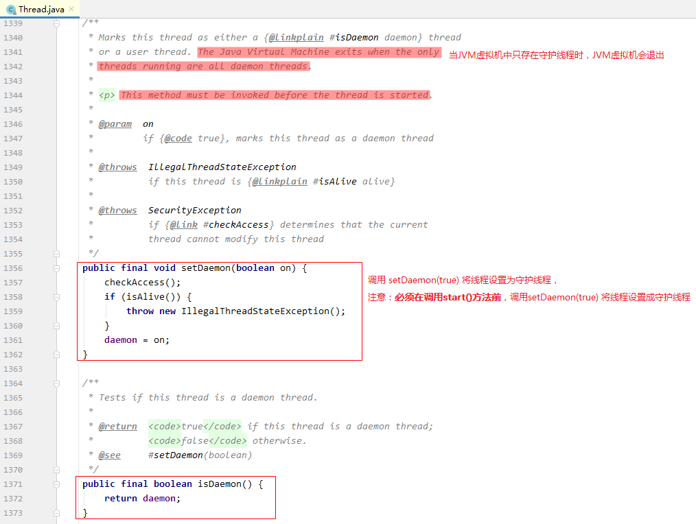

#### 6.4.3 常见面试题

##### 6.4.3.1 守护线程和普通线程（用户线程）的区别

守护线程和用户线程（即普通线程）整体上没什么区别，最主要的区别在于：
1. 当 `JVM` 虚拟机进程中只存在守护线程时，`JVM` 虚拟机进程会结束退出；
2. 当 `JVM` 虚拟机进程中还存在用户线程时，`JVM` 虚拟机进程不会结束退出。

另外它们的作用也不同：
1. 用户线程是执行我们的业务代码的；
2. 守护线程是为用户线程提供服务的。

##### 6.4.3.2 我们是否需要将线程设置为守护线程？

不建议将线程设置为守护线程。

如果设置为守护线程，那么当其他的用户线程全部终止后，`JVM` 虚拟机会退出。此时，被设置成守护线程中的业务逻辑和数据无法全部处理完毕，从而容易导致异常的发生。

### 6.5 线程优先级

#### 6.5.1 优先级的范围

`Java` 为线程定义了 `[1, 10]` 范围内的优先级，默认是 `5`。

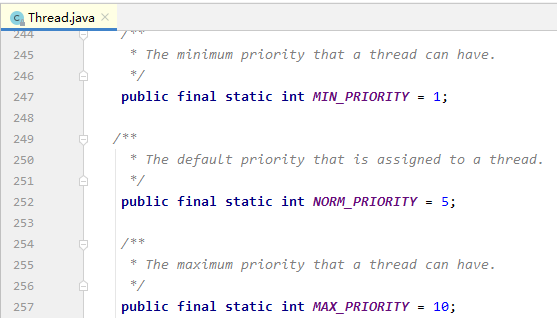

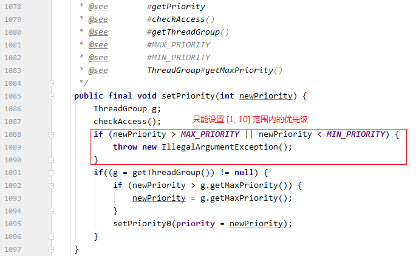

#### 6.5.2 程序设计不建议依赖于优先级

程序设计不应依赖于优先级，因为：
1. 虽然 `Java` 为线程定义了 `[1, 10]` 范围内的优先级，但是不同操作系统定义的优先级范围是不同的。于是，`JVM` 就会让 `Java` 层的线程优先级与具体操作系统的线程优先级建立映射关系，而这种映射关系对不同的操作系统是不一样的。所以，我们在 `Java` 层指定的线程优先级，在不同的操作系统中会存在较大的区别。
2. 有的操作系统会提高对 `CPU` 资源占用时间较长的线程的优先级。 

## 7. 线程的未捕获异常 `UncaughtException` 的处理

### 7.1 通过 `UncaughtExceptionHandler` 处理子线程中的异常

处理子线程中的异常的两种方案：
1. 手动在每个 `run` 方法里进行 `try-catch`（不推荐）；
2. 利用 `UncaughtExceptionHandler`（推荐）。

为什么需要 `UncaughtExceptionHandler`？
1. 主线程可以轻松发现异常，子线程却不行；
    > 主线程中抛出异常，如果未捕获，那么进程会结束退出。
    >
    > 但是，子线程中抛出异常，如果未捕获，那么进程是不会退出的。
    >
    > 此时，虽然从日志中能够找到子线程的异常信息，但是当日志较多时，也难以发现。

2. 子线程异常无法用传统方法捕获；
    > `try-catch` 只能捕获当前线程中发生在 `try-catch` 代码块内的异常。如果 `try-catch` 代码块在线程 `A` 中执行，`try-catch` 代码块内启动了一个子线程，那么子线程的 `run` 方法中抛出的异常是无法被线程 `A` 中的 `try-catch` 捕获到的。

    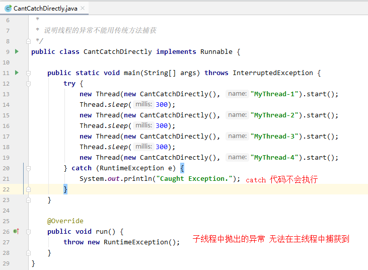

3. 对于无法直接捕获的异常，可以使用 `UncaughtExceptionHandler` 来统一处理，提高健壮性。

### 7.2 未捕获异常的分发处理策略（`UncaughtExceptionHandler` 的工作原理）

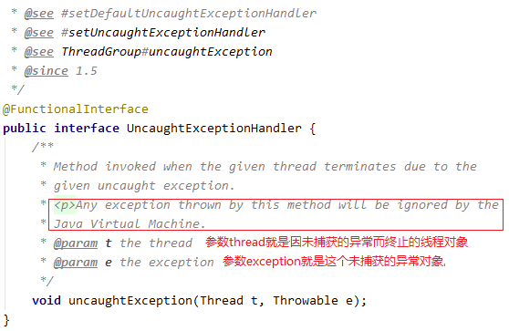

```sequence
participant T as Thread
Note over TG : ThreadGroup 实现了 UncaughtExceptionHandler 接口
participant TG as ThreadGroup
participant UEH as UncaughtExceptionHandler

T ->> T : dispatchUncaughtException(exception)
activate T
    alt uncaughtExceptionHandler == null
        T ->> TG : group.uncaughtException(thread,  exception)
        activate TG
            TG ->> T : getDefaultUncaughtExceptionHandler()
            T -->> TG : return defaultUeh
            TG ->> UEH : defaultUeh.uncaughtException(thread, exception)
        deactivate TG
    else uncaughtExceptionHandler != null
        Note over T,UEH : Thread 通过 setUncaughtExceptionHandler 指定了特定的 UncaughtExceptionHandler
        T ->> UEH : uncaughtException(thread, exception)
    end
deactivate T
```

如上图所示：
1. 当线程中出现未捕获的异常时，`JVM` 会调用 `dispatchUncaughtException` 方法获取一个 `UncaughtExceptionHandler` 实例，调用该实例的 `uncaughtException` 方法来处理未捕获的异常。
   
2. 如果出现未捕获异常的线程实例中，没有通过 `setUncaughtExceptionHandler` 方法设置一个该线程实例特有的 `UncaughtExceptionHandler`，那么就将该线程所在的线程组 `group` 作为 `UncaughtExceptionHandler`。
    > `ThreadGroup` 实现了 `UncaughtExceptionHandler`，重写了 `uncaughtException` 方法。

3. 在 `ThreadGroup` 重写的 `uncaughtException` 方法中，又尝试去调用一个默认的 `UncaughtExceptionHandler` 来处理异常，如果没有设置默认的 `UncaughtExceptionHandler`，那么就仅仅把异常信息打印出来。

> 注意：
>
> `Thread.setUncaughtExceptionHandler(ueh)` 是一个非静态成员方法，用来设置一个线程实例特有的 `UncaughtExceptionHandler`。
>
> `Thread.setDefaultUncaughtExceptionHandler(defUeh)` 是一个静态成员方法，用来设置一个所有线程实例共有的默认 `UncaughtExceptionHandler`。

### 7.3 `UncaughtExceptionHandler` 的使用示例

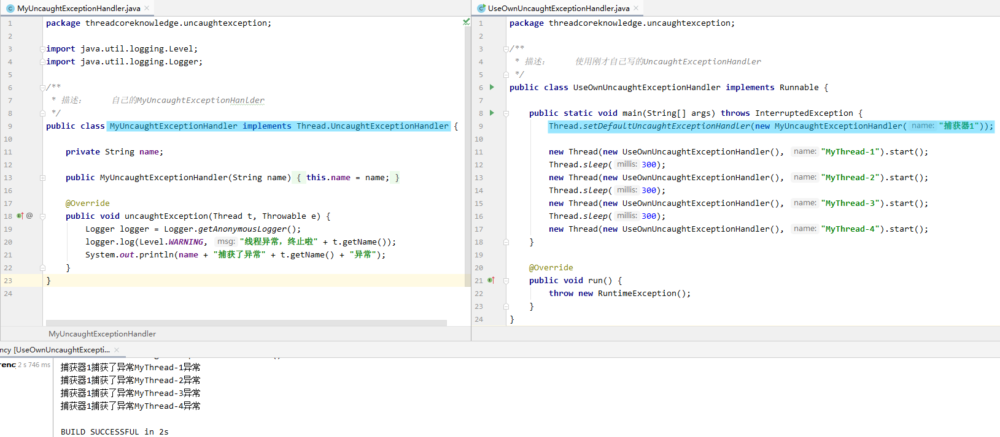

### 7.4 常见面试问题

#### 7.4.1 如何全局处理异常？为什么要全局处理？不处理行不行？

调用静态方法 `Thread.setDefaultUncaughtExceptionHandler(defUeh)` 可以为所有线程实例设置一个默认的 `UncaughtExceptionHandler`。通过重写这个默认的 `UncaughtExceptionHandler` 的 `uncaughtException` 方法来实现对所有线程中未捕获异常的处理，从而可以统一地将未捕获到的异常保存进日志文件中，方便排查问题。如果不处理这些未捕获的异常，那么当出现问题时，是很难排查的。

#### 7.4.2 `run` 方法是否可以抛出异常？如果抛出异常，线程的状态会怎样？

由于 `run` 方法在定义时并没有在方法签名上声明会抛出异常，所以在重写 `run` 方法时，不能在 `run` 方法中抛出异常，只能通过 `try-catch` 捕获异常。

如果抛出异常，那么这个异常就不会被捕获到，从而使得线程因为这个未捕获的异常而进入终止状态。

#### 7.4.3 线程中如何处理某个未处理异常？

通过设置一个默认的 `UncaughtExceptionHandler` 来处理未捕获的异常。

## 8. 多线程导致的性能问题（线程引入的开销、上下文切换）

### 8.1 线程安全

#### 8.1.2 什么是线程安全？

《`Java Concurrency In Practice`》 的作者 `Brian Goetz` 对线程安全有一个比较恰当的定义：

```:no-line-numbers
当多个线程访问一个对象时，
如果不用考虑这些线程在运行时环境下的调度和交替执行，也不需要进行额外的同步，
或者在调用方进行任何其他的协调操作，调用这个对象的行为都可以获得正确的结果，
那么这个对象是线程安全的。
```

> 线程安全考虑的是对一个**对象**的访问是不是线程安全的。

线程不安全的情况：
1. `get` 同时 `set`；
    > 如果多线程中存在可能同时对容器进行 `get` 和 `set` 的操作，那么存在线程不安全的情况。
2. 额外同步
    > 如果多线程中使用了 `synchronized` 同步锁，那么说明也存在线程不安全的情况（否则没必要加锁）。

不要为了线程安全而过度设计。
> 线程安全就是保证同一时间只有一个线程访问共享数据。如果对不会存在多线程同时访问数据的操作也加锁，那么本来可以多线程运行的程序就变成只能单线程运行，降低了运行速度。
>
> 并且，线程安全的设计也比较麻烦，如 `CocurrentHashMap` 为了保证线程安全做了很多精细的设计，这种设计不是一下子就能想出来的，需要花费大量的时间成本和人力去实现。
>
> 所以，应该权衡清楚哪些操作需要考虑线程安全的问题。对于不存在线程安全问题的操作不要过度设计。

#### 8.1.2 什么情况下会出现线程安全问题，怎么避免？

出现线程安全问题主要分两种情况：
1. 多线程对共享数据同时进行写操作；
    > 此时，就可能出现其中一个线程的写操作要么被丢弃，要么写入的数据异常。
2. 多线程对共享数据同时进行读和写操作。
    > 即：如果一个线程的读操作要在另一个线程的写操作之后进行，那么由于无法保证线程之间的执行顺序，可能使得读操作的线程先执行，写操作的线程后执行，从而导致读取的数据异常。

##### 8.1.2.1 多线程下的 `i++` 异常情况分析

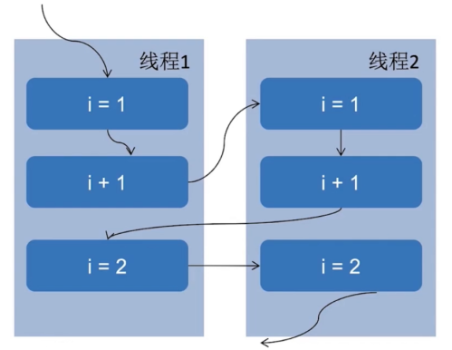

如上图所示：

```:no-line-numbers
线程 1 在开始执行 i+1，却还没将运算结果赋给变量 i 时，切换到线程 2，
线程 2 在开始执行 i+1，却还没将运算结果赋给变量 i 时，又切换到线程 1，
线程 1 继续运算 i+1，得到结果 2 赋给变量 i，然后切换到线程 2，
线程 2 继续运算 i+1，得到结果 2 赋给变量 i。
于是，出现变量 i 执行了两次 +1，却没能得到结果 3 的情况。
```

也就是说，当多个线程同时修改同一个共享变量时，无法保证线程之间的修改能够正常地 “叠加”。有可能出现某个线程的修改被其他线程的修改所 “覆盖” 的情况。

如下代码所示，可以通过 `AtomicInteger` 解决这个问题。

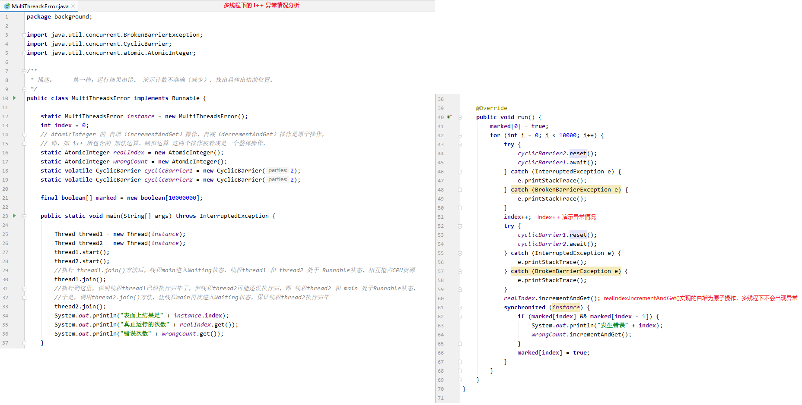

##### 8.1.2.2 演示死锁的产生

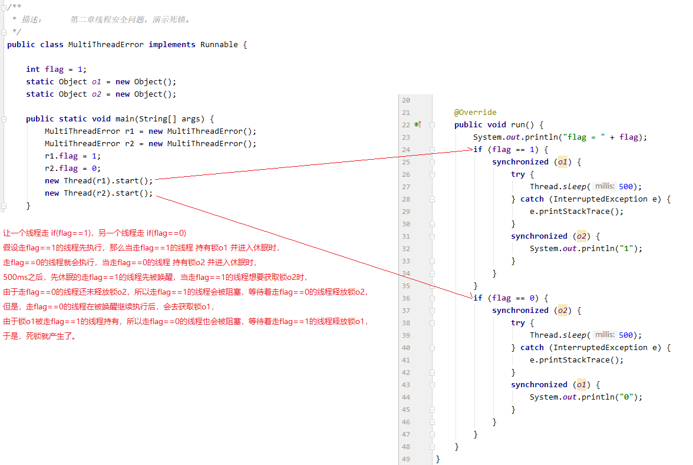

##### 8.1.2.3 对象发布和初始化时的安全问题

###### 对象的发布

对象的发布就是通过调用方法 ，将对象 `return` 出去给外界使用。

###### 对象的逸出（逃逸）及相关场景分析

逸出就是发布出去的对象并不是一个应该被外界访问的对象，或者发布出去的对象还未初始化完成，如：

1. 方法返回一个 `private` 对象（`private` 的本意是不让外部访问）；

    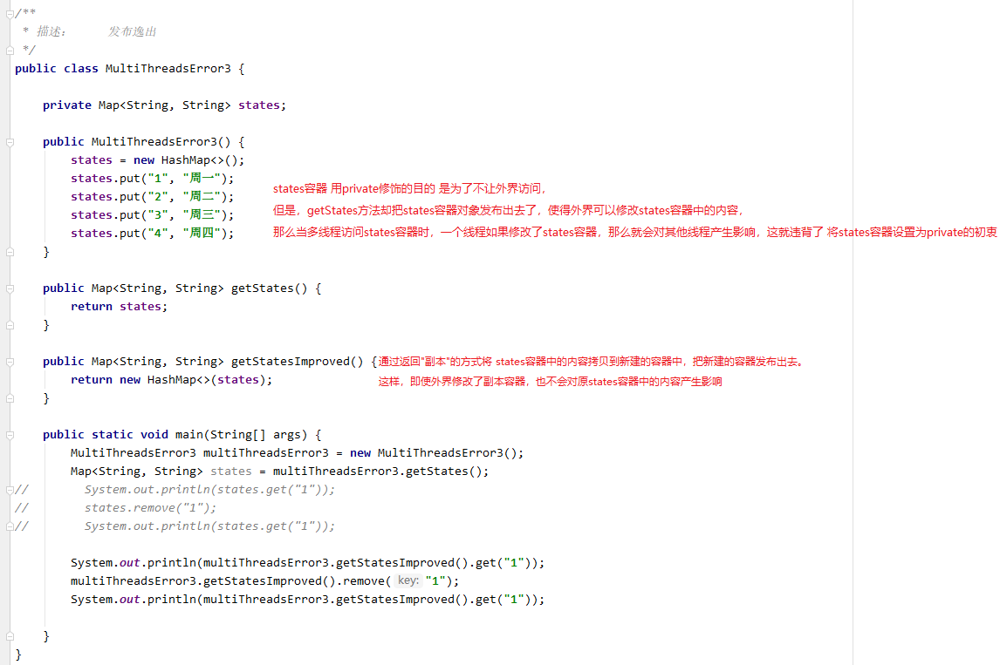

2. 还未完成初始化（构造函数没完全执行完毕）就把对象提供给外界，如：
   1. 在构造函数中未初始化完毕就 `this` 赋值；

        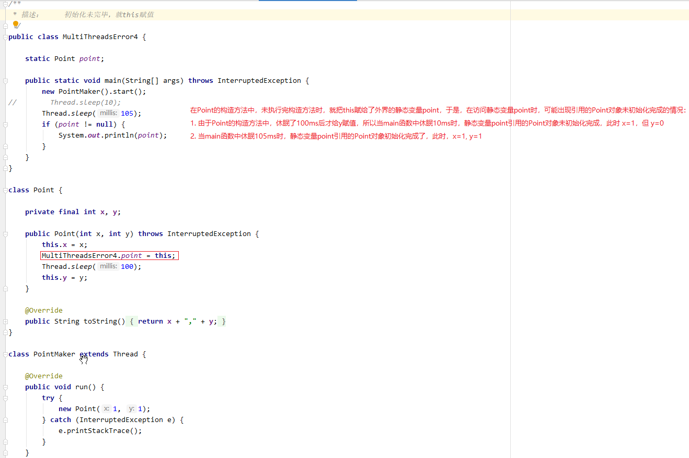

   2. 隐式逸出（如注册监听事件）；

        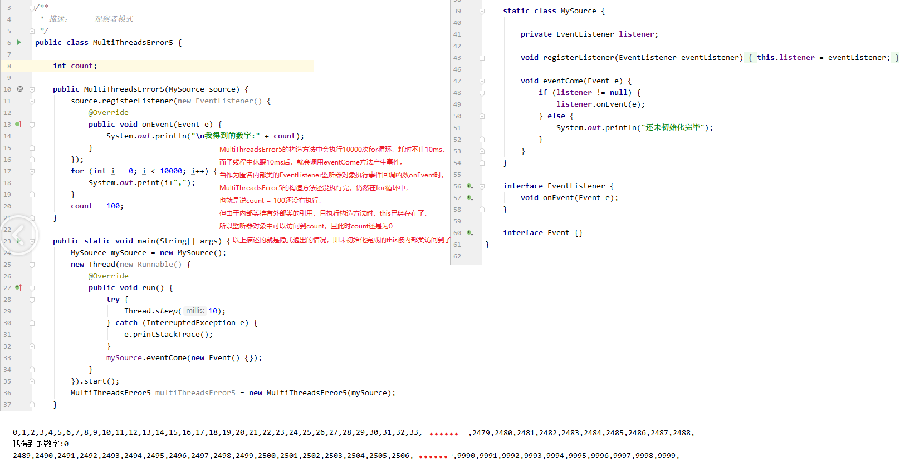
        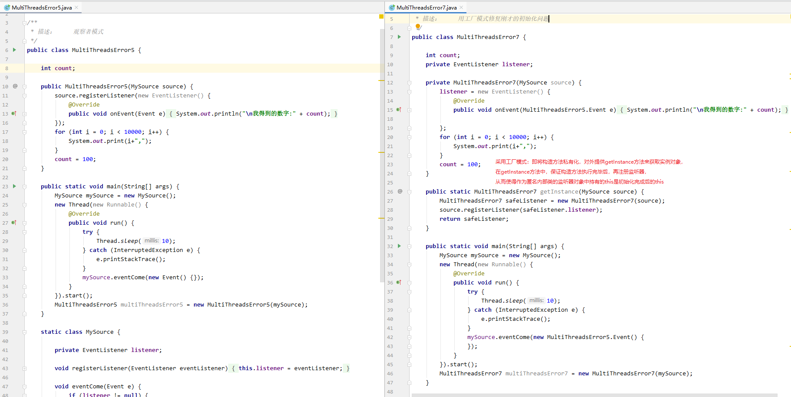
   
   3. 构造函数中运行线程。

        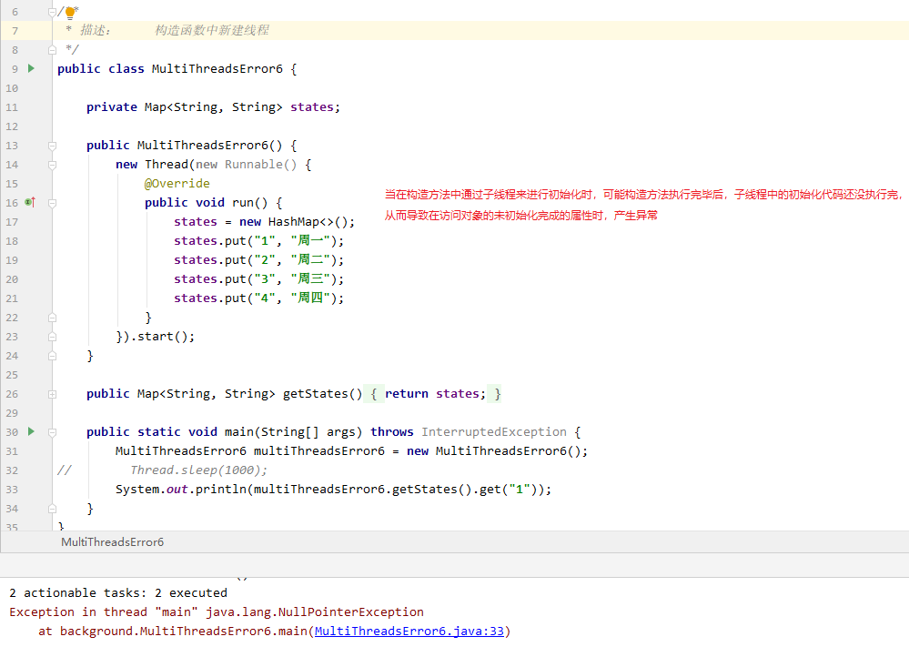

### 8.2 性能问题


