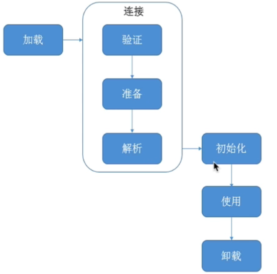
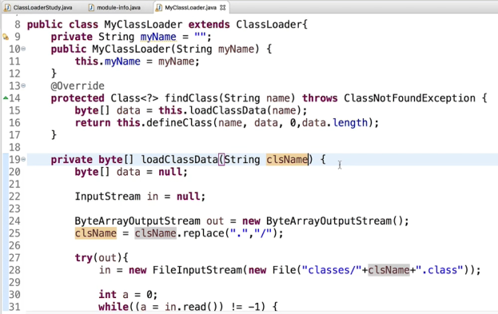
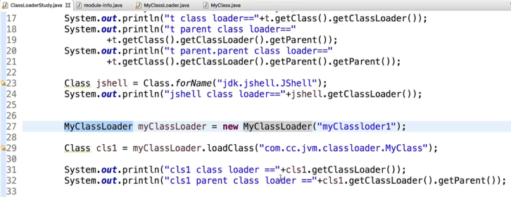
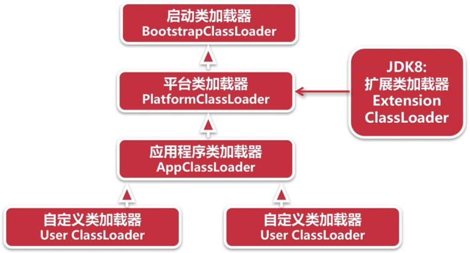
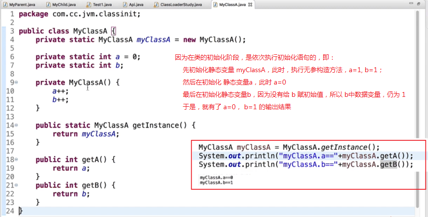
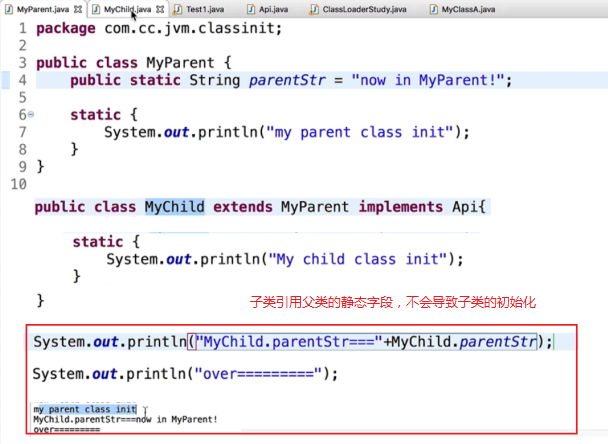
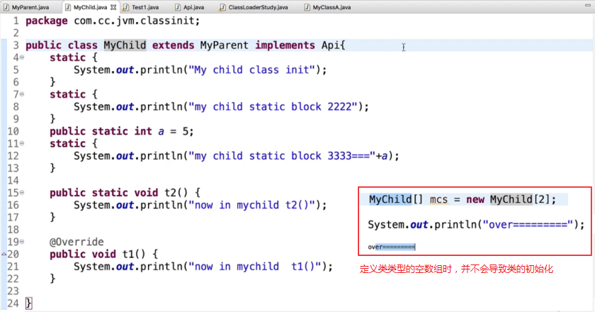
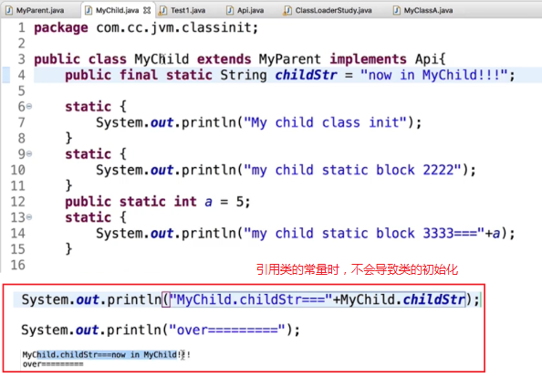

## 1. 类从加载、连接、初始化，到卸载的生命周期及概述



1. 加载：查找并加载 `class` 文件中的二进制数据

2. 连接：将已读入内存的 `class` 文件的二进制数据合并到 `JVM` 运行时环境中去，包含如下几个步骤：

    1. 验证：确保被加载的类的正确性。
   
    2. 准备：为类的 **静态变量** 分配内存，并初始化它们。

        > 注意：这里的初始化就是设置默认值 `0`（引用变量则是 `null`）。

    3. 解析：把常量池中的符号引用转换成直接引用。

3. 初始化：为类的 **静态变量** 赋初始化值

    > 注意：这里的初始值就是我们在源码中定义的初始值。

## 2. 类的加载

### 2.1 类加载要完成的功能

在类的加载阶段要完成的功能有：

1. 通过类的全限定名来获取该类的 `class` 文件中的二进制字节流数据；

2. 把二进制字节流数据转换为方法区的运行时数据结构（也就是说 **类加载完成之后，就保存在方法区中了**）。

3. 在堆中创建一个 `java.lang.Class` 对象，用来 **封装类在方法区中的数据结构，并向外提供了访问方法区内数据结构的接口**。

### 2.2 类加载的方式

1. 最常见的方式：
   1. 从本地文件系统中加载；
   2. 从 `jar` 等归档文件中加载；

2. 动态的方式：
   1. 将 `java` 源文件 **动态编译** 成 `class`

3. 其他方式：
   1. 从网络中下载；
   2. 从专有数据库中加载；
   3. ......

### 2.3 类加载器

#### 2.3.1 `Java` 虚拟机自带的加载器（系统类加载器）

`Java` 虚拟机自带的加载器包括：
1.  启动类加载器（`BootstrapClassLoader`）；
   
2.  平台类加载器（`PlatformClassLoader`）；
   
    > `JDK 9` 之后就将 `JDK 8` 中的扩展类加载器（`ExtensionClassLoader`）废除了，新增了平台类加载器。
    > 这是因为：
    > 
    > 1. 扩展类加载器不安全；
    >
    > 2. `JDK 9` 之后新增的模块化开发完全可以代替扩展类加载器。

3.  应用程序类加载器（`AppClassLoader`）。

##### 2.3.1.1 启动类加载器（`BootstrapClassLoader`）

1. `JDK 9` 中：

    ```:no-line-numbers
    用于加载启动的基础模块类，比如：java.base、java.management、java.xml 等。
    （JDK 9 中新增了模块的概念）
    ```

2. `JDK 8` 中：

    ```:no-line-numbers
    负责加载 <JAVA_HOME>/lib，或者 -Xbootclasspath 参数指定的路径下的，且是虚拟机识别的类库。
    （按照名字识别，比如 rt.jar。对于不能识别的文件不予装载）
    ```

> 如果一个类是通过启动类加载器加载出来的，那么该类对应的 `Class` 对象的 `getClassCloader()` 方法返回 `null` 。

##### 2.3.1.2 平台类加载器（`PlatformClassLoader`）

1. `JDK 9` 中：

    ```:no-line-numbers
    用于加载一些平台相关的模块，比如：java.scripting、java.compiler*、java.corba* 等。
    （JDK 9 中新增了模块的概念）
    ```

2. `JDK 8` 中：

    ```:no-line-numbers
    平台类加载器是在 JDK 9 中才提出来的，用于代替扩展类加载器。
    ```

##### 2.3.1.3 扩展类加载器（`ExtensionClassLoader`）

1. `JDK 9` 中：

    ```:no-line-numbers
    扩展类加载器在 JDK 9 中已废除，被平台类加载器所取代。
    ```

2. `JDK 8` 中：
    ```:no-line-numbers
    负责加载 <JRE_HOME>/lib/ext，或者 java.ext.dirs 系统变量所指定的路径下的所有类库。
    ```

##### 2.3.1.4 应用程序类加载器（`AppClassLoader`）

1. `JDK 9` 中：

    ```:no-line-numbers
    用于加载应用级别的模块，比如：jdk.compiler、jdk.jartoor、jdk.jshell 等；
    （JDK 9 中新增了模块的概念）

    还用于加载 `classpath` 路径下的所有类库。
    ```

2. `JDK 8` 中：

    ```:no-line-numbers
    负责加载 `classpath` 路径下的所有类库。
    ```

#### 2.3.2 自定义类加载器

自定义类加载器就是用户自定义的加载器：
1. 自定义类加载器是 `java.lang.ClassLoader` 的子类；
2. 通过自定义类加载器用户可以定制类的加载方式；
   
> 注意：自定义类加载器的加载顺序在所有系统类加载器之后。

##### 2.3.2.1 自定义类加载器举例

继承 `ClassLoader` 实现自定义类加载器时，推荐重写 `findClass()` 方法





> 由于 `MyClass` 类的 `class` 文件会自动在 `bin/` 目录下生成（即在 `AppClassLoader` 的 `classpath` 路径下），所以最终还是 `AppClassLoader` 来加载 `MyClass`。
> 
> 要想使用 `MyClassLoader` 来加载 `MyClass` 类，将 `bin/` 目录下生成的 `MyClass.class` 删除即可。

#### 2.3.3 类加载器之间的关系



#### 2.3.4 注意事项

1. 不能直接在 `Java` 程序中引用启动类加载器（即不能直接设置 `ClassLoader` 为 `null`）。
   
2. 类加载器并不需要等到某个类 **首次主动使用** 时才加载它。
   
    > `JVM` 规范允许类加载器在预料到某个类将要被使用的时候就预先加载它。

3. 如果某个类的 `class` 文件在加载的时候缺失了，那么会在该类 **首次主动使用** 的时候才报 `LinkageError` 错误。
   
    > 如果一直没有被使用，那么就不会报该错误。

### 2.4 双亲委派模型

`JVM` 中的 `ClassLoader` 通常采用双亲委派模型。该模型要求除了启动类加载器外，其它的类加载器都应该有自己的父级加载器。

> 注意：这里的父子关系是组合，而不是继承。

双亲委派模块对于保证 `Java` 程序的稳定运作很重要。

实现双亲委派的代码在 `java.lang.ClassLoader` 的 `loadClass()` 方法中。

> 继承 `ClassLoader` 实现自定义类加载器时，推荐重写 `findClass()` 方法

#### 2.4.1 双亲委派模型的工作过程

工作过程如下：

1. 一个类加载器接收到类加载请求后，首先搜索它的内建加载器定义的所有 **具名模块**；
   
2. 如果找到了合适的模块定义，将会使用该加载器来加载；
   
3. 如果 `class` 没有在这些加载器定义的 **具名模块** 中找到，那么将会委托给父级加载器（直到启动类加载器）；
   
4. 如果父级加载器反馈它不能完成加载请求，比如在它的搜索路径下找不到这个类，那么子的类加载器才自己来加载；
   
5. 在类路径下找到的类将成为这些加载器的 **无名模块**。

> 注意：`JDK 8` 中还不存在 **模块** 的概念，所以没有 “搜索内存加载器定义的具名模块” 这个步骤，也就是说 `JDK 8` 中不存在第 `2` 步。
> 
> 即：`JDK 8` 中，子级加载器直接委托给父级加载器。

#### 2.4.2 定义类加载器 & 初始类加载器

如果有一个类加载器能加载某个类，称为定义类加载器。

所有能成功返回该类的 `class` 的类加载器，都被称为初始类加载器。

#### 2.4.3 注意事项

1. 如果没有指定父加载器，默认就是启动加载器。

2. 每个类加载器都有自己的命名空间，命名空间由该加载器及其所有父加载器所加载的类构成。

    > 不同的命名空间，可以出现类的全路径名相同的情况。

3. 运行时包由同一个类加载器的类构成，决定两个类是否属于同一个运行时包，不仅要看全路径名是否一样，还要看定义类加载器是否相同。

    > 只有属于同一个运行时包的类才能实现相互包内可见。

#### 2.4.4 破坏双亲委派模型 & 线程上下文类加载器

双亲委派模型存在这样一个问题：父加载器无法向下识别子加载器加载的资源。

为了解决这个问题，引入了线程上下文类加载器，可以通过 `Thread` 的 `setContextClassLoader()` 方法进行设置。

另外一种典型情况就是实现热替换，比如 `OSGI` 的模块化热部署。它的类加载器就不再是严格按照双亲委派模型，很多可能就在平级
的类加载器中执行了。

## 3. 类的连接

### 3.1 验证

#### 3.1.1 验证的主要内容

类连接时，验证的主要内容有：

1. 类文件结构检查：按照 `JVM` 规范规定的类文件结构进行。

2. 元数据验证：对字节码描述的信息进行语义分析，保证其符合 `Java` 语言规范要求。

3. 字节码验证：通过对数据流和控制流进行分析，确保程序语义是合法、且符合逻辑。

    > 这里主要是对方法体进行校验。

4. 符号引用验证：对类自身以外的信息，也就是常量池中的各种符号引用，进行匹配校验。

### 3.2 准备

为类的 **静态变量** 分配内存，并初始化它们。

> 注意：这里的初始化就是系统自动设置默认值 `0`（引用变量则是 `null`）。

### 3.3 解析（常量池中的符号引用转换成直接引用）

所谓解析，就是把常量池中的符号引用转换成直接引用的过程。其中：

1. 符号引用：以一组无歧义的符号来描述所引用的目标。与虚拟机的实现无关。

2. 直接引用：直接指向目标的指针、相对偏移量、或是能间接定位到目标的句柄。与虚拟机的实现有关。

解析主要是针对：类、接口、字段、类方法、接口方法、方法类型、方法句柄、调用点限定符。

## 4. 类的初始化

类的初始化就是为类的静态变量赋初始值，或者说是执行类构造器 `<clinit>` 方法的过程。

> 这里的赋初始值指的是程序员在定义静态变量时（或者在静态代码块中）手动设置的初始值。

### 4.1 类初始化的过程

1. 如果类还没有加载和连接，就先加载和连接。

2. 如果类存在父类 ，且父类没有初始化，就先初始化父类。

3. 如果类中存在初始化语句，就依次执行这些初始化语句。

4. 如果是接口的话：
   1. 初始化一个类的时候，并不会先初始化它实现的接口。
   2. 初始化一个接口的时候，并不会先初始化它的父接口。
   3. 只有当程序首次使用接口里面的变量，或者调用接口方法时，才会导致接口的初始化。

5. 调用 `ClassLoader` 类的 `loadClass` 方法加载一个类时，并不会初始化该类。（这不是对类的主动使用）

### 4.2 类初始化的时机（对类的首次主动使用）

`Java` 程序对类的使用方式分为：

1. 主动使用；

2. 被动使用。

类初始化的时机就是：`JVM` 必须在每个类或接口 **首次主动使用** 时才初始化它们。

>  被动使用类不会导致类的初始化。

#### 4.2.1 主动使用的情况

主动使用类或接口的情况包括：

1. 创建类实例；

2. 访问某个类或接口的静态变量；
   
3. 调用类的静态方法；

4. 反射某个类；

5. 初始化某个类的子类，而父类还没有初始化；

6. `JVM` 启动的时候运行的主类；

7. 定义了 `default` 方法的接口，当接口实现类初始化时。

#### 4.2.2 被动使用的情况

被动使用类或接口的情况包括：

1. 通过子类引用父类的静态字段，不会导致子类的初始化；

2. 当定义类类型的空数组时，不会导致类的初始化。如 `Foo[] foos = new Foo[3];`

3. 引用类的常量时（`final static` 修饰的成员变量），不会导致类的初始化。

#### 4.2.3 举例说明









## 5. 类的卸载

当代表一个类的 `Class` 对象不再被引用时，那么 `Class` 对象的生命周期就结束了。`Class` 对象对应的在方法区中的数据也会被卸载。

注意：

1. `JVM` 自带的类加载器加载的类是不会被卸载的。
   
2. 由自定义类加载器加载的类是可以卸载的。
