## CPU 和 GPU

图形绘制需要进行大量的算术逻辑运算。在没有 `GPU` 之前，计算机的算术逻辑运算都是交由 `CPU` 中的 `ALU` 算术逻辑单元完成的。
但是，`CPU` 作为中央处理器，统管所有程序，其中有限的 `ALU` 不能满足图形绘制时所需的大量算术逻辑计算的要求，所以图形质量难以提升。

而 `GPU` 则是专门用来进行图形绘制时的 算术逻辑运算的，`GPU` 中包含了很多的 `ALU` 算术逻辑单元，可以满足图形绘制时所需的大量算术逻辑计算。因此，自从 `GPU` 出现后，`CPU` 只需经过一些简单计算，把布局信息转成矢量图形信息，然后把矢量图形信息交给 `GPU`，由 `GPU` 根据矢量图形信息进行大量的算术逻辑计算，经过栅格化之后，把矢量图形信息转成 `Bitmap` 位图放到显示器上显示。

## 刷新频率和 `VSync` 信号

### `60Hz` 刷新频率的由来

**`12fps`**：由于人类眼睛的特殊生理结构，如果所看画面的帧率高于每秒约 `10-12` 帧的时候，就会认为是连贯的（视觉滞留效应）。

**`24fps`**：有声电影的拍摄及播放帧率均为每秒 `24` 帧，对一般人而言已算可接受。

**`30fps`**：早期的高动态电子游戏，帧率少于每秒 `30` 帧的话就会显得不连贯，这是因为没有动态模糊使流畅度降低。

**`60fps`**：在于手机交互过程中，如触摸和反馈 `60` 帧以下人是能感觉出来。`60` 帧以上不能察觉变化。当帧率低于 `60fps` 时感觉画面出现卡顿和迟滞的现象。

`Android` 系统每隔 `16ms` 发出 `VSync` 信号（`1000ms/60≈16.66ms`），触发对 `UI` 进行渲染，如果每次渲染都成功，这样就能达到流程的画面所需要的 `60fps`。为了能够实现 `60fps` ，这意味着计算渲染的大多数操作都必须在 `16ms` 内完成。

> `60fps` 表示 `1s` 内要显示 `60` 张图片，一张图片称为一帧。
>
> `1s` 内显示 `60` 帧，则 `16.66ms` 内要显示出一帧。否则 `1s` 内就无法显示完 `60` 帧图片，造成卡顿。
>
> `VSync` 信号的间隔时间越短，`1s` 内显示的帧数越多，画面越流畅。

### `VSync` 信号及卡顿原理分析

`VSync` 信号即垂直同步信号。

相邻两次 `VSync` 信号的间隔时间（`16ms`）内需要完成以下两大处理过程：
1. 从 `CPU` 计算布局信息得到矢量图形信息（专业术语：**纹理处理**）；
2. 到 `CPU` 向 `GPU` 发送纹理信息，并 `GPU` 根据纹理信息对图片的每个像素进行颜色填充（专业术语：**栅格化处理**）。

只有在此 `16ms` 的间隔时间内，完成上面两个步骤才能将一帧图片成功地显示出来。否则延迟处理完成的这一帧图片无法及时显示，从而屏幕上还是显示原来的画面（即原来的画面在屏幕上多停留了 `16ms`）。如果连续几次都无法在 `16ms` 的间隔时间内完成以上两步，那么屏幕上原来的画面就会停留更长的时间，从而造成屏幕卡顿。

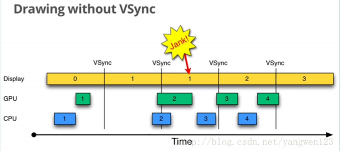

> 只有第 `1` 帧图片正常显示，第 `2`、`3`、`4` 帧图片无法正常显示，造成屏幕画面无改变，产生卡顿（`Jank`）。

如上图所示，当一帧画面渲染时间超过 `16ms` 的时候，垂直同步机制会让显示器硬件等待 `GPU` 完成栅格化渲染操作，这样会让这一帧画面多停留了 `16ms`，甚至更多。这样就造成了用户看起来画面停顿。

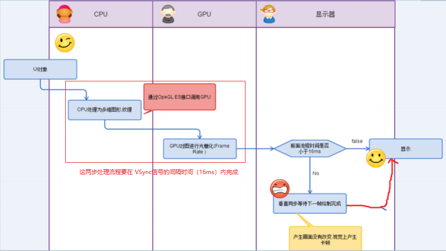

### 如何避免卡顿

垂直同步信号（`VSync`信号）的间隔时间（`16ms`）内主要需要完成两件事情：
1. `CPU` 对 `UI` 对象进行处理，转换为一系列的多边形（`polygons`）和纹理（`textures`）
2. `CPU` 将处理后的数据传递给 `GPU`，`GPU` 进行栅格化渲染处理。

为了保证以上两件事情在 `16ms` 内完成，应该尽量缩短对这两件事情的处理时间：
1. 减少布局控件，使 `CPU` 需要处理的 `UI` 对象减少，从而减少 `CPU` 的处理转换时间。
2. 避免过度绘制，从而减少 `GPU` 的栅格化渲染处理时间。

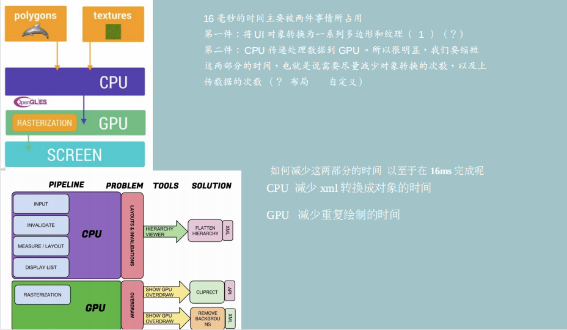

## 过度绘制（`OverDraw`）

### 什么是过度绘制

`GPU` 的绘制过程就跟刷墙一样，一层层地进行，`16ms` 刷一次，这样就会造成图层覆盖的现象，即无用的图层还会被绘制在底层，造成不必要的浪费。

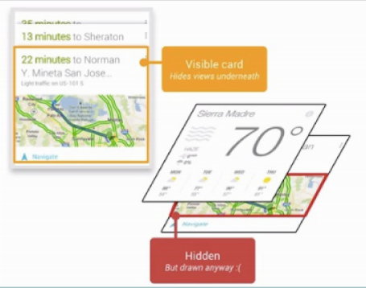

### `GPU` 过度绘制的几种情况

1. 自定义控件中 `onDraw` 方法做了过多的重复绘制

2. 布局层次太深，重叠性太强。用户看不到的区域 `GPU` 也会渲染，导致耗时增加。

### 过度绘制的优化（主要减少 `GPU` 工作量）

1. 避免在自定义控件的 `onDraw` 方法中对同一区域进行重复绘制。
    > 即在自定义控件中，当有多个图形的部分区域重叠在一起，且被盖在下面的图形不会显示出来时，那么在 `onDraw` 方法中，不应该再对无法显示出来的图形区域进行绘制。此时，应该从画布中裁剪出一块同图形的可显示区域大小一样的区域，在这个裁剪出来的区域中绘制图形，从而图形中无法显示的部分就不会被绘制出来了。

2. 减少布局文件中的嵌套布局。

3. 减少背景重复
    1. 可以考虑去掉 `Activity` 主题中设置的背景，需要时自己加
        > 去掉单个 `Activity` 的主题设置的背景属性：在 `setContentView` 之前调用 `getWindow().setBackgroundDrawable(null)`
        >
        > 去掉所有 `Activity` 主题中设置的背景属性：在 `styles.xml` 中设置 `<item name="android:windowBackground">@null</item>`

    1. 非业务需要，不要去设置背景。

    2. 将不能去掉，但又不会显示出来的背景设置为透明。
        > 将背景设置为透明时，只是 `CPU` 会去计算透明背景的尺寸，位置等信息，但是并不会再传递给 `GPU` 去处理。

4. `Android 7.0` 之后系统做出的优化：`invalidate()` 方法不再执行测量和布局动作。

### 如何查看过度绘制

在手机端的开发者选项里，开启 “调用 `GPU` 过度绘制” 

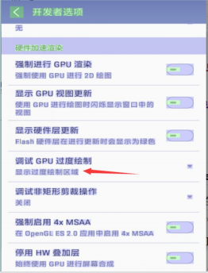
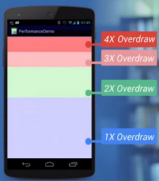

如上图，其中颜色代表渲染的图层情况：
1. 界面上什么都没有绘制时，无图层，此时该区域显示白色；
2. 界面上绘制了 `1` 次的区域，有 `1` 层图层，此时该区域显示蓝色（淡紫色）；
3. 界面上绘制了 `2` 次的区域，有 `2` 层图层，此时该区域显示浅绿色；
4. 界面上绘制了 `3` 次的区域，有 `3` 层图层，此时该区域显示浅红色（粉红色）；
5. 界面上绘制了 `4` 次的区域，有 `4` 层图层，此时该区域显示深红色（红色）；

> 界面上绘制了 `4` 次以上的区域，都显示为深红色（红色）。
>
> 我们的目标就是尽量减少红色 `OverDraw`，看到更多的蓝色区域。

## 布局的优化（主要减少 `CPU` 工作量）

### 如何查看布局的视图层级（`Hierarchy View`）

**常用工具：**

1. `Android Device Monitor` 中的 `Hierarchy View` 窗口下的 `TreeView` 工具
    > 出于安全考虑 `Hierarchy Viewer` 只能连接 `Android` 开发版手机或者模拟器（准确地说，只有参数 `ro.secure` 设置为 `0`，且 `ro.debuggable` 设置为 `1` 的 `Android` 系统）。
    >
    > `Hierarchy Viewer` 在连接手机时，手机上必须启动一个叫 `View Server` 的客户端，用来与 `Hierarchy Viewer` 进行 `socket` 通信。而在商业手机上，是无法开启 `View Server` 的，故 `Hierarchy Viewer` 是无法连接到普通的商业手机的。
    >
    > 这里的 `Hierarchy Viewer` 指的就是 `TreeView` 。

2. `AndroidStudio` 自带的 `Layout Inspector` 工具
    > `Layout Inspector` 无法用来查看布局性能，只能查看布局层级。
    >
    > `Live Layout Inspecotr` 的功能需要 `API level 29` 以上才支持

### 通过 `TreeView` 查看视图层级（`Hierarchy View`）

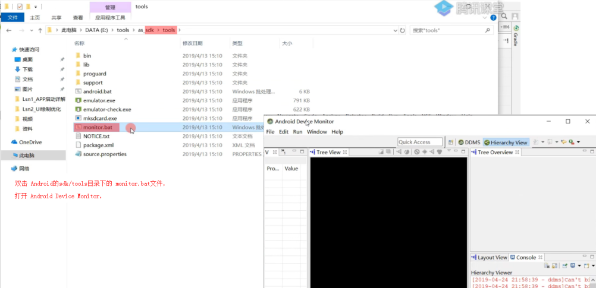

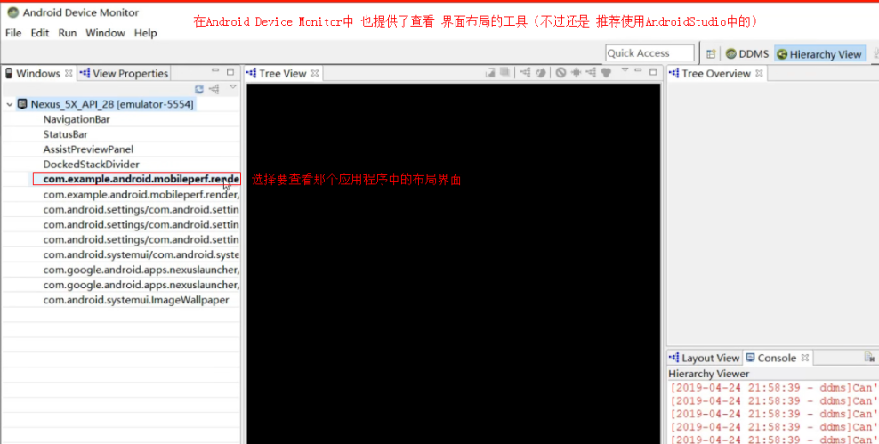

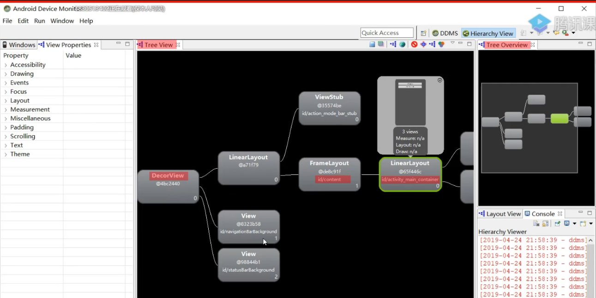

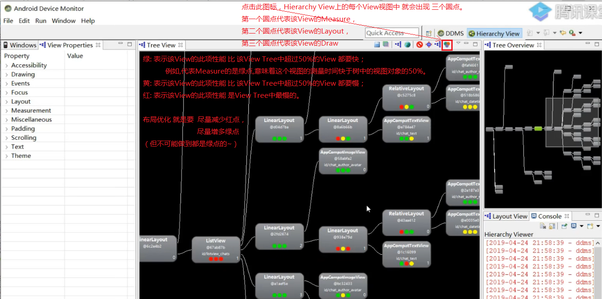

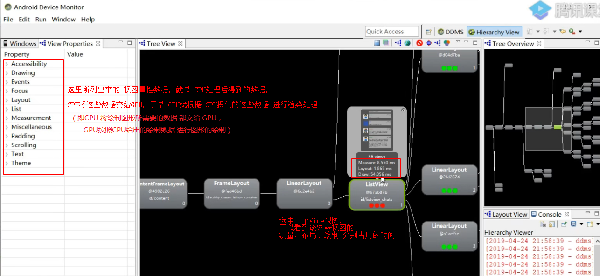

### 布局的优化思路

1. 尽可能把相同的容器合并 `merge`

2. 能在一个平面显示的内容，尽量只用一个容器（减少布局嵌套）

3. 能复用的代码，用 `include` 处理，可以减少 `GPU` 重复工作

#### `merge` 标签的作用

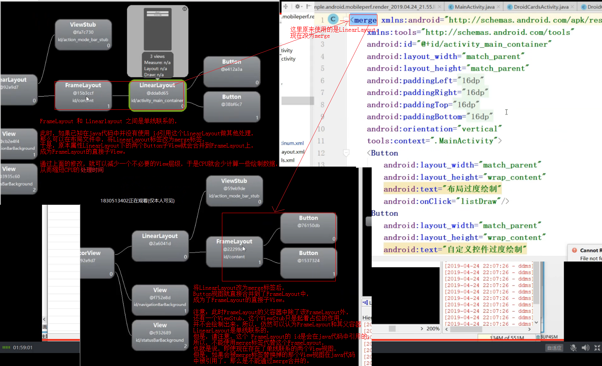

#### 使用 `ConstraintLayout` 或 `RelativeLayout` 减少布局嵌套

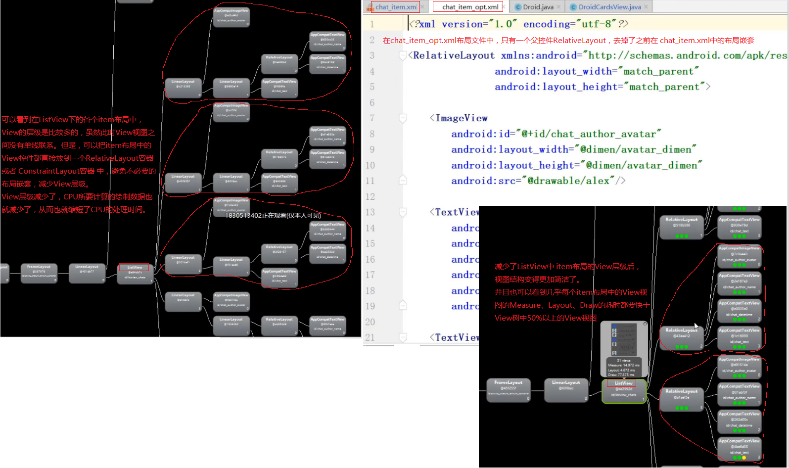

#### `include` 标签的作用

如果多个界面中存在相同的布局（如列表的头部布局、底部布局，或网络加载失败布局），
那么应该把这种相同的布局单独地写在一个 `xml` 文件中，然后在需要使用到的地方通过 `include` 标签引进。

这样做的好处就是，`CPU` 只需要对 `include` 引入的布局视图计算一次，将相应的绘制数据传递给 `GPU` 后，`GPU` 会进行缓存。于是，当下一次再使用 `include` 引入相同的布局时，`CPU` 就不会再计算了，并且 `GPU` 也会直接从缓存中获取相应的绘图数据对其进行渲染。