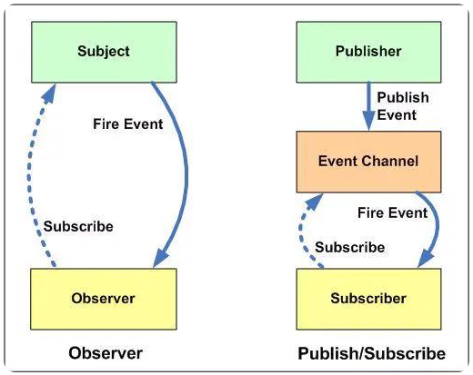

## 1. 观察者模式 & 发布订阅模式（`Publish–Subscribe Pattern`）的区别

区别如下：

1. 观察者模式中，被观察者直接依赖于观察者，即被观察者是知道观察者的存在的；发布订阅模式中，发布者并没有直接依赖于订阅者，即发布者并不知道订阅者的存在。

    > 发布者只负责将事件发送到指定位置，至于有没有订阅者来接收指定位置中的事件，发布者对此不负责；
    >
    > 而被观察者则需要直接将事件发送给观察者，如果观察者不存在，那么事件发不出去。

2. 发布订阅模式中，发布者和订阅者是解耦的，彼此无直接的依赖关系；观察者模式中，被观察者和观察者是耦合的，彼此存在直接的依赖关系。

3. 观察者模式主要适用于同步操作中（即发送事件和接收事件的过程在同一线程中）；发布订阅模式主要适用于异步操作中（即发送事件和接收事件的过程不在同一线程中）。