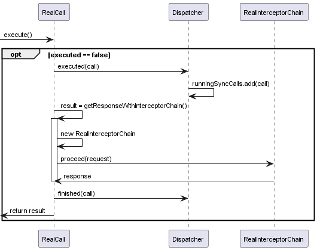
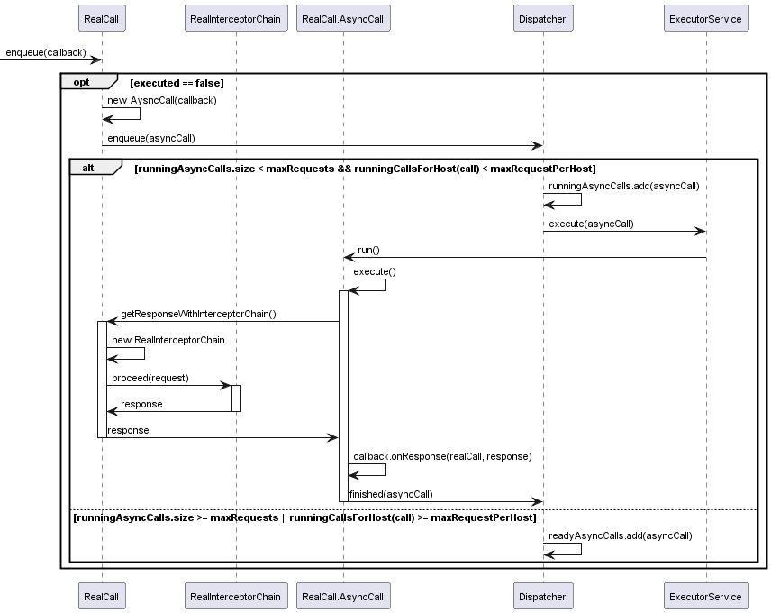
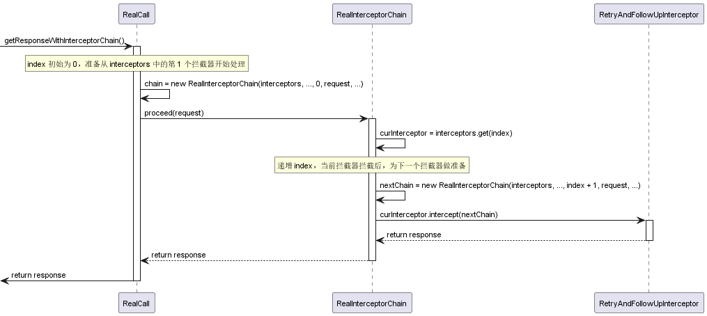
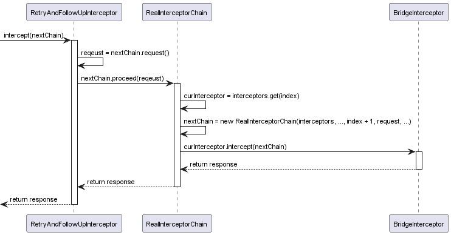
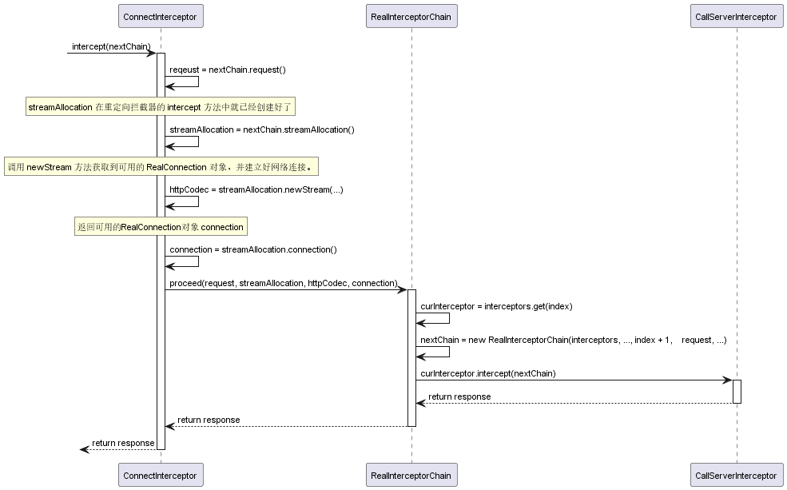
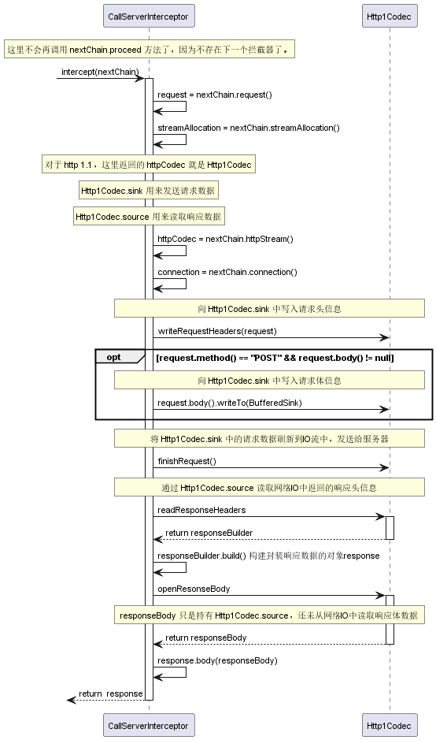

基于 `okhttp:3.9.0`

## `OkHttp` 的同步/异步请求

### 同步请求步骤

1. 通过建造者 `OkHttpClient.Builder` 创建 `OkHttpClient` 对象；
2. 通过建造者 `Request.Builder` 创建 `Request` 对象；
3. 调用  `OkHttpClient.newCall(request)` 方法创建 `Call` 对象；
4. 调用同步请求方法 `call.execute()` 返回 `Response` 对象；
5. 调用 `response.body().string()` 返回响应的 `json` 字符串数据。

> 在第 `4` 步中执行的 `call.execute()` 方法是一个**阻塞方法**，会使当前线程进入阻塞状态，直到返回 `Response` 对象。


### 异步请求步骤

1. 通过建造者 `OkHttpClient.Builder` 创建 `OkHttpClient` 对象；
2. 通过建造者 `Request.Builder` 创建 `Request` 对象；
3. 调用  `OkHttpClient.newCall(request)` 方法创建 `Call` 对象；
4. 调用异步请求方法 `call.enqueue(callback)`，在回调函数 `callback.onResponse` 中得到作为函数参数传进来的 `Response` 对象；
5. 调用 `response.body().string()` 返回响应的 `json` 字符串数据。

> 回调函数 `callback.onFailure` 和 `callback.onResponse` 都是在**子线程中调用**的。


### 同步请求和异步请求的区别

**相同点：**
1. 对于创建 `OkHttpClient` 对象，`Request` 对象，`Call` 对象的步骤，同步请求和异步请求都是一样的；
2. 在拿到 `Response` 对象，对得到的响应 `json` 字符串进行解析的流程，同步请求和异步请求也都是一样的。

**不同点：**
1. 同步请求中调用 `call.execute()` 方法发起网络请求，且该方法是阻塞的，响应数据直通过方法返回值直接返回。
2. 异步请求中调用 `call.enqueue(callback)` 方法发起网络请求，且该方法是非阻塞的，响应数据通过回调函数 `callback.onResponse` 返回。

## `OkHttp` 的配置

通过 `OkHttpClient.Builder` 中的成员变量可以看出在创建 `OkHttpClient` 对象时可配置的参数信息。

通过 `Request.Builder` 中的成员变量可以看出在创建 `Request` 对象时可配置的参数信息。

> 在创建一个对象时，如果需要初始化设置很多的参数，那么就可以使用 `Builder` 建造者模式。

### `OkHttpClient` 的配置

在 `OkHttpClient` 中可配置：
1. 连接超时的时长；
2. 读写超时的时长；
3. 缓存策略；
4. 是否允许重定向；
5. 拦截器；
6. ......


### `Request` 的配置

在 `Request` 中可配置：
1. 请求地址 `url`；
2. 请求方式；
3. 请求头信息；
4. 请求体；
5. 标识本次请求的 `tag` 标签（可以用来取消本次请求）。


## `Call` 对象的作用

`Call` 可以理解成请求 `Request` 和响应 `Response` 之间沟通的桥梁。通过 `Call` 发起同步请求和异步请求。

`Call` 是一个接口，调用 `OkHttpClient.newCall(request)` 方法创建的是它的实现类 `RealCall` 的实例对象。
> `RealCall` 对象持有 `OkHttpClient` 对象和 `Request` 对象的引用。
>
> 且在 `RealCall` 的构造方法中就创建好了重定向拦截器 `RetryAndFollowInterceptor`。


## 发起同步请求的源码分析



**注意：**
1. 在 `RealCall` 中通过布尔变量 `executed` 保证一个 `Call` 对象只能发起一次同步请求或一次异步请求；

2. 在发起同步请求前，会先将 `Call` 对象保证在调度器 `Dispatcher` 维护的同步请求队列 `runningSyncCalls` 中。在同步请求完成后，再调用 `Dispatcher.finished(call)` 方法，将 `Call` 对象从同步请求队列 `runningSyncCalls` 中移除。
    ```java
    /* Dispatcher.java */
    
    void finished(RealCall call) {
        finished(runningSyncCalls, call, false);
    }

    private <T> void finished(Deque<T> calls, T call, boolean promoteCalls) {
        ...
        synchronized (this) {
            if (!calls.remove(call)) // 从 runningSyncCalls 中移除 Call 对象
                throw new AssertionError("Call wasn't in-flight!");
            ...
        }
        ...
    }
    ```

3. 响应数据 `Response` 对象是调用 `getResponseWithInterceptorChain()` 方法，通过拦截器链获取到的。

## 发起异步请求的源码分析



### 通过 `AsyncCall` 发起异步请求

1. `AsyncCall` 是 `RealCall` 的非静态内部类，持有 `RealCall` 的 `this` 引用。因此可以调用 `RealCall.getResponseWithInterceptorChain()` 方法获取响应数据。

2. `AsyncCall` 实现了 `Runnable` 接口，异步请求中，会把 `AsyncCall` 对象提交到线程池，在子线程中执行 `AsyncCall.run()` 方法，在 `run` 方法中调用 `AsyncCall.execute()` 方法发起异步请求。

3. 在 `AsyncCall.execute()` 方法中，也是调用 `RealCall.getResponseWithInterceptorChain()` 方法通过拦截器链来获取响应数据 `Response` 的。然后将响应数据 `Response` 对象通过回调函数 `callback.onResponse` 返回。
    ```java
    /*  RealCall.AsyncCall */
    protected void execute() {
        boolean signalledCallback = false;
        try {
            Response response = getResponseWithInterceptorChain(); // 通过拦截器链获取响应数据
            if (retryAndFollowUpInterceptor.isCanceled()) {
                signalledCallback = true;
                responseCallback.onFailure(RealCall.this, new IOException("Canceled"));
            } else {
                signalledCallback = true;
                responseCallback.onResponse(RealCall.this, response); // 将获取的响应数据回调出去
            }
        } catch (IOException e) {
            if (signalledCallback) {
                // Do not signal the callback twice!
                Platform.get().log(INFO, "Callback failure for " + toLoggableString(), e);
            } else {
                eventListener.callFailed(RealCall.this, e);
                responseCallback.onFailure(RealCall.this, e);
            }
        } finally {
            client.dispatcher().finished(this);
        }
    }
    ```

### 调度器 `Dispatcher` 中异步请求的调度策略

#### 执行异步请求的线程池

```java
/* Dispatcher.java */
public synchronized ExecutorService executorService() {
    if (executorService == null) {
        executorService = new ThreadPoolExecutor(0, Integer.MAX_VALUE, 60, TimeUnit.SECONDS,
            new SynchronousQueue<Runnable>(), Util.threadFactory("OkHttp Dispatcher", false));
    }
    return executorService;
}
```

1. `Dispatcher` 维护的线程池中没有核心线程，只有非核心线程，且非核心线程的空闲存活时间是 `60s`。

2. 虽然线程池中没有限制同时执行的线程数（`Integer.MAX_VALUE`），但在 `Dispatcher` 中已经通过 `maxRequest` 做了限制，即同时执行的异步请求个数（即线程数）不会超过 `maxRequest`。

#### 并发请求队列 `runningAsyncCalls` 和等待请求队列 `readyAsyncCalls`

```java
/* Dispatcher.java */

/** Ready async calls in the order they'll be run. */
private final Deque<AsyncCall> readyAsyncCalls = new ArrayDeque<>();

/** Running asynchronous calls. Includes canceled calls that haven't finished yet. */
private final Deque<AsyncCall> runningAsyncCalls = new ArrayDeque<>();
```

1. 还未提交到线程池中的异步请求 `AsyncCall` 会保存在等待请求队列 `readyAsyncCalls` 中。

2. 已经提交到线程池中的异步请求 `AsyncCall` 会保存在并发请求队列 `runningAsyncCalls` 中。
    > 取消一个已提交到线程池中的异步请求 `AsyncCall`，不会立即将它从 `runningAsyncCalls` 队列中移除。
    只有当异步请求执行完毕后，在 `AsyncCall.execute()` 方法的 `finally` 代码块中执行 `Dispatcher.finished(asyncCall)` 方法时，才会将异步请求 `AsyncCall` 移除。

#### 通过 `maxRequests` 和 `maxRequestsPerHost` 限制并发请求个数
```java
/* Dispatcher.java */

private int maxRequests = 64;
private int maxRequestsPerHost = 5;
```

1. `maxRequests` 表示一个 `OkHttpClient` 对象中，最大允许的所有异步请求的并发个数（即可同时执行的任意异步请求的线程个数）。默认值为 `64`。

2. `maxRequestsPerHost` 表示一个 `OkHttpClient` 对象中，最大允许的对同一个主机名 `host` 所发起的异步请求的并发个数（即可同时执行的向同一个主机名 `host` 所发起的异步请求的线程个数）。默认值为 `5`。

#### 异步请求的调度策略

##### 发起一次异步请求前的调度策略（`Dispatcher.enqueue(asyncCall)`）

```java
/* Dispatcher.java */
synchronized void enqueue(AsyncCall call) {
    if (runningAsyncCalls.size() < maxRequests && runningCallsForHost(call) < maxRequestsPerHost) {
        runningAsyncCalls.add(call);
        executorService().execute(call);
    } else {
        readyAsyncCalls.add(call);
    }
}
```

同时满足以下 `2` 个条件才可以将异步请求 `AsyncCall` 提交到线程池中执行，并加入到 `runningAsyncCalls` 队列中：
1. 已提交的总异步请求个数 < `maxRequests`（最大允许的总异步请求数）；
2. 已提交的对同一个主机 `host` 的异步请求个数 < `maxRequestsPerHost`（最大允许的对同一个主机 `host` 的异步请求个数）。

否则将异步请求 `AsyncCall` 加入到 `readyAsyncCalls` 队列中。

##### 完成一次异步请求后的调度策略（`Dispatcher.finished(asyncCall)`）

```java
/* Dispatcher.java */
void finished(AsyncCall call) {
    finished(runningAsyncCalls, call, true);
}

private <T> void finished(Deque<T> calls, T call, boolean promoteCalls) { 
    ...
    synchronized (this) {
        // 将已执行完毕的异步请求 AsyncCall 从并发请求队列 runningAsyncCalls 中移除
        if (!calls.remove(call)) throw new AssertionError("Call wasn't in-flight!");

        // 异步请求时，参数 promoteCalls 为 true，调用 promoteCalls() 开始调度等待请求队列中的异步请求
        if (promoteCalls) promoteCalls();
        ...
    }
    ...
}

private void promoteCalls() {
    /* 
        满足以下 2 个条件才能调度等待请求队列 readyAsyncCalls 中的异步请求：
            1. 已提交到线程池中的异步请求个数 < 最大允许的异步请求个数；
            2. 等待请求队列 readyAsyncCalls 中存在还未执行的异步请求。
    */
    if (runningAsyncCalls.size() >= maxRequests) return;
    if (readyAsyncCalls.isEmpty()) return;

    for (Iterator<AsyncCall> i = readyAsyncCalls.iterator(); i.hasNext(); ) {
        AsyncCall call = i.next();

        /*
            对于调度出来的还未执行的异步请求，只有满足以下条件时才能提交到线程池中执行：
                已提交到线程池中的对同一个主机 host 的异步请求个数 < 最大允许的对同一个主机 host 的异步请求个数
        */ 
        if (runningCallsForHost(call) < maxRequestsPerHost) {
            // 提交到线程池中的异步请求，会从等待队列 readyAsyncCalls 中移除，并加入到并发队列 runningAsyncCalls 中
            i.remove();
            runningAsyncCalls.add(call); 
            executorService().execute(call);
        }

        // 已提交到线程池中的总异步请求个数 超过 最大允许的异步请求个数时，结束调度。
        if (runningAsyncCalls.size() >= maxRequests) return;
    }
}
```

## `OkHttp` 拦截器

拦截器是 `OkHttp` 中提供的一种强大机制，它可以实现网络监听、请求以及响应的重写、请求失败重试等功能。

不管是同步请求还是异步请求，都是调用 `RealCall.getResponseWithInterceptorChain()` 方法通过拦截器链来进行网络请求的。
> 拦截器在工作时是没有同步或异步的说法的。同步或异步的说法其实就是指 `RealCall.getResponseWithInterceptorChain()` 方法是否是在多线程中调用的。


`OkHttp` 内部提供了 5 个核心的拦截器：
1. `RetryAndFollowUpInterceptor`：重试和失败时的重定向拦截器 

2. `BridgeInterceptor`：桥接和适配拦截器，用于补充用户在创建请求时所缺少的必要的请求头信息

3. `CacheInterceptor`：缓存拦截器，进行缓存处理

4. `ConnectInterceptor`：用于建立可靠的网络连接，是 `CallServerInterceptor` 的基础

5. `CallServerInterceptor`：用于将 `http` 请求写进网络的 `IO` 流中，并从 `IO` 流中读取服务端返回的响应数据


### 拦截器链

根据拦截器集合 `interceptors` 中拦截器的添加顺序，依次调用各个拦截器的 `intercept` 方法处理请求，并返回响应数据。

```java
Response getResponseWithInterceptorChain() throws IOException {
    // Build a full stack of interceptors.
    List<Interceptor> interceptors = new ArrayList<>();

    /*
        client.interceptors 就是上图中的 Application Interceptors，即用户自定义的应用拦截器
        通过 OkHttpClient.Builder 进行配置
    */
    interceptors.addAll(client.interceptors());

    /*
        调用 OkHttpClient.newCall(request) 方法创建 RealCall 的实例对象时，
        在 RealCall 的构造方法中就已经创建好了重定向拦截器对象 retryAndFollowUpInterceptor
    */
    interceptors.add(retryAndFollowUpInterceptor);
    interceptors.add(new BridgeInterceptor(client.cookieJar()));

    // 从这里可以看出，缓存拦截器 CacheInterceptor 中的缓存策略也是通过 OkHttpClient 配置的
    interceptors.add(new CacheInterceptor(client.internalCache()));

    interceptors.add(new ConnectInterceptor(client));

    /*
        client.networkInterceptors 就是 Network Interceptors，即用户自定义的网络拦截器
        通过 OkHttpClient.Builder 进行配置
    */
    if (!forWebSocket) {
        interceptors.addAll(client.networkInterceptors());
    }
    interceptors.add(new CallServerInterceptor(forWebSocket));

    Interceptor.Chain chain = new RealInterceptorChain(interceptors, null, null, null, 0,
        originalRequest, this, eventListener, client.connectTimeoutMillis(),
        client.readTimeoutMillis(), client.writeTimeoutMillis());

    return chain.proceed(originalRequest);
}
```

在拦截器链的 `proceed(request)` 方法中，将请求交给拦截器处理，并为下一个拦截器的处理做准备，即：
1. 在 `proceed` 方法中为下一个拦截器创建一个新的拦截器链对象 `nextChain`；
2. 调用拦截器的 `intercept(nextChain)` 方法处理请求，并在处理后继续调用 `nextChain.proceed(request)` 方法，将处理后的请求继续交给下一个拦截器处理。



拦截器链的 `proceed` 方法采用了递归算法，通过拦截器集合 `interceptors` 中的拦截器依次调用：
```
response = realCall.getResponseWithInterceptorChain() -> chain.proceed(request) -> new nextChain ->
    -> interceptor1.intercept(nextChain) -> nextChain.proceed(request) -> new nextChain
    -> interceptor2.intercept(nextChain) -> nextChain.proceed(request) -> new nextChain
    -> ...
    -> interceptorN.intercept(chain)
```
其中，通过 `chain.proceed` 和 `interceptor.intercept` 方法返回 `Response` 交给上一个拦截器处理。

在不使用缓存的情况下，最后一个拦截器 `interceptorN` 必定是 `CallServerInterceptor`。

一次网络请求的过程，就是依次调用拦截器集合中各个拦截器的 `intercept` 方法的过程，且：
1. 拦截器集合中，后面的拦截器可以篡改前面的拦截器传入的请求 `Request` 对象；
2. 拦截器集合中，前面的拦截器可以篡改后面的拦截器返回的响应 `Response` 对象。

### `RetryAndFollowUpInterceptor` 重定向拦截器



```java
/* RetryAndFollowUpInterceptor.java */
@Override 
public Response intercept(Chain chain) throws IOException {
    Request request = chain.request();
    RealInterceptorChain realChain = (RealInterceptorChain) chain;
    Call call = realChain.call();

    // 创建 StreamAllocation 对象，建立网络连接、获取网络 IO 流，都是通过 StreamAllocation 实现的
    streamAllocation = new StreamAllocation(client.connectionPool(), createAddress(request.url()), call, ...);

    int followUpCount = 0; // 统计失败重连或重定向的次数

    // 为了不断地进行失败重连或重定向，这里使用了死循环。
    while (true) {
        ...
        /*
            虽然在重定向拦截器中就创建好了 StreamAllocation，但是，
                在 ConnectInterceptor 拦截器中才通过它来建立网络连接；
                在 CallServerInterceptor 拦截器中才通过它来读写网络 IO 流。
            所以，这里要把创建好的 StreamAllocation 对象通过拦截器链传递给后面的拦截器。
        */ 
        response = realChain.proceed(request, streamAllocation, null, null);
        ...
        /*
            执行 followUpRequest(response) 方法，根据 response.code() 响应码判断是否需要重定向
            如果需要重定向，那么 followUp != null，继续 while 循环；
            如果不需要重定向，那么返回下一个拦截器返回的响应对象 response。
        */
        Request followUp = followUpRequest(response);
        if (followUp == null) {
          if (!forWebSocket) {
            streamAllocation.release();
          }
          return response;
        }

        /*
            MAX_FOLLOW_UPS 是 OkHttp 允许的最大重定向次数，固定为 20 次，
            也就是说，当第 21 次请求时，如果还未成功获取响应数据，那么就不再重定向了，
            而是抛出异常，提示 "Too many follow-up requests: 21"
        */
        if (++followUpCount > MAX_FOLLOW_UPS) {
            streamAllocation.release();
            throw new ProtocolException("Too many follow-up requests: " + followUpCount);
        }
        ...
        request = followUp;
    }
}
```

### `BridgeInterceptor` 桥接和适配拦截器


桥接和适配拦截器 `BridgeInterceptor` 的作用就是：
1. 为 `Request` 添加必要的请求头信息；
2. 对 `Response` 中的响应体数据 `body`，如果使用了 `gzip` 压缩，那么将 `body.source` 封装在     `GzipSource` 中，通过 `GzipSource` 解压响应体数据。

### `CacheInterceptor` 缓存拦截器（以及缓存的简单介绍）


缓存拦截器 `CacheInterceptor` 中使用的缓存类对象 `cache` 是通过 `OkHttpClient.Builder.cache(Cache)` 方法配置的。

缓存类 `Cache` 中通过 `DisLruCache` 实现了基于 `LRU` 算法的磁盘缓存（并没有提供内存缓存）。
```java
/* Cache.java */
/*
    参数 directory 指定存放缓存文件的磁盘目录
    参数 maxSize 指定可以缓存的总数据大小（单位：字节）
*/
public Cache(File directory, long maxSize)
```

查看 `Cache.put(response)` 方法源码可知：**只对 `GET` 请求的数据进行缓存**。

存取缓存数据时，是以请求地址 `url` 的 `md5` 加密后的 `16` 进制字符串为 `key` 进行存取的。
```java
/* Cache.java */
public static String key(HttpUrl url) {
    return ByteString.encodeUtf8(url.toString()).md5().hex();
}
```

对于一次网络请求，会缓存的数据包括：
1. 请求地址 `url`
2. 请求头信息
3. 响应码
4. `http` 协议版本
5. 响应头信息
6. 响应体数据

### `ConnectInterceptor` 网络连接拦截器（以及连接池的简单介绍）



在 `StreamAllocation.newStream` 方法中会通过 `findHealthyConnection` 和 `findConnection` 方法来获取一个**建立好网络连接**的 `RealConnection` 对象。

1. 在 `findConnection` 方法中会先从连接池 `ConnectionPool` 中查看是否有可用的 `RealConnection` 对象。
    > 连接池 `ConnectionPool` 中的 `RealConnection` 对象都是还没有断开网络连接的。
    > 
    > 可用的 `RealConnection` 中连接的服务器主机必须跟本次请求的服务器主机相同（即同域名的 `url` 请求之间才可以复用）。

2. 已建立起网络连接的 `RealConnection` 都会保存在连接池 `ConnectionPool` 中。并且，连接池会**定时**清理空闲的 `RealConnection`。
    > 默认情况下，连接池中最多允许 `5` 个空闲的 `RealConnection` 同时存在，且空闲的时间不能超过 `5` 分钟，否则就会清理掉。

3. 如果连接池中没有可用的 `RealConnection`，那么就会在 `findConnection` 方法中 `new` 一个新的 `RealConnection`，然后调用 `RealConnection.connect` 方法建立网络连接。
    > 默认情况下，是通过 `Socket` 来建立网络连接的。
    >
    > 在 `CallServerInterceptor` 中，其实就是通过 `Socket` 提供的 `IO` 流与服务器进行读写操作的。

### `CallServerInterceptor` 服务器调用拦截器

`CallServerInterceptor` 是拦截器链中最后一个处理请求的拦截器，用来获取网络中的响应数据。
> 用户自定义的网络拦截器是插入在 `ConnectInterceptor` 和 `CallServerInterceptor` 之间的。



OkHttp返回给调用者的响应对象 `response` 中并没有保存响应体数据，`response` 的 `body` 中只是持有了 `Http1Codec.source` 的引用。当调用者拿到 `response` 后，执行 `response.body.string()` 方法时，才会通过 `Http1Codec.source` 从网络 `IO` 中读取响应体数据。
> 也就是说， `response.body.string()` 方法涉及到 `IO` 操作，不能在 `UI` 线程中执行。
>
> 执行 `response.body.string()` 会将所有的响应体数据一次性地读取到内存中，如果响应体数据过大，则可能导致内存溢出。
>
> `response.body.string()` 是直接从网络 `IO` 中将响应体数据全部读取出来，所以只有第 `1` 次调用时才有数据。
