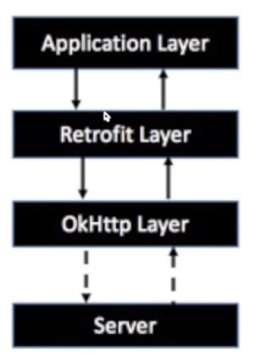
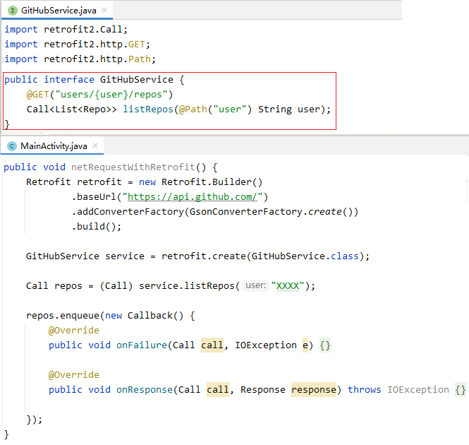
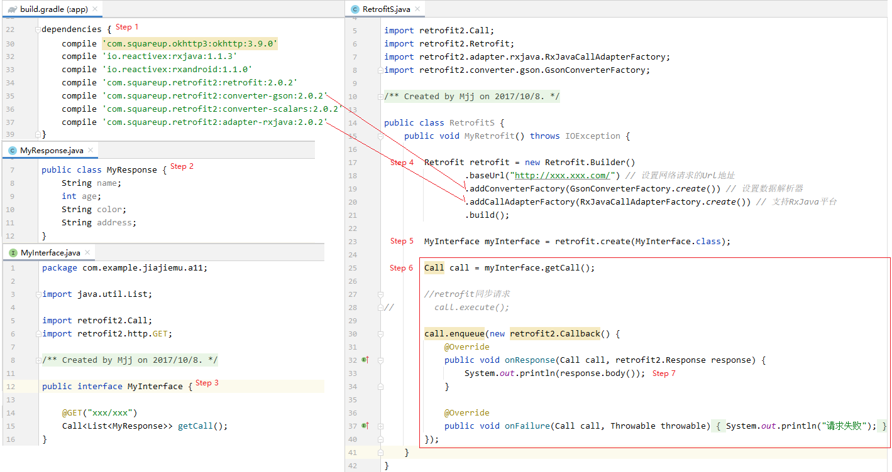
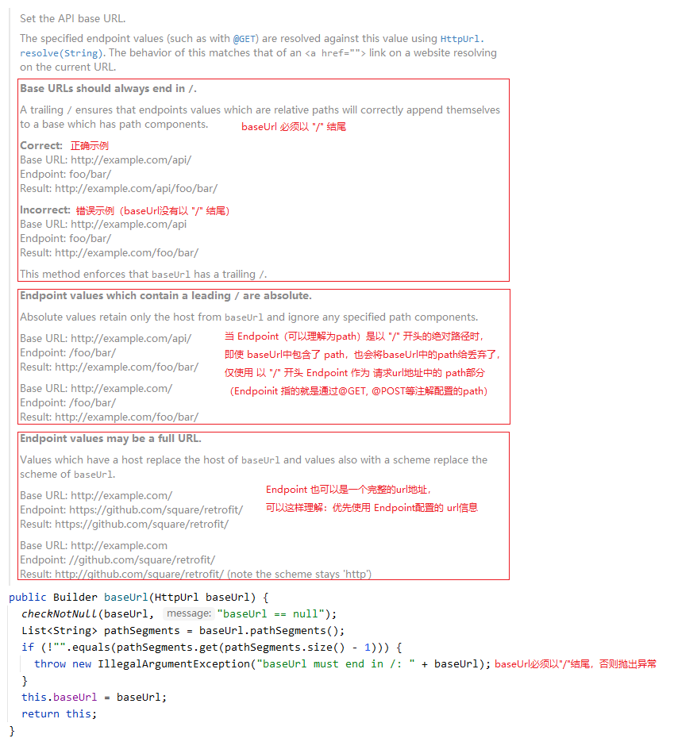
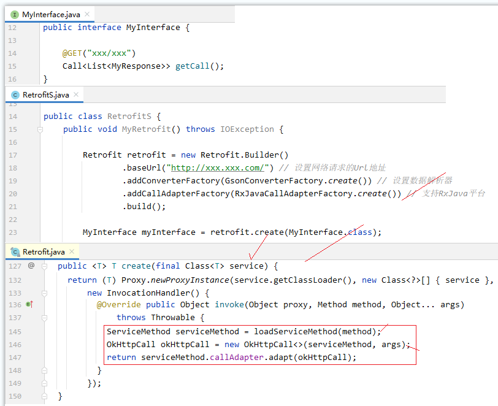

基于 `retrofit:2.0.2`

## `Retrofit` 的基本介绍

`Retrofit` 是一个 `RESTFul` 网络请求框架的封装。
> 只是一个对网络请求框架的封装，而不是一个网络请求框架。

`Retrofit 2.0` 开始内置了 `OkHttp`
> `OkHttp` 才是一个网络请求框架。也就是说，`Retrofit` 是对 `OkHttp` 的封装。

应用程序通过 `Retrofit` 请求网络，实际上是使用 `Retrofit` 接口层封装请求参数，之后由 `OkHttp` 完成后续的请求操作。

在服务端返回数据之后，`OkHttp` 将原始的结果交给 `Retrofit`，`Retrofit` 根据用户的需求对结果进行解析。



## `RESTFul` 的简单介绍

`REST` 即：`Respresentational State Transfer`。

`REST` 指的是一组架构约束条件和原则。满足这些约束条件和原则的应用程序或设计就是 `RESTFul`。

`RESTFul` 的特点包括：
1. 每一个 `URL` 代表 `1` 种资源；
2. 客户端使用 `GET`、`POST`、`PUT`、`DELETE` 这 `4` 个表示操作方式的动词对服务端资源进行操作，其中：
   1. `GET` 用来获取资源
   2. `POST` 用来新建资源（也可以用来更新资源）
   3. `PUT` 用来更新资源
   4. `DELETE` 用来删除资源
3. 通过操作资源的表现形式来操作资源；
4. 资源的表现形式是 `XML` 或 `JSON` 等；
5. 客户端与服务端之间的交互在请求之间是无状态的，从客户端到服务端的每个请求都必须包含理解请求所必需的信息。

## 如何使用 `Retrofit` 描述一个网络请求



如上图的自定义接口 `GitHubService` 所示：
1. `Retrofit` 将网络请求抽象了 `Java` 接口；
2. **一个接口方法描述一个网络请求**。在接口方法上，`Retrofit` 通过**注解**对请求参数进行描述和配置，如 `listRepos` 方法所示：
   1. 描述的请求方法为 `GET`
   2. 描述的请求地址中的 `path` 为 `users/{user}/repos`，其中占位符 `{user}` 用被注解 `@Path("user")` 修饰的方法参数 `user` 代替；
   3. 描述的响应体数据的实体类为 `List<Repo>`。

## `Retrofit` 的使用步骤

1. 添加 `Retrofit` 的依赖库；添加网络权限；
2. 创建响应体数据的实体类；
3. 自定义网络请求接口类，声明描述网络请求的接口方法；
4. 创建 `Retrofit` 实例；
5. 创建自定义网络请求接口的实例对象；
6. 发送网络请求（同步/异步）；
7. 处理服务器返回的响应体数据。



> `step3` 中的 `path` `"xxx/xxx"` 加上 `step4` 中的 `baseUrl` `"http://xxx.xxx.com/"` 构成一个完整的请求 `url` 地址 `"http://xxx.xxx.com/xxx/xxx"`。

## `Retrofit` 的配置（采用建造者模式）

`Retrofit` 采用建造者模式，通过 `Retrofit.Builder` 进行配置

```java
public static final class Builder {
    private HttpUrl baseUrl;
    private List<Converter.Factory> converterFactories = new ArrayList<>();
    private List<CallAdapter.Factory> adapterFactories = new ArrayList<>();
    private okhttp3.Call.Factory callFactory;
    private Executor callbackExecutor;

    public Builder baseUrl(String baseUrl) {...}
    public Builder baseUrl(HttpUrl baseUrl) {...}

    public Builder addConverterFactory(Converter.Factory factory) {...}

    public Builder addCallAdapterFactory(CallAdapter.Factory factory) {...}
```

其中：
1. `baseUrl` 表示请求 `url` 地址中 `path` 之前的部分，**必须以 "/" 结尾**。
    > `baseUrl` 是必须配置的。

2. `Converter.Factory` 用来生产数据转换器 `Converter`。这里转换的数据指的是 **请求体数据** 以及 **响应体数据**。
    > `Retrofit` 内置了一个默认的 `Converter.Factory` ，即 `BuiltInConverters`。但是它生产的 `Converter` 并不符合我们对 `json` 数据的转换需求。
    > 一般地，我们都会配置一个 `GsonConverterFactory` 生产出一个可以对 `json` 数据进行转换的 `Converter`。

3. `CallAdapter.Factory` 用来生产调用适配器 `CallAdapter`。这里的调用 `Call` 指的是发起网络请求。
    > 调用适配器其实就是对 `OkHttp` 中的 `Call` 的封装，调用适配器的作用就是将 `OkHttp` 通过 `Call` 发起网络请求的流程适配成符合我们要求的流程。如：
    >    1. `Retrofit` 内置的 `CallAdapter.Factory` ，即 `ExecutorCallAdapterFactory`。它生产的 `CallAdapter` 可以将网络请求的回调切换到主线程中执行。
    >    2. 如果想结合 `RxJava` 的语法发起网络请求，那么可以配置一个 `RxJavaCallAdapterFactory`。

4. `Retrofit` 默认配置的 `callFactory` 就是 `OkHttpClient` （`OkHttpClient` 实现了 `Call.Factory` 接口）。
    > 通常，不会另外配置 `callFactory`。

5. `Android` 平台中，`Retrofit` 默认配置的 `callbackExecutor` 就是 `Platform.Android.MainThreadExecutor`。
    > 默认的 `callbackExecutor` 就是将 `Runnable` 切换到 `UI` 线程中执行。
    >
    > 通常，也不需要对 `callbackExecutor` 进行配置。

### `baseUrl` 配置时的注意事项



**建议：**
1. `baseUrl` 必须以 `/` 结尾；
2. `baseUrl` 中不要带 `path`；
3. 不要将 `path` 配置成完整的 `url` 地址；
4. `path` 不要以 `/` 开头

### `GsonConverterFactory`

`Converter.Factory` 的作用就是生产 `Converter`，而 `Converter` 提供 `convert` 方法，用于将一种类型转换成另一种类型。

```java
public interface Converter<F, T> {
    /*
        将类型 F 转换成类型 T
    */
    T convert(F value) throws IOException;
}
```

**注意：** 使用 `GsonConverterFactory` 需要添加依赖 `com.squareup.retrofit2:converter-gson:2.0.2`。

`GsonConverterFactory` 生产了两个转换器 `Converter`：
1. `GsonRequestBodyConverter` 
   
    用于将请求体数据的实体类 `T` 对象转换成 `json` 数据，并封装在 `RequestBody` 中返回。
    > 实体类 `T` 的对象是通过自定义接口类中接口方法的参数传进来的。

    ```java
    /* GsonRequestBodyConverter.java */

    private static final MediaType MEDIA_TYPE = MediaType.parse("application/json; charset=UTF-8");

    @Override 
    public RequestBody convert(T value) throws IOException {
        Buffer buffer = new Buffer();
        Writer writer = new OutputStreamWriter(buffer.outputStream(), UTF_8);
        JsonWriter jsonWriter = gson.newJsonWriter(writer);
        adapter.write(jsonWriter, value);
        jsonWriter.close();
        return RequestBody.create(MEDIA_TYPE, buffer.readByteString());
    }
    ```

2. `GsonResponseBodyConverter`
   
    用于将 `json` 类型的响应体数据转换成实体类 `T` 对象。
    > 实体类 `T` 的就是自定义接口类中接口方法的返回值 `Call<T>` 中的泛型 `T`。

    ```java
    /* Converter.java */
    @Override 
    public T convert(ResponseBody value) throws IOException {
        JsonReader jsonReader = gson.newJsonReader(value.charStream());
        try {
            return adapter.read(jsonReader);
        } finally {
            value.close();
        }
    }
    ```

### 内置的 `ExecutorCallAdapterFactory`

`CallAdapter.Factory` 的作用就是生产 `CallAdapter`。而 `CallAdapter` 提供 `adapter` 方法，用于对发起网络请求的 `Call` 进行封装，使网络请求的流程适配我们的需求，返回一个适配后的封装类。

```java
/* CallAdapter.java */
public interface CallAdapter<T> {
    /*
        参数 call 其实就是 retrofit2.OkHttpCall 的实例对象，封装了 okhttp3.Call

        泛型 T 表示适配后的封装了参数 call 的封装类
        泛型 R 表示响应体数据的实体类
    */
    <R> T adapt(Call<R> call);

    /*
        返回值 Type 表示响应体数据的实体类的类型，即 adapter 方法中声明的泛型 R 的具体类型
    */
    Type responseType();
}
```

`ExecutorCallAdapterFactory` 生产的 `CallAdapter` 的 `adapter` 方法返回 `ExecutorCallbackCall` 的实例对象，在 `Android` 平台上， **`ExecutorCallbackCall` 的作用就是切换到主线程**。

```java
@Override
public CallAdapter<Call<?>> get(Type returnType, Annotation[] annotations, Retrofit retrofit) {
    ...
    return new CallAdapter<Call<?>>() {
        @Override 
        public <R> Call<R> adapt(Call<R> call) {
            return new ExecutorCallbackCall<>(callbackExecutor, call);
        }
    };
}

static final class ExecutorCallbackCall<T> implements Call<T> {
    ExecutorCallbackCall(Executor callbackExecutor, Call<T> delegate) {
        this.callbackExecutor = callbackExecutor;
        this.delegate = delegate;
    }

    @Override 
    public void enqueue(final Callback<T> callback) {
        // delegate 就是 OkHttpCall
        delegate.enqueue(new Callback<T>() {
            public void onResponse(Call<T> call, final Response<T> response) {
                // callbackExecutor 就是 Platform.Android.MainThreadExecutor，它将 Runnable.run 方法切换到主线程执行
                callbackExecutor.execute(new Runnable() {
                    public void run() {
                        if (delegate.isCanceled()) {
                            callback.onFailure(...);
                        } else {
                            // onResponse 回调方法在主线程中执行
                            callback.onResponse(ExecutorCallbackCall.this, response);
                        }
                    }
                });
            }
            ...
        });
    }
}
```

### `RxJavaCallAdapterFactory`

注意：需要添加依赖 `com.squareup.retrofit2:adapter-rxjava:2.0.2`


## `Retrofit` 源码分析

### 自定义接口的实例化及接口方法的调用



`Retrofit` 中是采用动态代理模式来实例化自定义接口的。调用 `Retrofit.create` 方法返回自定义接口的动态代理对象，并通过动态代理对象来调用接口方法。

通过动态代理模式，调用接口方法 `MyInterface.getCall` ，就会执行 `InvocationHandler.invoke` 方法。其中主要做了三件事：
1. 调用 `loadServiceMethod` 方法解析接口方法上的注解，获取描述网络请求的相关信息
2. 创建 用于发起网络请求的 `OkHttpCall` 对象（`OkHttpCall` 中封装了 `okhttp3.Call`）。
3. 调用 `CallAdapter.adapter` 方法，返回一个持有 `OkHttpCall` 对象的引用的封装类。
    > 从这里可以看出，接口方法 `MyInterface.getCall` 方法返回值其实就是 `CallAdapter.adapter` 方法的返回值。通过接口方法的返回值来发起网络请求。

#### 解析接口方法上的注解，获取描述网络请求的信息

```java
/* Retrofit.java */
ServiceMethod loadServiceMethod(Method method) {
    ServiceMethod result;
    synchronized (serviceMethodCache) {
        result = serviceMethodCache.get(method);
        if (result == null) {
            /*
                1. 通过参数 method 可以拿到修饰接口方法的注解对象
                2. 执行 ServiceMethod.Builder.build() 方法解析注解，并将解析出的网络请求信息保存在 ServiceMethod 对象中
                3. serviceMethodCache 用于缓存已解析过的接口方法，提高效率
            */
            result = new ServiceMethod.Builder(this, method).build();
            serviceMethodCache.put(method, result);
        }
    }
    return result;
}
```

```sequence
participant SMB as ServiceMethod.Builder
participant M as Method
participant R as Retrofit

SMB ->> SMB : new Builder(retrofit, method)
activate SMB 
    Note over SMB,M : 获取修饰接口方法的注解
    SMB ->> M : getAnnotations()
    M -->> SMB : methodAnnotations

    Note over SMB,M : 获取接口方法的形参列表
    SMB ->> M : getGenericParameterTypes()
    M -->> SMB : parameterTypes

    Note over SMB,M : 获取修饰接口方法的形参的注解
    SMB ->> M : getParameterAnnotations()
    M -->> SMB : parameterAnnotationsArray
deactivate SMB 

SMB ->> SMB : build()
activate SMB
    Note over SMB,R : returnType 是接口方法的返回值类型，annotations 是所有修饰接口方法的注解
    SMB ->> R : callAdapter(returnType, annotations)
    R -->> SMB : callAdapter
    Note over SMB,R : responseType 是 callAdapter.responseType() 方法返回的响应体数据的实体类型
    SMB ->> R : responseBodyConverter(responseType, annotaions)
    R -->> SMB : responseConverter

    Note over SMB : methodAnnotations 是所有修饰接口方法的注解
    loop  annotation in methodAnnotations
        SMB ->> SMB : parseMethodAnnotation(annotation)
    end

    loop p in 0..parameterCount-1
        Note over SMB : p 是当前形参在形参列表中的索引，
        Note over SMB : parameterType 是当前形参的类型
        Note over SMB : parameterAnnotations 是所有修饰当前形参的注解
        SMB ->> SMB : parseParameter(p, parameterType, parameterAnnotations)
    end
deactivate SMB
```

调用 `Retrofit.loadServiceMethod` 方法主要是做两件事：
1. 通过 `ServiceMethod.parseMethodAnnotation` 方法解析所有修饰在接口方法上的注解，获取相关的网络请求信息，这些信息包括：
   1. `Http` 请求方法，以及请求 `url` 地址中的 `path` 部分，相关注解：`@GET`、`@POST`、`@PUT`、`@DELETE`、`@HTTP` 等。
        > `path` 作为注解中的参数进行设置。
   2. 请求头信息，相关注解：`@Headers`
   3. `@Multipart`
   4. `@FormUrlEncoded`

2. 通过 `ServiceMethod.parseParameter` 方法解析所有修饰在接口方法的形参的注解，获取相关的网络请求信息，这些信息包括：
   1. `@Url`
   2. `@Path`
   3. `@Query`
   4. `@QueryMap`
   5. `@Header`
   6. `@Field`
   7. `@FieldMap`
   8. `@Part`
   9. `@PartMap`
   10. `@Body`


### 通过接口方法返回的 `Call` 发起网络请求

假设使用 `Retrofit` 内置的 `ExecutorCallAdapterFactory`，那么接口方法返回的接口 `Call` 的实现类对象就是 `ExecutorCallAdapterFactory.ExecutorCallbackCall` 对象。

以通过 `ExecutorCallbackCall` 发起异步请求为例，分析其流程：

```sequence
participant  ECC as ExecutorCallbackCall
participant  OC as OkHttpCall
participant  C as okhttp3.Call
participant  SM as ServiceMethod

ECC ->> ECC : enqueue(callback1)
ECC ->> OC : enqueue(callback2)
activate OC 
    OC ->> OC : createRawCall()
    activate OC
        Note over OC,SM : 将 ServiceMethod 中的网络请求信息封装在 okhttp3.Request 中返回
        OC ->> SM : toRequest(args)
        SM -->> OC : return request
        Note over OC,SM : callFactory 是 OkHttpClient 对象，调用 OkHttpClient.newCall 方法返回 okhttp3.Call
        OC ->> SM : callFactory.newCall(request)
        SM -->> OC : return call
    deactivate OC
    OC ->> C : call.enqueue(callback3)
    C ->> OC : callback3.onResponse(call, rawResponse)
    activate OC
        OC ->> OC : response = parseResponse(rawResponse)
        activate OC
            OC ->> SM : toResponse(rawBody)
            SM ->> SM : responseConverter.convert(rawBody)
            Note over SM,OC : body 的类型就是响应体数据的实体类型
            SM -->> OC : return body
            OC ->> OC : response = retrofit2.Response.success(body, rawResponse)
        deactivate OC
        OC ->> ECC : callback2.onResponse(okhttpCall, response)
    deactivate OC
deactivate OC 
ECC ->> ECC : 切换到主线程
Note over ECC : 调用 response.body() 即可获取响应体数据的实体类对象
ECC ->> ECC : callback1.onResponse(executorCallbackCall, response)
```