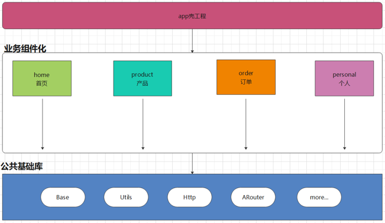
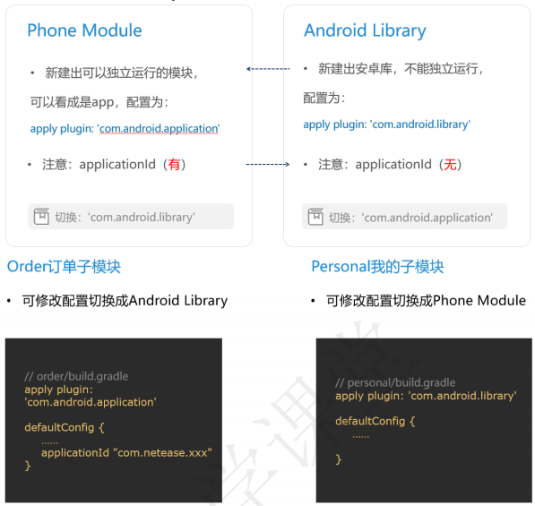
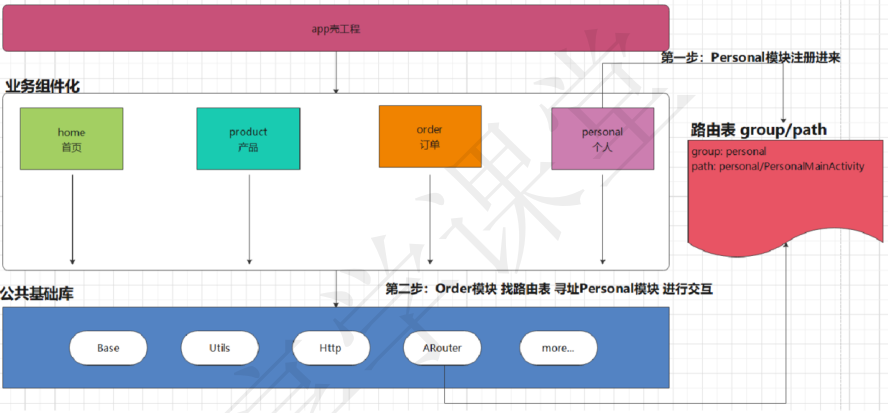
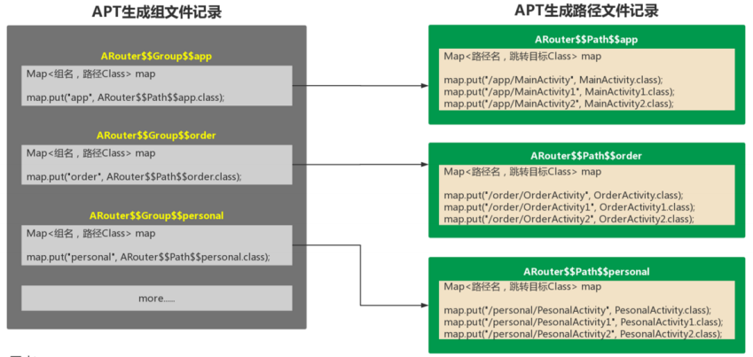
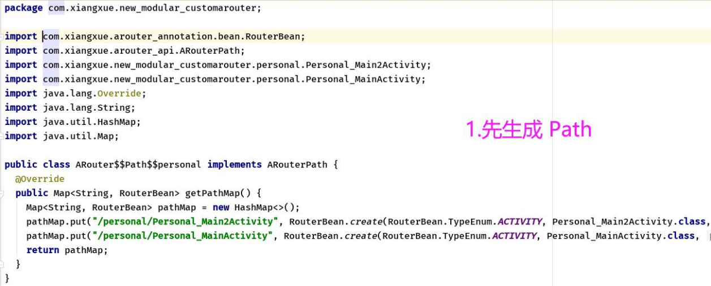
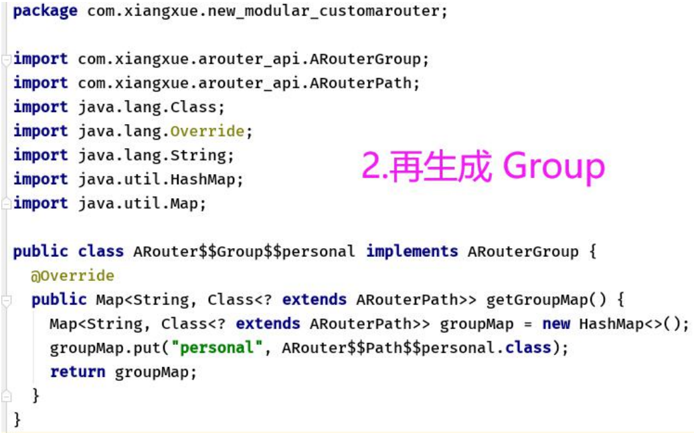

> 参考：`享学安卓二期(3)\资料\【06】开源框架\（01）2020.11.12 组件化1---derry老师\预习资料\20.11.12-组件化-预习资料.pdf`
> 
> 参考：`享学安卓二期(3)\资料\【06】开源框架\（01）2020.11.12 组件化1---derry老师\组件化第一节课.pptx`
> 
> 参考：`享学安卓二期(3)\资料\【06】开源框架\（02）2020.11.15 组件化2---derry老师\20.11.15 资料&代码\组件化第二节课-.pdf`
> 
> 参考：`享学安卓二期(3)\资料\【06】开源框架\（03）2020.11.17 组件化3---derry老师\20.11.17 资料&代码\组件化第三节课-.pdf`
> 
> 参考：`享学安卓二期(3)\资料\【06】开源框架\（04）2020.11.19 组件化4---derry老师\20.11.19 资料&代码\组件化第四节课-.pdf`
> 
> 参考：`享学安卓二期(3)\资料\【06】开源框架\（05）2020.11.22 组件化5---derry老师\PPT与MD文档\组件化第五节课-.pptx`
> 
> 参考：`笔记\Android教程\动脑学院-移动架构\11组件化框架`
> 
> 参考：[ARouter](https://github.com/alibaba/ARouter)

## 1. 早期的单一分层模式

所有的代码都写在 `app` 模块中不同的包里面：


随着项目的迭代更新，会出现如下问题：

1. 问题一：无论分包怎么做，随着项目增大，项目失去层次感，后面接手的人难以维护

2. 问题二：包名约束太弱，稍有不注意，就会不同业务包直接互相调用，代码高耦合

3. 问题三：多人开发在版本管理中，容易出现代码覆盖冲突等问题

简单地说，单一分层模式存在低内聚、高耦合 、无重用、层次混乱的问题。

## 2. 组件化

组件化的意义：不相互依赖，可以相互交互，任意组合，高度解耦，自由拆卸，自由组装，重复利用，分层独立化



组件化后，`app` 模块不在是老大，子模块也都不在是小弟。

即：组件化后，所有的 `module` 都平起平坐。有人说 `app` 的 `module` 在组件化中是个壳子，这也是为什么成为 `app` 壳工程的原因。

### 2.1 组件化的开发规范

1. 我们在项目的开发过程中，一定要去优化我们的 `gradle` 文件，例如：把公用的内容抽取

2. 我们在项目的开发过程中，关于一切与 “正式环境”，“测试环境” 相关的内容，应该用 `gradle` 进行配置

### 2.2 `Phone Module` 和 `Android Library` 区别、切换



### 2.3 组件化开发的临时代码，集成化打包时动态隔离

```groovy:no-line-numbers
// 配置资源路径，方便测试环境，打包不集成到正式环境
sourceSets { 
    main {
        if (!isRelease) { 
            // 如果是组件化模式，需要单独运行时 
            manifest.srcFile 'src/main/debug/AndroidManifest.xml' 
        } else { 
            // 集成化模式，整个项目打包apk 
            manifest.srcFile 'src/main/AndroidManifest.xml' 
            java {
                // release 时 debug 目录下文件不需要合并到主工程 
                exclude '**/debug/**' 
            } 
        } 
    } 
}

/* 
    注意事项: 
        1. src/main/debug/AndroidManifest.xml 
        2. 子模块包名/debug/测试代码.java
*/
```

### 2.4 组件化开发中的 `Gradle` 配置示例

公共的 `gradle` 文件（`derry.gradle`）：

```groovy:no-line-numbers
/* derry.gradle */

ext {
    // 正式环境 和 测试环境 
    isRelease = true 
    
    // 正式环境 和 测试环境 URL 配置 
    url = [ 
        "debug" : "https://192.188.22.99/debug", 
        "release": "https://192.188.22.99/release" 
    ]
    
    // 建立Map存储， key 和 value 都是自定义的 
    androidID = [ 
        compileSdkVersion: 30, 
        buildToolsVersion: "30.0.1", 
        
        applicationId : "com.derry.derry", 
        minSdkVersion : 16, 
        targetSdkVersion : 30, 
        versionCode : 1, 
        versionName : "1.0", 
    ]
    
    // 建立Map存储， key 和 value 都是自定义的 
    appID = [
        app: "com.derry.derry", 
        login: "com.derry.login", 
        register: "com.derry.register" 
    ]
        
    // 300 
    // 300 行 MAP key value 
    dependenciesID = [ 
        "appcompat" :       "androidx.appcompat:appcompat:1.2.0", 
        "constraintlayout": "androidx.constraintlayout:constraintlayout:2.0.1",
        "material" :        "com.google.android.material:material:1.1.0", 
        "vectordrawable" :  "androidx.vectordrawable:vectordrawable:1.1.0", 
        "fragment" :        "androidx.navigation:navigation-fragment:2.2.2", 
        "ui" :              "androidx.navigation:navigation-ui:2.2.2", 
        "extensions" :      "androidx.lifecycle:lifecycle-extensions:2.2.0", 
    ] 
}
```

根目录下的项目 `build.gradle`：

```groovy:no-line-numbers
// 根目录下的build.gradle 引入公共的 gradle 配置文件
apply from : 'derry.gradle'
```

`app` 模块的 `build.gradle`：

```groovy:no-line-numbers
apply plugin: 'com.android.application' 

println("Derry ---> app Student hao 1") 
println "Derry ---> app Student hao 2" 

// 完整的方式 
def androidID = rootProject.ext.androidID 

android { 
    compileSdkVersion androidID.compileSdkVersion 
    buildToolsVersion androidID.buildToolsVersion 
    
    defaultConfig { 
        applicationId appID.app 
        minSdkVersion androidID.minSdkVersion 
        targetSdkVersion androidID.targetSdkVersion 
        versionCode androidID.versionCode 
        versionName androidID.versionName 
        
        testInstrumentationRunner "androidx.test.runner.AndroidJUnitRunner" 
        
        // 给Java代码暴漏，标记，正式环境 和 测试环境 的标记 
        // 组件化 和 集成化 的时候需要 
        buildConfigField("boolean", "isRelease", String.valueOf(isRelease)) 
    }
    
    buildTypes { 
        debug { 
            buildConfigField("String", "debug", "\"${url.debug}\"") 
        }
        release { 
            buildConfigField("String", "release", "\"${url.release}\"") 
            
            minifyEnabled false 
            proguardFiles getDefaultProguardFile('proguard-android- optimize.txt'), 'proguard-rules.pro' 
        } 
    } 
}

dependencies { 
    implementation fileTree(dir: "libs", include: ["*.jar"])

    // 300行 
    /**
     * implementation "androidx.appcompat:appcompat:1.2.0" 
     * implementation "androidx.constraintlayout:constraintlayout:2.0.1" 
     * implementation "com.google.android.material:material:1.1.0" 
     * implementation "androidx.vectordrawable:vectordrawable:1.1.0" 
     * implementation "androidx.navigation:navigation-fragment:2.2.2" 
     * implementation "androidx.navigation:navigation-ui:2.2.2" 
     * implementation "androidx.lifecycle:lifecycle-extensions:2.2.0"
     */
    // 一行搞定 300 行 
    dependenciesID.each { k, v -> implementation v }

    testImplementation 'junit:junit:4.12' 
    androidTestImplementation 'androidx.test.ext:junit:1.1.2' 
    androidTestImplementation 'androidx.test.espresso:espresso-core:3.3.0' 
    
    // 如果是集成化模式，做发布版本时。各个模块都不能独立运行了 
    if (isRelease) { 
        // 依附App壳 
        implementation project(':login') 
        implementation project(':register') 
    } else { 
        // 不需要做事情，组件环境，不需要依附App壳 
    } 
}
```

组件模块 `register` 的 `build.gradle`：

```groovy:no-line-numbers
// apply plugin: 'com.android.application' 
if (isRelease) { 
    // 如果是发布版本时，各个模块都不能独立运行 
    apply plugin: 'com.android.library' // 不能独立运行 
} else { 
    apply plugin: 'com.android.application' // 能够独立运行 
}

android { 
    compileSdkVersion 30 
    buildToolsVersion "30.0.1" 
    
    defaultConfig { 
        if (!isRelease) { // 如果是集成化模式，不能有applicationId 
            applicationId appID.register // 组件化模式能独立运行才能有applicationId 
        }
        minSdkVersion 16 
        targetSdkVersion 30 
        versionCode 1
        versionName "1.0" 
         
        testInstrumentationRunner "androidx.test.runner.AndroidJUnitRunner" 
    }
    
    buildTypes { 
        release { 
            minifyEnabled false 
            proguardFiles getDefaultProguardFile('proguard-android- optimize.txt'), 'proguard-rules.pro' 
        } 
    } 
}

dependencies { 
    implementation fileTree(dir: "libs", include: ["*.jar"]) 
    implementation 'androidx.appcompat:appcompat:1.2.0' 
    implementation 'androidx.constraintlayout:constraintlayout:2.0.2' 
    testImplementation 'junit:junit:4.12' 
    androidTestImplementation 'androidx.test.ext:junit:1.1.2' 
    androidTestImplementation 'androidx.test.espresso:espresso-core:3.3.0' 
}
```

组件模块 `login` 的 `build.gradle`：

```groovy:no-line-numbers
// apply plugin: 'com.android.application' 
if (isRelease) { // 如果是发布版本时，各个模块都不能独立运行 
    apply plugin: 'com.android.library' // 不能独立运行 
} else { 
    apply plugin: 'com.android.application' // 能够独立运行 
}

android { 
    compileSdkVersion 30 
    buildToolsVersion "30.0.1" 
    
    defaultConfig { 
        if (!isRelease) { // 如果是集成化模式，不能有applicationId 
            applicationId appID.login // 组件化模式能独立运行才能有applicationId 
        }
        minSdkVersion 16 
        targetSdkVersion 30 
        versionCode 1 
        versionName "1.0" 
        
        testInstrumentationRunner "androidx.test.runner.AndroidJUnitRunner" 
    }
    
    buildTypes { 
        release { 
            minifyEnabled false 
            proguardFiles getDefaultProguardFile('proguard-android- optimize.txt'), 'proguard-rules.pro' 
        } 
    }
    
    // 配置资源路径，方便测试环境，打包不集成到正式环境 
    sourceSets { 
        main {
            if (!isRelease) { 
                // 如果是组件化模式，需要单独运行时 
                manifest.srcFile 'src/main/debug/AndroidManifest.xml' 
            } else { 
                // 集成化模式，整个项目打包apk 
                manifest.srcFile 'src/main/AndroidManifest.xml' 
                java {
                    // release 时 debug 目录下文件不需要合并到主工程 
                    exclude '**/debug/**' 
                } 
            } 
        } 
    } 
}

dependencies { 
    implementation fileTree(dir: "libs", include: ["*.jar"]) 
    implementation 'androidx.appcompat:appcompat:1.2.0' 
    implementation 'androidx.constraintlayout:constraintlayout:2.0.2' 
    testImplementation 'junit:junit:4.12' 
    androidTestImplementation 'androidx.test.ext:junit:1.1.2'
    androidTestImplementation 'androidx.test.espresso:espresso-core:3.3.0' 
}
```

### 2.5 组件化中子模块之间的交互方式

#### 2.5.1 非 `ARouter` 版的方式

##### 2.5.1.1 使用 `EventBus` 的方式

缺点：`EventBean` 维护成本太高，不好去管理

##### 2.5.1.2 使用广播的方式

缺点：不好管理，都统一发出去了

##### 2.5.1.3 使用隐式意图的方式

缺点：在 `AndroidManifest.xml` 里面配置 `xml` 写的太多了

##### 2.5.1.4 使用类加载方式

缺点：容易写错包名类名

```java:no-line-numbers
// 类加载跳转，可以成功。维护成本较高且容易出现人为失误
try {
    Class targetClass = Class.forName("com.xxx.order.OrderMainActivity");
    Intent intent = new Intent(this, targetClass);
    intent.putExtra("params", "simon");
    startActivity(intent);
} catch (ClassNotFountException e) {
    e.printStackTrace();
}
```

##### 2.5.1.5 使用全局 `Map` 的方式

缺点：要注册很多的对象

示例：

```java:no-line-numbers
/**
 * 路径对象（公共基础库中，所有子模块都可以调用） 
 * 如： 
 * path : "order/Order_MainActivity"
 * clazz : Order_MainActivity.class 
 */ 
public class PathBean { 
    private String path; // person/Person_MainActivity 
    private Class clazz; // Person_MainActivity.class 
    
    public PathBean() {}
    
    public PathBean(String path, Class clazz) { 
        this.path = path; 
        this.clazz = clazz; 
    }
    
    public String getPath() { return path; }
    
    public void setPath(String path) { this.path = path; }
    
    public Class getClazz() { return clazz; }
    
    public void setClazz(Class clazz) { this.clazz = clazz; } 
}
```

```java:no-line-numbers
/**
 * 全局路径记录器（根据子模块进行分组） 
 * 组名：order，personal 
 * order=[{Order_MainActivity}, {Order_MainActivity2}, {Order_MainActivity3}] 
 */ 
public class RecordPathManager { 

    /**
     * 先理解成 仓库 
     * group: app,order,personal 
     *
     * order: 
     *     OrderMainActivity1
     *     OrderMainActivity2 
     *     OrderMainActivity3 
     */ 
    private static Map<String, List<PathBean>> maps = new HashMap<>(); 
    
    /**
     * 将路径信息加入全局Map 
     *
     * @param groupName 组名，如："personal" 
     * @param pathName 路劲名，如："Personal_MainActivity" 
     * @param clazz 类对象，如：Personal_MainActivity.class 
     */ 
    public static void addGroupInfo(String groupName, String pathName, Class<?> clazz) {
        List<PathBean> list = maps.get(groupName); 
        
        if (null == list) { 
            list = new ArrayList<>(); 
            list.add(new PathBean(pathName, clazz)); 
            // 存入仓库 
            maps.put(groupName, list); 
        } else { 
            // 存入仓库 
            maps.put(groupName, list); 
        }
        maps.put(groupName, list); 
    }
    
    /**
     * 只需要告诉我，组名 ，路径名， 就能返回 "要跳转的Class" 
     * @param groupName 组名 
     * @param pathName 路径名 
     * @return 跳转目标的class类对象 
     */ 
    public static Class<?> startTargetActivity(String groupName, String pathName) { 
        List<PathBean> list = maps.get(groupName); 
        if (list == null) { 
            Log.d(Config.TAG, "startTargetActivity 此组名得到的信息，并没有注册进来 哦..."); 
            return null; 
        }
        // 遍历 寻找 去匹配 "PathBean" 对象 
        for (PathBean pathBean : list) { 
            if (pathName.equalsIgnoreCase(pathBean.getPath())) { 
                return pathBean.getClazz(); 
            } 
        }
        return null; 
    }
    
    /**
     * 清理、回收 
     */ 
    public static void recycleGroup() { 
        maps.clear(); 
        maps = null; 
        System.gc();
    }
}
```

```java:no-line-numbers
Class<?> targetActivity = RecordPathManager.startTargetActivity("personal", "Personal_MainActivity"); 
startActivity(new Intent(this, targetActivity));
```

#### 2.5.2 `ARouter` 实现子模块之间的交互 

##### 2.5.2.1 `APT` 是什么

`APT`（`Annotation Processing Tool`）是一种处理注释的工具，它对源代码文件进行检测找出其中的 `Annotation`，根据注解自动生成代码，如果想要自定义的注解处理器能够正常运行，必须要通过 `APT` 工具来进行处理。 也可以这样理解，只有通过声明 `APT` 工具后，程序在编译期间自定义注解解释器才能执行。

通俗理解：根据规则，帮我们生成代码、生成类文件。

##### 2.5.2.2 `Java` 代码的程序结构 & `APT` 相关的类

```java:no-line-numbers
/** 
 * 对于 java 源文件来说，可以将其中的程序结构当成 HTML 那种结构体语言看待
 */
package com.netease.apt; // PackageElement 包元素/节点 

public class Main{ // TypeElement 类元素/节点 

    private int x; // VariableElement 属性元素/节点 
    
    private Main(){ // ExecuteableElement 方法元素/节点 
    }
    
    private void print(String msg){} 
}
```

`APT` 提供了如下几个类分别表示不同的程序结构：

```:no-line-numbers
PackageElement：表示一个包程序元素。提供对有关包及其成员的信息的访问 

ExecutableElement：表示某个类或接口的方法、构造方法或初始化程序（静态或实例）

TypeElement：表示一个类或接口程序元素。提供对有关类型及其成员的信息的访问 

VariableElement：表示一个字段、enum 常量、方法或构造方法参数、局部变量或异常参数
```

`APT` 中常用的方法：

```:no-line-numbers
getEnclosedElements()：返回该元素直接包含的子元素 

getEnclosingElement()：返回包含该 element 的父 element，与上一个方法相反 

getKind()：返回 element 的类型，判断是哪种 element 

getModifiers()：获取修饰关键字,如 public static final 等关键字 

getSimpleName()：获取名字，不带包名 

getQualifiedName()：获取全名，如果是类的话，包含完整的包名路径 

getParameters()：获取方法的参数元素，每个元素是一个 VariableElement 

getReturnType()：获取方法元素的返回值 

getConstantValue()：如果属性变量被 final 修饰，则可以使用该方法获取它的值
```

##### 2.5.2.3 `JavaPoet`

[JavaPoet](https://github.com/square/javapoet) 是 `square` 推出的开源 **`java` 代码生成框架**。

提供 `Java Api` 生成 `.java` 源文件 这个框架功能非常实用，也是我们习惯的 `Java` 面向对象（`OOP`）语法。可以很方便的使用它根据注解生成对应代码。

通过这种自动化生成代码的方式，可以让我们用更加简洁优雅的方式要替代繁琐冗杂的重复工作。

> `JavaPoet` 也是一种 `APT` 技术，只不过 `JavaPoet` 中采用了面向对象（`oop`）的思想来生成 `Java` 代码。

`JavaPoet` 相关的 `API`

|API|说明|
|:-|:-|
|`MethodSpec`|代表一个构造函数或方法声明|
|`TypeSpec`|代表一个类，接口，或者枚举声明|
|`FieldSpec`|代表一个成员变量，一个字段声明|
|`JavaFile`|包含一个顶级类的Java文件|
|`ParameterSpec`|用来创建参数|
|`AnnotationSpec`|用来创建注解|
|`ClassName`|用来包装一个类|
|`TypeName`|类型，如在添加返回值类型是使用 `TypeName.VOID`|
|`$S`|字符串，如：``$S`, "hello"`|
|`$T`|类、接口，如：`$T, MainActivity`|

##### 2.5.2.4 `ARouter` 原理：路由表





###### 2.5.2.4.1 `Path` 与 `Group` 的映射关系

以 `personal` 子模块为例来讲解。

1. 先生成 `Path`

    

2. 再生成 `Group`

    

   


