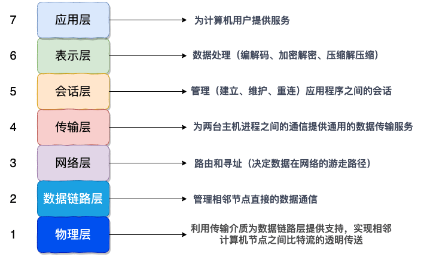
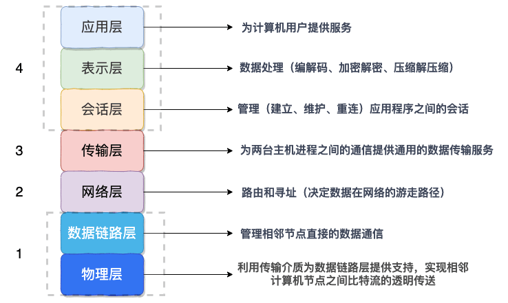
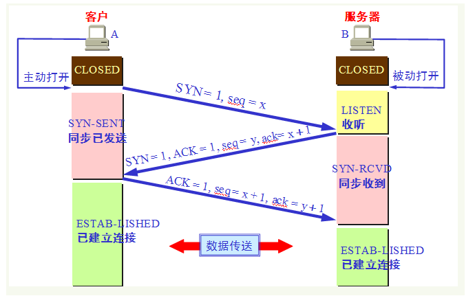
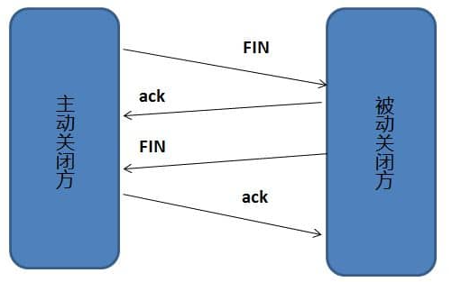
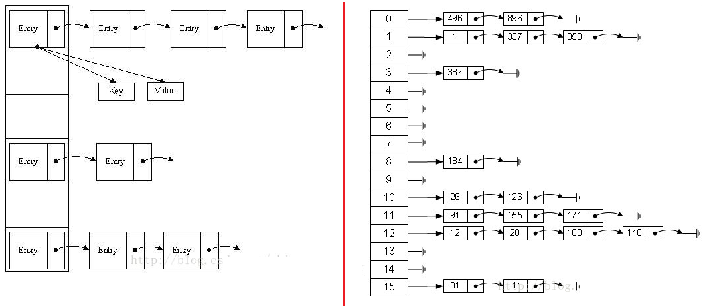

## 1. `JNI` 和 `NDK` 开发

`JNI` 是为 `Java` 代码与 `C/C++` 代码进行交互所提供的一套接口 `API`。

`NDK` 是 `Android` 系统提供的用于 `JNI` 开发的工具包。

### 1.1 `JNI` 和 `NDK` 的开发流程

**`JNI` 的开发流程：**

1. 在 `Java` 类中声明 `native` 方法

2. 先编译 `Java` 类的 `.java` 文件生成 `.class` 文件，再通过 `javah` 命令根据 `.class` 文件导出该 `Java` 类对应的 `JNI` 头文件（`.h` 文件）

    > `.h` 头文件中的声明函数对应 `Java` 类中的 `Native` 方法。
    >
    > 且头文件中函数名的命名规则为：`Java_包名_类名_方法名`

    ```:no-line-numbers
    头文件中声明的函数原型的形参列表中，前两个形参类型分别为：
    
    1. JNIEnv* ：表示一个指向 JNI 环境的指针，通过该指针可以调用 JNI 提供的接口方法
                 JNIEnv 的主要作用有两点：1. 调用 Java 类中的成员方法；2. 访问 Java 类中的成员变量
                 注意：JNIEnv 只在创建它的线程中有效，不能跨线程传递。

    2. jobject ：表示该函数所对应的 native 方法所在的 Java 类的对象，
                 即通过 jobject 表示的 Java 对象调用了 native 方法，从而执行了头文件中声明的这个函数。
    ```

3. 实现 `JNI` 函数

    > 即根据步骤 `3` 中生成的 `.h` 头文件中声明的函数原型进行函数定义，编写函数体代码。
    > 
    > 这里既可以选择用 `C` 实现 `JNI` 函数，也可以选择用 `C++` 实现 `JNI` 函数。
    >
    > 若用 `C` 实现，则新建一个 `.c` 文件实现 `JNI` 函数
    >
    > 若用 `C++` 实现，则新建一个 `.cpp` 文件实现 `JNI` 函数

4. 将 `.h` 头文件和 `.c`（或 `.cpp`）源文件编译成 `so` 库（如 `libname.so`）

    > 可以通过 `gcc` 编译；也可以通过 `NDK` 进行编译。

5. 将步骤 `4` 中生成的 `so` 库放到 `Android` 项目的 `app/src/main/jniLibs/` 目录中

    > 注意：`src/main/jniLibs/` 目录是 `AndroidStudio` 默认识别的目录。
    >
    > 可以通过在 `build.gradle` 中配置 `jniLibs.srcDir` 指定其他的目录来存放 `so` 库

    ```groovy:no-line-numbers
    android {
        ...
        sourceSets.main {
            jniLibs.srcDir 'src/main/jni_libs' // 修改 so 库的存放目录为 src/main/jni_libs/
        }
    }
    ```

6. 在声明了 `native` 方法的 `Java` 类的静态代码块中调用 `System.loadLibrary("name")` 方法加载步骤 `4` 中编译出来的动态库 `libname.so`

    > 注意：`System.loadLibrary("name")` 中传入的 `libname.so` 库名称不需要加前缀 "`lib`" 和后缀 "`.so`"

**NDK 的开发流程**

使用 `NDK` 进行开发可以省去编译生成 `so` 库的步骤，`AndroidStudio` 会根据我们通过 `NDK` 所实现的相关配置自动编译生成 `so` 库。

> 即使用 `NDK` 可以省去 `JNI` 开发流程中的步骤 `4` 和步骤 `5`，
> 
> 但另外也多了些其他的配置文件。

使用 `NDK` 进行开发时，可以使用 `Makefile` 进行配置，也可以使用 `CMake` 进行配置（现在推荐使用 `CMake` 配置了），还可以直接在 `build.gradle` 中进行配置

使用 `Makefile` 进行配置时，需要创建 `Android.mk` 和 `Application.mk` 这两个配置文件，其中：

```:no-line-numbers
在 Android.mk 文件中可以配置编译 so 库时所需要的源文件，以及生成的 so 库的名称等信息。

在 Application.mk 文件中可以配置编译出来的 so 库所支持的 CPU 平台架构类型（如 armeabi、x86 等架构）
```

使用 `CMake` 进行配置时，需要创建 `CMakeLists.txt` 配置文件

```:no-line-numbers
在 CMakeLists.txt 文件中，可以配置编译 so 库时所需要的源文件，以及生成的 so 库的名称等信息

即 CMakeLists.txt 文件的作用就相当于 Android.mk 文件
```

使用 `build.gradle` 进行配置时：

1. 在 `defaultConfig` 代码块中添加 `ndk` 代码块，并通过 `moduleName` 属性配置 `so` 库的名称

    ```groovy:no-line-numbers
    android {
        ...
        defaultConfig {
            ...
            ndk {
                moduleName "name" // 生成的 so 库名为 libname.so
            }
        }
    }
    ```

2. 将编译 `so` 库所需要的 `.h` 头文件和 `.c`（或 `.cpp`）源文件放到 `app/src/main/jni/` 目录下

    > 也可以在 `build.gradle` 中通过 `jni.srcDirs` 属性修改 `C/C++` 源码的存放路径

    ```groovy:no-line-numbers
    android {
        ...
        sourceSets.main {
            jni.srcDirs 'src/main/jni_src' // 指定存放 C/C++ 源码的目录为 app/src/main/jni_src
        }
    }
    ```

3. 默认情况下，`Gradle` 会将适配所有 `CPU` 平台架构的 `so` 库都打包到 `apk` 中。此时，可以在 `build.gradle` 中通过 `abiFilter` 属性进行配置

    ```groovy:no-line-numbers
    android {
        ...
        productFlavors {
            arm { // 添加名为 arm 的构建产物（于是有 armDebug 和 armRelease 两种变体）
                ndk {
                    abiFilter "armeabi" // armDebug 和 armRelease 两种变体的 apk 中只打包了 armeabi 架构的 so 库
                }
            }

            x86 { // 添加名为 x86 的构建产物（于是有 x86Debug 和 x86Release 两种变体）
                ndk {
                    abiFilter "x86" // x86Debug 和 x86Release 两种变体的 apk 中只打包了 x86 架构的 so 库
                }
            }
        }
    }
    ```

### 1.2 `Native` 方法注册的两种方式：静态注册和动态注册

静态注册就是如 `JNI` 开发流程中的步骤 `2` 那样，通过 `javah` 命令生成 `.h` 头文件，在生成的 `.h` 头文件中声明 `Java` 类中的 `native` 方法所对应的 `C/C++` 中的函数原型。

函数原型中包括了 `native` 方法的方法名、所在类的类名和包名、以及 `native` 方法的形参列表。

也就是说：静态注册就是根据 `javah` 命令生成的头文件中的函数原型将 `Java` 类中的 `Native` 方法和 `C/C++` 中的 `JNI` 函数建立起联系。

> `C/C++` 中的 `JNI` 函数就是指根据头文件中的函数原型所定义的函数（即 `JNI` 开发流程中的步骤 `3` 中实现的 `JNI` 函数）

静态注册有如下缺点：

1. `JNI` 函数的名称过长；
2. 需要额外地通过 `javah` 命令为声明了 `native` 方法的类生成对应的 `JNI` 头文件；
3. 初次调用 `native` 方法时需要与 `JNI` 函数建立关联，影响效率。

静态注册就是通过 `javah` 命令生成的头文件中具有特殊名称的函数原型，将 `Java` 中的 `native` 方法与 `C/C++` 中的 `JNI` 函数关联起来。

动态注册则不需要通过 `javah` 命令生成包含了特殊名称的函数原型的头文件，而是在 `C/C++` 代码中通过 `JNINativeMethod` 结构体建立起 `native` 方法和 `JNI` 函数的关联，并通过调用 `AndroidRuntime::registerNativeMethods` 函数进行 `native` 方法的动态注册。

```cpp:no-line-numbers
/* libnativehelper/include/nativehelper/jni.h */
typedef struct {
    const char* name;  // Java 类中声明的 native 方法名
    const char* signature; // native 方法的方法签名
    void*       fnPtr; // JNI 函数名（C/C++ 中，函数名是一个指针常量）
} JNINativeMethod;
```

```cpp:no-line-numbers
/* frameworks/base/core/jni/AndroidRuntime.cpp */
/*
 * 对 Java 类中的 native 方法进行动态注册
 */
/*static*/ int AndroidRuntime::registerNativeMethods(
    JNIEnv* env,
    const char* className, // native 方法所在类的全路径类名
    const JNINativeMethod* gMethods, // 指向 JNINativeMethod 数组，数组中包含了 className 中所有 native 方法与 JNI 函数的关联信息
    int numMethods) // JNINativeMethod 数组中的元素个数
{
    return jniRegisterNativeMethods(env, className, gMethods, numMethods);
}
```

动态注册的示例：

```cpp:no-line-numbers
/* frameworks/base/media/jni/android_media_MediaRecorder.cpp */
// 函数名表示的指针常量类型需要强转成 void* 类型
static const JNINativeMethod gMethods[] = {
    ...
    {"_prepare",             "()V",                             (void *)android_media_MediaRecorder_prepare},
    {"getSurface",           "()Landroid/view/Surface;",        (void *)android_media_MediaRecorder_getSurface},
    {"getMaxAmplitude",      "()I",                             (void *)android_media_MediaRecorder_native_getMaxAmplitude},
    {"start",                "()V",                             (void *)android_media_MediaRecorder_start},
    {"stop",                 "()V",                             (void *)android_media_MediaRecorder_stop},
    {"pause",                "()V",                             (void *)android_media_MediaRecorder_pause},
    {"resume",               "()V",                             (void *)android_media_MediaRecorder_resume},
    {"native_reset",         "()V",                             (void *)android_media_MediaRecorder_native_reset},
    {"release",              "()V",                             (void *)android_media_MediaRecorder_release},
    {"native_init",          "()V",                             (void *)android_media_MediaRecorder_native_init},
    ...
};

// This function only registers the native methods, and is called from
// JNI_OnLoad in android_media_MediaPlayer.cpp
int register_android_media_MediaRecorder(JNIEnv *env)
{
    return AndroidRuntime::registerNativeMethods(env, "android/media/MediaRecorder", gMethods, NELEM(gMethods));
}
```

```cpp:no-line-numbers
/* frameworks/base/media/jni/android_media_MediaPlayer.cpp */
// JNI_OnLoad 函数会在 Java 类中调用 System.loadLibrary("name") 方法加载完 so 库时执行
jint JNI_OnLoad(JavaVM* vm, void* /* reserved */) 
{
    JNIEnv* env = NULL;
    jint result = -1;

    if (vm->GetEnv((void**) &env, JNI_VERSION_1_4) != JNI_OK) {
        ALOGE("ERROR: GetEnv failed\n");
        goto bail;
    }
    assert(env != NULL);
    ...
    // 在 MediaPlayer.cpp 中调用 MediaRecorder.cpp 中定义的该函数，对 MediaRecorder.java 中声明的 native 方法进行动态注册
    if (register_android_media_MediaRecorder(env) < 0) {
        ALOGE("ERROR: MediaRecorder native registration failed\n");
        goto bail;
    }
    ...
    /* success -- return valid version number */
    result = JNI_VERSION_1_4;

bail:
    return result;
}
```

### 1.3 `Java` 和 `JNI` 的数据类型

从 `native` 方法调用到 `JNI` 函数时，`native` 方法的参数和返回值的 `Java` 数据类型就需要转换成 `JNI` 数据类型。

1. `Java` 中的基本数据类型 `byte`/`char`/d`o`uble/`float`/`int`/`short`/`long`/`boolean` 转换成 `JNI` 中的基本数据类型时只需要在前面加 "`j`" 即可

2. `Java` 中的空类型和 `JNI` 中的空类型都是 `void`

3. 对于 `Java` 中的引用数据类型：

    1. `Object` 转换成 `jobject`

        > 除数组类型和 `Class`/`String`/`Throwable`/ 之外其他所有类类型都转换成 `jobject`

    2. `Class`/`String`/`Throwable`/ 转换成 `JNI` 中的 `jclass`/`jstring`/`jthrowable`

    3. 基本数据类型对应的数组类型转换成 `JNI` 中的基本数据类型对应的数组类型时只需要在 `JNI` 的基本数据类型后面加 "`Array`"

        > 如：`int[]` 转为 `jintArray`

    4. 引用数据类型对应的数组类型都转换成 `jobjectArray`

        > 如：`Object[]` 转为 `jobjectArray`

    > 注意：
    >
    > `JNI` 中的所有数组类型都继承自 `jarray`；
    >
    > `JNI` 中的所有引用类型都继承自 `jobject`。（`jarray` 也继承自 `jobject`）

### 1.4 JNI 的类型签名

基本数据类型的签名一般由类型名的首字母大写表示。但 `boolean` 和 `long` 比较特别：

1. `boolean` 的签名为 `Z`。因为 `B` 是 `byte` 的签名。
2. `long` 的签名为 `J`。因为 `L` 是类的签名的开头。

空类型 `Void` 的签名为 `V`

类的签名采用 "`L<PackageName><ClassName>;`" 的形式。其中包名 `PackageName` 中的 "`.`" 替换为 "`/`"

> 如 `String` 的签名为 "`Ljava/lang/String;`"

一维数组的签名采用 "`[<ElementTypeSignature>`" 的形式。其中 `ElementTypeSignature` 表示元素类型的签名

> 当元素为基本数据类型时，如 `int[]` 数组的签名为 "`[I`"
> 
> 当元素为类类型时，如 `String[]` 数组的签名为 "`[Ljava/lang/String;`"

二维数组的签名比一维数组的签名前面多了一个 "`[`"。（`n` 维数组的签名比一维数组的签名前面多了 `n-1` 个 "`[`"）

方法的签名采用 "`(<ParamTypeSignature><ParamTypeSignature><ParamTypeSignature>...)<ReturnTypeSignature>`" 的形式

> 如 `boolean fun(int, double, int[])` 的签名为 "`(ID[I)Z`"
> 
> 如 `boolean fun(int, String, int[])` 的签名为 "`(ILjava/lang/String;[I)Z`"
> 
> 如 `int fun()` 的签名为 "`()I`"
> 
> 如 `void fun(int)` 的签名为 "`(int)V`"


### 1.5 `JNI` 调用 `Java` 方法和访问 `Java` 变量的流程

`JNIEnv` 表示 `JNI` 环境，且 `JNIEnv` 只在创建它的线程中有效，不能跨线程传递。

`JNIEnv` 的主要作用有两点：1. 调用 `Java` 类中的成员方法；2. 访问 `Java` 类中的成员变量。

`JNI` 调用 `Java` 方法或者访问 `Java` 变量都是通过 `JNIEnv` 提供的 `API` 实现的。

`JNIEnv` 结构体在 `jni.h` 中定义。`JNIEnv` 其实只是对 `JNINativeInterface` 结构体的封装，即 `JNIEnv` 提供的 `API` 都是通过调用同名的 `JNINativeInterface` 提供的 `API` 实现的。

而 `JNINativeInterface` 结构体中定义了一系列的函数指针，这些函数指针都指向虚拟机中的函数表。即通过 `JNIEnv` 中封装的 `JNINativeInterface` 就可以实现从 `JNI` 到虚拟机中的函数调用，而通过虚拟机又可以访问到 `Java` 层中的 `API`。于是，通过 `JNIEnv` 就实现了从 `JNI` 层到 `Java` 层的函数调用。

`JNI` 调用 `Java` 方法的流程为：

1. 先通过类名找到类的 `Class` 对象

2. 再根据方法名和方法的类型签名通过 `Class` 对象找到方法 `id`

3. 最后通过方法 `id` 调用方法

> 注意：如果是调用非静态方法，那么在调用方法之前还需要先获取到构造方法 `id`，然后通过 `Class` 对象创建类的实例。

`JNI` 访问 `Java` 变量的流程类似：

1. 先通过类名找到类的 `Class` 对象

2. 再根据变量名和变量的类型签名通过 `Class` 对象找到变量 `id`

3. 最后通过变量 `id` 访问变量

> 注意：如果是访问非静态成员变量，那么在访问之前还需要先获取到构造方法 `id`，然后通过 `Class` 对象创建类的实例。

```cpp:no-line-numbers
/* libnativehelper/include/nativehelper/jni.h */

#if defined(__cplusplus)
typedef _JNIEnv JNIEnv; // C++ 中的 JNIEnv 是一个 _JNIEnv 结构体的别名，_JNIEnv 中封装了 JNINativeInterface
#else
typedef const struct JNINativeInterface* JNIEnv; // C 中的 JNIEnv 就是指向 JNINativeInterface 的指针
#endif


struct _JNIEnv {
    const struct JNINativeInterface* functions;

#if defined(__cplusplus)
...
    /*
        根据 Java 类的全路径名获取 JNI 层对应的 Class 字节码对象
    */
    jclass FindClass(const char* name)
    { return functions->FindClass(this, name); }

    /*
        根据成员变量名 name，和成员变量的类型签名 sig，在类的 Class 对象中获取到该成员变量的 id
    */
    jfieldID GetFieldID(jclass clazz, const char* name, const char* sig)
    { return functions->GetFieldID(this, clazz, name, sig); }

    /*
        根据成员方法名 name，和成员方法的类型签名 sig，在类的 Class 对象中获取到该成员方法的 id
    */
    jmethodID GetMethodID(jclass clazz, const char* name, const char* sig)
    { return functions->GetMethodID(this, clazz, name, sig); }

    /*
        根据构造方法名 name，和构造方法的类型签名 sig，以及调用构造方法时传入的参数列表，通过类的 Class 对象创建该类的实例
    */
    jobject NewObject(jclass clazz, jmethodID methodID, ...)
    {
        va_list args;
        va_start(args, methodID);
        jobject result = functions->NewObjectV(this, clazz, methodID, args);
        va_end(args);
        return result;
    }

    /*
        根据静态成员方法的 id，以及调用静态成员方法时传入的参数列表，通过类的 Class 对象来调用该静态成员方法
    */
    void CallStaticVoidMethod(jclass clazz, jmethodID methodID, ...)
    {
        va_list args;
        va_start(args, methodID);
        functions->CallStaticVoidMethodV(this, clazz, methodID, args);
        va_end(args);
    }

    /*
        根据非静态成员方法的 id，以及调用非静态成员方法时传入的参数列表，通过类的实例 obj 来调用该非静态成员方法
    */
    void CallVoidMethod(jobject obj, jmethodID methodID, ...)
    {
        va_list args;
        va_start(args, methodID);
        functions->CallVoidMethodV(this, obj, methodID, args);
        va_end(args);
    }

    /*
        根据非静态成员变量的 id，将变量值 value 设置给对象 obj 中非静态成员变量
        （如果是变量类型是 Int，则调用 SetIntField，其他类型以此类推）
    */
    void SetObjectField(jobject obj, jfieldID fieldID, jobject value)
    { functions->SetObjectField(this, obj, fieldID, value); }

    /*
        根据静态成员变量的 id，将变量值 value 设置给 Class 对象所表示的类中的静态成员变量
        （如果是变量类型是 Int，则调用 SetStaticIntField，其他类型以此类推）
    */
    void SetStaticObjectField(jclass clazz, jfieldID fieldID, jobject value)
    { functions->SetStaticObjectField(this, clazz, fieldID, value); }

    /*
        根据非静态成员变量的 id，从对象 obj 中获取到该非静态成员变量的值
        （如果是变量类型是 Int，则调用 GetIntField，其他类型以此类推）
    */
    jobject GetObjectField(jobject obj, jfieldID fieldID)
    { return functions->GetObjectField(this, obj, fieldID); }

    /*
        根据静态成员变量的 id，从 Class 对象所表示的类中获取到该静态成员变量的值
        （如果是变量类型是 Int，则调用 GetStaticIntField，其他类型以此类推）
    */
    jobject GetStaticObjectField(jclass clazz, jfieldID fieldID)
    { return functions->GetStaticObjectField(this, clazz, fieldID); }
...
#endif /*__cplusplus*/
};
```

### 1.6 `JNI` 中的引用类型

`JNI` 中的引用类型可分为：

1. 本地引用（局部引用）

    ```cpp:no-line-numbers
    JNIEnv 提供的函数所返回的引用，基本上都是本地引用。

    本地引用的特点为：
    1. 当 Java 类中的 nativ 方法调用结束后，native 方法所对应的 JNI 函数在执行过程中，
       通过调用 JNIEnv 提供的函数所返回的本地引用会被自动释放。

       注意：也可以调用 JNIEnv 提供的 DeleteLocalRef 函数立即释放本地引用，而不用等到 native 方法调用结束后才释放。

    2. 本地引用只在创建它的线程中有效，不能跨线程使用。

    3. 本地引用是 JVM 负责的引用类型，受 JVM 管理
    ```

2. 全局引用

    ```cpp:no-line-numbers
    全局引用的特点为：
    1. 在 native 方法调用结束后不会被自动释放，且不会被 GC 回收。
       因此，全局引用需要手动地进行释放。

       注意：调用 JNIEnv 提供的 NewGlobalRef 函数可以将一个本地引用转换成一个全局引用
            调用 JNIEnv 提供的 DeleteGlobalRef 函数释放全局引用

    2. 全局引用可以跨线程使用

    3. 全局引用不受 JVM 管理。
    ```

3. 弱全局引用

    ```cpp:no-line-numbers
    弱全局引用和全局引用的区别在于：弱全局引用会被 GC 回收。

    调用 JNIEnv 提供的 NewWeakGlobalRef 函数可以将一个本地引用转换为弱全局引用
    调用 JNIEnv 提供的 DeleteWeakGlobalRef 函数可以释放弱全局引用

    注意：当弱全局引用被 GC 回收后，弱全局引用指向 NULL，此时可以通过 JNIEnv 提供的 isSameObject 函数判断弱全局引用是否为 NULL

    // 判断两个引用是否相同，如 env->IsSameObject(wRef, NULL)，表示判断 wRef 是否为 NULL
    jboolean IsSameObject(jobject ref1, jobject ref2) 
    { return functions->IsSameObject(this, ref1, ref2); }
    ```

## 2. `IPC` 和 `Binder` 机制

### 2.1 `Linux` 和 Android 中的 `IPC` 机制

`Linux` 提供的 `IPC` 机制有：

1. 管道（`Pipe`）

    ```:no-line-numbers
    管道的主要思想是在内存中创建一个存在于内存中的共享文件，使得进程双方通过这个共享文件来传递信息。

    管道采用半双工通信的方式，即数据只能在一个方向上流动。
    ```

2. 信号（`Signal`）

    ```:no-line-numbers
    信号是通过软件对中断机制的模拟。
    信号可以在用户空间和内核空间之间直接交互。内核可以利用信号通知用户空间的进程发生了哪些系统事件。
    信号不适用于信息交换。比较适用于进程中断控制。
    ```

3. 信号量（`Semaphore`）

    ```:no-line-numbers
    信号量是一个计数器，用来控制多个进程对共享资源的访问。
    信号量常作为一种锁机制，防止多个进程同时访问共享资源。即信号量主要作为一种同步手段。
    ```

4. 共享内存（`Share Memory`）

    ```:no-line-numbers
    共享内存就是在内核空间中分配一块内存区，多个进程都可以访问这块内存区。
    且进程可以直接将这块内存区映射到自己的私有地址空间，从而可以直接读取这块内存区，而不用进行数据复制，提高了效率。
    ```

5. 套接字（`Socket`）

    ```:no-line-numbers
    套接字不仅可以用于同一机器中不同进程间的通信，还可以用于不同机器之间的进程间通信。
    ```

`Android` 系统是基于 `Linux` 内核的，除了可以使用 `Linux` 中的 `IPC` 机制外，`Android` 还提供了如下的 `IPC` 机制有：

1. 文件共享

    ```:no-line-numbers
    文件共享就是多个进程通过读写同一个文件进行数据共享。共享的文件可以是 txt、xml、json 文件
    文件共享适用于对数据同步要求不高的进程间通信
    ```

2. `Messenger`

    ```:no-line-numbers
    Messenger 就是采用 AIDL 的方式通过 Binder 实现了进程间通信。
    也就是说，Messenger 内部还是通过 Binder 进行进程间通信的。
    只不过 Messenger 主要用来在进程间传递 Message 消息对象的。即通过 Messenger 进行的进程间通信，数据都封装在 Message 对象中。
    Messenger 的缺点是：只能跨进程传递数据，不能跨进程调用方法。
    ```

3. `ContentProvider`

    ```:no-line-numbers
    ContentProvider 内部也是通过 Binder 进行进程间通信的。
    ContentProvider 的主要作用就是为不同的进程提供了统一的接口来访问共享数据。
    ```

4. `AIDL`

    ```:no-line-numbers
    AIDL 就是 Android 接口定义语言（`Android Interface Definition Language`）
    AIDL 是一种语法规范，通过编写 aidl 接口文件，可以自动生成 Binder 通信时客户端和服务端所需要的部分 Java 代码，如：
        1. 自动生成服务端的服务类所需要继承的 Binder 的抽象子类 IXxx.Stub
        2. 自动生成客户端的 Binder 代理类 Ixxx.Stub.Proxy
    也就是说，通过 AIDL 规范可以更方便地使用 Binder 机制进行进程间通信
    并且，当我们需要跨进程调用方法时，也只能通过 AIDL 的方式实现（或者自己手动的编程客户端和服务端的所有代码）
    ```

> 其中 `Messenger`、`ContentProvider`、`AIDL` 其实都是通过 `Binder` 实现的。

在通过 `Binder` 进行跨进程通信时，传递的数据都必须是可序列化的，即封装数据的类必须实现 `Serializable` 或 `Parcelable` 接口。

> 其中 `Parcelable` 接口是 `Android` 提供的序列化方式，在 `Android` 平台上效率更高。
> 
> 在 `Android` 中通过 `Intent` 进行数据传递时，所使用的 `Bundle` 就实现了 `Parcelable` 接口。

### 2.2 `Binder` 机制

虽然通过 `Linux` 提供的共享内存的方式进行进程间通信的效率不比 `Android` 提供的 `Binder` 机制的效率低。

> 因为采用共享内存的方式，不同进程的用户空间都可以和内核空间中的同一块内存区进行内存映射（`mmap`），从而不需要对共享数据进行复制。

但是，共享内存的方式是不安全的，当多进程同步访问共享数据时容易出现线程同步问题，甚至发生死锁。

而 `Binder` 机制是基于 `C/S` 架构的，采用 `Binder` 机制进行进程间通信时，只需要客户端进程的用户空间与内核空间的内存区进行一次数据的复制。服务端进程的用户空间则与内核空间的内存区进行内存映射，从而不需要复制数据。即：使用 `Binder`，在一次进程间通信中，只需要复制一次数据。

> 虽然 `Binder` 机制没有共享内存的方式的效率高，但 `Binder` 机制在进程间通信时更稳定、更安全。

根据 Android 系统的分层，Binder 机制也可分为：

1. `Java Binder`：即 `Framework` 层中通过 `Java` 代码为 `Binder` 提供的 `API`

2. `Native Binder`：即 `Native` 层中通过 `C/C++` 代码为 `Binder` 提供的 `API`

3. `Kernel Binder`：即 `Linux` 内核层中 `Binder` 驱动相关的 `API`

#### 2.2.1 `Native Binder`

在 `Native Binder` 中，客户端进程中的 `Binder` 使用流程（以系统服务 `mediaserver` 所在的 `media` 进程为例）：

1. 在客户端进程的入口函数 `main` 执行时：

    ```:no-line-numbers
    1. 创建表示当前进程的 ProceessState 实例

        在创建表示客户端进程的 ProceessState 实例时，会做几件事：
            1. 调用 ProcessState::open_driver 函数打开名为 "/dev/binder" 的 Binder 驱动设备，在 open_driver 函数中：
                1. 通过调用系统函数 open 打开 Binder 驱动设备（注意：调用系统函数是用户空间访问内核空间的唯一方式）
                2. 通过调用系统函数 ioctl 设置 Binder 最大支持的线程数为 15（DEFAULT_MAX_BINDER_THREADS）
            2. 调用系统函数 mmap 实现 mediaserver 进程的用户空间与内核空间的内存映射。
                注意：当将 mediaserver 进程中的系统服务注册到 servicemanager 进程的过程中会进行 Binder 通信，此时，
                      mediaserver 进程是本次 Binder 通信的客户端，servicemanager 进程是本次 Binder 通信的服务端
                      当 app 进程访问 mediaserver 进程中的系统服务的过程中也会进行 Binder 通信，此时，
                      app 进程是本次 Binder 通信的客户端，mediaserver 进程是本次 Binder 通信的服务端。
                      而在 mediaserver 进程的用户空间中进行了内存映射的这块内存区，
                      是在 mediaserver 作为 Binder 通信的服务端时才用到的。

    2. 获取作为服务端的 servicemanager 进程在客户端中的 Binder 代理对象 IServiceManager

        IServiceManager 作为服务端进程 servicemanager 在客户端进程 mediaserver 中的代理，
        IServiceManager 内部封装了一个 BpBinder 对象，表示 Binder 通信时服务端在客户端中的 Binder 代理。
        代理对象 BpBinder 只是持有了服务端在 Binder 中保存的一个 handle 值。
        （如 servicemanager 进程在 Binder 中保存的 handle 值为 0）
        Binder 会根据 handle 值找到服务端中对应的被代理对象 BBinder，通过 BBinder 就能访问到服务端进程中的服务
        即：
            Client <-> BpBinder <---handle---> BBinder <-> Server

    3. 将作为客户端的 mediaserver 进程中的系统服务对象 MediaPlayerService 注册到作为服务端的 servicemanager 进程中

        1. 在注册系统服务时，mediaserver 作为客户端进程，调用服务端进程 servicemanager 提供
        的代理类 IServiceManager 的 addService 方法进行系统服务的注册。调用 addService 方法时：
           1. 需要传入 mediaserver 中所要注册的系统服务的名称，其他进程会根据此名称从 servicemanager 中查询注册的系统服务
           2. 需要传入 mediaserver 中所要注册的系统服务对象，如 MediaPlayerService。注意：系统服务类需要继承自 Binder。

        1. 在 IServiceManager.addService 函数中，
           1. 会将需要传递的数据（如注册的服务名称，注册的服务对象）封装在 Parcel 对象 data 中，
           2. 然后再调用 BpBinder.transact(code, data, replay, flags) 函数，其中
              1. 参数 code 表示本次 Binder 通信所进行的操作的指令码，如 ADD_SERVICE_TRANSACTION 表示操作为注册系统服务
              2. 参数 data 表示本次 Binder 通信时客户端传给服务端的数据
              3. 参数 replay 表示本次 Binder 通信时服务端返回给客户端的数据
        
        2. BpBinder.transact 函数中，又会调用当前 Binder 线程的 transact 函数，即调用 IPCThreadState::transact 函数
             status_t IPCThreadState::transact(
                                int32_t handle, // BpBinder 代理对象中所持有的服务端保存在 Binder 中的 handle 值
                                uint32_t code, 
                                const Parcel& data,
                                Parcel* reply, 
                                uint32_t flags)
            调用 IServiceManager.addService 函数时，这里传入的 handle 值就是 0

        3. 在 IPCThreadState::transact(handle, code, data, reply, flags) 函数中：
            1. 先调用 IPCThreadState::writeTransactionData 函数：
                  writeTransactionData(BC_TRANSACTION, flags, handle, code, data, NULL) 
              在 writeTransactionData 函数中将需要发送给服务端的参数封装在 Parcel 对象 mOut 中
            2. 再调用 IPCThreadState::waitForResponse(replay) 函数。在 waitForResponse 函数中：
               1. 调用 IPCThreadState::talkWithDriver() 函数向服务端发起 Binder 通信，在 talkWithDriver 函数中：
                  1. 先将 Parcel 对象 mOut 中要发送给服务端的数据封装在 binder_write_read 结构体对象 bwr 中，
                  2. 通过调用系统函数 ioctl 将数据从用户空间传递到内核空间的 Binder 驱动中。
                  3. 如果调用 waitForResponse 函数时传入的参数 reply 不为 NULL，那么会等待服务端返回响应数据。

        综上，客户端向服务端发起 Binder 通信的流程为：
            BpBinder::transact -> IPCThreadState::transact 
                               -> IPCThreadState::writeTransactionData
                               -> IPCThreadState::waitForResponse
                               -> IPCThreadState::talkWithDriver
                               -> ioctl
            当服务端收到数据时，会执行 BBinder::onTransact 函数

    4. 启动 Binder 线程池。（当 mediaserver 进程作为 Binder 通信的服务端时会用到）

        调用 ProcessState::self()->startThreadPool() 函数启动 Binder 线程池，
        在 startThreadPool 函数中会调用 ProcessState::spawnPooledThread(true) 函数为创建的 Binder 线程池添加主线程。

    5. 将调用 main 函数的当前线程加入到 Binder 线程池中。

        调用 IPCThreadState::self()->joinThreadPool(); 函数将当前线程添加到 Binder 线程池中。
    ```

`servicemanager` 进程的启动过程：

1. `init` 进程通过解析 `servicemanager.rc` 文件创建 `servicemanager` 进程，并执行 `servicemanager` 进程的入口函数 `main`

    ```cpp:no-line-numbers
    /* frameworks/native/cmds/servicemanager/service_manager.c */
    /*
        在 servicemanager 进程的入口 main 函数中主要做了三件事：
        1. 调用 binder_open 函数打开 binder 驱动
        2. 调用 binder_become_context_manager 将 servicemanager 进程注册为 Binder 机制的上下文管理者
        3. 调用 binder_loop 函数，循环等待客户端发过来的请求，并通过 svcmgr_handler 函数进行处理
    */
    int main(int argc, char** argv)
    {
        struct binder_state *bs;
        ...
        bs = binder_open(driver, 128*1024);
        ...
        if (binder_become_context_manager(bs)) {
            ALOGE("cannot become context manager (%s)\n", strerror(errno));
            return -1;
        }
        ...
        binder_loop(bs, svcmgr_handler);
        ...
    }
    ```

在 `Binder` 机制中，客户端进程和服务端进程之间通信其实就是以发送和解析命令协议的方式进行的，如：

1. 客户端进程向 `Binder` 驱动发送 `BC_TRANSACTION` 命令，并携带请求数据；
   
2. `Binder` 驱动接收到客户端进程的请求后，向服务端进程发送 `BR_TRANSACTION` 命令，并携带请求数据；
   
    > 其中，"`BR`" 中的 `R` 不是理解为 `Reply`，而应该理解为 `Remote`，即来自远端的请求。

3. 服务端进程接收到 `BR_TRANSACTION` 命令后，解析并处理传过来的请求数据，然后向 `Binder` 驱动发送 `BC_REPLY` 命令，

    > 如果本次请求需要返回响应数据，则服务端进程向 `Binder` 驱动发送 `BC_REPLY` 命令时，还会携带响应数据。

4. `Binder` 驱动接收到服务端进程的响应后，向客户端进程发送 `BR_REPLY` 命令。（如果存在响应数据，也一并发送给客户端进程）

    > 其中，"`BR`" 中的 `R` 不是理解为 `Reply`，而应该理解为 `Remote`，即来自远端的响应。

`servicemanager` 进程中接收并处理客户端进程发起的请求：

1. `servicemanager` 进程在 `main` 函数中会调用 `binder_loop` 函数循环等待客户端的请求

    ```:no-line-numbers
    在 binder_loop 函数中:
    1. 首先调用系统函数 ioctl 读取 Binder 驱动中的客户端请求
    2. 然后调用 binder_parse 函数解析读取到的客户端请求
       1. 当在 binder_parse 函数中解析到 BR_TRANSACTION 命令时，就表示接收到客户端的请求了。
          此时，调用通过 binder_loop 函数传入的函数 svcmgr_handler 来处理客户端请求

    在 svcmgr_handler 中处理客户端请求时：
    1. 如果客户端传过来的 code 是 CHECK_SERVICE_TRANSACTION，那么 svcmgr_handler 函数中解析出的就是 SVC_MGR_CHECK_SERVICE
       如果客户端传过来的 code 是 ADD_SERVICE_TRANSACTION ，那么 svcmgr_handler 函数中解析出的就是 SVC_MGR_ADD_SERVICE

    2. 如果客户端请求注册服务，那么解析出 SVC_MGR_ADD_SERVICE，此时调用 do_add_service 函数，
       将注册的服务名称和服务对应的 handle 值保存在结构体 svcinfo 中，并将该 svcinfo 对象存入到 svclist 容器中。

    3. 如果客户端请求获取已注册了的服务，那么解析出 SVC_MGR_CHECK_SERVICE，此时调用 do_find_service 函数，
       从 svclist 容器中查询与服务名称对应的 svcinfo 结构体对象，并将查询到的 svcinfo 中保存的 handle 值返回给 Binder 驱动
    ```

#### 2.2.2 `Java Binder`

在 `Zygote` 进程启动过程中，会执行 `AndroidRuntime::startReg(JNIEnv*)` 函数，其中，会对很多的 `Java` 类中的 `native` 方法进行动态注册。

其中，就包括对 `Binder`、`BinderInternal`、`BinderProxy` 这三个 `Java` 类中的 `native` 方法的动态注册。

> `Binder` 和 `BinderProxy` 都定义在 `Binder.java` 中

1. `BinderInternal` 提供了静态的 `native` 方法 `getContextObject()`，该方法会返回 `BinderProxy` 对象，`BinderProxy` 对象的成员变量 `mObject` 保存 `Native` 层中的 `handle` 值为 `0` 的 `BpBinder` 对象的地址。

2. 在 `Java` 层中，当将继承自 `Binder` 的系统服务注册到 `servicemanager` 进程时。在 `Native` 层会创建一个 `JavaBBinder` 对象，通过 `JavaBBinder` 的成员变量 `mObject` 指向 `Java` 层中的继承自 `Binder` 的系统服务。

3. 当系统服务所在的进程作为服务端与作为客户端的 `App` 进程进行 `Binder` 通信时，`Binder` 驱动会将接收到的客户端请求通过调用 `JavaBBinder` 的 `onTransact` 函数发送给服务端进程中的系统服务。

    > 在 `JavaBBinder` 的 `onTransact` 函数中通过指向 `Java` 层系统服务的成员变量 `mObject` 调用继承自 `Binder` 的系统服务类的 `execTransact` 函数。

## 3. `Android` 系统启动流程

`Android` 系统的启动流程大致为：

1. 启动电源后，先加载并执行引导程序 `BootLoader`。

    > 引导程序 `BootLoader` 的作用就是引导 `Android` 系统开始运行起来。

2. `Android` 系统开始运行时，首先启动的是 `Linux` 内核。`Linux` 内核启动后会先进行一系列的系统设置，如设置缓存，加载驱动等。当 `Linux` 内核中的系统设置完成后，`Linux` 内核会在系统文件中寻找 `init.rc` 文件，并启动 `init` 进程。

3. `init` 进程启动后，会初始化和启动属性服务，并通过解析 `init.rc` 文件，从导入该文件的 `init.zygote.rc` 文件中解析并启动 `Zygote` 进程。

4. `Zygote` 进程启动后会：
   1. 创建 `Java` 虚拟机，
   2. 并为虚拟机注册 `JNI` 方法（即对某些 `Java` 类中的 `native` 方法进行动态注册）
   3. 创建 `Socket` 通信中作为服务端的 `Socket`
   4. 启动 `SystemServer` 进程
   5. 等待系统服务（如 `AMS`）发起 `Socket` 通信。

5. `SystemServer` 进程启动后会：
   1. 启动 `Binder` 线程池。（因为 `SystemServer` 进程中提供了各种系统服务用于 `Binder` 通信）
   2. 创建 `SystemServiceManager`。（`SystemServiceManager` 会对系统服务进行创建、启动和生命周期管理）
   3. 启动各种系统服务（如 `AMS`、`PMS`、`WMS` 等）

6. 系统服务 `AMS` 在 `SystemServer` 进程中启动后，`AMS` 会去启动 `Launcher` 桌面应用

7. `Launcher` 启动后，会将已安装的应用程序的入口图标显示在屏幕上。

## 4. 四大组件工作过程

## 5. 网络分层模型

OSI 七层模型 是国际标准化组织提出一个网络分层模型，其大体结构以及每一层提供的功能如下图所示：



TCP/IP 四层模型 是目前被广泛采用的一种模型。由以下 4 层组成：
1. 应用层
2. 传输层
3. 网络层
4. 网络接口层（有的也称数据链路层，或链路层）

我们可以将 TCP/IP 模型看作是 OSI 七层模型的精简版本，如下图所示：



## 5. `TCP` 三次握手和四次挥手

> 参考：[`tcp`-三次握手和四次挥手-面试常客](/cs-basics/network/other-network-questions.html#tcp-三次握手和四次挥手-面试常客)
> 
> 参考：[动画图解TCP三次握手过程](https://blog.csdn.net/jdsjlzx/article/details/123980560)
> 
> 参考：[图解TCP三次握手和TCP四次挥手](https://blog.csdn.net/jdsjlzx/article/details/123881766)
> 
> 参考：[深入浅出之 TCP协议（三次握手与四次挥手、超时重发、流量控制、拥塞控制、与UDP区别）](https://blog.csdn.net/jdsjlzx/article/details/123877320)

为什么要三次握手？



三次握手的目的是建立可靠的通信信道。简单来说就是让数据的发送与接收更可靠，因此，**三次握手最主要的目的就是双方确认自己与对方的发送与接收是正常的**。

第一次握手：Client 什么都不能确认；Server 确认了对方发送正常，自己接收正常

第二次握手：Client 确认了：自己发送、接收正常，对方发送、接收正常；Server 确认了：对方发送正常，自己接收正常

第三次握手：Client 确认了：自己发送、接收正常，对方发送、接收正常；Server 确认了：自己发送、接收正常，对方发送、接收正常

所以三次握手就能确认双方收发功能都正常，缺一不可。

为什么要四次挥手？



断开一个 TCP 连接则需要“四次挥手”：

1. 客户端-发送一个 FIN，用来关闭客户端到服务器的数据传送
2. 服务器-收到这个 FIN，它发回一个 ACK，确认序号为收到的序号加 1 。和 SYN 一样，一个 FIN 将占用一个序号
3. 服务器-关闭与客户端的连接，发送一个 FIN 给客户端
4. 客户端-发回 ACK 报文确认，并将确认序号设置为收到序号加 1

任何一方都可以在数据传送结束后发出连接释放的通知，待对方确认后进入半关闭状态。当另一方也没有数据再发送的时候，则发出连接释放通知，对方确认后就完全关闭了 TCP 连接。

举个例子：A 和 B 打电话，通话即将结束后，A 说“我没啥要说的了”，B 回答“我知道了”，但是 B 可能还会有要说的话，A 不能要求 B 跟着自己的节奏结束通话，于是 B 可能又巴拉巴拉说了一通，最后 B 说“我说完了”，A 回答“知道了”，这样通话才算结束。

## 6. `HTTP` 和 `HTTPS` 协议

HTTP 协议，全称超文本传输协议（Hypertext Transfer Protocol）

HTTP 是一个无状态（stateless）协议，也就是说服务器不维护客户端已发送过来的历史请求。

HTTP 是应用层协议，它以 TCP（传输层）作为底层协议，默认端口为 80.


HTTPS 是基于 HTTP 的，也是用 TCP 作为底层协议，并额外使用 SSL/TLS 协议用作加密和安全认证。默认端口号是 443.

HTTPS 之所以能达到较高的安全性要求，就是结合了 SSL/TLS 和 TCP 协议，对通信数据进行加密，解决了 HTTP 数据透明的问题

> SSL 指安全套接字协议（Secure Sockets Layer）
> 
> SSL 2.0 则具有较大的缺陷（DROWN 缺陷——Decrypting RSA with Obsolete and Weakened eNcryption）。
> 
> 很快，在 1999 年，SSL 3.0 进一步升级，新版本被命名为 **TLS 1.0**。
> 
> 因此，TLS 是基于 SSL 之上的，但由于习惯叫法，通常把 HTTPS 中的核心加密协议混成为 SSL/TLS。

SSL/TLS 的核心要素是 **非对称加密**。非对称加密采用两个密钥：一个公钥，一个私钥。

> 在通信时，私钥仅由解密者保存，公钥由任何一个想与解密者通信的发送者（加密者）所持有。

使用 SSL/TLS 进行通信的双方需要使用非对称加密方案来通信，但是非对称加密设计了较为复杂的数学算法，在实际通信过程中，计算的代价较高，效率太低，因此，SSL/TLS 实际 **对消息的加密使用的是对称加密**。

为什么 SSL/TLS 还需要使用非对称加密呢？因为 **对称加密的保密性完全依赖于密钥的保密性**。因此，**使用非对称加密，对对称加密的密钥进行加密**，保护该密钥不在网络信道中被窃听。

总结：HTTP 安全性没有 HTTPS 高，但是 HTTPS 比 HTTP 耗费更多服务器资源。

## 7. `Realm` 数据库

`Realm` 和 `GreenDao` 都是 `ORM` （对象关系映射）框架。

`GreenDao` 是基于 `SQLite` 的，而 `Realm` 有自己的数据库引擎。

`ORM` 框架就是将 `Java` 类看成一张表；类中的成员变量看成一个字段；一个类对象看成一条记录

需要通过 `Realm` 保存到数据库中的类需要继承 `RealmObject`，通过 `APT` 技术，会根据继承了 `RealmObject` 的类自动生成创建对应表的代码。

## 8. 插件化动态换肤

采用了插件化的 `App` 由宿主和插件两个部分组成：
1. 宿主是指已安装在手机中的 `apk`；
2. 插件一般是指经过处理的 `apk`、`so`、`dex` 等文件。

通过将插件加载到宿主中，可以让宿主接入更多的业务模块，同时也减小了宿主 `apk` 的体积、降低了各业务模块之间的耦合度。并且插件是可以自由地进行插拔的，这也就提高了 `app` 的可扩展性。

插件化一般可分为 `Activity` 插件化、`Service` 插件化、广播插件化、`ContentProvider` 插件化、资源插件化、`so` 动态库的插件化。

### 8.1 `Activity` 插件化

`Activity` 插件化主要有 `3` 种实现方式：
1. 反射实现：反射实现会对性能有影响，主流的插件化框架没有采用此方式
2. 接口实现：接口实现的方式可以参考 `dynamic-load-apk` 的源码
3. `Hook` 技术实现：`Hook` 技术实现是主流。

`Hook` 技术实现主要有两种解决方案：

1. 通过 `Hook` `IActivityManager` 实现

    ```:no-line-numbers
    此方式需要预先在 AndroidManifest.xml 中注册一个用来占坑的 Activity，以通过 AMS 的校验。
    然后用插件 Activity 代替占坑 Activity。具体为：
    1. 首先在宿主 apk 的 AndroidManifest.xml 中注册占坑 Activity。（插件 Activity 不在宿主 apk 中，所以无法注册）
    2. 由于插件 Activity 没有注册，所以启动插件 Activity 时无法通过 AMS 校验。
       此时，需要通过反射获取到单例的原 IActivityManager，然后再使用动态代理生成一个代理 IActivityManager。 
       代理原 IActivityManager 的 startActivity 方法，
       在 startActivity 方法中将启动的未注册的插件 Activity 替换成占坑 Activity，以通过 AMS 的校验
    3. 当 AMS 通知 app 启动占坑 Activity 时，在 app 的 ActivityThread 中会通过 H 类发送 LAUNCH_ACTIVITY 消息。
       由于 Handler 在处理消息时优先调用 mCallback 的 handleMessage 方法，
       所以可以通过反射获取到 ActivityThread.H，为其设置我们自定义的 Callback，
       在 Callback 的 handleMessage 中就可以 Hook 到 LAUNCH_ACTIVITY 消息，
       然后将 AMS 要求我们启动的占坑 Activity 再还原成插件 Activity。
    于是，实现了插件 Activity 的启动。
    ```

2. 通过 `Hook` `Instrumentation` 实现

    ```:no-line-numbers
    Hook Instrumentation 与 Hook IActivityManager 区别只是替换插件 Activity 和还原插件 Activity 的地方不同：
    1. 在 Instrumentation 的 execStartActivity 方法中将启动的插件 Activity 替换成占坑 Activity，以通过 AMS 校验
    2. 在 Instrumentation 的 newActivity 方法中还原插件 Activity
    ```

## 9. 热修复和 `Sophix` 热更新框架

热修复框架的核心技术分三类：
1. 代码修复
2. 资源修复
3. 动态链接库修复

### 9.1 资源修复

#### 9.1.1 `Instant Run`

传统的编译部署需要重新安装 `App` 和重启 `App`。

而采用 `Instant Run` 可以避免这一情况。`Instant Run` 的构建和部署是基于更改的部分的。

`Instant Run` 的部署有三种方式：

1. `Hot Swap`

    ```:no-line-numbers
    该方式不需要重启 App，也不需要重启当前的 Activity
    使用场景：修改一个现有的方法中的代码
    ```

2. `Warm Swap`

    ```:no-line-numbers
    该方式不需要重启 App，但需要重启当前的 Activity
    使用场景：修改或删除一个现有的资源文件
    ```

3. `Cold Swap`

    ```:no-line-numbers
    该方式需要重启 App，但不需要重新安装 App
    使用场景：添加、删除、修改一个字段或方法；添加一个类等。
    ```

> 无论采用哪种方式，`Instant Run` 都不需要重新安装 `App`

#### 9.1.2 `Instant Run` 的资源修复

`Instant Run` 的资源热修复原理就是：

1. 通过反射创建一个新的 `AssetManager` 对象 `newAssetManager`
2. 通过反射调用 `newAssetManager` 对象中的 `addAssetPath` 方法，并传入修复后的资源路径
3. 通过反射获取 `ResourcesImpl` 对象中的成员变量 `mAssets` 
4. 通过反射将 `mAssets` 设置成传入了修复后的资源路径的 `newAssetManager` 对象。

### 9.2 代码修复

代码修复有三个方案：

1. 底层替换方案
2. 类加载方案
3. `Instant Run` 方案

#### 9.2.1 类加载方案

类加载方案是基于 `Dex` 分包方案的。

`Dex` 分包方案主要做的是：
1. 在打包时将应用代码分成多个 `dex` 文件
2. 将应用启动时必须用到的类和这些类的直接引用类放到主 `dex` 文件中
3. 将其他代码放到次 `dex` 文件中
4. 当应用启动时先加载主 `dex` 文件，等到应用启动后再动态地加载次 `dex` 文件。

在 `ClassLoader` 的类加载过程中，会调用到 `DexPathList` 的 `findClass` 方法：

```java:no-line-numbers
/* libcore/dalvik/src/main/java/dalvik/system/DexPathList.java */

/*
    其中 dexElements 数组表示 dex 文件的数组，即一个 Element 表示一个 dex 文件
    类加载方案进行代码修复的原理就是：
    将修复后的 class 文件打包到 Patch.dex 中，将 Patch.dex 放在 dexElements 数组的第一个 Element 元素中。
    使得在调用 findClass 方法时，优先从 Patch.dex 中获取修复后的 class。

    类加载方案的缺点是：需要重启 App 才能生效。因为只有重启 App 才能重新进行类加载过程。
*/
final class DexPathList {
    ...
    private Element[] dexElements;
    ...
    public Class<?> findClass(String name, List<Throwable> suppressed) {
        for (Element element : dexElements) {
            Class<?> clazz = element.findClass(name, definingContext, suppressed);
            if (clazz != null) {
                return clazz;
            }
        }
        ...
        return null;
    }
    ...
}
```

#### 9.2.2 底层替换方案

底层替换方案不会加载新的 `class` 文件，而是直接在 `Native` 层中修改原有类。

在 `Native` 层对原有类进行修改的限制比较多，如：不能增减原有类的方法和字段，否则已建立好的索引会失效，导致方法和字段无法正常访问。

```java:no-line-numbers
/* libcore/ojluni/src/main/java/java/lang/reflect/Method.java */
public native Object invoke(Object obj, Object... args) 
        throws IllegalAccessException, IllegalArgumentException, InvocationTargetException;
```

```cpp:no-line-numbers
/* art/runtime/native/java_lang_reflect_Method.cc */
static jobject Method_invoke(JNIEnv* env, jobject javaMethod, jobject javaReceiver, jobject javaArgs) {
    ScopedFastNativeObjectAccess soa(env);
    return InvokeMethod(soa, javaMethod, javaReceiver, javaArgs);
}
```

```cpp:no-line-numbers
/* art/runtime/reflection.cc */
jobject InvokeMethod(const ScopedObjectAccessAlreadyRunnable& soa, jobject javaMethod, 
        jobject javaReceiver, jobject javaArgs, size_t num_frames) {
    ...
    ObjPtr<mirror::Executable> executable = soa.Decode<mirror::Executable>(javaMethod);
    const bool accessible = executable->IsAccessible();
    ArtMethod* m = executable->GetArtMethod();
    ...
}
```

```cpp:no-line-numbers
class ArtMethod FINAL {
...
protected:
    GcRoot<mirror::Class> declaring_class_;

    std::atomic<std::uint32_t> access_flags_;

    uint32_t dex_code_item_offset_;

    uint32_t dex_method_index_;

    uint16_t method_index_;

    uint16_t hotness_count_;

    struct PtrSizedFields {
        ArtMethod** dex_cache_resolved_methods_;
        void* data_;
        void* entry_point_from_quick_compiled_code_;
    } ptr_sized_fields_;
...
}
```

底层替换方案和反射的原理有关联。

以反射调用方法为例：

1. 通过反射调用方法时会使用到如上的 `Method.java` 中的 `native` 方法 `invoke`
2. `invoke` 方法在 `Native` 层中的实现跟 `ArtMethod` 类有关
3. `ArtMethod` 类中的结构体 `PtrSizedFields` 封装了 `invoke` 所要反射调用的方法的执行入口

底层替换原理就是通过修改 `ArtMethod` 对象，让其中的结构体成员 `PtrSizedFields` 保存修复后的方法的执行入口。

阿里提供的 `AndFix`、`Sophix` 热修复框架就是采用了底层替换方案。

## 10. `MVC`/`MVP`/`MVVM` 模式

### 10.3 MVVM 架构

MVVM 是 Model-View-ViewModel 的缩写

MVVM 架构需要用到：

1. ViewModel：ViewModel 负责保存数据（Model），并处理数据和界面（View）之间的业务逻辑。对 UI 界面所需的数据负责，让视图和数据进行分离。
   
2. DataBinding：使用 DataBinding 可以省去 findViewById，并让布局文件中的控件直接与数据绑定，即使得部分与 UI 控件相关的代码可以在布局文件中完成。

3. LiveData：LiveData 基于观察者模式，使用 LiveData + ViewModel 可以更好的实现数据（Model）和界面（View）之间的解耦
   
4. Room：一个 ORM（对象关系映射） 数据库，可以搭配 LiveData 使用。

## 11. 事件分发和滑动冲突

传递 `ACTION_DOWN` 事件就相当于在传递锚点，即 `ACTION_DOWN` 事件能传到哪个子控件，后续的 `MOVE`、`UP` 事件默认就能传到哪个子控件。

但可以通过调用 `dispatchTouchEvent` 方法阻止事件向下传递，也可以通过调用 `onInterceptTouchEvent` 方法阻止事件向下传递，

不过 `onInterceptTouchEvent` 方法阻止事件向下传递后，当前控件的 `onTouchEvent` 还能收到事件。而 `dispatchTouchEvent` 方法阻止事件向下传递后，当前控件的 `onTouchEvent` 就无法收到了。

> 如果仅仅要阻止 `DOWN` 事件向上回传，那么在 `onTouchEvent` 中返回 `true`，消费掉事件即可。

在 `onInterceptTouchEvent` 中拦截 `MOVE` 事件，可以让 `MOVE` 事件到不了 `ACTION_DOWN` 事件所锚定的那个子控件中。
但拦截 `MOVE` 事件的当前父控件却可以一直接收到后续的 `MOVE` 事件。

不过，也可以在子控件中调用父控件对象的 `requestDisallowInterceptTouchEvent(true)` 方法，请求父控件不要拦截 `MOVE` 事件。
从而让 `MOVE` 事件还是继续向下传到子控件中

> 注意：只有 `DOWN` 事件才可以通过 `onTouchEvent` 向上回传，传递到消费掉 `DOWN` 事件的控件为止（或直接回传到 `DecorView`）
> 
> 谁消费掉 `DOWN` 事件，谁就是锚点控件，于是 `MOVE` 事件就能向下传到锚点控件。但是：`MOVE` 事件是不会向上通过 `onTouchEvent` 回传的。即只有那个消费了 `DOWN` 事件的控件才有可能在执行 `onTouchEvent` 时收到 `MOVE` 事件。
> 
> 如果 `MOVE` 事件被拦截了，那么后续的 `MOVE` 事件只会在当前执行拦截的控件中的 `onTouchEvent` 中收到

处理滑动冲突时，主要用到两个方法：

1. 重写父控件的 `onInterceptTouchEvent` 方法，拦截会产生冲突的事件向下传给子控件，于是在一次事件序列中的事件都不会传给子控件了。
   
2. 在子控件中调用 `requestDisallowInterceptTouchEvent(true)` 方法，请求父控件不要拦截事件，于是在一次事件序列中的事件都会传给子控件。

    ```:no-line-numbers
    子控件中调用父控件的 requestDisallowInterceptTouchEvent(true) 方法，请求父控件不要拦截 MOVE 事件时，需要满足以下条件：
    1. 子控件必须得先接收并消费掉 DOWN 事件。
    2. 父控件只能在重写的 onInterceptTouchEvent 方法中拦截 MOVE 事件
    3. requestDisallowInterceptTouchEvent(true) 生效时，父控件的 onInterceptTouchEvent 方法就不会执行了。
       （于是，在父控件的 onInterceptTouchEvent 方法中拦截 MOVE 事件的代码就无效了） 
    ```

> 注意：在一次事件序列中，只要父控件把 `MOVE` 事件给拦截了，那么子控件在 **本次事件序列中** 就再也无法收到后续的 `MOVE` 事件了。

常见的滑动冲突场景有：

1. 外层与内层的滑动方向不一致

    ```:no-line-numbers
    如外层 ViewPager 左右滑动；内层 RecyclerView 上下滑动

    思路：判断滑动方向以决定事件交给谁处理
        对滑动前后两个点的连线分解成水平分量 dx 和垂直分量 dy，
        若 dx > dy 则为左右滑动，此时交给外层 ViewPager 处理
        若 dx < dy 则为上下滑动，此时交给内层 RecyclerView 处理
    ```

2. 外层与内层的滑动方向一致

    ```:no-line-numbers
    如外层 ViewPager 左右滑动；内层 RecyclerView 左右滑动
    思路：根据业务需求，对外层 ViewPager 重写 onInterceptTouchEvent，
        对内层 RecyclerView 调用父控件 ViewPager 的 requestDisallowInterceptTouchEvent(true)，
        即在适当的时候通过父控件拦截事件，以及子控件请求父控件不要拦截事件，以决定滑动哪个控件
    ```

滑动冲突的解决方法：

1. 外部拦截法

    ```:no-line-numbers
    就是重写父控件的 onInterceptTouchEvent 方法，由父控件决定什么情况下拦截事件，什么情况下才可以将事件向下传递子控件。
    通常 DOWN 事件需要传给子控件，不能拦截，否则一次事件序列中的后续事件子控件都无法接收到。并且 UP、CANCEL 事件也不会拦截。
    重写 onInterceptTouchEvent 方法，主要就是对 MOVE 事件进行拦截以解决滑动冲突
    ```

2. 内部拦截法

    ```:no-line-numbers
    内部拦截法就是不需要考虑父控件在重写的 onInterceptTouchEvent 方法中什么时候会拦截事件。
    而是通过在子控件中调用父控件的 requestDisallowInterceptTouchEvent(true) 方法，
    由子控件自己决定在什么时候向父控件请求不要拦截事件，
    只要子控件请求了不拦截事件，那么父控件就不会调用 onInterceptTouchEvent 方法来拦截事件了。
    ```

## 12. 嵌套滑动

## 13. 常见设计模式

### 13.1 单例模式

#### 13.1.1 双重检查

```java:no-line-numbers
public class Singleton {
    /*
        volatile 的作用：
        1. 禁止重排序
        2. 保证可见性
    */
    private volatile static Singleton instance;
    private Singleton() {}

    /*
        外层if是为了提高效率，即当 instance != null 时，直接返回
        内层if是为了保证线程安全，即当多个线程都进入了外层if时，那么由于synchronized关键字的存在，保证了内层if语句的原子性
    */
    public static Singleton getInstance() {
        if(instance == null) {
            synchronized(Singleton.class) {
                if(instance == null) {
                    instance = new Singleton();
                }
            }
        }
        return instance;
    }
}
```

#### 13.1.2 静态内部类

```java:no-line-numbers
public class Singleton7 {

    private Singleton7() {}

    private static class SingletonInstance {

        private static final Singleton7 INSTANCE = new Singleton7();
    }

    public static Singleton7 getInstance() {
        return SingletonInstance.INSTANCE;
    }
}
```

### 13.2 外观模式

外观模式就是统一接口封装。将子系统（如可以将第三方 SDK 作为一个子系统）的逻辑、交互隐藏起来，为用户提供一个高层次的接口，使得子系统的更加易用。

同时也对外隐藏了具体实现，这样即使子系统发生了变化，使用高层次接口的用户也不会感知到。

### 13.3 享元模式

享元模式用来尽可能减少内存的使用量。享元模式适用于可能存在大量重复对象的场景。

享元模式就是指对可共享的对象进行缓存，达到对象共享、避免创建过多对象的效果。从而提升性能，避免内存溢出。

对象池的实现就是采用了享元模式。（如 `Handler` 消息机制中的 `Message` 就使用了对象池）

### 13.4 工厂模式

工厂模式可分为：工厂方法模式、抽象工厂模式。

工厂方法模式就是定义一个用于创建对象的工厂接口，由工厂接口的具体实现来决定创建哪个类的对象。

如果工厂接口的具体实现有多个，就称为 **多工厂方法模式** （或 **工厂方法模式**）。

> 一般地，工厂方法模式下，一个具体的工厂只为一个类创建对象

如果工厂接口的具体实现只有一个，就称为 **简单工厂模式**（或 **静态工厂模式**）

> 一般地，简单工厂模式下，一个具体的工厂可以为不同的类创建对象
> 
> 工厂接口的具体实现只有一个，并不代表这个具体实现只能为一个类创建对象。
> 
> 可以将不同类的 `Class` 对象传给这个具体实现，于是具体实现就可以根据不同的 `Class` 对象通过反射创建出不同类的对象。

工厂方法模式就是一个工厂接口只提供一个接口方法用于创建一个对象。

**抽象工厂模式** 就是一个工厂接口提供多个接口方法用于创建多个对象。

> 一般地，由一个工厂接口提供多个接口方法所创建的多个对象应该是一组相关的对象。
> 
> 如一个生产汽车的工厂接口，提供多个接口方法用于创建轮胎、发动机、制动系统等一组与汽车相关的对象。

### 13.5 建造者模式（`Builder` 模式）

通过建造者模式，可以一步一步地创建出一个复杂对象。

当初始化一个对象特别复杂，需要的参数特别多，且很多参数都具有默认值时，可以考虑使用建造者模式。

通过建造者模式可以将参数的设置和对象的初始化过程分离开来。

并且，通过建造者模式来设置参数时可以采用调用链的形式实现，使得代码更简洁易懂。

## 14. 常见算法题

### 14.1 生产者消费者

### 14.2 交替打印 `0-100`

通过 `wait` 和 `notify` 实现

```java:no-line-numbers
public class Print {
    private static int count = 0
    private static final Object lock = new Object();

    public static void main() throws InterruptedException {
        new Thread(new PrintTask(), "偶数").start();
        
        Thread.sleep(100); // 保证偶数 0 先打印

        new Thread(new PrintTask(), "奇数").start();
    }

    static class PrintTask implements Runnable {
        @Override 
        public void run() {
            while(count <= 100) {
                synchronized(lock) {

                    System.out.println(Thread.currrentThread().getName() + ":" + count++);

                    lock.notify();

                    if(count <= 100) { // 打印完最后一个数 100 后就不需要等待了
                        try {
                            lock.wait(); 
                        } catch(Exception e) {}
                    }
                }
            }
        }
}
}

```

### 14.2 死锁

### 14.3 冒泡排序和选择排序

当从小到大排列时，冒泡排序就是先将最大的排在后面。

```java:no-line-numbers
public void bubbleSort(int[] arr){

    for(int i = 0; i < arr.length - 1; i++){ // 控制比较轮次，一共 n-1 趟

        for(int j = 0; j < arr.length - 1 - i; j++){ //控制两个挨着的元素进行比较
        
            if(arr[j] > arr[j + 1]) {
                int temp = arr[j];
                arr[j] = arr[j + 1];
                arr[j + 1] = temp;
            }
        }
    }
}
```

当从小到大排列时，选择排序就是先选择最小的排在前面

```java:no-line-numbers
public void bubbleSort(int[] arr){

    for(int i = 0; i < arr.length; i++){ // 控制比较轮次，一共 n-1 趟

        for(int j = i + 1; j < arr.length; j++){ //控制两个挨着的元素进行比较
        
            if(arr[i] > arr[j]) {
                int temp = arr[i];
                arr[i] = arr[j];
                arr[j] = temp;
            }
        }
    }
}
```

### 14.4 字符串反转

```java:no-line-numbers
class Solution {
    public void reverseString(char[] s) {
        int n = s.length;
        for (int left = 0, right = n - 1; left < right; ++left, --right) {
            char tmp = s[left];
            s[left] = s[right];
            s[right] = tmp;
        }
    }
}
```

## 15. `SQL` 语句

### 15.1 创建表

```sql:no-line-numbers
create table exams(
    id int primary key auto_increment,
    name varchar(20),
    chinese double,
    math double,
    english double
);
```

### 15.2 `insert` 语句

```sql:no-line-numbers
-- 只写部分字段
insert into exams(id, name) values(1, 'jack');

-- 所有字段都要写
insert into exams values(2, 'john', 60, 70, 80);
```

### 15.3 `update` 语句

```sql:no-line-numbers
-- 将 exams 表中所有记录的 chinese 字段的值都修改为 100
update exams set chinese=100;

-- 更新 where 从句指定的某些记录的某些字段
update exams set chinese=100, math='100' where name='jack';

-- 在原字段值的基础上更新
update exams set chinese=chinese+20 where name='jack';
```

### 15.4 `delete` 语句

```sql:no-line-numbers
-- 删除表中的所有记录
delete from exams;

-- 删除 where 从句指定的某条/某些记录
delete from exams where name='jack';
```

### 15.5 `select` 语句

```sql:no-line-numbers
-- 查询表中所有记录的所有字段
select * from exams;

-- 查询表中所有记录的 id 和 name 字段
select id, name from exams;

-- 去除某个字段值相同的重复记录
select distinct chinese from exams;

-- as 起别名
select name, chinese+math+english from exams;
select name, chinese+math+english as 总分 from exams;

-- where 从句进行过滤查询

-- 只查询字段 name 的值为 jack 的这些记录的所有字段
select * from exams where name='jack';

-- 只查询字段 english 的值大于 90 的这些记录的所有字段
select * from exams where english>90;

-- 只查询字段 english 的值大于等于80，且小于等于 90 的这些记录的所有字段
select * from exams where english>=80 and english<=90;

-- 只查询字段 english 的值为 60 或 90 或 100 的这些记录的所有字段
select * from exams where english in(60, 90, 100);

-- 只查询字段 name 的值为 j 开头的这些记录的所有字段。（'%' 匹配多个字符；'_' 匹配一个字符）
select * from exams where name like 'j%';

-- 查询字段 name 的值为 j 开头的这些记录的所有字段，并将查询到的记录按总成绩降序排列。（desc 降序，asc 升序）
-- 注意：order by 子句总是在 select 语句最后。
selct * from exams where name like 'j%' order by chinese+math+english desc;
```

## 16. 项目中遇到的难点

### 16.1 直播界面退出后延迟 `10s` 左右才回调 `onDestroy`

这个问题所引发的现象是：在当前直播间中的聊天室内可以看到之前进入过的直播间中的聊天内容。

导致这个问题的直接原因是：在进入当前直播间时，上一个直播间的聊天室还未销毁掉，也就是上一个直播间界面的 Activity 的 onDestroy 方法还未执行。

其根本原因是在退出上一个直播间进入直播首页时，直播首页在 onResume 时就立即开始了不停地绘制表示正在直播的动画，导致 UI 线程无法空闲下来，app 进程没有机会通知 AMS 执行上一个界面的 onDestroy 方法。

而 AMS 为了避免 app 进程不通知自己去销毁上一个界面，会设置一个 10s 的超时时间，于是 10s 后即使 app 进程没有发通知过来，AMS 也会主动到告诉 app 进程去销毁上一个 Activity 界面。

解决这个问题的办法就是将刷新动画的 invalidate() 方法替换成 postInvalidateDelayed(10) 方法，即每间隔 10ms 刷新一次动画。让 app 进程可以空闲下来接收 AMS 的通知。

### 16.2 健康检测中的人脸识别

健康检测中需要给集成的 SDK 提供一张包含人脸的图片，但由于手机拍出的照片很大，所以需要对照片进行裁剪。

裁剪时为保证能够将包含人脸的区域裁剪出来，所以需要在拍照的时候实时地检测人脸是否在裁剪区域内。

Android 系统提供的 Camera2 相关的 API 是支持人脸识别功能的：

1. 首先需要获取 CameraCharacteristics，查询摄像头特质中支持的人脸检测模式。如果摄像头不支持人脸识别那么就查询不到任何人脸检测模式

2. 当获取到了人脸检测模式后，在调用 CameraDevice.createCaptureSession 方法开启预览时将支持的人脸检测模式设置到 CaptureRequest 中

3. 在预览过程中就会不断地回调 CameraCaptureSession.CaptureCallback 中的 onCaptureCompleted 方法。通过该方法传入的参数 TotalCaptureResult 就能获取到在预览过程中人脸所在区域的实时范围。

### 16.3 上下切换直播间和上下滑动聊天记录的滑动冲突

在一个 Activity 界面中通过 RecyclerView 实现了直播间的上下切换，一个直播间就是一个 RecyclerView 列表中的 item  视图。

在一个直播间中的又通过 RecyclerView 来显示聊天记录。

由于内外两个 RecyclerView 都是同方向滑动，所以在内层 RecyclerView 的区域内的上下滑动事件会被外层的 RecyclerView 拦截。

解决办法是调用外层 RecyclerView 的 addOnItemTouchListener 方法，重写 OnItemTouchListener 的 onInterceptTouchEvent 方法

在 onInterceptTouchEvent 中判断 MOVE 事件是否发生在内层 RecyclerView 的区域内。

如果事件在内层 RecyclerView 的区域内，就调用内层 RecyclerView 的 requestDisallowInterceptTouchEvent(true) 方法请求外层 RecyclerView 不要拦截事件。

> 注意：requestDisallowInterceptTouchEvent(true) 方法设置的标记会向上传递给父控件。

> 注意：如果子控件消费掉了 DOWN 事件，那么后续的事件才会传递的到子控件中，而传递事件时是需要经过父控件的。
> 
> 这就意味着只要父控件中有子控件消费掉了 DOWN 事件，那么这一次事件序列中的所有事件都会经过父控件，即父控件也可以接收到事件。（并且还能控制是否对后续的 MOVE 事件进行拦截，不让子控件接收到）>

## 17. `HashMap` 中的哈希冲突（也称哈希碰撞）

当我们对某个元素进行哈希运算，得到一个存储地址，然后要进行插入的时候，发现已经被其他元素占用了，其实这就是所谓的哈希冲突，也叫哈希碰撞。

哈希函数的设计至关重要，好的哈希函数会尽可能地保证计算简单和散列地址分布均匀,但是，我们需要清楚的是，数组是一块连续的固定长度的内存空间，再好的哈希函数也不能保证得到的存储地址绝对不发生冲突。

那么哈希冲突如何解决呢？哈希冲突的解决方案有多种:
1. 开放地址法（发生冲突，继续寻找下一块未被占用的存储地址），
2. 再散列函数法，
3. 拉链法（链地址法），

HashMap 即是采用了拉链法（链地址法），也就是数组+链表的方式，

简单来说，HashMap 由数组+链表组成的，数组是 HashMap 的主体，**链表则是主要为了解决哈希冲突而存在的**。

如果定位到的数组位置不含链表（当前 entry 的 next 指向 null）,那么对于查找，添加等操作很快，仅需一次寻址即可；

如果定位到的数组包含链表，对于添加操作，其时间复杂度为O(n)，首先遍历链表，存在即覆盖，否则新增；对于查找操作来讲，仍需遍历链表，然后通过 key 对象的 equals 方法逐一比对查找。所以，性能考虑，HashMap 中的链表出现越少，性能才会越好。

----

**`HashMap` 的数据结构**：

数据结构中有数组和链表来实现对数据的存储，但这两者基本上是两个极端：

1. 数组的特点是：寻址容易，插入和删除困难；

2. 链表的特点是：寻址困难，插入和删除容易。

那么我们能不能综合两者的特性，做出一种 **寻址容易，插入删除也容易** 的数据结构？

答案是肯定的，这就是我们要提起的 **哈希表（`Hash Table`）**。

哈希表有多种不同的实现方法，我接下来解释的是最常用的一种方法：拉链法（链地址法）。

> 拉链法（链地址法）可以理解为 “链表的数组” 
> 
> 即采用拉链法的哈希表是由数组+链表组成的



> 从上图我们可以发现哈希表是由数组+链表组成的，一个长度为16的数组中，**每个元素存储的是一个链表的头结点**。
> 
> 那么这些元素是按照什么样的规则存储到数组中呢。一般情况是通过 `hash(key) % len` 获得，也就是数组元素的key的哈希值对数组长度取模，取模的结果就是元素在长度为 len 的数组中的索引。
> 
> 也就是说对元素的 key 取哈希值（`hash(key)`）相同的元素都存放在同一个链表中
> 
> 注意：在 JDK 1.8 中，当链表长度超过阈值（8）时，会将链表转换为红黑树

HashMap 其实也是一个线性的数组实现的,所以可以理解为其存储数据的容器就是一个线性数组。这可能让我们很不解，一个线性的数组怎么实现按键值对来存取数据呢？这里 HashMap 有做一些处理：

```:no-line-numbers
首先 HashMap 里面实现一个静态内部类Entry，其重要的属性有 key , value, next，
从属性 key,value 我们就能很明显的看出来 Entry 就是 HashMap 键值对实现的一个基础bean，
我们上面说到 HashMap 的基础就是一个线性数组，这个数组就是 Entry[]，Map 里面的内容都保存在 Entry[] 里面。
```

个人理解：

```:no-line-numbers
Java 中的 HashMap 底层原理是采用哈希表的，哈希表就是数组 + 链表组成。
其中数组中存放链表的头结点，链表中存放对 key 取哈希值相同的元素。
链表的存在就是为了解决哈希冲突（也称哈希碰撞）。
哈希冲突就是对于一个固定大小的数组，对 key 取哈希值再与数组长度取模，以取模结果作为元素的索引时，
即使 key 不同，取模的结果也可能会相同，从而导致一个索引可能对应多个元素。
为了解决这个问题，在数组的一个索引处存放链表的头结点，将 hash(key) % len 结果相同的元素放在同一个链表中。
当根据 key 取 value 时，先根据 hash(key) % len 得到索引找到存放元素的链表，
再在链表中查找 hash(key) 和 key 相同的元素，然后从元素中取出 value。
```

## 18. Android 新特性

Android 5.0

```:no-line-numbers
1. Meterial Design 设计风格
2. 弃用 Dalvik 虚拟机，支持 ART 虚拟机
3. 新增了一些 UI 控件，如：RecyclerView、CardView、Toolbar、CoordiantorLayout 等
```

Android 6.0

```:no-line-numbers
1. 运行时的权限机制：6.0 之前，App 所申请的权限只会在安装 App 是出现一次，如果用户同意了，
App 在运行时就可以直接访问权限内的东西。而在 6.0 时，会在运行到每个需要权限的地方询问用户来授予权限。

2. 提供了统一的指纹支持。在 6.0 之前对指纹的支持都是由各个手机厂商实现的，在 6.0 时，谷歌提供了统一的指纹识别方案。
```

Android 7.0

```:no-line-numbers
1. 多窗口模式：支持在大屏设备中，同时打开两个 app 窗口
2. 支持 Java 8 语言平台，开发者可以使用 Java 8 中的 Lambda 表达式了。
```

Android 8.0

```:no-line-numbers
1. 重新设计了通知中心，为每个通知都分配了一个渠道，通过通知渠道来控制通知的行为
2. 画中画支持
3. 多显示器支持：如果 Activity 支持多窗口模式，且在多显示器的设备上运行，则可以将 Activity 从一个显示器移动到另一个显示器。
```

Android 9.0

```:no-line-numbers
1. 支持全面屏：通过 DisplayCutout类可以确定非功能区域的位置和形状，如确定摄像头和扬声器的预留空间的屏幕缺口区域。
2. 引入了 AnimateImageDrawable 类，用于绘制和显示 GIF 和 WebP 动画图像。
3. 扩展和改进了机器学习相关的 API
```

Android 10.0

```:no-line-numbers
1. 5G 网络支持
2. 可折叠设备
3. 暗黑主题
4. 引入了全手势导航模式
5. 在保护用户隐私和用户控制权方面做了不少改进
```

## 19. RecyclerView 的回收复用

## 20. RecyclerView 实现无限轮播

## 21. Kotlin 协程