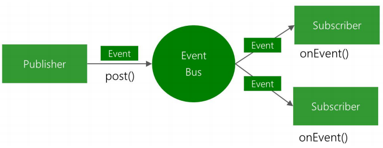

## 1. `EventBus` 概述

`GitHub` 网址：https://github.com/greenrobot/EventBus

`EventBus` 可以代替 `Android` 传统的 `Intent`、`Handler`、`Broadcast` 或接口回调函数，在 `Fragment`、`Activity`、`Service`、以及线程之间传递数据、执行方法。

> 也就是说，`EventBus` 简化了各组件间、以及组件与子线程间的通信。

> 注意：`EventBus` 不能实现跨进程通信。

### 1.1 `EventBus` 的三要素（事件、订阅者、发布者）



如上图，`EventBus` 中的三要素为：

1. `Event`：事件。

    ```:no-line-numbers
    任意类型的对象都可以作为事件。
    ```

2. `Subscriber`：事件订阅者。

    ```:no-line-numbers
    订阅（register）/ 取消订阅（unregister）事件，以及事件的处理方法所在的类称为事件订阅者。

    注意：
        在 EventBus 3.0 之前，事件的处理方法的方法名只能是：
        onEvent/onEventMainThread/onEventBackgroundThread/onEventAsync 
        这 4 种，分别代表 4 种不同的线程模型。

        在 EventBus 3.0 之后，事件的处理方法的方法名可以是任意的，
        但需要通过注解 @Subscribe 进行修饰，
        并且通过该注解指定线程模型（默认为 POSTING）。
    ```

3. `Publisher`：事件发布者。

    ```:no-line-numbers
    调用 EventBus 对象的 post(Object) 方法发布事件时所在的类称为事件发布者。

    其中 post 方法传入的参数 Object 表示任意类型的事件对象，
    根据所发布的事件对象的类型，会自动调用事件订阅者中的形参类型相匹配的事件处理方法。

    注意：
        事件发布者可以在任意线程中调用 post(Object) 方法来发布事件。
    ```

### 1.2  `EventBus` 中的 `4` 种线程模型（`ThreadMode`）

#### 1.2.1 `POSTING`（默认）

发布事件时，`post(Object)` 方法在哪个线程中调用，该事件的处理方法就在哪个线程中执行。

> `POSTING` 线程模型会阻塞 `EventBus` 中其他事件的传递，因此，尽量不要在事件的处理方法中做耗时操作。

#### 1.2.2 `MAIN`

发布事件时，无论 `post(Object)` 方法在哪个线程中调用，该事件的处理方法都会在主线程中执行。

#### 1.2.3 `BACKGROUND`

发布事件时：
1. 如果 `post(Object)` 方法在主线程中调用，那么该事件的处理方法就会在新创建的子线程中执行。
2. 如果 `post(Object)` 方法在子线程中调用，那么该事件的处理方法就会在同一个子线程中执行。

#### 1.2.4 `ASYNC`

发布事件时，无论 `post(Object)` 方法在哪个线程中调用，该事件的处理方法都会在新创建的子线程中执行。

## 2. `EventBus` 的基本用法

### 2.1 添加依赖库

```
implementation 'org.greenrobot:eventbus:3.3.1'
```

### 2.2 `ProGuard` 混淆规则

```
-keepattributes *Annotation*
-keepclassmembers class * {
    @org.greenrobot.eventbus.Subscribe <methods>;
}
-keep enum org.greenrobot.eventbus.ThreadMode { *; }

# If using AsyncExecutord, keep required constructor of default event used.
# Adjust the class name if a custom failure event type is used.
-keepclassmembers class org.greenrobot.eventbus.util.ThrowableFailureEvent {
    <init>(java.lang.Throwable);
}

# Accessed via reflection, avoid renaming or removal
-keep class org.greenrobot.eventbus.android.AndroidComponentsImpl
```

> 注意：不同版本的混淆规则可能会存在区别。

### 2.3 自定义事件类

```java
public class CustomEvent {
    private String msg;
    public CustomEvent(String msg) {
        this.msg = msg;
    }

    public String getMsg() {
        return msg;
    }
}
```

### 2.4 订阅（`register`）和取消订阅（`unregister`）事件

```java
public class MyActivity extend AppCompatActivity {
    protected void onCreate(Bundle savedInstanceState) {
        ...
        /*
            订阅事件，EventBus.register 方法传入作为事件订阅者的实例对象。
            这里将 MyActivity 作为事件订阅者。
        */
        EventBus.getDefault().register(this);
    }

    protected void onDestroy() {
        ...
        /*
            取消订阅事件，EventBus.unregister 方法传入将要取消订阅的事件订阅者对象。
        */
        EventBus.getDefault().unregister(this);
    }
}
```

### 2.5 事件订阅者处理事件

```java
public class MyActivity extends AppCompatActivity {
    protected void onCreate(Bundle savedInstanceState) { ... }

    protected void onDestroy() { ... }

    /*
        1. 被注解 @Subscribe 修饰的方法才能作为事件的处理方法；
        2. 声明注解 @Subscribe 的同时，还可以通过该注解来指定处理事件时的线程模型。
            这里将线程模型指定为 MAIN，表示不管在哪里发布事件 CustomEvent，该事件的当前处理方法 foo 都在主线程中执行。
        3. 事件的处理方法的方法名可以是任意的；
    */
    @Subscribe(threadMode = ThreadMode.MAIN)
    public void foo(CustomEvent event) {
        Log.d("zkq", "msg : " + event.getMsg());
        // TODO 处理接收到的 event 事件
    }
}
```

> 注意：事件的处理方法 `foo` 定义在作为事件订阅者的类中。
> 
> 即：在 `Event.register(subscriber)` 传入的事件订阅者对象所属的类中定义事件的处理方法。

### 2.6 事件发布者发送事件

```java
public class SecondActivity extends AppCompatActivity {
    protected void onCreate(Bundle savedInstanceState) { 
        ...
        findViewById(R.id.btn).setOnClickListener(v -> {
            // 创建待发布的事件对象 event
            CustomEvent event = new CustomEvent("Hello World");

            /*
                调用 EventBus.post 方法发布作为事件的 event 对象。
                调用 EventBus.post 方法的类 SecondActivity 称为事件发布者。
            */ 
            EventBus.getDefault().post(event);

            finish();
        });  
    }
}
```

> 注意：如果在执行 `EventBus.register(subscriber)` 方法之前（即在事件订阅者还没有订阅事件之前）就调用了 `EventBus.post(event)` 方法发布事件，那么事件订阅者 `subscriber` 中的事件处理方法 `foo` 是无法接收到事件 `event` 的，即方法 `foo` 不会执行。

## 3. `EventBus` 的黏性事件

上面讲解的是普通事件的处理方法和发布方式。

上面已经说明了，对于普通事件：

```:no-line-numbers
如果在事件订阅者还没有订阅事件之前就发布了普通事件，那么普通事件的处理方法是不会执行的。
```

而黏性事件与普通事件的区别就在于：

```:no-line-numbers
如果在事件订阅者还没有订阅事件之前就发布了黏性事件，那么黏性事件的处理方法还是会执行的。
```

> 也就是说，对于黏性事件，即使早就已经发布出去了，后订阅（`register`）的事件订阅者对象也能接收到，并执行对应的事件处理方法。

在使用方面，黏性事件和普通事件的订阅（`register`）和取消订阅（`unregister`），以及事件类型都是统一的，区别在于:
1. 事件处理方法上的 `@Subscribe` 注解声明：

    ```:no-line-numbers
    普通事件的处理方法：
        @Subscribe(threadMode = ThreadMode.MAIN) // 省略了 sticky = false
        public void foo(CustomEvent event) {...}

    黏性事件的处理方法：
        @Subscribe(threadMode = ThreadMode.MAIN, sticky = true)
        public void foo(CustomEvent event) {...}
    ```

2. 发布事件的方法调用：

    ```:no-line-numbers
    普通事件的发布：
        EventBus.getDefault().post(event);
    
    黏性事件的处理方法：
        EventBus.getDefault().postSticky(event);
    ```

## 4. `EventBus` 源码解析