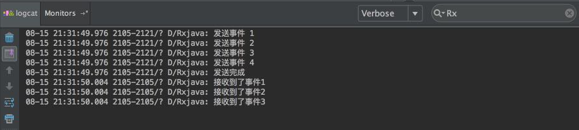
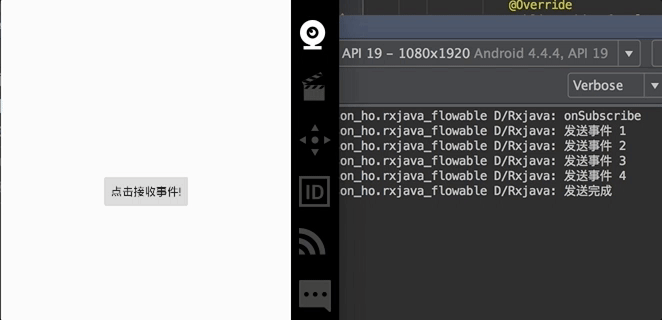
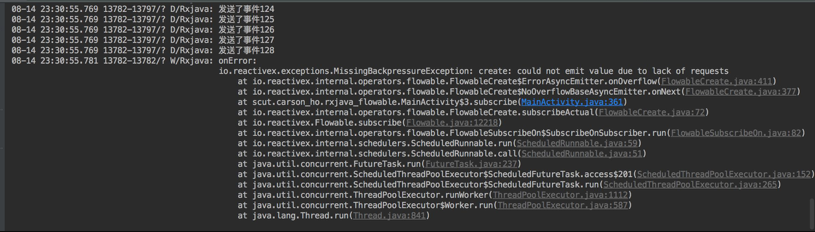

> 注意：
> 
> 1. 发射数据项就是指发射 `onNext` 事件。
> 
> 2. 观察者接收数据项、观察者响应数据项、观察者拉取数据项是一个意思。

## 6. 出现背压的原因：上下游的数据流速不匹配

> 参考 [Carson带你学Android：图文详解RxJava背压策略](https://carsonho.blog.csdn.net/article/details/79081407)

当上下游在不同线程中时，如果上游发射数据项的速度快于下游响应数据项的速度，那么对于来不及响应的数据项就会造成积压，这些积压的数据项既不会丢失，也不会被垃圾回收机制回收，而是存放在一个异步缓存池中，如果缓存池中的数据项一直得不到处理，越积越多，最后就会造成内存溢出，这便是响应式编程中的背压（`backpressure`）问题。

简单地说，背压问题就是：被观察者发射数据项的速度太快，使得观察者无法及时响应所有发射过来数据项，最终导致缓存区的内存溢出。

更简单地说，背压问题就是：上游的数据流速与下游的数据流速不匹配，导致缓存区的内存溢出。（上游数据流速 > 下游数据流程）

注意：

1. “上游” 指的是发射数据项的被观察者，“下游” 指的是响应数据项的观察者。

2. 背压问题主要出现在异步操作中（即发射数据项与响应数据项在不同的线程中），但同步操作中也有可能出现背压问题。


## 7. 背压策略 & `Flowable`

背压策略就是用来解决：被观察者发射数据项的速度太快，使得观察者无法及时响应所有发射过来的数据项而产生的问题的。

背压策略从以下两个方面给出了不同的解决方案：

1. 避免出现发射数据项的速度与响应数据项的速度不匹配的情况的解决方案：

    1. 控制观察者响应数据项的速度

    2. 控制被观察者发射数据项的速度

2. 当出现发射数据项的速度与响应数据项的速度不匹配的情况时的解决方案：

    1. 通过采用不同的背压策略模式（`BackpressureStrategy`）对超出缓存区的数据项进行丢弃、保留、报错等处理

`Flowable` 是 `RxJava 2.0` 中新增的被观察者。`Flowable` 是背压策略的具体实现，即采用 `Flowable` 可解决背压相关的问题。

### 7.1 被观察者 `Flowable` 的特点

#### 7.1.1 对应的观察者为 `Subscriber`

#### 7.1.2 所有的操作符强制支持背压

#### 7.1.3 缓存区存放策略（先进先出）

异步操作中，被观察者 `Flowable` 发射的数据项总是先保存在缓存区中，观察者 `Subscriber` 接收的数据项总是从缓存区中取出。（且先发射的先取出）

#### 7.1.4 缓存区的默认大小 `bufferSize = 128`

```java:no-line-numbers
/* Flowable.java */
public abstract class Flowable<T> implements Publisher<T> {

    /** The default buffer size. */
    static final int BUFFER_SIZE;

    static {
        BUFFER_SIZE = Math.max(1, Integer.getInteger("rx2.buffer-size", 128));
    }

    public static int bufferSize() {
        return BUFFER_SIZE;
    }

    ...
}
```

#### 7.1.5 同步操作中不存在缓存区

### 7.2 背压策略 —— 控制观察者响应数据项的速度（响应式拉取）

#### 7.2.1 原理：观察者按需主动地接收（拉取）指定个数的数据项

```:no-line-numbers
异步操作中，观察者按需接收数据项，且：
1. 被观察者发射的数据项都先保存到缓存区中；
2. 观察者按需从缓存区中接收指定个数的数据项

同步操作中，观察者按需接收数据项，且：
1. 被观察者每发射一个数据项，必须等到观察者响应这个数据项之后，才能继续发射下一个数据项。
```

> 响应式拉取指的就是：观察者按需接收指定个数的数据项。

#### 7.2.2 实现方式：`Subscription.request(n)`

```:no-line-numbers
不管是同步操作，还是异步操作，我们只需要指定观察者需要接收的数据项个数即可，其它的 Flowable 内部已实现。
在观察者 Subscriber 的回调方法 onSubscribe(Subscription) 中，通过调用参数 Subscription 的 request(n) 方法，
即可指定观察者所需接收的数据项个数 n。
```

```java:no-line-numbers
/* Subscription.java */
/*
    该方法的作用为：指定观察者能够接收多少个数据项。
    如：调用 subscription.request(3) 表示观察者能够接收从缓存区中取出的 3 个数据项。
    注意：
        1. 观察者能够接收多少个数据项，就从缓存区取出多少个数据项，
           未取出的数据项仍然保留在缓存区中等待下次观察者再调用 request(n) 方法接着取。
        2. 官方默认推荐使用 Long.MAX_VALUE，即 subscription.request(Long.MAX_VALUE);
           也就是说，推荐尽可能地将缓存区中的数据项全部取出，以避免缓存区溢出。
*/
public void request(long n);
```

#### 7.2.3 示例 1：异步操作中的响应式拉取

```java:no-line-numbers
// 1. 创建被观察者 Flowable
Flowable.create(new FlowableOnSubscribe<Integer>() {

    @Override
    public void subscribe(FlowableEmitter<Integer> emitter) throws Exception {
        // 一共发送 4 个事件

        Log.d(TAG, "发送事件 1");
        emitter.onNext(1);

        Log.d(TAG, "发送事件 2");
        emitter.onNext(2);

        Log.d(TAG, "发送事件 3");
        emitter.onNext(3);

        Log.d(TAG, "发送事件 4");
        emitter.onNext(4);

        Log.d(TAG, "发送完成");
        emitter.onComplete();
    }

}, BackpressureStrategy.ERROR)
        .subscribeOn(Schedulers.io()) // 先设置发射、响应数据项的过程都在 IOScheduler 调度器维护的子线程中执行
        .observeOn(AndroidSchedulers.mainThread()) // 再单独设置响应数据项的过程在主线程中执行
        .subscribe(new Subscriber<Integer>() {

            @Override
            public void onSubscribe(Subscription s) {
                /*
                    Subscription 参数具备 Disposable 参数的作用，即：
                        1. Disposable 中调用 dispose() 切断连接
                        2. Subscription 中调用 cancel() 切断连接

                    此外，Subscription 增加了 request(long n) 方法。
                */
                s.request(3); // 观察者能够接收从缓存区中取出的 3 个数据项。
            }

            @Override
            public void onNext(Integer integer) {
                Log.d(TAG, "接收到了事件" + integer);
            }

            @Override
            public void onError(Throwable t) {
                Log.w(TAG, "onError: ", t);
            }

            @Override
            public void onComplete() {
                Log.d(TAG, "onComplete");
            }
        });
```

打印日志：



> 从打印日志可以看出，异步操作中：
> 
> 1. 发射数据项与响应数据项的过程在不同的线程中执行（发射数据项的线程 `id` 为 `2121`，响应数据项的线程 `id` 为 `2105`）；
> 
> 2. 在发射下一个数据项之前，不需要考虑观察者有没有接收到上一个数据项。（因为发射的数据项总是先保存在缓存区中）

#### 7.2.4 示例 2：同步操作中的响应式拉取

```java:no-line-numbers
/**
 * 步骤 1：创建被观察者 Flowable
 */
Flowable<Integer> upstream = Flowable.create(new FlowableOnSubscribe<Integer>() {

    @Override
    public void subscribe(FlowableEmitter<Integer> emitter) throws Exception {
        // 发送 3 个事件
        Log.d(TAG, "发送了事件1");
        emitter.onNext(1);

        Log.d(TAG, "发送了事件2");
        emitter.onNext(2);

        Log.d(TAG, "发送了事件3");
        emitter.onNext(3);

        emitter.onComplete();
    }

}, BackpressureStrategy.ERROR);

/**
 * 步骤 2：创建观察者 Subscriber
 */
Subscriber<Integer> downstream = new Subscriber<Integer>() {

    @Override
    public void onSubscribe(Subscription s) {
        Log.d(TAG, "onSubscribe");
         s.request(3); // 观察者目前只能接收 3 个数据项。
    }

    @Override
    public void onNext(Integer integer) {
        Log.d(TAG, "接收到了事件 " + integer);
    }

    @Override
    public void onError(Throwable t) {
        Log.w(TAG, "onError: ", t);
    }

    @Override
    public void onComplete() {
        Log.d(TAG, "onComplete");
    }
};

/**
 * 步骤3：建立订阅关系
 */
upstream.subscribe(downstream);
```

打印日志：


> 从打印日志可以看出，同步操作中：
> 
> 1. 发射数据项与响应数据项的过程都在 `id` 为 `5752` 的线程中执行。
> 
> 2. 被观察者每发射一个数据项，必须等到观察者响应这个数据项之后，才能继续发射下一个数据项。（因为同步操作中不存在缓存区，发射的数据项无法保存在缓存区中）

#### 7.2.5 异步操作中响应式拉取时的注意事项

##### 7.2.5.1 即使观察者不拉取数据项，被观察者发射的数据项总会存入缓存区

在异步操作中，如果观察者没有通过回调方法 `onSubscribe(Subscription)` 中参数 `Subscription` 的 `request(n)` 方法设置可接收的数据项个数，那么表示观察者不会接收数据项。

此时，被观察者仍然能够继续发射数据项，并保存进缓存区中。

直到观察者什么时候需要接收数据项了，再调用参数 `Subscription` 的 `request(n)` 方法从缓存区中拉取数据项。

> 先保存进缓存区（即先发射）的数据项先被拉取，数据项从缓存区拉取出来后就从缓存区中移除了。

示例：

```java:no-line-numbers

private static final String TAG = "Rxjava";

private Subscription mSubscription;
    
/**
 * 点击按钮时，观察者才开始调用 Subscription.request(n) 方法去拉取缓存区中的数据项
 */
btn = (Button) findViewById(R.id.btn);
findViewById(R.id.btn).setOnClickListener(new View.OnClickListener() {
    @Override
    public void onClick(View view) {
        mSubscription.request(2); // 每点击一次按钮，观察者从缓存区中拉取 2 个数据项
    }
});

/**
 * 异步操作
 */
Flowable.create(new FlowableOnSubscribe<Integer>() {

    @Override
    public void subscribe(FlowableEmitter<Integer> emitter) throws Exception {
    
        Log.d(TAG, "发送事件 1");
        emitter.onNext(1);

        Log.d(TAG, "发送事件 2");
        emitter.onNext(2);

        Log.d(TAG, "发送事件 3");
        emitter.onNext(3);

        Log.d(TAG, "发送事件 4");
        emitter.onNext(4);

        Log.d(TAG, "发送完成");
        emitter.onComplete();
    }

}, BackpressureStrategy.ERROR)
        .subscribeOn(Schedulers.io()) // 先设置发射、响应数据项的过程都在 IOScheduler 调度器维护的子线程中执行
        .observeOn(AndroidSchedulers.mainThread()) // 再单独设置响应数据项的过程在主线程中执行
        .subscribe(new Subscriber<Integer>() {

            @Override
            public void onSubscribe(Subscription s) {
                Log.d(TAG, "onSubscribe");
                // 将参数 Subscription 赋值成员变量 mSubscription，以便在点击按钮时再拉取数据项
                mSubscription = s; 
            }

            @Override
            public void onNext(Integer integer) {
                Log.d(TAG, "接收到了事件" + integer);
            }

            @Override
            public void onError(Throwable t) {
                Log.w(TAG, "onError: ", t);
            }

            @Override
            public void onComplete() {
                Log.d(TAG, "onComplete");
            }
        });
```

打印日志：



##### 7.2.5.2 若一直不拉取数据项，则发射的数据项最终会使缓存区溢出报错

如果观察者一直不调用 `Subscription.request(n)` 方法从缓存区拉取数据项，那么由于缓存区大小默认只能存入 `128` 个数据项，于是当被观察者发射第 `129` 个数据项时，导致缓存区溢出报错。

> 缓存区溢出时是否报错是由 [背压策略模式（BackpressureStrategy）](#_7-4-背压策略-——-采用不同的背压策略模式-backpressurestrategy) 决定的，比如：
> 
> 1. 当设置了 `BackpressureStrategy.ERROR` 时，缓存区溢出时会报错；
> 
> 2. 当设置了 `BackpressureStrategy.BUFFER` 时，缓存区溢出时会扩容，保证能存放下所有发射的数据项。（但大量数据项的积压最终会导致 `OOM`）

示例：

```java:no-line-numbers
Flowable.create(new FlowableOnSubscribe<Integer>() {

    @Override
    public void subscribe(FlowableEmitter<Integer> emitter) throws Exception {
        /*
            被观察者一共发射 129 个数据项。（超出了缓存区的默认大小 128）
        */
        for (int i = 0; i< 129; i++) {
            Log.d(TAG, "发送了事件" + i);
            emitter.onNext(i);
        }

        emitter.onComplete();
    }

}, BackpressureStrategy.ERROR) // 设置背压策略模式为 ERROR，即：当缓存区溢出时报错
        .subscribeOn(Schedulers.io()) // 先设置发射、响应数据项的过程都在 IOScheduler 调度器维护的子线程中执行
        .observeOn(AndroidSchedulers.mainThread()) // 再单独设置响应数据项的过程在主线程中执行
        .subscribe(new Subscriber<Integer>() {

            @Override
            public void onSubscribe(Subscription s) {
                Log.d(TAG, "onSubscribe");
                /* 观察者一直不调用 s.request(n) 方法从缓存区拉取数据项 */
            }

            @Override
            public void onNext(Integer integer) {
                Log.d(TAG, "接收到了事件" + integer);
            }

            @Override
            public void onError(Throwable t) {
                Log.w(TAG, "onError: ", t);
            }

            @Override
            public void onComplete() {
                Log.d(TAG, "onComplete");
            }
        });
```

打印日志：



#### 7.2.6 同步操作中响应式拉取时的注意事项

##### 7.2.6.1 发射的数据项个数 > 拉取的数据项个数会出现背压问题

由于同步操作中被观察者每发射一个数据项，必须等到观察者响应这个数据项之后，才能继续发射下一个数据项，所以同步操作中，不会出现发射数据项的速度 > 接收数据项的速度的情况。

但是同步操作中，却可能会出现发射的数据项个数 > 拉取的数据项个数的情况。同数据项流速不匹配一样，数据项个数不匹配同样会出现背压问题，即通过发射 `onError` 事件触发 `MissingBackpressureException` 异常。

##### 7.2.6.2 发射了数据项但不拉取也会出现背压问题

由于同步操作中不存在缓存区，所以被观察者发射的数据项需要直接传递给观察者，但如果观察者没有设置 `Subscription.request(n)`，那么被观察者就会认为观察者没有接收并处理事件的能力。

于是，被观察者就会在发射一个数据项未被接收之后，通过发射 onError 事件触发 `MissingBackpressureException` 异常，来提醒观察者接收事件。

示例：

```java:no-line-numbers
/**
 * 创建被观察者 Flowable
 */
Flowable<Integer> upstream = Flowable.create(new FlowableOnSubscribe<Integer>() {

    @Override
    public void subscribe(FlowableEmitter<Integer> emitter) throws Exception {

        Log.d(TAG, "发送了事件1");
        emitter.onNext(1);

        Log.d(TAG, "发送了事件2");
        emitter.onNext(2);

        Log.d(TAG, "发送了事件3");
        emitter.onNext(3);

        emitter.onComplete();
    }

}, BackpressureStrategy.ERROR);

/**
 * 创建观察者 Subscriber
 */
Subscriber<Integer> downstream = new Subscriber<Integer>() {

    @Override
    public void onSubscribe(Subscription s) {
        Log.d(TAG, "onSubscribe");
        /* 不调用 s.request(n)，即：观察者不接收数据项 */
    }

    @Override
    public void onNext(Integer integer) {
        Log.d(TAG, "onNext: " + integer);
    }

    @Override
    public void onError(Throwable t) {
        Log.w(TAG, "onError: ", t);
    }

    @Override
    public void onComplete() {
        Log.d(TAG, "onComplete");
    }
};

/**
 * 建立订阅关系
 */
upstream.subscribe(downstream);
```

打印日志：


> 从打印日志可以看出：在发射了 onError 事件触发 `MissingBackpressureException` 异常后，还会接着将剩余的数据项发射完。

### 7.3 背压策略 —— 控制被观察者发射数据项的速度（反馈控制）

响应式拉取的背压策略是用来控制观察者接收数据项的速度的。

但是，单独地控制接收速度，而不限制发射速度，那么当发射速度快于接收速度时，就有可能出现背压问题。

同样的，单独地控制发射速度，而不限制接收速度，那么当发射速度慢于接收速度时，就会导致效率问题。

因此，必须同时对发射速度和接收速度进行控制，才能避免问题的产生。于是，提出了反馈控制的背压策略。

#### 7.3.1 原理：被观察者发射数据项的个数受到观察者拉取数据项的个数的限制

反馈控制的原理就是根据观察者接收数据项的速度，来控制被观察者发射数据项的速度。使得在不引起背压问题的条件下，合理地调整被观察者发射数据项的过程。

考虑异步操作和同步操作的情况下，反馈控制的具体实现原理为：

```:no-line-numbers
异步操作中，由于发射过程和接收过程在不同的线程中执行，所以被观察者无法直接知道观察者当前可接收数据项的个数。
也就是说，被观察者无法知道观察者接收数据项的速度，因此，也就无法直接根据接收速度来控制发射速度了。

但是，异步操作中是存在缓存区的，而观察者接收到的数据项都是从缓存区中拉取的，因此，接收速度会影响到缓存区。
同时，被观察者也是可以访问到缓存区的，于是就可以根据缓存区的状态来控制发射速度，具体为：

    被观察者可发射的数据项个数 = bufferSize - bufferItems = 缓存区的空闲容量，
    其中：1. bufferSize 为缓存区大小（默认 128），2. bufferItems 为缓存区中剩余的数据项个数（初始值为 0）。
    注意：只有当剩余数据项个数 <= 32（即空闲容量 >= 96） 时，才允许被观察者发射数据项，直到填满缓存区为止。

综上，在异步操作中，基于缓存区状态的反馈，对被观察者发射数据项的速度进行了控制。
```

```:no-line-numbers
同步操作中，由于发射过程和接收过程在同一线程中执行，所以被观察者可以直接知道观察者当前可接收数据项的个数。
于是，直接根据接收速度来控制发射速度即可，具体为：

    被观察者可发射的数据项个数 = 观察者可接收的数据项个数

综上，在异步操作中，基于观察者接收数据项的速度的反馈，直接对被观察者发射数据项的速度进行控制。
```

#### 7.3.2 实现方式：`FlowableEmitter.requested()`

不管是异步操作，还是同步操作，**只要在 `FlowableEmitter.requested()` 的返回值 > `0` 的条件下发射数据项就不会出现背压问题**。

```java:no-line-numbers
/* FlowableEmitter.java */
/*
    异步操作中，返回值表示缓存区目前可存入的数据项个数。
        注意：
            1. 初始状态下，返回值 = 128。当缓存区首次存满后，返回值 = 0。
            2. 在返回值 = 0 的情况下，得再次等到缓存区的剩余数据项个数 <= 32 时，返回值才会 > 0。
               也就是说：当返回值 = 0 时，即使缓存区还有空闲容量，暂时也不应该继续发射数据项。
            3. 在返回值 > 0 的情况下，得再次等到缓存区存满后，返回值 = 0。

    同步操作中，返回值表示观察者可接收但还未接收的数据项个数，
        即：返回值 = 可接收的数据项个数 - 已接收的数据项个数
        注意：
            1. 当返回值 = 0 时，就不能继续发射数据项了，否则会发射 onError 事件触发 MissingBackpressureException 异常。
*/
long requested();
```

#### 7.3.3 示例 1：异步操作中的响应式拉取

```java:no-line-numbers
// 点击按钮时，观察者才开始调用 Subscription.request(n) 方法去拉取缓存区中的数据项
findViewById(R.id.btn);.setOnClickListener(new View.OnClickListener() {
    @Override
    public void onClick(View view) {
        mSubscription.request(48); // 每点击一次按钮，观察者从缓存区中拉取 48 个数据项
    }
});

// 异步操作
Flowable.create(new FlowableOnSubscribe<Integer>() {

    @Override
    public void subscribe(FlowableEmitter<Integer> emitter) throws Exception {
        Log.d(TAG, "观察者可接收事件数量 = " + emitter.requested());
        boolean flag;
        
        for (int i = 0; i < 500; i++) { // 被观察者一共可发送 500 个数据项
            flag = false;
            
            /*
                若 requested() == 0 则暂不发送。
                （当缓存区从满载到剩余数据项个数大于 32 的这段过程中都返回 0）
            */
            while (emitter.requested() == 0) { 
                if (!flag) {
                    Log.d(TAG, "不再发送");
                    flag = true;
                }
            }

            // 执行到此处，说明 requested() > 0 ，此时才允许发送数据项
            Log.d(TAG, "发送了事件" + i + "，观察者可接收事件数量 = " + emitter.requested());
            emitter.onNext(i);
        }
    }

}, BackpressureStrategy.ERROR)
        .subscribeOn(Schedulers.io()) // 先设置发射、响应数据项的过程都在 IOScheduler 调度器维护的子线程中执行
        .observeOn(AndroidSchedulers.mainThread()) // 再单独设置响应数据项的过程在主线程中执行
        .subscribe(new Subscriber<Integer>() {

            @Override
            public void onSubscribe(Subscription s) {
                Log.d(TAG, "onSubscribe");
                // 将参数 Subscription 赋值成员变量 mSubscription，以便在点击按钮时再拉取数据项
                mSubscription = s;
            }

            @Override
            public void onNext(Integer integer) {
                Log.d(TAG, "接收到了事件" + integer);
            }

            @Override
            public void onError(Throwable t) {
                Log.w(TAG, "onError: ", t);
            }

            @Override
            public void onComplete() {
                Log.d(TAG, "onComplete");
            }
        });
```

打印日志：


#### 7.3.4 示例 2：同步操作中的响应式拉取

```java:no-line-numbers
Flowable.create(new FlowableOnSubscribe<Integer>() {

    @Override
    public void subscribe(FlowableEmitter<Integer> emitter) throws Exception {
        
        long n = emitter.requested(); // 同步操作中，返回观察者当前可接收的数据项个数

        Log.d(TAG, "观察者可接收事件" + n);
        
        // 同步操作中，被观察者发射数据项的个数不应该超过观察者可接收数据项的个数。（否则会触发 onError 事件）
        for (int i = 0; i < n; i++) {
            Log.d(TAG, "发送了事件" + i);
            emitter.onNext(i);
        }
    }

}, BackpressureStrategy.ERROR)
        .subscribe(new Subscriber<Integer>() {

            @Override
            public void onSubscribe(Subscription s) {
                Log.d(TAG, "onSubscribe");
                s.request(10); // 设置观察者当前可接收的数据项个数为 10 个
            }

            @Override
            public void onNext(Integer integer) {
                Log.d(TAG, "接收到了事件" + integer);
            }

            @Override
            public void onError(Throwable t) {
                Log.w(TAG, "onError: ", t);
            }

            @Override
            public void onComplete() {
                Log.d(TAG, "onComplete");
            }
        });
```

打印日志：


#### 7.3.5 同步操作中反馈控制的注意事项

##### 7.3.5.1 观察者中多次调用的 `Subscription.request(n)` 具有叠加性

同步操作中，观察者当前可接收的数据项个数 = `Subscription.request(n)` 方法所传入的参数值 `n`。

且当 `Subscription.request(n)` 方法多次调用时，可接收的数据项个数 = 每次调用时所传入参数 `n` 的累加值。

示例：

```java:no-line-numbers
Flowable.create(new FlowableOnSubscribe<Integer>() {

    @Override
    public void subscribe(FlowableEmitter<Integer> emitter) throws Exception {
                
        // 获取观察者当前可接收的数据项个数
        Log.d(TAG, "观察者可接收事件" + emitter.requested());
    }

}, BackpressureStrategy.ERROR)
        .subscribe(new Subscriber<Integer>() {

            @Override
            public void onSubscribe(Subscription s) {
                Log.d(TAG, "onSubscribe");
                s.request(10); // 设置观察者可接收的数据项个数为 10 个。
                s.request(20); // 设置观察者可接收的数据项个数为 20 个。

                /* 于是，观察者当前可接收的数据项个数 = 10 + 20 = 30 个 */
            }

            @Override
            public void onNext(Integer integer) {
                Log.d(TAG, "接收到了事件" + integer);
            }

            @Override
            public void onError(Throwable t) {
                Log.w(TAG, "onError: ", t);
            }

            @Override
            public void onComplete() {
                Log.d(TAG, "onComplete");
            }
        });
```

打印日志：


##### 7.3.5.2 被观察者中 `FlowableEmitter.requested()` 的返回值会实时更新

同步操作中，不存在缓存区，`requested()` 方法直接返回观察者可接收但还未接收的数据项个数。

由于发射过程和接收过程在同一线程中执行，所以被观察可以实时地监听观察者是否已接收到数据项，从而同一线程中的 `requested()` 方法也就可以实时地返回观察者还未接收到的数据项个数。

> 异步操作中，`FlowableEmitter.requested()` 表示缓存区目前可存入的数据项个数，当 `requested()` 返回 `= 0` 后，得等到缓存区的剩余数据项个数 `<= 32` 时，`requested()` 返回值才会更新。

示例：

```java:no-line-numbers
Flowable.create(new FlowableOnSubscribe<Integer>() {

    @Override
    public void subscribe(FlowableEmitter<Integer> emitter) throws Exception {
        // 获取观察者当前可接收的数据项个数
        Log.d(TAG, "观察者可接收事件数量 = " + emitter.requested()); 

        Log.d(TAG, "发送了事件 1");
        emitter.onNext(1);

        // requested() 会实时更新，即返回值 = 可接收的数据项个数 - 已接收的数据项个数

        Log.d(TAG, "发送了事件1后, 还需要发送事件数量 = " + emitter.requested());
        Log.d(TAG, "发送了事件 2");
        emitter.onNext(2);

        Log.d(TAG, "发送事件2后, 还需要发送事件数量 = " + emitter.requested());
        Log.d(TAG, "发送了事件 3");
        emitter.onNext(3);

        Log.d(TAG, "发送事件3后, 还需要发送事件数量 = " + emitter.requested());
        emitter.onComplete();
    }

}, BackpressureStrategy.ERROR)
        .subscribe(new Subscriber<Integer>() {

            @Override
            public void onSubscribe(Subscription s) {
                Log.d(TAG, "onSubscribe");
                s.request(10); // 设置观察者当前可接收的数据项个数为 10 个
            }

            @Override
            public void onNext(Integer integer) {
                Log.d(TAG, "接收到了事件" + integer);
            }

            @Override
            public void onError(Throwable t) {
                Log.w(TAG, "onError: ", t);
            }

            @Override
            public void onComplete() {
                Log.d(TAG, "onComplete");
            }
        });
```

打印日志：


> 从打印日志可以看出：
> 
> 每次正常的发射/接收数据项后，被观察者中的 `requested()` 方法返回值所表示的观察者中还未接收到的数据项个数都会实时地更新。

##### 7.3.5.3 `requested()` 返回 `0` 时发射数据项一定会触发 `onError` 事件

同步操作中，`FlowableEmitter.requested()` 返回 `0` 有两种情况：

```:no-line-numbers
1. 观察者调用 request(n) 指定了可接收的数据项个数，且被观察者发射完 n 个数据项后，此时 requested() 返回 0；
2. 观察者未调用 request(n)，此时被观察者中 requested() 返回 0。
```

不管是哪种情况，由于同步操作中不存在缓存区，所以只要 `requested()` 返回 `0`，就说明观察者接收不了了，此时，如果被观察者再发射数据项，那么就会产生背压问题，即通过发射 `onError` 事件来触发 `MissingBackpressureException` 异常。

> 异步操作中，`requested()` 返回值表示缓存区可存入的数据项个数。当 `requested()` 返回 `0` 时，虽然缓存区不可存入数据项了，但并不表示缓存区满载了（可能是空闲容量还没有达到或超过 `96`）。可以认为：只要缓存区中有空闲容量，即使 `requested()` 返回 `0`，那么也是能够正常发射数据项的。

示例：

```java:no-line-numbers
/*
    观察者只可接收 1 个数据项，但被观察者发射 2 个数据项。
    于是，当发射第 2 个数据项时 requested() 返回 0。
*/
Flowable.create(new FlowableOnSubscribe<Integer>() {

    @Override
    public void subscribe(FlowableEmitter<Integer> emitter) throws Exception {

        // 获取观察者当前可接收的数据项个数
        Log.d(TAG, "观察者可接收事件数量 = " + emitter.requested());

        Log.d(TAG, "发送了事件 1");
        emitter.onNext(1);

        // requested() 会实时更新，即返回值 = 可接收的数据项个数 - 已接收的数据项个数
        Log.d(TAG, "发送了事件1后, 还需要发送事件数量 = " + emitter.requested());
        Log.d(TAG, "发送了事件 2");
        emitter.onNext(2);

        Log.d(TAG, "发送事件2后, 还需要发送事件数量 = " + emitter.requested());
        emitter.onComplete();
    }

}, BackpressureStrategy.ERROR)
        .subscribe(new Subscriber<Integer>() {

            @Override
            public void onSubscribe(Subscription s) {
                Log.d(TAG, "onSubscribe");
                s.request(1); // 设置观察者当前可接受 1 个数据项
            }

            @Override
            public void onNext(Integer integer) {
                Log.d(TAG, "接收到了事件" + integer);
            }

            @Override
            public void onError(Throwable t) {
                Log.w(TAG, "onError: ", t);
            }

            @Override
            public void onComplete() {
                Log.d(TAG, "onComplete");
            }
        });
```

打印日志：


> 从打印日志可以看出：
> 
> 由于观察者只可接收 `1` 个数据项，所以被观察者在发射完第 `1` 个数据项后，`requested()` 返回了 `0`，于是在发射第 `2` 个数据项时，会通过发射 `onError` 事件来触发 `MissingBackpressureException` 异常。

### 7.4 背压策略 —— 采用不同的背压策略模式（`BackpressureStrategy`）

#### 7.4.1 五种背压策略模式

在枚举类 `BackpressureStrategy` 中定义了五种背压策略模式，分别对应在出现发射速度与响应速度不匹配的情况时所采取的不同的处理方式（如丢弃数据项、保留数据项、发射 `onError` 事件触发异常等处理方式）

```java:no-line-numbers
public enum BackpressureStrategy {
    MISSING,
    
    ERROR,
    
    BUFFER,
    
    DROP,
    
    LATEST
}
```

##### 7.4.1.2 `BackpressureStrategy.ERROR`

当源被观察者发射数据项的个数超过 `FlowableEmitter.requested()` 的返回值时，向观察者发射 `onError(Throwable)` 事件来触发 `MissingBackpressureException` 异常。

示例：

```java:no-line-numbers
Flowable.create(new FlowableOnSubscribe<Integer>() {
    @Override

    public void subscribe(FlowableEmitter<Integer> emitter) throws Exception {
        /*
            异步操作中，requested() 返回可存入缓存区的数据项个数，
            即使在初始状态下，最多也只能连续存入 128 个（缓存区的默认容量）数据项，
            所以这里连续发射 129 个数据项时，第 129 个数据项发射时会触发 onError 事件，向观察者抛出异常。
        */
        for (int i = 0; i< 129; i++) {
            Log.d(TAG, "发送了事件" + i);
            emitter.onNext(i);
        }
        emitter.onComplete();
    }

}, BackpressureStrategy.ERROR) // 设置背压策略模式为 ERROR
        .subscribeOn(Schedulers.io()) // 先设置发射、响应数据项的过程都在 IOScheduler 调度器维护的子线程中执行
        .observeOn(AndroidSchedulers.mainThread()) // 再单独设置响应数据项的过程在主线程中执行
        .subscribe(new Subscriber<Integer>() {

            @Override
            public void onSubscribe(Subscription s) {
                Log.d(TAG, "onSubscribe");
            }

            @Override
            public void onNext(Integer integer) {
                Log.d(TAG, "接收到了事件" + integer);
            }

            @Override
            public void onError(Throwable t) {
                Log.w(TAG, "onError: ", t);
            }

            @Override
            public void onComplete() {
                Log.d(TAG, "onComplete");
            }
        });
```

打印日志：


##### 7.4.1.1 `BackpressureStrategy.MISSING`

在数据项的发射/接收过程中，除了源被观察者和目标观察者之外，中途还存在一些被观察者和观察者对传递的数据项进行加工处理。

`ERROR` 策略模式是在源被观察者中就阻止了对超过 `requested()` 返回值个数的数据项的发射，并触发 `onError` 事件，向目标观察者抛出 `MissingBackpressureException` 异常。

`MISSING` 策略模式则是允许源被观察者继续发射超过 `requested()` 返回值个数的数据项，由中途的被观察者和观察者来对超出的数据项进行自定义处理。比如：

```:no-line-numbers
Flowable.observeOn 操作符返回一个中途的被观察者 FlowableObserveOn，
超出的数据项经过被观察者 FlowableObserveOn 再发射给中途的观察者 FlowableObserveOn.ObserveOnSubscriber，
当 ObserveOnSubscriber 接收到超出的数据项时触发 onError 事件，向目标观察者抛出 MissingBackpressureException 异常。
```

> 虽然可能和 `ERROR` 策略模式一样，`MISSING` 策略模式在发射超出 `requested()` 返回值个数的数据项时，也是触发 `onError` 事件，向目标观察者抛出 `MissingBackpressureException` 异常。
> 
> 但这两种策略模式的不同之处在于：`ERROR` 策略模式只可能向目标观察者抛出 `MissingBackpressureException` 异常。
> 
> 而 `MISSING` 策略模式除了可以向目标观察者抛出 `MissingBackpressureException` 异常之外，还可以自定义其他的处理方式，这完全是由中途的被观察者和观察者来自定义处理的，较 `ERROR` 模式更加灵活。

示例：

```java:no-line-numbers
/*
    MISSING 模式下，操作符 observeOn 所产生的中途被观察者和观察者在遇到超出的数据项时的处理方式
*/
Flowable.create(new FlowableOnSubscribe<Integer>() {

    @Override
    public void subscribe(FlowableEmitter<Integer> emitter) throws Exception {
    
        for (int i = 0; i < 129; i++) {
            Log.d(TAG, "发送了事件" + i);
            emitter.onNext(i);
        }
        emitter.onComplete();
    }

}, BackpressureStrategy.MISSING) // 设置背压策略模式为 MISSING
        .subscribeOn(Schedulers.io()) // 先设置发射、响应数据项的过程都在 IOScheduler 调度器维护的子线程中执行
        .observeOn(AndroidSchedulers.mainThread()) // 再单独设置响应数据项的过程在主线程中执行
        .subscribe(new Subscriber<Integer>() {

            @Override
            public void onSubscribe(Subscription s) {
                Log.d(TAG, "onSubscribe");
            }

            @Override
            public void onNext(Integer integer) {
                Log.d(TAG, "接收到了事件" + integer);
            }

            @Override
            public void onError(Throwable t) {
                Log.w(TAG, "onError: ", t);
            }

            @Override
            public void onComplete() {
                Log.d(TAG, "onComplete");
            }
        });
```

打印日志：


> 从打印日志可以看出：
> 
> `MISSING` 模式下向观察者抛出 `MissingBackpressureException` 异常时，与 `ERROR` 模式下所抛出的 `MissingBackpressureException` 异常相比，异常对象所携带的异常信息不同。 
> （`MISSING` 模式下的异常信息是由中途的观察者 `FlowableObserveOn.ObserveOnSubscriber` 来定义的）

##### 7.4.1.3 `BackpressureStrategy.BUFFER`

`BUFFER` 模式下，即使源被观察者发射数据项的个数超过 `FlowableEmitter.requested()` 的返回值，超出的数据项仍然会发射出去。具体为：

```:no-line-numbers
异步操作中，超出 requested() 返回值个数的数据项也总是可以存入到缓存区中，
即使缓存区满载，也会对缓存区进行扩容，直到缓存区内存溢出，产生 OOM 异常，引起进程崩溃。
（也就是说 BUFFER 模式下的程序是存在风险的）
```

```:no-line-numbers
同步操作中，默认是没有缓存区的，但 BUFFER 模式下，也会提供一个不限制容量的队列容器。
不管观察者是否设置了可接收的数据项个数，也不管是否超过了观察者可接收的数据项个数，
发射的数据项总是会先存入到这个队列容器中。
此时，和异步操作类似，同步操作中的观察者在设置了可接收的数据项个数后，就从这个队列容器中拉取指定个数的数据项。
```

示例：

```java:no-line-numbers
/*
    异步操作中，BUFFER 策略模式下，即使连续发射的数据项超出了缓存区的默认容量（128），
    也还是会通过对缓存区进行扩容来接收下所有发射的数据项。
*/
Flowable.create(new FlowableOnSubscribe<Integer>() {

    @Override
    public void subscribe(FlowableEmitter<Integer> emitter) throws Exception {
        
        for (int i = 1; i < 130; i++) {
            Log.d(TAG, "发送了事件" + i);
            emitter.onNext(i);
        }
        emitter.onComplete();
    }

}, BackpressureStrategy.BUFFER) // 设置背压策略模式为 BUFFER
        .subscribeOn(Schedulers.io()) // 先设置发射、响应数据项的过程都在 IOScheduler 调度器维护的子线程中执行
        .observeOn(AndroidSchedulers.mainThread()) // 再单独设置响应数据项的过程在主线程中执行
        .subscribe(new Subscriber<Integer>() {

            @Override
            public void onSubscribe(Subscription s) {
                Log.d(TAG, "onSubscribe");
            }

            @Override
            public void onNext(Integer integer) {
                Log.d(TAG, "接收到了事件" + integer);
            }

            @Override
            public void onError(Throwable t) {
                Log.w(TAG, "onError: ", t);
            }

            @Override
            public void onComplete() {
                Log.d(TAG, "onComplete");
            }
        });
```

打印日志：


##### 7.4.1.4 `BackpressureStrategy.DROP`

`DROP` 模式下，当源被观察者发射数据项的个数超过 `FlowableEmitter.requested()` 的返回值时，会将超出的数据项默默地丢弃掉，而不会向 `ERROR` 模式那样，通过发射 `onError` 事件来提醒观察者。

> `DROP` 模式和 `ERROR` 模式的区别之处仅在于：
> 
> 1. `ERROR` 模式下，在发射超出的数据项时，会将其丢弃掉，并发射一个 `onError` 事件，向观察者抛出异常来提醒观察者。
> 
> 2. `DROP` 模式下，在发射超出的数据项时，会将其丢弃掉，而不会通过发射 `onError` 事件来提醒观察者。

示例：

```java:no-line-numbers
/**
 * 点击按钮时，观察者才开始调用 Subscription.request(n) 方法去拉取缓存区中的数据项
 */
findViewById(R.id.btn).setOnClickListener(new View.OnClickListener() {
    @Override
    public void onClick(View view) {
        mSubscription.request(128); // 每点击一次按钮，观察者从缓存区中拉取 128 个数据项
    }
});

/**
 * 异步操作
 */
Flowable.create(new FlowableOnSubscribe<Integer>() {

    @Override
    public void subscribe(FlowableEmitter<Integer> emitter) throws Exception {

        for (int i = 0; i < 150; i++) { // 被观察者一共发送 150 个数据项
            Log.d(TAG, "发送了事件" + i);
            emitter.onNext(i);
        }

        emitter.onComplete();
    }

}, BackpressureStrategy.DROP) // 设置背压策略模式为 DROP
        .subscribeOn(Schedulers.io()) // 先设置发射、响应数据项的过程都在 IOScheduler 调度器维护的子线程中执行
        .observeOn(AndroidSchedulers.mainThread()) // 再单独设置响应数据项的过程在主线程中执行
        .subscribe(new Subscriber<Integer>() {

            @Override
            public void onSubscribe(Subscription s) {
                Log.d(TAG, "onSubscribe");
                // 将参数 Subscription 赋值成员变量 mSubscription，以便在点击按钮时再拉取数据项
                mSubscription = s;
            }
            
            @Override
            public void onNext(Integer integer) {
                Log.d(TAG, "接收到了事件" + integer);
            }

            @Override
            public void onError(Throwable t) {
                Log.w(TAG, "onError: ", t);
            }

            @Override
            public void onComplete() {
                Log.d(TAG, "onComplete");
            }
        });
```

打印日志：


> 从打印日志可以看出：
> 
> 只有先发射的前 `128` 个数据项存入了缓存区中，第 `129` 至第 `150` 个数据项没有存入到缓存区。
> 
> 所以，观察者只能从缓存区中拉取到前 `128` 个数据项。
> 
> 至于第 `129` 至第 `150` 个数据项发射出去后就被偷偷地丢弃了，观察者无法感知到。

##### 7.4.1.5 `BackpressureStrategy.LATEST`

`LATEST` 模式下，当源被观察者发射数据项的个数超过 `FlowableEmitter.requested()` 的返回值时，会将超出的数据项存入到一个容量为 `1` 的容器中。且后存入的数据项会覆盖掉先存入的数据项。

于是这个容量为 `1` 的容器中就只保存了一个超出的数据项，且这个被保存的超出数据项是最后发射的。

当 `requested()` 返回值 `> 0` 时，会先将容量为 `1` 的容器中的数据项发射出去。

示例：

```java:no-line-numbers
/**
 * 点击按钮时，观察者才开始调用 Subscription.request(n) 方法去拉取缓存区中的数据项
 */
findViewById(R.id.btn).setOnClickListener(new View.OnClickListener() {
    @Override
    public void onClick(View view) {
        mSubscription.request(128); // 每点击一次按钮，观察者从缓存区中拉取 128 个数据项
    }
});

/**
 * 异步操作
 */
Flowable.create(new FlowableOnSubscribe<Integer>() {

    @Override
    public void subscribe(FlowableEmitter<Integer> emitter) throws Exception {

        for (int i = 0; i < 150; i++) { // 被观察者一共发送 150 个数据项
            Log.d(TAG, "发送了事件" + i);
            emitter.onNext(i);
        }

        emitter.onComplete();
    }

}, BackpressureStrategy.LATEST) // 设置背压策略模式为 LATEST
        .subscribeOn(Schedulers.io()) // 先设置发射、响应数据项的过程都在 IOScheduler 调度器维护的子线程中执行
        .observeOn(AndroidSchedulers.mainThread()) // 再单独设置响应数据项的过程在主线程中执行
        .subscribe(new Subscriber<Integer>() {

            @Override
            public void onSubscribe(Subscription s) {
                Log.d(TAG, "onSubscribe");
                // 将参数 Subscription 赋值成员变量 mSubscription，以便在点击按钮时再拉取数据项
                mSubscription = s;
            }

            @Override
            public void onNext(Integer integer) {
                Log.d(TAG, "接收到了事件" + integer);
            }

            @Override
            public void onError(Throwable t) {
                Log.w(TAG, "onError: ", t);
            }

            @Override
            public void onComplete() {
                Log.d(TAG, "onComplete");
            }
        });
```

打印日志：


> 从打印日志可以看出：
> 
> 1. 异步操作中，在未点击按钮之前，观察者不接收数据项，所以被观察者发射的数据项存入缓存区后还不会被取出。且由于缓存区初始的空闲容量是 `128`，所以被观察者在连续发射 `150` 个数据项时，只有前 `128` 个数据项存入了缓存区。
> 
> 2. 在 `LATEST` 模式下，之后发射的第 `129` 至第 `150` 个数据项存入容量为 `1` 的容器中，且后存入的覆盖先存入的，于是，容量为 `1` 的容器中最终只保存了第 `150` 个发射的数据项。
> 
> 3. 在首次按下按钮后，观察者可从缓存区中拉取 `128` 个数据项。拉取后缓存区的剩余数据项个数为 `0`（`< 32`），所以，观察者接收了 `128` 个数据项后，被观察者中的 `requested()` 返回值为 `128`（`> 0`）。于是，会将容量为 `1` 的容器中的第 `150` 个数据项发射出去（异步操作中就是先存入到缓存区中）。
> 
> 4. 当第二次按下按钮后，观察者可再次从缓存区中拉取 `128` 个数据项。此时，缓存区中只保存了一个数据项（即第 `150` 个数据项），于是，观察者就只接收到了这一个数据项。


#### 7.4.2 指定背压策略模式的方式

##### 7.4.2.1 在 `create` 创建操作符中指定背压策略模式

```java:no-line-numbers
/* Flowable.java */
/*
    返回 Flowable 的子类 FlowableCreate
    参数 source 提供 subscribe(emitter) 方法用来发射数据项
    参数 mode 指定被观察者在发射超出 requested() 返回值个数的数据项时所采用的背压策略模式
*/
static <T> Flowable<T> create(FlowableOnSubscribe<T> source, BackpressureStrategy mode)
```

```java
public interface FlowableOnSubscribe<T> {
    /*
        该方法在 FlowableCreate 重写的 subscribeActual 方法中调用。
        create 操作符传入的背压策略模式参数 mode 不同，所使用的发射器 emitter 也不同
    */
    void subscribe(FlowableEmitter<T> emitter);
}
```

##### 7.4.2.2 在其他创建操作符中指定背压策略模式

类似于 `Observable.java`，`Flowable.java` 中除了提供 `create` 创建操作符方法之外，还提供了其他的创建操作符方法用来生成 `Flowable` 的其他子类对象。

但是在 `Flowable.java` 中的其他创建操作符方法的参数列表中，并不能指定背压策略模式。为此，`Flowable.java` 中提供了如下几个操作符专门用来指定背压策略模式：

1. `onBackpressureBuffer`；

2. `onBackpressureDrop`；

3. `onBackpressureLatest`。

> 如果在使用其他创建操作符时不指定背压策略模式，则默认采用 `BackpressureStrategy.ERROR` 模式。

###### 7.4.2.2.1 默认采用 `BackpressureStrategy.ERROR`

###### 7.4.2.2.2 `onBackpressureBuffer()`

```java:no-line-numbers
/* Flowable.java */
Flowable<T> onBackpressureBuffer() // onBackpressureBuffer(bufferSize(), false, true);

Flowable<T> onBackpressureBuffer( // onBackpressureBuffer(bufferSize(), delayError, true);
        boolean delayError) 

Flowable<T> onBackpressureBuffer( // onBackpressureBuffer(capacity, false, false)
        int capacity)

Flowable<T> onBackpressureBuffer( // onBackpressureBuffer(capacity, delayError, false)
        int capacity, 
        boolean delayError)

Flowable<T> onBackpressureBuffer(
        int capacity,
        boolean delayError, 
        boolean unbounded)

Flowable<T> onBackpressureBuffer(
        int capacity, 
        Action onOverflow)

/*
    参数 capacity：设置缓存区的初始容量。其中，容量值必须为 2 的幂。
                   如果 capacity 为 2 的幂，则初始容量为 capacity；
                   如果 capacity 不为 2 的幂，则取大于 capacity 的 2 的幂为初始容量。
                   默认为 Flowable.bufferSize()，即 128。

    参数 delayError：当发射/接收过程中出现异常需要发送 onError 事件，且缓存区中还存在数据项时，那么：
                    1. 若 delayError 为 true，则等到缓存区中的数据项都发射出去后再发射 onError 事件；
                    2. 若 delayError 为 false，则立即发射 onError 事件。
                    默认为 false。

    参数 unbounded：设置缓存区是否可以扩容。
                    若 unbounded 为 true，则缓存区在初始容量 capacity 的基础上还可以无限地扩容。
                    若 unbounded 为 false，则缓存区的容量为固定值 = capacity，不可以扩容。
                    若没有指定 capacity 则默认为 true；若指定了 capacity 则默认为 false。

    参数 onOverflow：当数据项无法存入到缓存区中时（如固定容量的缓存区满载后），
                     被观察者会发射 onError 事件，向观察者抛出 MissingBackpressureException 异常，
                     此时，在发射 onError 事件之前，会先回调 onOverflow.run() 方法。
*/
Flowable<T> onBackpressureBuffer(
        int capacity, 
        boolean delayError, 
        boolean unbounded, 
        Action onOverflow)

/*
    设置一个固定容量为 capacity 的缓存区，当缓存区满载时，根据 overflowStrategy 采用不同的处理方式：
    1. BackpressureOverflowStrategy.ERROR
        缓存区满载时发射 onError 事件，向观察者抛出 MissingBackpressureException 异常。
    
    2. BackpressureOverflowStrategy.DROP_OLDEST
        缓存区满载时，移除最先存入的数据项，并将当前发射的数据项存入进去，
        然后再回调 onOverflow.run() 方法

    3. BackpressureOverflowStrategy.DROP_LATEST
        缓存区满载时，移除最后存入的数据项，并将当前发射的数据项存入进去，
        然后再回调 onOverflow.run() 方法
*/
Flowable<T> onBackpressureBuffer(
        long capacity, 
        Action onOverflow, 
        BackpressureOverflowStrategy overflowStrategy)
```

###### 7.4.2.2.3 `onBackpressureDrop()`

```java:no-line-numbers
/* Flowable.java */
/*
    同 BackpressureStrategy.DROP 一样，
    在发射超出的数据项时，会将其丢弃掉，而不会通过发射 onError 事件来提醒观察者。
*/
Flowable<T> onBackpressureDrop()

/*
    在发射超出的数据项时，会将其丢弃掉，
    虽然不会通过发射 onError 事件来提醒观察者，但会回调 onDrop.accept(T) 方法，传入超出的数据项 T。
*/
Flowable<T> onBackpressureDrop(Consumer<? super T> onDrop)
```

###### 7.4.2.2.4 `onBackpressureLatest()`

```java:no-line-numbers
/* Flowable.java */
/*
    同 BackpressureStrategy.LATEST 一样
*/
Flowable<T> onBackpressureLatest()
```

###### 7.4.2.2.5 示例

示例 1：默认采用 `ERROR` 策略模式

```java:no-line-numbers
/*
    被观察者延迟 1ms 开始发射数据项，每间隔 1ms 发射一个数据项。
    发射的数据项从 0 开始，每发射一次后 +1。
*/
Flowable.interval(1, TimeUnit.MILLISECONDS)
        .observeOn(Schedulers.newThread()) // 设置接收数据项的过程在子线程中执行
        .subscribe(new Subscriber<Long>() {

            @Override
            public void onSubscribe(Subscription s) {
                Log.d(TAG, "onSubscribe");
                mSubscription = s;
                s.request(Long.MAX_VALUE);
            }

            @Override
            public void onNext(Long aLong) {
                Log.d(TAG, "onNext: " + aLong);
                try {
                    /*
                        发射过程和接收过程在不同的线程中执行，
                        发射过程中，每发射一个数据项休眠 1ms，且正常情况下会无限制地发射下去
                        接收过程中，每接收到一个数据项休眠 1s，
                        于是，发射速度 > 接收速度，会出现背压问题。
                    */
                    Thread.sleep(1000);
                } catch (InterruptedException e) {
                    e.printStackTrace();
                }
            }

            @Override
            public void onError(Throwable t) {
                Log.w(TAG, "onError: ", t);
            }

            @Override
            public void onComplete() {
                Log.d(TAG, "onComplete");
            }
        });
```

打印日志：


> 从打印日志可以看出：
> 
> 在观察者线程休眠的 `1s` 时间内，被观察者线程中发射的数据项已经超出了缓存区的容量，
> 
> 由于非 `create` 创建操作符默认采用 `BackpressureStrategy.ERROR` 策略模式，
> 
> 所以发射超出的数据项时，触发 `onError` 事件，向观察者抛出 `MissingBackpressureException` 异常。

示例 2：采用 `onBackpressureBuffer()`

```java:no-line-numbers
Flowable.interval(1, TimeUnit.MILLISECONDS)
        .onBackpressureBuffer() // 设置背压策略模式为 BUFFER。其中，缓存区可扩容。
        .observeOn(Schedulers.newThread()) 
        .subscribe(new Subscriber<Long>() {

            @Override
            public void onSubscribe(Subscription s) {
                Log.d(TAG, "onSubscribe");
                mSubscription = s;
                s.request(Long.MAX_VALUE); 
            }

            @Override
            public void onNext(Long aLong) {
                Log.d(TAG, "onNext: " + aLong);
                try {
                    Thread.sleep(1000);
                } catch (InterruptedException e) {
                    e.printStackTrace();
                }
            }

            @Override
            public void onError(Throwable t) {
                Log.w(TAG, "onError: ", t);
            }

            @Override
            public void onComplete() {
                Log.d(TAG, "onComplete");
            }
        });
```

打印日志：


> 从打印日志可以看出：
> 
> 由于缓存区可扩容，所以发射的超出数据项仍然能够无限地存入缓存区中。 

## 8. 背压策略总结

三种背压策略（响应式拉取、反馈控制、背压策略模式）从三个方面来解决背压问题，所以这三种背压策略是结合起来使用的，单独地使用某种或某两种背压策略都还是可能会出现背压问题。