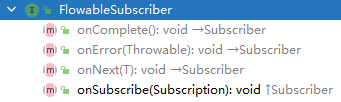

基于 `RxJava 2.0` 进行讲解。

## 1. 编程范式（`Programming paradigm`）

参考网址：`https://en.wikipedia.org/wiki/Programming_paradigm`

### 1.1 命令式编程（指令式编程，`Imperative programming`）

参考网址：`https://baike.baidu.com/item/指令式编程`

#### 1.1.1 过程式编程（程序式编程，`Procedural rogramming`）

参考网址：`https://baike.baidu.com/item/过程程序设计`

#### 1.1.2 面向对象编程（`Object Oriented Programming`）

参考网址：`https://baike.baidu.com/item/面向对象程序设计/24792`

### 1.2 声明式编程（Declarative programming）

参考网址：`https://baike.baidu.com/item/声明式编程`

#### 1.2.1 函数式编程（`Functional Programming`）

参考网址：`https://baike.baidu.com/item/函数式编程`

#### 1.2.2 逻辑式编程（`Logic programming`）

参考网址：`https://baike.baidu.com/item/逻辑编程/8281957`

#### 1.2.3 响应式编程（`Reactive Programming`）

参考网址：`https://baike.baidu.com/item/响应式编程`

## 2. 函数式编程

### 2.1 函数式编程的特性

#### 2.1.1 闭包和高阶函数

#### 2.1.2 惰性计算

#### 2.1.3 递归

#### 2.1.4 函数是 “第一等公民”

#### 2.1.5 只用 “表达式”，不用 “语句”

#### 2.1.6 没有 “副作用”

#### 2.1.7 不修改状态

#### 2.1.8 引用透明性

### 2.2 函数式编程的优点

#### 2.2.1 代码简洁，开发快速

#### 2.2.2 接近自然语言，易于理解

#### 2.2.3 更方便的代码管理

#### 2.2.4 易于 “并发编程”

#### 2.2.5 代码的热升级

## 3. `RxJava` 概述

### 3.1 `Rx` 介绍

`Rx` 即 `ReactiveX`（是 Reactive `Extensions` 的缩写）。

`Rx` 最初是 `LINQ`（`Language Integrated Queury`，语言集成查询）的一个扩展，由微软的架构师 `Erik Meijer `领导的团队开发，在2012年11月开源。

`Rx` 是一个编程模型，目标是提供一致的编程接口，帮助开发者更方便的处理异步数据流。

`Rx` 的大部分语言库由 `ReactiveX` 这个组织负责维护，比较流行的有 `RxJava`、`RxJS`、`Rx.NET`。

> 社区网站是 [reactivex.io](http://reactivex.io/)。

**`Rx` 的定义：**

```:no-line-numbers
微软给的定义是：
    Rx 是一个函数库，让开发者可以利用可观察序列和 LINQ 风格的查询操作符来编写异步和基于事件的程序。
    使用 Rx，开发者可以：
        1. 用 Observables 表示异步数据流，
        2. 用 LINQ 操作符查询异步数据流，
        3. 用 Schedulers 参数化异步数据流的并发处理。
    Rx 可以这样定义：Rx = Observables + LINQ + Schedulers。
```

```:no-line-numbers
reactivex.io 给的定义是：
    Rx 是一个使用可观察数据流进行异步编程的编程接口。
    Rx 结合了观察者模式、迭代器模式和函数式编程的精华。
```

> 简单来说：`Rx` 就是一个实现异步操作的库。

### 3.2 为什么要使用 `RxJava`

在没有 `RxJava` 之前，`Android` 开发时我们一般会使用 `AysncTask` 或 `Handler` + 线程池，来进行异步操作。但随着异步请求的数量越来越多，代码逻辑将会变得越来越复杂。

而使用 `RxJava`，即使异步请求增多，`RxJava` 也仍然能保持清晰简洁的逻辑。

### 3.3 `RxJava` 的使用场景

数据库的读写、大图片的载入、文件压缩/解压等各种需要放在后台工作的耗时操作，都可以用 `RxJava` 来实现。

### 3.5 `RxJava` 的依赖库

```groovy:no-line-numbers
implementation 'io.reactivex.rxjava2:rxjava:2.1.14'
implementation 'io.reactivex.rxjava2:rxandroid:2.0.2'
```

> `RxAndroid` 是 `RxJava` 在 `Android` 平台上的扩展。
> 
> `RxAndroid` 包含了一些能够简化 `Android` 开发的工具，比如特殊的线程调度器（`Scheduler`）。

## 4. `RxJava` 中的观察者（`Observer`）和被观察者（`Observable`）

`RxJava` 采用观察者模式实现异步操作。

在 `Rx` 中，一个观察者（`Observer`）订阅（`subscribe`）一个可观察对象（`Observable`）。`Observer` 接收 `Observable` 发射（`emit`）的数据或事件序列，并进行处理。

> 这种模式可以极大地简化并发操作，因为它创建了一个处于待命状态的 `Observer`，在未来某个时刻响应 `Observable` 的通知，不需要阻塞等待 `Observable` 发射（`emit`）数据后的结果。

被观察者（`Observable`）通过发射器（`Emitter`）发射（`emit`）数据和事件序列，同时通过操作符函数得到符合预期的数据和事件序列。

观察者（`Observer`）则提供相关的响应方法来接收并处理发射过来的数据和事件序列。

## 5. 五种被观察者（Observable/Maybe/Single/Completable/Flowable）

每种被观察者都对应有不同的观察者，当通过创建操作符（定义在被观察者中的 `create` 方法）获取被观察者对象时，不同的被观察者对象也会通过不同的发射器将数据或事件序列发射给对应的观察者。

`RxJava` 中的五种被观察者分别为：

1. `Observable`

    

    ```java:no-line-numbers
    对应的发射器为 ObservableEmitter，对应的观察者为 Observer

    数据和事件的发射及处理遵循如下规则：
        onSubscribe onNext* (onError | onComplete)?
    该规则描述了观察者 Observer 的响应流程，即：
    1. 先调用 Observer.onSubscribe(Disposable d)
    2. 再调用 Observer.onNext(T t)
        参数 T 表示发射过来的数据项
        onNext* 表示被观察者 Observable 可以发射 0 至 N 个数据项
    3. 最后调用 Observer.onError(Throwable e) 或者 Observer.onComplete()
        (onError | onComplete)? 表示被观察者 Observable：
            要么不发射事件；
            要么只发射 1 个 onError 事件；
            要么只发射 1 个 onComplete 事件。
        即：onError 和 onComplete 事件中发射了其中 1 个，另一个就不能发射出去了。
    ```
   
2. `Maybe`

    

    ```java:no-line-numbers
    对应的发射器为 MaybeEmitter，对应的观察者为 MaybeObserver

    数据和事件的发射及处理遵循如下规则：
        onSubscribe (onSuccess | onError | onComplete)?
    该规则描述了观察者 MaybeObserver 的响应流程，即：
    1. 先调用 MaybeObserver.onSubscribe(Disposable d)
    2. 再调用 MaybeObserver.onSuccess(T t) 或 MaybeObserver.onError(Throwable e) 或者 MaybeObserver.onComplete()
        参数 T 表示发射过来的数据项
        (onSuccess | onError | onComplete)? 表示被观察者 Maybe
            要么不发射数据或事件序列；
            要么只发射 1 个 数据项；
            要么只发射 1 个 onError 事件；
            要么只发射 1 个 onComplete 事件。
        即：发射了数据，就不能再发射事件。且，
            发射数据时，最多发射 1 个数据项；
            发射事件时，onError 和 onComplete 事件中发射了其中 1 个，另一个就不能发射出去了
    ```

3. `Single`

    

    ```java:no-line-numbers
     对应的发射器为 SingleEmitter，对应的观察者为 SingleObserver

    数据和事件的发射及处理遵循如下规则：
        onSubscribe (onSuccess | onError)?
    该规则描述了观察者 SingleObserver 的响应流程，即：
    1. 先调用 SingleObserver.onSubscribe(Disposable d)
    2. 再调用 SingleObserver.onSuccess(T t) 或 SingleObserver.onError(Throwable e)
        参数 T 表示发射过来的数据项
        (onSuccess | onError)? 表示被观察者 Single
            要么不发射数据或事件序列；
            要么只发射 1 个 数据项；
            要么只发射 1 个 onError 事件；
        即：发射了数据，就不能再发射事件。且，
            发射数据时，最多发射 1 个数据项；
            发射事件时，最多发射 1 个 onError 事件。
    ```

4. `Completable`

    

    ```java:no-line-numbers
    对应的发射器为 CompletableEmitter，对应的观察者为 CompletableObserver

    数据和事件的发射及处理遵循如下规则：
        onSubscribe (onError | onComplete)?
    该规则描述了观察者 CompletableObserver 的响应流程，即：
    1. 先调用 CompletableObserver.onSubscribe(Disposable d)
    2. 再调用 CompletableObserver.onError(Throwable e) 或者 CompletableObserver.onComplete()
        (onError | onComplete)? 表示被观察者 Completable
            要么不发射事件序列；
            要么只发射 1 个 onError 事件；
            要么只发射 1 个 onComplete 事件。
        即：不能发射数据，只能发射事件。且，
            发射事件时，onError 和 onComplete 事件中发射了其中 1 个，另一个就不能发射出去了。
    ```

5. `Flowable`

    

    ```java:no-line-numbers
    对应的发射器为 FlowableEmitter，对应的观察者为 FlowableSubscriber

    数据和事件的发射及处理遵循如下规则：
        onSubscribe onNext* (onError | onComplete)?
    该规则描述了观察者 FlowableSubscriber 的响应流程，即：
    1. 先调用 FlowableSubscriber.onSubscribe(Disposable d)
    2. 再调用 FlowableSubscriber.onNext(T t)
        参数 T 表示发射过来的数据项
        onNext* 表示被观察者 Flowable 可以发射 0 至 N 个数据项
    3. 最后调用 FlowableSubscriber.onError(Throwable e) 或者 FlowableSubscriber.onComplete()
        (onError | onComplete)? 表示被观察者 Flowable
            要么不发射事件；
            要么只发射 1 个 onError 事件；
            要么只发射 1 个 onComplete 事件。
        即：onError 和 onComplete 事件中发射了其中 1 个，另一个就不能发射出去了。
    ```

> 注意：
> 
> 1. `Maybe`、`Single`、`Completable` 可以看成是简化版的 `Observable`。
> 
> 2. `Observable` 和 `Flowable` 的区别是：`Observable` 不支持背压；`Flowable` 支持背压。

### 5.1 `Observable` 的基本用法
### 5.2 `Maybe` 的基本用法
### 5.3 `Single` 的基本用法
### 5.4 `Completable` 的基本用法
### 5.5 `Flowable` 的基本用法