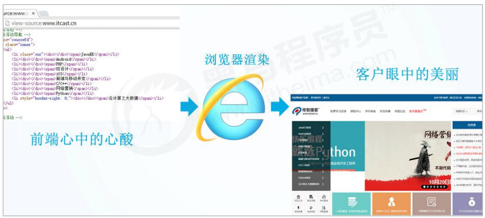
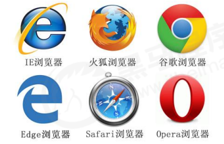
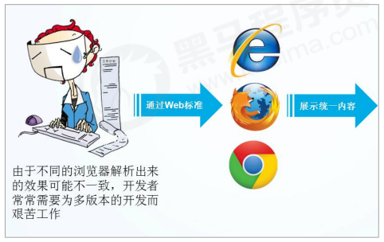
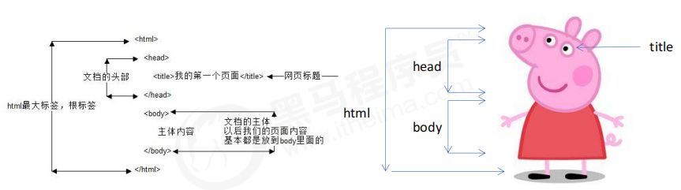
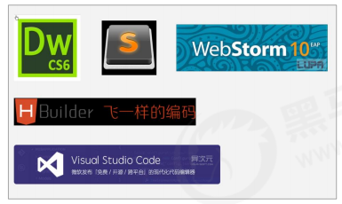
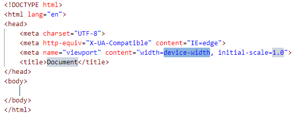

## 1. 网页

### 1.1 什么是网页

网页是构成网站的基本元素，它通常由图片、链接、文字、声音、视频等元素组成。通常我们看到的网页，常见以 `.htm` 或 `.html` 后缀结尾的文件，因此将其俗称为 `HTML` 文件。

### 1.2 什么是 `HTML`

`HTML` 指的是超文本标记语言 (`Hyper Text Markup Language`) ，它是用来描述网页的一种语言。

`HTML` 不是一种编程语言，而是一种标记语言 (`markup language`)。

标记语言是一套标记标签 (`markup tag`)。

**所谓超文本，有 `2` 层含义：**

1. 它（超文本）可以加入图片、声音、动画、多媒体等内容（超越了文本限制）
   
2. 它（超文本）还可以从一个文件跳转到另一个文件，与世界各地主机的文件连接（超级链接文本）

### 1.3 网页的形成

网页是由网页元素组成的，这些元素是利用 `html` 标签描述出来，然后通过浏览器解析来显示给用户的。



> 前端人员开发代码 -> 浏览器显示代码（解析、渲染）-> 生成最后的 `Web` 页面

### 1.4 总结

网页是图片、链接、文字、声音、视频等元素组成，其实就是一个 `html` 文件（后缀名为 `html`）。

网页生成制作: 由前端人员书写 `HTML` 文件，然后浏览器打开，就能看到了网页。

`HTML`: 超文本标记语言，用来制作网页的一门语言。由标签组成的，比如：图片标签、链接标签、视频标签等。

## 2. 浏览器

### 2.1 常用浏览器

浏览器是网页显示、运行的平台。

常用的浏览器有 `IE`、火狐（`Firefox`）、谷歌（`Chrome`）、`Safari` 和 `Opera` 等。

> 称为五大浏览器。



查看浏览器市场份额：[http://tongji.baidu.com/data/browser](http://tongji.baidu.com/data/browser)

### 2.2 浏览器内核

浏览器内核（渲染引擎）：负责读取网页内容，整理讯息，计算网页的显示方式并显示页面。

|**浏览器**|**内核**|**备注**|
|:-|:-|:-|
|`IE`|`Trident`|`IE`、猎豹安全、`360` 极速浏览器、百度浏览器|
|`firefox`|`Gecko`|火狐浏览器内核|
|`Safari`|`Webkit`|苹果浏览器内核|
|`chrome`/`Opera`|`Blink`|`chrome`/`opera` 浏览器内核。`Blink` 其实是 `WebKit` 的分支|

> 目前国内一般浏览器都会采用 `Webkit`/`Blink` 内核，如 `360`、`UC`、`QQ`、搜狗等。

## 3. `Web` 标准

`Web` 标准是由 `W3C` 组织和其他标准化组织制定的一系列标准的集合。

> `W3C`（万维网联盟）是国际最著名的标准化组织。

### 3.1 为什么需要 `Web` 标准

浏览器不同，它们显示页面或者排版就有些许差异。



遵循 `Web` 标准，除了可以让不同的开发人员写出的页面更标准、更统一外，还有以下优点：

1. 让 `Web` 的发展前景更广阔。
   
2. 内容能被更广泛的设备访问。
   
3. 更容易被搜寻引擎搜索。
   
4. 降低网站流量费用。
   
5. 使网站更易于维护。
   
6. 提高页面浏览速度。

### 3.2 `Web` 标准的构成

主要包括：结构（`Structure`）、表现（`Presentation`）和行为（`Behavior`）三个方面。

|**标准**|**说明**|
|:-|:-|
|结构|结构用于对**网页元素**进行整理和分类，现阶段主要学的是 `HTML`|
|表现|表现用于设置网页元素的版式、颜色、大小等**外观样式**，主要指的是 `CSS`|
|行为|行为是指网页模型的定义及**交互**的编写，现阶段主要学的是 `JavaScript`|

`Web` 标准提出的最佳体验方案：结构、样式、行为相分离。 

简单理解：结构写到 `HTML` 文件中，表现写到 `CSS` 文件中，行为写到 `JavaScript` 文件中。

## 4. `HTML` 语法规范

**基本语法概述：**

1. `HTML` 标签是由尖括号包围的关键词，例如 `<html>`。
   
2. `HTML` 标签通常是成对出现的，例如 `<html>` 和 `</html>` ，我们称为双标签。标签对中的第一个标签是开始标签，第二个标签是结束标签。

3. 有些特殊的标签必须是单个标签（极少情况），例如 `<br/>`，我们称为单标签。

**双标签关系可以分为两类：**

1. 包含关系

    ```html:no-line-numbers
    <head> 
        <title> </title> 
    </head>
    ```
   
2. 并列关系

    ```html:no-line-numbers
    <head> </head>
    <body> </body>
    ```

## 5. `HTML` 基本结构标签

每个网页都会有一个基本的结构标签（也称为骨架标签），页面内容也是在这些基本标签上书写。

> `HTML` 页面也称为 `HTML` 文档。

|**标签名**|**定义**|**说明**|
|:-|:-|:-|
|`<html></html>`|`HTML` 标签|页面中最大的标签，我们称为**根标签**|
|`<head></head>`|文档的头部|注意在 `head` 标签中我们必须要设置的标签是 `title`|
|`<title></title>`|文档的标题|让页面拥有一个属于自己的网页标题|
|`<body></body>`|文档的主体|元素包含文档的所有内容，页面内容基本都是放到 `body` 里面的|

**示例代码：**

```html:no-line-numbers
<html> 
    <head> 
        <title>我的第一个页面</title>
    </head>
    <body>
        你我之间，黑马洗练，月薪过万，一飞冲天 
    </body>
</html>
```

`HTML` 文档的的后缀名必须是 `.html` 或 `.htm`。

浏览器的作用是读取 `HTML` 文档，并以网页的形式显示出它们。此时，用浏览器打开这个网页，我们就可以预览我们写的第一个 `HTML` 文件了。

**总结：**



## 6. 网页开发工具



### 6.1 `VSCode` 的使用

注意事项：

1. 一定要保存为 `.html` 文件

2. 生成页面骨架结构的快捷方式：输入 `!` 按下 `Tab` 键。

    

3. 利用插件（`open in browser`）在浏览器中预览页面的方式：单击鼠标右键，在弹出窗口中点击 "`Open In Default Browser`"。

### 6.2 `VSCode` 生成骨架标签中的三个重要代码

#### 6.2.1 文档类型声明标签：`<!DOCTYPE>`

`<!DOCTYPE>` 文档类型声明，作用就是告诉浏览器使用哪种 `HTML` 版本来显示网页。

```html:no-line-numbers
<!-- 这句代码的意思是: 当前页面采取的是 HTML5 版本来显示网页 -->
<!DOCTYPE html>
```

注意: 

1. `<!DOCTYPE>` 声明位于文档中的最前面的位置，处于 `<html>` 标签之前。
   
2. `<!DOCTYPE>` 不是一个 `HTML` 标签，它就是文档类型声明标签。

#### 6.2.2 语言种类：`lang`

```html:no-line-numbers
<html lang="en">
```

`lang` 用来定义当前文档显示的语言：

1. `en` 定义语言为英语
   
2. `zh-CN` 定义语言为中文
   
简单来说：定义为 `en` 就是英文网页, 定义为 `zh-CN` 就是中文网页。

> 其实对于文档显示来说，定义成 `en` 的文档也可以显示中文，定义成 `zh-CN` 的文档也可以显示英文。
> 
> 这个属性对浏览器和搜索引擎（百度、谷歌等）还是有作用的。

#### 6.2.3 字符集：`charset`

```html:no-line-numbers
<head>
    <meta charset="UTF-8">
</head>
```

字符集（`Character set`）是多个字符的集合。以便计算机能够识别和存储各种文字。 

在 `<head>` 标签内，可以通过 `<meta>` 标签的 `charset` 属性来规定 `HTML` 文档应该使用哪种字符编码。

`charset` 常用的值有：`GB2312`、`BIG5`、`GBK` 和 `UTF-8`。其中 `UTF-8` 也被称为**万国码**，即：基本包含了全世界所有国家需要用到的字符。

注意：必须要在 `html` 文档中指定字符集，否则可能引起乱码的情况。一般情况下，统一使用 "`UTF-8`" 编码。

> 尽量统一写成标准的 "`UTF-8`"，不要写成 `"utf8`" 或 "`UTF8`"。

## 7. `HTML` 常用标签

## 8. `HTML` 中的注释和特殊字符